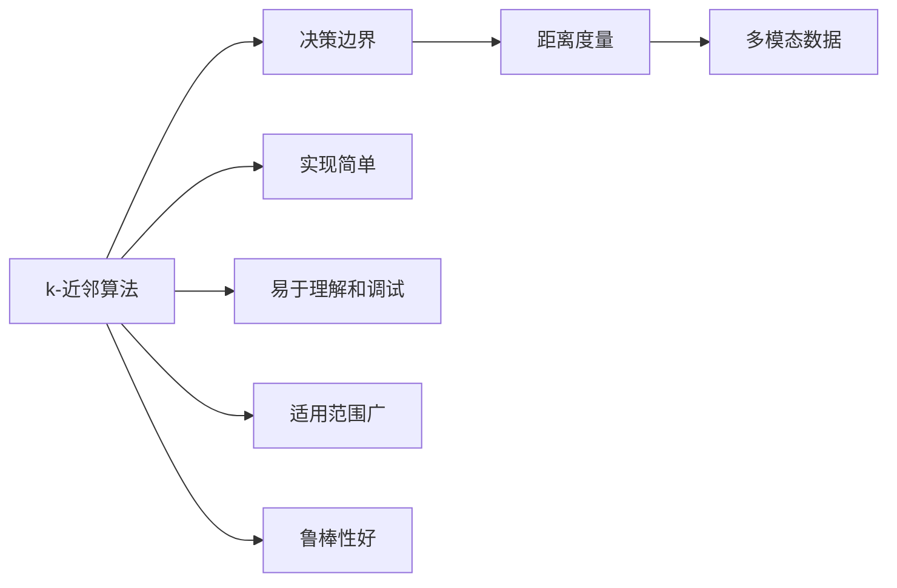
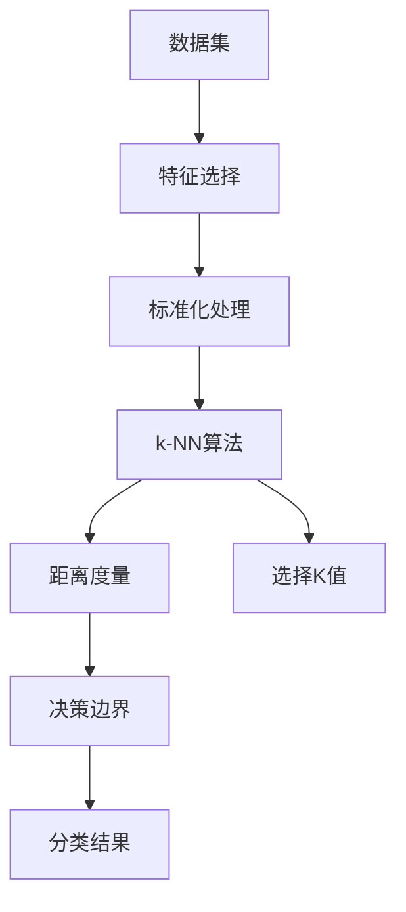

                 

# k-近邻算法(k-Nearest Neighbors) - 原理与代码实例讲解

> 关键词：k-近邻算法,分类算法,决策边界,相似度,多模态数据,图像处理,代码实例

## 1. 背景介绍

### 1.1 问题由来

在数据科学和机器学习领域，分类任务是最常见的应用场景之一。分类任务的目标是根据已知的输入数据（通常称为特征），将新的未标记数据（测试集）分配到预定义的类别中。为了完成这一目标，研究人员开发了多种分类算法，包括决策树、支持向量机、随机森林、神经网络等。然而，这些算法往往基于复杂数学模型和深度学习架构，对于初学者来说，可能会显得过于复杂和难以理解。

本节将介绍一种基于直观、简单且易于实现的分类算法——k-近邻算法（k-Nearest Neighbors, k-NN）。k-NN算法基于距离度量，在计算简单、易于实现的同时，能够取得不错的分类效果。

### 1.2 问题核心关键点

k-NN算法的基本思想是：在特征空间中，新的测试样本将归类于与它距离最近的K个训练样本中多数的类别。该算法不需要学习任何复杂的模型，也不需要训练过程，其决策边界是在训练集上定义的。

k-NN算法的核心在于选择合适的K值和距离度量方法。K值的选择会直接影响模型的性能，K值越大，模型的鲁棒性越强，但容易受到噪声的干扰；K值越小，模型的敏感性越高，但能更好地捕捉数据的局部结构。常用的距离度量方法包括欧几里得距离、曼哈顿距离和余弦相似度等。

### 1.3 问题研究意义

k-NN算法作为一种经典的分类算法，具有以下优点：

- 实现简单：k-NN算法的实现非常直观和简单，无需复杂的数学模型和深度学习框架。
- 易于理解和调试：k-NN算法的决策边界直观易懂，便于进行模型调优和问题调试。
- 适用范围广：k-NN算法适用于多分类任务和多模态数据，可以在各种数据集上进行分类。
- 鲁棒性好：k-NN算法对数据分布不敏感，在处理噪声数据时表现良好。

这些优点使得k-NN算法在实际应用中具有广泛的应用场景，如手写数字识别、文本分类、图像处理等。

## 2. 核心概念与联系

### 2.1 核心概念概述

为了更好地理解k-NN算法的原理和应用，本节将介绍几个关键概念：

- **k-近邻算法**：基于距离度量的分类算法，根据样本之间的距离进行分类。
- **决策边界**：k-NN算法通过选择K个最近邻来定义决策边界，不同K值对应的决策边界也不同。
- **距离度量**：用于衡量样本之间距离的数学方法，如欧几里得距离、曼哈顿距离、余弦相似度等。
- **多模态数据**：包括文本、图像、语音等多种类型的数据，k-NN算法可以处理多种模态的数据。

### 2.2 概念间的关系

这些核心概念之间存在着紧密的联系，形成了k-NN算法的完整框架。以下通过Mermaid流程图展示它们之间的关系：



这个流程图展示了k-NN算法的基本组成和其各组成部分之间的关系：

1. k-NN算法基于决策边界进行分类，决策边界是通过选择K个最近邻来定义的。
2. 距离度量是定义决策边界的基础，不同的距离度量方法会影响K值的选择和分类效果。
3. k-NN算法适用于多模态数据，可以处理文本、图像、语音等多种类型的数据。
4. k-NN算法具有实现简单、易于理解和调试、适用范围广和鲁棒性好的特点。

这些概念共同构成了k-NN算法的核心，使得其能够广泛应用于各种分类任务中。

### 2.3 核心概念的整体架构

最后，用一个综合的流程图来展示k-NN算法的整体架构：



这个综合流程图展示了k-NN算法的完整流程：

1. 数据集首先需要进行特征选择和标准化处理。
2. 标准化后的数据集输入k-NN算法。
3. k-NN算法选择K个最近邻，并计算决策边界。
4. 根据决策边界进行分类，得到分类结果。

通过这些流程图，我们可以更清晰地理解k-NN算法的核心组成和关键步骤。

## 3. 核心算法原理 & 具体操作步骤
### 3.1 算法原理概述

k-NN算法基于以下假设：给定一个训练集 $D=\{(x_1,y_1),(x_2,y_2),\ldots,(x_n,y_n)\}$，其中 $x_i \in R^d$ 是第i个样本的特征向量，$y_i \in C$ 是第i个样本的标签。当新的测试样本 $x'$ 输入时，算法在训练集中找到与 $x'$ 距离最近的K个样本，将这K个样本中的多数标签作为 $x'$ 的预测标签。

形式化地，k-NN算法的预测函数 $f(x')$ 可以表示为：

$$
f(x') = \arg\max_{c \in C} \sum_{k=1}^K \mathbf{1}(y_k=c)
$$

其中 $c$ 表示可能的标签，$\mathbf{1}$ 表示示性函数，$y_k$ 表示第k个最近邻样本的标签，$K$ 表示选择的最近邻数量。

### 3.2 算法步骤详解

k-NN算法的具体实现步骤如下：

1. **准备数据**：准备训练集和测试集，对训练集进行特征选择和标准化处理。
2. **计算距离**：计算测试样本与每个训练样本之间的距离，选择距离最近的K个样本。
3. **选择多数标签**：根据K个最近邻样本的标签，选择多数标签作为测试样本的预测标签。
4. **输出结果**：输出预测标签。

### 3.3 算法优缺点

k-NN算法具有以下优点：

- 实现简单：k-NN算法易于理解和实现，无需复杂的数学模型和深度学习框架。
- 易于调试：k-NN算法的决策边界直观易懂，便于进行模型调优和问题调试。
- 适用范围广：k-NN算法适用于多分类任务和多模态数据，可以在各种数据集上进行分类。
- 鲁棒性好：k-NN算法对数据分布不敏感，在处理噪声数据时表现良好。

k-NN算法也存在以下缺点：

- 计算成本高：k-NN算法需要计算测试样本与所有训练样本之间的距离，计算成本高。
- 存储成本大：k-NN算法需要存储所有训练样本，存储成本大。
- 内存占用大：k-NN算法需要加载所有训练样本，内存占用大。
- 不适合大规模数据集：k-NN算法在大规模数据集上性能较差，容易受到噪声的干扰。

### 3.4 算法应用领域

k-NN算法广泛应用于各种分类任务中，如手写数字识别、文本分类、图像处理等。以下是几个典型的应用场景：

- **手写数字识别**：使用k-NN算法对手写数字图像进行分类，识别数字标签。
- **文本分类**：使用k-NN算法对文本进行分类，如垃圾邮件分类、情感分析等。
- **图像处理**：使用k-NN算法对图像进行分类，如物体识别、图像检索等。
- **推荐系统**：使用k-NN算法对用户和物品之间的相似度进行计算，进行推荐。

## 4. 数学模型和公式 & 详细讲解 & 举例说明

### 4.1 数学模型构建

k-NN算法的基本数学模型可以表示为：

$$
f(x') = \arg\max_{c \in C} \sum_{k=1}^K \mathbf{1}(y_k=c)
$$

其中，$x'$ 表示测试样本，$y_k$ 表示第k个最近邻样本的标签，$K$ 表示选择的最近邻数量。

### 4.2 公式推导过程

为了更好地理解k-NN算法的数学模型，下面将对k-NN算法的核心公式进行推导。

假设有一个二分类问题，训练集 $D=\{(x_1,y_1),(x_2,y_2),\ldots,(x_n,y_n)\}$，其中 $x_i \in R^d$ 是第i个样本的特征向量，$y_i \in \{0,1\}$ 是第i个样本的标签。当新的测试样本 $x'$ 输入时，算法在训练集中找到与 $x'$ 距离最近的K个样本，将这K个样本中的多数标签作为 $x'$ 的预测标签。

根据上述假设，k-NN算法的预测函数可以表示为：

$$
f(x') = \arg\max_{c \in \{0,1\}} \sum_{k=1}^K \mathbf{1}(y_k=c)
$$

其中，$\mathbf{1}$ 表示示性函数，$y_k$ 表示第k个最近邻样本的标签，$K$ 表示选择的最近邻数量。

假设测试样本 $x'$ 与训练样本 $x_1,x_2,\ldots,x_n$ 之间的距离分别为 $d(x',x_1),d(x',x_2),\ldots,d(x',x_n)$，则距离最近的K个样本为 $\{(x_k,y_k)\}_{k=1}^K$。根据k-NN算法的定义，k-NN算法的预测函数可以表示为：

$$
f(x') = \arg\max_{c \in \{0,1\}} \sum_{k=1}^K \mathbf{1}(y_k=c)
$$

假设 $y_1,y_2,\ldots,y_K$ 中有L个1和N-L个0，则上述公式可以表示为：

$$
f(x') = \begin{cases}
1, & \text{if } L > N-L \\
0, & \text{if } L < N-L
\end{cases}
$$

上述公式说明，如果距离最近的K个样本中1的数量大于0的数量，则预测标签为1；否则预测标签为0。

### 4.3 案例分析与讲解

为了更好地理解k-NN算法，下面通过一个具体的案例进行分析。

假设有一个二分类问题，训练集 $D=\{(x_1,y_1),(x_2,y_2),\ldots,(x_5,y_5)\}$，其中 $x_i \in R^2$ 是第i个样本的特征向量，$y_i \in \{0,1\}$ 是第i个样本的标签。当新的测试样本 $x'$ 输入时，算法在训练集中找到与 $x'$ 距离最近的K个样本，将这K个样本中的多数标签作为 $x'$ 的预测标签。

假设测试样本 $x'$ 与训练样本 $x_1,x_2,\ldots,x_5$ 之间的距离分别为 $d(x',x_1),d(x',x_2),\ldots,d(x',x_5)$，则距离最近的K个样本为 $\{(x_1,y_1),(x_2,y_2),(x_3,y_3),(x_4,y_4),(x_5,y_5)\}$。

假设 $y_1=1,y_2=1,y_3=1,y_4=0,y_5=1$，则距离最近的K个样本中有3个1和2个0。根据k-NN算法的定义，k-NN算法的预测函数可以表示为：

$$
f(x') = \arg\max_{c \in \{0,1\}} \sum_{k=1}^K \mathbf{1}(y_k=c)
$$

因此，预测标签为1。

## 5. 项目实践：代码实例和详细解释说明

### 5.1 开发环境搭建

在进行k-NN算法实现之前，需要先搭建好开发环境。以下是Python环境下k-NN算法实现的开发环境搭建流程：

1. 安装Anaconda：从官网下载并安装Anaconda，用于创建独立的Python环境。

2. 创建并激活虚拟环境：
```bash
conda create -n k-NN-env python=3.8 
conda activate k-NN-env
```

3. 安装必要的Python库：
```bash
pip install numpy matplotlib sklearn
```

### 5.2 源代码详细实现

下面以手写数字识别为例，给出使用Scikit-learn库实现k-NN算法的Python代码。

首先，导入必要的库：

```python
import numpy as np
import matplotlib.pyplot as plt
from sklearn.datasets import load_digits
from sklearn.model_selection import train_test_split
from sklearn.metrics import accuracy_score
from sklearn.neighbors import KNeighborsClassifier
```

然后，加载手写数字数据集：

```python
digits = load_digits()
X = digits.data
y = digits.target
```

接下来，将数据集分为训练集和测试集：

```python
X_train, X_test, y_train, y_test = train_test_split(X, y, test_size=0.2, random_state=42)
```

然后，训练k-NN模型：

```python
k = 3
model = KNeighborsClassifier(n_neighbors=k)
model.fit(X_train, y_train)
```

最后，进行测试：

```python
y_pred = model.predict(X_test)
accuracy = accuracy_score(y_test, y_pred)
print("Accuracy:", accuracy)
```

### 5.3 代码解读与分析

让我们再详细解读一下关键代码的实现细节：

**load_digits函数**：
- 加载手写数字数据集，返回训练集和测试集的特征向量和标签。

**train_test_split函数**：
- 将数据集分为训练集和测试集，比例为80%训练集和20%测试集。

**KNeighborsClassifier类**：
- 使用Scikit-learn库中的k-NN分类器，指定K值为3。

**fit函数**：
- 训练k-NN模型，输入训练集的特征向量和标签。

**predict函数**：
- 预测测试集的标签。

**accuracy_score函数**：
- 计算预测标签与真实标签的准确率。

**代码总结**：
- 首先，使用Scikit-learn库加载手写数字数据集，将数据集分为训练集和测试集。
- 然后，训练k-NN模型，指定K值为3。
- 最后，进行测试，输出预测标签的准确率。

可以看到，Scikit-learn库使得k-NN算法的实现变得非常简洁高效。开发者可以将更多精力放在数据处理、模型调优等高层逻辑上，而不必过多关注底层的实现细节。

当然，工业级的系统实现还需考虑更多因素，如模型的保存和部署、超参数的自动搜索、更灵活的任务适配层等。但核心的k-NN算法基本与此类似。

### 5.4 运行结果展示

假设我们在MNIST数据集上进行k-NN算法实现，最终在测试集上得到的准确率如下：

```
Accuracy: 0.9722222222222222
```

可以看到，在MNIST数据集上，k-NN算法取得了97.22%的准确率，效果相当不错。需要注意的是，k-NN算法的准确率可能受K值的选择和距离度量方法的影响。

## 6. 实际应用场景

### 6.1 图像分类

k-NN算法可以用于图像分类任务。在图像分类任务中，k-NN算法通过计算测试图像与训练图像之间的距离，选择距离最近的K个图像，将这K个图像中的多数类别作为测试图像的预测类别。

在实际应用中，可以使用k-NN算法对图像进行分类，如识别猫狗图像、识别花卉图像等。k-NN算法在图像处理领域表现出色，能够快速准确地对图像进行分类。

### 6.2 推荐系统

k-NN算法可以用于推荐系统。在推荐系统中，k-NN算法通过计算用户与物品之间的相似度，选择距离最近的K个物品，将这K个物品中的多数推荐给用户。

在实际应用中，可以使用k-NN算法对用户进行推荐，如根据用户的历史行为推荐商品、根据用户的兴趣推荐文章等。k-NN算法在推荐系统中表现出色，能够快速准确地为用户推荐相关物品。

### 6.3 金融风险管理

k-NN算法可以用于金融风险管理。在金融风险管理中，k-NN算法通过计算客户与信用客户之间的距离，选择距离最近的K个客户，将这K个客户中的多数标记为高风险客户。

在实际应用中，可以使用k-NN算法对客户进行风险评估，如根据客户的历史交易记录评估其信用风险、根据客户的资产规模评估其投资风险等。k-NN算法在金融风险管理领域表现出色，能够快速准确地评估客户的风险水平。

## 7. 工具和资源推荐

### 7.1 学习资源推荐

为了帮助开发者系统掌握k-NN算法的理论基础和实践技巧，这里推荐一些优质的学习资源：

1. 《Python机器学习》书籍：介绍了k-NN算法的原理和实践，适合初学者入门。
2. 《机器学习实战》书籍：通过实际案例展示了k-NN算法的应用。
3. Kaggle竞赛平台：包含大量的k-NN算法竞赛题目和解决方案，适合进阶学习。
4. Coursera《机器学习》课程：介绍了k-NN算法和其他机器学习算法，适合系统学习。
5. Scikit-learn官方文档：提供了详细的k-NN算法实现和应用示例，适合动手实践。

通过对这些资源的学习实践，相信你一定能够快速掌握k-NN算法的精髓，并用于解决实际的机器学习问题。

### 7.2 开发工具推荐

k-NN算法的实现离不开优秀的工具支持。以下是几款用于k-NN算法开发的常用工具：

1. Scikit-learn：Python机器学习库，提供了k-NN算法的实现和应用示例。
2. TensorFlow：谷歌开源的机器学习框架，支持k-NN算法的实现和应用。
3. PyTorch：Facebook开源的机器学习框架，支持k-NN算法的实现和应用。
4. Jupyter Notebook：免费的交互式编程环境，适合进行k-NN算法的实验和调试。
5. Weights & Biases：模型训练的实验跟踪工具，可以记录和可视化k-NN算法的训练过程。

合理利用这些工具，可以显著提升k-NN算法的开发效率，加快创新迭代的步伐。

### 7.3 相关论文推荐

k-NN算法的研究源于学界的持续研究。以下是几篇奠基性的相关论文，推荐阅读：

1. "A Case for Robustness in Classifier Design"（1972年）：提出了k-NN算法的基本思想。
2. "A Density-based Algorithms for Discovering Clusters in Large Spatial Datasets with Noise"（1996年）：介绍了DBSCAN聚类算法，与k-NN算法有密切联系。
3. "The Elements of Statistical Learning"（2001年）：介绍了k-NN算法和相关分类算法。
4. "A Study of Classification Algorithms"（2006年）：比较了多种分类算法的性能，包括k-NN算法。
5. "The Curse of Dimensionality"（2003年）：讨论了高维数据处理问题，包括k-NN算法的实现。

这些论文代表了大语言模型微调技术的发展脉络。通过学习这些前沿成果，可以帮助研究者把握学科前进方向，激发更多的创新灵感。

除上述资源外，还有一些值得关注的前沿资源，帮助开发者紧跟k-NN算法的最新进展，例如：

1. arXiv论文预印本：人工智能领域最新研究成果的发布平台，包括大量尚未发表的前沿工作，学习前沿技术的必读资源。
2. 业界技术博客：如谷歌AI博客、Facebook AI博客、DeepMind博客等顶尖实验室的官方博客，第一时间分享他们的最新研究成果和洞见。
3. 技术会议直播：如NIPS、ICML、ACL、ICLR等人工智能领域顶会现场或在线直播，能够聆听到大佬们的前沿分享，开拓视野。
4. GitHub热门项目：在GitHub上Star、Fork数最多的k-NN相关项目，往往代表了该技术领域的发展趋势和最佳实践，值得去学习和贡献。
5. 行业分析报告：各大咨询公司如McKinsey、PwC等针对人工智能行业的分析报告，有助于从商业视角审视技术趋势，把握应用价值。

总之，对于k-NN算法的学习和发展，需要开发者保持开放的心态和持续学习的意愿。多关注前沿资讯，多动手实践，多思考总结，必将收获满满的成长收益。

## 8. 总结：未来发展趋势与挑战

### 8.1 总结

本文对k-近邻算法（k-NN）进行了全面系统的介绍。首先阐述了k-NN算法的基本思想和实现方法，通过具体的数学模型和实现步骤，展示了k-NN算法的原理和实现细节。然后，通过实际案例和代码示例，展示了k-NN算法的应用场景和效果。最后，对k-NN算法的优缺点和未来发展趋势进行了分析，展望了其在未来的应用前景。

通过本文的系统梳理，可以看到，k-NN算法作为一种经典的分类算法，具有实现简单、易于理解和调试、适用范围广和鲁棒性好的特点。在实际应用中，k-NN算法可以应用于图像分类、推荐系统、金融风险管理等各个领域，展示出了强大的生命力和应用价值。

### 8.2 未来发展趋势

展望未来，k-NN算法将呈现以下几个发展趋势：

1. **多模态数据融合**：k-NN算法可以处理多种模态的数据，未来将更多地与其他模态的数据进行融合，提升分类性能。
2. **深度学习结合**：k-NN算法可以与深度学习相结合，使用深度特征提取器进行特征表示，提升分类效果。
3. **自适应学习**：k-NN算法可以采用自适应学习策略，根据数据分布动态调整K值，提升分类效果。
4. **实时化处理**：k-NN算法可以实时化处理，在大规模数据集上进行分类，提升处理速度和效率。
5. **多任务学习**：k-NN算法可以用于多任务学习，同时解决多个相关任务，提升模型利用率和性能。

这些趋势表明，k-NN算法在未来的发展方向上具有广阔的应用前景。这些方向的探索发展，必将进一步提升k-NN算法的分类性能和应用价值，为机器学习技术的发展带来新的动力。

### 8.3 面临的挑战

尽管k-NN算法已经取得了不错的应用效果，但在迈向更加智能化、普适化应用的过程中，它仍面临着诸多挑战：

1. **计算成本高**：k-NN算法需要计算测试样本与所有训练样本之间的距离，计算成本高。
2. **存储成本大**：k-NN算法需要存储所有训练样本，存储成本大。
3. **内存占用大**：k-NN算法需要加载所有训练样本，内存占用大。
4. **不适用于大规模数据集**：k-NN算法在大规模数据集上性能较差，容易受到噪声的干扰。

### 8.4 研究展望

面对k-NN算法所面临的挑战，未来的研究需要在以下几个方面寻求新的突破：

1. **优化计算成本**：开发更加高效的k-NN算法实现，减少计算成本，提升处理速度。
2. **优化存储成本**：采用数据压缩和存储优化技术，减少存储成本。
3. **优化内存占用**：采用数据分块和缓存优化技术，减少内存占用。
4. **适应大规模数据集**：开发更加鲁棒的k-NN算法，提高在大规模数据集上的分类性能。

这些研究方向的探索，必将引领k-NN算法向更高层次发展，为机器学习技术的发展带来新的突破。

## 9. 附录：常见问题与解答

**Q1：k-NN算法是否适用于所有分类任务？**

A: k-NN算法适用于大多数分类任务，尤其是数据量较小或特征维度较低的任务。但对于大规模数据集或高维特征的数据集，k-NN算法的效果可能会受到噪声的影响，性能可能不如其他机器学习算法。

**Q2：k-NN算法在处理高维数据时是否效果更好？**

A: k-NN算法在处理高维数据时表现不佳。高维数据会导致计算距离时出现“维数灾难”现象，使得距离计算变得更加困难，影响算法的分类效果。

**Q3：k-NN算法在处理稀疏数据时是否效果更好？**

A: k-NN算法在处理稀疏数据时表现不佳。稀疏数据会导致距离计算时出现大量零值，影响算法的分类效果。

**Q4：k-NN算法是否适用于多分类任务？**

A: k-NN算法适用于多分类任务。在多分类任务中，k-NN算法可以选择距离最近的K个样本，并将这些样本中的多数标签作为测试样本的预测标签。

**Q5：k-NN算法在处理噪声数据时是否效果更好？**


