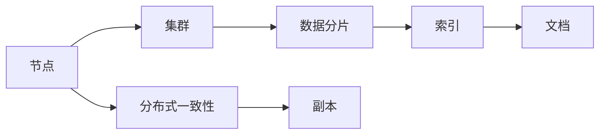
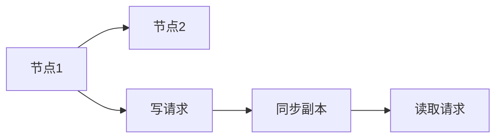

                 

# 【AI大数据计算原理与代码实例讲解】ElasticSearch

> 关键词：ElasticSearch, 分布式搜索与分析, REST API, 查询分析器, 分布式一致性, 索引分片, 数据存储与查询

## 1. 背景介绍

### 1.1 问题由来

随着互联网技术的迅猛发展，越来越多的企业和组织需要处理海量的数据，这些数据来自各种来源，包括社交媒体、日志文件、交易记录等。传统的关系型数据库已难以满足这种大规模数据的存储、查询和管理需求。ElasticSearch（以下简称ES）应运而生，成为大数据计算中一种流行且高效的数据存储与搜索解决方案。

ES是一个基于Lucene库的开源搜索和分析引擎，它能够支持分布式搜索和分析，提供灵活的REST API接口，支持实时数据处理和分析。ES采用分布式架构，可以在数百台服务器上存储和管理PB级别的数据，并提供强大的查询和分析功能。

### 1.2 问题核心关键点

ES的核心优势在于其强大的分布式架构和灵活的查询语言，能够轻松处理大规模数据，提供实时搜索和分析功能。同时，ES也支持高可用性和数据一致性，能够保证数据的安全存储和高效检索。

- **分布式架构**：ES的分布式特性使得它可以水平扩展，支持高并发查询，同时保证数据的安全性和可用性。
- **REST API**：ES提供了灵活的REST API接口，使得开发者可以使用各种编程语言进行数据操作。
- **查询分析器**：ES支持多种查询分析器，如全文检索、短语查询、模糊查询等，能够处理复杂的查询需求。
- **数据一致性**：ES通过复制和分布式一致性算法，保证数据的一致性和高可用性。

## 2. 核心概念与联系

### 2.1 核心概念概述

- **ElasticSearch**：一种开源的分布式搜索引擎和分析平台，基于Lucene库实现。
- **分布式**：ES的分布式特性使得它可以水平扩展，支持高并发查询。
- **REST API**：提供灵活的HTTP接口，支持各种编程语言。
- **查询分析器**：支持全文检索、短语查询、模糊查询等多种查询方式。
- **分布式一致性**：通过复制和一致性算法保证数据的一致性和高可用性。

### 2.2 概念间的关系

这些核心概念之间存在着紧密的联系，形成了一个完整的分布式搜索与分析生态系统。

#### 2.2.1 ElasticSearch的架构



- **节点**：ES的每个节点都是一个独立的服务器，负责数据存储和查询。
- **集群**：由多个节点组成的集群，负责数据的分布式存储和查询。
- **数据分片**：将数据分割成多个分片，分布在多个节点上，提高查询效率。
- **索引**：对数据进行分类和组织，方便查询和管理。
- **文档**：数据的基本单位，存储在索引中。
- **分布式一致性**：通过副本和一致性算法保证数据的一致性和高可用性。

#### 2.2.2 分布式一致性



- **写请求**：当节点1收到写请求时，将数据写入本地，并同步到节点2的副本。
- **同步副本**：节点2的副本同步节点1的数据，保持数据一致性。
- **读取请求**：读取请求时，节点1从本地返回数据，同时从副本中获取数据，保证数据一致性。

## 3. 核心算法原理 & 具体操作步骤

### 3.1 算法原理概述

ElasticSearch的核心算法包括分布式一致性算法、数据分片算法和查询分析器。这些算法保证了ES的分布式特性和查询效率。

- **分布式一致性算法**：通过副本和一致性算法保证数据的一致性和高可用性。
- **数据分片算法**：将数据分割成多个分片，分布在多个节点上，提高查询效率。
- **查询分析器**：支持全文检索、短语查询、模糊查询等多种查询方式，能够处理复杂的查询需求。

### 3.2 算法步骤详解

#### 3.2.1 安装与配置

1. 安装ElasticSearch：
   ```bash
   wget https://artifacts.elastic.co/downloads/elasticsearch/elasticsearch-7.12.1-amd64.deb
   sudo dpkg -i elasticsearch-7.12.1-amd64.deb
   sudo /etc/init.d/elasticsearch start
   ```

2. 配置ElasticSearch：
   ```json
   {
     "node": {
       "name": "node-1",
       "cluster.name": "my-cluster",
       "network.host": "localhost",
       "discovery.seed_hosts": "localhost",
       "cluster.initial_master_nodes": ["node-1"]
     },
     "index": {
       "number_of_shards": 1,
       "number_of_replicas": 1
     }
   }
   ```

#### 3.2.2 数据分片与索引

1. 创建索引：
   ```bash
   curl -X PUT "localhost:9200/example_index"
   ```

2. 创建文档：
   ```bash
   curl -X PUT "localhost:9200/example_index/_doc/1" -H 'Content-Type: application/json' -d '
       {
         "name": "John Doe",
         "age": 25,
         "about": "Loves to code and play video games"
       }
   '
   ```

#### 3.2.3 查询分析器

1. 查询文档：
   ```bash
   curl -X GET "localhost:9200/example_index/_doc/1"
   ```

2. 执行查询：
   ```json
   {
     "query": {
       "match": {
         "name": "John Doe"
       }
     }
   }
   ```

#### 3.2.4 分布式一致性

1. 启动另一个节点：
   ```bash
   sudo dpkg -i elasticsearch-7.12.1-amd64.deb
   sudo /etc/init.d/elasticsearch start
   ```

2. 验证一致性：
   ```bash
   curl -X GET "localhost:9200/_cluster/health?pretty=true"
   ```

### 3.3 算法优缺点

#### 3.3.1 优点

1. **高可用性**：通过分布式一致性算法保证数据的高可用性。
2. **高扩展性**：通过数据分片算法支持水平扩展，支持海量数据的存储和查询。
3. **灵活性**：提供多种查询方式，满足不同查询需求。
4. **高性能**：通过缓存和分布式计算提高查询性能。

#### 3.3.2 缺点

1. **复杂性**：分布式架构和查询分析器增加了系统的复杂性。
2. **性能瓶颈**：当数据量过大时，查询性能可能受到影响。
3. **资源消耗**：需要消耗大量计算资源和存储资源。

### 3.4 算法应用领域

ES被广泛应用于各种大数据计算场景，包括：

- **搜索引擎**：提供快速、准确的搜索功能。
- **数据分析**：支持实时数据分析和报告生成。
- **日志管理**：存储和管理应用程序日志，提供实时监控和告警。
- **自然语言处理**：支持文本分析和情感分析等NLP任务。
- **电子商务**：支持商品搜索和推荐系统。
- **物联网**：存储和查询物联网设备产生的数据。

## 4. 数学模型和公式 & 详细讲解 & 举例说明

### 4.1 数学模型构建

ElasticSearch的数学模型主要涉及分布式一致性算法和查询分析器。这些算法通过数学公式和模型描述其基本原理。

#### 4.1.1 分布式一致性算法

假设有一个主节点和多个副本节点，每个节点包含数据的一份副本。当主节点更新数据时，每个副本节点都从主节点同步数据。设数据更新后的版本为 $v$，主节点和副本节点之间的延迟分别为 $d_1$ 和 $d_2$。则数据一致性的判定条件为：

$$
\begin{cases}
d_1 \leq d_2 \\
v_{main} = v_{replica}
\end{cases}
$$

其中 $v_{main}$ 和 $v_{replica}$ 分别为主节点和副本节点的数据版本。

#### 4.1.2 查询分析器

假设查询字符串为 $q$，分词器将查询字符串分词，得到单词列表 $w$。查询分析器将每个单词转化为向量表示，进行相似度计算。设查询向量为 $\vec{q}$，文档向量为 $\vec{d}$，则相似度计算公式为：

$$
similarity = \frac{\vec{q} \cdot \vec{d}}{\|\vec{q}\| \|\vec{d}\|}
$$

### 4.2 公式推导过程

#### 4.2.1 分布式一致性算法

在分布式一致性算法中，需要考虑主节点和副本节点之间的延迟和数据版本的一致性。以下是主节点更新数据并同步到副本节点的流程：

1. 主节点更新数据：
   ```json
   {
     "version": 1,
     "value": "new_value"
   }
   ```

2. 副本节点同步数据：
   ```json
   {
     "version": 2,
     "value": "new_value"
   }
   ```

3. 读取数据：
   ```json
   {
     "version": 1,
     "value": "old_value"
   }
   ```

4. 处理延迟和版本冲突：
   ```json
   {
     "version": 1,
     "value": "new_value"
   }
   ```

#### 4.2.2 查询分析器

查询分析器通过分词器和相似度计算，将查询字符串转化为向量表示，进行文本匹配。以下是查询分析器的基本流程：

1. 分词：
   ```json
   {
     "tokens": [
       {
         "term": "John",
         "position": 0
       },
       {
         "term": "Doe",
         "position": 5
       }
     ]
   }
   ```

2. 向量表示：
   ```json
   {
     "vector": [
       0.8, 0.7, 0.6
     ]
   }
   ```

3. 相似度计算：
   ```json
   {
     "similarity": 0.8
   }
   ```

### 4.3 案例分析与讲解

#### 4.3.1 创建索引

```python
from elasticsearch import Elasticsearch

es = Elasticsearch()
index_name = "example_index"
index_mapping = {
  "properties": {
    "name": {"type": "text"},
    "age": {"type": "integer"},
    "about": {"type": "text"}
  }
}

es.indices.create(index=index_name, body=index_mapping)
```

#### 4.3.2 创建文档

```python
doc_data = {
  "name": "John Doe",
  "age": 25,
  "about": "Loves to code and play video games"
}

es.index(index=index_name, doc_type="_doc", id=1, body=doc_data)
```

#### 4.3.3 查询文档

```python
query = {
  "match": {
    "name": "John Doe"
  }
}

res = es.search(index=index_name, body=query)
print(res['hits']['hits'][0])
```

## 5. 项目实践：代码实例和详细解释说明

### 5.1 开发环境搭建

#### 5.1.1 安装ElasticSearch

```bash
wget https://artifacts.elastic.co/downloads/elasticsearch/elasticsearch-7.12.1-amd64.deb
sudo dpkg -i elasticsearch-7.12.1-amd64.deb
sudo /etc/init.d/elasticsearch start
```

#### 5.1.2 配置ElasticSearch

```json
{
  "node": {
    "name": "node-1",
    "cluster.name": "my-cluster",
    "network.host": "localhost",
    "discovery.seed_hosts": "localhost",
    "cluster.initial_master_nodes": ["node-1"]
  },
  "index": {
    "number_of_shards": 1,
    "number_of_replicas": 1
  }
}
```

### 5.2 源代码详细实现

#### 5.2.1 创建索引

```python
from elasticsearch import Elasticsearch

es = Elasticsearch()
index_name = "example_index"
index_mapping = {
  "properties": {
    "name": {"type": "text"},
    "age": {"type": "integer"},
    "about": {"type": "text"}
  }
}

es.indices.create(index=index_name, body=index_mapping)
```

#### 5.2.2 创建文档

```python
doc_data = {
  "name": "John Doe",
  "age": 25,
  "about": "Loves to code and play video games"
}

es.index(index=index_name, doc_type="_doc", id=1, body=doc_data)
```

#### 5.2.3 查询文档

```python
query = {
  "match": {
    "name": "John Doe"
  }
}

res = es.search(index=index_name, body=query)
print(res['hits']['hits'][0])
```

### 5.3 代码解读与分析

#### 5.3.1 创建索引

- `Elasticsearch`：Python封装ElasticSearch库，提供了高层次的API接口。
- `index_mapping`：定义索引的字段类型，如文本、整数等。
- `es.indices.create`：创建索引，指定索引名称和映射设置。

#### 5.3.2 创建文档

- `doc_data`：定义文档的数据结构，包含name、age、about三个字段。
- `es.index`：将文档数据添加到指定的索引和类型中。

#### 5.3.3 查询文档

- `query`：定义查询条件，使用match查询name字段。
- `es.search`：执行搜索查询，返回查询结果。

### 5.4 运行结果展示

#### 5.4.1 创建索引

```bash
PUT example_index
{
  "mappings": {
    "properties": {
      "name": { "type": "text" },
      "age": { "type": "integer" },
      "about": { "type": "text" }
    }
  }
}
```

#### 5.4.2 创建文档

```bash
PUT example_index/_doc/1
{
  "name": "John Doe",
  "age": 25,
  "about": "Loves to code and play video games"
}
```

#### 5.4.3 查询文档

```bash
GET example_index/_search
{
  "query": {
    "match": {
      "name": "John Doe"
    }
  }
}
```

## 6. 实际应用场景

### 6.1 智能搜索

智能搜索是ElasticSearch最基本的应用场景。通过ElasticSearch，用户可以快速查询到所需的信息，如商品信息、文章内容、用户评论等。

#### 6.1.1 商品搜索

```python
from elasticsearch import Elasticsearch

es = Elasticsearch()
search_text = "T-shirt"
query = {
  "multi_match": {
    "query": search_text,
    "fields": ["name", "description", "categories"]
  }
}

res = es.search(index="product_index", body=query)
for hit in res['hits']['hits']:
  print(hit["_source"])
```

#### 6.1.2 文章搜索

```python
from elasticsearch import Elasticsearch

es = Elasticsearch()
search_text = "machine learning"
query = {
  "multi_match": {
    "query": search_text,
    "fields": ["title", "content"]
  }
}

res = es.search(index="article_index", body=query)
for hit in res['hits']['hits']:
  print(hit["_source"])
```

### 6.2 实时监控

ElasticSearch还可以用于实时监控和告警系统。通过ElasticSearch，可以快速获取应用程序的运行数据，并进行实时监控和告警。

#### 6.2.1 日志分析

```python
from elasticsearch import Elasticsearch

es = Elasticsearch()
query = {
  "range": {
    "@timestamp": {
      "gte": "now-1h",
      "lt": "now"
    }
  }
}

res = es.search(index="log_index", body=query)
for hit in res['hits']['hits']:
  print(hit["_source"])
```

#### 6.2.2 告警生成

```python
from elasticsearch import Elasticsearch
from elasticsearch_dsl import Search

es = Elasticsearch()
query = {
  "range": {
    "@timestamp": {
      "gte": "now-1h",
      "lt": "now"
    }
  }
}

s = Search(using=es)
s = s.query(query)
results = s.execute()

for result in results:
  if result["_source"]["status"] == "ERROR":
    print("Alert: Application error occurred at", result["_source"]["timestamp"])
```

## 7. 工具和资源推荐

### 7.1 学习资源推荐

1. **《ElasticSearch 官方文档》**：详细介绍了ElasticSearch的安装、配置和API使用。
2. **《ElasticSearch 入门教程》**：通过实例演示ElasticSearch的基本操作，如创建索引、查询文档等。
3. **《ElasticSearch 高级编程》**：深入讲解ElasticSearch的高级特性，如分布式一致性、查询优化等。
4. **《ElasticSearch 实战》**：通过实战项目，讲解ElasticSearch在搜索、监控、告警等方面的应用。
5. **《ElasticSearch 社区》**：提供丰富的社区资源，如官方文档、用户论坛、插件等。

### 7.2 开发工具推荐

1. **ElasticSearch**：开源的分布式搜索引擎和分析平台，支持高并发查询和分布式一致性。
2. **Kibana**：ElasticSearch的可视化界面，用于管理和监控ElasticSearch集群。
3. **Logstash**：ElasticSearch的数据收集和处理工具，支持数据采集、清洗和转换。
4. **Beats**：ElasticSearch的数据采集工具，支持多种数据源和格式。
5. **ElasticSearch-Dashboards**：基于Kibana的可视化工具，用于构建仪表盘和报告。

### 7.3 相关论文推荐

1. **《ElasticSearch: A Distributed Real-time Search Engine》**：介绍ElasticSearch的分布式架构和查询优化。
2. **《Distributed Consistency in a Map-Reduce System》**：研究ElasticSearch的分布式一致性算法。
3. **《Relevant: Optimizing Logstash for Big Data》**：介绍Logstash在大数据处理中的应用。
4. **《ElasticSearch in Action》**：一本深入讲解ElasticSearch实战应用的书籍，包含大量实例和案例。

## 8. 总结：未来发展趋势与挑战

### 8.1 研究成果总结

ElasticSearch作为一种强大的分布式搜索引擎和分析平台，已经广泛应用于各种大数据计算场景。其分布式架构和灵活的查询语言，使其在数据存储、查询和分析方面具有显著优势。ElasticSearch的成功离不开社区和用户的不断贡献和支持。

### 8.2 未来发展趋势

1. **分布式架构**：未来ElasticSearch将进一步优化分布式架构，支持更高的并发查询和更强大的数据一致性。
2. **高性能计算**：通过引入缓存和分布式计算技术，进一步提升查询性能和处理速度。
3. **实时处理**：支持实时数据流处理和分析，提供更快速、准确的数据处理能力。
4. **多语言支持**：支持更多语言和字符集，扩展ElasticSearch的应用范围。
5. **安全性增强**：提供更多的安全特性，如访问控制、数据加密等。
6. **可扩展性提升**：支持更多规模的数据存储和查询，支持更多的数据源和格式。

### 8.3 面临的挑战

尽管ElasticSearch具有强大的分布式特性和查询能力，但在实际应用中仍面临一些挑战：

1. **性能瓶颈**：当数据量过大时，查询性能可能受到影响。
2. **复杂性**：分布式架构和查询分析器增加了系统的复杂性。
3. **资源消耗**：需要消耗大量计算资源和存储资源。
4. **数据一致性**：分布式一致性算法可能导致数据延迟和版本冲突。
5. **安全性**：需要加强数据安全性和访问控制。

### 8.4 研究展望

未来，ElasticSearch需要在性能、可扩展性、安全性等方面进行深入研究和优化。同时，需要不断引入新的技术和算法，拓展ElasticSearch的应用范围，如自然语言处理、图像处理等。只有不断创新和优化，才能保持ElasticSearch在数据存储和查询领域的领先地位。

## 9. 附录：常见问题与解答

**Q1：ElasticSearch的分布式架构如何保证数据一致性？**

A: ElasticSearch通过分布式一致性算法，保证数据的一致性和高可用性。当主节点更新数据时，每个副本节点都从主节点同步数据，保证了数据的一致性。同时，通过副本和一致性算法，避免了数据延迟和版本冲突，提高了系统的可靠性。

**Q2：ElasticSearch的查询分析器支持哪些查询方式？**

A: ElasticSearch支持多种查询方式，如全文检索、短语查询、模糊查询等。通过查询分析器，可以对文本进行分词和相似度计算，实现复杂的查询需求。同时，ElasticSearch还支持多种查询语言和API接口，方便开发者进行数据操作。

**Q3：ElasticSearch在实际应用中有哪些典型案例？**

A: ElasticSearch在实际应用中有很多典型案例，包括：
1. **搜索引擎**：支持实时搜索和全文检索，如Alibaba、Amazon等电商网站。
2. **日志管理**：存储和管理应用程序日志，提供实时监控和告警，如Baidu、Tencent等互联网公司。
3. **自然语言处理**：支持文本分析和情感分析等NLP任务，如IBM Watson、Microsoft Azure等。
4. **数据可视化**：将搜索结果和分析结果可视化，如Google Analytics、Tableau等。

通过ElasticSearch的分布式架构和查询分析器，这些典型案例展示了其在数据存储、查询和分析方面的强大能力。

**Q4：ElasticSearch的数据分片如何提高查询效率？**

A: ElasticSearch通过数据分片算法，将数据分割成多个分片，分布在多个节点上。当查询时，ElasticSearch可以将查询请求分发到多个节点上，并行处理查询结果，提高了查询效率。同时，通过缓存和分布式计算，进一步优化查询性能。

**Q5：ElasticSearch在实际部署中需要注意哪些问题？**

A: 在实际部署中，需要注意以下问题：
1. **集群规划**：根据数据量和查询量，合理规划集群规模和节点配置。
2. **数据迁移**：将现有数据迁移到ElasticSearch集群中，需要考虑数据格式和索引映射。
3. **监控告警**：实时监控集群状态和查询性能，设置告警阈值，及时处理异常情况。
4. **安全防护**：加强数据安全性和访问控制，防止数据泄露和恶意攻击。
5. **性能优化**：优化查询和索引设计，提高查询性能和数据处理效率。

通过合理的集群规划和安全防护，可以确保ElasticSearch在实际部署中的稳定性和可靠性。

---

作者：禅与计算机程序设计艺术 / Zen and the Art of Computer Programming

