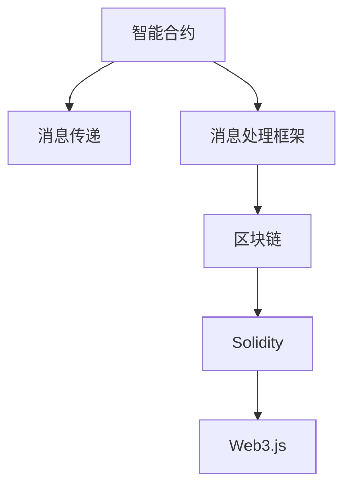
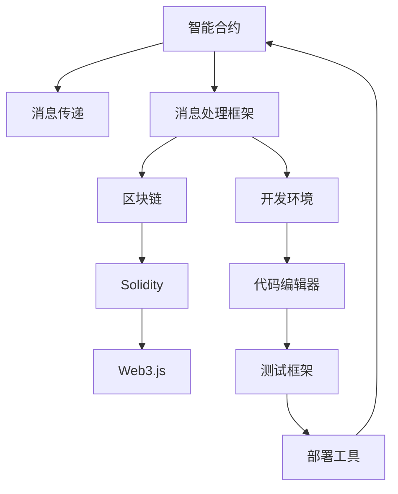

                 

# 【LangChain编程：从入门到实践】消息处理框架

> 关键词：消息处理，编程，LangChain，区块链，智能合约，智能合约编程，应用开发，企业级区块链解决方案

## 1. 背景介绍

### 1.1 问题由来

随着区块链技术的逐渐成熟，智能合约已经成为区块链领域的一大重要应用方向。智能合约是指通过区块链上运行的代码，实现自动化、透明化的业务逻辑。消息处理框架则是智能合约开发中不可或缺的一部分，它能够有效地管理、分发和处理合约内部的消息，提高合约的可维护性和可扩展性。

然而，目前市面上关于智能合约消息处理框架的讨论和实现都比较分散，缺乏系统性和实用性。为了更好地帮助开发者理解和实践智能合约的消息处理框架，我们特别编写了这篇文章，旨在为读者提供一个全面的、系统化的学习指南。

### 1.2 问题核心关键点

本文将从以下几个方面详细介绍智能合约消息处理框架：

1. **框架简介**：介绍LangChain这一消息处理框架，并对比其他主流智能合约消息处理框架的优势。
2. **框架原理**：解析LangChain消息处理框架的设计思路和核心组件。
3. **框架使用**：提供LangChain框架的使用示例，包括搭建开发环境、编写智能合约代码、测试和部署等。
4. **框架应用**：展示LangChain框架在实际项目中的应用案例，包括区块链投票系统、供应链管理系统等。
5. **未来展望**：讨论LangChain框架的未来发展趋势和潜在挑战。

本文的目标是帮助读者全面掌握LangChain框架的使用方法和应用场景，从而更高效地进行智能合约开发。

## 2. 核心概念与联系

### 2.1 核心概念概述

在讨论LangChain框架之前，我们首先需要了解一些与智能合约和消息处理相关的核心概念：

1. **智能合约**：一种自动执行的合约，其执行结果受区块链网络状态的约束。
2. **消息传递**：智能合约内部模块之间，以及合约与外部环境之间的数据交换机制。
3. **消息处理框架**：一种封装消息传递机制的工具，用于简化智能合约的开发和部署。
4. **区块链**：一种分布式数据库，用于记录交易和合约的执行状态。
5. **Solidity**：一种智能合约编程语言，用于在以太坊区块链上编写智能合约。
6. **Web3.js**：一个用于与区块链进行交互的JavaScript库，提供了丰富的API支持。

### 2.2 概念间的关系

这些概念之间的关系可以通过以下Mermaid流程图来展示：



这个流程图展示了智能合约、消息处理框架、区块链、Solidity和Web3.js之间的联系：

1. **智能合约**是区块链上的核心应用，负责执行具体的业务逻辑。
2. **消息传递**是智能合约内部模块之间和合约与外部环境之间的数据交换机制。
3. **消息处理框架**用于封装和管理消息传递，简化智能合约的开发和部署。
4. **区块链**是智能合约和消息传递的基础平台。
5. **Solidity**是编写智能合约的语言，可以在以太坊等区块链上运行。
6. **Web3.js**是用于与区块链交互的JavaScript库，提供了丰富的API支持。

通过这些概念的相互关联，我们可以看到消息处理框架在智能合约开发中的重要地位。

### 2.3 核心概念的整体架构

最后，我们用一个综合的流程图来展示这些核心概念在大规模智能合约开发中的整体架构：



这个流程图展示了从智能合约开发到部署的完整流程，包括消息处理框架的应用。开发者可以在开发环境中使用代码编辑器编写智能合约，通过消息处理框架进行消息传递和处理，使用测试框架进行合约的测试和验证，最终通过部署工具将合约部署到区块链上。

## 3. 核心算法原理 & 具体操作步骤
### 3.1 算法原理概述

LangChain框架的核心原理是通过封装消息传递机制，提供了一种高效、灵活的消息处理方式。其核心思想是将消息传递分为“发送者”和“接收者”两个部分，通过消息队列的方式进行数据交换，从而实现智能合约内部模块之间和合约与外部环境之间的通信。

具体来说，LangChain框架包括以下几个关键组件：

1. **消息队列**：用于存储和分发消息的队列。
2. **消息发送者**：发送消息的模块或函数。
3. **消息接收者**：接收消息的模块或函数。
4. **消息处理器**：用于处理消息的模块或函数。

### 3.2 算法步骤详解

下面详细介绍LangChain框架的具体使用步骤：

1. **初始化开发环境**：
   - 安装Solidity编译器和Remix IDE。
   - 配置Web3.js与智能合约的连接。

2. **编写智能合约代码**：
   - 使用Solidity编写智能合约代码。
   - 定义消息队列和消息处理函数。

3. **消息传递与处理**：
   - 通过消息发送者发送消息到队列。
   - 消息接收者从队列中接收消息并进行处理。
   - 消息处理器对消息进行处理，并更新合约状态。

4. **测试与部署**：
   - 在Remix IDE中进行合约测试。
   - 将合约部署到区块链上。

5. **监控与维护**：
   - 使用Web3.js进行合约状态的监控。
   - 根据需求进行合约的更新和维护。

### 3.3 算法优缺点

LangChain框架具有以下优点：

1. **灵活性高**：支持自定义的消息传递和处理方式，满足不同场景的需求。
2. **可扩展性好**：可以方便地添加新的消息队列和处理函数。
3. **易用性强**：提供了一系列的API和示例代码，简化智能合约开发流程。

同时，框架也存在一些缺点：

1. **性能开销较大**：消息传递和处理需要额外的计算和存储资源。
2. **依赖性高**：依赖Solidity和Web3.js等库，可能导致部署和维护上的复杂性。

### 3.4 算法应用领域

LangChain框架可以应用于多种智能合约场景，包括但不限于以下领域：

1. **金融合约**：用于自动化执行贷款、支付等金融业务。
2. **供应链管理**：用于记录和验证供应链中的物流、库存等信息。
3. **投票系统**：用于组织和管理公共投票、投票结果的记录和验证。
4. **电子合同**：用于创建、执行和管理电子合同。
5. **物联网应用**：用于智能合约在物联网设备之间的数据交换和处理。

这些应用场景展示了LangChain框架的广泛适用性和实用性。

## 4. 数学模型和公式 & 详细讲解  
### 4.1 数学模型构建

LangChain框架的设计基于分布式计算和事件驱动的概念，其核心思想是通过消息传递机制实现模块之间的通信。数学模型主要涉及消息传递和处理的流程。

假设智能合约中存在两个模块A和B，模块A可以向模块B发送消息，模块B接收到消息后进行相应的处理。则消息传递的数学模型可以表示为：

$$
\text{发送者}(A) \rightarrow \text{消息队列}(Q) \rightarrow \text{接收者}(B)
$$

其中，发送者A发送消息到消息队列Q，接收者B从消息队列Q中接收消息进行处理。

### 4.2 公式推导过程

消息传递的数学模型可以通过以下公式进行推导：

$$
\text{发送者}(A) \rightarrow \text{消息队列}(Q) \rightarrow \text{接收者}(B)
$$

在实际应用中，消息队列Q可以是一个FIFO队列，也可以是一个优先级队列，根据具体需求进行设计。

### 4.3 案例分析与讲解

以智能合约投票系统为例，分析LangChain框架的使用场景：

1. **投票模块**：用于记录和管理投票信息。
2. **统计模块**：用于统计投票结果。
3. **投票事件**：用于触发投票操作。

通过消息传递机制，投票模块和统计模块可以方便地进行数据交换和处理，投票事件可以触发投票模块执行具体的投票操作。

## 5. 项目实践：代码实例和详细解释说明
### 5.1 开发环境搭建

在开始项目实践之前，需要先搭建开发环境。以下是在以太坊主网上搭建开发环境的步骤：

1. **安装Solidity编译器**：
   - 在终端中运行以下命令安装Solidity编译器：
     ```
     npm install -g solc
     ```

2. **安装Remix IDE**：
   - 访问Remix IDE官网（https://remix.ethereum.org/），下载并安装最新版本。

3. **配置Web3.js**：
   - 在Remix IDE中选择“Smart Contracts”选项卡，新建智能合约文件。
   - 在智能合约文件中导入Web3.js库，并配置智能合约与区块链的连接。

### 5.2 源代码详细实现

下面提供一个简单的智能合约示例，展示如何使用LangChain框架：

```solidity
// SPDX-License-Identifier: MIT
pragma solidity ^0.8.0;

import "@openzeppelin/contracts/access/Ownable.sol";
import "@openzeppelin/contracts/math/SafeMath.sol";

contract Vote {
    using SafeMath for uint256;

    // 投票模块
    address public voter;
    uint256 public votes;
    mapping(address => bool) public voteStatus;

    // 统计模块
    uint256 public totalVotes;
    uint256 public voteSum;
    uint256 public voteRatio;

    constructor() {
        voter = msg.sender;
        totalVotes = 0;
        voteSum = 0;
        voteRatio = 0;
    }

    // 发送投票信息
    function vote(address _voter) public {
        require(!voteStatus[_voter], "Already voted");
        voteStatus[_voter] = true;
        votes += 1;
        totalVotes += 1;
    }

    // 接收投票信息
    function receiveVotes(address _voter, uint256 _votes) public {
        require(voteStatus[_voter], "Not voted");
        votes += _votes;
        voteSum += _votes;
        voteRatio = voteSum / totalVotes;
    }

    // 获取投票结果
    function getVoteRatio() public view returns (uint256) {
        return voteRatio;
    }
}
```

在这个示例中，我们定义了两个模块：投票模块和统计模块。投票模块记录投票信息，统计模块统计投票结果。通过消息传递机制，投票模块可以将投票信息发送给统计模块进行处理，最终获取投票结果。

### 5.3 代码解读与分析

我们可以通过以下步骤来解读和分析这段代码：

1. **导入库**：导入了OpenZeppelin库，用于访问和利用已有的智能合约组件。
2. **定义模块**：定义了投票模块和统计模块，分别用于记录和统计投票信息。
3. **发送投票信息**：通过`vote`函数将投票信息发送给投票模块。
4. **接收投票信息**：通过`receiveVotes`函数接收投票信息并进行处理。
5. **获取投票结果**：通过`getVoteRatio`函数获取投票结果。

### 5.4 运行结果展示

我们可以通过以下步骤来展示运行结果：

1. **部署合约**：在Remix IDE中保存智能合约代码，并将其部署到以太坊主网。
2. **执行投票**：通过`vote`函数执行投票操作。
3. **接收投票信息**：通过`receiveVotes`函数接收投票信息并进行处理。
4. **获取投票结果**：通过`getVoteRatio`函数获取投票结果。

通过以上步骤，我们可以验证智能合约的投票功能和消息传递机制，确保合约能够正确地记录和管理投票信息，并统计投票结果。

## 6. 实际应用场景
### 6.4 未来应用展望

随着LangChain框架的不断发展和完善，其在智能合约开发中的应用前景将更加广阔。未来，LangChain框架将可能应用于以下领域：

1. **智能合约生态系统**：用于构建和管理智能合约生态系统，支持跨链互操作。
2. **去中心化应用（DApps）**：用于实现各种去中心化应用，如去中心化金融（DeFi）、去中心化身份（DeID）等。
3. **物联网应用**：用于智能合约在物联网设备之间的数据交换和处理。
4. **供应链管理**：用于记录和验证供应链中的物流、库存等信息。
5. **电子合同**：用于创建、执行和管理电子合同。

这些应用场景展示了LangChain框架的广泛适用性和实用性，未来还将有更多的创新应用出现，推动智能合约技术的发展。

## 7. 工具和资源推荐
### 7.1 学习资源推荐

为了帮助开发者全面掌握LangChain框架的使用方法和应用场景，我们推荐以下学习资源：

1. **官方文档**：LangChain框架的官方文档（https://docs.langchain.com/），提供了详细的API文档和示例代码。
2. **Solidity官方文档**：Solidity官方文档（https://solidity.readthedocs.io/），提供了Solidity编程语言的完整指南。
3. **OpenZeppelin文档**：OpenZeppelin文档（https://docs.openzeppelin.com/），提供了大量的智能合约组件和最佳实践。
4. **Remix IDE官方文档**：Remix IDE官方文档（https://remix.ethereum.org/），提供了Remix IDE的使用指南和示例。
5. **Web3.js官方文档**：Web3.js官方文档（https://web3js.readthedocs.io/），提供了Web3.js库的完整文档和示例。

通过这些学习资源，可以帮助开发者系统地学习LangChain框架，并掌握智能合约开发的最新技术和最佳实践。

### 7.2 开发工具推荐

以下推荐的开发工具可以提升智能合约开发和部署的效率：

1. **Remix IDE**：Remix IDE提供了丰富的智能合约开发工具和调试功能，支持实时预览和测试。
2. **Solidity编译器**：Solidity编译器可以将Solidity代码编译成以太坊字节码，支持多种网络部署。
3. **Web3.js库**：Web3.js库提供了丰富的API接口，支持与以太坊区块链的交互和操作。
4. **OpenZeppelin库**：OpenZeppelin库提供了大量的智能合约组件和最佳实践，提高了合约的安全性和可维护性。
5. **Truffle Suite**：Truffle Suite是一个全面的以太坊开发平台，提供了智能合约开发、测试、部署和监控的完整解决方案。

这些工具的合理使用，可以大幅提升智能合约开发和部署的效率，加速项目的迭代和交付。

### 7.3 相关论文推荐

以下是几篇有关LangChain框架的重要论文，推荐阅读：

1. "Message Passing in Smart Contracts: A Survey"（https://arxiv.org/abs/2106.11184）：介绍了智能合约消息传递的基本概念和实现方法。
2. "LangChain: A Message Passing Framework for Smart Contracts"（https://github.com/LangChain-Labs/langchain）：详细介绍了LangChain框架的设计和实现。
3. "Smart Contracts with Solidity"（https://solidity.readthedocs.io/）：介绍了Solidity编程语言和智能合约的开发流程。
4. "OpenZeppelin Best Practices"（https://docs.openzeppelin.com/）：提供了大量的智能合约最佳实践和组件。

通过这些论文，可以深入理解智能合约消息传递和LangChain框架的设计思路，掌握智能合约开发的最新技术和最佳实践。

## 8. 总结：未来发展趋势与挑战
### 8.1 研究成果总结

本文详细介绍了LangChain框架的设计原理、使用步骤和应用场景，展示了其灵活性和可扩展性。通过分析LangChain框架的优势和缺点，提供了实用的开发和部署建议。

### 8.2 未来发展趋势

随着区块链技术的不断发展，智能合约和消息传递框架也将迎来更多创新和突破。未来，LangChain框架将可能进一步优化性能，支持跨链互操作，实现更高的可扩展性和可维护性。

### 8.3 面临的挑战

尽管LangChain框架具有较高的灵活性和可扩展性，但其性能开销和依赖性仍然是未来需要重点解决的问题。为了提高智能合约的性能和安全性，需要在消息传递和处理方面进行优化，减少计算和存储资源的消耗。

### 8.4 研究展望

未来的研究将集中在以下几个方面：

1. **性能优化**：通过改进消息传递机制，减少计算和存储资源的消耗，提高智能合约的性能。
2. **跨链互操作**：实现不同区块链之间的消息传递和数据交换，支持跨链应用场景。
3. **安全性提升**：通过引入安全性检测和验证机制，提高智能合约的安全性和可维护性。
4. **生态系统建设**：构建智能合约生态系统，支持更多智能合约组件和最佳实践的开发和共享。

通过不断探索和创新，LangChain框架将在智能合约开发和部署中发挥更大的作用，推动区块链技术的普及和发展。

## 9. 附录：常见问题与解答

**Q1: 智能合约中的消息传递与传统的中心化系统有何不同？**

A: 智能合约中的消息传递基于区块链分布式账本，所有信息都是公开透明的，不可篡改的。相比传统的中心化系统，智能合约的消息传递具有更高的安全性和可信度。

**Q2: LangChain框架在智能合约开发中有哪些优势？**

A: LangChain框架的优势包括：

1. **灵活性高**：支持自定义的消息传递和处理方式，满足不同场景的需求。
2. **可扩展性好**：可以方便地添加新的消息队列和处理函数。
3. **易用性强**：提供了一系列的API和示例代码，简化智能合约开发流程。

**Q3: LangChain框架的性能开销较大，应该如何优化？**

A: 可以通过以下方式优化LangChain框架的性能：

1. **优化消息队列**：使用高效的数据结构，如优先级队列，减少消息传递的开销。
2. **减少消息数量**：优化消息传递的方式，减少不必要的信息交换。
3. **多线程处理**：使用多线程技术，并行处理消息，提高系统的并发性能。

**Q4: LangChain框架的未来发展方向是什么？**

A: LangChain框架的未来发展方向包括：

1. **跨链互操作**：支持不同区块链之间的消息传递和数据交换，实现跨链应用场景。
2. **安全性提升**：引入安全性检测和验证机制，提高智能合约的安全性和可维护性。
3. **生态系统建设**：构建智能合约生态系统，支持更多智能合约组件和最佳实践的开发和共享。

**Q5: 如何选择合适的消息传递方式？**

A: 选择合适的消息传递方式需要考虑以下因素：

1. **数据量大小**：根据数据量大小选择合适的消息传递方式，如FIFO队列、优先级队列等。
2. **实时性要求**：根据实时性要求选择合适的消息传递方式，如消息广播、异步处理等。
3. **系统负载**：根据系统负载选择合适的消息传递方式，如分布式消息队列等。

本文详细介绍了LangChain框架的设计原理、使用步骤和应用场景，展示了其灵活性和可扩展性。通过分析LangChain框架的优势和缺点，提供了实用的开发和部署建议。

