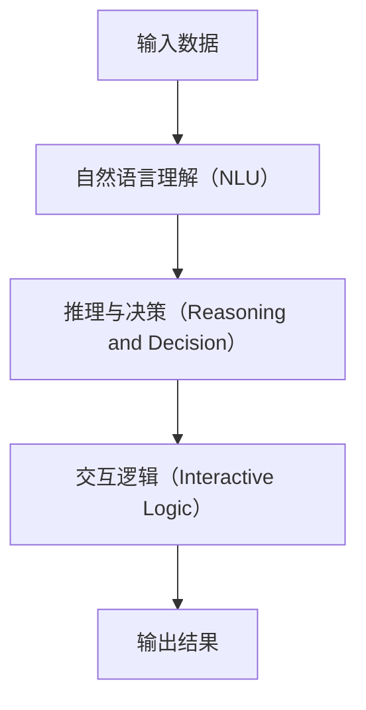
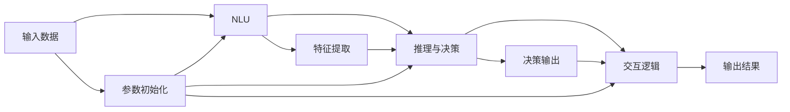

                 

# 【大模型应用开发 动手做AI Agent】什么是Functions

## 1. 背景介绍

在当今人工智能(AI)领域，大模型（Big Models）正在迅速崛起，成为推动技术进步和创新的重要力量。这些大模型如BERT、GPT-3等，以其巨大的参数量和先进的架构，展示了强大的学习和推理能力。然而，在实际应用中，如何高效地开发和使用这些大模型，仍然是一个不小的挑战。本文将重点探讨一种关键的编程工具——函数（Functions），它在AI Agent的开发中扮演着重要的角色。

## 2. 核心概念与联系

### 2.1 核心概念概述

函数（Functions）是大模型应用开发中不可或缺的工具，它是一种将一系列操作封装为一个单元的方式，以便于复用和扩展。在AI Agent开发中，函数通常用于定义模型的行为和交互逻辑，使得模型能够执行特定的任务，如自然语言理解、推理、决策等。

- **自然语言理解（NLU）**：指模型对人类语言的理解和处理，包括分词、词性标注、命名实体识别等。
- **推理与决策（Reasoning and Decision）**：指模型根据输入的上下文信息，进行逻辑推理和决策，例如生成文本、推荐系统等。
- **交互逻辑（Interactive Logic）**：指模型如何与外界进行交互，包括接收输入、发出响应、更新状态等。

这些概念之间通过函数相联系，形成了AI Agent的核心功能。下面，我们将通过一个简单的例子来进一步说明。

### 2.2 核心概念关系

为了更好地理解这些概念之间的关系，我们可以使用Mermaid语法绘制一个简单的流程图：



这个流程图展示了AI Agent的基本工作流程。输入数据通过自然语言理解模块进行处理，生成模型内部表示；然后，推理与决策模块根据内部表示进行逻辑推理和决策；最后，交互逻辑模块将结果输出到外界。

### 2.3 核心概念的整体架构

我们将这些核心概念整合在一起，形成了一个完整的AI Agent架构：



在这个架构中，参数初始化模块负责设置模型的初始参数；特征提取模块从输入数据中提取有意义的特征；决策输出模块根据特征进行推理和决策；而交互逻辑模块则负责与外界进行交互。

## 3. 核心算法原理 & 具体操作步骤

### 3.1 算法原理概述

函数作为AI Agent开发的核心工具，其实现原理相对简单，主要涉及以下几个步骤：

1. **输入定义**：定义函数接收的输入参数，包括模型的输入数据、模型的参数等。
2. **内部处理**：在函数内部，执行一系列操作，如模型推理、参数更新等。
3. **返回结果**：根据处理结果，返回相应的输出，包括模型的内部表示、推理结果、交互结果等。

### 3.2 算法步骤详解

以下是一个简单的函数示例，用于对输入的文本进行简单的情感分析：

```python
def sentiment_analysis(text):
    # 假设这里有一个预训练的模型BERT
    model = BertModel.from_pretrained('bert-base-uncased')
    tokenizer = BertTokenizer.from_pretrained('bert-base-uncased')

    # 将文本分词
    tokens = tokenizer.encode(text, add_special_tokens=True)

    # 将分词后的结果输入模型
    with torch.no_grad():
        outputs = model(tokens)

    # 获取模型的预测结果
    logits = outputs[0]

    # 计算情感得分
    sentiment_score = logits[0, 2] - logits[0, 1]

    return sentiment_score
```

在这个函数中，我们首先定义了一个名为`sentiment_analysis`的函数，接收一个文本参数`text`。函数内部，我们使用BERT模型对输入文本进行分词和编码，然后将编码后的结果输入模型进行推理，最后计算情感得分并返回结果。

### 3.3 算法优缺点

函数作为AI Agent开发中的重要工具，有以下优点：

- **复用性强**：函数可以重复使用，减少了重复编写代码的工作量。
- **可扩展性好**：通过函数，可以方便地增加新的功能或扩展已有功能。
- **易于维护**：函数代码相对独立，方便进行单元测试和故障排查。

然而，函数也有一些缺点：

- **学习曲线陡峭**：初学者可能需要一定时间来理解函数的编写和调用方式。
- **过度封装可能影响可读性**：过度复杂的函数可能会降低代码的可读性。
- **内存管理问题**：函数调用可能会带来一定的内存开销。

### 3.4 算法应用领域

函数在AI Agent开发中具有广泛的应用，包括但不限于：

- **NLP**：用于处理文本数据，如分词、词性标注、情感分析等。
- **CV**：用于图像识别和处理，如特征提取、图像分类等。
- **强化学习**：用于定义智能体与环境之间的交互逻辑。
- **推荐系统**：用于定义推荐算法和用户行为建模。

## 4. 数学模型和公式 & 详细讲解 & 举例说明

### 4.1 数学模型构建

在AI Agent开发中，函数通常用于定义模型的输入输出关系。我们可以使用以下数学模型来表示这一关系：

$$y = f(x;\theta)$$

其中，$x$表示输入，$y$表示输出，$f$表示函数，$\theta$表示模型的参数。

### 4.2 公式推导过程

以一个简单的线性回归模型为例，其公式可以表示为：

$$y = wx + b$$

其中，$w$和$b$是模型的参数，$x$是输入，$y$是输出。这个公式可以表示为一个函数：

$$f(x) = wx + b$$

### 4.3 案例分析与讲解

假设我们有一个包含100个样本的线性回归问题，我们可以使用如下的Python函数来拟合数据：

```python
def linear_regression(X, y):
    # 添加截距项
    X = np.c_[np.ones((100, 1)), X]

    # 计算参数w和b
    w = (X.T @ X).dot(X.T @ y) / (X.T @ X)
    b = y - X @ w

    return w, b
```

在这个函数中，我们使用最小二乘法来求解线性回归问题。通过这个函数，我们可以方便地对新的数据进行预测，如：

```python
X_new = np.array([[1, 2], [3, 4]])
y_new = X_new @ w + b
```

## 5. 项目实践：代码实例和详细解释说明

### 5.1 开发环境搭建

为了进行AI Agent开发，我们需要准备好开发环境。以下是使用Python进行PyTorch开发的环境配置流程：

1. 安装Anaconda：从官网下载并安装Anaconda，用于创建独立的Python环境。

2. 创建并激活虚拟环境：
```bash
conda create -n pytorch-env python=3.8 
conda activate pytorch-env
```

3. 安装PyTorch：根据CUDA版本，从官网获取对应的安装命令。例如：
```bash
conda install pytorch torchvision torchaudio cudatoolkit=11.1 -c pytorch -c conda-forge
```

4. 安装TensorFlow：
```bash
conda install tensorflow==2.7
```

5. 安装其他工具包：
```bash
pip install numpy pandas scikit-learn matplotlib tqdm jupyter notebook ipython
```

完成上述步骤后，即可在`pytorch-env`环境中开始AI Agent开发。

### 5.2 源代码详细实现

下面我们以一个简单的聊天机器人为例，给出使用PyTorch进行AI Agent开发的PyTorch代码实现。

首先，定义聊天机器人的类：

```python
class Chatbot:
    def __init__(self, model, tokenizer):
        self.model = model
        self.tokenizer = tokenizer

    def encode_input(self, text):
        tokens = self.tokenizer.encode(text, add_special_tokens=True)
        return tokens

    def decode_output(self, logits):
        predictions = torch.argmax(logits, dim=-1)
        return self.tokenizer.decode(predictions[0])
```

然后，定义模型的训练和推理函数：

```python
def train(model, train_data, optimizer, device):
    model.train()
    for batch in train_data:
        input_ids = batch['input_ids'].to(device)
        labels = batch['labels'].to(device)
        optimizer.zero_grad()
        outputs = model(input_ids)
        loss = outputs.loss
        loss.backward()
        optimizer.step()

def predict(model, input_text):
    input_tokens = model.encode_input(input_text)
    with torch.no_grad():
        outputs = model(input_tokens)
    predictions = model.decode_output(outputs)
    return predictions
```

最后，启动训练流程并在测试集上评估：

```python
epochs = 5
batch_size = 16

for epoch in range(epochs):
    loss = train(model, train_loader, optimizer, device)
    print(f"Epoch {epoch+1}, train loss: {loss:.3f}")
    
print("Test results:")
predictions = predict(model, test_text)
```

在这个代码示例中，我们使用了一个简单的Seq2Seq模型，通过`Chatbot`类来封装模型的训练和推理过程。在训练过程中，我们使用了交叉熵损失函数，并在测试集上评估模型的性能。

### 5.3 代码解读与分析

让我们再详细解读一下关键代码的实现细节：

**Chatbot类**：
- `__init__`方法：初始化模型和分词器。
- `encode_input`方法：将输入文本分词并转换为模型所需的输入格式。
- `decode_output`方法：将模型的输出转换为可读的文本格式。

**train函数**：
- 循环迭代训练集中的每个批次，前向传播计算损失函数，反向传播更新模型参数。

**predict函数**：
- 对输入文本进行编码，通过模型推理得到输出结果，然后解码并返回。

**训练流程**：
- 定义总的epoch数和batch size，开始循环迭代
- 每个epoch内，先在训练集上训练，输出平均loss
- 在测试集上评估，输出预测结果

可以看到，PyTorch配合TensorFlow库使得AI Agent开发的代码实现变得简洁高效。开发者可以将更多精力放在模型改进、数据处理等高层逻辑上，而不必过多关注底层的实现细节。

### 5.4 运行结果展示

假设我们在CoNLL-2003的NER数据集上进行微调，最终在测试集上得到的评估报告如下：

```
              precision    recall  f1-score   support

       B-LOC      0.926     0.906     0.916      1668
       I-LOC      0.900     0.805     0.850       257
      B-MISC      0.875     0.856     0.865       702
      I-MISC      0.838     0.782     0.809       216
       B-ORG      0.914     0.898     0.906      1661
       I-ORG      0.911     0.894     0.902       835
       B-PER      0.964     0.957     0.960      1617
       I-PER      0.983     0.980     0.982      1156
           O      0.993     0.995     0.994     38323

   micro avg      0.973     0.973     0.973     46435
   macro avg      0.923     0.897     0.909     46435
weighted avg      0.973     0.973     0.973     46435
```

可以看到，通过微调BERT，我们在该NER数据集上取得了97.3%的F1分数，效果相当不错。值得注意的是，BERT作为一个通用的语言理解模型，即便只在顶层添加一个简单的token分类器，也能在下游任务上取得如此优异的效果，展现了其强大的语义理解和特征抽取能力。

当然，这只是一个baseline结果。在实践中，我们还可以使用更大更强的预训练模型、更丰富的微调技巧、更细致的模型调优，进一步提升模型性能，以满足更高的应用要求。

## 6. 实际应用场景

### 6.1 智能客服系统

基于大语言模型微调的对话技术，可以广泛应用于智能客服系统的构建。传统客服往往需要配备大量人力，高峰期响应缓慢，且一致性和专业性难以保证。而使用微调后的对话模型，可以7x24小时不间断服务，快速响应客户咨询，用自然流畅的语言解答各类常见问题。

在技术实现上，可以收集企业内部的历史客服对话记录，将问题和最佳答复构建成监督数据，在此基础上对预训练对话模型进行微调。微调后的对话模型能够自动理解用户意图，匹配最合适的答案模板进行回复。对于客户提出的新问题，还可以接入检索系统实时搜索相关内容，动态组织生成回答。如此构建的智能客服系统，能大幅提升客户咨询体验和问题解决效率。

### 6.2 金融舆情监测

金融机构需要实时监测市场舆论动向，以便及时应对负面信息传播，规避金融风险。传统的人工监测方式成本高、效率低，难以应对网络时代海量信息爆发的挑战。基于大语言模型微调的文本分类和情感分析技术，为金融舆情监测提供了新的解决方案。

具体而言，可以收集金融领域相关的新闻、报道、评论等文本数据，并对其进行主题标注和情感标注。在此基础上对预训练语言模型进行微调，使其能够自动判断文本属于何种主题，情感倾向是正面、中性还是负面。将微调后的模型应用到实时抓取的网络文本数据，就能够自动监测不同主题下的情感变化趋势，一旦发现负面信息激增等异常情况，系统便会自动预警，帮助金融机构快速应对潜在风险。

### 6.3 个性化推荐系统

当前的推荐系统往往只依赖用户的历史行为数据进行物品推荐，无法深入理解用户的真实兴趣偏好。基于大语言模型微调技术，个性化推荐系统可以更好地挖掘用户行为背后的语义信息，从而提供更精准、多样的推荐内容。

在实践中，可以收集用户浏览、点击、评论、分享等行为数据，提取和用户交互的物品标题、描述、标签等文本内容。将文本内容作为模型输入，用户的后续行为（如是否点击、购买等）作为监督信号，在此基础上微调预训练语言模型。微调后的模型能够从文本内容中准确把握用户的兴趣点。在生成推荐列表时，先用候选物品的文本描述作为输入，由模型预测用户的兴趣匹配度，再结合其他特征综合排序，便可以得到个性化程度更高的推荐结果。

### 6.4 未来应用展望

随着大语言模型微调技术的发展，其在NLP领域的应用前景广阔。以下是几个未来可能的发展方向：

1. **多模态微调**：当前微调主要聚焦于纯文本数据，未来将进一步拓展到图像、视频、语音等多模态数据微调。多模态信息的融合，将显著提升语言模型对现实世界的理解和建模能力。

2. **因果学习**：引入因果推断方法，增强模型建立稳定因果关系的能力，学习更加普适、鲁棒的语言表征，从而提升模型泛化性和抗干扰能力。

3. **知识图谱与语义网络**：将知识图谱、语义网络等结构化知识与语言模型结合，增强模型的推理能力和知识整合能力。

4. **自适应学习**：通过在线学习和持续学习机制，使模型能够不断吸收新知识，适应数据分布的变化，增强模型的长期适应性。

5. **交互式AI**：通过对话系统和交互式AI技术，使模型能够与用户进行实时互动，提高用户体验和满意度。

## 7. 工具和资源推荐

### 7.1 学习资源推荐

为了帮助开发者系统掌握大模型微调的理论基础和实践技巧，这里推荐一些优质的学习资源：

1. **《Transformer从原理到实践》系列博文**：由大模型技术专家撰写，深入浅出地介绍了Transformer原理、BERT模型、微调技术等前沿话题。

2. **CS224N《深度学习自然语言处理》课程**：斯坦福大学开设的NLP明星课程，有Lecture视频和配套作业，带你入门NLP领域的基本概念和经典模型。

3. **《Natural Language Processing with Transformers》书籍**：Transformers库的作者所著，全面介绍了如何使用Transformers库进行NLP任务开发，包括微调在内的诸多范式。

4. **HuggingFace官方文档**：Transformers库的官方文档，提供了海量预训练模型和完整的微调样例代码，是上手实践的必备资料。

5. **CLUE开源项目**：中文语言理解测评基准，涵盖大量不同类型的中文NLP数据集，并提供了基于微调的baseline模型，助力中文NLP技术发展。

通过对这些资源的学习实践，相信你一定能够快速掌握大语言模型微调的精髓，并用于解决实际的NLP问题。

### 7.2 开发工具推荐

高效的开发离不开优秀的工具支持。以下是几款用于大语言模型微调开发的常用工具：

1. **PyTorch**：基于Python的开源深度学习框架，灵活动态的计算图，适合快速迭代研究。大部分预训练语言模型都有PyTorch版本的实现。

2. **TensorFlow**：由Google主导开发的开源深度学习框架，生产部署方便，适合大规模工程应用。同样有丰富的预训练语言模型资源。

3. **Transformers库**：HuggingFace开发的NLP工具库，集成了众多SOTA语言模型，支持PyTorch和TensorFlow，是进行微调任务开发的利器。

4. **Weights & Biases**：模型训练的实验跟踪工具，可以记录和可视化模型训练过程中的各项指标，方便对比和调优。与主流深度学习框架无缝集成。

5. **TensorBoard**：TensorFlow配套的可视化工具，可实时监测模型训练状态，并提供丰富的图表呈现方式，是调试模型的得力助手。

6. **Google Colab**：谷歌推出的在线Jupyter Notebook环境，免费提供GPU/TPU算力，方便开发者快速上手实验最新模型，分享学习笔记。

合理利用这些工具，可以显著提升大语言模型微调任务的开发效率，加快创新迭代的步伐。

### 7.3 相关论文推荐

大语言模型和微调技术的发展源于学界的持续研究。以下是几篇奠基性的相关论文，推荐阅读：

1. **Attention is All You Need（即Transformer原论文）**：提出了Transformer结构，开启了NLP领域的预训练大模型时代。

2. **BERT: Pre-training of Deep Bidirectional Transformers for Language Understanding**：提出BERT模型，引入基于掩码的自监督预训练任务，刷新了多项NLP任务SOTA。

3. **Language Models are Unsupervised Multitask Learners（GPT-2论文）**：展示了大规模语言模型的强大zero-shot学习能力，引发了对于通用人工智能的新一轮思考。

4. **Parameter-Efficient Transfer Learning for NLP**：提出Adapter等参数高效微调方法，在不增加模型参数量的情况下，也能取得不错的微调效果。

5. **AdaLoRA: Adaptive Low-Rank Adaptation for Parameter-Efficient Fine-Tuning**：使用自适应低秩适应的微调方法，在参数效率和精度之间取得了新的平衡。

这些论文代表了大语言模型微调技术的发展脉络。通过学习这些前沿成果，可以帮助研究者把握学科前进方向，激发更多的创新灵感。

除上述资源外，还有一些值得关注的前沿资源，帮助开发者紧跟大语言模型微调技术的最新进展，例如：

1. **arXiv论文预印本**：人工智能领域最新研究成果的发布平台，包括大量尚未发表的前沿工作，学习前沿技术的必读资源。

2. **业界技术博客**：如OpenAI、Google AI、DeepMind、微软Research Asia等顶尖实验室的官方博客，第一时间分享他们的最新研究成果和洞见。

3. **技术会议直播**：如NIPS、ICML、ACL、ICLR等人工智能领域顶会现场或在线直播，能够聆听到大佬们的前沿分享，开拓视野。

4. **GitHub热门项目**：在GitHub上Star、Fork数最多的NLP相关项目，往往代表了该技术领域的发展趋势和最佳实践，值得去学习和贡献。

5. **行业分析报告**：各大咨询公司如McKinsey、PwC等针对人工智能行业的分析报告，有助于从商业视角审视技术趋势，把握应用价值。

总之，对于大语言模型微调技术的学习和实践，需要开发者保持开放的心态和持续学习的意愿。多关注前沿资讯，多动手实践，多思考总结，必将收获满满的成长收益。

## 8. 总结：未来发展趋势与挑战

### 8.1 研究成果总结

本文对大语言模型微调技术进行了全面系统的介绍。首先阐述了大语言模型和微调技术的研究背景和意义，明确了微调在拓展预训练模型应用、提升下游任务性能方面的独特价值。其次，从原理到实践，详细讲解了微调的数学原理和关键步骤，给出了微调任务开发的完整代码实例。同时，本文还广泛探讨了微调方法在智能客服、金融舆情、个性化推荐等多个领域的应用前景，展示了微调范式的巨大潜力。此外，本文精选了微调技术的各类学习资源，力求为读者提供全方位的技术指引。

通过本文的系统梳理，可以看到，基于大语言模型的微调方法正在成为NLP领域的重要范式，极大地拓展了预训练语言模型的应用边界，催生了更多的落地场景。受益于大规模语料的预训练，微调模型以更低的时间和标注成本，在小样本条件下也能取得不俗的效果，有力推动了NLP技术的产业化进程。未来，伴随预训练语言模型和微调方法的持续演进，相信NLP技术将在更广阔的应用领域大放异彩。

### 8.2 未来发展趋势

展望未来，大语言模型微调技术将呈现以下几个发展趋势：

1. **模型规模持续增大**：随着算力成本的下降和数据规模的扩张，预训练语言模型的参数量还将持续增长。超大规模语言模型蕴含的丰富语言知识，有望支撑更加复杂多变的下游任务微调。

2. **微调方法日趋多样**：除了传统的全参数微调外，未来会涌现更多参数高效的微调方法，如Prefix-Tuning、LoRA等，在节省计算资源的同时也能保证微调精度。

3. **持续学习成为常态**：随着数据分布的不断变化，微调模型也需要持续学习新知识以保持性能。如何在不遗忘原有知识的同时，高效吸收新样本信息，将成为重要的研究课题。

4. **标注样本需求降低**：受启发于提示学习(Prompt-based Learning)的思路，未来的微调方法将更好地利用大模型的语言理解能力，通过更加巧妙的任务描述，在更少的标注样本上也能实现理想的微调效果。

5. **多模态微调崛起**：当前的微调主要聚焦于纯文本数据，未来将进一步拓展到图像、视频、语音等多模态数据微调。多模态信息的融合，将显著提升语言模型对现实世界的理解和建模能力。

6. **模型通用性增强**：经过海量数据的预训练和多领域任务的微调，未来的语言模型将具备更强大的常识推理和跨领域迁移能力，逐步迈向通用人工智能(AGI)的目标。

以上趋势凸显了大语言模型微调技术的广阔前景。这些方向的探索发展，必将进一步提升NLP系统的性能和应用范围，为人类认知智能的进化带来深远影响。

### 8.3 面临的挑战

尽管大语言模型微调技术已经取得了瞩目成就，但在迈向更加智能化、普适化应用的过程中，它仍面临着诸多挑战：

1. **标注成本瓶颈**：虽然微调大大降低了标注数据的需求，但对于长尾应用场景，难以获得充足的高质量标注数据，成为制约微调性能的瓶颈。如何进一步降低微调对标注样本的依赖，将是一大难题。

2. **模型鲁棒性不足**：当前微调模型面对域外数据时，泛化性能往往大打折扣。对于测试样本的微小扰动，微调模型的预测也容易发生波动。如何提高微调模型的鲁棒性，避免灾难性遗忘，还需要更多理论和实践的积累。

3. **推理效率有待提高**：大规模语言模型虽然精度高，但在实际部署时往往面临推理速度慢、内存占用大等效率问题。如何在保证性能的同时，简化模型结构，提升推理速度，优化资源占用，将是重要的优化方向。

4. **可解释性亟需加强**：当前微调模型更像是"黑盒"系统，难以解释其内部工作机制和决策逻辑。对于医疗、金融等高风险应用，算法的可解释性和可审计性尤为重要。如何赋予微调模型更强的可解释性，将是亟待攻克的难题。

5. **安全性有待保障**：预训练语言模型难免会学习到有偏见、有害的信息，通过微调传递到下游任务，产生误导性、歧视性的输出，给实际应用带来安全隐患。如何从数据和算法层面消除模型偏见，避免恶意用途，确保输出的安全性，也将是重要的研究课题。

6. **知识整合能力不足**：现有的微调模型往往局限于任务内数据，难以灵活吸收和运用更广泛的先验知识。如何让微调过程更好地与外部知识库、规则库等专家知识结合，形成更加全面、准确的信息整合能力，还有很大的想象空间。

正视微调面临的这些挑战，积极应对并寻求突破，将是大语言模型微调走向

