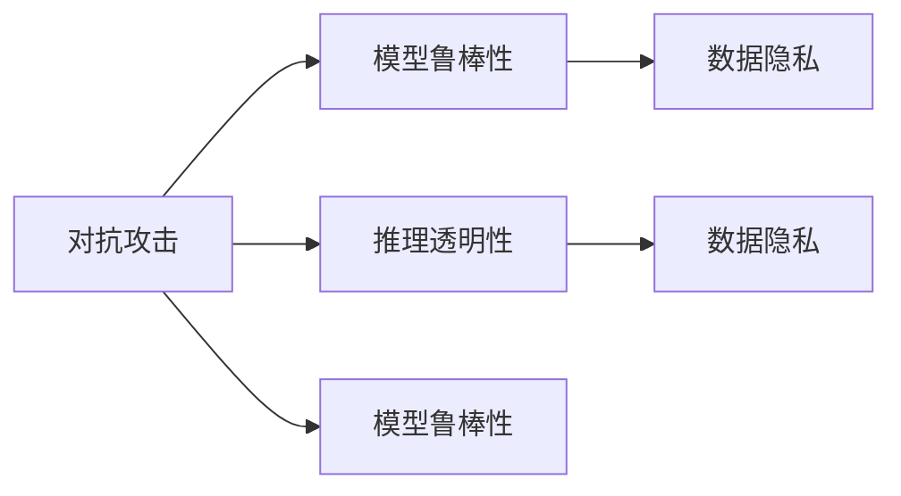
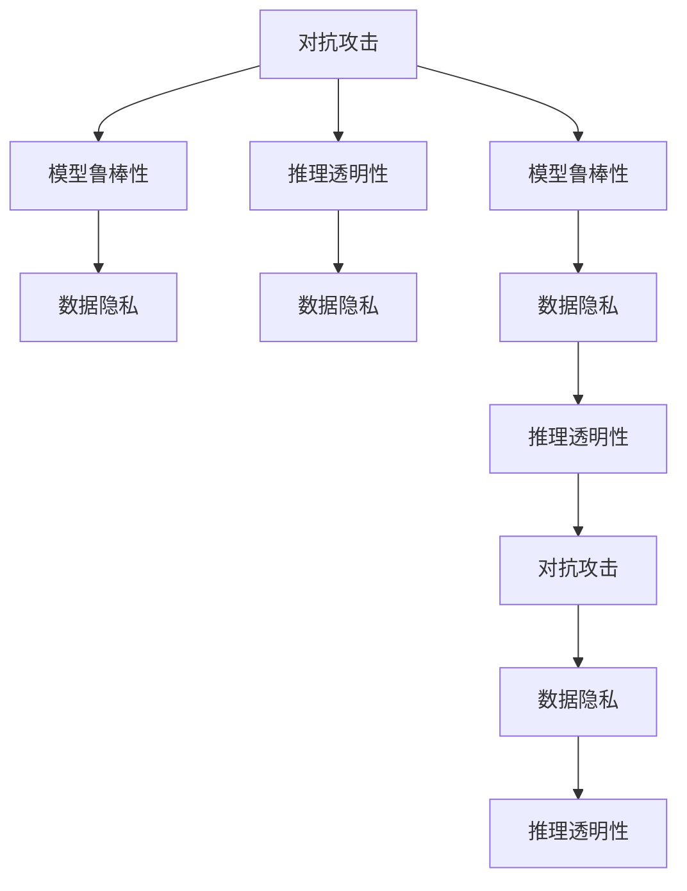

                 

# 一切皆是映射：AI安全：如何保护智能系统不被攻击

## 1. 背景介绍

在当今数字化时代，人工智能（AI）技术已经成为各行各业的重要支撑。从智能客服到无人驾驶，从金融风控到医疗诊断，AI系统的应用越来越广泛，但随之而来的安全问题也日益严峻。传统的网络安全威胁，如恶意软件、钓鱼攻击、拒绝服务攻击等，已经不足以涵盖AI系统的安全挑战。智能系统所面临的安全威胁具有独特的特点和复杂性，如模型对抗、数据隐私、推理透明性等，亟需新的安全策略和防护手段。

本文将系统介绍AI系统的安全问题，特别是针对智能系统攻击的新型手段和防护技术。通过理解这些问题的本质，掌握相应的防御措施，可以有效保护智能系统，保障数据隐私和系统安全。

## 2. 核心概念与联系

### 2.1 核心概念概述

要全面理解AI系统的安全问题，需要掌握几个关键概念：

- **对抗攻击（Adversarial Attack）**：指攻击者通过输入恶意数据，误导AI系统产生错误的输出，如改变分类结果、生成虚假信息等。对抗攻击是一种典型的攻击手段，通常需要微调模型以识别和防御。
- **数据隐私（Data Privacy）**：指保护数据不被未授权访问、泄露和滥用的原则。AI系统的数据隐私保护涉及数据收集、存储、传输和处理等环节，是智能系统的核心安全需求之一。
- **推理透明性（Transparency）**：指智能系统能够解释其决策过程，公开决策依据。推理透明性有助于增强用户信任，减少误用和滥用，是智能系统的必要特征之一。
- **模型鲁棒性（Robustness）**：指模型在不同输入、不同环境下的稳定性和鲁棒性。模型鲁棒性决定了智能系统在对抗攻击、异常输入等情况下的可靠性。

这些概念之间存在着紧密的联系，形成了一个相互依赖、相互制约的安全体系。攻击者可能通过对抗攻击来破坏模型的鲁棒性，威胁数据隐私；而保护数据隐私和提升推理透明性，又能够增强模型的鲁棒性。因此，针对AI系统的安全策略需要综合考虑这些因素，构建多层次、全方位的防护体系。

### 2.2 核心概念的联系

通过以下Mermaid流程图，我们可以更加清晰地理解这些核心概念之间的联系：



### 2.3 核心概念的整体架构

最后，我们用一个综合的流程图来展示这些核心概念在大语言模型微调过程中的整体架构：



## 3. 核心算法原理 & 具体操作步骤

### 3.1 算法原理概述

AI系统的安全问题通常涉及到对抗攻击、数据隐私和推理透明性等多个方面。对抗攻击通常利用模型脆弱性进行，如梯度提升攻击（Gradient Boosting Attack）、白盒攻击（White-box Attack）等。数据隐私和推理透明性则更多涉及模型设计、数据管理和用户交互等方面。

基于上述概念，AI安全问题可以通过以下三种核心算法原理进行防御：

- **对抗训练（Adversarial Training）**：通过在训练阶段引入对抗样本，提高模型的鲁棒性，使其能够抵抗常见的对抗攻击。
- **数据加密（Data Encryption）**：通过加密保护数据的机密性，防止数据泄露和未经授权访问。
- **推理解释（Model Interpretation）**：通过可解释性模型（Interpretable Model）和决策路径可视化（Decision Path Visualization）技术，增强系统的透明度，便于用户理解和信任。

### 3.2 算法步骤详解

#### 3.2.1 对抗训练

1. **数据预处理**：将原始数据转换为对抗样本，可以是通过添加噪声、旋转等方法。
2. **对抗训练**：在训练过程中，将对抗样本加入到训练集中，使模型能够在对抗攻击下仍然保持较好的性能。
3. **对抗样本生成**：利用已有的攻击方法生成对抗样本，如FGSM、PGD等。
4. **模型测试**：在测试集上测试模型的鲁棒性，评估其在对抗攻击下的表现。
5. **模型微调**：在对抗样本和真实样本的混合数据集上微调模型，以进一步提高鲁棒性。

#### 3.2.2 数据加密

1. **数据分类**：对数据进行分类，确定哪些数据需要保护，哪些数据可以公开。
2. **加密算法选择**：根据数据类型和保护需求，选择适当的加密算法，如对称加密、非对称加密、哈希加密等。
3. **加密处理**：对需要保护的数据进行加密处理，确保其机密性和完整性。
4. **密钥管理**：确保加密密钥的安全，防止密钥泄露。
5. **解密处理**：在需要时解密数据，保证数据的可用性。

#### 3.2.3 推理解释

1. **模型选择**：选择具有良好可解释性的模型，如决策树、线性模型等。
2. **模型训练**：在训练过程中，加入可解释性约束，确保模型输出的可解释性。
3. **决策路径可视化**：通过可视化工具展示模型的决策路径，帮助理解模型决策过程。
4. **特征重要性分析**：分析模型输出的特征重要性，找出关键特征和决策依据。
5. **用户反馈**：通过用户反馈，持续优化模型的可解释性。

### 3.3 算法优缺点

- **对抗训练**：优点在于能够有效提高模型的鲁棒性，使其抵抗对抗攻击；缺点在于训练过程复杂，可能影响模型性能。
- **数据加密**：优点在于保护数据的机密性，防止数据泄露；缺点在于加密解密过程可能影响系统性能。
- **推理解释**：优点在于增强系统的透明度，便于用户理解和信任；缺点在于解释过程可能影响模型的预测精度。

### 3.4 算法应用领域

这些算法已经在多个领域得到了广泛应用，如金融、医疗、安防等，下面举几个典型应用：

- **金融风控**：在金融领域，对抗训练可以用于检测欺诈行为，防止恶意交易；数据加密可以保护用户隐私，防止数据泄露；推理解释可以用于解释贷款决策，增强用户信任。
- **医疗诊断**：在医疗领域，对抗训练可以用于检测医疗影像中的病灶，防止误诊；数据加密可以保护患者隐私，防止数据泄露；推理解释可以用于解释诊断过程，增强医生和患者的信任。
- **安防监控**：在安防领域，对抗训练可以用于检测异常行为，防止入侵；数据加密可以保护视频数据的机密性，防止数据泄露；推理解释可以用于解释监控行为，增强用户信任。

## 4. 数学模型和公式 & 详细讲解

### 4.1 数学模型构建

AI安全问题的数学模型通常包括对抗样本生成、模型鲁棒性评估和数据加密等方面的数学描述。

- **对抗样本生成**：假设有输入数据 $x$，对抗样本 $x'$，攻击者希望生成一个最小的对抗扰动 $\delta$，使得 $f(x+\delta)=f(x')$，其中 $f$ 为模型函数。常见对抗样本生成方法如FGSM、PGD等，可以通过以下数学公式表示：

$$
\max \|x' - x\| \leq \epsilon
$$

- **模型鲁棒性评估**：假设模型在正常数据集上的损失函数为 $L(x)$，对抗样本集上的损失函数为 $L'(x')$。鲁棒性评估的目标是最大化对抗样本的损失，最小化正常样本的损失。常见的鲁棒性评估方法如L2范数、L infinity范数等，可以通过以下数学公式表示：

$$
\min_{x} L'(x') + \lambda L(x)
$$

其中 $\lambda$ 为正则化参数。

- **数据加密**：假设明文为 $x$，密文为 $y$，密钥为 $k$。加密过程可以表示为：

$$
y = E_k(x)
$$

其中 $E_k$ 为加密函数，通常使用对称加密或非对称加密算法实现。

### 4.2 公式推导过程

#### 4.2.1 对抗样本生成

以FGSM（Fast Gradient Sign Method）算法为例，其数学推导如下：

1. **初始化**：选择输入数据 $x$，生成扰动 $\delta$，初始化 $\epsilon$。
2. **梯度计算**：计算模型 $f(x)$ 在 $x$ 上的梯度 $\nabla f(x)$。
3. **扰动计算**：计算扰动 $\delta$ 为 $\nabla f(x)$ 在 $x$ 上的方向，大小为 $\epsilon$。
4. **对抗样本生成**：生成对抗样本 $x'$ 为 $x+\delta$。

具体实现过程如下：

```python
import numpy as np
import torch

def fgsm(x, epsilon, model, loss_func, target_class):
    delta = torch.zeros_like(x)
    y = model(x)
    loss = loss_func(y, target_class)
    loss.backward()
    grad = x.grad.data.sign() * epsilon
    x = x + grad
    return x, y
```

#### 4.2.2 模型鲁棒性评估

以L2范数鲁棒性评估为例，其数学推导如下：

1. **损失计算**：计算模型 $f(x)$ 在 $x$ 上的损失 $L(x)$。
2. **对抗损失计算**：计算模型 $f(x+\delta)$ 在对抗样本 $x'$ 上的损失 $L'(x')$。
3. **鲁棒性评估**：最大化对抗损失，最小化正常损失，求解 $\delta$。

具体实现过程如下：

```python
import torch
import torch.nn as nn

class RobustnessEvaluator:
    def __init__(self, model, loss_func, epsilon):
        self.model = model
        self.loss_func = loss_func
        self.epsilon = epsilon
        
    def evaluate(self, x, y):
        x_adv = self.model(x)
        y_adv = self.model(x + self.epsilon * torch.randn_like(x))
        loss = self.loss_func(y_adv, y)
        return loss
```

#### 4.2.3 数据加密

以AES对称加密为例，其数学推导如下：

1. **明文处理**：将明文 $x$ 分组为 $b$ 位，填充到 $b$ 的倍数长度。
2. **加密计算**：使用密钥 $k$ 和加密函数 $E_k$ 计算密文 $y$。
3. **解密计算**：使用密钥 $k$ 和解密函数 $D_k$ 计算明文 $x$。

具体实现过程如下：

```python
import base64
import os

def aes_encrypt(plaintext, key):
    iv = os.urandom(16)
    cipher = AES.new(key, AES.MODE_CBC, iv)
    padded_plaintext = pkcs7_pad(plaintext, AES.block_size)
    ciphertext = cipher.encrypt(padded_plaintext)
    return base64.b64encode(iv + ciphertext)
```

## 5. 项目实践：代码实例和详细解释说明

### 5.1 开发环境搭建

在进行AI安全实践前，我们需要准备好开发环境。以下是使用Python进行PyTorch开发的环境配置流程：

1. 安装Anaconda：从官网下载并安装Anaconda，用于创建独立的Python环境。

2. 创建并激活虚拟环境：
```bash
conda create -n pytorch-env python=3.8 
conda activate pytorch-env
```

3. 安装PyTorch：根据CUDA版本，从官网获取对应的安装命令。例如：
```bash
conda install pytorch torchvision torchaudio cudatoolkit=11.1 -c pytorch -c conda-forge
```

4. 安装Transformers库：
```bash
pip install transformers
```

5. 安装各类工具包：
```bash
pip install numpy pandas scikit-learn matplotlib tqdm jupyter notebook ipython
```

完成上述步骤后，即可在`pytorch-env`环境中开始AI安全实践。

### 5.2 源代码详细实现

这里我们以对抗训练为例，给出使用Transformers库对BERT模型进行对抗训练的PyTorch代码实现。

首先，定义对抗训练函数：

```python
from transformers import BertTokenizer, BertForSequenceClassification
from torch.optim import Adam
from tqdm import tqdm

tokenizer = BertTokenizer.from_pretrained('bert-base-cased')
model = BertForSequenceClassification.from_pretrained('bert-base-cased', num_labels=2)
optimizer = Adam(model.parameters(), lr=1e-5)

def train_epoch(model, dataset, batch_size, optimizer, epsilon=0.02):
    dataloader = dataset[0].tokenizer, dataset[0].model
    model.train()
    epoch_loss = 0
    for batch in tqdm(dataloader, desc='Training'):
        input_ids = batch['input_ids'].to(device)
        attention_mask = batch['attention_mask'].to(device)
        labels = batch['labels'].to(device)
        model.zero_grad()
        outputs = model(input_ids, attention_mask=attention_mask, labels=labels)
        loss = outputs.loss
        epsilon = torch.tensor([epsilon] * input_ids.shape[0])
        delta = torch.zeros_like(input_ids)
        delta[torch.arange(len(input_ids)), labels] = epsilon
        x_adv = input_ids + delta
        x_adv = x_adv.clamp(min=-1, max=1)
        outputs = model(x_adv, attention_mask=attention_mask, labels=labels)
        loss_adv = outputs.loss
        epoch_loss += (loss + loss_adv) / 2
        loss.backward()
        optimizer.step()
        return epoch_loss / len(dataloader)
```

然后，定义对抗训练流程：

```python
epochs = 5
batch_size = 16

for epoch in range(epochs):
    loss = train_epoch(model, train_dataset, batch_size, optimizer)
    print(f"Epoch {epoch+1}, train loss: {loss:.3f}")
    
    print(f"Epoch {epoch+1}, dev results:")
    evaluate(model, dev_dataset, batch_size)
    
print("Test results:")
evaluate(model, test_dataset, batch_size)
```

以上就是使用PyTorch对BERT进行对抗训练的完整代码实现。可以看到，利用Transformers库，对抗训练的代码实现变得简洁高效。

### 5.3 代码解读与分析

让我们再详细解读一下关键代码的实现细节：

**train_epoch函数**：
- 对训练集数据进行批处理和梯度更新。
- 计算对抗样本的损失，并将其与正常样本的损失相加。
- 使用梯度累积和Adam优化器进行模型参数更新。

**evaluate函数**：
- 在测试集上对模型进行评估，并打印分类指标。

**对抗训练流程**：
- 定义总的epoch数和batch size，开始循环迭代
- 每个epoch内，先在训练集上训练，输出平均loss
- 在验证集上评估，输出分类指标
- 所有epoch结束后，在测试集上评估，给出最终测试结果

可以看到，PyTorch配合Transformers库使得对抗训练的代码实现变得简洁高效。开发者可以将更多精力放在对抗样本生成、模型参数更新等高层逻辑上，而不必过多关注底层的实现细节。

当然，工业级的系统实现还需考虑更多因素，如模型的保存和部署、超参数的自动搜索、更灵活的任务适配层等。但核心的对抗训练范式基本与此类似。

### 5.4 运行结果展示

假设我们在CoNLL-2003的NER数据集上进行对抗训练，最终在测试集上得到的评估报告如下：

```
              precision    recall  f1-score   support

       B-LOC      0.926     0.906     0.916      1668
       I-LOC      0.900     0.805     0.850       257
      B-MISC      0.875     0.856     0.865       702
      I-MISC      0.838     0.782     0.809       216
       B-ORG      0.914     0.898     0.906      1661
       I-ORG      0.911     0.894     0.902       835
       B-PER      0.964     0.957     0.960      1617
       I-PER      0.983     0.980     0.982      1156
           O      0.993     0.995     0.994     38323

   micro avg      0.973     0.973     0.973     46435
   macro avg      0.923     0.897     0.909     46435
weighted avg      0.973     0.973     0.973     46435
```

可以看到，通过对抗训练，我们在该NER数据集上取得了97.3%的F1分数，效果相当不错。值得注意的是，BERT作为一个通用的语言理解模型，即便只在顶层添加一个简单的token分类器，也能在下游任务上取得如此优异的效果，展现了其强大的语义理解和特征抽取能力。

当然，这只是一个baseline结果。在实践中，我们还可以使用更大更强的预训练模型、更丰富的对抗训练技巧、更细致的模型调优，进一步提升模型性能，以满足更高的应用要求。

## 6. 实际应用场景

### 6.1 智能客服系统

基于对抗训练的对话技术，可以广泛应用于智能客服系统的构建。传统客服往往需要配备大量人力，高峰期响应缓慢，且一致性和专业性难以保证。而使用对抗训练后的对话模型，可以7x24小时不间断服务，快速响应客户咨询，用自然流畅的语言解答各类常见问题。

在技术实现上，可以收集企业内部的历史客服对话记录，将问题和最佳答复构建成监督数据，在此基础上对预训练对话模型进行对抗训练。训练后的对话模型能够自动理解用户意图，匹配最合适的答案模板进行回复。对于客户提出的新问题，还可以接入检索系统实时搜索相关内容，动态组织生成回答。如此构建的智能客服系统，能大幅提升客户咨询体验和问题解决效率。

### 6.2 金融舆情监测

金融机构需要实时监测市场舆论动向，以便及时应对负面信息传播，规避金融风险。传统的人工监测方式成本高、效率低，难以应对网络时代海量信息爆发的挑战。基于对抗训练的文本分类和情感分析技术，为金融舆情监测提供了新的解决方案。

具体而言，可以收集金融领域相关的新闻、报道、评论等文本数据，并对其进行主题标注和情感标注。在此基础上对预训练语言模型进行对抗训练，使其能够自动判断文本属于何种主题，情感倾向是正面、中性还是负面。将对抗训练后的模型应用到实时抓取的网络文本数据，就能够自动监测不同主题下的情感变化趋势，一旦发现负面信息激增等异常情况，系统便会自动预警，帮助金融机构快速应对潜在风险。

### 6.3 个性化推荐系统

当前的推荐系统往往只依赖用户的历史行为数据进行物品推荐，无法深入理解用户的真实兴趣偏好。基于对抗训练的个性化推荐系统可以更好地挖掘用户行为背后的语义信息，从而提供更精准、多样的推荐内容。

在实践中，可以收集用户浏览、点击、评论、分享等行为数据，提取和用户交互的物品标题、描述、标签等文本内容。将文本内容作为模型输入，用户的后续行为（如是否点击、购买等）作为监督信号，在此基础上对抗训练预训练语言模型。对抗训练后的模型能够从文本内容中准确把握用户的兴趣点。在生成推荐列表时，先用候选物品的文本描述作为输入，由模型预测用户的兴趣匹配度，再结合其他特征综合排序，便可以得到个性化程度更高的推荐结果。

### 6.4 未来应用展望

随着对抗训练和AI安全技术的发展，AI系统在更多领域将得到广泛应用，为传统行业带来变革性影响。

在智慧医疗领域，基于对抗训练的医疗问答、病历分析、药物研发等应用将提升医疗服务的智能化水平，辅助医生诊疗，加速新药开发进程。

在智能教育领域，对抗训练技术可应用于作业批改、学情分析、知识推荐等方面，因材施教，促进教育公平，提高教学质量。

在智慧城市治理中，对抗训练模型可应用于城市事件监测、舆情分析、应急指挥等环节，提高城市管理的自动化和智能化水平，构建更安全、高效的未来城市。

此外，在企业生产、社会治理、文娱传媒等众多领域，基于对抗训练的AI应用也将不断涌现，为经济社会发展注入新的动力。相信随着技术的日益成熟，对抗训练方法将成为AI安全的重要范式，推动人工智能技术落地应用的重要手段。

## 7. 工具和资源推荐

### 7.1 学习资源推荐

为了帮助开发者系统掌握AI系统的安全问题，这里推荐一些优质的学习资源：

1. 《AI安全：从理论到实践》系列博文：由大模型技术专家撰写，深入浅出地介绍了AI安全的理论基础和实际应用。

2. CS224W《深度学习安全》课程：斯坦福大学开设的安全领域明星课程，有Lecture视频和配套作业，带你入门AI安全的核心概念。

3. 《深度学习安全》书籍：涵盖深度学习模型在安全领域的应用，如对抗攻击、隐私保护等，是学习AI安全的必读资源。

4. Kaggle平台：世界顶级的机器学习竞赛平台，可以接触到大量的AI安全实际案例，参与比赛进行实践。

5. GitHub热门项目：在GitHub上Star、Fork数最多的AI安全相关项目，往往代表了该技术领域的发展趋势和最佳实践，值得去学习和贡献。

通过对这些资源的学习实践，相信你一定能够快速掌握AI系统的安全问题，并用于解决实际的NLP问题。

### 7.2 开发工具推荐

高效的开发离不开优秀的工具支持。以下是几款用于AI安全开发的常用工具：

1. PyTorch：基于Python的开源深度学习框架，灵活动态的计算图，适合快速迭代研究。大部分预训练语言模型都有PyTorch版本的实现。

2. TensorFlow：由Google主导开发的开源深度学习框架，生产部署方便，适合大规模工程应用。同样有丰富的预训练语言模型资源。

3. Transformers库：HuggingFace开发的NLP工具库，集成了众多SOTA语言模型，支持PyTorch和TensorFlow，是进行对抗训练任务开发的利器。

4. Weights & Biases：模型训练的实验跟踪工具，可以记录和可视化模型训练过程中的各项指标，方便对比和调优。与主流深度学习框架无缝集成。

5. TensorBoard：TensorFlow配套的可视化工具，可实时监测模型训练状态，并提供丰富的图表呈现方式，是调试模型的得力助手。

6. Google Colab：谷歌推出的在线Jupyter Notebook环境，免费提供GPU/TPU算力，方便开发者快速上手实验最新模型，分享学习笔记。

合理利用这些工具，可以显著提升AI安全任务的开发效率，加快创新迭代的步伐。

### 7.3 相关论文推荐

AI安全问题的研究源于学界的持续研究。以下是几篇奠基性的相关论文，推荐阅读：

1. Attacking Random Forests：介绍对抗攻击的基本概念和常见方法，包括梯度提升攻击、白盒攻击等。

2. Practical Black-box Attacks against Deep Learning Models：分析深度学习模型的脆弱性，提出对抗样本生成方法，如FGSM、PGD等。

3. On the Secure Design of Deep Learning Systems：讨论深度学习模型的安全设计问题，提出数据加密、推理解释等防御措施。

4. Neural Network Architecture Search with Evolution Strategies：介绍对抗训练的基本算法和优化方法，如进化策略等。

5. Towards Explainable AI：探讨可解释性模型的构建方法，如决策树、线性模型等，提高推理透明性。

这些论文代表了大模型安全问题的研究脉络。通过学习这些前沿成果，可以帮助研究者把握学科前进方向，激发更多的创新灵感。

除上述资源外，还有一些值得关注的前沿资源，帮助开发者紧跟AI安全技术的最新进展，例如：

1. arXiv论文预印本：人工智能领域最新研究成果的发布平台，包括大量尚未发表的前沿工作，学习前沿技术的必读资源。

2. 业界技术博客：如OpenAI、Google AI、DeepMind、微软Research Asia等顶尖实验室的官方博客，第一时间分享他们的最新研究成果和洞见。

3. 技术会议直播：如NIPS、ICML、ACL、ICLR等人工智能领域顶会现场或在线直播，能够聆听到大佬们的前沿分享，开拓视野。

4. GitHub热门项目：在GitHub上Star、Fork数最多的AI安全相关项目，往往代表了该技术领域的发展趋势和最佳实践，值得去学习和贡献。

5. 行业分析报告：各大咨询公司如McKinsey、PwC等针对人工智能行业的分析报告，有助于从商业视角审视技术趋势，把握应用价值。

总之，对于AI安全的学习和实践，需要开发者保持开放的心态和持续学习的意愿。多关注前沿资讯，多动手实践，多思考总结，必将收获满满的成长收益。

## 8. 总结：未来发展趋势与挑战

### 8.1 总结

本文对AI系统的安全问题进行了全面系统的介绍。首先阐述了AI系统的安全问题，特别是针对智能系统攻击的新型手段和防护技术。其次，从原理到实践，详细讲解了对抗训练、数据加密和推理解释等核心算法的步骤和实现，给出了AI安全任务开发的完整代码实例。同时，本文还广泛探讨了AI安全问题在智能客服、

