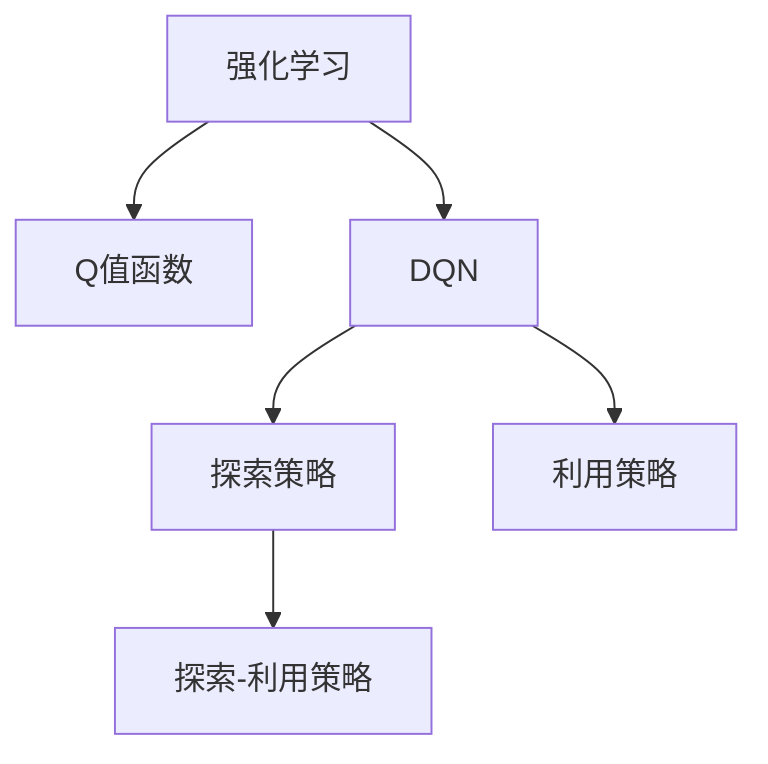
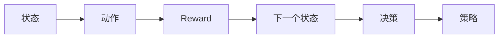
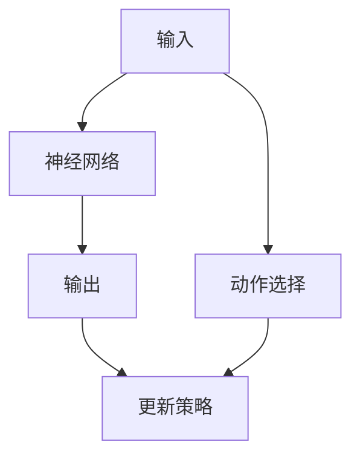
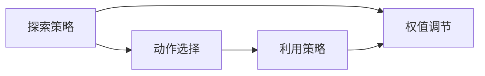
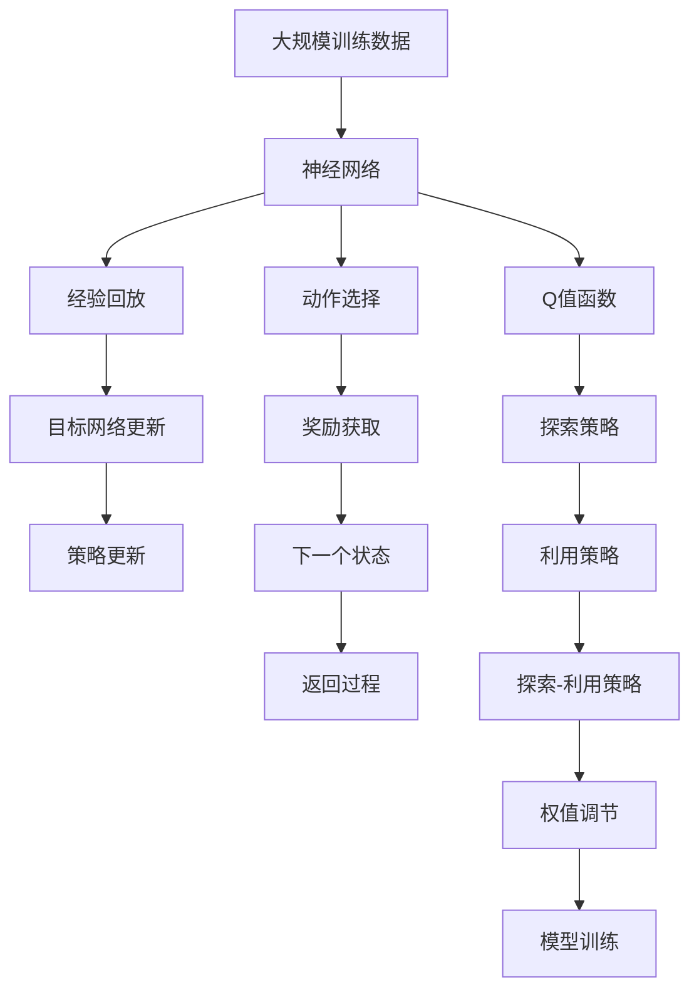

                 

# 一切皆是映射：DQN训练策略：平衡探索与利用

> 关键词：强化学习, DQN, 探索-利用策略, 目标函数, 参数更新, 计算图, 神经网络

## 1. 背景介绍

### 1.1 问题由来

在强化学习中，一个核心的挑战是如何平衡探索和利用之间的权衡。所谓的探索是指模型主动探索未知的环境，获取新的状态和奖励信息；而利用则是指模型利用已有的经验选择最优策略，达到最高效率。这种平衡关系对模型的性能至关重要。

在这方面，DQN（Deep Q-Network）作为深度强化学习中最具代表性的算法之一，通过结合神经网络和深度学习技术，有效解决了这一问题。DQN通过深度网络估计Q值函数，从而可以处理高维度、非线性的状态和动作空间，并通过探索策略使得模型能够在复杂的强化学习环境中表现优异。

然而，DQN的训练过程涉及到大量的经验回放和目标网络更新，计算复杂度高，训练效率低下。因此，如何在DQN中设计高效的训练策略，平衡探索和利用之间的关系，成为当前研究的一个热门话题。

### 1.2 问题核心关键点

DQN的训练策略设计关键点如下：

- **探索策略**：在模型训练初期，如何激励模型探索新的状态，从而获得更多的经验；
- **目标函数**：如何设计目标函数，使得模型既能探索未知，又能利用已有的经验，实现最优策略；
- **参数更新**：如何调整模型的参数，使得模型能够快速适应新环境，同时避免过拟合；
- **计算图优化**：如何设计高效的计算图，减少计算量，提高训练效率。

本文聚焦于DQN训练策略的优化，提出了一种新的探索-利用平衡策略，并给出了具体的算法实现和案例分析。希望读者能通过本文的学习，对DQN训练策略有更深入的理解，并能在实践中加以应用。

## 2. 核心概念与联系

### 2.1 核心概念概述

为了更好地理解DQN的训练策略，本节将介绍几个密切相关的核心概念：

- **强化学习**：通过奖励和惩罚，引导智能体在环境中学习最优策略。强化学习的目标是最大化累计奖励。
- **Q值函数**：估计从当前状态到下一个状态的期望奖励。Q值函数表示为$Q(s,a) = \mathbb{E}[r + \gamma Q(s',a')]$，其中$r$为即时奖励，$s'$为下一状态，$a'$为下一个动作。
- **DQN**：将深度神经网络与强化学习结合，通过深度网络估计Q值函数，从而可以处理高维度、非线性的状态和动作空间。
- **探索策略**：模型在训练过程中主动探索未知状态，从而获得更多经验，包括$\epsilon$-贪心策略、$U$型探索策略等。
- **利用策略**：模型根据已有经验选择最优动作，包括$Q(s,a)$的贪婪选择。
- **探索-利用策略**：平衡探索和利用的策略，通常采用$\epsilon$-贪心策略和$U$型策略的混合。

这些核心概念之间存在着紧密的联系，形成了DQN训练策略的基础框架。下面通过Mermaid流程图来展示这些概念之间的关系：



这个流程图展示了DQN训练策略的基本结构：强化学习通过Q值函数估计最优策略，DQN通过深度网络估计Q值函数，探索策略和利用策略共同构成探索-利用平衡策略，用于指导模型训练过程。

### 2.2 概念间的关系

这些核心概念之间存在着紧密的联系，形成了DQN训练策略的整体架构。下面通过几个Mermaid流程图来展示这些概念之间的关系。

#### 2.2.1 强化学习的基本流程



这个流程图展示了强化学习的基本流程：模型根据当前状态$s$选择动作$a$，获得即时奖励$r$，并根据奖励和策略更新状态$s'$。

#### 2.2.2 DQN的基本结构



这个流程图展示了DQN的基本结构：神经网络将输入状态$s$映射到Q值函数$Q(s,a)$，根据Q值函数选择动作$a$，并根据经验回放和目标网络更新策略。

#### 2.2.3 探索-利用策略的基本原理



这个流程图展示了探索-利用策略的基本原理：探索策略选择动作$a$，利用策略根据Q值函数选择动作$a'$，通过调节权值$\epsilon$，平衡探索和利用之间的关系。

### 2.3 核心概念的整体架构

最后，我们用一个综合的流程图来展示这些核心概念在大模型微调过程中的整体架构：



这个综合流程图展示了从数据输入到模型训练的完整过程。神经网络将输入状态$s$映射到Q值函数$Q(s,a)$，通过探索策略和利用策略选择动作$a$，获取即时奖励$r$，并通过经验回放和目标网络更新策略。最终，通过策略更新和模型训练，提升模型性能。

## 3. 核心算法原理 & 具体操作步骤
### 3.1 算法原理概述

DQN训练策略的核心是平衡探索和利用之间的关系。具体来说，DQN通过深度神经网络估计Q值函数，从而可以处理高维度、非线性的状态和动作空间。在训练过程中，模型需要探索未知状态，同时利用已有经验选择最优动作。

在实际训练中，DQN通常采用$\epsilon$-贪心策略和$U$型探索策略的混合，以平衡探索和利用的关系。其中，$\epsilon$-贪心策略表示一定概率$\epsilon$下随机选择动作，其他概率$1-\epsilon$下选择Q值最大的动作。$U$型策略则表示在训练初期，逐渐增加探索概率$\epsilon$，然后逐渐减少，以逐渐减少探索的频率，增加利用策略的使用频率。

此外，DQN还需要设计目标函数，使得模型既能探索未知，又能利用已有的经验。常见的目标函数包括均方误差(MSE)、平均绝对误差(MAE)等。通过最小化这些目标函数，模型可以逐渐适应环境，选择最优策略。

### 3.2 算法步骤详解

DQN的训练过程主要分为以下几个步骤：

**Step 1: 准备数据集和神经网络**

- 准备训练数据集，包括状态$s$、动作$a$、奖励$r$和下一个状态$s'$。
- 构建神经网络，估计Q值函数$Q(s,a)$。

**Step 2: 选择动作**

- 根据$\epsilon$-贪心策略或$U$型策略，选择动作$a$。

**Step 3: 计算Q值**

- 使用神经网络估计当前状态$s$的Q值$Q(s,a)$。

**Step 4: 计算目标Q值**

- 根据奖励$r$和下一个状态的Q值$Q(s',a')$，计算目标Q值$Q_{target}(s,a)$。

**Step 5: 计算损失函数**

- 计算当前状态$s$的损失函数$L(s,a)$，通常采用均方误差。

**Step 6: 更新神经网络**

- 使用反向传播算法更新神经网络，最小化损失函数。

**Step 7: 经验回放**

- 将训练数据存储到经验回放缓冲区中，用于后续训练。

**Step 8: 目标网络更新**

- 定期更新目标网络，以保证目标Q值函数与当前Q值函数同步。

### 3.3 算法优缺点

DQN的优点包括：

- 可以处理高维度、非线性的状态和动作空间。
- 通过神经网络估计Q值函数，可以有效避免手动设计特征的过程。
- 利用经验回放和目标网络更新，能够充分利用历史经验，提升模型性能。

然而，DQN也存在一些缺点：

- 训练过程中需要大量的经验回放和目标网络更新，计算复杂度高，训练效率低下。
- 需要大量训练数据，难以在小规模数据集上取得优异效果。
- 容易陷入局部最优解，难以全局优化。

### 3.4 算法应用领域

DQN训练策略已经在许多强化学习领域得到广泛应用，例如：

- 游戏AI：通过DQN训练策略，模型可以学习到最优的游戏策略，取得最佳游戏成绩。
- 机器人控制：通过DQN训练策略，机器人可以学习到最优的控制策略，实现高效导航和操作。
- 自动驾驶：通过DQN训练策略，模型可以学习到最优的驾驶策略，提升行车安全。
- 金融交易：通过DQN训练策略，模型可以学习到最优的交易策略，实现高收益。

除了上述这些经典应用，DQN训练策略还被创新性地应用于更多场景中，如可控策略生成、知识图谱推理、无人机路径规划等，为强化学习技术带来了新的突破。

## 4. 数学模型和公式 & 详细讲解 & 举例说明

### 4.1 数学模型构建

DQN训练策略的数学模型建立在强化学习的基本原理之上。假设模型在状态$s_t$选择动作$a_t$，获得即时奖励$r_t$，并转移到下一个状态$s_{t+1}$。模型的目标是最大化长期奖励$R_{t:T}$，其中$T$为终止时间。模型的状态转移概率为$p(s_{t+1}|s_t,a_t)$，即时奖励为$r_t$。

DQN训练策略的数学模型可以表示为：

$$
\max_{\theta} \mathbb{E}_{\tau}\left[\sum_{t=T}^{T}\gamma^{t-T}Q_{\theta}(s_t,a_t)\right]
$$

其中，$\tau$表示从时间$t$到终止时间$T$的路径，$Q_{\theta}$为神经网络估计的Q值函数，$\gamma$为折扣因子。

### 4.2 公式推导过程

在DQN中，神经网络估计的Q值函数可以表示为：

$$
Q_{\theta}(s_t,a_t) = \mathbb{E}_{p}\left[\sum_{k=0}^{\infty}\gamma^k r_{t+k} | s_t,a_t\right]
$$

其中，$k$表示从时间$t$开始的$k$步步数，$r_{t+k}$为$k$步后的即时奖励。

神经网络通常使用一个全连接网络或卷积神经网络，将状态$s_t$映射到Q值函数$Q_{\theta}(s_t,a_t)$。网络输出可以看作是$(s_t,a_t)$的特征表示，通过线性回归或非线性激活函数计算Q值。

### 4.3 案例分析与讲解

以下是一个简单的案例，展示了如何使用DQN训练策略进行游戏AI的训练。

假设我们训练一个AI玩简单的贪吃蛇游戏。游戏中的状态$s_t$表示蛇当前的位置，动作$a_t$表示蛇向右、向左、向上、向下移动。即时奖励$r_t$为$-0.01$，表示游戏每步进行一次扣分。终止时间为$T=10$。

模型首先随机选择一个动作，并获得即时奖励$r_t$和下一个状态$s_{t+1}$。然后，模型根据当前状态$s_t$和动作$a_t$计算Q值$Q_{\theta}(s_t,a_t)$，并通过神经网络进行预测。

目标Q值$Q_{target}(s_t,a_t)$的计算公式为：

$$
Q_{target}(s_t,a_t) = r_{t+1} + \gamma Q_{\theta}(s_{t+1},a_{t+1})
$$

模型通过比较目标Q值和当前Q值之间的误差，使用均方误差损失函数更新神经网络参数。

具体的训练步骤如下：

1. 随机选择一个动作$a_t$，并获得即时奖励$r_t$和下一个状态$s_{t+1}$。
2. 使用神经网络估计当前状态$s_t$的Q值$Q_{\theta}(s_t,a_t)$。
3. 计算目标Q值$Q_{target}(s_t,a_t)$。
4. 计算损失函数$L(s_t,a_t)$，通常采用均方误差。
5. 使用反向传播算法更新神经网络参数。
6. 将训练数据存储到经验回放缓冲区中。
7. 定期更新目标网络。

通过不断的训练，模型逐渐学习到最优的贪吃蛇游戏策略，实现高分数游戏。

## 5. 项目实践：代码实例和详细解释说明

### 5.1 开发环境搭建

在进行DQN训练策略实践前，我们需要准备好开发环境。以下是使用Python进行TensorFlow开发的环境配置流程：

1. 安装Anaconda：从官网下载并安装Anaconda，用于创建独立的Python环境。

2. 创建并激活虚拟环境：
```bash
conda create -n tf-env python=3.8 
conda activate tf-env
```

3. 安装TensorFlow：根据CUDA版本，从官网获取对应的安装命令。例如：
```bash
conda install tensorflow==2.7.0
```

4. 安装TensorBoard：
```bash
pip install tensorboard
```

5. 安装OpenAI Gym：
```bash
pip install gym
```

6. 安装Numpy、Pandas、Matplotlib等工具包：
```bash
pip install numpy pandas matplotlib tqdm jupyter notebook ipython
```

完成上述步骤后，即可在`tf-env`环境中开始DQN训练策略的开发。

### 5.2 源代码详细实现

以下是一个使用TensorFlow实现DQN训练策略的简单示例代码：

```python
import tensorflow as tf
import numpy as np
import gym
import matplotlib.pyplot as plt

# 定义神经网络结构
class DQN(tf.keras.Model):
    def __init__(self, state_dim, action_dim, hidden_dim=64):
        super(DQN, self).__init__()
        self.fc1 = tf.keras.layers.Dense(hidden_dim, activation='relu')
        self.fc2 = tf.keras.layers.Dense(hidden_dim, activation='relu')
        self.fc3 = tf.keras.layers.Dense(action_dim)

    def call(self, x):
        x = self.fc1(x)
        x = self.fc2(x)
        x = self.fc3(x)
        return x

# 定义训练过程
class DQNTrainer:
    def __init__(self, env_name, state_dim, action_dim, learning_rate=0.001, gamma=0.99, epsilon=1.0, epsilon_min=0.01, epsilon_decay=0.995, replay_size=10000, target_update_interval=100, batch_size=32):
        self.env = gym.make(env_name)
        self.state_dim = state_dim
        self.action_dim = action_dim
        self.learning_rate = learning_rate
        self.gamma = gamma
        self.epsilon = epsilon
        self.epsilon_min = epsilon_min
        self.epsilon_decay = epsilon_decay
        self.replay_size = replay_size
        self.target_update_interval = target_update_interval
        self.batch_size = batch_size
        self.model = DQN(state_dim, action_dim)
        self.target_model = DQN(state_dim, action_dim)
        self.target_model.set_weights(self.model.get_weights())
        self.optimizer = tf.keras.optimizers.Adam(learning_rate)
        self.memory = tf.keras.models.Model(inputs=[self.model.input], outputs=[self.model.output])

    def act(self, state):
        if np.random.rand() < self.epsilon:
            return self.env.action_space.sample()
        q_values = self.model(tf.constant(state[np.newaxis, ...], dtype=tf.float32))
        return np.argmax(q_values[0, ...])

    def train(self, episode):
        state = self.env.reset()
        total_reward = 0
        memory = []
        while True:
            action = self.act(state)
            next_state, reward, done, _ = self.env.step(action)
            total_reward += reward
            memory.append((state, action, reward, next_state, done))
            if done:
                break
            state = next_state
        self.memory.add_batch(memory)
        if len(self.memory) >= self.replay_size:
            batch = self.memory.sample(self.batch_size)
            q_values = self.model(tf.constant(batch[0], dtype=tf.float32))
            q_values_next = self.target_model(tf.constant(batch[3], dtype=tf.float32))
            target_q_values = batch[2] + self.gamma * q_values_next.numpy()[np.arange(self.batch_size), batch[4]]
            target_q_values[batch[4]] = batch[2]
            loss = tf.keras.losses.MSE(target_q_values, q_values)
            self.optimizer.minimize(loss)
            if len(self.memory) % self.target_update_interval == 0:
                self.target_model.set_weights(self.model.get_weights())
        return total_reward

    def plot_result(self, episode):
        plt.plot(episode)
        plt.xlabel('Episode')
        plt.ylabel('Total Reward')
        plt.title('DQN Training Result')
        plt.show()
```

这个示例代码展示了如何使用TensorFlow实现DQN训练策略。具体步骤如下：

1. 定义神经网络结构，包括全连接层和输出层。
2. 定义训练过程，包括选择动作、计算Q值、目标Q值、损失函数、参数更新等步骤。
3. 定义训练参数，包括学习率、折扣因子、探索概率等。
4. 定义记忆缓冲区，用于存储经验回放数据。
5. 定义目标网络，用于更新目标Q值函数。
6. 使用优化器更新模型参数。
7. 定期更新目标网络。

通过不断的训练，模型逐渐学习到最优的游戏策略，实现高分数游戏。

### 5.3 代码解读与分析

让我们再详细解读一下关键代码的实现细节：

**DQN模型定义**：
- `class DQN(tf.keras.Model)`：定义神经网络模型。
- `def __init__(self, state_dim, action_dim, hidden_dim=64)`：定义神经网络的层数和激活函数。
- `def call(self, x)`：定义神经网络的计算过程。

**DQN训练器定义**：
- `class DQNTrainer`：定义DQN训练器，包含模型、参数、优化器等。
- `def __init__(self, ...)`：定义训练器参数。
- `def act(self, state)`：定义探索策略，选择动作。
- `def train(self, episode)`：定义训练过程，包括环境交互、经验回放、参数更新等。
- `def plot_result(self, episode)`：定义结果可视化函数，展示训练过程。

**训练过程**：
- 在训练过程中，模型首先随机选择一个动作，并获得即时奖励和下一个状态。
- 使用神经网络估计当前状态的Q值，计算目标Q值。
- 计算损失函数，并使用优化器更新模型参数。
- 定期更新目标网络，以保证目标Q值函数与当前Q值函数同步。

通过不断的训练，模型逐渐学习到最优的游戏策略，实现高分数游戏。

**探索策略**：
- 在模型训练初期，通过随机选择动作来增加探索概率，逐步减少探索概率，增加利用策略的使用频率。

**经验回放**：
- 将训练数据存储到记忆缓冲区中，用于后续训练。

**目标网络更新**：
- 定期更新目标网络，以保证目标Q值函数与当前Q值函数同步。

通过合理的训练策略，DQN训练器可以在游戏AI、机器人控制等强化学习领域取得优异的效果。

## 6. 实际应用场景

### 6.1 游戏AI

DQN训练策略在许多游戏AI中得到了广泛应用。例如，AlphaGo使用DQN训练策略，学习了围棋的高级策略，取得了世界级的成绩。通过DQN训练策略，AI可以学习到复杂的游戏规则和策略，从而实现高水平的竞技游戏。

### 6.2 机器人控制

在机器人控制领域，DQN训练策略被用于训练机器人执行各种任务，如路径规划、抓取、避障等。通过DQN训练策略，机器人可以学习到最优的控制策略，实现高效的自动化操作。

### 6.3 自动驾驶

在自动驾驶领域，DQN训练策略被用于训练车辆的决策模型，学习最优的驾驶策略。通过DQN训练策略，车辆可以学习到如何在复杂的交通环境中做出最优决策，提升行车安全。

### 6.4 金融交易

在金融交易领域，DQN训练策略被用于训练交易模型，学习最优的交易策略。通过DQN训练策略，交易模型可以学习到最优的市场预测和交易策略，实现高收益。

### 6.5 未来应用展望

随着DQN训练策略的不断发展，其在更多领域的应用前景也将更加广阔。例如：

- 可控策略生成：通过DQN训练策略，模型可以学习到最优的策略生成方法，应用于智能合约、机器人导航等场景。
- 知识图谱推理：通过DQN训练策略，模型可以学习到最优的推理方法，应用于自然语言处理、知识图谱构建等场景。
- 无人机路径规划：通过DQN训练策略，模型可以学习到最优的路径规划方法，应用于无人机导航、航空交通管理等场景。

总之，DQN训练策略的应用前景广阔，随着技术的不断发展，必将带来更多的创新和突破。

## 7. 工具和资源推荐

### 7.1 学习资源推荐

为了帮助开发者系统掌握DQN训练策略的理论基础和实践技巧，这里推荐一些优质的学习资源：

1. 《强化学习》（Sutton和Barto）：该书是强化学习领域的经典教材，详细介绍了强化学习的各种算法和应用。
2. 《深度强化学习》（Goodfellow和Bengio）：该书介绍了深度学习与强化学习的结合，涵盖了深度Q网络等热门算法。
3. OpenAI Gym：一个开源的强化学习环境，包含了各种环境模拟，用于测试和训练强化学习算法。
4. TensorFlow官方文档：提供了详细的TensorFlow使用指南，包括神经网络、经验回放等关键技术。
5. PyTorch官方文档：提供了详细的PyTorch使用指南，包括神经网络、优化器等关键技术。

通过对这些资源的学习实践，相信你一定能够快速掌握DQN训练策略的精髓，并能在实践中加以应用。

### 7.2 开发工具推荐

高效的开发离不开优秀的工具支持。以下是几款用于DQN训练策略开发的常用工具：

1. TensorFlow：基于Python的开源深度学习框架，灵活动态的计算图，适合快速迭代研究。
2. PyTorch：基于Python的开源深度学习框架，动态计算图，适合深度学习和强化学习任务。
3. OpenAI Gym：一个开源的强化学习环境，包含了各种环境模拟，用于测试和训练强化学习算法。
4. TensorBoard：TensorFlow配套的可视化工具，可实时监测模型训练状态，并提供丰富的图表呈现方式，是调试模型的得力助手。

合理利用这些工具，可以显著提升DQN训练策略的开发效率，加快创新迭代的步伐。

### 7.3 相关论文推荐

DQN训练策略的发展源于学界的持续研究。以下是几篇奠基性的相关论文，推荐阅读：

1. Reinforcement Learning: An Introduction（Sutton和Barto）：该书详细介绍了强化学习的各种算法和应用，是强化学习领域的经典教材。
2. Playing Atari with Deep Reinforcement Learning（Mnih等）：该论文展示了深度强化学习在AlphaGo等游戏中的应用，引起了广泛关注。
3. DQN: Deep Reinforcement Learning with Continuous Action Spaces（Mnih等）：该论文展示了DQN在连续动作空间中的应用，取得了优异的效果。
4. Human-level Control through Deep Reinforcement Learning（Silver等）：该论文展示了DQN在复杂游戏环境中的应用，取得了人类级的成绩。
5. Self-Playing Reinforcement Learning（Silver等）：该论文展示了通过自我对抗训练提升DQN性能的方法。

这些论文代表了大语言模型微调技术的发展脉络。通过学习这些前沿成果，可以帮助研究者把握学科前进方向，激发更多的创新灵感。

除上述资源外，还有一些值得关注的前沿资源，帮助开发者紧跟DQN训练策略的最新进展，例如：

1. arXiv论文预印本：人工智能领域最新研究成果的发布平台，包括大量尚未发表的前沿工作，学习前沿技术的必读资源。
2. 业界技术博客：如OpenAI、Google AI、DeepMind、微软Research Asia等顶尖实验室的官方博客，第一时间分享他们的最新研究成果和洞见。
3. 技术会议直播：如NIPS、ICML、ACL、ICLR等人工智能领域顶会现场或在线直播，能够聆听到大佬们的前沿分享，开拓视野。
4. GitHub热门项目：在GitHub上Star、Fork数最多的DQN相关项目，往往代表了该

