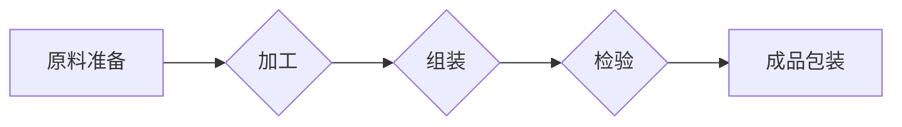

## 流水线对工业生产的影响

> 关键词：流水线、工业生产、效率、标准化、自动化、质量控制、流程优化、分工合作

## 1. 背景介绍

自工业革命以来，生产方式经历了巨大的变革。从传统的粗放式手工生产到现代的流水线生产，效率和产量得到了显著提升。流水线生产模式，也称为分段式生产，是一种将生产过程分解成多个独立的工序，每个工序由专门的工人负责完成，并通过传送带或其他设备将产品从一个工序传递到下一个工序的生产方式。

流水线生产模式的出现，标志着生产方式的重大进步，它极大地提高了生产效率，降低了生产成本，促进了工业化进程的发展。然而，流水线生产模式也存在一些弊端，例如工作单调乏味、缺乏灵活性、容易出现质量问题等。

## 2. 核心概念与联系

### 2.1 流水线生产模式

流水线生产模式的核心概念是将复杂的产品生产过程分解成一系列简单、重复的工序，每个工序由专门的工人负责完成。产品在流水线上不断流动，每个工序都按照预定的标准进行操作，最终完成产品的组装。

### 2.2 流程图



### 2.3 核心联系

流水线生产模式的核心联系在于：

* **分工合作:** 将生产过程分解成多个独立的工序，每个工序由专门的工人负责，实现分工合作，提高生产效率。
* **标准化操作:** 每个工序都按照预定的标准进行操作，保证产品质量的一致性。
* **连续流动:** 产品在流水线上不断流动，避免了停滞和浪费，提高了生产效率。

## 3. 核心算法原理 & 具体操作步骤

### 3.1 算法原理概述

流水线生产模式的核心算法原理是**分段式生产算法**。该算法将产品生产过程分解成多个独立的工序，每个工序都对应一个特定的算法，例如：

* **原料准备算法:** 用于准备生产所需的原料，包括原料的采购、储存和加工。
* **加工算法:** 用于对原料进行加工，例如切割、成型、焊接等。
* **组装算法:** 用于将加工好的部件组装成完整的产品。
* **检验算法:** 用于对产品进行质量检验，确保产品符合标准。

### 3.2 算法步骤详解

1. **产品分解:** 将产品分解成多个独立的工序。
2. **工序分配:** 将每个工序分配给专门的工人或机器。
3. **标准化操作:** 为每个工序制定标准操作流程和规范。
4. **流水线布局:** 根据工序的顺序和流程，设计合理的流水线布局。
5. **产品流动:** 将产品在流水线上不断流动，每个工序都按照预定的标准进行操作。
6. **质量控制:** 在每个工序进行质量控制，确保产品质量的一致性。
7. **成品包装:** 将完成的产品进行包装，准备交付客户。

### 3.3 算法优缺点

**优点:**

* **提高生产效率:** 分工合作、标准化操作和连续流动，极大地提高了生产效率。
* **降低生产成本:** 提高效率、减少浪费，降低了生产成本。
* **保证产品质量:** 标准化操作和质量控制，保证了产品质量的一致性。

**缺点:**

* **工作单调乏味:** 每个工序都重复性很强，容易导致工人感到单调乏味。
* **缺乏灵活性:** 流水线生产模式难以适应产品变化，需要重新调整流水线布局。
* **容易出现质量问题:** 如果某个工序出现问题，会影响整个流水线的生产效率和产品质量。

### 3.4 算法应用领域

流水线生产模式广泛应用于各个工业领域，例如：

* **汽车制造:** 汽车生产线是流水线生产模式的典型应用场景。
* **电子制造:** 手机、电脑等电子产品的生产也采用流水线模式。
* **食品加工:** 食品加工行业也广泛应用流水线生产模式，例如面包、饮料等产品的生产。
* **家具制造:** 家具生产线也采用流水线模式，提高生产效率和产品质量。

## 4. 数学模型和公式 & 详细讲解 & 举例说明

### 4.1 数学模型构建

流水线生产效率可以采用以下数学模型进行描述：

$$
\text{生产效率} = \frac{\text{产品数量}}{\text{生产时间}}
$$

其中：

* **产品数量:** 指在一定时间内生产的产品数量。
* **生产时间:** 指生产产品所花费的时间。

### 4.2 公式推导过程

生产效率的公式可以根据以下公式推导得出：

$$
\text{生产时间} = \frac{\text{总工时}}{\text{工人数量}}
$$

$$
\text{总工时} = \sum_{i=1}^{n} \text{工序i的工时}
$$

其中：

* **工人数量:** 指参与生产的工人数量。
* **工序i的工时:** 指完成工序i所需的时间。

将上述公式代入生产效率公式，可以得到：

$$
\text{生产效率} = \frac{\text{产品数量}}{\frac{\sum_{i=1}^{n} \text{工序i的工时}}{\text{工人数量}}}
$$

### 4.3 案例分析与讲解

假设一家汽车制造厂生产一辆汽车需要 10 个工序，每个工序的平均工时为 1 小时，工人数量为 100 人。

则：

* 总工时 = 10 * 1 = 10 小时
* 生产时间 = 10 / 100 = 0.1 小时
* 假设该厂每天生产 100 辆汽车，则生产效率 = 100 / 0.1 = 1000 辆/小时

## 5. 项目实践：代码实例和详细解释说明

### 5.1 开发环境搭建

* 操作系统: Ubuntu 20.04 LTS
* 编程语言: Python 3.8
* 开发工具: VS Code

### 5.2 源代码详细实现

```python
class Product:
    def __init__(self, name):
        self.name = name
        self.status = "待加工"

    def process(self, operation):
        self.status = operation
        print(f"{self.name} 已完成 {operation} 操作")

class AssemblyLine:
    def __init__(self, steps):
        self.steps = steps
        self.current_product = None

    def add_product(self, product):
        self.current_product = product

    def run(self):
        for step in self.steps:
            if self.current_product:
                self.current_product.process(step)

# 定义流水线步骤
steps = ["原料准备", "加工", "组装", "检验", "包装"]

# 创建流水线实例
assembly_line = AssemblyLine(steps)

# 添加产品到流水线
product = Product("汽车")
assembly_line.add_product(product)

# 启动流水线
assembly_line.run()
```

### 5.3 代码解读与分析

* **Product 类:** 代表一个产品，包含产品名称和当前状态。
* **AssemblyLine 类:** 代表流水线，包含生产步骤和当前处理的产品。
* **add_product() 方法:** 将产品添加到流水线中。
* **run() 方法:** 启动流水线，依次执行每个生产步骤。

### 5.4 运行结果展示

```
汽车 已完成 原料准备 操作
汽车 已完成 加工 操作
汽车 已完成 组装 操作
汽车 已完成 检验 操作
汽车 已完成 包装 操作
```

## 6. 实际应用场景

流水线生产模式广泛应用于各个工业领域，例如：

### 6.1 汽车制造

汽车生产线是流水线生产模式的典型应用场景。汽车生产线将汽车的生产过程分解成多个独立的工序，例如：车身制造、发动机组装、底盘组装、漆面喷涂等。每个工序都由专门的工人或机器负责，产品在流水线上不断流动，最终完成整车的组装。

### 6.2 电子制造

手机、电脑等电子产品的生产也采用流水线模式。电子产品生产线将产品的生产过程分解成多个工序，例如：芯片组装、电路板焊接、外壳组装、测试等。每个工序都按照预定的标准进行操作，保证产品质量的一致性。

### 6.3 食品加工

食品加工行业也广泛应用流水线生产模式，例如面包、饮料等产品的生产。食品生产线将产品的生产过程分解成多个工序，例如：原料准备、混合、发酵、烘烤、包装等。每个工序都按照严格的卫生标准进行操作，保证食品安全。

### 6.4 家具制造

家具生产线也采用流水线模式，提高生产效率和产品质量。家具生产线将家具的生产过程分解成多个工序，例如：木材加工、板材切割、组装、喷漆等。每个工序都按照预定的标准进行操作，保证家具的质量和美观度。

### 6.5 未来应用展望

随着人工智能、机器学习等技术的不断发展，流水线生产模式将更加智能化、自动化。例如：

* **机器人自动化:** 机器人将取代部分人工操作，提高生产效率和产品质量。
* **智能监控:** 利用传感器和人工智能技术，对生产过程进行实时监控，及时发现问题并进行调整。
* **个性化定制:** 流水线生产模式将能够实现对产品的个性化定制，满足不同客户的需求。

## 7. 工具和资源推荐

### 7.1 学习资源推荐

* **书籍:**
    * 《生产管理》
    * 《工业工程原理》
    * 《质量管理》
* **在线课程:**
    * Coursera: Production and Operations Management
    * edX: Industrial Engineering

### 7.2 开发工具推荐

* **编程语言:** Python, Java, C++
* **流程图工具:** Mermaid, Draw.io
* **版本控制系统:** Git

### 7.3 相关论文推荐

* **流水线生产模式的优化研究**
* **人工智能在流水线生产中的应用**
* **流水线生产模式的未来发展趋势**

## 8. 总结：未来发展趋势与挑战

### 8.1 研究成果总结

流水线生产模式是工业生产的重要组成部分，它极大地提高了生产效率和产品质量。随着技术的不断发展，流水线生产模式将更加智能化、自动化，并能够实现对产品的个性化定制。

### 8.2 未来发展趋势

* **智能化:** 利用人工智能、机器学习等技术，实现流水线生产过程的智能化控制和优化。
* **自动化:** 利用机器人技术，实现流水线生产过程的自动化操作，提高生产效率和产品质量。
* **柔性化:** 提高流水线生产模式的柔性化，能够适应产品变化和市场需求的变化。

### 8.3 面临的挑战

* **技术难题:** 实现流水线生产模式的智能化、自动化和柔性化，需要克服一些技术难题。
* **成本问题:** 智能化、自动化和柔性化流水线建设需要投入大量的资金，这对企业来说是一个挑战。
* **人才需求:** 流水线生产模式的发展需要大量的技术人才，这需要加强人才培养和引进。

### 8.4 研究展望

未来，研究人员将继续探索流水线生产模式的优化方法，提高其效率、质量和灵活性。同时，也将研究如何将人工智能、机器学习等新技术应用于流水线生产模式，实现其智能化、自动化和柔性化发展。

## 9. 附录：常见问题与解答

### 9.1 流水线生产模式的优点是什么？

流水线生产模式的优点包括：

* **提高生产效率:** 分