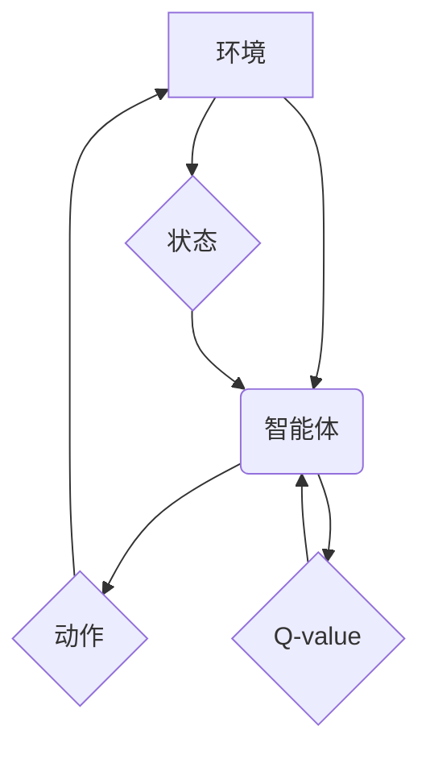

## 深度 Q-learning：在智慧农业中的应用

> 关键词：深度学习、Q-learning、强化学习、智慧农业、智能决策、资源优化

## 1. 背景介绍

随着全球人口增长和资源短缺的加剧，智慧农业已成为实现可持续发展的重要途径。智慧农业通过利用物联网、大数据、人工智能等技术，实现农业生产过程的智能化、自动化和精准化，提高资源利用效率、降低生产成本、提升产品质量和产量。

强化学习（Reinforcement Learning，RL）作为一种机器学习范式，在智慧农业领域展现出巨大的潜力。它能够通过与环境交互，学习最优的决策策略，从而实现智能决策和资源优化。其中，深度 Q-learning 作为一种结合深度神经网络和 Q-learning 算法的强化学习方法，因其强大的学习能力和应用广泛性，在智慧农业领域得到越来越多的关注。

## 2. 核心概念与联系

**2.1 核心概念**

* **强化学习 (Reinforcement Learning)**：一种机器学习方法，通过智能体与环境的交互，学习最优的策略以最大化累积奖励。
* **Q-learning**：一种经典的强化学习算法，通过学习状态-动作值函数 (Q-value)，选择最优的动作以获得最大的长期奖励。
* **深度神经网络 (Deep Neural Network)**：一种能够学习复杂非线性关系的神经网络结构，能够有效地处理高维数据。

**2.2 架构关系**



**2.3 联系解释**

深度 Q-learning 将深度神经网络应用于 Q-learning 算法，用于学习状态-动作值函数。智能体通过与环境交互，观察状态和获得奖励，并根据学习到的 Q-value 选择最优动作。

## 3. 核心算法原理 & 具体操作步骤

**3.1 算法原理概述**

深度 Q-learning 算法的核心是学习一个状态-动作值函数 Q(s, a)，该函数估计在状态 s 下执行动作 a 的期望累积奖励。算法通过迭代更新 Q-value，最终学习到最优的策略，即在每个状态下选择能够最大化期望累积奖励的动作。

**3.2 算法步骤详解**

1. **初始化**: 初始化状态-动作值函数 Q(s, a) 为零或随机值。
2. **环境交互**: 智能体与环境交互，观察当前状态 s。
3. **动作选择**: 根据当前状态 s 和学习到的 Q-value，选择一个动作 a。可以使用 ε-贪婪策略，以一定的概率选择随机动作，以探索环境。
4. **状态转移**: 执行动作 a 后，环境会进入新的状态 s'，并给予智能体奖励 r。
5. **Q-value 更新**: 更新状态-动作值函数 Q(s, a) 使用 Bellman 方程：

 $$Q(s, a) = Q(s, a) + \alpha [r + \gamma \max_{a'} Q(s', a') - Q(s, a)]$$

其中：

* α 为学习率，控制学习速度。
* γ 为折扣因子，控制未来奖励的权重。
*  max_{a'} Q(s', a') 为在下一个状态 s' 下所有动作的 Q-value 的最大值。

6. **重复步骤 2-5**: 重复上述步骤，直到智能体学习到最优策略。

**3.3 算法优缺点**

**优点**:

* 能够学习复杂决策策略。
* 不需要明确的奖励函数，能够通过环境反馈学习。
* 能够处理高维状态空间。

**缺点**:

* 训练过程可能需要大量时间和数据。
* 容易陷入局部最优解。
* 需要选择合适的超参数，例如学习率和折扣因子。

**3.4 算法应用领域**

深度 Q-learning 算法在智慧农业领域具有广泛的应用前景，例如：

* **智能灌溉**: 根据土壤湿度、气象条件等信息，智能地控制灌溉系统，优化水资源利用。
* **精准施肥**: 根据作物生长需求和土壤肥力状况，精准施肥，提高肥料利用效率，减少环境污染。
* **病虫害防治**: 通过图像识别和机器学习，识别病虫害，并智能地进行防治，提高作物产量和质量。
* **智能收获**: 利用机器人技术和深度学习，实现智能化收获，提高效率和降低人工成本。

## 4. 数学模型和公式 & 详细讲解 & 举例说明

**4.1 数学模型构建**

深度 Q-learning 算法的核心是学习一个状态-动作值函数 Q(s, a)，该函数估计在状态 s 下执行动作 a 的期望累积奖励。

**4.2 公式推导过程**

Bellman 方程是深度 Q-learning 算法的核心更新公式，用于更新状态-动作值函数 Q(s, a)：

$$Q(s, a) = Q(s, a) + \alpha [r + \gamma \max_{a'} Q(s', a') - Q(s, a)]$$

其中：

* α 为学习率，控制学习速度。
* γ 为折扣因子，控制未来奖励的权重。
* r 为在执行动作 a 后获得的奖励。
* s' 为执行动作 a 后进入的新状态。
* max_{a'} Q(s', a') 为在下一个状态 s' 下所有动作的 Q-value 的最大值。

**4.3 案例分析与讲解**

假设一个智能体在玩一个简单的游戏，游戏状态 s 可以表示为游戏棋盘的当前状态，动作 a 可以表示为智能体可以执行的棋步。

当智能体执行某个动作 a 在状态 s 时，会获得奖励 r 和进入新的状态 s'。

深度 Q-learning 算法会通过 Bellman 方程不断更新 Q(s, a) 的值，使得 Q(s, a) 能够反映在状态 s 下执行动作 a 的期望累积奖励。

最终，智能体会学习到最优策略，即在每个状态下选择能够最大化期望累积奖励的动作。

## 5. 项目实践：代码实例和详细解释说明

**5.1 开发环境搭建**

* Python 3.x
* TensorFlow 或 PyTorch 深度学习框架
* NumPy 科学计算库
* Matplotlib 数据可视化库

**5.2 源代码详细实现**

```python
import tensorflow as tf

# 定义状态-动作值函数
class QNetwork(tf.keras.Model):
    def __init__(self, state_size, action_size):
        super(QNetwork, self).__init__()
        self.dense1 = tf.keras.layers.Dense(64, activation='relu')
        self.dense2 = tf.keras.layers.Dense(32, activation='relu')
        self.output = tf.keras.layers.Dense(action_size)

    def call(self, state):
        x = self.dense1(state)
        x = self.dense2(x)
        return self.output(x)

# 定义深度 Q-learning 算法
def deep_q_learning(env, q_network, learning_rate, discount_factor, epsilon, num_episodes):
    # 初始化 Q-网络
    optimizer = tf.keras.optimizers.Adam(learning_rate)

    # 训练循环
    for episode in range(num_episodes):
        state = env.reset()
        done = False
        total_reward = 0

        while not done:
            # 选择动作
            if tf.random.uniform(()) < epsilon:
                action = env.action_space.sample()
            else:
                action = tf.argmax(q_network(tf.expand_dims(state, axis=0))).numpy()[0]

            # 执行动作
            next_state, reward, done, _ = env.step(action)

            # 更新 Q-网络
            with tf.GradientTape() as tape:
                target_q_value = reward + discount_factor * tf.reduce_max(q_network(tf.expand_dims(next_state, axis=0)))
                q_value = q_network(tf.expand_dims(state, axis=0))[0][action]
                loss = tf.keras.losses.MSE(target_q_value, q_value)

            gradients = tape.gradient(loss, q_network.trainable_variables)
            optimizer.apply_gradients(zip(gradients, q_network.trainable_variables))

            # 更新状态
            state = next_state
            total_reward += reward

        print(f"Episode {episode+1}, Total Reward: {total_reward}")

#... (其他代码)
```

**5.3 代码解读与分析**

* **QNetwork 类**: 定义了状态-动作值函数的网络结构，使用两层全连接神经网络。
* **deep_q_learning 函数**: 实现深度 Q-learning 算法的核心逻辑，包括环境交互、动作选择、Q-网络更新等步骤。
* **学习率、折扣因子、探索率**: 这些超参数需要根据实际情况进行调整。

**5.4 运行结果展示**

运行代码后，会输出每个回合的总奖励，随着训练的进行，总奖励会逐渐增加，表明智能体正在学习到最优策略。

## 6. 实际应用场景

**6.1 智能灌溉**

* **数据采集**: 利用传感器收集土壤湿度、气温、光照强度等数据。
* **状态定义**: 将传感器数据组合成状态向量，表示土壤水分状况。
* **动作选择**: 根据状态向量和学习到的 Q-value，选择合适的灌溉量。
* **奖励函数**: 根据作物生长状况和水资源利用效率，设计奖励函数。

**6.2 精准施肥**

* **数据采集**: 利用传感器收集土壤肥力、作物生长状况等数据。
* **状态定义**: 将传感器数据和作物生长信息组合成状态向量。
* **动作选择**: 根据状态向量和学习到的 Q-value，选择合适的肥料类型和施肥量。
* **奖励函数**: 根据作物产量、肥料利用效率和环境影响，设计奖励函数。

**6.3 病虫害防治**

* **数据采集**: 利用图像识别技术收集作物病虫害图像。
* **状态定义**: 将病虫害图像特征提取为状态向量。
* **动作选择**: 根据状态向量和学习到的 Q-value，选择合适的防治措施。
* **奖励函数**: 根据病虫害控制效果和防治成本，设计奖励函数。

**6.4 未来应用展望**

随着人工智能技术的发展，深度 Q-learning 在智慧农业领域的应用将更加广泛和深入。例如：

* **智能决策支持系统**: 基于深度 Q-learning 的智能决策支持系统，能够帮助农民制定最优的农业生产方案。
* **无人化农业**: 深度 Q-learning 可以用于控制无人机、机器人等设备，实现无人化农业生产。
* **精准农业**: 深度 Q-learning 可以帮助实现精准农业，例如精准施肥、精准灌溉、精准病虫害防治。

## 7. 工具和资源推荐

**7.1 学习资源推荐**

* **书籍**:
    * Reinforcement Learning: An Introduction by Richard S. Sutton and Andrew G. Barto
    * Deep Reinforcement Learning Hands-On by Maxim Lapan
* **在线课程**:
    * Deep Reinforcement Learning Specialization by DeepLearning.AI
    * Reinforcement Learning by David Silver (University of DeepMind)

**7.2 开发工具推荐**

* **Python**: 广泛使用的编程语言，适合深度学习开发。
* **TensorFlow**: Google 开发的开源深度学习框架。
* **PyTorch**: Facebook 开发的开源深度学习框架。
* **OpenAI Gym**: 提供各种强化学习环境的开源库。

**7.3 相关论文推荐**

* Deep Q-Network (DQN