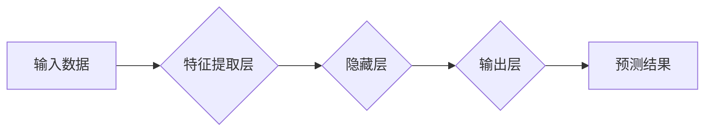

## 深度学习(Deep Learning) - 原理与代码实例讲解

> 关键词：深度学习、神经网络、卷积神经网络、循环神经网络、反向传播、梯度下降、TensorFlow、PyTorch

## 1. 背景介绍

深度学习作为机器学习领域的一个重要分支，近年来取得了令人瞩目的成就，在图像识别、自然语言处理、语音识别等领域展现出强大的应用潜力。其核心在于利用多层神经网络结构，从海量数据中学习复杂的特征表示，从而实现对复杂问题的智能处理。

传统的机器学习方法通常需要人工提取特征，而深度学习则能够自动学习特征，这使得其在处理非线性关系和高维数据方面具有显著优势。随着计算能力的提升和数据量的爆炸式增长，深度学习迎来了新的发展机遇，并逐渐成为人工智能领域的主流技术之一。

## 2. 核心概念与联系

深度学习的核心概念是**人工神经网络 (Artificial Neural Network, ANN)**。ANN 是一种模仿人脑神经网络结构的计算模型，由 interconnected nodes (神经元) 组成，这些神经元通过连接权重来传递信息。

**深度学习**指的是使用多层神经网络来进行学习。这些多层网络能够学习到更抽象和高级的特征表示，从而提高模型的学习能力和泛化能力。

**以下是一个深度学习系统架构的Mermaid流程图：**



**核心概念联系：**

* **输入数据:** 深度学习模型的输入数据可以是各种形式，例如图像、文本、音频等。
* **特征提取层:**  负责从输入数据中提取特征，例如图像中的边缘、纹理等。
* **隐藏层:**  深度学习模型的核心部分，负责学习数据的抽象特征表示。
* **输出层:**  根据隐藏层的学习结果，生成最终的预测结果。
* **预测结果:**  深度学习模型的输出结果，例如图像分类结果、文本翻译结果等。

## 3. 核心算法原理 & 具体操作步骤

### 3.1  算法原理概述

深度学习的核心算法是**反向传播算法 (Backpropagation)**。反向传播算法通过计算误差，并根据误差调整神经网络的连接权重，从而使模型的预测结果越来越准确。

**具体步骤如下：**

1. **前向传播:** 将输入数据通过神经网络传递，得到最终的预测结果。
2. **误差计算:** 计算预测结果与真实结果之间的误差。
3. **反向传播:** 将误差反向传播到神经网络的各个层，计算每个神经元的梯度。
4. **权重更新:** 根据梯度更新神经网络的连接权重，使模型的预测结果更加准确。

### 3.2  算法步骤详解

1. **初始化:**  随机初始化神经网络的连接权重。
2. **前向传播:**  将输入数据输入到神经网络的第一层，并通过激活函数计算每个神经元的输出。然后将输出传递到下一层，依次进行计算，直到得到最终的预测结果。
3. **损失函数:**  使用损失函数来衡量预测结果与真实结果之间的误差。常见的损失函数包括均方误差 (MSE)、交叉熵损失 (Cross-Entropy Loss) 等。
4. **反向传播:**  计算损失函数对每个神经元的梯度。梯度表示了权重调整的方向和幅度。
5. **权重更新:**  使用梯度下降算法来更新神经网络的连接权重。梯度下降算法通过减小权重的梯度来最小化损失函数的值。

### 3.3  算法优缺点

**优点:**

* **自动特征提取:**  深度学习模型能够自动学习特征，无需人工干预。
* **高精度:**  深度学习模型在许多任务中能够达到很高的精度。
* **可扩展性:**  深度学习模型可以很容易地扩展到更大的数据集和更复杂的模型架构。

**缺点:**

* **训练时间长:**  深度学习模型的训练时间通常很长，需要大量的计算资源。
* **数据依赖性:**  深度学习模型对数据的质量和数量有很高的依赖性。
* **可解释性差:**  深度学习模型的决策过程难以解释，这使得其在一些领域难以应用。

### 3.4  算法应用领域

深度学习算法广泛应用于以下领域:

* **图像识别:**  物体检测、图像分类、图像分割等。
* **自然语言处理:**  文本分类、情感分析、机器翻译等。
* **语音识别:**  语音转文本、语音合成等。
* **推荐系统:**  商品推荐、用户画像等。
* **医疗诊断:**  疾病预测、图像分析等。

## 4. 数学模型和公式 & 详细讲解 & 举例说明

### 4.1  数学模型构建

深度学习模型的核心是**多层感知机 (Multilayer Perceptron, MLP)**。MLP 由多个神经元层组成，每个神经元接收来自上一层的输入，并通过激活函数进行处理，然后将处理后的结果传递到下一层。

**一个简单的 MLP 模型可以表示为：**

$$
y = f(W_3 * a_2 + b_3)
$$

$$
a_2 = f(W_2 * a_1 + b_2)
$$

$$
a_1 = x
$$

其中：

* $x$ 是输入数据。
* $a_1$, $a_2$ 分别是第一层和第二层的激活输出。
* $W_2$, $W_3$ 分别是第一层到第二层和第二层到输出层的权重矩阵。
* $b_2$, $b_3$ 分别是第一层和第二层的偏置向量。
* $f$ 是激活函数，例如 sigmoid 函数、ReLU 函数等。
* $y$ 是模型的输出结果。

### 4.2  公式推导过程

反向传播算法的核心是计算损失函数对每个权重的梯度。

**损失函数的梯度可以表示为：**

$$
\frac{\partial L}{\partial W} = \frac{\partial L}{\partial y} * \frac{\partial y}{\partial W}
$$

其中：

* $L$ 是损失函数。
* $y$ 是模型的输出结果。
* $W$ 是权重。

通过链式法则，可以将梯度分解成多个部分，并逐层计算。

### 4.3  案例分析与讲解

**举例说明:**

假设我们有一个简单的 MLP 模型，用于分类手写数字。模型的输入是图像像素值，输出是数字的类别。

我们可以使用反向传播算法来训练这个模型。首先，我们将输入图像数据到模型中，得到预测结果。然后，我们将预测结果与真实类别进行比较，计算损失函数的值。

接着，我们将使用梯度下降算法来更新模型的权重。梯度下降算法会根据损失函数的梯度，调整权重的值，使模型的预测结果越来越准确。

## 5. 项目实践：代码实例和详细解释说明

### 5.1  开发环境搭建

为了进行深度学习项目实践，我们需要搭建一个合适的开发环境。常用的开发环境包括：

* **Python:**  深度学习的编程语言。
* **TensorFlow:**  开源深度学习框架。
* **PyTorch:**  另一个开源深度学习框架。
* **CUDA:**  GPU 加速库。

### 5.2  源代码详细实现

以下是一个使用 TensorFlow 实现简单的图像分类模型的代码示例：

```python
import tensorflow as tf

# 定义模型结构
model = tf.keras.models.Sequential([
  tf.keras.layers.Conv2D(32, (3, 3), activation='relu', input_shape=(28, 28, 1)),
  tf.keras.layers.MaxPooling2D((2, 2)),
  tf.keras.layers.Conv2D(64, (3, 3), activation='relu'),
  tf.keras.layers.MaxPooling2D((2, 2)),
  tf.keras.layers.Flatten(),
  tf.keras.layers.Dense(10, activation='softmax')
])

# 编译模型
model.compile(optimizer='adam',
              loss='sparse_categorical_crossentropy',
              metrics=['accuracy'])

# 加载数据
(x_train, y_train), (x_test, y_test) = tf.keras.datasets.mnist.load_data()

# 训练模型
model.fit(x_train, y_train, epochs=5)

# 评估模型
loss, accuracy = model.evaluate(x_test, y_test)
print('Test loss:', loss)
print('Test accuracy:', accuracy)
```

### 5.3  代码解读与分析

这段代码定义了一个简单的卷积神经网络 (CNN) 模型，用于分类 MNIST 手写数字数据集。

* **模型结构:**  模型由两个卷积层、两个最大池化层、一个 Flatten 层和一个全连接层组成。
* **激活函数:**  模型使用 ReLU 函数作为激活函数，并使用 softmax 函数作为输出层的激活函数。
* **优化器:**  模型使用 Adam 优化器进行训练。
* **损失函数:**  模型使用 sparse_categorical_crossentropy 作为损失函数。
* **评价指标:**  模型使用 accuracy 作为评价指标。

### 5.4  运行结果展示

运行这段代码后，模型将训练完成，并输出测试集上的损失值和准确率。

## 6. 实际应用场景

深度学习在各个领域都有广泛的应用场景，以下是一些例子：

### 6.1  图像识别

* **物体检测:**  自动识别图像中的物体，例如人、车、猫等。
* **图像分类:**  将图像分类到不同的类别，例如风景、人物、动物等。
* **图像分割:**  将图像分割成不同的区域，例如前景和背景。

### 6.2  自然语言处理

* **文本分类:**  将文本分类到不同的类别，例如情感分析、主题分类等。
* **机器翻译:**  将文本从一种语言翻译成另一种语言。
* **文本生成:**  生成新的文本，例如文章、故事、对话等。

### 6.3  语音识别

* **语音转文本:**  将语音转换为文本。
* **语音合成:**  将文本转换为语音。
* **语音助手:**  例如 Siri、Alexa 等语音助手。

### 6.4  未来应用展望

深度学习技术还在不断发展，未来将有更多新的应用场景出现，例如：

* **自动驾驶:**  深度学习可以帮助自动驾驶汽车识别道路、交通信号灯等，从而实现自动驾驶。
* **医疗诊断:**  深度学习可以帮助医生诊断疾病，例如癌症、心血管疾病等。
* **个性化教育:**  深度学习可以根据学生的学习情况，提供个性化的学习内容和教学方法。

## 7. 工具和资源推荐

### 7.1  学习资源推荐

* **书籍:**
    * 深度学习 (Deep Learning) - Ian Goodfellow, Yoshua Bengio, Aaron Courville
    * 深度学习实践 (Deep Learning with Python) - Francois Chollet
* **在线课程:**
    * 深度学习 Specialization - Andrew Ng (Coursera)
    * fast.ai - Practical Deep Learning for Coders
* **博客和网站:**
    * TensorFlow Blog
    * PyTorch Blog
    * Towards Data Science

### 7.2  开发工具推荐

* **TensorFlow:**  开源深度学习框架，支持多种硬件平台。
* **PyTorch:**  另一个开源深度学习框架，以其灵活性和易用性而闻名。
* **Keras:**  高层深度学习 API，可以运行在 TensorFlow、Theano 或 CNTK 后端。

### 7.3  相关论文推荐

* **ImageNet Classification with Deep Convolutional Neural Networks** - Alex Krizhevsky, Ilya Sutskever, Geoffrey E