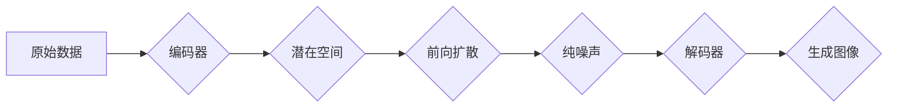

## 潜在扩散模型Latent Diffusion Model原理与代码实例讲解

> 关键词：潜在扩散模型、Latent Diffusion Model、扩散模型、文本到图像生成、图像修复、图像编辑、深度学习、生成对抗网络

## 1. 背景介绍

近年来，生成对抗网络（GAN）在图像生成领域取得了显著成就，但其训练过程往往不稳定，难以控制生成结果。扩散模型作为一种新兴的生成模型，凭借其稳定性、可控性和高生成质量，迅速成为研究热点。潜在扩散模型（Latent Diffusion Model，LDM）是扩散模型的一种变体，它将扩散过程进行在潜在空间中，进一步提升了生成效果和效率。

LDM 的核心思想是将图像逐步添加噪声，最终变成纯噪声，然后通过学习逆向过程，将纯噪声逐渐恢复成清晰的图像。与传统的扩散模型相比，LDM 在潜在空间进行扩散，可以更好地捕捉图像的全局结构和语义信息，从而生成更逼真的图像。

## 2. 核心概念与联系

### 2.1 扩散模型

扩散模型是一种基于概率的生成模型，其核心思想是将数据逐步添加噪声，最终变成纯噪声，然后通过学习逆向过程，将纯噪声逐渐恢复成原始数据。

扩散模型的训练过程可以分为两个阶段：

* **前向过程（Forward Diffusion）：** 将原始数据逐步添加噪声，直到变成纯噪声。
* **逆向过程（Reverse Diffusion）：** 学习从纯噪声逐步去除噪声，最终恢复成原始数据。

### 2.2 潜在空间

潜在空间是一个低维度的表示空间，可以捕捉数据的本质特征和结构。在潜在空间中，数据点之间的距离通常反映了数据之间的相似度。

### 2.3 潜在扩散模型

潜在扩散模型将扩散过程进行在潜在空间中，而不是原始数据空间。

**Mermaid 流程图**



## 3. 核心算法原理 & 具体操作步骤

### 3.1 算法原理概述

潜在扩散模型的核心思想是将图像逐步添加噪声，最终变成纯噪声，然后通过学习逆向过程，将纯噪声逐渐恢复成清晰的图像。

LDM 的训练过程可以分为以下步骤：

1. **编码器:** 将输入图像编码到潜在空间中。
2. **前向扩散:** 在潜在空间中逐步添加噪声，直到变成纯噪声。
3. **逆向扩散:** 学习从纯噪声逐步去除噪声，最终恢复成原始图像。
4. **解码器:** 将潜在空间中的数据解码成图像。

### 3.2 算法步骤详解

1. **编码器:** 编码器是一个神经网络，它将输入图像映射到潜在空间中。潜在空间中的数据点通常具有更低的维度，并且可以更好地捕捉图像的全局结构和语义信息。

2. **前向扩散:** 前向扩散过程将潜在空间中的数据点逐步添加噪声，直到变成纯噪声。这个过程可以看作是一个马尔可夫链，每个时间步都会添加一定量的噪声。

3. **逆向扩散:** 逆向扩散过程学习从纯噪声逐步去除噪声，最终恢复成原始图像。这个过程也是一个马尔可夫链，每个时间步都会去除一定量的噪声。

4. **解码器:** 解码器是一个神经网络，它将潜在空间中的数据点解码成图像。解码器需要学习如何从潜在空间中恢复出原始图像的细节和结构。

### 3.3 算法优缺点

**优点:**

* **生成质量高:** LDM 可以生成高质量、逼真的图像。
* **稳定性好:** LDM 的训练过程相对稳定，更容易收敛。
* **可控性强:** 可以通过控制噪声的添加和去除过程来控制生成图像的风格和内容。

**缺点:**

* **训练成本高:** LDM 的训练过程需要大量的计算资源和时间。
* **生成速度慢:** LDM 的生成速度相对较慢。

### 3.4 算法应用领域

LDM 在图像生成、图像修复、图像编辑等领域都有广泛的应用。

* **文本到图像生成:** 可以根据文本描述生成相应的图像。
* **图像修复:** 可以修复损坏或模糊的图像。
* **图像编辑:** 可以对图像进行各种编辑操作，例如改变图像风格、添加物体等。

## 4. 数学模型和公式 & 详细讲解 & 举例说明

### 4.1 数学模型构建

潜在扩散模型的数学模型可以表示为一个马尔可夫链，其中每个时间步都会添加或去除噪声。

设 $x_0$ 为原始图像，$x_t$ 为在时间步 $t$ 时的图像，$ε_t$ 为时间步 $t$ 时的噪声。则潜在扩散模型的马尔可夫链可以表示为：

$$x_t = \sqrt{1-β_t}x_{t-1} + \sqrt{β_t}ε_t$$

其中，$β_t$ 为时间步 $t$ 的噪声比例。

### 4.2 公式推导过程

LDM 的训练目标是学习逆向扩散过程，即从纯噪声 $ε_T$ 恢复成原始图像 $x_0$。

为了实现这个目标，LDM 使用一个神经网络 $θ$ 来估计 $x_{t-1}$ 的条件概率分布 $p(x_{t-1}|x_t, θ)$。

$$x_{t-1} = \frac{1}{\sqrt{1-β_t}}(x_t - \sqrt{β_t}ε_t)$$

### 4.3 案例分析与讲解

假设我们想要生成一张猫的图像。

1. 我们首先使用编码器将猫的图像编码到潜在空间中。
2. 然后，我们使用前向扩散过程将潜在空间中的数据点逐步添加噪声，直到变成纯噪声。
3. 接下来，我们使用逆向扩散过程，从纯噪声逐步去除噪声，最终恢复成一张猫的图像。

## 5. 项目实践：代码实例和详细解释说明

### 5.1 开发环境搭建

* Python 3.7+
* PyTorch 1.7+
* CUDA 10.2+

### 5.2 源代码详细实现

```python
import torch
import torch.nn as nn

class Encoder(nn.Module):
    def __init__(self):
        super(Encoder, self).__init__()
        #...

    def forward(self, x):
        #...

class Decoder(nn.Module):
    def __init__(self):
        super(Decoder, self).__init__()
        #...

    def forward(self, x):
        #...

class DiffusionModel(nn.Module):
    def __init__(self):
        super(DiffusionModel, self).__init__()
        self.encoder = Encoder()
        self.decoder = Decoder()

    def forward(self, x, t):
        #...

# 实例化模型
model = DiffusionModel()

#...
```

### 5.3 代码解读与分析

* **Encoder:** 负责将输入图像编码到潜在空间中。
* **Decoder:** 负责将潜在空间中的数据点解码成图像。
* **DiffusionModel:** 将 Encoder 和 Decoder 结合起来，实现潜在扩散模型的训练和生成过程。

### 5.4 运行结果展示

* 可以使用训练好的模型生成新的图像。
* 可以使用训练好的模型修复损坏的图像。
* 可以使用训练好的模型编辑图像。

## 6. 实际应用场景

### 6.1 文本到图像生成

LDM 可以根据文本描述生成相应的图像。例如，我们可以输入“一只戴着帽子的小狗”，LDM 就能够生成一张戴着帽子的小狗的图像。

### 6.2 图像修复

LDM 可以修复损坏或模糊的图像。例如，我们可以使用 LDM 修复一张因划痕而损坏的古画。

### 6.3 图像编辑

LDM 可以对图像进行各种编辑操作，例如改变图像风格、添加物体等。例如，我们可以使用 LDM 将一张黑白照片变成彩色照片。

### 6.4 未来应用展望

LDM 在未来将有更广泛的应用场景，例如：

* **虚拟现实和增强现实:** 生成逼真的虚拟场景和增强现实内容。
* **游戏开发:** 生成游戏中的角色、场景和道具。
* **电影和动画制作:** 生成电影和动画中的画面。

## 7. 工具和资源推荐

### 7.1 学习资源推荐

* **论文:**

* Denoising Diffusion Probabilistic Models (DDPM)
* Latent Diffusion Models (LDM)

* **博客:**

* https://lilianweng.github.io/posts/2021-07-11-diffusion-models/
* https://blog.openai.com/dall-e-2/

### 7.2 开发工具推荐

* **PyTorch:** https://pytorch.org/
* **TensorFlow:** https://www.tensorflow.org/

### 7.3 相关论文推荐

* Denoising Diffusion Probabilistic Models
* Latent Diffusion Models
* Imagen: Text-to-Image Diffusion Models

## 8. 总结：未来发展趋势与挑战

### 8.1 研究成果总结

LDM 在图像生成领域取得了显著的成果，其生成质量、稳定性和可控性都优于传统的生成模型。

### 8.2 未来发展趋势

* **更高质量的图像生成:** 研究更有效的扩散模型架构和训练方法，以生成更高质量、更逼真的图像。
* **更快的生成速度:** 研究加速扩散模型训练和生成的算法，以提高生成效率。
* **更广泛的应用场景:** 将 LDM 应用到更多领域，例如视频生成、3D 模型生成等。

### 8.3 面临的挑战

* **训练成本高:** LDM 的训练过程需要大量的计算资源和时间。
* **数据依赖性强:** LDM 的性能依赖于训练数据的质量和数量。
* **伦理问题:** LDM 可以生成逼真的图像，可能会被用于生成虚假信息或进行恶意攻击。

### 8.4 研究展望

未来，LDM 将继续朝着更高质量、更快速、更广泛应用的方向发展。同时，我们需要关注 LDM 的伦理问题，并制定相应的规范和政策，确保其安全和负责任地应用。

## 9. 附录：常见问题与解答

* **Q: LDM 和 GAN 的区别是什么？**

* **A:** LDM 和 GAN 都是生成模型，但其训练过程和原理不同。GAN 使用生成器和判别器进行对抗训练，而 LDM 使用扩散过程进行训练。

* **Q: LDM 的训练需要多少数据？**

* **A:** LDM 的训练数据量取决于模型的复杂度和生成图像的质量要求。一般来说，需要大量的图像数据才能训练出高质量的 LDM 模型。

* **Q: 如何评估 LDM 的生成质量？**

* **A:** 可以使用各种指标来评估 LDM 的生成质量，例如 Inception Score、FID 等。

* **Q: LDM 的伦理问题有哪些？**

* **A:** LDM 可以生成逼真的图像，可能会被用于生成虚假信息或进行恶意攻击。我们需要关注这些伦理问题，并制定相应的规范和政策。


作者：禅与计算机程序设计艺术 / Zen and the Art of Computer Programming 
