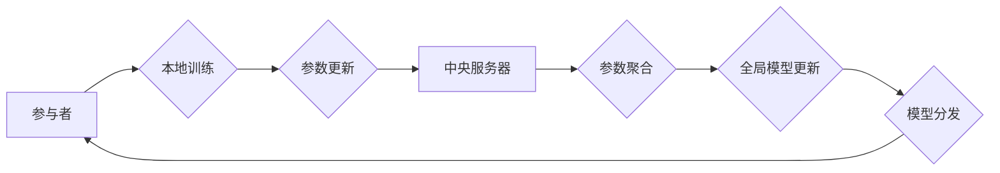

## 关键词：联邦学习、隐私保护、分布式机器学习、模型训练、参数更新、代码实例

## 1. 背景介绍

在当今数据驱动时代，机器学习模型的训练离不开海量数据。然而，数据往往分散在不同的设备或机构中，例如手机、服务器、医院等，直接将这些数据集中到一个中心进行训练会引发严重的隐私泄露问题。联邦学习 (Federated Learning, FL) 应运而生，它是一种分布式机器学习方法，旨在训练全局模型而无需将原始数据传输到中央服务器。

联邦学习的核心思想是将模型参数在参与者之间进行迭代更新。每个参与者在本地对自己的数据进行训练，并仅将模型参数的更新发送到中央服务器。中央服务器将所有参与者的参数更新聚合起来，更新全局模型，然后将更新后的全局模型分发给所有参与者。如此循环往复，最终训练出一个能够在所有参与者数据上表现良好的全局模型。

## 2. 核心概念与联系

### 2.1 参与者

参与者是指拥有数据并参与模型训练的个体或机构。例如，在手机应用场景中，参与者就是使用该应用的用户；在医疗领域，参与者可能是不同的医院。

### 2.2 模型参数

模型参数是机器学习模型的关键要素，决定了模型的学习能力。在联邦学习中，模型参数在参与者之间进行迭代更新。

### 2.3 中央服务器

中央服务器是联邦学习系统中的协调中心，负责接收参与者的参数更新，聚合更新，更新全局模型，并将更新后的全局模型分发给参与者。

### 2.4 全局模型

全局模型是联邦学习最终训练的目标，它是在所有参与者数据上进行训练的模型，能够在所有参与者数据上表现良好。

**联邦学习架构流程图**



## 3. 核心算法原理 & 具体操作步骤

### 3.1 算法原理概述

联邦学习的核心算法是基于梯度下降的迭代更新算法。每个参与者在本地对自己的数据进行训练，并计算模型参数的梯度。然后，参与者将模型参数的梯度发送到中央服务器。中央服务器将所有参与者的梯度聚合起来，更新全局模型的参数。最后，中央服务器将更新后的全局模型分发给所有参与者。

### 3.2 算法步骤详解

1. **初始化:** 中央服务器将一个初始的全局模型参数分配给所有参与者。
2. **本地训练:** 每个参与者在本地对自己的数据进行训练，并计算模型参数的梯度。
3. **参数更新:** 每个参与者将模型参数的梯度发送到中央服务器。
4. **参数聚合:** 中央服务器将所有参与者的梯度聚合起来，更新全局模型的参数。
5. **模型分发:** 中央服务器将更新后的全局模型参数分发给所有参与者。
6. **重复步骤2-5:** 重复上述步骤，直到模型收敛或达到预设的训练次数。

### 3.3 算法优缺点

**优点:**

* **隐私保护:** 数据无需离开参与者的设备，有效保护数据隐私。
* **数据分散:** 可以利用分布在不同设备或机构的数据进行训练，提高模型的泛化能力。
* **高效训练:** 可以并行训练，提高训练效率。

**缺点:**

* **通信成本:** 参数更新需要频繁地传输数据，可能会导致通信成本较高。
* **数据异质性:** 不同参与者的数据可能存在异质性，可能会影响模型的训练效果。
* **安全风险:** 中央服务器可能成为攻击目标，需要采取相应的安全措施。

### 3.4 算法应用领域

联邦学习在各个领域都有广泛的应用，例如：

* **移动设备:** 在手机上训练语音识别、图像识别等模型，无需将用户语音或图像数据上传到云端。
* **医疗保健:** 在多个医院之间训练疾病诊断模型，保护患者隐私，同时提高模型的准确性。
* **金融服务:** 在多个银行之间训练欺诈检测模型，提高金融安全。

## 4. 数学模型和公式 & 详细讲解 & 举例说明

### 4.1 数学模型构建

假设我们有一个包含 $n$ 个参与者的联邦学习系统，每个参与者 $i$ 拥有自己的数据集 $D_i$。我们的目标是训练一个全局模型 $w^*$，它能够在所有参与者的数据上表现良好。

我们可以使用以下数学模型来表示联邦学习的过程：

* $w_i^t$: 参与者 $i$ 在第 $t$ 轮迭代的本地模型参数。
* $w_0$: 初始的全局模型参数。
* $g_i^t$: 参与者 $i$ 在第 $t$ 轮迭代计算的模型参数梯度。
* $w_{agg}^t$: 第 $t$ 轮迭代的聚合参数更新。
* $w_{i}^{t+1}$: 参与者 $i$ 在第 $t+1$ 轮迭代的本地模型参数。

### 4.2 公式推导过程

联邦学习的迭代更新过程可以表示为以下公式：

* **本地训练:** $w_i^{t+1} = w_i^t - \eta_i g_i^t$

* **参数聚合:** $w_{agg}^t = \frac{1}{n} \sum_{i=1}^{n} g_i^t$

* **全局模型更新:** $w^{t+1} = w^t + w_{agg}^t$

其中，$\eta_i$ 是参与者 $i$ 的学习率。

### 4.3 案例分析与讲解

假设我们有一个包含两个参与者的联邦学习系统，每个参与者拥有自己的数据集。

* 参与者 1 的本地模型参数为 $w_1^0 = [0.1, 0.2]$。
* 参与者 2 的本地模型参数为 $w_2^0 = [0.3, 0.4]$。

在第一轮迭代中，每个参与者对自己的数据进行训练，并计算模型参数的梯度。假设参与者 1 的梯度为 $g_1^0 = [-0.05, -0.1]$，参与者 2 的梯度为 $g_2^0 = [-0.1, -0.2]$。

中央服务器将两个参与者的梯度聚合起来，得到 $w_{agg}^0 = \frac{1}{2} (-0.05 - 0.1, -0.1 - 0.2) = [-0.075, -0.15]$。

然后，中央服务器将聚合参数更新与初始全局模型参数相加，得到更新后的全局模型参数 $w^1 = w^0 + w_{agg}^0$。

## 5. 项目实践：代码实例和详细解释说明

### 5.1 开发环境搭建

为了实现联邦学习的代码实例，我们需要搭建一个开发环境。

* **操作系统:** Linux 或 macOS
* **编程语言:** Python
* **深度学习框架:** TensorFlow 或 PyTorch
* **其他依赖:** numpy, pandas, scikit-learn 等

### 5.2 源代码详细实现

以下是一个使用 TensorFlow 实现联邦学习的简单代码实例：

```python
import tensorflow as tf

# 定义模型
model = tf.keras.models.Sequential([
    tf.keras.layers.Dense(10, activation='relu', input_shape=(784,)),
    tf.keras.layers.Dense(10)
])

# 定义联邦学习训练函数
def federated_train(clients, epochs, learning_rate):
    for epoch in range(epochs):
        # 每个参与者本地训练
        for client in clients:
            client.train(learning_rate)
        # 参数聚合
        aggregated_params = client.aggregate_params()
        # 全局模型更新
        model.set_weights(aggregated_params)
    return model

# 模拟参与者
class Client:
    def __init__(self, data, model):
        self.data = data
        self.model = model

    def train(self, learning_rate):
        # 在本地数据上训练模型
        pass

    def aggregate_params(self):
        # 计算模型参数梯度并返回
        pass

# 创建参与者
clients = [Client(data1, model), Client(data2, model)]

# 训练模型
model = federated_train(clients, epochs=10, learning_rate=0.01)
```

### 5.3 代码解读与分析

* **模型定义:** 代码首先定义了一个简单的深度学习模型，用于分类任务。
* **联邦学习训练函数:** `federated_train` 函数模拟了联邦学习的训练过程，包括本地训练、参数聚合和全局模型更新。
* **参与者模拟:** `Client` 类模拟了一个参与者，包含本地数据和模型。
* **训练模型:** 最后，代码创建了两个参与者，并使用 `federated_train` 函数训练模型。

### 5.4 运行结果展示

运行上述代码后，可以得到训练后的模型，并评估其在测试数据上的性能。

## 6. 实际应用场景

### 6.1 手机语音识别

在手机语音识别应用中，用户的数据是私密的，不能上传到云端。联邦学习可以将模型训练在用户的手机上，保护用户隐私，同时提高模型的准确性。

### 6.2 医疗诊断

在医疗诊断领域，患者的医疗数据是高度敏感的。联邦学习可以将模型训练在多个医院之间，保护患者隐私，同时提高模型的诊断准确性。

### 6.3 金融欺诈检测

在金融领域，欺诈交易的检测需要大量的交易数据。联邦学习可以将模型训练在多个银行之间，保护交易数据的隐私，同时提高模型的欺诈检测能力。

### 6.4 未来应用展望

联邦学习在未来将有更广泛的应用场景，例如：

* **个性化推荐:** 在电商平台、社交媒体等平台上，可以利用联邦学习训练个性化推荐模型，保护用户的隐私，同时提供更精准的推荐。
* **自动驾驶:** 在自动驾驶领域，可以利用联邦学习训练驾驶模型，利用来自不同车辆的数据，提高模型的安全性。
* **工业控制:** 在工业控制领域，可以利用联邦学习训练模型，提高生产效率，同时保护工业控制系统的安全。

## 7. 工具和资源推荐

### 7.1 学习资源推荐

* **论文:**
    * McMahan, H. B., Moore, E., Ramage, D., Hampson, S., & y Arcas, B. A. (2017). Communication-efficient learning of deep networks from decentralized data. In Proceedings of the 2017 ACM International Conference on Learning Representations (ICLR)
* **书籍:**
    * Federated Learning: Collaborative Machine Learning Without Centralized Training by  H. Brendan McMahan
* **在线课程:**
    * Coursera: Federated Learning Specialization by Google AI

### 7.2 开发工具推荐

* **TensorFlow Federated:** https://www.tensorflow.org/federated
* **PySyft:** https://www.openmined.org/
* **Flower:** https://flower.ai/

### 7.3 相关论文推荐

* **Federated Learning: Strategies for Improving Communication Efficiency**
* **Personalized Federated Learning**
* **Secure and Private Federated Learning**

## 8. 总结：未来发展趋势与挑战

### 8.1 研究成果总结

联邦学习近年来取得了显著的进展，在隐私保护、数据分散、高效训练等方面展现出巨大的潜力。

### 8.2 未来发展趋势

* **提高通信效率:** 联邦学习的通信成本仍然是一个挑战，未来