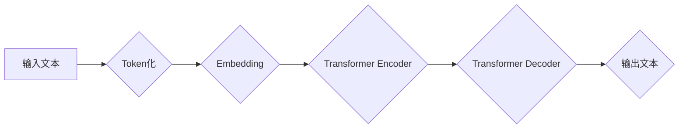

## 芳林新叶催陈叶：训练出你的简版生成式GPT

> 关键词：生成式AI, GPT, 自然语言处理, Transformer, 语言模型, 深度学习, 训练

## 1. 背景介绍

近年来，生成式人工智能（Generative AI）技术蓬勃发展，以其强大的文本生成能力吸引了广泛关注。其中，由 OpenAI 开发的 GPT（Generative Pre-trained Transformer）系列模型，凭借其出色的性能和广泛的应用场景，成为了该领域的风向标。从创作诗歌和剧本到翻译语言和编写代码，GPT 模型展现了令人惊叹的潜力，催生了无数创新应用。

然而，训练一个完整的 GPT 模型需要海量数据和强大的计算资源，对于个人开发者和小型团队来说，这往往是一个难以逾越的障碍。本文将带领你探索训练简版生成式 GPT 模型的途径，让你亲身体验生成式 AI 的魅力，并为深入理解 GPT 模型的工作原理打下坚实基础。

## 2. 核心概念与联系

### 2.1  Transformer 架构

GPT 模型的核心是 Transformer 架构，它是一种专门设计用于处理序列数据的深度神经网络结构。与传统的循环神经网络（RNN）相比，Transformer 具有以下优势：

* **并行计算能力:** Transformer 可以并行处理输入序列中的所有元素，大大提高了训练速度。
* **长距离依赖关系:** Transformer 通过自注意力机制（Self-Attention）可以捕捉输入序列中任意两个元素之间的长距离依赖关系，克服了 RNN 在处理长文本时容易出现梯度消失问题的弊端。

### 2.2  生成式语言模型

生成式语言模型是指能够根据输入文本生成新文本的机器学习模型。GPT 模型属于此类模型，它通过学习大量的文本数据，掌握了语言的语法、语义和风格，从而能够生成流畅、自然的文本。

### 2.3  预训练与微调

GPT 模型采用预训练与微调的训练策略。预训练阶段，模型在海量文本数据上进行训练，学习语言的通用知识。微调阶段，模型在特定任务数据上进行训练，使其能够针对特定任务进行文本生成。

**Mermaid 流程图**



## 3. 核心算法原理 & 具体操作步骤

### 3.1  算法原理概述

GPT 模型的核心算法是基于 Transformer 架构的生成式语言模型。它通过以下步骤完成文本生成任务：

1. **Token化:** 将输入文本分割成一个个独立的单位，称为 token。
2. **Embedding:** 将每个 token 映射到一个低维向量空间，称为 embedding。
3. **Transformer Encoder:** 使用 Transformer Encoder 对输入文本的 embedding 进行编码，提取文本的语义信息。
4. **Transformer Decoder:** 使用 Transformer Decoder 对编码后的信息进行解码，生成目标文本。

### 3.2  算法步骤详解

1. **Token化:** 将输入文本按照空格、标点符号等规则分割成一个个 token。例如，句子 "Hello, world!" 将被分割成 ["Hello", ",", "world", "!"]。

2. **Embedding:** 将每个 token 映射到一个低维向量空间。每个 token 都有一个唯一的 embedding 向量，该向量代表了该 token 的语义信息。

3. **Transformer Encoder:** Transformer Encoder 由多个编码器层组成，每个编码器层包含多头自注意力机制和前馈神经网络。

    * **多头自注意力机制:** 允许模型关注输入序列中不同位置的 token 之间的依赖关系，捕捉长距离依赖信息。
    * **前馈神经网络:** 对每个 token 的编码信息进行非线性变换，进一步提取语义特征。

4. **Transformer Decoder:** Transformer Decoder 类似于 Encoder，但它还包含一个掩码机制，防止模型在生成文本时看到未来词的信息。Decoder 通过解码器层逐个生成目标文本的 token。

### 3.3  算法优缺点

**优点:**

* **强大的文本生成能力:** GPT 模型能够生成流畅、自然的文本，并适应多种文本生成任务。
* **长距离依赖关系处理能力:** Transformer 架构能够有效地捕捉长距离依赖关系，提升文本生成质量。
* **预训练与微调策略:** 预训练模型在通用语言知识上具备优势，微调阶段可以针对特定任务进行优化。

**缺点:**

* **训练成本高:** 训练一个完整的 GPT 模型需要海量数据和强大的计算资源。
* **可解释性差:** GPT 模型是一个复杂的深度神经网络，其内部工作机制难以理解。
* **潜在的偏见和错误:** GPT 模型的训练数据可能包含偏见和错误信息，导致模型生成的文本也存在这些问题。

### 3.4  算法应用领域

GPT 模型在多个领域都有广泛的应用，包括：

* **文本生成:** 写作故事、诗歌、剧本、新闻报道等。
* **机器翻译:** 将一种语言翻译成另一种语言。
* **对话系统:** 开发聊天机器人、虚拟助手等。
* **代码生成:** 自动生成代码片段。
* **文本摘要:** 生成文本的简短摘要。

## 4. 数学模型和公式 & 详细讲解 & 举例说明

### 4.1  数学模型构建

GPT 模型的核心是 Transformer 架构，其数学模型构建基于以下几个关键组件：

* **词嵌入 (Word Embedding):** 将每个词映射到一个低维向量空间，例如词向量维度为 512。
* **多头自注意力机制 (Multi-Head Self-Attention):** 计算每个词与所有其他词之间的注意力权重，捕捉词之间的关系。
* **前馈神经网络 (Feed-Forward Network):** 对每个词的注意力输出进行非线性变换，提取更深层的语义特征。

### 4.2  公式推导过程

**多头自注意力机制:**

$$
Attention(Q, K, V) = \frac{exp(Q \cdot K^T / \sqrt{d_k})}{exp(Q \cdot K^T / \sqrt{d_k})} \cdot V
$$

其中:

* $Q$, $K$, $V$ 分别代表查询矩阵、键矩阵和值矩阵。
* $d_k$ 代表键向量的维度。

**前馈神经网络:**

$$
FFN(x) = \max(0, W_1 x + b_1) * W_2 x + b_2
$$

其中:

* $x$ 代表输入向量。
* $W_1$, $W_2$ 代表权重矩阵。
* $b_1$, $b_2$ 代表偏置项。

### 4.3  案例分析与讲解

假设我们有一个句子 "The cat sat on the mat"，将其 token 化后得到 ["The", "cat", "sat", "on", "the", "mat"]。

在 Transformer Encoder 中，每个 token 会被映射到一个词向量，例如 "The" 的词向量为 [0.1, 0.2, 0.3,...]。

多头自注意力机制会计算每个词与所有其他词之间的注意力权重，例如 "cat" 与 "sat" 之间的注意力权重较高，因为它们在语义上相关。

前馈神经网络会对每个词的注意力输出进行非线性变换，提取更深层的语义特征。

最终，Transformer Encoder 会输出一个编码后的文本表示，该表示包含了句子中所有词的语义信息。

## 5. 项目实践：代码实例和详细解释说明

### 5.1  开发环境搭建

为了训练简版 GPT 模型，你需要准备以下开发环境：

* **Python:** Python 3.6 或更高版本。
* **深度学习框架:** TensorFlow 或 PyTorch。
* **GPU:** 训练 GPT 模型需要强大的计算资源，建议使用 GPU 加速。

### 5.2  源代码详细实现

由于篇幅限制，这里只提供简化的代码示例，实际训练过程需要根据具体需求进行调整。

```python
import tensorflow as tf

# 定义 Transformer Encoder 层
class TransformerEncoderLayer(tf.keras.layers.Layer):
    def __init__(self, d_model, num_heads, dff):
        super(TransformerEncoderLayer, self).__init__()
        self.mha = tf.keras.layers.MultiHeadAttention(num_heads=num_heads, key_dim=d_model)
        self.ffn = tf.keras.layers.Dense(dff, activation='relu')

    def call(self, inputs, training):
        attn_output = self.mha(inputs, inputs, inputs)
        ffn_output = self.ffn(attn_output)
        return ffn_output

# 定义 Transformer Encoder 模型
class TransformerEncoder(tf.keras.layers.Layer):
    def __init__(self, num_layers, d_model, num_heads, dff):
        super(TransformerEncoder, self).__init__()
        self.layers = [TransformerEncoderLayer(d_model, num_heads, dff) for _ in range(num_layers)]

    def call(self, inputs, training):
        for layer in self.layers:
            inputs = layer(inputs, training)
        return inputs

# 定义 GPT 模型
class GPT(tf.keras.Model):
    def __init__(self, vocab_size, d_model, num_layers, num_heads, dff):
        super(GPT, self).__init__()
        self.embedding = tf.keras.layers.Embedding(vocab_size, d_model)
        self.encoder = TransformerEncoder(num_layers, d_model, num_heads, dff)
        self.decoder = tf.keras.layers.Dense(vocab_size)

    def call(self, inputs):
        embedded = self.embedding(inputs)
        encoded = self.encoder(embedded)
        output = self.decoder(encoded)
        return output
```

### 5.3  代码解读与分析

* **TransformerEncoderLayer:** 定义了一个 Transformer Encoder 层，包含多头自注意力机制和前馈神经网络。
* **TransformerEncoder:** 定义了一个 Transformer Encoder 模型，由多个 TransformerEncoderLayer 组成。
* **GPT:** 定义了一个 GPT 模型，包含词嵌入层、Transformer Encoder 和解码器层。

### 5.4  运行结果展示

训练 GPT 模型后，可以将其用于文本生成任务。例如，输入一个句子开头，模型可以根据上下文生成后续的句子。

## 6. 实际应用场景

### 6.1  聊天机器人

GPT 模型可以用于构建更自然、更智能的聊天机器人。

### 6.2  文本摘要

GPT 模型可以自动生成文本的简短摘要，节省时间和精力。

### 6.3  代码生成

GPT 模型可以根据自然语言描述自动生成代码，提高开发效率。

### 6.4  未来应用展望

随着 GPT 模型的不断发展，其应用场景将更加广泛，例如：

* **个性化教育:** 根据学生的学习情况提供个性化的学习内容和辅导。
* **医疗诊断:** 辅助医生进行疾病诊断和治疗方案制定。
* **创意写作:** 帮助人们进行创意写作，例如创作故事、诗歌和剧本。

## 7. 工具和资源推荐

### 7.1  学习资源推荐

* **《深度学习》:** 本书是深度学习领域的经典教材，对 Transformer 架构和 GPT 模型进行了详细介绍。
* **Hugging Face:** Hugging Face 是一个开源机器学习平台，提供各种预训练的 GPT 模型和代码示例。
* **OpenAI API:** OpenAI 提供了 GPT 模型的 API 接口，可以方便地调用 GPT 模型进行文本生成等任务。

### 7.2  开发工具推荐

* **TensorFlow:** TensorFlow 是一个开源的深度学习框架，支持训练和部署 GPT 模型。
* **PyTorch:** PyTorch 是另一个开源的深度学习框架，也支持训练和部署 GPT 模型。
* **Jupyter Notebook:** Jupyter Notebook 是一个交互式编程环境，方便进行代码调试和实验。

### 7.3  相关论文推荐

* **Attention Is All You Need:**