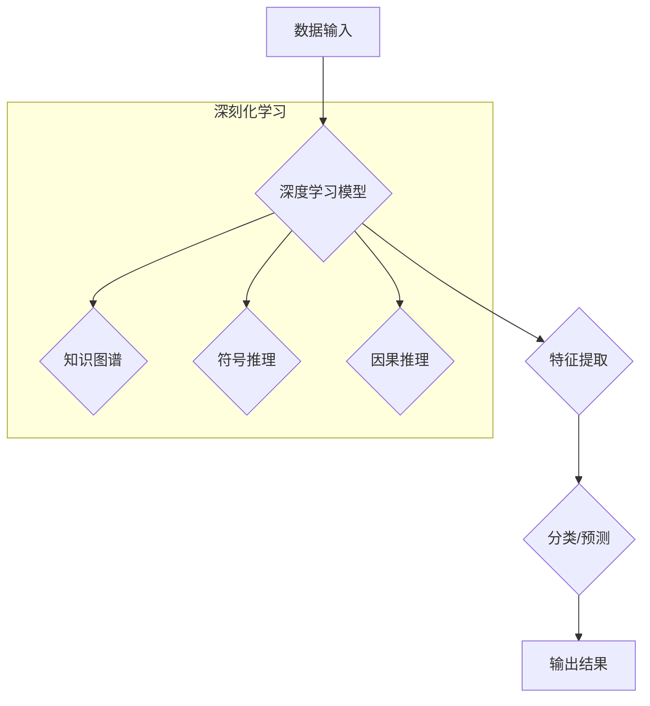

## 认知过程中的深刻化趋势

> 关键词：深度学习、神经网络、认知科学、人工智能、知识表示、语义理解、泛化能力

### 1. 背景介绍

人工智能（AI）的发展日新月异，特别是深度学习技术的兴起，为机器学习带来了前所未有的突破。深度学习模型能够从海量数据中自动学习特征，展现出惊人的性能，在图像识别、自然语言处理等领域取得了显著成果。然而，尽管深度学习取得了巨大成功，但它仍然面临着一些挑战，例如：

* **数据依赖性:** 深度学习模型通常需要大量的 labeled 数据进行训练，而获取高质量 labeled 数据往往成本高昂且耗时。
* **黑盒效应:** 深度学习模型的决策过程往往难以解释，这使得其应用在一些需要透明度和可解释性的领域受到限制。
* **泛化能力:** 深度学习模型在训练数据之外的数据上表现往往不如预期，缺乏对新知识的学习和适应能力。

这些挑战表明，深度学习模型仍然距离真正的人类智能还有很长的路要走。为了解决这些问题，研究者们正在探索新的方向，其中之一就是**认知过程中的深刻化趋势**。

认知过程中的深刻化趋势是指，人工智能系统越来越注重模拟人类认知过程，例如推理、决策、学习和理解。这种趋势的驱动因素包括：

* **认知科学的进步:** 认知科学对人类认知机制的理解不断深入，为人工智能系统的设计提供了新的启示。
* **计算能力的提升:** 计算能力的不断提升使得模拟复杂的人类认知过程成为可能。
* **知识表示的进步:** 知识表示技术的发展使得人工智能系统能够更好地理解和处理知识。

### 2. 核心概念与联系

**2.1 深刻化学习**

深刻化学习是指将人类认知过程中的关键机制融入到机器学习模型中，例如：

* **符号推理:** 使用符号逻辑和规则进行推理，提高模型的逻辑推理能力。
* **知识图谱:** 利用知识图谱存储和组织知识，增强模型的知识理解和推理能力。
* **因果推理:** 学习因果关系，提高模型对事件和现象的理解能力。

**2.2 认知架构**

认知架构是指模拟人类认知过程的系统框架，例如：

* **ACT-R:**  一种基于生产规则的认知架构，模拟人类的记忆、注意力和决策过程。
* **SOAR:**  一种基于目标驱动的认知架构，模拟人类的计划、执行和学习过程。
* **Neuro-Symbolic AI:**  一种将神经网络和符号逻辑相结合的认知架构，试图融合深度学习的优势和符号推理的精确性。

**2.3 流程图**



### 3. 核心算法原理 & 具体操作步骤

**3.1 算法原理概述**

深刻化学习算法的核心思想是将人类认知过程中的关键机制融入到机器学习模型中，例如：

* **知识表示:** 使用知识图谱或其他形式的知识表示来存储和组织知识，为模型提供更丰富的语义理解能力。
* **符号推理:** 使用符号逻辑和规则进行推理，提高模型的逻辑推理能力。
* **因果推理:** 学习因果关系，提高模型对事件和现象的理解能力。

**3.2 算法步骤详解**

1. **知识表示:** 将领域知识表示为知识图谱或其他形式的知识表示。
2. **特征提取:** 从输入数据中提取特征，并将其与知识图谱进行关联。
3. **符号推理:** 使用符号逻辑和规则进行推理，从知识图谱和特征提取结果中推导出新的知识或结论。
4. **因果推理:** 学习因果关系，理解事件之间的因果联系。
5. **预测/分类:** 基于推理结果进行预测或分类。

**3.3 算法优缺点**

**优点:**

* 能够更好地理解和处理知识。
* 具有更强的逻辑推理能力。
* 能够进行因果推理，对事件和现象有更深入的理解。

**缺点:**

* 知识表示和符号推理的复杂性较高。
* 需要大量的领域知识作为训练数据。
* 算法的解释性和可解释性仍然需要进一步提高。

**3.4 算法应用领域**

* **医疗诊断:** 基于患者症状和医学知识图谱进行诊断。
* **法律推理:** 基于法律法规和案例进行法律推理。
* **金融风险评估:** 基于金融数据和金融知识图谱进行风险评估。
* **自动驾驶:** 基于道路场景和交通规则进行决策。

### 4. 数学模型和公式 & 详细讲解 & 举例说明

**4.1 数学模型构建**

深刻化学习算法可以基于图论、逻辑推理和概率统计等数学模型构建。

* **图论:** 知识图谱可以表示为图结构，节点代表实体，边代表关系。图论算法可以用于知识图谱的推理和查询。
* **逻辑推理:** 使用符号逻辑和规则进行推理，可以构建一个形式化的知识表示系统。
* **概率统计:** 使用概率统计模型来学习因果关系和知识的置信度。

**4.2 公式推导过程**

例如，可以使用贝叶斯网络来学习因果关系。贝叶斯网络是一种概率图模型，可以表示变量之间的依赖关系。

$$P(A|B) = \frac{P(B|A)P(A)}{P(B)}$$

其中：

* $P(A|B)$ 是变量 A 在已知变量 B 的条件下的概率。
* $P(B|A)$ 是变量 B 在已知变量 A 的条件下的概率。
* $P(A)$ 是变量 A 的先验概率。
* $P(B)$ 是变量 B 的边缘概率。

**4.3 案例分析与讲解**

例如，可以利用贝叶斯网络学习疾病诊断的因果关系。假设我们有一个知识图谱，包含了疾病、症状和治疗方法之间的关系。我们可以使用贝叶斯网络来学习，在特定症状出现的情况下，哪些疾病的概率更高。

### 5. 项目实践：代码实例和详细解释说明

**5.1 开发环境搭建**

* Python 3.x
* TensorFlow 或 PyTorch
* NetworkX (图论库)
* SpaCy (自然语言处理库)

**5.2 源代码详细实现**

```python
import networkx as nx
from spacy.lang.en import English

# 构建知识图谱
graph = nx.DiGraph()
graph.add_edge("感冒", "症状", relation="有")
graph.add_edge("感冒", "治疗", relation="需要")
graph.add_edge("发烧", "症状", relation="是")
graph.add_edge("咳嗽", "症状", relation="是")

# 加载自然语言处理模型
nlp = English()

# 分析文本，提取症状
text = "我最近感觉身体不舒服，有发烧和咳嗽的症状。"
doc = nlp(text)
symptoms = [token.text for token in doc if token.pos_ == "NOUN" and token.dep_ == "dobj"]

# 从知识图谱中查询相关疾病
for symptom in symptoms:
    for node in graph.nodes():
        if graph.has_edge(node, "症状", relation="是") and symptom in graph.get_edge_data(node, "症状")["relation"]:
            print(f"可能的疾病: {node}")
```

**5.3 代码解读与分析**

* 首先，我们构建了一个简单的知识图谱，包含了疾病、症状和治疗方法之间的关系。
* 然后，我们使用 SpaCy 库分析文本，提取出患者的症状。
* 最后，我们从知识图谱中查询，哪些疾病与提取出的症状相关。

**5.4 运行结果展示**

```
可能的疾病: 感冒
```

### 6. 实际应用场景

* **医疗诊断辅助系统:** 深刻化学习可以帮助医生更快、更准确地诊断疾病。
* **个性化教育系统:** 深刻化学习可以根据学生的学习情况和知识图谱，提供个性化的学习内容和建议。
* **智能客服系统:** 深刻化学习可以帮助客服系统更好地理解用户的需求，并提供更准确的解答。

**6.4 未来应用展望**

* **更复杂的认知任务:** 深刻化学习可以应用于更复杂的认知任务，例如推理、规划和决策。
* **跨模态理解:** 深刻化学习可以帮助机器理解不同模态的数据，例如文本、图像和音频。
* **通用人工智能:** 深刻化学习是通向通用人工智能的重要一步。

### 7. 工具和资源推荐

**7.1 学习资源推荐**

* **书籍:**
    * 《深度学习》 by Ian Goodfellow, Yoshua Bengio, and Aaron Courville
    * 《人工智能：现代方法》 by Stuart Russell and Peter Norvig
* **课程:**
    * Stanford CS224N: Natural Language Processing with Deep Learning
    * MIT 6.S191: Introduction to Deep Learning

**7.2 开发工具推荐**

* **TensorFlow:** https://www.tensorflow.org/
* **PyTorch:** https://pytorch.org/
* **NetworkX:** https://networkx.org/

**7.3 相关论文推荐**

* **Neuro-Symbolic AI:** https://arxiv.org/abs/1908.06104
* **Knowledge Graph Embedding:** https://arxiv.org/abs/1703.01721

### 8. 总结：未来发展趋势与挑战

**8.1 研究成果总结**

深刻化学习取得了显著的进展，在知识表示、符号推理和因果推理等方面取得了突破。

**8.2 未来发展趋势**

* **更强大的知识表示:** 开发更强大的知识表示方法，能够更好地捕捉复杂的关系和知识结构。
* **更有效的符号推理:** 开发更有效的符号推理算法，能够处理更复杂的推理任务。
* **更强的泛化能力:** 研究如何提高深刻化学习模型的泛化能力，使其能够更好地适应新的知识和场景。

**8.3 面临的挑战**

* **知识获取和表示:** 获取高质量的知识数据仍然是一个挑战。
* **算法复杂性:** 深刻化学习算法的复杂性较高，需要更强大的计算能力。
* **解释性和可解释性:** 深刻化学习模型的解释性和可解释性仍然需要进一步提高。

**8.4 研究展望**

深刻化学习是人工智能领域的一个重要方向，未来将继续取得新的进展。随着计算能力的提升和知识表示技术的进步，深刻化学习将推动人工智能朝着更智能、更可解释的方向发展。

### 9. 附录：常见问题与解答

* **什么是深刻化学习？**

深刻化学习是指将人类认知过程中的关键机制融入到机器学习模型中，例如知识表示、符号推理和因果推理。

* **深刻化学习有什么优势？**

深刻化学习能够更好地理解和处理知识，具有更强的逻辑推理能力，能够进行因果推理，对事件和现象有更深入的理解。

* **深刻化学习有哪些应用场景？**

深刻化学习可以应用于医疗诊断、个性化教育、智能客服等领域。


作者：禅与计算机程序设计艺术 / Zen and the Art of Computer Programming 
