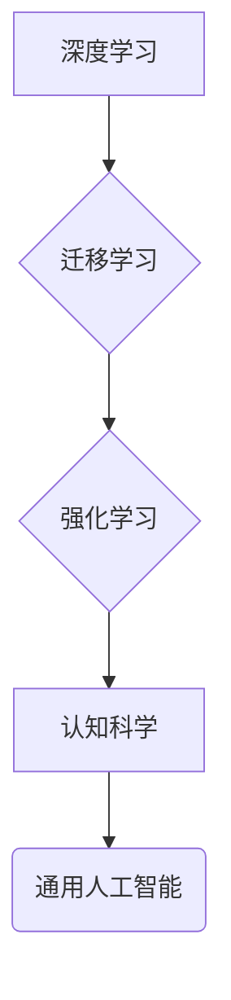

## 通用人工智能的渐行渐近

> 关键词：通用人工智能、渐进式人工智能、深度学习、迁移学习、强化学习、认知科学、算法、模型、应用场景

### 1. 背景介绍

通用人工智能 (Artificial General Intelligence, AGI) 这一概念，一直是人工智能领域最引人入胜的课题之一。它指的是能够像人类一样理解、学习和解决各种复杂问题的人工智能系统。与目前广泛应用的狭义人工智能 (Narrow AI) 不同，AGI 拥有更广泛的知识和能力，能够跨领域应用，并不断学习和进化。

然而，实现真正的 AGI 仍然是一个巨大的挑战。目前，人工智能技术主要集中在特定领域，例如图像识别、自然语言处理和游戏等。这些系统在特定任务上表现出色，但缺乏人类的通用智能。

### 2. 核心概念与联系

**2.1 渐进式人工智能**

渐进式人工智能 (Progressive AI) 是一种实现 AGI 的策略，它强调通过逐步提升人工智能能力，最终实现 AGI 的目标。这种策略认为，AGI 不是一个单一的突破，而是通过不断积累和改进，逐步实现的。

**2.2 核心技术**

实现渐进式人工智能的关键技术包括：

* **深度学习 (Deep Learning):** 深度学习是一种机器学习方法，它利用多层神经网络来模拟人类大脑的学习过程。深度学习在图像识别、自然语言处理等领域取得了突破性进展。
* **迁移学习 (Transfer Learning):** 迁移学习是指利用已训练好的模型，在新的任务上进行训练。这可以有效降低训练成本和时间，并提高模型性能。
* **强化学习 (Reinforcement Learning):** 强化学习是一种通过奖励和惩罚机制，训练人工智能代理在环境中学习最优策略的方法。强化学习在游戏、机器人控制等领域取得了成功。
* **认知科学:** 认知科学研究人类思维、学习和决策过程，为人工智能提供灵感和指导。

**2.3 架构图**



### 3. 核心算法原理 & 具体操作步骤

**3.1 算法原理概述**

渐进式人工智能的核心算法原理是通过不断学习和改进，逐步提升人工智能能力。这包括：

* **数据驱动:** 训练人工智能模型需要大量的训练数据。
* **模型训练:** 利用训练数据，训练人工智能模型，使其能够学习和预测。
* **模型评估:** 对训练好的模型进行评估，并根据评估结果进行调整和改进。
* **模型部署:** 将训练好的模型部署到实际应用场景中。

**3.2 算法步骤详解**

1. **数据收集和预处理:** 收集大量相关数据，并进行清洗、格式化和特征提取等预处理工作。
2. **模型选择:** 根据任务需求选择合适的深度学习模型，例如卷积神经网络 (CNN)、循环神经网络 (RNN) 或 Transformer 等。
3. **模型训练:** 利用训练数据，训练模型参数，使其能够学习数据中的模式和规律。
4. **模型评估:** 使用测试数据评估模型性能，例如准确率、召回率、F1-score 等指标。
5. **模型调优:** 根据评估结果，调整模型参数、学习率等超参数，以提高模型性能。
6. **模型迁移:** 将训练好的模型应用于新的任务，例如利用图像识别模型进行物体检测。
7. **模型强化:** 利用强化学习算法，进一步训练模型，使其能够在复杂环境中做出更优的决策。
8. **模型部署:** 将训练好的模型部署到实际应用场景中，例如云平台、边缘设备等。

**3.3 算法优缺点**

**优点:**

* **性能提升:** 渐进式人工智能能够不断提升人工智能模型的性能。
* **适应性强:** 能够适应不断变化的应用场景和数据分布。
* **可解释性:** 通过逐步改进模型，可以更好地理解模型的决策过程。

**缺点:**

* **时间成本:** 实现 AGI 需要长期的研究和开发投入。
* **数据依赖:** 需要大量的训练数据才能训练出高性能的模型。
* **伦理挑战:** AGI 的发展可能带来新的伦理挑战，例如算法偏见、隐私保护等。

**3.4 算法应用领域**

渐进式人工智能的应用领域非常广泛，包括：

* **医疗保健:** 疾病诊断、药物研发、个性化治疗等。
* **金融服务:** 风险评估、欺诈检测、投资决策等。
* **教育:** 个性化学习、智能辅导、自动批改等。
* **制造业:** 自动化生产、质量控制、预测维护等。
* **交通运输:** 自动驾驶、交通流量优化、物流管理等。

### 4. 数学模型和公式 & 详细讲解 & 举例说明

**4.1 数学模型构建**

渐进式人工智能的数学模型通常基于深度学习框架，例如 TensorFlow 或 PyTorch。这些框架提供了一系列神经网络结构和优化算法，用于训练人工智能模型。

**4.2 公式推导过程**

深度学习模型的训练过程基于梯度下降算法，其核心公式为：

$$
\theta = \theta - \alpha \nabla L(\theta)
$$

其中：

* $\theta$ 表示模型参数。
* $\alpha$ 表示学习率。
* $L(\theta)$ 表示损失函数，用于衡量模型预测结果与真实值的差异。
* $\nabla L(\theta)$ 表示损失函数对模型参数的梯度。

**4.3 案例分析与讲解**

例如，在图像识别任务中，可以使用卷积神经网络 (CNN) 模型进行训练。CNN 模型利用卷积层和池化层来提取图像特征，并使用全连接层进行分类。损失函数通常选择交叉熵损失函数，用于衡量模型预测类别与真实类别的差异。

通过梯度下降算法，不断更新模型参数，使得模型能够更好地识别图像。

### 5. 项目实践：代码实例和详细解释说明

**5.1 开发环境搭建**

实现渐进式人工智能的项目实践，需要搭建相应的开发环境。常用的开发环境包括：

* **Python:** Python 是深度学习领域最常用的编程语言。
* **深度学习框架:** TensorFlow、PyTorch 等深度学习框架提供了一系列工具和库，用于构建和训练深度学习模型。
* **GPU:** GPU (图形处理单元) 能够加速深度学习模型的训练过程。

**5.2 源代码详细实现**

以下是一个使用 TensorFlow 框架实现图像分类的简单代码示例：

```python
import tensorflow as tf

# 定义模型结构
model = tf.keras.models.Sequential([
    tf.keras.layers.Conv2D(32, (3, 3), activation='relu', input_shape=(28, 28, 1)),
    tf.keras.layers.MaxPooling2D((2, 2)),
    tf.keras.layers.Conv2D(64, (3, 3), activation='relu'),
    tf.keras.layers.MaxPooling2D((2, 2)),
    tf.keras.layers.Flatten(),
    tf.keras.layers.Dense(10, activation='softmax')
])

# 编译模型
model.compile(optimizer='adam',
              loss='sparse_categorical_crossentropy',
              metrics=['accuracy'])

# 训练模型
model.fit(x_train, y_train, epochs=5)

# 评估模型
loss, accuracy = model.evaluate(x_test, y_test)
print('Test loss:', loss)
print('Test accuracy:', accuracy)
```

**5.3 代码解读与分析**

这段代码定义了一个简单的 CNN 模型，用于图像分类任务。模型包含卷积层、池化层和全连接层。

* 卷积层和池化层用于提取图像特征。
* 全连接层用于分类。

模型使用 Adam 优化器、交叉熵损失函数和准确率作为评估指标。

**5.4 运行结果展示**

训练完成后，可以评估模型在测试集上的性能。

### 6. 实际应用场景

渐进式人工智能已经应用于许多实际场景，例如：

* **医疗诊断:** 利用深度学习模型分析医学图像，辅助医生诊断疾病。
* **金融风险评估:** 利用机器学习模型分析金融数据，评估投资风险。
* **个性化推荐:** 利用协同过滤算法和深度学习模型，推荐个性化商品和服务。

**6.4 未来应用展望**

未来，渐进式人工智能将应用于更多领域，例如：

* **自动驾驶:** 利用强化学习算法训练自动驾驶系统，实现更安全、更智能的驾驶体验。
* **机器人控制:** 利用深度学习和强化学习算法训练机器人，使其能够更好地感知环境和执行任务。
* **自然语言理解:** 利用深度学习和迁移学习算法，提高机器对自然语言的理解能力，实现更自然的人机交互。

### 7. 工具和资源推荐

**7.1 学习资源推荐**

* **书籍:**
    * 《深度学习》 (Deep Learning) - Ian Goodfellow, Yoshua Bengio, Aaron Courville
    * 《机器学习实战》 (Hands-On Machine Learning with Scikit-Learn, Keras & TensorFlow) - Aurélien Géron
* **在线课程:**
    * Coursera: 深度学习 Specialization
    * Udacity: 机器学习工程师 Nanodegree
* **博客和网站:**
    * TensorFlow Blog: https://blog.tensorflow.org/
    * PyTorch Blog: https://pytorch.org/blog/

**7.2 开发工具推荐**

* **Python:** https://www.python.org/
* **TensorFlow:** https://www.tensorflow.org/
* **PyTorch:** https://pytorch.org/
* **Keras:** https://keras.io/

**7.3 相关论文推荐**

* 《ImageNet Classification with Deep Convolutional Neural Networks》 - Alex Krizhevsky, Ilya Sutskever, Geoffrey E. Hinton
* 《Attention Is All You Need》 - Ashish Vaswani, Noam Shazeer, Niki Parmar, Jakob Uszkoreit, Llion Jones, Aidan N. Gomez, Łukasz Kaiser, Illia Polosukhin

### 8. 总结：未来发展趋势与挑战

**8.1 研究成果总结**

近年来，渐进式人工智能取得了显著进展，在图像识别、自然语言处理、游戏等领域取得了突破性成果。深度学习、迁移学习和强化学习等技术为实现 AGI 提供了重要的工具和方法。

**8.2 未来发展趋势**

未来，渐进式人工智能的发展趋势包括：

* **模型规模和复杂度提升:** 训练更大、更复杂的深度学习模型，以提高模型性能和泛化能力。
* **跨模态学习:** 训练能够处理多种模态数据 (例如文本、图像、音频) 的模型，以实现更全面的智能。
* **可解释性增强:** 研究更可解释的深度学习模型，以便更好地理解模型的决策过程。
* **安全性和可靠性提升:** 确保 AGI 系统的安全性和可靠性，避免潜在的风险和危害。

**8.3 面临的挑战**

实现 AGI 仍然面临许多挑战，包括：

* **数据获取和标注:** 训练高性能的 AGI 模型需要大量的标注数据，而获取和标注数据成本高昂。
* **计算资源限制:** 训练大型深度学习模型需要大量的计算资源，这对于个人开发者和小型公司来说是一个挑战。
* **伦理和社会影响:** AGI 的发展可能带来新的伦理和社会问题，例如算法偏见、隐私保护、工作岗位替代等。

**8.4 研究展望**

尽管面临挑战，但渐进式人工智能的发展前景依然光明。未来，随着算法、硬件和数据资源的不断进步，AGI 将逐渐成为现实，并对人类社会产生深远的影响。

### 9. 附录：常见问题与解答

**9.1 如何选择合适的深度学习模型？**

选择合适的深度学习模型取决于具体的应用场景和数据特点。例如，图像识别任务通常使用 CNN 模型，而自然语言处理任务通常使用 RNN 或 Transformer 模型。

**9.2 如何训练深度学习模型？**

训练深度学习模型