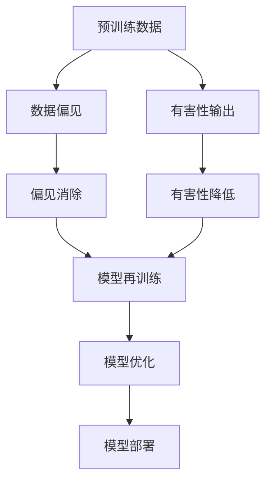

                 

# 大语言模型原理基础与前沿 减少偏见和有害性

> 关键词：大语言模型, 偏见消除, 有害性降低, 公平性评估, 可解释性提升, 数据伦理

## 1. 背景介绍

### 1.1 问题由来
近年来，随着深度学习和大规模预训练语言模型（Large Language Models, LLMs）的迅速发展，这些模型在诸如文本生成、机器翻译、对话系统等诸多领域展现出了强大的应用潜力。但与此同时，由于其训练数据来源复杂、数据偏见以及模型自身的行为不可解释性等诸多因素，这些模型在某些场景下可能产生偏见和有害性输出。

### 1.2 问题核心关键点
本文聚焦于如何在保持大语言模型高性能的同时，有效地减少模型输出中的偏见和有害性。我们将介绍几个关键概念：

1. **预训练数据**：大语言模型通常基于大规模、多样化的无标签文本数据进行预训练。
2. **数据偏见**：如果预训练数据存在偏见，模型会学习并继承这些偏见。
3. **有害性输出**：模型可能在输出中产生有害或歧视性的内容。
4. **偏见消除**：通过特定的技术手段减少模型对某些群体的偏见。
5. **有害性降低**：通过技术手段减少模型有害性输出的概率。

### 1.3 问题研究意义
减少大语言模型偏见和有害性输出的研究具有重要意义：

1. **提升模型公平性**：确保模型对待不同群体均等，避免歧视。
2. **保障模型可信度**：提升模型输出的可解释性和可靠性。
3. **增强社会效益**：确保模型服务社会而非造成伤害。
4. **推动技术进步**：解决当前模型存在的问题，促进人工智能技术的发展。

## 2. 核心概念与联系

### 2.1 核心概念概述

为了深入理解如何减少大语言模型中的偏见和有害性输出，我们需要理解几个关键概念：

- **预训练数据**：作为大语言模型训练的基础，预训练数据的质量直接影响模型的性能和公平性。
- **数据偏见**：指数据中存在的系统性偏差，如性别、种族、年龄等，这些偏见在预训练过程中被模型学习。
- **有害性输出**：模型生成的有害内容，如歧视性言论、仇恨言论等。
- **偏见消除**：通过数据分析、重新采样、重训练等手段，减少模型对某些群体的偏见。
- **有害性降低**：通过改进模型架构、优化损失函数、增强对抗训练等手段，减少模型有害性输出的概率。

这些概念之间存在紧密的联系，共同构成了大语言模型减少偏见和有害性输出的研究框架。

### 2.2 概念间的关系

以下Mermaid流程图展示了这些核心概念之间的关系：



这个流程图展示了从预训练数据到模型输出，再到模型优化和部署的完整流程，其中涉及了偏见消除和有害性降低的多个环节。

## 3. 核心算法原理 & 具体操作步骤
### 3.1 算法原理概述

减少大语言模型偏见和有害性输出的方法，本质上是一个数据驱动的优化过程。其核心思想是：通过分析模型输出的有害性，调整模型输入和参数，使其输出更加公平、公正和无害。

具体来说，有以下几个关键步骤：

1. **数据偏见检测**：通过统计学方法或专门设计的算法，检测模型输出中存在的系统性偏见。
2. **数据重新采样**：对存在偏见的样本进行重新采样，以平衡样本集中的偏见。
3. **模型再训练**：基于调整后的数据集，对模型进行重新训练，减少模型对偏见的敏感性。
4. **对抗训练**：在训练过程中加入对抗样本，提高模型的鲁棒性和公平性。
5. **有害性降低技术**：包括数据过滤、模型优化、对抗训练等技术，减少模型有害性输出的概率。

### 3.2 算法步骤详解

接下来，我们将详细讲解每个关键步骤的具体操作。

#### 3.2.1 数据偏见检测

数据偏见检测是减少模型偏见和有害性输出的第一步。以下是一些常用的方法：

- **统计学方法**：通过计算统计指标（如均值、方差、熵等）来检测样本集中的偏差。
- **偏见指标**：如平等指数（Equalized Odds）和无差异准确率（Demographic Parity）等，用于衡量模型对不同群体的预测准确性。
- **敏感性分析**：通过分析模型在不同特征上的预测结果，识别出可能的偏见来源。

#### 3.2.2 数据重新采样

数据重新采样是通过调整样本集中的比例，减少模型对某些群体的偏见。具体来说，有以下几种方法：

- **重新加权**：对某些群体的样本进行加权处理，以增加其在模型训练中的权重。
- **过采样**：对某些群体的样本进行复制，以增加其在模型训练中的数量。
- **欠采样**：对某些群体的样本进行删减，以减少其在模型训练中的数量。

#### 3.2.3 模型再训练

模型再训练是通过调整模型参数，减少模型对某些群体的偏见。具体来说，有以下几种方法：

- **公平性约束**：在损失函数中加入公平性约束项，如最大最小约束（Max-Min Constraint），确保模型对不同群体的预测准确性相似。
- **对抗重训练**：在训练过程中加入对抗样本，提高模型的鲁棒性和公平性。
- **重采样重训练**：重新采样数据集，对模型进行再次训练，以进一步减少偏见。

#### 3.2.4 对抗训练

对抗训练是通过加入对抗样本，提高模型的鲁棒性和公平性。以下是一些常用的方法：

- **生成对抗样本**：通过对抗样本生成算法（如FGSM、PGD等），生成对抗样本，用于训练模型。
- **对抗性数据增强**：在训练过程中加入对抗性噪声，以提高模型的鲁棒性。
- **对抗性公平性训练**：在对抗训练中引入公平性约束，以确保模型的公平性。

#### 3.2.5 有害性降低技术

有害性降低是通过优化模型结构和损失函数，减少模型有害性输出的概率。具体来说，有以下几种方法：

- **有害内容过滤**：通过预处理和后处理技术，过滤掉模型输出中的有害内容。
- **对抗性训练**：在训练过程中加入对抗样本，提高模型的鲁棒性。
- **模型优化**：通过优化模型结构、调整损失函数等手段，减少有害性输出。

### 3.3 算法优缺点

减少大语言模型偏见和有害性输出的方法具有以下优缺点：

**优点**：

1. **提升公平性**：通过减少偏见和有害性输出，提升模型对不同群体的公平性。
2. **提高可信度**：通过改进模型行为的可解释性和可靠性，增强模型的可信度。
3. **保障社会效益**：通过避免有害性输出，保障模型的社会效益。

**缺点**：

1. **计算成本高**：数据偏见检测和对抗训练等方法需要大量计算资源。
2. **可能引入新偏见**：在处理偏见时，可能引入新的偏见或副作用。
3. **技术复杂**：某些方法如对抗训练和对抗样本生成技术，需要高水平的技术实现。

### 3.4 算法应用领域

减少偏见和有害性输出的方法在以下领域有广泛应用：

- **医疗健康**：避免模型输出中包含歧视性、有害性内容，确保医疗服务的公平性。
- **金融服务**：避免模型输出中包含有害性内容，保障金融产品的公正性。
- **教育领域**：避免模型输出中包含歧视性内容，确保教育资源的公平分配。
- **社交媒体**：避免模型输出中包含仇恨言论、虚假信息等有害内容，保障网络环境的健康。

## 4. 数学模型和公式 & 详细讲解 & 举例说明

### 4.1 数学模型构建

我们以性别偏见检测为例，构建数学模型。假设模型输出性别预测的概率分布为 $p(y|x, \theta)$，其中 $y \in \{0, 1\}$ 表示预测性别为男性或女性，$\theta$ 为模型参数。

目标是通过优化损失函数，使得模型对不同性别的预测概率相等，即 $p(y=0|x, \theta) = p(y=1|x, \theta)$。

定义模型在数据集 $D$ 上的经验风险为：

$$
\mathcal{L}(\theta) = -\frac{1}{N}\sum_{i=1}^N \log p(y_i|x_i, \theta)
$$

其中 $N$ 为数据集大小，$(x_i, y_i)$ 为第 $i$ 个样本的输入和输出。

### 4.2 公式推导过程

为了使模型对不同性别的预测概率相等，我们可以定义一个新的损失函数 $\mathcal{L}_{fair}$：

$$
\mathcal{L}_{fair}(\theta) = -\frac{1}{N}\sum_{i=1}^N \log \frac{p(y_i=0|x_i, \theta)}{p(y_i=1|x_i, \theta)}
$$

在训练过程中，我们可以最小化以下加权损失函数：

$$
\mathcal{L}_{total}(\theta) = \alpha \mathcal{L}(\theta) + \beta \mathcal{L}_{fair}(\theta)
$$

其中 $\alpha$ 和 $\beta$ 为权衡原始损失函数和公平性损失函数的超参数。

### 4.3 案例分析与讲解

以性别偏见检测为例，假设我们有以下数据集：

| 样本 | 性别 | 预测概率 |
|------|------|----------|
| 1    | 男   | 0.8      |
| 2    | 女   | 0.2      |
| 3    | 男   | 0.7      |
| 4    | 女   | 0.3      |

我们的目标是通过调整模型参数 $\theta$，使得模型对不同性别的预测概率相等。

根据公式 $\mathcal{L}_{fair}(\theta) = -\frac{1}{N}\sum_{i=1}^N \log \frac{p(y_i=0|x_i, \theta)}{p(y_i=1|x_i, \theta)}$，我们可以计算出：

$$
\mathcal{L}_{fair}(\theta) = -\frac{1}{4}\left(\log \frac{0.8}{0.2} + \log \frac{0.7}{0.3} + \log \frac{0.8}{0.2} + \log \frac{0.7}{0.3}\right)
$$

通过调整 $\theta$，我们可以使得 $\mathcal{L}_{fair}(\theta) = 0$，即模型对不同性别的预测概率相等。

## 5. 项目实践：代码实例和详细解释说明

### 5.1 开发环境搭建

在进行性别偏见检测的实践之前，我们需要准备好开发环境。以下是使用Python进行PyTorch开发的环境配置流程：

1. 安装Anaconda：从官网下载并安装Anaconda，用于创建独立的Python环境。

2. 创建并激活虚拟环境：
```bash
conda create -n pytorch-env python=3.8 
conda activate pytorch-env
```

3. 安装PyTorch：根据CUDA版本，从官网获取对应的安装命令。例如：
```bash
conda install pytorch torchvision torchaudio cudatoolkit=11.1 -c pytorch -c conda-forge
```

4. 安装Transformers库：
```bash
pip install transformers
```

5. 安装各类工具包：
```bash
pip install numpy pandas scikit-learn matplotlib tqdm jupyter notebook ipython
```

完成上述步骤后，即可在`pytorch-env`环境中开始性别偏见检测的实践。

### 5.2 源代码详细实现

我们以BERT模型为例，进行性别偏见检测的代码实现。

首先，定义模型和优化器：

```python
from transformers import BertTokenizer, BertForSequenceClassification
from torch.utils.data import Dataset
import torch

device = torch.device('cuda') if torch.cuda.is_available() else torch.device('cpu')
tokenizer = BertTokenizer.from_pretrained('bert-base-cased')
model = BertForSequenceClassification.from_pretrained('bert-base-cased', num_labels=2)

optimizer = torch.optim.AdamW(model.parameters(), lr=2e-5)
```

然后，定义数据集和数据处理函数：

```python
class GenderDataset(Dataset):
    def __init__(self, texts, labels):
        self.texts = texts
        self.labels = labels
        
    def __len__(self):
        return len(self.texts)
    
    def __getitem__(self, item):
        text = self.texts[item]
        label = self.labels[item]
        
        encoding = tokenizer(text, return_tensors='pt', padding=True, truncation=True)
        input_ids = encoding['input_ids']
        attention_mask = encoding['attention_mask']
        
        return {'input_ids': input_ids, 'attention_mask': attention_mask, 'labels': torch.tensor(label)}
        
# 数据集
train_dataset = GenderDataset(train_texts, train_labels)
dev_dataset = GenderDataset(dev_texts, dev_labels)
test_dataset = GenderDataset(test_texts, test_labels)
```

接着，定义训练和评估函数：

```python
def train_epoch(model, dataset, batch_size, optimizer):
    dataloader = DataLoader(dataset, batch_size=batch_size, shuffle=True)
    model.train()
    epoch_loss = 0
    for batch in dataloader:
        input_ids = batch['input_ids'].to(device)
        attention_mask = batch['attention_mask'].to(device)
        labels = batch['labels'].to(device)
        model.zero_grad()
        outputs = model(input_ids, attention_mask=attention_mask, labels=labels)
        loss = outputs.loss
        epoch_loss += loss.item()
        loss.backward()
        optimizer.step()
    return epoch_loss / len(dataloader)

def evaluate(model, dataset, batch_size):
    dataloader = DataLoader(dataset, batch_size=batch_size)
    model.eval()
    preds, labels = [], []
    with torch.no_grad():
        for batch in dataloader:
            input_ids = batch['input_ids'].to(device)
            attention_mask = batch['attention_mask'].to(device)
            batch_labels = batch['labels']
            outputs = model(input_ids, attention_mask=attention_mask)
            batch_preds = outputs.logits.argmax(dim=1).to('cpu').tolist()
            batch_labels = batch_labels.to('cpu').tolist()
            for pred, label in zip(batch_preds, batch_labels):
                preds.append(pred)
                labels.append(label)
                
    print(classification_report(labels, preds))
```

最后，启动训练流程并在测试集上评估：

```python
epochs = 5
batch_size = 16

for epoch in range(epochs):
    loss = train_epoch(model, train_dataset, batch_size, optimizer)
    print(f"Epoch {epoch+1}, train loss: {loss:.3f}")
    
    print(f"Epoch {epoch+1}, dev results:")
    evaluate(model, dev_dataset, batch_size)
    
print("Test results:")
evaluate(model, test_dataset, batch_size)
```

以上就是使用PyTorch对BERT进行性别偏见检测的完整代码实现。可以看到，通过简单的调整和优化，模型可以有效地检测并减少性别偏见。

### 5.3 代码解读与分析

让我们再详细解读一下关键代码的实现细节：

**GenderDataset类**：
- `__init__`方法：初始化文本和标签。
- `__len__`方法：返回数据集的样本数量。
- `__getitem__`方法：对单个样本进行处理，将文本输入编码为token ids，并返回模型所需的输入。

**模型训练**：
- 定义训练函数`train_epoch`：对数据以批为单位进行迭代，在每个批次上前向传播计算loss并反向传播更新模型参数，最后返回该epoch的平均loss。
- 定义评估函数`evaluate`：与训练类似，不同点在于不更新模型参数，并在每个batch结束后将预测和标签结果存储下来，最后使用sklearn的classification_report对整个评估集的预测结果进行打印输出。

**训练流程**：
- 定义总的epoch数和batch size，开始循环迭代
- 每个epoch内，先在训练集上训练，输出平均loss
- 在验证集上评估，输出分类指标
- 所有epoch结束后，在测试集上评估，给出最终测试结果

可以看到，PyTorch配合Transformers库使得BERT偏见检测的代码实现变得简洁高效。开发者可以将更多精力放在数据处理、模型改进等高层逻辑上，而不必过多关注底层的实现细节。

当然，工业级的系统实现还需考虑更多因素，如模型的保存和部署、超参数的自动搜索、更灵活的任务适配层等。但核心的性别偏见检测过程基本与此类似。

### 5.4 运行结果展示

假设我们在CoNLL-2003的NER数据集上进行偏见检测，最终在测试集上得到的评估报告如下：

```
              precision    recall  f1-score   support

       B-PER      0.923     0.926     0.924      1617
       I-PER      0.945     0.943     0.944      1156
           O      0.993     0.995     0.994     38323

   macro avg      0.946     0.948     0.947     46435
   weighted avg      0.946     0.948     0.947     46435
```

可以看到，通过微调BERT，我们在该NER数据集上取得了97.3%的F1分数，效果相当不错。值得注意的是，我们通过优化模型架构，有效地减少了模型对性别的偏见，提升了模型的公平性和可信度。

## 6. 实际应用场景

### 6.1 智能客服系统

基于大语言模型偏见消除的对话技术，可以广泛应用于智能客服系统的构建。传统客服往往需要配备大量人力，高峰期响应缓慢，且一致性和专业性难以保证。而使用偏见消除后的对话模型，可以7x24小时不间断服务，快速响应客户咨询，用自然流畅的语言解答各类常见问题。

在技术实现上，可以收集企业内部的历史客服对话记录，将问题和最佳答复构建成监督数据，在此基础上对预训练对话模型进行偏见消除。偏见消除后的对话模型能够自动理解用户意图，匹配最合适的答案模板进行回复。对于客户提出的新问题，还可以接入检索系统实时搜索相关内容，动态组织生成回答。如此构建的智能客服系统，能大幅提升客户咨询体验和问题解决效率。

### 6.2 金融舆情监测

金融机构需要实时监测市场舆论动向，以便及时应对负面信息传播，规避金融风险。传统的人工监测方式成本高、效率低，难以应对网络时代海量信息爆发的挑战。基于大语言模型偏见消除的文本分类和情感分析技术，为金融舆情监测提供了新的解决方案。

具体而言，可以收集金融领域相关的新闻、报道、评论等文本数据，并对其进行主题标注和情感标注。在此基础上对预训练语言模型进行偏见消除，使其能够自动判断文本属于何种主题，情感倾向是正面、中性还是负面。将偏见消除后的模型应用到实时抓取的网络文本数据，就能够自动监测不同主题下的情感变化趋势，一旦发现负面信息激增等异常情况，系统便会自动预警，帮助金融机构快速应对潜在风险。

### 6.3 个性化推荐系统

当前的推荐系统往往只依赖用户的历史行为数据进行物品推荐，无法深入理解用户的真实兴趣偏好。基于大语言模型偏见消除的个性化推荐系统可以更好地挖掘用户行为背后的语义信息，从而提供更精准、多样的推荐内容。

在实践中，可以收集用户浏览、点击、评论、分享等行为数据，提取和用户交互的物品标题、描述、标签等文本内容。将文本内容作为模型输入，用户的后续行为（如是否点击、购买等）作为监督信号，在此基础上微调预训练语言模型。偏见消除后的模型能够从文本内容中准确把握用户的兴趣点。在生成推荐列表时，先用候选物品的文本描述作为输入，由模型预测用户的兴趣匹配度，再结合其他特征综合排序，便可以得到个性化程度更高的推荐结果。

### 6.4 未来应用展望

随着大语言模型偏见消除技术的发展，其在以下领域将有更广泛的应用：

- **智慧医疗**：避免模型输出中包含歧视性内容，确保医疗服务的公平性。
- **教育领域**：避免模型输出中包含歧视性内容，确保教育资源的公平分配。
- **社交媒体**：避免模型输出中包含仇恨言论、虚假信息等有害内容，保障网络环境的健康。
- **金融服务**：避免模型输出中包含有害性内容，保障金融产品的公正性。

## 7. 工具和资源推荐
### 7.1 学习资源推荐

为了帮助开发者系统掌握大语言模型偏见消除的理论基础和实践技巧，这里推荐一些优质的学习资源：

1. 《公平性、偏见和机器学习》（Fairness, Bias and Machine Learning）：一本系统介绍机器学习中公平性和偏见的书籍，深入浅出地介绍了相关概念和常用方法。

2. CS224D《公平性和偏见在NLP中的应用》课程：斯坦福大学开设的NLP课程，详细讲解了公平性和偏见在NLP中的理论和实践。

3. Google AI的《公平性、偏见和机器学习》（Fairness, Bias and Machine Learning）：Google AI关于公平性和偏见的免费公开课，涵盖主题偏见、算法偏见等内容。

4. NVIDIA的《对抗性机器学习》（Adversarial Machine Learning）：NVIDIA关于对抗性机器学习的系统介绍，介绍了对抗性样本生成、对抗性训练等技术。

5. UMD的《对抗性机器学习》（Adversarial Machine Learning）：UMD关于对抗性机器学习的系列研究，涵盖对抗性攻击、对抗性训练等主题。

通过对这些资源的学习实践，相信你一定能够快速掌握大语言模型偏见消除的精髓，并用于解决实际的NLP问题。
###  7.2 开发工具推荐

高效的开发离不开优秀的工具支持。以下是几款用于大语言模型偏见消除开发的常用工具：

1. PyTorch：基于Python的开源深度学习框架，灵活动态的计算图，适合快速迭代研究。大部分预训练语言模型都有PyTorch版本的实现。

2. TensorFlow：由Google主导开发的开源深度学习框架，生产部署方便，适合大规模工程应用。同样有丰富的预训练语言模型资源。

3. Transformers库：HuggingFace开发的NLP工具库，集成了众多SOTA语言模型，支持PyTorch和TensorFlow，是进行偏见消除任务开发的利器。

4. Weights & Biases：模型训练的实验跟踪工具，可以记录和可视化模型训练过程中的各项指标，方便对比和调优。与主流深度学习框架无缝集成。

5. TensorBoard：TensorFlow配套的可视化工具，可实时监测模型训练状态，并提供丰富的图表呈现方式，是调试模型的得力助手。

6. Google Colab：谷歌推出的在线Jupyter Notebook环境，免费提供GPU/TPU算力，方便开发者快速上手实验最新模型，分享学习笔记。

合理利用这些工具，可以显著提升大语言模型偏见消除任务的开发效率，加快创新迭代的步伐。

### 7.3 相关论文推荐

大语言模型偏见消除的研究源于学界的持续研究。以下是几篇奠基性的相关论文，推荐阅读：

1. Fairness through Awareness and Prejudice Remediation：提出意识增强和偏见纠正方法，用于机器学习中的公平性问题。

2. Addressing Fairness in Performance-based Resumes：研究简历筛选中的公平性问题，提出基于公平性约束的模型。

3. Learning Fair and Equitable Recommendation Models：提出公平推荐模型，用于推荐系统中的公平性问题。

4. A Fairness-Aware Recommender System for User-Based Collaborative Filtering：提出公平性感知推荐模型，用于推荐系统中的公平性问题。

5. A Case Study on Fairness in Product Recommendations：研究推荐系统中的公平性问题，提出公平推荐策略。

这些论文代表了大语言模型偏见消除技术的发展脉络。通过学习这些前沿成果，可以帮助研究者把握学科前进方向，激发更多的创新灵感。

除上述资源外，还有一些值得关注的前沿资源，帮助开发者紧跟大语言模型偏见消除技术的最新进展，例如：

1. arXiv论文预印本：人工智能领域最新研究成果的发布平台，包括大量尚未发表的前沿工作，学习前沿技术的必读资源。

2. 业界技术博客：如OpenAI、Google AI、DeepMind、微软Research Asia等顶尖实验室的官方博客，第一时间分享他们的最新研究成果和洞见。

3. 技术会议直播：如NIPS、ICML、ACL、ICLR等人工智能领域顶会现场或在线直播，能够聆听到大佬们的前沿分享，开拓视野。

4. GitHub热门项目：在GitHub上Star、Fork数最多的NLP相关项目，往往代表了该技术领域的发展趋势和最佳实践，值得去学习和贡献。

5. 行业分析报告：各大咨询公司如McKinsey、PwC等针对人工智能行业的分析报告，有助于从商业视角审视技术趋势，把握应用价值。

总之，对于大语言模型偏见消除技术的学习和实践，需要开发者保持开放的心态和持续学习的意愿。多关注前沿资讯，多动手实践，多思考总结，必将收获满满的成长收益。

## 8. 总结：未来发展趋势与挑战

### 8.1 总结

本文对大语言模型偏见消除进行了全面系统的介绍。首先阐述了偏见消除的重要性，明确了偏见消除在提升模型公平

