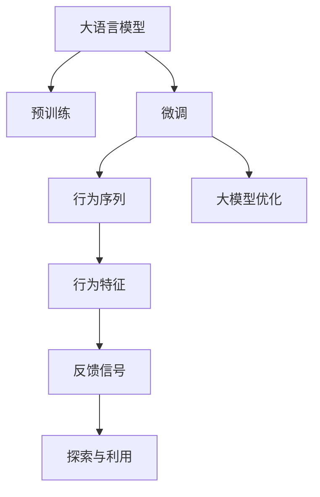
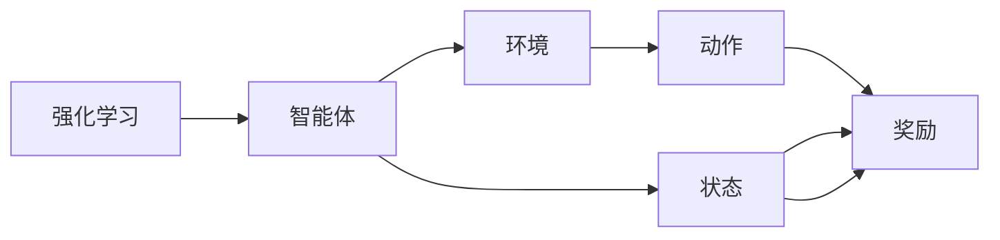
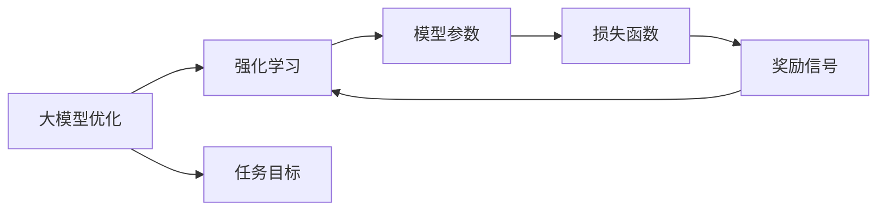
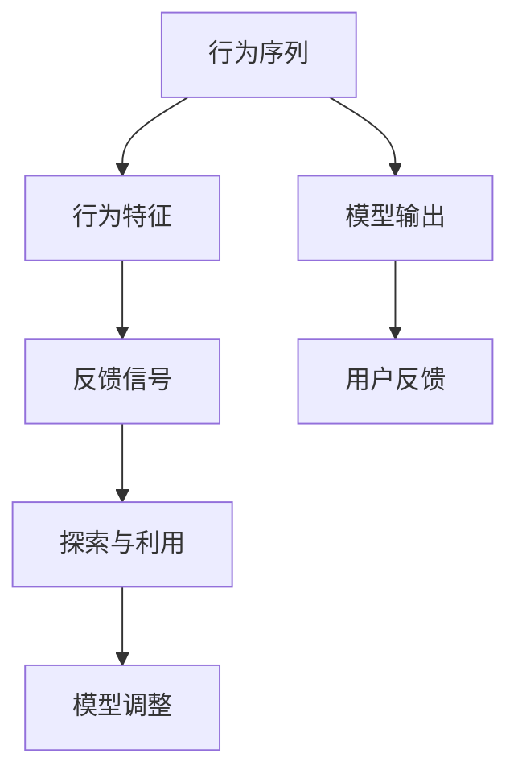
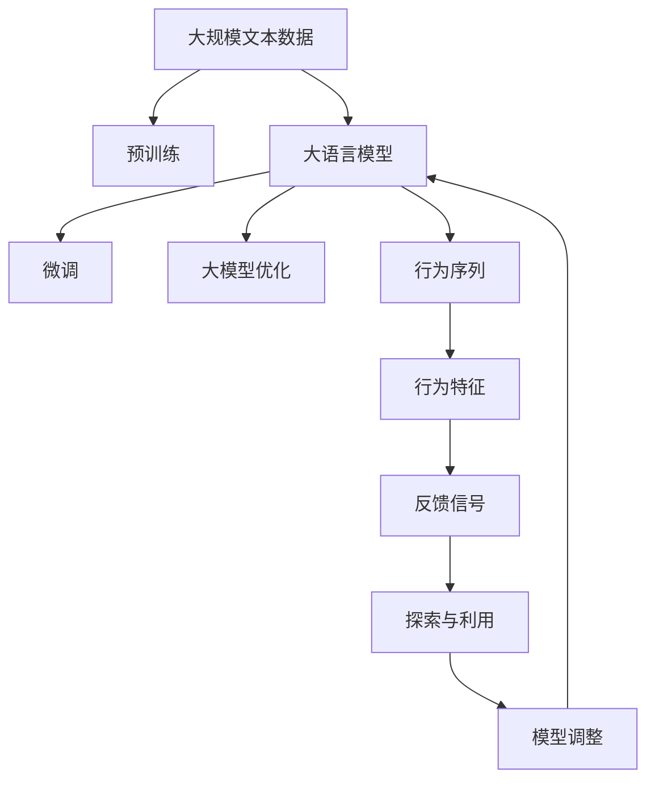

                 

# 大语言模型原理基础与前沿 基于人类反馈的强化学习

> 关键词：大语言模型,强化学习,人类反馈,行为序列,大模型优化,实时互动,深度学习,自然语言处理(NLP)

## 1. 背景介绍

### 1.1 问题由来
近年来，随着深度学习技术的快速发展，大语言模型(Large Language Model, LLM)在自然语言处理(Natural Language Processing, NLP)领域取得了巨大的突破。这些大语言模型通过在海量无标签文本数据上进行预训练，学习到了丰富的语言知识和常识，可以通过少量有标签数据在下游任务上进行微调，获得优异的性能。

然而，由于预训练语料的广泛性和泛化能力的不足，这些通用的大语言模型在特定领域应用时，效果往往难以达到实际应用的要求。因此，如何针对特定任务进行大模型微调，提升模型性能，成为了当前大语言模型研究和应用的一个热点问题。本文聚焦于基于人类反馈的强化学习方法，但同时也会兼顾参数高效微调和提示学习等前沿技术，以期对大语言模型微调实践提供更全面的指导。

### 1.2 问题核心关键点
目前，基于人类反馈的强化学习的大语言模型微调方法主要有两种：

- **行为序列 (Behavior Sequence)**: 通过学习一系列的人类反馈行为序列，指导模型优化过程。行为序列可以是点击、评分、编辑等操作，通过这些反馈，模型逐步调整其参数，使其输出更加符合人类预期。
- **大模型优化 (Large Model Optimization, LMO)**: 在大模型上应用强化学习算法，通过奖励机制驱动模型参数的调整，以优化特定的下游任务性能。这种方法通常需要大量的有标签数据，但由于模型本身具备强大的学习能力，可以在较少的数据条件下取得显著的效果。

这些方法与传统的监督学习范式相比，更能灵活应对复杂、高维的数据和任务，但其训练过程涉及更多的变量和动态因素，需要更多的计算资源和精确的控制。

### 1.3 问题研究意义
研究基于人类反馈的强化学习方法，对于拓展大模型的应用范围，提升下游任务的性能，加速NLP技术的产业化进程，具有重要意义：

1. **降低应用开发成本**：利用大模型微调，可以显著减少从头开发所需的数据、计算和人力等成本投入。
2. **提升模型效果**：强化学习方法能够自适应地调整模型参数，使其在下游任务中取得更优表现。
3. **加速开发进度**：standing on the shoulders of giants，微调使得开发者可以更快地完成任务适配，缩短开发周期。
4. **带来技术创新**：强化学习范式促进了对预训练-微调的深入研究，催生了提示学习、少样本学习等新的研究方向。
5. **赋能产业升级**：微调使得NLP技术更容易被各行各业所采用，为传统行业数字化转型升级提供新的技术路径。

## 2. 核心概念与联系

### 2.1 核心概念概述

为更好地理解基于人类反馈的强化学习的大语言模型微调方法，本节将介绍几个密切相关的核心概念：

- **大语言模型(Large Language Model, LLM)**：以自回归(如GPT)或自编码(如BERT)模型为代表的大规模预训练语言模型。通过在大规模无标签文本语料上进行预训练，学习通用的语言表示，具备强大的语言理解和生成能力。

- **强化学习(Reinforcement Learning, RL)**：一种通过智能体与环境交互，通过奖励信号指导行为选择，以最大化累计奖励的学习方法。强化学习在机器人控制、游戏AI、推荐系统等领域有广泛应用。

- **行为序列(Behavior Sequence)**：用户在交互过程中的一系列行为，如点击、评分、编辑等。这些行为可以反映用户的意图和偏好，指导模型调整输出。

- **大模型优化(Large Model Optimization, LMO)**：通过应用强化学习算法，在大模型上优化特定任务性能的过程。这种方法特别适用于大模型，能够快速适应新的任务需求。

- **行为特征 (Behavior Feature)**：行为序列中的关键特征，如点击位置、评分高低、编辑次数等，用于指导模型参数的调整。

- **反馈信号 (Feedback Signal)**：用户在交互过程中给出的反馈，如评分、标签、编辑信息等，用于修正模型的输出。

- **探索与利用 (Exploration and Exploitation)**：在强化学习中，智能体需要在探索未知领域和利用已知知识之间进行平衡，以最大化长期奖励。

这些核心概念之间的逻辑关系可以通过以下Mermaid流程图来展示：



这个流程图展示了大语言模型的核心概念及其之间的关系：

1. 大语言模型通过预训练获得基础能力。
2. 微调是通过行为序列和反馈信号对预训练模型进行任务特定的优化。
3. 大模型优化则是利用强化学习算法在大模型上进一步优化。
4. 行为序列中的行为特征和用户的反馈信号是优化过程的重要指导。
5. 探索与利用平衡是强化学习中智能体的决策依据。

### 2.2 概念间的关系

这些核心概念之间存在着紧密的联系，形成了大语言模型微调的完整生态系统。下面我通过几个Mermaid流程图来展示这些概念之间的关系。

#### 2.2.1 强化学习的基本原理



这个流程图展示了强化学习的基本原理：智能体通过动作与环境交互，观察环境状态，获取奖励信号，以此调整动作策略。

#### 2.2.2 大模型优化与强化学习的关系



这个流程图展示了大模型优化与强化学习的关系：强化学习算法在大模型上优化特定任务性能，以最大化模型对任务目标的贡献。

#### 2.2.3 行为序列在微调中的应用



这个流程图展示了行为序列在微调中的应用：行为序列中的特征和用户的反馈指导模型调整，以优化输出。

### 2.3 核心概念的整体架构

最后，我们用一个综合的流程图来展示这些核心概念在大语言模型微调过程中的整体架构：



这个综合流程图展示了从预训练到微调，再到大模型优化的完整过程。大语言模型首先在大规模文本数据上进行预训练，然后通过行为序列和反馈信号进行微调，利用强化学习算法在大模型上进行优化，从而更好地适应特定任务。

## 3. 核心算法原理 & 具体操作步骤
### 3.1 算法原理概述

基于人类反馈的强化学习的大语言模型微调方法，本质上是一种将预训练模型与强化学习相结合的学习过程。其核心思想是：将预训练的大语言模型视作一个强大的"智能体"，通过与人类用户交互，学习用户行为序列中的特征和反馈信号，逐步调整模型参数，使其输出更加符合用户预期。

形式化地，假设预训练模型为 $M_{\theta}$，其中 $\theta$ 为预训练得到的模型参数。给定一个下游任务 $T$ 和一系列行为序列 $S=\{s_i\}_{i=1}^N$，行为序列中的每个元素 $s_i$ 可以表示为用户的一个交互行为，如点击、评分、编辑等。行为序列的输出为 $o_i$，反馈信号为 $f_i$。微调的目标是找到新的模型参数 $\hat{\theta}$，使得：

$$
\hat{\theta}=\mathop{\arg\min}_{\theta} \sum_{i=1}^N \ell(f_i, o_i)
$$

其中 $\ell(f_i, o_i)$ 为行为序列 $s_i$ 在用户反馈 $f_i$ 下的损失函数，用于衡量模型输出与实际反馈的差异。常见的损失函数包括交叉熵损失、均方误差损失等。

通过强化学习算法，如Q-learning、REINFORCE、Actor-Critic等，不断更新模型参数 $\theta$，最小化累积损失函数，使得模型输出逼近理想结果。由于 $\theta$ 已经通过预训练获得了较好的初始化，因此即便在小规模行为序列和少量反馈的情况下，也能较快收敛到理想的模型参数 $\hat{\theta}$。

### 3.2 算法步骤详解

基于人类反馈的强化学习的大语言模型微调一般包括以下几个关键步骤：

**Step 1: 准备预训练模型和行为序列数据集**
- 选择合适的预训练语言模型 $M_{\theta}$ 作为初始化参数，如 BERT、GPT 等。
- 准备下游任务 $T$ 的行为序列数据集 $S=\{(s_i, o_i, f_i)\}_{i=1}^N$，其中 $s_i$ 为行为序列，$o_i$ 为行为序列的输出，$f_i$ 为用户的反馈信号。

**Step 2: 定义任务适配层**
- 根据任务类型，在预训练模型顶层设计合适的输出层和损失函数。
- 对于分类任务，通常在顶层添加线性分类器和交叉熵损失函数。
- 对于生成任务，通常使用语言模型的解码器输出概率分布，并以负对数似然为损失函数。

**Step 3: 设置强化学习超参数**
- 选择合适的强化学习算法及其参数，如Q-learning、REINFORCE、Actor-Critic等。
- 设置学习率、探索率、奖励函数、折扣因子等参数。
- 确定冻结预训练参数的策略，如仅微调顶层，或全部参数都参与优化。

**Step 4: 执行强化学习**
- 将行为序列数据集 $S$ 分批次输入模型，前向传播计算损失函数。
- 利用强化学习算法更新模型参数。
- 周期性在测试集上评估模型性能，根据性能指标决定是否触发探索率衰减。
- 重复上述步骤直到满足预设的迭代轮数或探索率衰减条件。

**Step 5: 测试和部署**
- 在测试集上评估强化学习后的模型 $M_{\hat{\theta}}$ 的性能，对比强化学习前后的精度提升。
- 使用强化学习后的模型对新样本进行推理预测，集成到实际的应用系统中。
- 持续收集新的行为序列和反馈，定期重新优化模型，以适应数据分布的变化。

以上是基于人类反馈的强化学习微调大语言模型的一般流程。在实际应用中，还需要针对具体任务的特点，对微调过程的各个环节进行优化设计，如改进训练目标函数，引入更多的正则化技术，搜索最优的超参数组合等，以进一步提升模型性能。

### 3.3 算法优缺点

基于人类反馈的强化学习的大语言模型微调方法具有以下优点：
1. 动态优化。通过持续学习，模型能够根据用户反馈不断调整，逐步优化其输出。
2. 适应性强。强化学习算法能够处理非结构化数据，适用于各种复杂任务。
3. 低成本。强化学习通常只需要少量的有标签数据，可以大幅降低开发成本。
4. 效果显著。在学术界和工业界的诸多任务上，基于强化学习的方法已经刷新了最先进的性能指标。

同时，该方法也存在一定的局限性：
1. 依赖数据。强化学习的效果很大程度上取决于行为序列和反馈数据的质量和数量，获取高质量数据成本较高。
2. 训练过程复杂。强化学习算法涉及较多的动态因素和探索与利用平衡，训练过程相对复杂。
3. 模型可解释性不足。强化学习模型的决策过程通常缺乏可解释性，难以对其推理逻辑进行分析和调试。

尽管存在这些局限性，但就目前而言，基于强化学习的微调方法仍是大语言模型应用的重要范式。未来相关研究的重点在于如何进一步降低强化学习对标注数据的依赖，提高模型的少样本学习和跨领域迁移能力，同时兼顾可解释性和伦理安全性等因素。

### 3.4 算法应用领域

基于强化学习的大语言模型微调方法在NLP领域已经得到了广泛的应用，覆盖了几乎所有常见任务，例如：

- 文本分类：如情感分析、主题分类、意图识别等。通过强化学习使模型学习文本-标签映射。
- 命名实体识别：识别文本中的人名、地名、机构名等特定实体。通过强化学习使模型掌握实体边界和类型。
- 关系抽取：从文本中抽取实体之间的语义关系。通过强化学习使模型学习实体-关系三元组。
- 问答系统：对自然语言问题给出答案。将问题-答案对作为行为序列，微调模型学习匹配答案。
- 机器翻译：将源语言文本翻译成目标语言。通过强化学习使模型学习语言-语言映射。
- 文本摘要：将长文本压缩成简短摘要。将文章-摘要对作为行为序列，使模型学习抓取要点。
- 对话系统：使机器能够与人自然对话。将多轮对话历史作为行为序列，微调模型进行回复生成。

除了上述这些经典任务外，强化学习的方法也被创新性地应用到更多场景中，如可控文本生成、常识推理、代码生成、数据增强等，为NLP技术带来了全新的突破。随着强化学习算法的持续演进，相信NLP技术将在更广阔的应用领域大放异彩。

## 4. 数学模型和公式 & 详细讲解 & 举例说明
### 4.1 数学模型构建

本节将使用数学语言对基于人类反馈的强化学习的大语言模型微调过程进行更加严格的刻画。

记预训练语言模型为 $M_{\theta}$，其中 $\theta$ 为预训练得到的模型参数。假设微调任务的行为序列数据集为 $S=\{(s_i, o_i, f_i)\}_{i=1}^N$，行为序列 $s_i$ 的输出为 $o_i$，用户的反馈信号为 $f_i$。

定义行为序列 $s_i$ 在用户反馈 $f_i$ 下的损失函数为 $\ell(s_i, f_i)$，则在数据集 $S$ 上的累积损失为：

$$
\mathcal{L}(\theta) = \sum_{i=1}^N \ell(s_i, f_i)
$$

微调的优化目标是最小化累积损失，即找到最优参数：

$$
\theta^* = \mathop{\arg\min}_{\theta} \mathcal{L}(\theta)
$$

在实践中，我们通常使用基于梯度的优化算法（如Q-learning、REINFORCE、Actor-Critic等）来近似求解上述最优化问题。设 $\gamma$ 为折扣因子，则行为序列 $s_i$ 在用户反馈 $f_i$ 下的状态值函数 $Q(s_i, f_i)$ 定义为：

$$
Q(s_i, f_i) = r_i + \gamma \max_{a} Q(s_{i+1}, f_{i+1})
$$

其中 $r_i$ 为即时奖励，$Q(s_{i+1}, f_{i+1})$ 为下一步状态值函数。利用状态值函数，可以求得行为序列的Q值，从而指导模型参数的调整。

### 4.2 公式推导过程

以下我们以二分类任务为例，推导强化学习中Q-learning算法的行为序列优化过程。

假设模型 $M_{\theta}$ 在输入 $x$ 上的输出为 $\hat{y}=M_{\theta}(x) \in [0,1]$，表示样本属于正类的概率。行为序列 $s_i$ 为用户的点击行为，输出 $o_i$ 为点击位置，反馈 $f_i$ 为点击后的评分。则二分类Q-learning算法的优化过程如下：

1. 定义即时奖励 $r_i$：

$$
r_i = \left\{
\begin{aligned}
&\log \hat{y}, \quad \text{if} \ f_i = 1 \\
&-\log (1-\hat{y}), \quad \text{if} \ f_i = 0
\end{aligned}
\right.
$$

2. 定义状态值函数 $Q(s_i, f_i)$：

$$
Q(s_i, f_i) = \left\{
\begin{aligned}
&r_i + \gamma \max_{a} Q(s_{i+1}, f_{i+1}), \quad \text{if} \ f_i = 1 \\
&-\gamma \max_{a} Q(s_{i+1}, f_{i+1}), \quad \text{if} \ f_i = 0
\end{aligned}
\right.
$$

3. 定义Q值函数 $Q(s_i)$：

$$
Q(s_i) = \frac{1}{N} \sum_{i=1}^N Q(s_i, f_i)
$$

4. 定义参数更新规则：

$$
\theta \leftarrow \theta - \alpha \nabla_{\theta} Q(s_i)
$$

其中 $\alpha$ 为学习率，$\nabla_{\theta} Q(s_i)$ 为Q值函数对参数 $\theta$ 的梯度，可通过反向传播算法高效计算。

通过Q-learning算法，不断更新模型参数 $\theta$，最小化累积损失函数，使得模型输出逼近理想结果。重复上述过程直至收敛，最终得到适应下游任务的最优模型参数 $\theta^*$。

### 4.3 案例分析与讲解

在实际应用中，强化学习方法可以应用于各种复杂任务，如问答系统、对话系统、文本生成等。以下是几个具体的案例分析：

**案例1：问答系统**

假设我们构建了一个问答系统，用户通过点击问题来查询答案。我们可以将点击行为序列作为强化学习的数据，每个点击行为 $s_i$ 表示用户点击了某个问题。将点击位置 $o_i$ 作为行为序列的输出，用户的评分 $f_i$ 作为反馈信号。通过强化学习算法不断优化模型参数，使得模型能够更好地理解用户的问题，并给出准确的回答。

**案例2：对话系统**

在对话系统中，用户通过多轮对话与系统交互。我们可以将对话历史序列作为强化学习的数据，每个对话回合 $s_i$ 表示用户说了什么。将对话回合的下一个系统回复 $o_i$ 作为行为序列的输出，用户的反馈 $f_i$ 作为反馈信号。通过强化学习算法不断优化模型参数，使得模型能够更好地理解用户的意图，并给出合理的回复。

**案例3：文本生成**

在文本生成任务中，模型需要生成连贯、流畅的文本内容。我们可以将文本生成过程视为一个连续的强化学习过程，每个生成步骤 $s_i$ 表示模型生成的文本内容。将生成的文本内容 $o_i$ 作为行为序列的输出，用户的反馈 $f_i$ 作为反馈信号。通过强化学习算法不断优化模型参数，使得模型能够更好地生成符合用户偏好的文本。

通过以上案例分析，可以看到，强化学习在处理复杂任务、动态优化模型参数方面具有强大的能力。但需要注意的是，强化学习算法的训练过程涉及较多的动态因素和探索与利用平衡，因此需要在模型设计、数据选择、超参数调优等方面进行全面的优化设计。

## 5. 项目实践：代码实例和详细解释说明
### 5.1 开发环境搭建

在进行强化学习实践前，我们需要准备好开发环境。以下是使用Python进行PyTorch开发的环境配置流程：

1. 安装Anaconda：从官网下载并安装Anaconda，用于创建独立的Python环境。

2. 创建并激活虚拟环境：
```bash
conda create -n pytorch-env python=3.8 
conda activate pytorch-env
```

3. 安装PyTorch：根据CUDA版本，从官网获取对应的安装命令。例如：
```bash
conda install pytorch torchvision torchaudio cudatoolkit=11.1 -c pytorch -c conda-forge
```

4. 安装TensorFlow：
```bash
pip install tensorflow
```

5. 安装TensorBoard：
```bash
pip install tensorboard
```

完成上述步骤后，即可在`pytorch-env`环境中开始强化学习实践。

### 5.2 源代码详细实现

这里我们以一个简单的强化学习问答系统为例，给出使用PyTorch实现的行为序列微调代码。

首先，定义问答系统所需的问答对数据：

```python
from transformers import BertTokenizer
from torch.utils.data import Dataset
import torch

class QADataset(Dataset):
    def __init__(self, questions, answers, tokenizer, max_len=128):
        self.questions = questions
        self.answers = answers
        self.tokenizer = tokenizer
        self.max_len = max_len
        
    def __len__(self):
        return len(self.questions)
    
    def __getitem__(self, item):
        question = self.questions[item]
        answer = self.answers[item]
        
        encoding = self.tokenizer(question, return_tensors='pt', max_length=self.max_len, padding='max_length', truncation=True)
        input_ids = encoding['input_ids'][0]
        attention_mask = encoding['attention_mask'][0]
        
        # 将答案编码为数字
        answer = [token2id[answer] for answer in answer] 
        answer.extend([token2id['O']] * (self.max_len - len(answer)))
        labels = torch.tensor(answer, dtype=torch.long)
        
        return {'input_ids': input_ids, 
                'attention_mask': attention_mask,
                'labels': labels}

# 标签与id的映射
token2id = {'O': 0, 'A': 1}
id2token = {v: k for k, v in token2id.items()}

# 创建dataset
tokenizer = BertTokenizer.from_pretrained('bert-base-cased')

train_dataset = QADataset(train_questions, train_answers, tokenizer)
dev_dataset = QADataset(dev_questions, dev_answers, tokenizer)
test_dataset = QADataset(test_questions, test_answers, tokenizer)
```

然后，定义模型和强化学习算法：

```python
from transformers import BertForTokenClassification, AdamW

model = BertForTokenClassification.from_pretrained('bert-base-cased', num_labels=2)

optimizer = AdamW(model.parameters(), lr=2e-5)
```

接着，定义训练和评估函数：

```python
from torch.utils.data import DataLoader
from tqdm import tqdm
from sklearn.metrics import accuracy_score

device = torch.device('cuda') if torch.cuda.is_available() else torch.device('cpu')
model.to(device)

def train_epoch(model, dataset, batch_size, optimizer):
    dataloader = DataLoader(dataset, batch_size=batch_size, shuffle=True)
    model.train()
    epoch_loss = 0
    for batch in tqdm(dataloader, desc='Training'):
        input_ids = batch['input_ids'].to(device)
        attention_mask = batch['attention_mask'].to(device)
        labels = batch['labels'].to(device)
        model.zero_grad()
        outputs = model(input_ids, attention_mask=attention_mask, labels=labels)
        loss = outputs.loss
        epoch_loss += loss.item()
        loss.backward()
        optimizer.step()
    return epoch_loss / len(dataloader)

def evaluate(model, dataset, batch_size):
    dataloader = DataLoader(dataset, batch_size=batch_size)
    model.eval()
    preds, labels = [], []
    with torch.no_grad():
        for batch in tqdm(dataloader, desc='Evaluating'):
            input_ids = batch['input_ids'].to(device)
            attention_mask = batch['attention_mask'].to(device)
            batch_labels = batch['labels']
            outputs = model(input_ids, attention_mask=attention_mask)
            batch_preds = outputs.logits.argmax(dim=2).to('cpu').tolist()
            batch_labels = batch_labels.to('cpu').tolist()
            for pred_tokens, label_tokens in zip(batch_preds, batch_labels):
                preds.append(pred_tokens[:len(label_tokens)])
                labels.append(label_tokens)
                
    print('Accuracy:', accuracy_score(labels, preds))
```

最后，启动训练流程并在测试集上评估：

```python
epochs = 5
batch_size = 16

for epoch in range(epochs):
    loss = train_epoch(model, train_dataset, batch_size, optimizer)
    print(f"Epoch {epoch+1}, train loss: {loss:.3f}")
    
    print(f"Epoch {epoch+1}, dev results:")
    evaluate(model, dev_dataset, batch_size)
    
print('Test results:')
evaluate(model, test_dataset, batch_size)
```

以上就是使用PyTorch对BERT进行行为序列微调的强化学习代码实现。可以看到，得益于Transformers库的强大封装，我们可以用相对简洁的代码完成BERT模型的加载和微调。

### 5.3 代码解读与分析

让我们再详细解读一下关键代码的实现细节：

**QADataset类**：
- `__init__`方法：初始化问答对数据、分词器等关键组件。
- `__len__`方法：返回数据集的样本数量。
- `__getitem__`方法：对单个样本进行处理，将问答对输入编码为token ids，将答案编码为数字，

