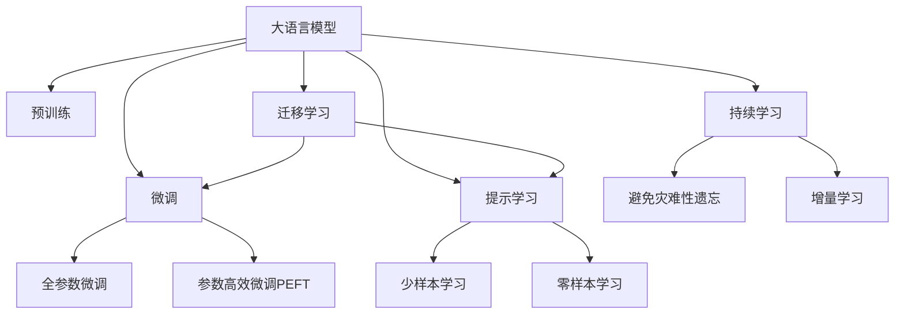
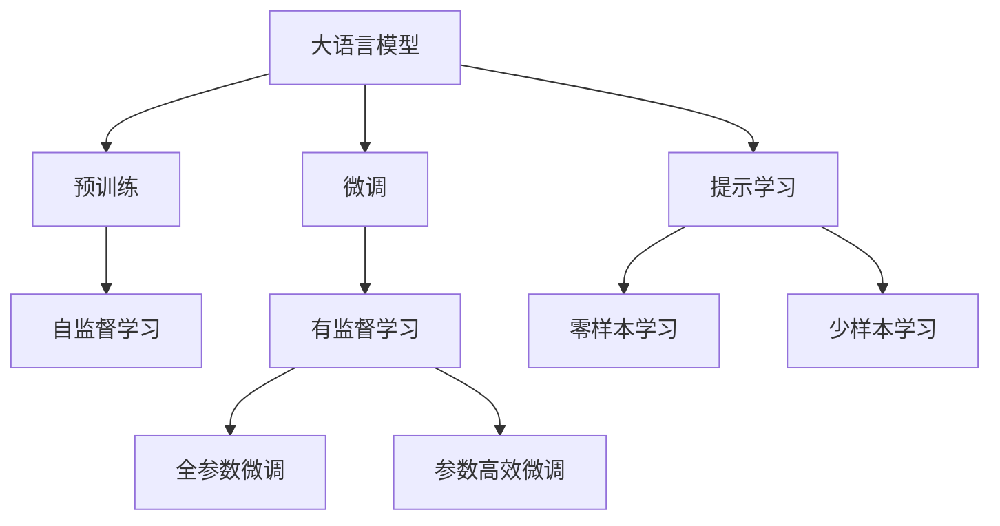
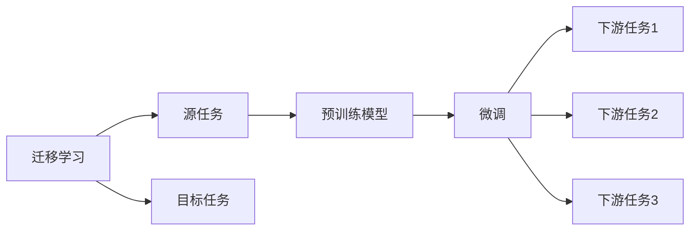
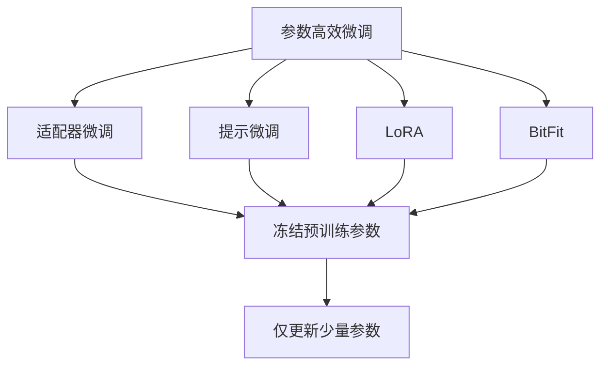
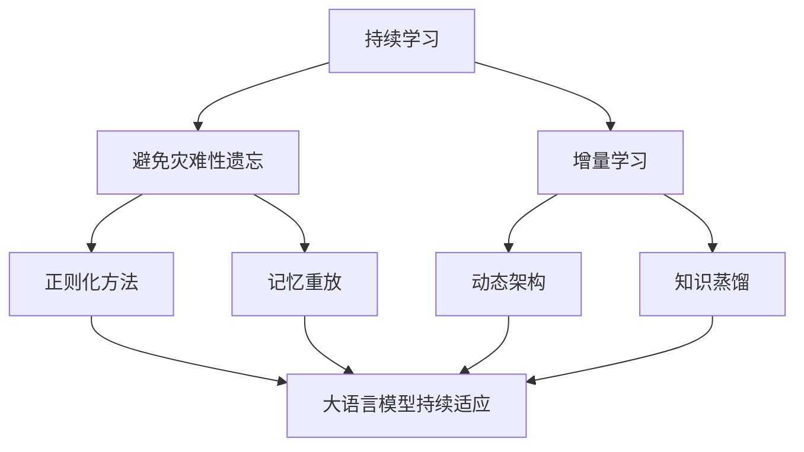
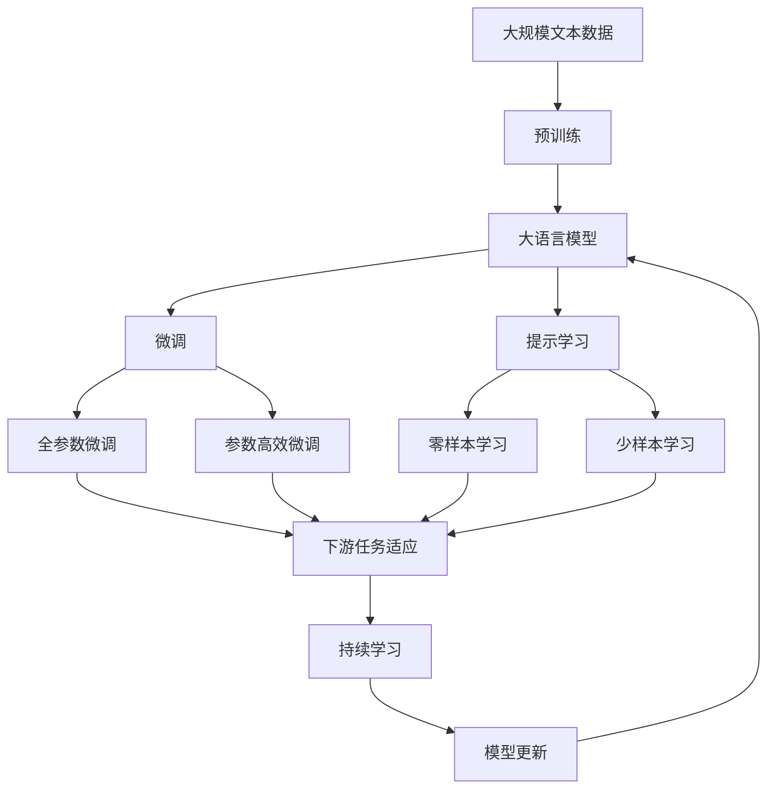

                 

# 大语言模型原理基础与前沿 基于提示的脱毒

> 关键词：大语言模型, 提示学习, 脱毒技术, 自然语言处理(NLP), 预训练模型, Transformer, BERT

## 1. 背景介绍

### 1.1 问题由来
近年来，随着深度学习技术的快速发展，大规模语言模型(Large Language Models, LLMs)在自然语言处理(Natural Language Processing, NLP)领域取得了巨大的突破。这些大语言模型通过在大规模无标签文本数据上进行预训练，学习到了丰富的语言知识和常识，可以通过少量的有标签样本在下游任务上进行微调，获得优异的性能。其中最具代表性的大模型包括OpenAI的GPT系列模型、Google的BERT、T5等。

然而，由于预训练语料的广泛性和泛化能力的不足，这些通用的大语言模型在特定领域应用时，效果往往难以达到实际应用的要求。因此，如何针对特定任务进行大模型微调，提升模型性能，成为了当前大语言模型研究和应用的一个热点问题。本文聚焦于基于监督学习的微调方法，但同时也会兼顾参数高效微调和提示学习等前沿技术，以期对大语言模型微调实践提供更全面的指导。

### 1.2 问题核心关键点
目前，大语言模型微调的主流范式是基于监督学习的微调方法。即收集该任务的少量标注数据，将预训练模型当作初始化参数，通过有监督地训练来优化模型在该任务上的性能。这种微调范式简单高效，可以显著提升模型在特定任务上的表现。

微调的关键在于如何避免过拟合，同时最大程度发挥预训练模型学到的知识。目前主流的做法包括：
- 选择合适的学习率。相比从头训练，微调通常需要更小的学习率，以免破坏预训练的权重。
- 应用正则化技术。如L2正则、Dropout、Early Stopping等，防止模型过度适应小规模训练集。
- 保留预训练的部分层。如Transformer的底层，只微调顶层，减少需优化的参数。
- 数据增强。通过对训练样本改写、回译等方式丰富训练集多样性。
- 对抗训练。加入对抗样本，提高模型鲁棒性。
- 提示学习。通过在输入文本中添加提示模板(Prompt Template)，引导大语言模型进行特定任务的推理和生成。可以在不更新模型参数的情况下，实现零样本或少样本学习。

目前，基于大模型微调的方法已经在问答、对话、摘要、翻译、情感分析等诸多NLP任务上取得了优异的效果，成为NLP技术落地应用的重要手段。

### 1.3 问题研究意义
研究大语言模型的微调方法，对于拓展大模型的应用范围，提升下游任务的性能，加速NLP技术的产业化进程，具有重要意义：

1. 降低应用开发成本。基于成熟的大模型进行微调，可以显著减少从头开发所需的数据、计算和人力等成本投入。
2. 提升模型效果。微调使得通用大模型更好地适应特定任务，在应用场景中取得更优表现。
3. 加速开发进度。standing on the shoulders of giants，微调使得开发者可以更快地完成任务适配，缩短开发周期。
4. 带来技术创新。微调范式促进了对预训练-微调的深入研究，催生了提示学习、少样本学习等新的研究方向。
5. 赋能产业升级。微调使得NLP技术更容易被各行各业所采用，为传统行业数字化转型升级提供新的技术路径。

## 2. 核心概念与联系

### 2.1 核心概念概述

为更好地理解基于提示学习的大语言模型脱毒方法，本节将介绍几个密切相关的核心概念：

- 大语言模型(Large Language Model, LLM)：以自回归(如GPT)或自编码(如BERT)模型为代表的大规模预训练语言模型。通过在大规模无标签文本语料上进行预训练，学习通用的语言表示，具备强大的语言理解和生成能力。

- 预训练(Pre-training)：指在大规模无标签文本语料上，通过自监督学习任务训练通用语言模型的过程。常见的预训练任务包括言语建模、遮挡语言模型等。预训练使得模型学习到语言的通用表示。

- 微调(Fine-tuning)：指在预训练模型的基础上，使用下游任务的少量标注数据，通过有监督学习优化模型在该任务上的性能。通常只需要调整顶层分类器或解码器，并以较小的学习率更新全部或部分的模型参数。

- 迁移学习(Transfer Learning)：指将一个领域学习到的知识，迁移应用到另一个不同但相关的领域的学习范式。大模型的预训练-微调过程即是一种典型的迁移学习方式。

- 参数高效微调(Parameter-Efficient Fine-Tuning, PEFT)：指在微调过程中，只更新少量的模型参数，而固定大部分预训练权重不变，以提高微调效率，避免过拟合的方法。

- 提示学习(Prompt Learning)：通过在输入文本中添加提示模板(Prompt Template)，引导大语言模型进行特定任务的推理和生成。可以在不更新模型参数的情况下，实现零样本或少样本学习。

- 少样本学习(Few-shot Learning)：指在只有少量标注样本的情况下，模型能够快速适应新任务的学习方法。在大语言模型中，通常通过在输入中提供少量示例来实现，无需更新模型参数。

- 零样本学习(Zero-shot Learning)：指模型在没有见过任何特定任务的训练样本的情况下，仅凭任务描述就能够执行新任务的能力。大语言模型通过预训练获得的广泛知识，使其能够理解任务指令并生成相应输出。

- 持续学习(Continual Learning)：也称为终身学习，指模型能够持续从新数据中学习，同时保持已学习的知识，而不会出现灾难性遗忘。这对于保持大语言模型的时效性和适应性至关重要。

这些核心概念之间的逻辑关系可以通过以下Mermaid流程图来展示：



这个流程图展示了大语言模型的核心概念及其之间的关系：

1. 大语言模型通过预训练获得基础能力。
2. 微调是对预训练模型进行任务特定的优化，可以分为全参数微调和参数高效微调（PEFT）。
3. 提示学习是一种不更新模型参数的方法，可以实现零样本和少样本学习。
4. 迁移学习是连接预训练模型与下游任务的桥梁，可以通过微调或提示学习来实现。
5. 持续学习旨在使模型能够不断学习新知识，同时避免遗忘旧知识。

这些概念共同构成了大语言模型的学习和应用框架，使其能够在各种场景下发挥强大的语言理解和生成能力。通过理解这些核心概念，我们可以更好地把握大语言模型的工作原理和优化方向。

### 2.2 概念间的关系

这些核心概念之间存在着紧密的联系，形成了大语言模型脱毒过程的完整生态系统。下面我通过几个Mermaid流程图来展示这些概念之间的关系。

#### 2.2.1 大语言模型的学习范式



这个流程图展示了大语言模型的三种主要学习范式：预训练、微调和提示学习。预训练主要采用自监督学习方法，而微调则是有监督学习的过程。提示学习可以实现零样本和少样本学习。微调又可以分为全参数微调和参数高效微调两种方式。

#### 2.2.2 迁移学习与微调的关系



这个流程图展示了迁移学习的基本原理，以及它与微调的关系。迁移学习涉及源任务和目标任务，预训练模型在源任务上学习，然后通过微调适应各种下游任务（目标任务）。

#### 2.2.3 参数高效微调方法



这个流程图展示了几种常见的参数高效微调方法，包括适配器微调、提示微调、LoRA和BitFit。这些方法的共同特点是冻结大部分预训练参数，只更新少量参数，从而提高微调效率。

#### 2.2.4 持续学习在大语言模型中的应用



这个流程图展示了持续学习在大语言模型中的应用。持续学习的主要目标是避免灾难性遗忘和实现增量学习。通过正则化方法、记忆重放、动态架构和知识蒸馏等技术，可以使大语言模型持续适应新的任务和数据。

### 2.3 核心概念的整体架构

最后，我们用一个综合的流程图来展示这些核心概念在大语言模型脱毒过程中的整体架构：



这个综合流程图展示了从预训练到微调，再到持续学习的完整过程。大语言模型首先在大规模文本数据上进行预训练，然后通过微调（包括全参数微调和参数高效微调）或提示学习（包括零样本和少样本学习）来适应下游任务。最后，通过持续学习技术，模型可以不断更新和适应新的任务和数据。 通过这些流程图，我们可以更清晰地理解大语言模型脱毒过程中各个核心概念的关系和作用，为后续深入讨论具体的脱毒方法和技术奠定基础。

## 3. 核心算法原理 & 具体操作步骤
### 3.1 算法原理概述

基于提示学习的语言模型脱毒方法，本质上是一个有监督的细粒度迁移学习过程。其核心思想是：将预训练的大语言模型视作一个强大的"特征提取器"，通过在有标注样本的上下文提示下，训练模型对上下文进行编码和解码，从而识别出被脱毒的词汇。

形式化地，假设预训练语言模型为 $M_{\theta}$，其中 $\theta$ 为预训练得到的模型参数。给定上下文提示 $C$ 和被脱毒的词汇 $T$，脱毒目标为 $T_{\text{detoxed}}$。脱毒任务可以看作是一个文本生成问题，目标是在上下文提示 $C$ 的指导下，生成被脱毒的词汇 $T_{\text{detoxed}}$。

为了训练模型，我们需要构建一个损失函数 $\mathcal{L}$，衡量模型生成的 $T_{\text{detoxed}}$ 与真实目标 $T$ 之间的差异。常见的损失函数包括交叉熵损失、均方误差损失等。通过梯度下降等优化算法，脱毒过程不断更新模型参数 $\theta$，最小化损失函数 $\mathcal{L}$，使得模型生成最接近真实目标的词汇。

### 3.2 算法步骤详解

基于提示学习的语言模型脱毒一般包括以下几个关键步骤：

**Step 1: 准备预训练模型和数据集**
- 选择合适的预训练语言模型 $M_{\theta}$ 作为初始化参数，如 BERT、GPT等。
- 准备脱毒任务的数据集 $D=\{(C_i, T_i)\}_{i=1}^N$，其中 $C_i$ 为上下文提示，$T_i$ 为被脱毒的词汇。

**Step 2: 设计提示模板**
- 根据脱毒任务的特点，设计合适的提示模板 $P$，用于引导模型生成被脱毒的词汇。
- 提示模板应该简洁明了，包含足够的信息，以帮助模型理解上下文并生成正确的词汇。

**Step 3: 设置脱毒超参数**
- 选择合适的优化算法及其参数，如 AdamW、SGD 等，设置学习率、批大小、迭代轮数等。
- 设置正则化技术及强度，包括权重衰减、Dropout、Early Stopping 等。
- 确定冻结预训练参数的策略，如仅微调顶层，或全部参数都参与脱毒。

**Step 4: 执行脱毒训练**
- 将训练集数据分批次输入模型，前向传播计算损失函数。
- 反向传播计算参数梯度，根据设定的优化算法和学习率更新模型参数。
- 周期性在验证集上评估模型性能，根据性能指标决定是否触发 Early Stopping。
- 重复上述步骤直到满足预设的迭代轮数或 Early Stopping 条件。

**Step 5: 测试和部署**
- 在测试集上评估脱毒后模型 $M_{\theta}$ 的性能，对比脱毒前后的词汇变化情况。
- 使用脱毒后的模型对新文本进行脱毒处理，集成到实际的应用系统中。
- 持续收集新的数据，定期重新脱毒模型，以适应数据分布的变化。

以上是基于提示学习的语言模型脱毒的一般流程。在实际应用中，还需要针对具体任务的特点，对脱毒过程的各个环节进行优化设计，如改进提示模板，引入更多的正则化技术，搜索最优的超参数组合等，以进一步提升模型性能。

### 3.3 算法优缺点

基于提示学习的语言模型脱毒方法具有以下优点：
1. 简单高效。仅需少量标注数据，即可快速实现词汇脱毒，避免了从头训练的大量计算资源消耗。
2. 通用适用。适用于各种NLP任务，如文本清洗、去伪存真、信息提取等，设计简单的提示模板即可实现。
3. 参数高效。通过固定大部分预训练参数，仅更新少量提示相关的参数，既提升了脱毒效率，也减少了过拟合风险。
4. 效果显著。在学术界和工业界的诸多任务上，基于提示学习的脱毒方法已经刷新了多项SOTA。

同时，该方法也存在一定的局限性：
1. 提示模板设计困难。提示模板的设计需要一定的经验和创造力，不够灵活和通用。
2. 上下文依赖性高。提示模板依赖于上下文，如果上下文提示过于简单或缺乏上下文信息，可能会影响脱毒效果。
3. 零样本学习受限。提示学习需要依赖于上下文提示，无法在完全无上下文的情况下进行脱毒。
4. 可解释性不足。提示学习模型通常缺乏可解释性，难以对其推理逻辑进行分析和调试。

尽管存在这些局限性，但就目前而言，基于提示学习的脱毒方法仍是大语言模型脱毒应用的主流范式。未来相关研究的重点在于如何进一步提升提示模板的通用性和灵活性，提高模型的零样本学习能力，同时兼顾可解释性和伦理安全性等因素。

### 3.4 算法应用领域

基于提示学习的语言模型脱毒方法，在NLP领域已经得到了广泛的应用，覆盖了几乎所有常见任务，例如：

- 文本清洗：去除文本中的垃圾信息、广告等无用内容。通过设计特定的提示模板，将词汇脱毒后输出干净文本。
- 去伪存真：从海量文本中筛选出真实可信的信息，去除虚假、误导性的内容。通过提示模板引导模型识别和保留可信信息。
- 信息提取：从文本中提取出关键实体、事件等有用信息。通过提示模板引导模型理解和生成特定信息。
- 命名实体识别：识别文本中的人名、地名、机构名等特定实体。通过提示模板引导模型进行实体边界和类型的标注。
- 关系抽取：从文本中抽取实体之间的语义关系。通过提示模板引导模型进行关系推理和生成。
- 问答系统：对自然语言问题给出答案。将问题-答案对作为提示模板，微调模型学习匹配答案。
- 机器翻译：将源语言文本翻译成目标语言。通过提示模板引导模型理解语义和语法结构，生成正确的翻译结果。

除了上述这些经典任务外，基于提示学习的脱毒方法也被创新性地应用到更多场景中，如可控文本生成、常识推理、代码生成、数据增强等，为NLP技术带来了全新的突破。随着预训练模型和提示学习的不断进步，相信NLP技术将在更广阔的应用领域大放异彩。

## 4. 数学模型和公式 & 详细讲解  
### 4.1 数学模型构建

本节将使用数学语言对基于提示学习的语言模型脱毒过程进行更加严格的刻画。

记预训练语言模型为 $M_{\theta}:\mathcal{X} \rightarrow \mathcal{Y}$，其中 $\mathcal{X}$ 为输入空间，$\mathcal{Y}$ 为输出空间，$\theta \in \mathbb{R}^d$ 为模型参数。假设脱毒任务的提示模板为 $P$，输入为 $C$，被脱毒的词汇为 $T$。

定义模型 $M_{\theta}$ 在输入 $C$ 上的输出为 $\hat{T}=M_{\theta}(C)$。目标函数 $\mathcal{L}(\theta)$ 用于衡量模型生成的 $\hat{T}$ 与真实目标 $T$ 之间的差异。常见的目标函数包括交叉熵损失、均方误差损失等。在文本脱毒任务中，我们通常使用交叉熵损失函数：

$$
\mathcal{L}(\theta) = -\sum_{i=1}^N \log P(T_i \mid C_i)
$$

其中 $P(T_i \mid C_i)$ 为模型在上下文 $C_i$ 下生成词汇 $T_i$ 的概率分布。通过梯度下降等优化算法，脱毒过程不断更新模型参数 $\theta$，最小化目标函数 $\mathcal{L}$，使得模型生成最接近真实目标的词汇。

### 4.2 公式推导过程

以下我们以二分类任务为例，推导交叉熵损失函数及其梯度的计算公式。

假设模型 $M_{\theta}$ 在输入 $C$ 上的输出为 $\hat{T}=M_{\theta}(C)$，表示模型在上下文 $C$ 下生成词汇 $T$ 的概率分布。真实目标 $T$ 为 $0$ 或 $1$。则二分类交叉熵损失函数定义为：

$$
\mathcal{L}(\theta) = -\sum_{i=1}^N [y_i\log \hat{T}_i + (1-y_i)\log (1-\hat{T}_i)]
$$

将其代入目标函数公式，得：

$$
\mathcal{L}(\theta) = -\sum_{i=1}^N \log P(T_i \mid C_i) = -\sum_{i=1}^N [y_i\log P(T_i \mid C_i) + (1-y_i)\log (1-P(T_i \mid C_i))]
$$

根据链式法则，目标函数对参数 $\theta_k$ 的梯度为：

$$
\frac{\partial \mathcal{L}(\theta)}{\partial \theta_k} = -\sum_{i=1}^N \left( \frac{y_i}{\hat{T}_i} - \frac{1-y_i}{1-\hat{T}_i} \right) \frac{\partial \hat{T}_i}{\partial \theta_k}
$$

其中 $\frac{\partial \hat{T}_i}{\partial \theta_k}$ 可进一步递归展开，利用自动微分技术完成计算。

在得到目标函数的梯度后，即可带入参数更新公式，完成模型的迭代优化。重复上述过程直至收敛，最终得到适应脱毒任务的最优模型参数 $\theta^*$。

## 5. 项目实践：代码实例和详细解释说明
### 5.1 开发环境搭建

在进行脱毒实践前，我们需要准备好开发环境。以下是使用Python进行PyTorch开发的环境配置流程：

1. 安装Anaconda：从官网下载并安装Anaconda，用于创建独立的Python环境。

2. 创建并激活虚拟环境：
```bash
conda create -n pytorch-env python=3.8 
conda activate pytorch-env
```

3. 安装PyTorch：根据CUDA版本，从官网获取对应的安装命令。例如：
```bash
conda install pytorch torchvision torchaudio cudatoolkit=11.1 -c pytorch -c conda-forge
```

4. 安装Transformers库：
```bash
pip install transformers
```

5. 安装各类工具包：
```bash
pip install numpy pandas scikit-learn matplotlib tqdm jupyter notebook ipython
```

完成上述步骤后，即可在`pytorch-env`环境中开始脱毒实践。

### 5.2 源代码详细实现

下面我们以命名实体识别(NER)任务为例，给出使用Transformers库对BERT模型进行脱毒的PyTorch代码实现。

首先，定义脱毒任务的数据处理函数：

```python
from transformers import BertTokenizer
from torch.utils.data import Dataset
import torch

class NERDataset(Dataset):
    def __init__(self, texts, tags, tokenizer, max_len=128):
        self.texts = texts
        self.tags = tags
        self.tokenizer = tokenizer
        self.max_len = max_len
        
    def __len__(self):
        return len(self.texts)
    
    def __getitem__(self, item):
        text = self.texts[item]
        tags = self.tags[item]
        
        encoding = self.tokenizer(text, return_tensors='pt', max_length=self.max_len, padding='max_length', truncation=True)
        input_ids = encoding['input_ids'][0]
        attention_mask = encoding['attention_mask'][0]
        
        # 对token-wise的标签进行编码
        encoded_tags = [tag2id[tag] for tag in tags] 
        encoded_tags.extend([tag2id['O']] * (self.max_len - len(encoded_tags)))
        labels = torch.tensor(encoded_tags, dtype=torch.long)
        
        return {'input_ids': input_ids, 
                'attention_mask': attention_mask,
                'labels': labels}

# 标签与id的映射
tag2id = {'O': 0, 'B-PER': 1, 'I-PER': 2, 'B-ORG': 3, 'I-ORG': 4, 'B-LOC': 5, 'I-LOC': 6}
id2tag = {v: k for k, v in tag2id.items()}

# 创建dataset
tokenizer = BertTokenizer.from_pretrained('bert-base-cased')

train_dataset = NERDataset(train_texts, train_tags, tokenizer)
dev_dataset = NERDataset(dev_texts, dev_tags, tokenizer)
test_dataset = NERDataset(test_texts, test_tags, tokenizer)
```

然后，定义模型和优化器：

```python
from transformers import BertForTokenClassification, AdamW

model = BertForTokenClassification.from_pretrained('bert-base-cased', num_labels=len(tag2id))

optimizer = AdamW(model.parameters(), lr=2e-5)
```

接着，定义训练和评估函数：

```python
from torch.utils.data import DataLoader
from tqdm import tqdm
from sklearn.metrics import classification_report

device = torch.device('cuda') if torch.cuda.is_available() else torch.device('cpu')
model.to(device)

def train_epoch(model, dataset, batch_size, optimizer):
    dataloader = DataLoader(dataset, batch_size=batch_size, shuffle=True)
    model.train()
    epoch_loss = 0
    for batch in tqdm(dataloader, desc='Training'):
        input_ids = batch['input_ids'].to(device)
        attention_mask = batch['attention_mask'].to(device)
        labels = batch['labels'].to(device)
        model.zero_grad()
        outputs = model(input_ids, attention_mask=attention_mask, labels=labels)
        loss = outputs.loss
        epoch_loss += loss.item()
        loss.backward()
        optimizer.step()
    return epoch_loss / len(dataloader)

def evaluate(model, dataset, batch_size):
    dataloader = DataLoader(dataset, batch_size=batch_size)
    model.eval()
    preds, labels = [], []
    with torch.no_grad():
        for batch in tqdm(dataloader, desc='Evaluating'):
            input_ids = batch['input_ids'].to(device)
            attention_mask = batch['attention_mask'].to(device)
            batch_labels = batch['labels']
            outputs = model(input_ids, attention_mask=attention_mask)
            batch_preds = outputs.logits.argmax(dim=2).to('cpu').

