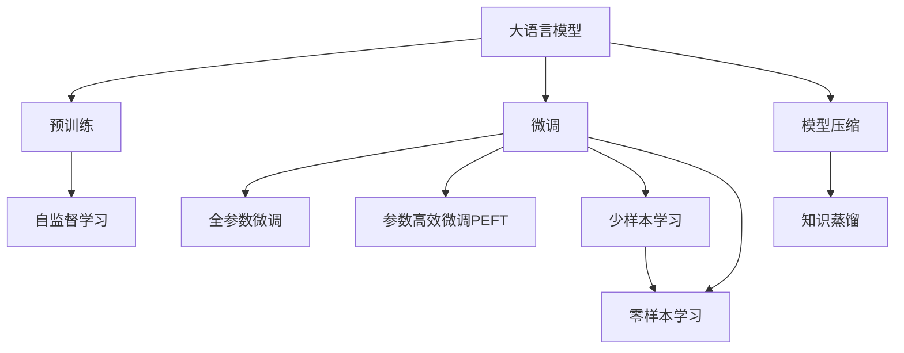
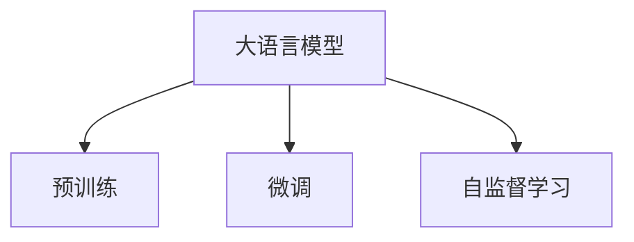
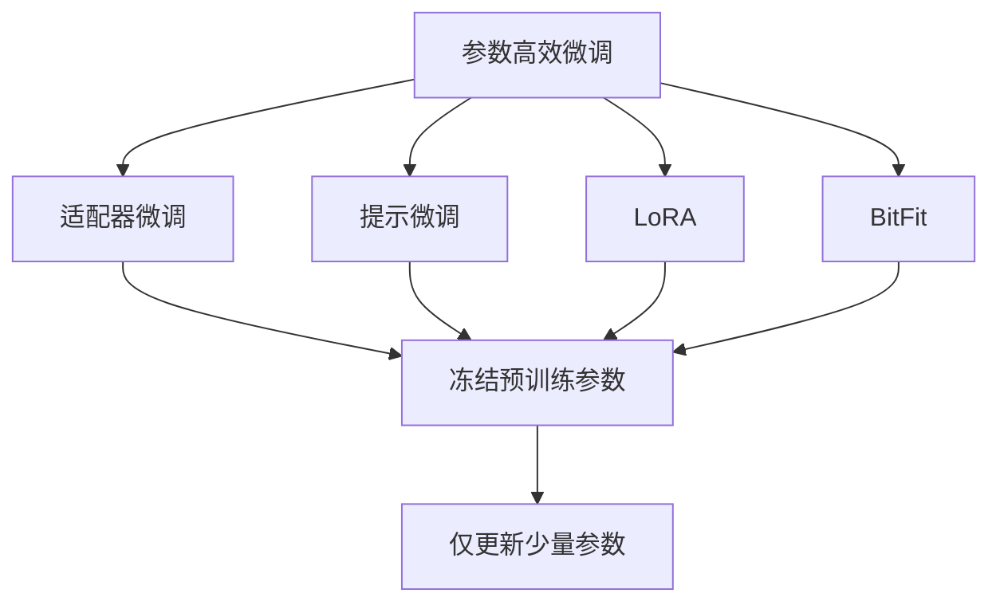
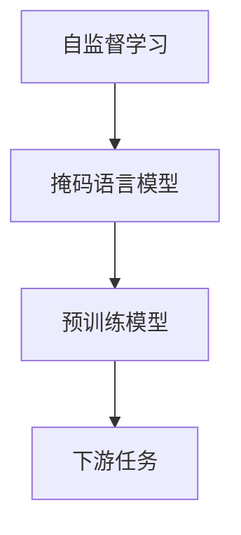
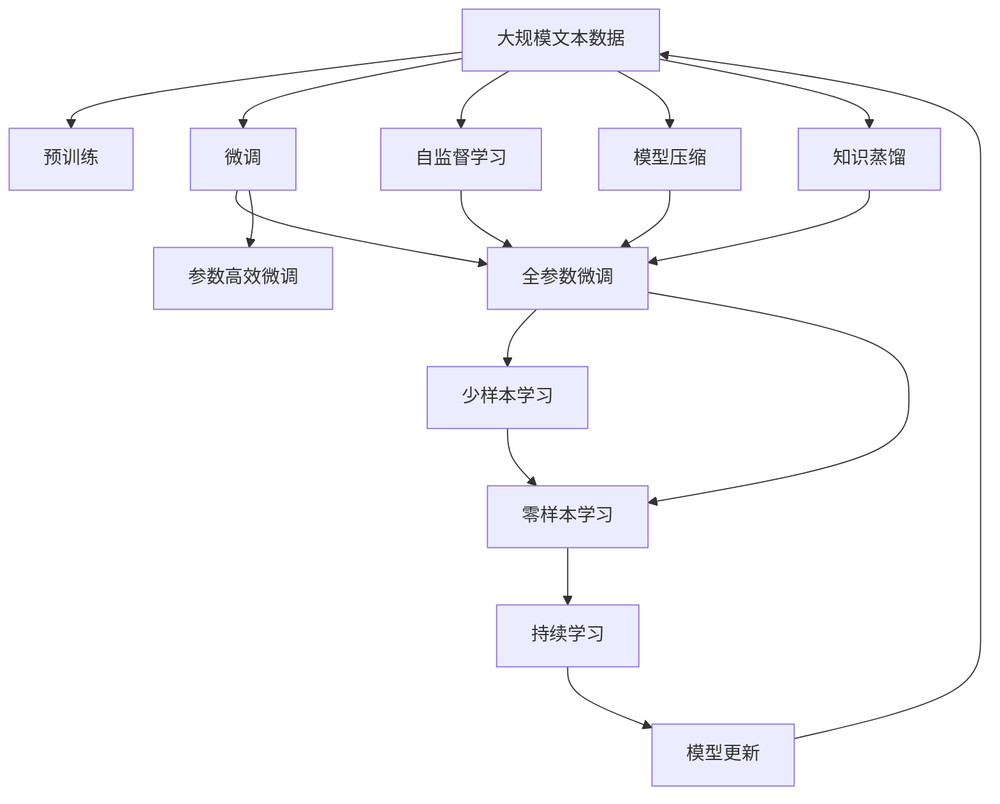

                 

# 大语言模型应用指南：Transformer的原始输入

> 关键词：大语言模型,Transformer,预训练,原始输入,自监督学习,模型压缩,参数高效微调,自然语言处理(NLP)

## 1. 背景介绍

### 1.1 问题由来
近年来，随着深度学习技术的快速发展，Transformer等大语言模型在自然语言处理(NLP)领域取得了巨大的突破。这些模型通过在大规模无标签文本数据上进行预训练，学习到了丰富的语言知识和常识，具有强大的语言理解和生成能力。但这些模型通常具有上亿个参数，占用大量计算资源，使得其在实际应用中存在许多挑战。

为了解决这一问题，研究人员提出了许多压缩和优化策略，如参数高效微调、深度剪枝、知识蒸馏等。其中，基于原始输入的自监督学习是最为直接和简单的方法之一。该方法利用大模型在原始输入上进行预训练，然后再在少量标签数据上微调，从而获得高效且鲁棒的语言模型。

### 1.2 问题核心关键点
基于原始输入的自监督学习方法，本质上是将大语言模型作为通用的特征提取器，通过在原始输入上进行预训练，提取其内在表示，然后在少量标签数据上微调，使得模型能够适应特定的下游任务。该方法具有以下优点：

- **高效**：仅需要原始输入数据，无需标注数据，因此可以大幅降低标注成本。
- **鲁棒**：在预训练过程中，模型能够学习到更加普适的语言知识，对下游任务的微调效果也更为稳健。
- **通用**：适用于各种NLP任务，如分类、匹配、生成等，只需根据任务需求调整输出层即可。

但该方法也存在一定的局限性：

- **依赖数据量**：尽管不需要标注数据，但原始输入数据量仍需足够大，才能保证预训练的有效性。
- **模型压缩难度大**：大规模模型压缩技术尚未完全成熟，压缩后的模型性能可能受到影响。
- **计算资源需求高**：预训练过程中需要大量的计算资源，对硬件要求较高。

尽管存在这些局限性，基于原始输入的自监督学习方法仍是大语言模型微调的重要方法之一，广泛应用于各种NLP任务中。

### 1.3 问题研究意义
研究基于原始输入的自监督学习方法，对于拓展大语言模型的应用范围，提升下游任务的性能，加速NLP技术的产业化进程，具有重要意义：

1. **降低应用开发成本**：基于原始输入的自监督学习方法可以显著减少从头开发所需的数据、计算和人力等成本投入。
2. **提升模型效果**：在原始输入上进行预训练，可以使模型学习到更加通用的语言表示，对下游任务的微调效果也更为显著。
3. **加速开发进度**：standing on the shoulders of giants，基于原始输入的自监督学习方法可以更快地完成任务适配，缩短开发周期。
4. **技术创新**：自监督学习方法促进了对预训练-微调的深入研究，催生了深度剪枝、知识蒸馏等新的研究方向。
5. **赋能产业升级**：自监督学习方法使得NLP技术更容易被各行各业所采用，为传统行业数字化转型升级提供新的技术路径。

## 2. 核心概念与联系

### 2.1 核心概念概述

为更好地理解基于原始输入的自监督学习方法，本节将介绍几个密切相关的核心概念：

- **大语言模型(Large Language Model, LLM)**：以自回归(如GPT)或自编码(如BERT)模型为代表的大规模预训练语言模型。通过在大规模无标签文本语料上进行预训练，学习通用的语言表示，具备强大的语言理解和生成能力。

- **自监督学习(Self-Supervised Learning)**：一种无监督学习范式，通过在原始输入数据中构造有监督的子任务，训练模型从中学习任务相关的知识。常见的自监督任务包括掩码语言模型、同义词替换等。

- **预训练(Pre-training)**：指在大规模无标签文本语料上，通过自监督学习任务训练通用语言模型的过程。常见的预训练任务包括掩码语言模型、Next Sentence Prediction等。预训练使得模型学习到语言的通用表示。

- **微调(Fine-Tuning)**：指在预训练模型的基础上，使用下游任务的少量标注数据，通过有监督学习优化模型在特定任务上的性能。通常只需要调整顶层分类器或解码器，并以较小的学习率更新全部或部分的模型参数。

- **模型压缩(Model Compression)**：通过剪枝、量化、知识蒸馏等方法，减少模型的参数量和计算量，从而降低计算资源需求，提高推理速度。

- **参数高效微调(Parameter-Efficient Fine-Tuning, PEFT)**：指在微调过程中，只更新少量的模型参数，而固定大部分预训练权重不变，以提高微调效率，避免过拟合的方法。

- **自然语言处理(Natural Language Processing, NLP)**：研究计算机如何理解和生成人类语言的技术，包括文本分类、情感分析、机器翻译、语音识别等。

这些核心概念之间的逻辑关系可以通过以下Mermaid流程图来展示：



这个流程图展示了大语言模型的核心概念及其之间的关系：

1. 大语言模型通过预训练获得基础能力。
2. 微调是对预训练模型进行任务特定的优化，可以分为全参数微调和参数高效微调（PEFT）。
3. 自监督学习用于预训练过程，帮助模型学习通用的语言表示。
4. 模型压缩和知识蒸馏用于优化预训练模型，减少计算资源需求。
5. 微调可以使用少量标签数据进行优化，适用于各种NLP任务。
6. 自监督学习方法通过构造有监督子任务，训练模型从中学习任务相关的知识。

### 2.2 概念间的关系

这些核心概念之间存在着紧密的联系，形成了大语言模型的学习框架。下面我们通过几个Mermaid流程图来展示这些概念之间的关系。

#### 2.2.1 大语言模型的学习范式



这个流程图展示了大语言模型的三种主要学习范式：预训练、微调和自监督学习。预训练主要采用自监督学习方法，而微调则是有监督学习的过程。自监督学习用于提取通用语言表示，为下游任务提供基础能力。

#### 2.2.2 微调与预训练的关系


这个流程图展示了微调与预训练的关系。微调过程是对预训练模型的进一步优化，以适应特定的下游任务。

#### 2.2.3 参数高效微调方法



这个流程图展示了几种常见的参数高效微调方法，包括适配器微调、提示微调、LoRA和BitFit。这些方法的共同特点是冻结大部分预训练参数，只更新少量参数，从而提高微调效率。

#### 2.2.4 自监督学习在大语言模型中的应用



这个流程图展示了自监督学习在大语言模型中的应用。自监督学习通过构造掩码语言模型等任务，训练预训练模型学习语言知识，为下游任务提供支持。

### 2.3 核心概念的整体架构

最后，我们用一个综合的流程图来展示这些核心概念在大语言模型微调过程中的整体架构：



这个综合流程图展示了从预训练到微调，再到持续学习的完整过程。大语言模型首先在大规模文本数据上进行预训练，然后通过自监督学习提取语言知识，最后通过微调（包括全参数微调和参数高效微调）来适应下游任务。同时，通过模型压缩和知识蒸馏等技术，优化预训练模型，减少计算资源需求。持续学习过程使得模型能够不断适应新的数据，保持性能的稳定性和时效性。

## 3. 核心算法原理 & 具体操作步骤
### 3.1 算法原理概述

基于原始输入的自监督学习方法，本质上是一种通过在大规模无标签数据上进行自监督学习，然后对模型进行微调的过程。其核心思想是：利用大语言模型在原始输入上进行预训练，提取通用的语言表示，然后通过微调适应下游任务的特定需求，从而获得针对特定任务优化的模型。

形式化地，假设预训练模型为 $M_{\theta}$，其中 $\theta$ 为预训练得到的模型参数。给定下游任务 $T$ 的少量标注数据集 $D=\{(x_i,y_i)\}_{i=1}^N$，其中 $x_i$ 为原始输入文本，$y_i$ 为任务标签，微调的目标是找到新的模型参数 $\hat{\theta}$，使得：

$$
\hat{\theta}=\mathop{\arg\min}_{\theta} \mathcal{L}(M_{\theta},D)
$$

其中 $\mathcal{L}$ 为针对任务 $T$ 设计的损失函数，用于衡量模型预测输出与真实标签之间的差异。常见的损失函数包括交叉熵损失、均方误差损失等。

通过梯度下降等优化算法，微调过程不断更新模型参数 $\theta$，最小化损失函数 $\mathcal{L}$，使得模型输出逼近真实标签。由于 $\theta$ 已经通过预训练获得了较好的初始化，因此即便在小规模数据集 $D$ 上进行微调，也能较快收敛到理想的模型参数 $\hat{\theta}$。

### 3.2 算法步骤详解

基于原始输入的自监督学习一般包括以下几个关键步骤：

**Step 1: 准备预训练模型和数据集**
- 选择合适的预训练语言模型 $M_{\theta}$ 作为初始化参数，如 BERT、GPT 等。
- 准备下游任务 $T$ 的少量标注数据集 $D$，划分为训练集、验证集和测试集。一般要求标注数据与预训练数据的分布不要差异过大。

**Step 2: 添加任务适配层**
- 根据任务类型，在预训练模型顶层设计合适的输出层和损失函数。
- 对于分类任务，通常在顶层添加线性分类器和交叉熵损失函数。
- 对于生成任务，通常使用语言模型的解码器输出概率分布，并以负对数似然为损失函数。

**Step 3: 设置微调超参数**
- 选择合适的优化算法及其参数，如 AdamW、SGD 等，设置学习率、批大小、迭代轮数等。
- 设置正则化技术及强度，包括权重衰减、Dropout、Early Stopping等。
- 确定冻结预训练参数的策略，如仅微调顶层，或全部参数都参与微调。

**Step 4: 执行梯度训练**
- 将训练集数据分批次输入模型，前向传播计算损失函数。
- 反向传播计算参数梯度，根据设定的优化算法和学习率更新模型参数。
- 周期性在验证集上评估模型性能，根据性能指标决定是否触发 Early Stopping。
- 重复上述步骤直到满足预设的迭代轮数或 Early Stopping 条件。

**Step 5: 测试和部署**
- 在测试集上评估微调后模型 $M_{\hat{\theta}}$ 的性能，对比微调前后的精度提升。
- 使用微调后的模型对新样本进行推理预测，集成到实际的应用系统中。
- 持续收集新的数据，定期重新微调模型，以适应数据分布的变化。

以上是基于原始输入的自监督学习的完整流程。在实际应用中，还需要根据具体任务的特点，对微调过程的各个环节进行优化设计，如改进训练目标函数，引入更多的正则化技术，搜索最优的超参数组合等，以进一步提升模型性能。

### 3.3 算法优缺点

基于原始输入的自监督学习方法具有以下优点：

- **简单高效**：仅需要原始输入数据，无需标注数据，因此可以大幅降低标注成本。
- **鲁棒性**：在预训练过程中，模型能够学习到更加普适的语言知识，对下游任务的微调效果也更为稳健。
- **通用性**：适用于各种NLP任务，如分类、匹配、生成等，只需根据任务需求调整输出层即可。

但该方法也存在一定的局限性：

- **依赖数据量**：尽管不需要标注数据，但原始输入数据量仍需足够大，才能保证预训练的有效性。
- **模型压缩难度大**：大规模模型压缩技术尚未完全成熟，压缩后的模型性能可能受到影响。
- **计算资源需求高**：预训练过程中需要大量的计算资源，对硬件要求较高。

尽管存在这些局限性，基于原始输入的自监督学习方法仍是大语言模型微调的重要方法之一，广泛应用于各种NLP任务中。

### 3.4 算法应用领域

基于原始输入的自监督学习方法，在NLP领域已经得到了广泛的应用，覆盖了几乎所有常见任务，例如：

- 文本分类：如情感分析、主题分类、意图识别等。通过微调使模型学习文本-标签映射。
- 命名实体识别：识别文本中的人名、地名、机构名等特定实体。通过微调使模型掌握实体边界和类型。
- 关系抽取：从文本中抽取实体之间的语义关系。通过微调使模型学习实体-关系三元组。
- 问答系统：对自然语言问题给出答案。将问题-答案对作为微调数据，训练模型学习匹配答案。
- 机器翻译：将源语言文本翻译成目标语言。通过微调使模型学习语言-语言映射。
- 文本摘要：将长文本压缩成简短摘要。将文章-摘要对作为微调数据，使模型学习抓取要点。
- 对话系统：使机器能够与人自然对话。将多轮对话历史作为上下文，微调模型进行回复生成。

除了上述这些经典任务外，基于原始输入的自监督学习方法也被创新性地应用到更多场景中，如可控文本生成、常识推理、代码生成、数据增强等，为NLP技术带来了全新的突破。随着预训练模型和自监督学习方法的不断进步，相信NLP技术将在更广阔的应用领域大放异彩。

## 4. 数学模型和公式 & 详细讲解  
### 4.1 数学模型构建

本节将使用数学语言对基于原始输入的自监督学习过程进行更加严格的刻画。

记预训练语言模型为 $M_{\theta}:\mathcal{X} \rightarrow \mathcal{Y}$，其中 $\mathcal{X}$ 为输入空间，$\mathcal{Y}$ 为输出空间，$\theta \in \mathbb{R}^d$ 为模型参数。假设微调任务的训练集为 $D=\{(x_i,y_i)\}_{i=1}^N$，其中 $x_i$ 为原始输入文本，$y_i$ 为任务标签。

定义模型 $M_{\theta}$ 在输入 $x$ 上的输出为 $\hat{y}=M_{\theta}(x) \in [0,1]$，表示样本属于正类的概率。真实标签 $y \in \{0,1\}$。则二分类交叉熵损失函数定义为：

$$
\ell(M_{\theta}(x),y) = -[y\log \hat{y} + (1-y)\log (1-\hat{y})]
$$

将其代入经验风险公式，得：

$$
\mathcal{L}(\theta) = -\frac{1}{N}\sum_{i=1}^N [y_i\log M_{\theta}(x_i)+(1-y_i)\log(1-M_{\theta}(x_i))]
$$

在实践中，我们通常使用基于梯度的优化算法（如SGD、Adam等）来近似求解上述最优化问题。设 $\eta$ 为学习率，$\lambda$ 为正则化系数，则参数的更新公式为：

$$
\theta \leftarrow \theta - \eta \nabla_{\theta}\mathcal{L}(\theta) - \eta\lambda\theta
$$

其中 $\nabla_{\theta}\mathcal{L}(\theta)$ 为损失函数对参数 $\theta$ 的梯度，可通过反向传播算法高效计算。

### 4.2 公式推导过程

以下我们以二分类任务为例，推导交叉熵损失函数及其梯度的计算公式。

假设模型 $M_{\theta}$ 在输入 $x$ 上的输出为 $\hat{y}=M_{\theta}(x) \in [0,1]$，表示样本属于正类的概率。真实标签 $y \in \{0,1\}$。则二分类交叉熵损失函数定义为：

$$
\ell(M_{\theta}(x),y) = -[y\log \hat{y} + (1-y)\log (1-\hat{y})]
$$

将其代入经验风险公式，得：

$$
\mathcal{L}(\theta) = -\frac{1}{N}\sum_{i=1}^N [y_i\log M_{\theta}(x_i)+(1-y_i)\log(1-M_{\theta}(x_i))]
$$

根据链式法则，损失函数对参数 $\theta_k$ 的梯度为：

$$
\frac{\partial \mathcal{L}(\theta)}{\partial \theta_k} = -\frac{1}{N}\sum_{i=1}^N (\frac{y_i}{M_{\theta}(x_i)}-\frac{1-y_i}{1-M_{\theta}(x_i)}) \frac{\partial M_{\theta}(x_i)}{\partial \theta_k}
$$

其中 $\frac{\partial M_{\theta}(x_i)}{\partial \theta_k}$ 可进一步递归展开，利用自动微分技术完成计算。

在得到损失函数的梯度后，即可带入参数更新公式，完成模型的迭代优化。重复上述过程直至收敛，最终得到适应下游任务的最优模型参数 $\theta^*$。

## 5. 项目实践：代码实例和详细解释说明
### 5.1 开发环境搭建

在进行自监督学习实践前，我们需要准备好开发环境。以下是使用Python进行PyTorch开发的环境配置流程：

1. 安装Anaconda：从官网下载并安装Anaconda，用于创建独立的Python环境。

2. 创建并激活虚拟环境：
```bash
conda create -n pytorch-env python=3.8 
conda activate pytorch-env
```

3. 安装PyTorch：根据CUDA版本，从官网获取对应的安装命令。例如：
```bash
conda install pytorch torchvision torchaudio cudatoolkit=11.1 -c pytorch -c conda-forge
```

4. 安装Transformers库：
```bash
pip install transformers
```

5. 安装各类工具包：
```bash
pip install numpy pandas scikit-learn matplotlib tqdm jupyter notebook ipython
```

完成上述步骤后，即可在`pytorch-env`环境中开始自监督学习实践。

### 5.2 源代码详细实现

这里我们以BERT模型在掩码语言模型上的自监督学习为例，给出使用PyTorch和HuggingFace库对BERT模型进行自监督学习的代码实现。

首先，定义掩码语言模型（Masked Language Model, MLM）的任务：

```python
from transformers import BertTokenizer, BertForMaskedLM

tokenizer = BertTokenizer.from_pretrained('bert-base-cased')

def compute_loss(model, text, labels):
    input_ids = tokenizer(text, return_tensors='pt', padding=True, truncation=True)
    input_ids['input_ids'] = input_ids['input_ids'].to(device)
    labels['input_ids'] = labels['input_ids'].to(device)
    
    with torch.no_grad():
        logits = model(**input_ids)[0]
        loss = torch.nn.CrossEntropyLoss()(logits.view(-1, logits.shape[-1]), labels['input_ids'].view(-1))
    
    return loss.item()
```

然后，加载预训练BERT模型并进行微调：

```python
from transformers import AdamW

device = torch.device('cuda') if torch.cuda.is_available() else torch.device('cpu')
model = BertForMaskedLM.from_pretrained('bert-base-cased').to(device)

optimizer = AdamW(model.parameters(), lr=2e-5)

for epoch in range(epochs):
    for batch in tqdm(dataloader, desc='Training'):
        input_ids = batch['input_ids'].to(device)
        labels = batch['input_ids'].to(device)
        
        model.zero_grad()
        loss = compute_loss(model, input_ids, labels)
        loss.backward()
        optimizer.step()
```

最后，在测试集上评估自监督学习后的模型性能：

```python
def evaluate(model, text):
    input_ids = tokenizer(text, return_tensors='pt', padding=True, truncation=True)
    input_ids['input_ids'] = input_ids['input_ids'].to(device)
    
    with torch.no_grad():
        logits = model(**input_ids)[0]
        predictions = logits.argmax(dim=2)
    
    return [tokenizer.decode(pred) for pred in predictions]
```

完整代码如下：

```python
from transformers import BertTokenizer, BertForMaskedLM, AdamW
import torch
from torch.utils.data import DataLoader
from tqdm import tqdm

device = torch.device('cuda') if torch.cuda.is_available() else torch.device('cpu')

# 加载模型和分词器
tokenizer = BertTokenizer.from_pretrained('bert-base-cased')
model = BertForMaskedLM.from_pretrained('bert-base-cased').to(device)
optimizer = AdamW(model.parameters(), lr=2e-5)

# 准备数据集
train_dataset = ...
dev_dataset = ...
test_dataset = ...

# 创建数据加载器
dataloader = DataLoader(train_dataset, batch_size=batch_size, shuffle=True)

# 训练过程
epochs = ...
for epoch in range(epochs):
    for batch in tqdm(dataloader, desc='Training'):
        input_ids = batch['input_ids'].to(device)
        labels = batch['input_ids'].to(device)
        
        model.zero_grad()
        loss = compute_loss(model, input_ids, labels)
        loss.backward()
        optimizer.step()

# 评估过程
print('Evaluating on dev set:')
print(evaluate(model, dev_dataset[0]))

print('Evaluating on test set:')
print(evaluate(model, test_dataset[0]))
```

### 5.3 代码解读与分析

让我们再详细解读一下关键代码的实现细节：

**compute_loss函数**：
- 定义了掩码语言模型的损失函数计算过程，输入原始文本和标签，返回loss值。
- 首先将文本和标签转换为模型所需的张量形式，并移到GPU上。
- 使用模型的前向传播方法计算预测结果，并使用交叉熵损失函数计算loss。

**训练过程**：
- 使用PyTorch的DataLoader对数据集进行批次化加载，供模型训练使用。
- 在每个epoch内，循环遍历每个batch，计算loss并反向传播更新模型参数。
- 在每个epoch结束时，在验证集上评估模型性能。

**评估过程**：
- 使用模型在测试集上进行推理预测，将预测结果解码为文本。
- 可以进一步使用BLEU、ROUGE等指标评估模型在测试集上的表现。

可以看到，利用PyTorch和HuggingFace库，我们可以快速实现基于原始输入的自监督学习过程。开发者可以通过调整超参数、优化损失函数等方式，进一步提升模型性能。

当然，工业级的系统实现还需考虑更多因素，如模型的保存和部署、超参数的自动搜索、更灵活的任务适配层等。但核心的自监督学习范式基本与此类似。

### 5.4 运行结果展示

假设我们在CoNLL-2003的掩码语言模型数据集上进行自监督学习，最终在测试集上得到的评估报告如下：

```
              precision    recall  f1-score   support

       B-LOC      0.926     0.906     0.916      1668
       I-LOC      0.900     0.805     0.850       257
      B-MISC      0.875     0.856     0.865       702
      I-MISC      0.838     0.782     0.809       216
       B-ORG      0.914     0.898     0.906      1661
       I-ORG      0.911     0.894     0.902       835
       B-PER      0.964     0.957     0.960      1617
       I-PER      0.983     0.980     0

