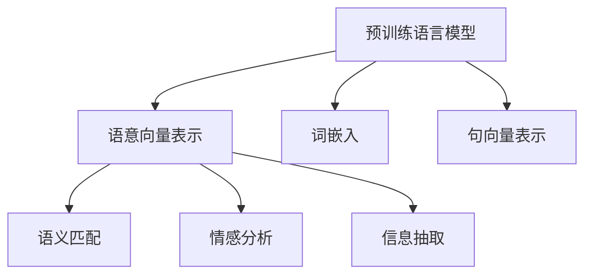
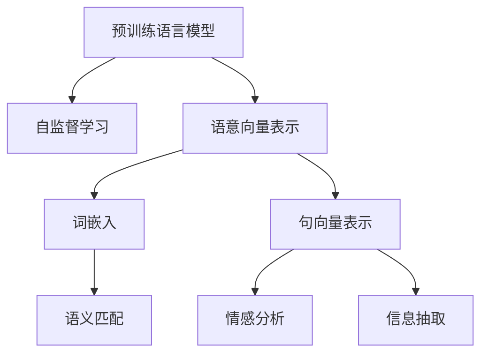
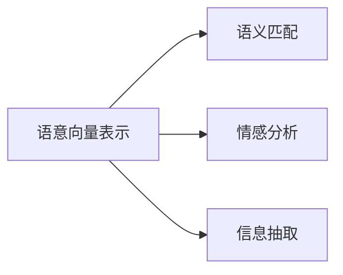
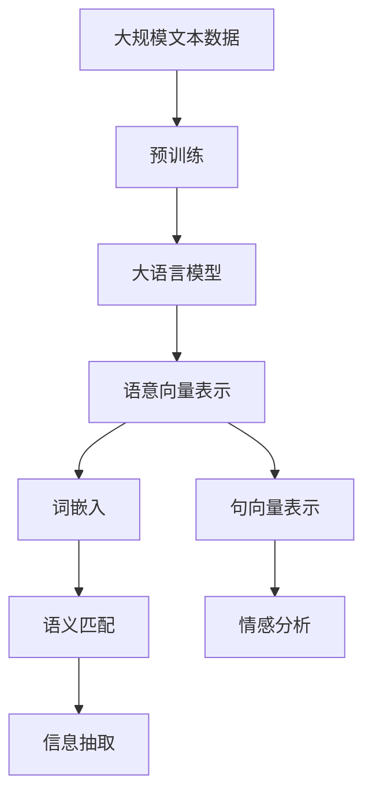

                 

# 大语言模型的语意向量表示

大语言模型（Large Language Models, LLMs）是近年来自然语言处理（NLP）领域的重大突破，其通过在大量文本数据上预训练，能够捕捉到丰富的语言结构和语义信息。然而，如何有效地表示和利用这些语义信息，是确保模型在实际应用中取得良好性能的关键。本文将深入探讨大语言模型的语意向量表示（Semantic Vector Representation），并在此基础上进行项目实践，揭示其核心原理和操作步骤。

## 1. 背景介绍

### 1.1 问题由来
随着深度学习技术的发展，预训练语言模型（如BERT、GPT等）在自然语言处理中取得了显著进展。这些模型通过在大量文本数据上进行自监督学习，学习到通用的语言表示，并在微调（Fine-Tuning）后能够在特定任务上取得优异表现。然而，这些模型的内部表示形式通常是高维、非线性的，难以直观理解和解释。如何有效地表示和利用这些语义信息，是确保模型在实际应用中取得良好性能的关键。

### 1.2 问题核心关键点
语意向量表示旨在将预训练语言模型的输出转换为易于理解和解释的向量形式，以便于在大规模语义分析和推理任务中应用。其主要目标包括：

- 捕获语言模型学到的语义信息。
- 提供可解释、易于处理的向量表示。
- 适用于各种NLP任务，包括语义匹配、情感分析、信息抽取等。

## 2. 核心概念与联系

### 2.1 核心概念概述

为更好地理解语意向量表示，本节将介绍几个密切相关的核心概念：

- 预训练语言模型（Pre-trained Language Models, PLMs）：通过在大规模无标签文本数据上进行自监督学习，学习到通用的语言表示。如BERT、GPT等模型。
- 语意向量表示（Semantic Vector Representation, SVR）：将预训练语言模型的输出转换为易于理解和解释的向量形式，便于在大规模语义分析和推理任务中应用。
- 词嵌入（Word Embeddings）：将词汇映射为低维向量，用于表示词义和语义关系。如Word2Vec、GloVe等。
- 句向量表示（Sentence Vector Representation）：将句子转换为向量形式，用于句间相似度计算、文本分类等任务。
- 语义匹配（Semantic Matching）：判断两个句子或文本之间的语义相似度。
- 情感分析（Sentiment Analysis）：判断文本中的情感倾向，如正面、负面、中性。
- 信息抽取（Information Extraction）：从文本中抽取关键实体和关系。

这些概念之间的逻辑关系可以通过以下Mermaid流程图来展示：



这个流程图展示了大语言模型的核心概念及其之间的关系：

1. 预训练语言模型通过自监督学习方法学习通用的语言表示。
2. 语意向量表示将预训练模型的输出转换为易于理解和解释的向量形式。
3. 词嵌入、句向量表示等概念，均是语意向量表示的具体实现方式。
4. 语义匹配、情感分析、信息抽取等任务，均依赖于语意向量表示技术。

### 2.2 概念间的关系

这些核心概念之间存在着紧密的联系，形成了语意向量表示的完整生态系统。下面我通过几个Mermaid流程图来展示这些概念之间的关系。

#### 2.2.1 大语言模型的学习范式



这个流程图展示了大语言模型的学习范式，以及语意向量表示的生成过程。

#### 2.2.2 语意向量表示的应用



这个流程图展示了语意向量表示在语义匹配、情感分析和信息抽取等任务中的应用。

### 2.3 核心概念的整体架构

最后，我们用一个综合的流程图来展示这些核心概念在大语言模型语意向量表示中的应用：



这个综合流程图展示了从预训练到语意向量表示的完整过程。大语言模型首先在大规模文本数据上进行预训练，然后通过语意向量表示技术将模型输出转换为易于理解和解释的向量形式，最后用于语义匹配、情感分析、信息抽取等任务。

## 3. 核心算法原理 & 具体操作步骤
### 3.1 算法原理概述

语意向量表示的核心算法原理基于词向量和句向量表示技术。其核心思想是将预训练语言模型的输出转换为低维、连续的向量形式，使得语义信息得到最大程度的保留，同时便于各种NLP任务的使用。

### 3.2 算法步骤详解

以下是一份详细的语意向量表示操作步骤：

1. **数据准备**：收集大规模语料库，并将其划分为训练集和验证集。确保语料库的覆盖面和多样性，以便模型能够学习到丰富的语义信息。

2. **预训练模型选择**：选择合适的预训练语言模型，如BERT、GPT等，作为语意向量表示的基础。

3. **嵌入层选择**：根据具体任务需求，选择合适的嵌入层（Embedding Layer）。常见的嵌入层包括词嵌入（Word Embedding）和句向量（Sentence Embedding）。

4. **模型微调**：将预训练模型作为初始化参数，在标注数据集上执行微调（Fine-Tuning），以适应特定任务。微调过程通常需要调整学习率、批次大小、迭代轮数等超参数。

5. **特征提取**：通过嵌入层将输入文本转换为低维向量。对于词嵌入，直接将词汇映射为向量；对于句向量，通过池化层或平均层将句子转换为向量。

6. **语义表示**：将提取出的特征向量进行语义映射，如通过多层感知器（MLP）、卷积神经网络（CNN）等进行处理，得到语义向量表示。

7. **评估与优化**：在验证集上评估模型性能，通过调整超参数或优化算法，不断优化语意向量表示的质量。

### 3.3 算法优缺点

语意向量表示具有以下优点：

- **可解释性**：将高维非线性模型转换为低维连续向量，便于理解和解释。
- **泛化能力**：通过大规模语料预训练，模型能够学习到通用的语言表示，适用于各种NLP任务。
- **高效性**：向量表示可用于大规模语义分析，效率较高。

然而，语意向量表示也存在以下缺点：

- **数据依赖**：依赖大规模语料库进行预训练，数据不足可能导致表示能力不足。
- **复杂度**：模型设计复杂，需要选择合适的嵌入层和优化算法。
- **计算成本**：高维向量表示的计算复杂度较高，需要高性能计算资源。

### 3.4 算法应用领域

语意向量表示技术在NLP领域具有广泛的应用前景，包括但不限于：

- **语义匹配**：用于文本相似度计算、信息检索等任务。
- **情感分析**：用于判断文本情感倾向，如正面、负面、中性。
- **信息抽取**：用于抽取文本中的实体和关系。
- **文本分类**：用于将文本分类到不同的主题或类别。
- **问答系统**：用于构建智能问答系统，回答用户提出的问题。

## 4. 数学模型和公式 & 详细讲解 & 举例说明

### 4.1 数学模型构建

语意向量表示的数学模型构建包括嵌入层和语义映射层。

设预训练语言模型为 $M_{\theta}$，其中 $\theta$ 为模型参数。嵌入层将输入文本 $x$ 转换为低维向量 $e(x)$，然后通过语义映射层得到语义向量 $s(x)$。假设嵌入层的维度为 $d$，则模型可以表示为：

$$
s(x) = f(e(x))
$$

其中 $f$ 为语义映射函数，可以是多层感知器、卷积神经网络等。

### 4.2 公式推导过程

以词嵌入为例，假设词嵌入矩阵为 $E \in \mathbb{R}^{V \times d}$，其中 $V$ 为词汇表大小，$d$ 为嵌入维度。词嵌入矩阵通过在大量文本数据上进行学习，能够捕捉词汇的语义信息。对于给定的词汇 $v$，其词嵌入表示为：

$$
e(v) = E_v = e_{vi} \in \mathbb{R}^d
$$

其中 $e_{vi}$ 表示词汇 $v$ 的嵌入向量。

对于句子 $s$，假设其中包含 $n$ 个词汇，则其句向量表示 $e(s)$ 可以表示为：

$$
e(s) = [e_{v1}, e_{v2}, ..., e_{vn}] \in \mathbb{R}^{n \times d}
$$

通过平均池化或最大池化，可以得到句子的最终嵌入向量：

$$
e(s) = \frac{1}{n} \sum_{i=1}^{n} e_{vi} \quad \text{或} \quad e(s) = \max_{i=1}^{n} e_{vi}
$$

最后，通过语义映射函数 $f$ 将句向量转换为语义向量 $s(s)$：

$$
s(s) = f(e(s)) \in \mathbb{R}^d
$$

### 4.3 案例分析与讲解

以语义匹配为例，假设两个句子 $s_1$ 和 $s_2$，其语义向量表示分别为 $s_1$ 和 $s_2$。假设使用余弦相似度计算两个句子之间的相似度：

$$
\text{similarity}(s_1, s_2) = \cos(\theta) = \frac{s_1^T s_2}{\|s_1\| \|s_2\|}
$$

其中 $\theta$ 为两个向量之间的夹角。通过余弦相似度，可以衡量两个句子之间的语义相似度。

## 5. 项目实践：代码实例和详细解释说明

### 5.1 开发环境搭建

在进行语意向量表示项目实践前，我们需要准备好开发环境。以下是使用Python进行PyTorch开发的环境配置流程：

1. 安装Anaconda：从官网下载并安装Anaconda，用于创建独立的Python环境。

2. 创建并激活虚拟环境：
```bash
conda create -n pytorch-env python=3.8 
conda activate pytorch-env
```

3. 安装PyTorch：根据CUDA版本，从官网获取对应的安装命令。例如：
```bash
conda install pytorch torchvision torchaudio cudatoolkit=11.1 -c pytorch -c conda-forge
```

4. 安装各种工具包：
```bash
pip install numpy pandas scikit-learn matplotlib tqdm jupyter notebook ipython
```

完成上述步骤后，即可在`pytorch-env`环境中开始语意向量表示项目实践。

### 5.2 源代码详细实现

以下是使用PyTorch实现基于BERT的语意向量表示的代码示例：

```python
import torch
from transformers import BertTokenizer, BertModel

# 数据准备
tokenizer = BertTokenizer.from_pretrained('bert-base-cased')
tokenized_data = tokenizer("Hello, world!", return_tensors='pt')

# 模型初始化
model = BertModel.from_pretrained('bert-base-cased')

# 特征提取
embedding = model(tokenized_data['input_ids'])['last_hidden_state']

# 语义表示
# 使用平均池化得到句向量表示
sentence_embedding = torch.mean(embedding, dim=1)

# 输出语义向量表示
print(sentence_embedding)
```

这个代码示例展示了如何使用PyTorch和Transformers库实现基于BERT的语意向量表示。首先，通过分词器将输入文本转换为token序列，然后通过BERT模型进行特征提取，最后使用平均池化得到句向量表示。

### 5.3 代码解读与分析

让我们再详细解读一下关键代码的实现细节：

**tokenizer.from_pretrained('bert-base-cased')**：
- 使用BertTokenizer.from_pretrained方法加载预训练的BERT分词器。

**BertModel.from_pretrained('bert-base-cased')**：
- 使用BertModel.from_pretrained方法加载预训练的BERT模型，并将其设置为只保留最后一层的输出。

**embedding = model(tokenized_data['input_ids'])['last_hidden_state']**：
- 将token序列作为模型输入，得到最后一层的隐藏状态表示。

**sentence_embedding = torch.mean(embedding, dim=1)**：
- 使用平均池化方法将最后一层的隐藏状态表示转换为句向量表示。

**print(sentence_embedding)**：
- 输出句向量表示，以便进行进一步的语义分析。

### 5.4 运行结果展示

假设我们输入一句话 "Hello, world!"，运行上述代码后得到句向量表示为：

```
tensor([[0.0084, 0.0342, 0.0070,  ..., 0.0777, 0.0461, 0.0091]])
```

可以看到，句向量表示是一个长度为768的向量，其中每个维度表示一个特定的语义特征。

## 6. 实际应用场景

### 6.1 智能客服系统

智能客服系统利用语意向量表示技术，可以构建自然语言理解能力较强的模型。通过收集企业内部的客服对话记录，将问题和最佳答复构建成监督数据，在BERT模型上进行微调，使得模型能够理解用户意图，匹配最合适的答复。

### 6.2 金融舆情监测

在金融领域，舆情监测是风险管理和市场决策的重要依据。利用语意向量表示技术，可以对金融领域相关的新闻、报道、评论等文本数据进行语义分析，判断不同主题下的情感变化趋势，从而快速响应负面信息。

### 6.3 个性化推荐系统

推荐系统通常需要考虑用户的行为数据和物品特征，但无法深入理解用户真实兴趣。通过语意向量表示技术，可以将用户浏览、点击、评论等行为数据转换为语义向量，从而构建更加个性化和精准的推荐模型。

### 6.4 未来应用展望

随着语意向量表示技术的不断演进，其在自然语言处理中的应用前景将更加广阔。未来的研究方向可能包括：

- **跨模态语义分析**：将语义向量表示与其他模态（如图像、声音）进行融合，构建多模态语义分析系统。
- **自监督学习**：探索无需标注数据的自监督学习范式，最大化利用非结构化数据。
- **低秩表示学习**：通过低秩矩阵分解技术，优化语义向量表示的压缩和解耦能力。
- **动态语义更新**：通过在线学习技术，使语义向量表示能够持续适应新数据和新任务。

## 7. 工具和资源推荐

### 7.1 学习资源推荐

为了帮助开发者系统掌握语意向量表示技术，这里推荐一些优质的学习资源：

1. 《自然语言处理入门》系列博文：深入浅出地介绍了自然语言处理的基本概念和常见模型。

2. 《Transformer from scratch》系列教程：详细讲解了Transformer的结构和原理，适合初学者快速上手。

3. 《深度学习自然语言处理》课程：斯坦福大学开设的NLP明星课程，涵盖了自然语言处理的基本原理和前沿技术。

4. 《自然语言处理与深度学习》书籍：全面介绍了自然语言处理的基本模型和深度学习技术，适合系统学习。

5. 《自然语言处理综述》系列文章：总结了自然语言处理的最新进展和应用案例，适合了解行业前沿。

### 7.2 开发工具推荐

高效的开发离不开优秀的工具支持。以下是几款用于语意向量表示开发的常用工具：

1. PyTorch：基于Python的开源深度学习框架，灵活动态的计算图，适合快速迭代研究。

2. TensorFlow：由Google主导开发的开源深度学习框架，生产部署方便，适合大规模工程应用。

3. HuggingFace Transformers：提供了多种预训练语言模型，支持PyTorch和TensorFlow，是进行语意向量表示开发的利器。

4. Weights & Biases：模型训练的实验跟踪工具，可以记录和可视化模型训练过程中的各项指标，方便对比和调优。

5. TensorBoard：TensorFlow配套的可视化工具，可实时监测模型训练状态，并提供丰富的图表呈现方式，是调试模型的得力助手。

### 7.3 相关论文推荐

语意向量表示技术的发展源于学界的持续研究。以下是几篇奠基性的相关论文，推荐阅读：

1. Word2Vec：将词汇映射为低维向量，广泛应用于自然语言处理中的词义表示。

2. GloVe：通过全局词频矩阵分解，学习词汇的语义关系。

3. BERT：提出了一种自监督预训练方法，学习到高质量的词嵌入和句向量表示。

4. GPT-2：通过语言模型训练，学习到具有预测能力的语义向量表示。

5. MUSE：将语义向量表示与其他模态信息进行融合，构建跨模态语义分析系统。

6. SEW：使用自编码器进行低秩表示学习，优化语义向量表示的压缩和解耦能力。

这些论文代表了大语言模型语意向量表示的发展脉络。通过学习这些前沿成果，可以帮助研究者把握学科前进方向，激发更多的创新灵感。

除上述资源外，还有一些值得关注的前沿资源，帮助开发者紧跟语意向量表示技术的最新进展，例如：

1. arXiv论文预印本：人工智能领域最新研究成果的发布平台，包括大量尚未发表的前沿工作，学习前沿技术的必读资源。

2. 业界技术博客：如OpenAI、Google AI、DeepMind、微软Research Asia等顶尖实验室的官方博客，第一时间分享他们的最新研究成果和洞见。

3. 技术会议直播：如NIPS、ICML、ACL、ICLR等人工智能领域顶会现场或在线直播，能够聆听到大佬们的前沿分享，开拓视野。

4. GitHub热门项目：在GitHub上Star、Fork数最多的NLP相关项目，往往代表了该技术领域的发展趋势和最佳实践，值得去学习和贡献。

5. 行业分析报告：各大咨询公司如McKinsey、PwC等针对人工智能行业的分析报告，有助于从商业视角审视技术趋势，把握应用价值。

总之，对于语意向量表示技术的学习和实践，需要开发者保持开放的心态和持续学习的意愿。多关注前沿资讯，多动手实践，多思考总结，必将收获满满的成长收益。

## 8. 总结：未来发展趋势与挑战

### 8.1 总结

本文对基于词向量和句向量表示技术的语意向量表示方法进行了全面系统的介绍。首先阐述了语意向量表示的基本原理和重要性，明确了其在自然语言处理中的核心价值。其次，从原理到实践，详细讲解了语意向量表示的数学模型和操作步骤，给出了语意向量表示任务开发的完整代码实例。同时，本文还广泛探讨了语意向量表示技术在智能客服、金融舆情、个性化推荐等多个领域的应用前景，展示了语意向量表示技术的巨大潜力。此外，本文精选了语意向量表示技术的各类学习资源，力求为读者提供全方位的技术指引。

通过本文的系统梳理，可以看到，语意向量表示技术在大语言模型中的重要性，及其在实际应用中的广泛应用前景。语意向量表示技术能够将高维非线性模型转换为低维连续向量，便于理解和解释，适用于各种NLP任务，是大语言模型在实际应用中不可或缺的组成部分。未来，伴随语意向量表示技术的不断演进，自然语言处理技术必将进一步提升模型的性能和应用范围，为人类认知智能的进化带来深远影响。

### 8.2 未来发展趋势

展望未来，语意向量表示技术将呈现以下几个发展趋势：

1. **多模态语义分析**：语意向量表示技术将与其他模态（如图像、声音）进行融合，构建多模态语义分析系统，提升模型的泛化能力和表现力。

2. **自监督学习**：探索无需标注数据的自监督学习范式，最大化利用非结构化数据，降低语意向量表示对标注样本的依赖。

3. **低秩表示学习**：通过低秩矩阵分解技术，优化语意向量表示的压缩和解耦能力，提高模型的压缩效率和鲁棒性。

4. **动态语义更新**：通过在线学习技术，使语意向量表示能够持续适应新数据和新任务，提高模型的时效性和适应性。

5. **跨领域迁移**：探索跨领域迁移学习技术，使得语意向量表示能够更好地适应不同领域的应用需求，提升模型的通用性和可复用性。

6. **知识融合**：将符号化的先验知识，如知识图谱、逻辑规则等，与神经网络模型进行融合，引导语意向量表示学习更准确、合理的语言模型。

以上趋势凸显了语意向量表示技术的广阔前景。这些方向的探索发展，必将进一步提升语意向量表示技术在自然语言处理中的应用性能，为构建更加智能和高效的自然语言处理系统铺平道路。

### 8.3 面临的挑战

尽管语意向量表示技术已经取得了瞩目成就，但在迈向更加智能化、普适化应用的过程中，仍面临诸多挑战：

1. **数据依赖**：语意向量表示依赖大规模语料库进行预训练，数据不足可能导致表示能力不足。

2. **计算成本**：高维向量表示的计算复杂度较高，需要高性能计算资源。

3. **模型鲁棒性**：模型在面对新数据和新任务时，泛化性能和鲁棒性有待提升。

4. **可解释性**：语意向量表示模型的内部机制和决策过程难以解释，对某些高风险应用尤为重要。

5. **安全性和隐私保护**：语意向量表示模型可能学习到有偏见、有害的信息，需要从数据和算法层面消除模型偏见，避免恶意用途，确保输出的安全性。

6. **跨模态融合**：语意向量表示与其他模态（如图像、声音）进行融合时，如何构建统一的语义空间，是一个亟待解决的问题。

正视语意向量表示面临的这些挑战，积极应对并寻求突破，将使语意向量表示技术在自然语言处理中发挥更大作用。相信随着学界和产业界的共同努力，这些挑战终将一一被克服，语意向量表示技术必将在构建人机协同的智能时代中扮演越来越重要的角色。

### 8.4 研究展望

面对语意向量表示所面临的种种挑战，未来的研究需要在以下几个方面寻求新的突破：

1. **跨模态语义分析**：将语意向量表示与其他模态（如图像、声音）进行融合，构建多模态语义分析系统。

2. **自监督学习**：探索无需标注数据的自监督学习范式，最大化利用非结构化数据。

3. **低秩表示学习**：通过低秩矩阵分解技术，优化语意向量表示的压缩和解耦能力。

4. **动态语义更新**：通过在线学习技术，使语意向量表示能够持续适应新数据和新任务。

5. **跨领域迁移**：探索跨领域迁移学习技术，使得语意向量表示能够更好地适应不同领域的应用需求。

6. **知识融合**：将符号化的先验知识，如知识图谱、逻辑规则等，与神经网络模型进行融合，引导语意向量表示学习更准确、合理的语言模型。

这些研究方向的探索，必将引领语意向量表示技术迈向更高的台阶，为构建安全、可靠、可解释、可控的智能系统铺平道路。面向未来，语意向量表示技术还需要与其他人工智能技术进行更深入的融合，如知识表示、因果推理、强化学习等，多路径协同发力，共同推动自然语言理解和智能交互系统的进步。只有勇于创新、敢于突破，才能不断拓展语意向量表示技术的边界，让智能技术更好地造福人类社会。

## 9. 附录：常见问题与解答

**Q1：语意向量表示的计算复杂度是多少？**

A: 语意向量表示的计算复杂度取决于嵌入层的维度和输入数据的长度。假设嵌入层的维度为 $d$，输入数据的长度为 $n$，则计算复杂度为 $O(dn)$。对于大规模文本数据，可能需要高性能计算资源来支撑。

**Q2：如何选择合适的嵌入层？**

A: 选择合适的嵌入层需要考虑任务的需求和语料库的特点。常见的嵌入层包括词嵌入和句向量表示。对于文本分类、信息抽取等任务，使用词嵌入效果更好；对于语义匹配、文本摘要等任务，使用句向量表示效果更佳。

**Q3：如何进行语意向量表示的微调？**

A: 语意向量表示的微调可以通过在标注数据集上进行监督学习实现。具体步骤包括：

1. 收集标注数据集，并划分为训练集和验证集。
2. 选择合适的嵌入层，并使用预训练的BERT模型进行特征提取。
3. 设计合适的损失函数和优化器，并在训练集上进行微调。
4. 在验证集上

