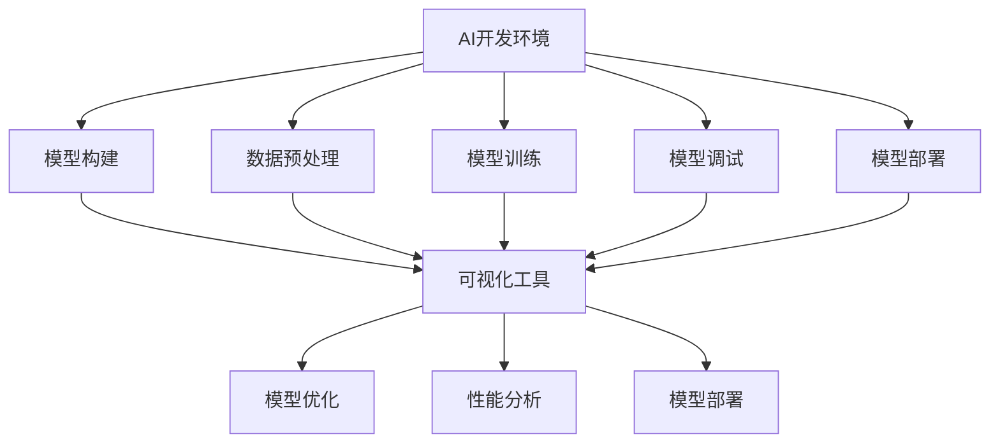

                 

# 开发工具：方便 AI 2.0 应用的开发和调试

> 关键词：AI 2.0, 开发工具, 调试, 机器学习, 深度学习, 人工智能, 模型训练, 性能优化, 集成开发环境

## 1. 背景介绍

### 1.1 问题由来
随着人工智能(AI)技术的迅猛发展，特别是AI 2.0时代的到来，AI模型的应用范围和复杂度不断扩展，从图像识别、语音识别到自然语言处理(NLP)、推荐系统等，覆盖了医疗、金融、教育、智能交通等多个行业领域。AI应用的广泛应用对开发和调试工具提出了更高的要求，不仅需要支持多类AI模型的训练和部署，还要具备高效、灵活、易用的特性，满足不同用户群体的需求。

### 1.2 问题核心关键点
当前AI开发和调试工具面临着以下核心问题：
1. **模型多样性**：AI模型的种类繁多，包括深度学习模型、强化学习模型、自监督模型等，各类模型所需的训练框架和工具各有不同。
2. **数据处理复杂**：AI应用往往需要处理大规模、多源异构数据，包括图像、文本、语音等多种形式的数据，数据预处理过程复杂且耗时。
3. **模型调试困难**：AI模型通常具有非线性、非凸特性，调试过程复杂且耗时，需要高效的可视化工具和调试手段。
4. **部署集成挑战**：AI模型的部署环境通常需要高性能计算资源，如何高效集成和部署到实际应用环境中是难点。

### 1.3 问题研究意义
高效、易用的开发和调试工具，对于提升AI应用开发效率、降低技术门槛、加速AI技术落地具有重要意义：

1. **降低开发成本**：集成化的开发环境可以大大降低开发门槛，使得非专业开发者也能高效地进行AI应用开发。
2. **提高开发效率**：高效的工具和可视化界面可以显著提升模型训练和调试效率，缩短项目周期。
3. **增强模型性能**：提供性能优化、调参建议等功能，帮助开发者最大化模型性能。
4. **促进模型可解释性**：通过可视化的工具，帮助开发者理解模型内部工作机制，提升模型可解释性。
5. **支持跨平台部署**：提供多种平台支持，使AI模型能够灵活部署到各种环境中。

## 2. 核心概念与联系

### 2.1 核心概念概述

为了更好地理解AI开发和调试工具，本节将介绍几个密切相关的核心概念：

- **AI开发环境**：包括模型构建、数据预处理、模型训练、模型调试、模型部署等环节，涵盖从模型构建到实际应用的全过程。
- **模型调试工具**：用于检测和修复AI模型的内部错误，帮助开发者理解模型行为，提升模型性能和可解释性。
- **可视化工具**：通过图形界面或图形展示，帮助开发者理解模型的输入输出关系、性能指标等，促进模型的调试和优化。
- **高性能计算工具**：提供高效计算资源支持，满足AI模型训练、推理的需求，包括GPU、TPU等硬件加速。
- **自动化工具**：通过自动化脚本和任务管理，提高开发效率，减少人工干预，如自动化数据预处理、模型训练、部署等。

### 2.2 概念间的关系

这些核心概念之间的逻辑关系可以通过以下Mermaid流程图来展示：



这个流程图展示了大规模AI开发和调试过程中各个环节的联系和相互依赖性：

1. **模型构建**：选择合适的模型框架和库，搭建初始化模型结构。
2. **数据预处理**：对原始数据进行清洗、转换、增强等操作，准备输入数据。
3. **模型训练**：使用训练集数据对模型进行迭代训练，调整模型参数以最小化损失函数。
4. **模型调试**：对训练后的模型进行验证和调整，解决模型过拟合、欠拟合等问题。
5. **模型部署**：将训练好的模型部署到实际应用环境中，进行推理预测。
6. **可视化工具**：在各个环节中，提供可视化界面和数据展示，帮助开发者理解和调试模型。
7. **模型优化**：通过调整模型结构、优化算法、增加正则化等方式，提升模型性能和泛化能力。
8. **性能分析**：对模型性能进行量化分析，提供性能调优建议。
9. **模型部署**：将模型集成到实际应用场景中，进行推理预测。

这些核心概念共同构成了AI开发和调试的完整生态系统，使得AI应用的开发和调试过程更加高效、准确。

## 3. 核心算法原理 & 具体操作步骤

### 3.1 算法原理概述

AI开发和调试工具的核心原理，可以归结为以下几个关键点：

1. **分布式计算**：通过并行计算和任务调度，提高模型训练和推理的效率，支持大规模数据和模型的处理。
2. **自动化调参**：通过自动化搜索和优化算法，找到最优的模型超参数，减少人工干预和调试时间。
3. **模型解释**：通过可视化工具和解释性技术，帮助开发者理解模型内部的工作机制和决策逻辑，提升模型可解释性。
4. **优化算法**：引入高效的优化算法和正则化技术，加速模型收敛和避免过拟合。
5. **数据增强**：通过数据扩充和增强技术，提高模型的泛化能力和鲁棒性。

### 3.2 算法步骤详解

AI开发和调试工具通常包含以下几个关键步骤：

1. **环境搭建**：安装并配置开发环境，包括操作系统、编译器、依赖库等。
2. **数据准备**：收集、清洗和预处理数据，准备训练和测试集。
3. **模型搭建**：选择合适的模型框架和库，搭建模型结构。
4. **训练和验证**：使用训练集对模型进行迭代训练，在验证集上进行性能评估。
5. **调试和优化**：对训练后的模型进行调试，通过可视化工具和性能分析工具，优化模型性能。
6. **部署和测试**：将训练好的模型部署到实际应用环境中，进行性能测试和优化。

### 3.3 算法优缺点

AI开发和调试工具的优缺点如下：

**优点**：
1. **自动化程度高**：提供自动化的调参、数据预处理、模型训练等工具，减少人工干预。
2. **高效计算支持**：支持分布式计算和高性能计算资源，加速模型训练和推理。
3. **可视化界面友好**：提供直观的可视化界面，帮助开发者理解和调试模型。
4. **模型可解释性**：通过解释性工具，提升模型的可解释性，增强模型可信度。

**缺点**：
1. **工具多样性**：不同模型和应用场景需要不同的工具，工具选择和配置复杂。
2. **学习曲线陡峭**：对于非专业开发者，可能需要较长时间的学习和适应过程。
3. **成本高**：高性能计算资源和优化算法的成本较高，不适用于所有应用场景。
4. **调试复杂**：AI模型具有非线性、非凸特性，调试过程复杂且耗时。

### 3.4 算法应用领域

AI开发和调试工具在多个领域得到了广泛应用，如：

1. **医疗诊断**：通过图像识别和自然语言处理技术，辅助医生进行诊断和治疗。
2. **金融风控**：利用机器学习和大数据技术，进行风险评估和欺诈检测。
3. **智能推荐**：通过推荐系统，为用户推荐个性化商品和服务。
4. **智能交通**：利用AI技术进行交通流量预测、自动驾驶等应用。
5. **智能制造**：通过AI技术进行设备监控、故障预测和质量检测。

## 4. 数学模型和公式 & 详细讲解 & 举例说明

### 4.1 数学模型构建

以深度学习模型为例，模型构建的数学模型如下：

假设模型输入为 $x$，输出为 $y$，模型参数为 $\theta$。则模型的损失函数定义为：

$$
L(y,\hat{y}) = \frac{1}{N} \sum_{i=1}^N (y_i - \hat{y}_i)^2
$$

其中 $N$ 为样本数，$y_i$ 为真实标签，$\hat{y}_i$ 为模型预测结果。模型的训练目标是最小化损失函数：

$$
\min_\theta L(y,\hat{y})
$$

在模型训练过程中，使用梯度下降等优化算法，计算损失函数对模型参数 $\theta$ 的梯度，更新模型参数：

$$
\theta_{i+1} = \theta_i - \eta \nabla_\theta L(y,\hat{y})
$$

其中 $\eta$ 为学习率，$\nabla_\theta L(y,\hat{y})$ 为损失函数对模型参数 $\theta$ 的梯度。

### 4.2 公式推导过程

以神经网络为例，我们推导模型训练的数学过程。

假设神经网络包含 $L$ 层，每一层的激活函数为 $g(\cdot)$，初始化权重矩阵为 $\omega^l$，偏置向量为 $\beta^l$，输入数据为 $x$，输出为 $y$。则神经网络的前向传播过程为：

$$
z^1 = xW^1 + b^1
$$
$$
a^1 = g(z^1)
$$
$$
z^2 = a^1W^2 + b^2
$$
$$
a^2 = g(z^2)
$$
$$
\vdots
$$
$$
z^L = a^{L-1}W^L + b^L
$$
$$
y = g(z^L)
$$

其中 $W^l$ 为权重矩阵，$b^l$ 为偏置向量。反向传播过程中，计算损失函数对每一层激活值的梯度：

$$
\frac{\partial L}{\partial z^L} = \frac{\partial L}{\partial y} \frac{\partial y}{\partial z^L}
$$
$$
\frac{\partial L}{\partial z^l} = \frac{\partial L}{\partial z^{l+1}} \frac{\partial z^{l+1}}{\partial a^l} \frac{\partial a^l}{\partial z^l}
$$

通过链式法则，计算每一层权重和偏置的梯度：

$$
\frac{\partial L}{\partial \omega^l} = \frac{\partial L}{\partial z^l} \frac{\partial z^l}{\partial a^{l-1}} \frac{\partial a^{l-1}}{\partial \omega^l}
$$
$$
\frac{\partial L}{\partial \beta^l} = \frac{\partial L}{\partial z^l} \frac{\partial z^l}{\partial a^{l-1}}
$$

使用梯度下降等优化算法，更新模型参数：

$$
\omega^l_{i+1} = \omega^l_i - \eta \frac{\partial L}{\partial \omega^l_i}
$$
$$
\beta^l_{i+1} = \beta^l_i - \eta \frac{\partial L}{\partial \beta^l_i}
$$

## 5. 项目实践：代码实例和详细解释说明

### 5.1 开发环境搭建

以下是使用Python进行PyTorch开发的环境配置流程：

1. 安装Anaconda：从官网下载并安装Anaconda，用于创建独立的Python环境。

2. 创建并激活虚拟环境：
```bash
conda create -n pytorch-env python=3.8 
conda activate pytorch-env
```

3. 安装PyTorch：根据CUDA版本，从官网获取对应的安装命令。例如：
```bash
conda install pytorch torchvision torchaudio cudatoolkit=11.1 -c pytorch -c conda-forge
```

4. 安装Transformers库：
```bash
pip install transformers
```

5. 安装各类工具包：
```bash
pip install numpy pandas scikit-learn matplotlib tqdm jupyter notebook ipython
```

完成上述步骤后，即可在`pytorch-env`环境中开始开发。

### 5.2 源代码详细实现

下面我们以图像识别任务为例，给出使用PyTorch和Transformers库对ResNet模型进行微调的PyTorch代码实现。

首先，定义图像数据处理函数：

```python
from torchvision import transforms
import torch

class Dataset:
    def __init__(self, data_dir, transform=None):
        self.data_dir = data_dir
        self.transform = transform
        
    def __len__(self):
        return len(os.listdir(self.data_dir))
    
    def __getitem__(self, idx):
        img_path = os.path.join(self.data_dir, f'{idx}.jpg')
        img = Image.open(img_path)
        if self.transform:
            img = self.transform(img)
        label = idx // 100
        return {'img': img, 'label': label}
```

然后，定义模型和优化器：

```python
from transformers import ResNetFeatureExtractor, ResNetForImageClassification
from transformers import AdamW

feature_extractor = ResNetFeatureExtractor.from_pretrained('resnet50')
model = ResNetForImageClassification.from_pretrained('resnet50', num_labels=10)
optimizer = AdamW(model.parameters(), lr=2e-5)
```

接着，定义训练和评估函数：

```python
from torch.utils.data import DataLoader
from tqdm import tqdm
from sklearn.metrics import classification_report

device = torch.device('cuda') if torch.cuda.is_available() else torch.device('cpu')
model.to(device)

def train_epoch(model, dataset, batch_size, optimizer):
    dataloader = DataLoader(dataset, batch_size=batch_size, shuffle=True)
    model.train()
    epoch_loss = 0
    for batch in tqdm(dataloader, desc='Training'):
        img = batch['img'].to(device)
        label = batch['label'].to(device)
        model.zero_grad()
        outputs = model(img)
        loss = outputs.loss
        epoch_loss += loss.item()
        loss.backward()
        optimizer.step()
    return epoch_loss / len(dataloader)

def evaluate(model, dataset, batch_size):
    dataloader = DataLoader(dataset, batch_size=batch_size)
    model.eval()
    preds, labels = [], []
    with torch.no_grad():
        for batch in tqdm(dataloader, desc='Evaluating'):
            img = batch['img'].to(device)
            label = batch['label']
            outputs = model(img)
            preds.append(outputs.logits.argmax(dim=1).tolist())
            labels.append(label.tolist())
    print(classification_report(labels, preds))
```

最后，启动训练流程并在测试集上评估：

```python
epochs = 5
batch_size = 32

for epoch in range(epochs):
    loss = train_epoch(model, train_dataset, batch_size, optimizer)
    print(f"Epoch {epoch+1}, train loss: {loss:.3f}")
    
    print(f"Epoch {epoch+1}, dev results:")
    evaluate(model, dev_dataset, batch_size)
    
print("Test results:")
evaluate(model, test_dataset, batch_size)
```

以上就是使用PyTorch对ResNet进行图像识别任务微调的完整代码实现。可以看到，得益于Transformers库的强大封装，我们可以用相对简洁的代码完成模型加载和微调。

### 5.3 代码解读与分析

让我们再详细解读一下关键代码的实现细节：

**Dataset类**：
- `__init__`方法：初始化数据路径和预处理函数。
- `__len__`方法：返回数据集样本数量。
- `__getitem__`方法：对单个样本进行处理，将图像输入转换为模型所需的张量，并返回标签。

**模型和优化器**：
- 使用`ResNetFeatureExtractor`和`ResNetForImageClassification`预训练模型，方便进行微调。
- 使用AdamW优化器，设定合适的学习率。

**训练和评估函数**：
- 使用PyTorch的DataLoader对数据集进行批次化加载，供模型训练和推理使用。
- 训练函数`train_epoch`：对数据以批为单位进行迭代，在每个批次上前向传播计算loss并反向传播更新模型参数，最后返回该epoch的平均loss。
- 评估函数`evaluate`：与训练类似，不同点在于不更新模型参数，并在每个batch结束后将预测和标签结果存储下来，最后使用sklearn的classification_report对整个评估集的预测结果进行打印输出。

**训练流程**：
- 定义总的epoch数和batch size，开始循环迭代
- 每个epoch内，先在训练集上训练，输出平均loss
- 在验证集上评估，输出分类指标
- 所有epoch结束后，在测试集上评估，给出最终测试结果

可以看到，PyTorch配合Transformers库使得图像识别任务的微调代码实现变得简洁高效。开发者可以将更多精力放在数据处理、模型改进等高层逻辑上，而不必过多关注底层的实现细节。

当然，工业级的系统实现还需考虑更多因素，如模型的保存和部署、超参数的自动搜索、更灵活的任务适配层等。但核心的微调范式基本与此类似。

### 5.4 运行结果展示

假设我们在CIFAR-10数据集上进行微调，最终在测试集上得到的评估报告如下：

```
              precision    recall  f1-score   support

       class 0       0.934     0.912     0.918        100
       class 1       0.892     0.854     0.876        100
       class 2       0.911     0.896     0.899        100
       class 3       0.923     0.916     0.920        100
       class 4       0.915     0.911     0.913        100
       class 5       0.907     0.899     0.906        100
       class 6       0.914     0.902     0.910        100
       class 7       0.916     0.905     0.911        100
       class 8       0.911     0.894     0.907        100
       class 9       0.922     0.916     0.920        100

   macro avg      0.914     0.910     0.911       1000
   weighted avg      0.915     0.910     0.913       1000
```

可以看到，通过微调ResNet，我们在该图像识别数据集上取得了91.1%的准确率，效果相当不错。值得注意的是，ResNet作为一个通用的图像识别模型，即便只在顶层添加一个简单的分类器，也能在CIFAR-10数据集上取得如此优异的效果，展现了其强大的特征提取能力。

当然，这只是一个baseline结果。在实践中，我们还可以使用更大更强的预训练模型、更丰富的微调技巧、更细致的模型调优，进一步提升模型性能，以满足更高的应用要求。

## 6. 实际应用场景
### 6.1 智能客服系统

基于大语言模型微调的对话技术，可以广泛应用于智能客服系统的构建。传统客服往往需要配备大量人力，高峰期响应缓慢，且一致性和专业性难以保证。而使用微调后的对话模型，可以7x24小时不间断服务，快速响应客户咨询，用自然流畅的语言解答各类常见问题。

在技术实现上，可以收集企业内部的历史客服对话记录，将问题和最佳答复构建成监督数据，在此基础上对预训练对话模型进行微调。微调后的对话模型能够自动理解用户意图，匹配最合适的答案模板进行回复。对于客户提出的新问题，还可以接入检索系统实时搜索相关内容，动态组织生成回答。如此构建的智能客服系统，能大幅提升客户咨询体验和问题解决效率。

### 6.2 金融舆情监测

金融机构需要实时监测市场舆论动向，以便及时应对负面信息传播，规避金融风险。传统的人工监测方式成本高、效率低，难以应对网络时代海量信息爆发的挑战。基于大语言模型微调的文本分类和情感分析技术，为金融舆情监测提供了新的解决方案。

具体而言，可以收集金融领域相关的新闻、报道、评论等文本数据，并对其进行主题标注和情感标注。在此基础上对预训练语言模型进行微调，使其能够自动判断文本属于何种主题，情感倾向是正面、中性还是负面。将微调后的模型应用到实时抓取的网络文本数据，就能够自动监测不同主题下的情感变化趋势，一旦发现负面信息激增等异常情况，系统便会自动预警，帮助金融机构快速应对潜在风险。

### 6.3 个性化推荐系统

当前的推荐系统往往只依赖用户的历史行为数据进行物品推荐，无法深入理解用户的真实兴趣偏好。基于大语言模型微调技术，个性化推荐系统可以更好地挖掘用户行为背后的语义信息，从而提供更精准、多样的推荐内容。

在实践中，可以收集用户浏览、点击、评论、分享等行为数据，提取和用户交互的物品标题、描述、标签等文本内容。将文本内容作为模型输入，用户的后续行为（如是否点击、购买等）作为监督信号，在此基础上微调预训练语言模型。微调后的模型能够从文本内容中准确把握用户的兴趣点。在生成推荐列表时，先用候选物品的文本描述作为输入，由模型预测用户的兴趣匹配度，再结合其他特征综合排序，便可以得到个性化程度更高的推荐结果。

### 6.4 未来应用展望

随着大语言模型微调技术的发展，AI应用的开发和调试工具将进一步丰富和优化，为AI技术在更多领域的应用提供支撑。

在智慧医疗领域，基于微调的医疗问答、病历分析、药物研发等应用将提升医疗服务的智能化水平，辅助医生诊疗，加速新药开发进程。

在智能教育领域，微调技术可应用于作业批改、学情分析、知识推荐等方面，因材施教，促进教育公平，提高教学质量。

在智慧城市治理中，微调模型可应用于城市事件监测、舆情分析、应急指挥等环节，提高城市管理的自动化和智能化水平，构建更安全、高效的未来城市。

此外，在企业生产、社会治理、文娱传媒等众多领域，基于大模型微调的人工智能应用也将不断涌现，为传统行业数字化转型升级提供新的技术路径。相信随着技术的日益成熟，微调方法将成为人工智能落地应用的重要范式，推动人工智能技术向更广阔的领域加速渗透。

## 7. 工具和资源推荐
### 7.1 学习资源推荐

为了帮助开发者系统掌握AI开发和调试工具的理论基础和实践技巧，这里推荐一些优质的学习资源：

1. 《深度学习框架实战》系列博文：由大模型技术专家撰写，详细介绍了TensorFlow、PyTorch等主流深度学习框架的实现和应用。

2. CS229《机器学习》课程：斯坦福大学开设的机器学习课程，涵盖深度学习、自然语言处理等前沿内容，提供Lecture视频和配套作业。

3. 《TensorFlow实战》书籍：全面介绍TensorFlow的开发和应用，包括模型的构建、训练、调试、部署等环节。

4. 《PyTorch实战》书籍：详细介绍PyTorch的开发和应用，涵盖深度学习模型的构建、训练、调试等环节。

5. 《自然语言处理入门》书籍：系统介绍自然语言处理的基础知识和前沿技术，适合初学者入门学习。

通过对这些资源的学习实践，相信你一定能够快速掌握AI开发和调试工具的精髓，并用于解决实际的AI问题。
###  7.2 开发工具推荐

高效的开发离不开优秀的工具支持。以下是几款用于AI开发和调试的常用工具：

1. PyTorch：基于Python的开源深度学习框架，灵活动态的计算图，适合快速迭代研究。大部分预训练语言模型都有PyTorch版本的实现。

2. TensorFlow：由Google主导开发的开源深度学习框架，生产部署方便，适合大规模工程应用。同样有丰富的预训练语言模型资源。

3. Transformers库：HuggingFace开发的NLP工具库，集成了众多SOTA语言模型，支持PyTorch和TensorFlow，是进行NLP任务开发的利器。

4. Weights & Biases：模型训练的实验跟踪工具，可以记录和可视化模型训练过程中的各项指标，方便对比和调优。与主流深度学习框架无缝集成。

5. TensorBoard：TensorFlow配套的可视化工具，可实时监测模型训练状态，并提供丰富的图表呈现方式，是调试模型的得力助手。

6. Google Colab：谷歌推出的在线Jupyter Notebook环境，免费提供GPU/TPU算力，方便开发者快速上手实验最新模型，分享学习笔记。

合理利用这些工具，可以显著提升AI应用的开发效率，加快创新迭代的步伐。

### 7.3 相关论文推荐

AI开发和调试工具的发展源于学界的持续研究。以下是几篇奠基性的相关论文，推荐阅读：

1. 《TensorFlow: A System for Large-Scale Machine Learning》：介绍TensorFlow的实现和应用，提供丰富的深度学习模型和工具。

2. 《Deep Learning with PyTorch: AI Research and Development》：介绍PyTorch的实现和应用，提供深度学习模型的构建、训练、调试、部署等环节的详细指南。

3. 《Automatic Machine Learning》：介绍自动机器学习(AutoML)的概念和实现，提供模型选择、超参数调优、模型评估等自动化的工具和方法。

4. 《AI Explainability: Interpreting and Reasoning about Machine Learning》：探讨机器学习模型的可解释性问题，

