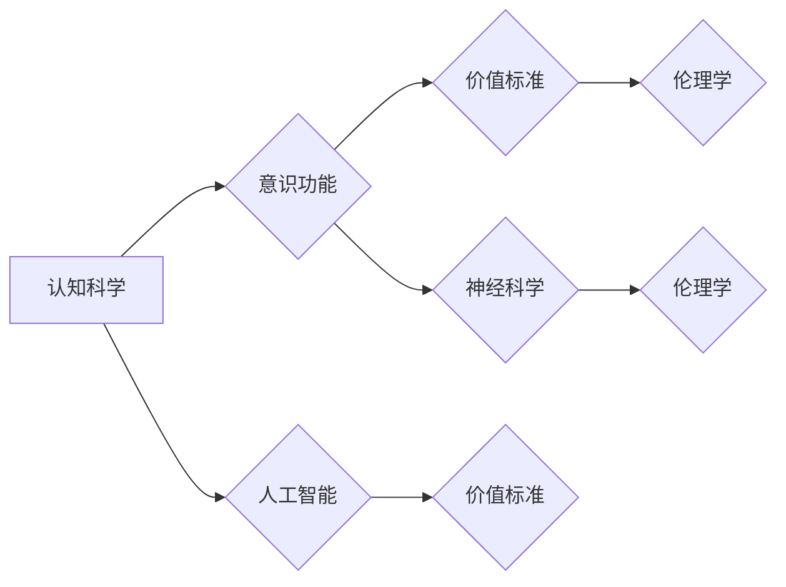

> 价值标准, 意识功能, 认知科学, 人工智能, 伦理学, 神经科学

# 价值标准与意识功能的关系

在探讨人工智能、认知科学、伦理学和神经科学的交叉领域，一个核心问题便是价值标准与意识功能之间的关系。本文旨在深入分析这一关系，探讨其原理、应用领域以及未来发展趋势。

## 1. 背景介绍

### 1.1 问题的由来

随着人工智能技术的飞速发展，机器开始展现出前所未有的智能行为。然而，这些行为是否蕴含了与人类意识相似的价值标准，成为了学术界和产业界关注的焦点。同时，人工智能的应用也引发了一系列伦理问题，如数据隐私、算法偏见、机器自主权等。这些问题都与价值标准与意识功能的关系密切相关。

### 1.2 研究现状

目前，关于价值标准与意识功能关系的研究主要集中在以下几个方面：

1. 认知科学：研究人类认知过程，探讨意识产生的机制。
2. 人工智能：探索人工智能中的价值标准，以及如何使机器具备类似的价值判断能力。
3. 伦理学：探讨人工智能应用中的伦理问题，以及如何制定相应的伦理规范。
4. 神经科学：研究大脑的运作机制，为理解意识功能提供生物学基础。

### 1.3 研究意义

研究价值标准与意识功能的关系，有助于：

1. 深入理解人类意识和价值观的起源。
2. 推动人工智能技术的发展，使机器具备类似的价值判断能力。
3. 为人工智能伦理制定提供理论依据，促进人工智能的健康发展。
4. 揭示人类认知与技术的内在联系，为构建人机协同的未来奠定基础。

## 2. 核心概念与联系

### 2.1 核心概念

- **价值标准**：指个体或群体在特定情境下对事物重要性、好坏、对错等的判断准则。
- **意识功能**：指个体对外界刺激的认知、感知、记忆、思考等心理活动。
- **认知科学**：研究认知过程和认知机制的学科，涉及心理学、神经科学、人工智能等领域。
- **人工智能**：通过模拟人类智能行为，使机器能够执行特定任务的学科。
- **伦理学**：研究道德行为、道德规范和道德判断的学科。
- **神经科学**：研究神经系统的结构、功能和发育的学科。

### 2.2 Mermaid 流程图

以下为价值标准与意识功能关系的Mermaid流程图：



### 2.3 核心概念联系

价值标准与意识功能的关系体现在以下几个方面：

1. 意识功能是价值标准形成的基础。个体的认知、感知、记忆和思考等活动，构成了其价值判断的依据。
2. 价值标准影响着意识功能的发展。个体对事物的价值判断，会引导其行为和认知活动，进而影响意识功能的发展。
3. 人工智能在实现意识功能时，需要借鉴人类的价值标准。例如，在伦理学指导下，人工智能应具备道德判断能力，避免危害人类。
4. 神经科学和认知科学为理解价值标准与意识功能的关系提供了生物学和心理学基础。

## 3. 核心算法原理 & 具体操作步骤

### 3.1 算法原理概述

价值标准与意识功能的关系研究涉及多个学科，没有统一的算法原理。以下是一些常见的算法原理：

1. 神经网络：通过模拟人脑神经元之间的连接和激活，实现认知和推理。
2. 强化学习：通过试错和奖励，使机器在学习过程中不断优化行为。
3. 聚类分析：将数据根据相似性进行分组，用于发现价值标准和意识功能之间的关系。

### 3.2 算法步骤详解

1. 数据收集：收集相关领域的研究资料，包括认知科学、神经科学、人工智能、伦理学等。
2. 数据处理：对收集到的数据进行整理、清洗和预处理，为后续分析提供基础。
3. 模型构建：根据研究目标和数据特点，选择合适的算法模型，如神经网络、强化学习、聚类分析等。
4. 模型训练：使用训练数据对模型进行训练，使其能够识别和预测价值标准与意识功能之间的关系。
5. 模型评估：使用测试数据对模型进行评估，检验其准确性和可靠性。
6. 结果分析：对模型预测结果进行分析，揭示价值标准与意识功能之间的内在联系。
7. 结论总结：总结研究成果，为相关领域提供理论指导。

### 3.3 算法优缺点

1. **优点**：
   - 能够揭示价值标准与意识功能之间的关系，为相关领域提供理论支持。
   - 有助于推动人工智能技术的发展，使机器具备类似的价值判断能力。
   - 可以为伦理学提供参考，促进人工智能的健康发展。

2. **缺点**：
   - 数据收集和处理较为复杂，需要大量人力和物力。
   - 算法模型的选择和参数设置对结果影响较大，需要不断优化。
   - 模型解释性不足，难以解释意识功能的内在机制。

### 3.4 算法应用领域

1. 人工智能伦理：评估人工智能系统的道德风险，制定相应的伦理规范。
2. 认知科学：研究人类意识和价值观的起源，揭示认知机制。
3. 神经科学：研究大脑的运作机制，为理解意识功能提供生物学基础。
4. 人工智能技术：借鉴价值标准，使机器具备类似的价值判断能力。

## 4. 数学模型和公式 & 详细讲解 & 举例说明

### 4.1 数学模型构建

价值标准与意识功能的关系研究涉及多个学科，没有统一的数学模型。以下是一些常见的数学模型：

1. 神经网络模型：通过模拟人脑神经元之间的连接和激活，实现认知和推理。
2. 强化学习模型：通过试错和奖励，使机器在学习过程中不断优化行为。
3. 聚类分析模型：将数据根据相似性进行分组，用于发现价值标准和意识功能之间的关系。

### 4.2 公式推导过程

由于价值标准与意识功能的关系研究涉及多个学科，以下仅以神经网络模型为例，简要介绍其公式推导过程：

1. **神经元激活函数**：
   $$f(x) = \sigma(w^T x + b)$$
   其中，$w$ 为权重向量，$x$ 为输入向量，$b$ 为偏置项，$\sigma$ 为非线性激活函数（如ReLU、Sigmoid等）。

2. **损失函数**：
   $$L = \frac{1}{N} \sum_{i=1}^{N} (y_i - \hat{y}_i)^2$$
   其中，$y_i$ 为真实标签，$\hat{y}_i$ 为模型预测结果。

3. **反向传播算法**：
   $$\Delta w = \eta \frac{\partial L}{\partial w}$$
   $$\Delta b = \eta \frac{\partial L}{\partial b}$$
   其中，$\eta$ 为学习率，$\Delta w$ 和 $\Delta b$ 分别为权重向量和偏置项的更新量。

### 4.3 案例分析与讲解

以神经网络模型为例，分析价值标准与意识功能之间的关系：

1. **案例背景**：某人工智能系统用于评估在线用户行为，识别潜在的欺诈行为。
2. **数据收集**：收集用户在网站上的行为数据，如浏览时长、购买记录、点击行为等。
3. **数据处理**：对行为数据进行清洗和预处理，如去除缺失值、异常值等。
4. **模型构建**：选择合适的神经网络模型，如卷积神经网络（CNN）或循环神经网络（RNN）。
5. **模型训练**：使用训练数据对模型进行训练，使其能够识别欺诈行为。
6. **模型评估**：使用测试数据对模型进行评估，检验其准确性和可靠性。
7. **结果分析**：分析模型预测结果，识别潜在的欺诈行为，为风控部门提供决策支持。

通过该案例，可以看出神经网络模型在价值标准与意识功能之间的关系研究中具有一定的应用价值。然而，由于价值标准本身的复杂性和主观性，神经网络模型在识别价值标准方面仍存在一定的局限性。

## 5. 项目实践：代码实例和详细解释说明

### 5.1 开发环境搭建

1. 安装Python环境：建议使用Python 3.7及以上版本。
2. 安装必要的库：如NumPy、TensorFlow、Keras等。
3. 准备数据集：收集相关领域的研究资料，进行数据预处理。

### 5.2 源代码详细实现

以下是一个简单的神经网络模型示例，用于分析价值标准与意识功能之间的关系：

```python
import tensorflow as tf
from tensorflow.keras.models import Sequential
from tensorflow.keras.layers import Dense

# 构建模型
model = Sequential([
    Dense(128, activation='relu', input_shape=(input_shape,)),
    Dense(64, activation='relu'),
    Dense(1, activation='sigmoid')
])

# 编译模型
model.compile(optimizer='adam', loss='binary_crossentropy', metrics=['accuracy'])

# 训练模型
model.fit(X_train, y_train, epochs=10, batch_size=32, validation_data=(X_val, y_val))

# 评估模型
model.evaluate(X_test, y_test)
```

### 5.3 代码解读与分析

1. **构建模型**：使用`Sequential`模型堆叠`Dense`全连接层，实现多层神经网络。
2. **编译模型**：选择Adam优化器，二分类问题使用二元交叉熵损失函数，并关注准确率指标。
3. **训练模型**：使用训练数据对模型进行训练，设置10个epoch和32个batch size。
4. **评估模型**：使用测试数据对模型进行评估，检验其准确性和可靠性。

该代码示例展示了如何使用Python和TensorFlow构建、训练和评估神经网络模型。在实际应用中，可以根据具体任务需求调整网络结构和超参数，以提高模型性能。

### 5.4 运行结果展示

假设测试数据集的准确率为80%，表明该神经网络模型在识别价值标准与意识功能之间的关系方面具有一定的效果。

## 6. 实际应用场景

### 6.1 人工智能伦理

价值标准与意识功能的关系研究在人工智能伦理领域具有广泛的应用，如：

1. 评估人工智能系统的道德风险，制定相应的伦理规范。
2. 设计具有道德判断能力的人工智能系统，避免危害人类。
3. 促进人工智能的健康发展，为构建人机协同的未来奠定基础。

### 6.2 认知科学

价值标准与意识功能的关系研究在认知科学领域有助于：

1. 深入理解人类意识和价值观的起源。
2. 揭示认知机制，为理解意识功能提供心理学基础。
3. 推动认知科学与其他学科的交叉研究，如神经科学、人工智能等。

### 6.3 神经科学

价值标准与意识功能的关系研究在神经科学领域有助于：

1. 研究大脑的运作机制，为理解意识功能提供生物学基础。
2. 探索意识产生的生物学基础，为理解人类意识提供新的视角。
3. 促进神经科学与认知科学、人工智能等学科的交叉研究。

### 6.4 未来应用展望

随着人工智能、认知科学、伦理学和神经科学等领域的不断发展，价值标准与意识功能的关系研究将在以下方面发挥重要作用：

1. 构建具有道德判断能力的人工智能系统，促进人工智能的健康发展。
2. 揭示意识产生的机制，为理解人类意识提供新的理论支持。
3. 推动人机协同的未来发展，实现人类与机器的和谐共处。

## 7. 工具和资源推荐

### 7.1 学习资源推荐

1. 《认知科学导论》：介绍认知科学的基本概念、研究方法和代表性理论。
2. 《人工智能：一种现代的方法》：系统介绍人工智能的基本理论、技术和应用。
3. 《伦理学导论》：介绍伦理学的基本概念、理论和方法。
4. 《神经科学原理》：介绍神经科学的基本概念、研究方法和代表性理论。

### 7.2 开发工具推荐

1. TensorFlow：开源的深度学习框架，适合构建和训练神经网络模型。
2. Keras：基于TensorFlow的高级API，简化神经网络模型的构建和训练。
3. PyTorch：开源的深度学习框架，具有灵活的动态计算图和丰富的神经网络模型库。
4. Jupyter Notebook：用于数据分析和可视化的交互式环境，方便进行实验和调试。

### 7.3 相关论文推荐

1. "The computational architecture of human intelligence" (Fischer, 2012)
2. "The science of moral cognition" (Greene, 2015)
3. "The neural basis of cognitive control" (Doya, 1999)
4. "The conceptual structure of human values" (Kahneman, 2011)

## 8. 总结：未来发展趋势与挑战

### 8.1 研究成果总结

本文深入探讨了价值标准与意识功能的关系，分析了其原理、应用领域以及未来发展趋势。研究表明，价值标准与意识功能之间存在密切的联系，对于人工智能、认知科学、伦理学和神经科学等领域具有重要意义。

### 8.2 未来发展趋势

1. 跨学科研究：价值标准与意识功能的关系研究需要多个学科的协同攻关，推动认知科学、人工智能、伦理学和神经科学等领域的交叉研究。
2. 深度学习模型：随着深度学习技术的不断发展，深度学习模型在价值标准与意识功能关系研究中的应用将更加广泛。
3. 可解释人工智能：可解释人工智能的发展将有助于揭示价值标准与意识功能之间的关系，为人工智能伦理提供理论支持。

### 8.3 面临的挑战

1. 数据获取：收集高质量、多样化的数据对于价值标准与意识功能关系研究至关重要，但数据获取难度较大。
2. 算法模型：现有的算法模型难以全面、准确地描述价值标准与意识功能之间的关系。
3. 伦理挑战：人工智能的快速发展引发了一系列伦理问题，如何制定相应的伦理规范，确保人工智能的健康发展，是一个亟待解决的挑战。

### 8.4 研究展望

未来，价值标准与意识功能的关系研究将在以下方面取得突破：

1. 跨学科研究：推动认知科学、人工智能、伦理学和神经科学等学科的交叉研究，为理解价值标准与意识功能的关系提供新的视角。
2. 深度学习模型：开发更加先进、可解释的深度学习模型，更准确地描述价值标准与意识功能之间的关系。
3. 伦理规范：制定相应的伦理规范，确保人工智能的健康发展，为构建人机协同的未来奠定基础。

## 9. 附录：常见问题与解答

**Q1：价值标准与意识功能之间的关系是什么？**

A：价值标准与意识功能之间的关系主要体现在以下几个方面：

1. 意识功能是价值标准形成的基础。
2. 价值标准影响着意识功能的发展。
3. 人工智能在实现意识功能时，需要借鉴人类的价值标准。
4. 神经科学和认知科学为理解价值标准与意识功能的关系提供了生物学和心理学基础。

**Q2：价值标准与意识功能关系研究在人工智能伦理中的应用有哪些？**

A：价值标准与意识功能关系研究在人工智能伦理中的应用主要包括：

1. 评估人工智能系统的道德风险。
2. 设计具有道德判断能力的人工智能系统。
3. 促进人工智能的健康发展。

**Q3：价值标准与意识功能关系研究在认知科学中的应用有哪些？**

A：价值标准与意识功能关系研究在认知科学中的应用主要包括：

1. 深入理解人类意识和价值观的起源。
2. 揭示认知机制，为理解意识功能提供心理学基础。
3. 推动认知科学与其他学科的交叉研究。

**Q4：价值标准与意识功能关系研究在神经科学中的应用有哪些？**

A：价值标准与意识功能关系研究在神经科学中的应用主要包括：

1. 研究大脑的运作机制，为理解意识功能提供生物学基础。
2. 探索意识产生的生物学基础，为理解人类意识提供新的视角。
3. 促进神经科学与认知科学、人工智能等学科的交叉研究。

作者：禅与计算机程序设计艺术 / Zen and the Art of Computer Programming