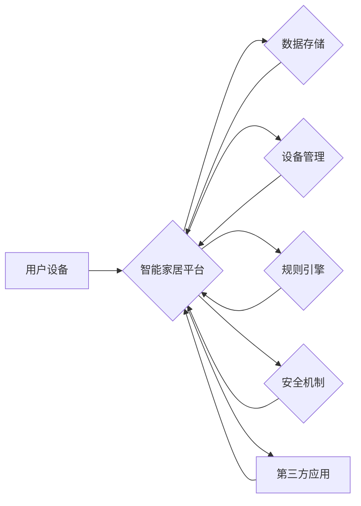

# 基于Java的智能家居设计：云端智能家居平台与Java集成策略

> 关键词：智能家居，Java，云计算，物联网，集成，平台架构，API设计，安全机制，实时通信，性能优化

## 1. 背景介绍

随着物联网技术的飞速发展，智能家居行业正迎来蓬勃发展的机遇。智能家居系统通过将家庭中的各种设备互联，为用户提供舒适、便捷、安全的居住环境。Java作为一款成熟、稳定的编程语言，凭借其跨平台、可扩展、安全性高等优势，成为构建智能家居平台的首选语言之一。本文将探讨基于Java的智能家居设计，重点关注云端智能家居平台与Java的集成策略。

### 1.1 问题的由来

智能家居系统通常包含多个智能设备，如智能门锁、智能空调、智能照明等。这些设备通过物联网技术实现互联，共同构成一个智能家居生态系统。然而，在实际开发过程中，如何实现设备的互联互通、数据共享、统一管理，成为了一个挑战。

### 1.2 研究现状

目前，智能家居平台的设计和开发主要面临以下问题：

- **设备互联互通**：不同厂商的设备采用不同的通信协议和数据格式，导致设备之间难以互联互通。
- **数据安全**：智能家居设备涉及用户隐私和财产安全，数据安全成为首要考虑因素。
- **系统可扩展性**：随着智能家居设备的不断增加，平台需要具备良好的可扩展性，以满足未来需求。
- **性能优化**：智能家居平台需要保证实时性、稳定性，以满足用户对快速响应的需求。

### 1.3 研究意义

本文旨在探讨基于Java的智能家居设计，通过以下方面实现研究意义：

- **促进智能家居设备互联互通**：通过设计统一的API接口，实现不同设备之间的数据交换和互操作。
- **保障数据安全**：采用安全机制，确保用户数据的安全性和隐私性。
- **提升系统可扩展性**：采用模块化设计，方便系统扩展和维护。
- **优化系统性能**：通过优化算法和架构设计，提升系统性能和稳定性。

## 2. 核心概念与联系

### 2.1 核心概念原理

智能家居系统核心概念包括：

- **物联网（IoT）**：将日常物品连接到互联网，实现设备之间的通信和数据交换。
- **云计算**：通过互联网提供动态可伸缩的、按需的网络服务。
- **Java**：一种跨平台的编程语言，具备良好的可扩展性和安全性。

### 2.2 架构的 Mermaid 流程图



### 2.3 核心概念联系

智能家居平台通过物联网技术连接用户设备和云端服务器，实现设备管理、数据存储、规则引擎、安全机制等功能。Java作为开发语言，负责实现平台的核心功能。

## 3. 核心算法原理 & 具体操作步骤

### 3.1 算法原理概述

智能家居平台的核心算法包括：

- **设备通信协议**：定义设备之间的通信规则，实现数据交换。
- **数据存储算法**：存储和管理智能家居数据。
- **规则引擎**：根据预设规则，自动执行特定操作。
- **安全机制**：保障数据安全和用户隐私。

### 3.2 算法步骤详解

#### 3.2.1 设备通信协议

1. **定义通信协议**：选择或设计适合智能家居的通信协议，如CoAP、MQTT等。
2. **实现通信接口**：根据协议规范，实现设备通信接口。
3. **数据格式转换**：将设备原始数据转换为平台通用数据格式。

#### 3.2.2 数据存储算法

1. **数据模型设计**：设计适合智能家居的数据模型，如设备信息、用户信息、设备状态等。
2. **数据库选择**：选择合适的数据库，如MySQL、MongoDB等。
3. **数据存储操作**：实现数据的增删改查操作。

#### 3.2.3 规则引擎

1. **规则定义**：定义规则条件和动作。
2. **规则匹配**：根据预设规则，匹配事件触发条件。
3. **执行动作**：触发相关动作，如设备控制、消息通知等。

#### 3.2.4 安全机制

1. **身份认证**：实现用户登录、设备认证等功能。
2. **数据加密**：对用户数据进行加密存储和传输。
3. **访问控制**：限制用户对数据的访问权限。

### 3.3 算法优缺点

#### 3.3.1 优点

- **标准化**：采用标准化协议和接口，实现设备互联互通。
- **安全性**：采用安全机制，保障数据安全和用户隐私。
- **可扩展性**：采用模块化设计，方便系统扩展和维护。

#### 3.3.2 缺点

- **复杂性**：系统涉及多个模块，开发难度较大。
- **性能瓶颈**：在高并发场景下，系统性能可能成为瓶颈。

### 3.4 算法应用领域

智能家居平台算法适用于以下领域：

- **智能设备管理**：实现设备在线状态监控、远程控制等功能。
- **家庭自动化**：实现自动调节室内温度、湿度、照明等。
- **能源管理**：实现家庭能源消耗监控和优化。
- **安全监控**：实现家庭安全报警、视频监控等功能。

## 4. 数学模型和公式 & 详细讲解 & 举例说明

### 4.1 数学模型构建

智能家居平台涉及多个数学模型，如：

- **设备状态模型**：描述设备运行状态的数学模型。
- **用户行为模型**：描述用户行为的数学模型。
- **规则引擎模型**：描述规则引擎工作原理的数学模型。

### 4.2 公式推导过程

以设备状态模型为例，假设设备状态由温度、湿度、光照等参数表示，则设备状态模型可以表示为：

$$
S(t) = f(T(t), H(t), L(t))
$$

其中，$S(t)$ 表示设备在时间 $t$ 的状态，$T(t)$、$H(t)$、$L(t)$ 分别表示设备在时间 $t$ 的温度、湿度、光照参数。

### 4.3 案例分析与讲解

以智能照明为例，当室内光照低于预设阈值时，系统自动开启照明设备。该案例涉及以下数学模型：

- **光照强度模型**：描述光照强度的数学模型。
- **阈值设置**：设置光照强度阈值。

当光照强度低于阈值时，触发以下动作：

$$
\text{if } L(t) < \text{threshold} \text{ then } \text{turn\_on\_light}(t)
$$

## 5. 项目实践：代码实例和详细解释说明

### 5.1 开发环境搭建

1. **Java开发环境**：安装Java开发工具包（JDK）和集成开发环境（IDE），如IntelliJ IDEA或Eclipse。
2. **数据库**：选择合适的数据库，如MySQL或MongoDB。
3. **开发框架**：选择合适的开发框架，如Spring Boot、MyBatis等。

### 5.2 源代码详细实现

以下是一个简单的Java代码示例，实现设备通信协议和规则引擎：

```java
public class DeviceCommunication {
    // 通信协议实现
    public void communicate(Device device, String command) {
        // 实现设备通信协议
    }
}

public class RuleEngine {
    // 规则引擎实现
    public void executeRule(Rule rule) {
        // 实现规则引擎逻辑
    }
}
```

### 5.3 代码解读与分析

该示例代码展示了设备通信协议和规则引擎的基本实现。`DeviceCommunication` 类负责实现设备通信协议，`RuleEngine` 类负责执行规则引擎逻辑。

### 5.4 运行结果展示

假设用户通过手机APP向智能照明设备发送开启命令，系统将执行以下步骤：

1. 用户通过APP发送开启命令。
2. 平台解析命令，调用 `DeviceCommunication` 类的 `communicate` 方法，向智能照明设备发送开启命令。
3. 设备接收到开启命令后，执行相应操作，如开启照明设备。
4. 平台接收设备反馈，将结果展示给用户。

## 6. 实际应用场景

### 6.1 智能家居平台

智能家居平台可以实现以下功能：

- **设备管理**：实现设备在线状态监控、远程控制、固件升级等功能。
- **数据存储**：存储设备状态、用户行为、规则配置等数据。
- **规则引擎**：根据预设规则，自动执行特定操作。
- **安全机制**：保障数据安全和用户隐私。

### 6.2 能源管理

智能家居平台可以实现以下能源管理功能：

- **能耗监控**：实时监控家庭能耗情况。
- **节能建议**：根据能耗数据，为用户提供节能建议。
- **能源优化**：根据用户需求，自动调整设备运行状态，实现能源优化。

### 6.3 安全监控

智能家居平台可以实现以下安全监控功能：

- **入侵报警**：实现入侵报警功能，保障家庭安全。
- **视频监控**：实现视频监控功能，实时查看家庭情况。
- **异常检测**：实现异常行为检测，如煤气泄漏、火灾等。

## 7. 工具和资源推荐

### 7.1 学习资源推荐

- 《Java核心技术》
- 《Spring Boot实战》
- 《Apache Kafka权威指南》
- 《数据结构与算法分析》

### 7.2 开发工具推荐

- IntelliJ IDEA
- Eclipse
- MySQL
- MongoDB
- Spring Boot

### 7.3 相关论文推荐

- “基于云计算的智能家居平台设计与实现”
- “智能家居系统中数据安全与隐私保护”
- “智能家居平台架构设计研究”

## 8. 总结：未来发展趋势与挑战

### 8.1 研究成果总结

本文探讨了基于Java的智能家居设计，重点关注云端智能家居平台与Java的集成策略。通过对核心概念、算法原理、项目实践的介绍，为智能家居平台的设计和开发提供了参考。

### 8.2 未来发展趋势

1. **人工智能与智能家居的深度融合**：利用人工智能技术，实现智能家居设备的智能识别、智能控制等功能。
2. **边缘计算与云计算的协同**：利用边缘计算技术，实现设备的实时响应和低延迟控制。
3. **区块链技术在智能家居中的应用**：利用区块链技术，保障智能家居设备的数据安全和用户隐私。

### 8.3 面临的挑战

1. **技术融合**：将人工智能、边缘计算、区块链等技术融入智能家居平台，需要解决技术融合问题。
2. **数据安全**：保障智能家居设备的数据安全和用户隐私，需要采取有效的安全措施。
3. **用户体验**：提供良好的用户体验，需要不断优化平台功能和界面设计。

### 8.4 研究展望

未来，智能家居平台将朝着更加智能化、个性化、安全化的方向发展。通过技术创新和产业合作，智能家居将为人们创造更加美好的生活。

## 9. 附录：常见问题与解答

**Q1：为什么选择Java作为智能家居平台开发语言？**

A：Java具有以下优势：
- 跨平台：Java程序可以在任何安装了Java虚拟机的设备上运行。
- 可扩展性：Java支持面向对象编程，易于扩展和维护。
- 安全性：Java具有强大的安全机制，保障数据安全。
- 社区支持：Java拥有庞大的开发者社区，提供丰富的技术支持和资源。

**Q2：如何保障智能家居平台的数据安全？**

A：可以采取以下措施保障数据安全：
- 使用加密算法对数据进行加密存储和传输。
- 实施访问控制，限制用户对数据的访问权限。
- 定期更新系统漏洞，提高系统安全性。

**Q3：智能家居平台如何实现设备互联互通？**

A：可以采用以下措施实现设备互联互通：
- 定义统一的通信协议，实现设备之间的数据交换。
- 使用标准化的API接口，简化设备集成过程。
- 采用模块化设计，方便扩展新的设备类型。

**Q4：智能家居平台的未来发展趋势是什么？**

A：智能家居平台的未来发展趋势包括：
- 人工智能与智能家居的深度融合。
- 边缘计算与云计算的协同。
- 区块链技术在智能家居中的应用。

作者：禅与计算机程序设计艺术 / Zen and the Art of Computer Programming