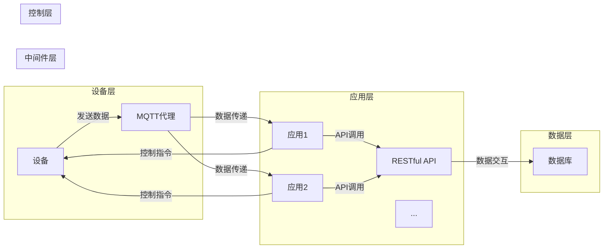

# 基于Java的智能家居设计：让Java成为您智能家居系统的大脑

> 关键词：智能家居，Java，设计架构，物联网，微服务，RESTful API，MQTT，安全性，用户体验

## 1. 背景介绍

随着物联网（IoT）技术的飞速发展，智能家居市场正在迅速扩张。智能家居系统通过将家庭中的各种设备和家电连接到一个统一的网络中，实现了设备间的互联互通，为用户提供了更加便捷、舒适和智能的生活方式。Java作为一门成熟且广泛使用的编程语言，凭借其跨平台、易于开发和维护的特性，成为构建智能家居系统的理想选择。

## 2. 核心概念与联系

### 2.1 核心概念

#### 2.1.1 物联网（IoT）

物联网是指通过信息传感设备，将各种物品连接到互联网上，实现物品与物品、物品与人之间的信息交互和通信的技术。在智能家居系统中，物联网技术是实现设备互联互通的关键。

#### 2.1.2 微服务架构

微服务架构是一种设计架构风格，将单个应用程序开发为一组小型服务，每个服务都在自己的进程中运行，并与轻量级机制（通常是HTTP资源API）进行通信。这种架构风格有助于提高系统的可维护性和可扩展性。

#### 2.1.3 RESTful API

RESTful API是一种基于REST架构风格的网络服务，通过HTTP协议进行通信，使用JSON或XML等格式进行数据交换。RESTful API在智能家居系统中用于设备之间的通信和数据交互。

#### 2.1.4 MQTT

MQTT（Message Queuing Telemetry Transport）是一种轻量级的消息传输协议，适用于带宽有限和延迟敏感的环境。MQTT在智能家居系统中用于设备之间的消息传递和事件通知。

#### 2.1.5 Java

Java是一种跨平台、面向对象的编程语言，具有丰富的库和框架，适用于开发各种规模的应用程序。

### 2.2 架构流程图

以下是基于Java的智能家居系统架构的Mermaid流程图：



## 3. 核心算法原理 & 具体操作步骤

### 3.1 算法原理概述

智能家居系统的核心算法主要涉及以下几个方面：

- 设备控制算法：通过发送指令控制家庭设备，如开关灯、调节温度等。
- 数据处理算法：对传感器收集的数据进行处理和分析，如温度、湿度、光照等。
- 用户界面算法：实现用户与智能家居系统之间的交互，如网页、移动应用等。

### 3.2 算法步骤详解

#### 3.2.1 设备控制算法

1. 用户通过用户界面发送控制指令。
2. 控制层接收指令，并通过MQTT代理将指令发送给目标设备。
3. 设备收到指令后，根据指令执行相应的操作。

#### 3.2.2 数据处理算法

1. 传感器收集数据并上传到MQTT代理。
2. 数据层对数据进行存储和处理。
3. 应用层根据需要查询和处理数据。

#### 3.2.3 用户界面算法

1. 用户通过网页或移动应用与智能家居系统进行交互。
2. 用户界面接收用户输入，并将输入传递给控制层。
3. 控制层根据用户输入发送控制指令，并通过用户界面反馈操作结果。

### 3.3 算法优缺点

#### 3.3.1 优点

- 易于开发：Java语言的易用性和丰富的库使得开发过程更加便捷。
- 跨平台：Java程序可以在不同的操作系统上运行，提高了系统的兼容性。
- 高效性：Java虚拟机（JVM）的优化保证了程序的运行效率。
- 安全性：Java语言具有强大的安全性保障。

#### 3.3.2 缺点

- 内存消耗：Java程序的内存消耗较大，对于资源有限的设备可能不太合适。
- 速度：Java程序的运行速度相对较慢，对于对速度要求较高的应用可能不太适用。

### 3.4 算法应用领域

基于Java的智能家居系统算法可以应用于以下领域：

- 家庭自动化
- 健康监测
- 能源管理
- 安全监控
- 娱乐控制

## 4. 数学模型和公式 & 详细讲解 & 举例说明

### 4.1 数学模型构建

智能家居系统的数学模型主要包括以下几个方面：

- 传感器数据模型：描述传感器收集的数据特征，如温度、湿度、光照等。
- 设备控制模型：描述设备的状态和操作，如开关、调节等。
- 用户行为模型：描述用户的行为模式，如作息时间、活动习惯等。

### 4.2 公式推导过程

以下是一个简单的传感器数据模型的例子，描述了温度随时间的变化：

$$
T(t) = T_0 + k_1 \cdot t + k_2 \cdot \sin(\omega t)
$$

其中，$T(t)$ 为时间 $t$ 时刻的温度，$T_0$ 为初始温度，$k_1$ 和 $k_2$ 为模型参数，$\omega$ 为角频率。

### 4.3 案例分析与讲解

假设我们设计了一个智能家居系统，可以通过手机APP远程控制家中的灯光。以下是该系统的数学模型：

- 设备控制模型：

$$
Device_{on}(t) = \begin{cases} 
1, & \text{if } \text{user\_command}(t) = \text{turn\_on} \\
0, & \text{otherwise} 
\end{cases}
$$

其中，$Device_{on}(t)$ 为时间 $t$ 时刻灯光的开关状态，$\text{user\_command}(t)$ 为时间 $t$ 时刻用户发送的控制指令。

- 用户行为模型：

$$
user\_command(t) = \begin{cases} 
\text{turn\_on}, & \text{if } \text{time}(t) \in [18:00, 22:00] \\
\text{turn\_off}, & \text{otherwise} 
\end{cases}
$$

其中，$user\_command(t)$ 为时间 $t$ 时刻用户发送的控制指令，$\text{time}(t)$ 为时间 $t$ 时刻的实际时间。

通过以上模型，我们可以根据用户的行为模式自动控制家中的灯光。

## 5. 项目实践：代码实例和详细解释说明

### 5.1 开发环境搭建

为了进行智能家居系统开发，我们需要以下开发环境：

- Java开发工具：如Eclipse、IntelliJ IDEA等。
- MQTT客户端：如MQTTClient、Paho MQTT等。
- RESTful API框架：如Spring Boot、JAX-RS等。

### 5.2 源代码详细实现

以下是一个简单的Java MQTT客户端示例，用于连接到MQTT代理并订阅主题：

```java
import org.eclipse.paho.client.mqttv3.MqttClient;
import org.eclipse.paho.client.mqttv3.MqttConnectOptions;
import org.eclipse.paho.client.mqttv3.MqttException;
import org.eclipse.paho.client.mqttv3.IMqttDeliveryToken;
import org.eclipse.paho.client.mqttv3.MqttMessage;
import org.eclipse.paho.client.mqttv3.MqttCallback;

public class MqttClientExample {

    public static void main(String[] args) {
        String broker = "tcp://localhost:1883"; // MQTT代理地址
        String clientId = "JavaClient";
        String topic = "home/light"; // 订阅主题

        MqttConnectOptions options = new MqttConnectOptions();
        options.setCleanSession(true);
        options.setAutomaticReconnect(true);

        try {
            MqttClient client = new MqttClient(broker, clientId);
            client.setCallback(new MqttCallback() {
                public void connectionLost(Throwable cause) {
                    System.out.println("Connection lost");
                }

                public void messageArrived(String topic, MqttMessage message) throws Exception {
                    System.out.println("Received message on topic " + topic + ": " + new String(message.getPayload()));
                }

                public void deliveryComplete(IMqttDeliveryToken token) {
                    System.out.println("Message delivered");
                }
            });

            client.connect(options);
            client.subscribe(topic, 2); // 订阅主题
        } catch (MqttException e) {
            e.printStackTrace();
        }
    }
}
```

### 5.3 代码解读与分析

以上代码使用Paho MQTT客户端库创建了一个MQTT客户端，连接到本地MQTT代理，并订阅了名为`home/light`的主题。当有消息发布到该主题时，客户端会打印出消息内容。

### 5.4 运行结果展示

运行以上代码后，当其他客户端将消息发布到`home/light`主题时，该客户端会打印出消息内容。

## 6. 实际应用场景

基于Java的智能家居系统可以应用于以下实际场景：

- **家庭自动化**：通过手机APP远程控制家中的灯光、空调、窗帘等设备。
- **健康监测**：监测家庭成员的体温、心率等生理指标，并提醒用户关注健康。
- **能源管理**：根据用户的使用习惯自动调节家电的工作状态，降低能源消耗。
- **安全监控**：实时监控家庭安全，并在发生异常时及时报警。
- **娱乐控制**：通过手机APP控制家庭影院、音响等娱乐设备。

## 7. 工具和资源推荐

### 7.1 学习资源推荐

- 《Java核心技术卷I：核心Java语言》
- 《Java核心技术卷II：核心Java类库》
- 《Spring Boot实战》
- 《MQTT实战》
- 《智能家居技术与应用》

### 7.2 开发工具推荐

- Eclipse
- IntelliJ IDEA
- Paho MQTT
- Spring Boot
- JAX-RS

### 7.3 相关论文推荐

- 《基于Java的智能家居系统设计与实现》
- 《智能家居系统中的微服务架构研究》
- 《基于MQTT的智能家居系统设计与实现》

## 8. 总结：未来发展趋势与挑战

### 8.1 研究成果总结

本文介绍了基于Java的智能家居系统设计，从核心概念、算法原理到项目实践，全面阐述了如何使用Java构建智能家居系统。随着物联网技术的不断发展，Java将继续在智能家居领域发挥重要作用。

### 8.2 未来发展趋势

- **更智能的设备控制**：通过人工智能技术，实现设备的自动学习和智能控制。
- **更丰富的用户体验**：开发更加友好、便捷的用户界面，提升用户体验。
- **更安全的数据处理**：加强数据安全保护，防止用户隐私泄露。
- **更开放的生态系统**：构建开放的智能家居生态系统，促进各平台之间的互联互通。

### 8.3 面临的挑战

- **技术挑战**：如何确保智能家居系统的稳定性和安全性。
- **市场挑战**：如何解决智能家居设备的碎片化问题。
- **用户挑战**：如何提高用户对智能家居产品的认知度和接受度。

### 8.4 研究展望

随着技术的不断进步和市场的不断发展，基于Java的智能家居系统将会有更加广阔的应用前景。未来，我们需要关注以下几个方面：

- **技术创新**：探索更加先进的技术，如人工智能、物联网、区块链等，提升智能家居系统的智能化水平。
- **生态建设**：构建开放的智能家居生态系统，促进各平台之间的互联互通。
- **用户体验**：关注用户需求，提升智能家居产品的易用性和用户体验。

## 9. 附录：常见问题与解答

**Q1：Java在智能家居系统中有哪些优势？**

A：Java在智能家居系统中的优势主要体现在以下几个方面：

- **跨平台**：Java程序可以在不同的操作系统上运行，提高了系统的兼容性。
- **易于开发**：Java语言的易用性和丰富的库和框架使得开发过程更加便捷。
- **安全性**：Java语言具有强大的安全性保障，可以有效防止恶意攻击。

**Q2：如何确保智能家居系统的安全性？**

A：确保智能家居系统的安全性需要从以下几个方面入手：

- **数据加密**：对用户数据进行加密存储和传输，防止数据泄露。
- **身份认证**：实现用户身份认证，防止未授权访问。
- **访问控制**：对不同的用户角色设置不同的访问权限。
- **安全审计**：实时监控系统访问日志，及时发现异常行为。

**Q3：如何实现智能家居设备的互联互通？**

A：实现智能家居设备的互联互通需要以下步骤：

- **统一通信协议**：选择通用的通信协议，如MQTT、CoAP等，实现设备之间的互操作性。
- **数据格式标准化**：统一数据格式，如JSON、XML等，方便设备之间的数据交互。
- **平台开放**：构建开放的智能家居平台，鼓励更多设备厂商接入。

**Q4：如何提升智能家居系统的用户体验？**

A：提升智能家居系统的用户体验需要从以下几个方面入手：

- **易用性**：设计简洁直观的用户界面，方便用户操作。
- **个性化**：根据用户需求提供个性化服务。
- **便捷性**：提供多种控制方式，如手机APP、语音控制等。
- **智能性**：通过人工智能技术实现设备的自动学习和智能控制。

作者：禅与计算机程序设计艺术 / Zen and the Art of Computer Programming