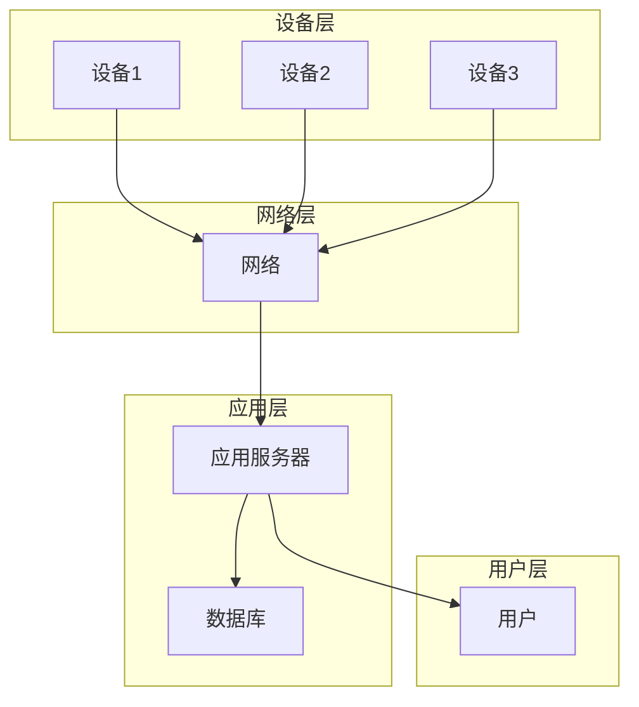

> Java, 智能家居, 系统可靠性, 设计原则, 架构模式, 安全性, 容错性, 可维护性, IoT, Edge Computing

# 基于Java的智能家居设计：通过Java提升智能家居系统的可靠性

智能家居系统正逐渐走进千家万户，为我们的生活带来了便捷和舒适。然而，随着系统复杂性的增加，确保系统的可靠性成为了至关重要的任务。本文将探讨如何利用Java技术提升智能家居系统的可靠性，包括系统设计、核心算法、实践案例以及未来发展趋势。

## 1. 背景介绍

智能家居系统通常由多个智能设备组成，如智能灯泡、智能插座、智能摄像头等，通过物联网（IoT）技术连接到家庭网络，实现远程控制和管理。随着技术的发展，智能家居系统正变得越来越智能化、个性化，但同时也面临着诸多挑战，如安全性、可靠性、可维护性等。

Java作为一门成熟、稳定且功能强大的编程语言，已经广泛应用于企业级应用开发。其跨平台、安全性高、可扩展性强等特点，使其成为智能家居系统开发的理想选择。

## 2. 核心概念与联系

智能家居系统的可靠性主要体现在以下几个方面：

- **安全性**：确保用户数据的安全，防止未授权访问和数据泄露。
- **容错性**：在设备或网络出现故障时，系统能够自动恢复或切换到备用方案。
- **可维护性**：系统易于维护和扩展，方便快速响应市场变化和技术进步。

以下是一个智能家居系统架构的Mermaid流程图，展示了系统的主要组件和它们之间的关系：



在上述流程图中，设备层包括各种智能家居设备，如智能灯泡、智能插座、智能摄像头等；网络层负责设备之间以及设备与服务器之间的通信；应用层包括应用服务器和数据库，负责处理业务逻辑和数据存储；用户层则是与系统交互的用户。

## 3. 核心算法原理 & 具体操作步骤

### 3.1 算法原理概述

智能家居系统的核心算法主要包括：

- **设备控制算法**：根据用户指令和传感器数据控制智能设备的开关、调节等操作。
- **数据加密算法**：对用户数据和设备通信数据进行加密，确保数据安全。
- **容错和故障恢复算法**：在设备或网络出现故障时，自动切换到备用方案或重启设备。

### 3.2 算法步骤详解

**设备控制算法**：

1. 接收用户指令或传感器数据。
2. 根据指令和传感器数据判断设备状态。
3. 通过网络向设备发送控制指令。
4. 监听设备反馈，确认指令执行结果。

**数据加密算法**：

1. 对用户数据和设备通信数据进行加密。
2. 在传输过程中确保加密数据的完整性。
3. 接收方解密数据，获取原始信息。

**容错和故障恢复算法**：

1. 监控设备或网络状态。
2. 在检测到故障时，自动切换到备用方案或重启设备。
3. 通知用户故障情况，并记录故障信息。

### 3.3 算法优缺点

**设备控制算法**：

- **优点**：操作简单，易于实现。
- **缺点**：可能存在误操作的风险。

**数据加密算法**：

- **优点**：确保数据安全，防止数据泄露。
- **缺点**：加密算法的选择和实现需要一定的技术门槛。

**容错和故障恢复算法**：

- **优点**：提高系统可靠性，降低故障率。
- **缺点**：需要额外的资源和技术支持。

### 3.4 算法应用领域

上述算法广泛应用于智能家居系统的各个领域，如智能安防、智能照明、智能温控等。

## 4. 数学模型和公式 & 详细讲解 & 举例说明

智能家居系统的可靠性可以通过以下几个指标来衡量：

- **平均无故障时间（MTBF）**：系统平均运行多长时间出现一次故障。
- **故障率（FIT）**：每1000小时出现故障的次数。
- **故障恢复时间（MTTR）**：系统从故障发生到恢复正常运行所需的时间。

以下是一个智能家居系统的MTBF计算公式：

$$
MTBF = \frac{T}{N}
$$

其中，$T$ 为系统运行的总时间，$N$ 为系统发生的故障次数。

## 5. 项目实践：代码实例和详细解释说明

### 5.1 开发环境搭建

要开发一个智能家居系统，需要以下开发环境：

- 操作系统：Windows、Linux或macOS
- 开发工具：Java开发环境（如Eclipse、IntelliJ IDEA）
- 数据库：MySQL、Oracle或MongoDB
- IoT平台：AWS IoT、Azure IoT、Aliyun IoT

### 5.2 源代码详细实现

以下是一个简单的智能家居系统示例，使用Java语言实现：

```java
public class SmartHomeSystem {
    public static void main(String[] args) {
        // 初始化系统
        System.initialize();

        // 用户登录
        System.login("username", "password");

        // 控制灯光
        Light light = new Light("LivingRoomLight");
        light.turnOn();

        // 控制空调
        AirConditioner ac = new AirConditioner("LivingRoomAC");
        ac.setTemperature(24);
    }
}

class System {
    public static void initialize() {
        // 初始化数据库连接、IoT平台连接等
    }

    public static void login(String username, String password) {
        // 用户登录逻辑
    }
}

class Light {
    private String name;

    public Light(String name) {
        this.name = name;
    }

    public void turnOn() {
        // 控制灯光开启
    }
}

class AirConditioner {
    private String name;
    private int temperature;

    public AirConditioner(String name) {
        this.name = name;
    }

    public void setTemperature(int temperature) {
        this.temperature = temperature;
        // 控制空调温度
    }
}
```

### 5.3 代码解读与分析

上述代码示例展示了智能家居系统的基本结构。`System` 类负责系统初始化、用户登录等通用功能；`Light` 和 `AirConditioner` 类分别代表智能灯泡和空调设备，包含设备名称和控制方法。

### 5.4 运行结果展示

当运行上述代码时，系统将执行以下操作：

1. 初始化系统，建立数据库连接和IoT平台连接。
2. 用户登录，验证用户名和密码。
3. 控制客厅灯光开启。
4. 设置客厅空调温度为24摄氏度。

## 6. 实际应用场景

智能家居系统在实际应用中可以解决以下问题：

- **家庭自动化**：通过智能设备实现家庭设备的自动控制，提高生活便利性。
- **节能降耗**：通过智能化的能源管理，降低能源消耗，实现绿色生活。
- **安全监控**：通过智能摄像头和报警系统，保障家庭安全。
- **健康监测**：通过智能健康设备，实时监测家庭成员的健康状况。

## 7. 工具和资源推荐

### 7.1 学习资源推荐

- 《Java核心技术》
- 《深入理解Java虚拟机》
- 《物联网技术与应用》
- 《智能家居技术与应用》

### 7.2 开发工具推荐

- Eclipse
- IntelliJ IDEA
- MySQL Workbench
- AWS IoT
- Aliyun IoT

### 7.3 相关论文推荐

- **智能家居系统架构设计**：探讨智能家居系统的架构设计原则和最佳实践。
- **物联网安全技术研究**：研究物联网系统的安全性问题和解决方案。
- **智能家居数据分析与应用**：分析智能家居系统中的数据，挖掘潜在价值。

## 8. 总结：未来发展趋势与挑战

### 8.1 研究成果总结

本文介绍了基于Java的智能家居设计，重点阐述了系统可靠性、核心算法、实践案例以及未来发展趋势。通过Java技术，我们可以构建安全、可靠、易维护的智能家居系统，为用户带来更加便捷、舒适的生活体验。

### 8.2 未来发展趋势

未来智能家居系统将朝着以下方向发展：

- **更加智能化**：通过人工智能技术，实现更加智能化的设备控制和场景联动。
- **更加个性化**：根据用户需求，提供更加个性化的智能家居解决方案。
- **更加安全可靠**：加强系统安全，确保用户数据安全和设备稳定运行。

### 8.3 面临的挑战

智能家居系统在发展过程中也面临着以下挑战：

- **安全性**：确保用户数据和设备通信的安全，防止数据泄露和恶意攻击。
- **兼容性**：保证不同设备和平台的兼容性，提供统一的用户界面。
- **隐私保护**：保护用户隐私，防止用户数据被滥用。

### 8.4 研究展望

为了应对上述挑战，未来的研究可以从以下几个方面展开：

- **安全性研究**：研究更加安全的数据加密和通信协议，提高系统的安全性。
- **标准化研究**：制定智能家居系统的标准和规范，提高系统兼容性。
- **隐私保护研究**：研究更加有效的隐私保护技术，保护用户隐私。

## 9. 附录：常见问题与解答

**Q1：智能家居系统需要哪些技术？**

A：智能家居系统需要物联网技术、嵌入式技术、云计算技术、人工智能技术等多种技术。

**Q2：Java是否适合开发智能家居系统？**

A：Java适合开发智能家居系统，因为它具有跨平台、安全性高、可扩展性强等特点。

**Q3：如何保证智能家居系统的安全性？**

A：保证智能家居系统的安全性需要从硬件、软件、网络等多个方面入手，如使用安全的通信协议、加密用户数据、建立安全防护机制等。

**Q4：智能家居系统有哪些应用场景？**

A：智能家居系统的应用场景包括家庭自动化、节能降耗、安全监控、健康监测等。

**Q5：如何选择合适的智能家居设备？**

A：选择合适的智能家居设备需要考虑以下因素：功能、性能、兼容性、安全性、易用性等。

---

作者：禅与计算机程序设计艺术 / Zen and the Art of Computer Programming