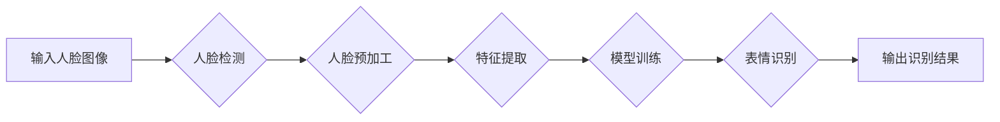

# 基于OpenCV的人脸表情识别系统详细设计与具体代码实现

> 关键词：OpenCV, 人脸识别, 表情识别, 深度学习, 特征提取, 卷积神经网络, 情感分析, 机器学习

## 1. 背景介绍

随着人工智能技术的飞速发展，人脸识别技术在智能监控、智能安防、人机交互等领域得到了广泛的应用。其中，人脸表情识别作为人脸识别的一个重要分支，通过对人脸图像中表情的识别和分析，可以应用于情绪分析、用户行为分析、用户交互等多个方面。OpenCV作为一款功能强大的计算机视觉库，为人脸表情识别系统的开发提供了丰富的工具和函数。本文将详细介绍基于OpenCV的人脸表情识别系统的设计与具体代码实现。

## 2. 核心概念与联系

### 2.1 核心概念

#### 2.1.1 人脸识别

人脸识别是指通过计算机技术和图像处理技术，对采集到的人脸图像进行特征提取、比对和分析，从而识别或验证个人身份的一种技术。

#### 2.1.2 表情识别

表情识别是指通过对人脸图像中表情特征的提取和分析，识别出人脸的喜怒哀乐等情绪状态。

#### 2.1.3 OpenCV

OpenCV（Open Source Computer Vision Library）是一个开源的计算机视觉库，它提供了丰富的计算机视觉算法和函数，包括图像处理、视频处理、特征提取、目标检测等多个方面。

### 2.2 架构流程图



## 3. 核心算法原理 & 具体操作步骤

### 3.1 算法原理概述

人脸表情识别系统通常包含以下步骤：

1. **人脸检测**：使用人脸检测算法从视频流或图像中检测出人脸区域。
2. **人脸预加工**：对人脸区域进行预处理，如归一化、灰度化、滤波等。
3. **特征提取**：使用深度学习或传统机器学习算法提取人脸特征。
4. **模型训练**：使用标注的表情数据训练表情识别模型。
5. **表情识别**：将提取的人脸特征输入训练好的模型，进行表情识别。
6. **输出识别结果**：输出识别的表情结果。

### 3.2 算法步骤详解

#### 3.2.1 人脸检测

人脸检测是表情识别的第一步，常用的算法有Haar特征分类器、深度学习模型等。

- **Haar特征分类器**：使用Haar特征分类器进行人脸检测的步骤如下：

  1. 加载Haar特征分类器模型。
  2. 加载待检测的人脸图像。
  3. 使用Haar特征分类器检测图像中的人脸区域。
  4. 将检测到的人脸区域裁剪出来。

- **深度学习模型**：使用深度学习模型进行人脸检测的步骤如下：

  1. 加载预训练的深度学习模型，如MTCNN、SSD等。
  2. 加载待检测的人脸图像。
  3. 使用深度学习模型检测图像中的人脸区域。
  4. 将检测到的人脸区域裁剪出来。

#### 3.2.2 人脸预加工

人脸预加工的目的是对人脸图像进行标准化处理，以便后续的特征提取。

- **归一化**：将人脸图像的大小调整为固定的尺寸。
- **灰度化**：将彩色图像转换为灰度图像。
- **滤波**：使用滤波器去除图像噪声。

#### 3.2.3 特征提取

特征提取的目的是提取人脸图像的关键特征，常用的方法有深度学习模型和传统机器学习算法。

- **深度学习模型**：使用深度学习模型提取人脸特征的步骤如下：

  1. 加载预训练的深度学习模型，如VGGFace、FaceNet等。
  2. 将人脸图像输入到深度学习模型中。
  3. 提取模型输出的特征向量。

- **传统机器学习算法**：使用传统机器学习算法提取人脸特征的步骤如下：

  1. 使用SIFT、HOG等算法提取人脸图像的特征向量。
  2. 对特征向量进行降维处理。

#### 3.2.4 模型训练

模型训练的目的是训练表情识别模型，常用的模型有支持向量机（SVM）、神经网络等。

- **SVM**：使用SVM进行模型训练的步骤如下：

  1. 准备表情数据集，并标注表情标签。
  2. 使用特征提取步骤中提取的特征向量作为训练数据。
  3. 训练SVM模型。

- **神经网络**：使用神经网络进行模型训练的步骤如下：

  1. 准备表情数据集，并标注表情标签。
  2. 使用特征提取步骤中提取的特征向量作为训练数据。
  3. 训练神经网络模型。

#### 3.2.5 表情识别

表情识别的目的是将提取的人脸特征输入到训练好的模型中，识别出人脸的表情。

- **SVM**：使用SVM进行表情识别的步骤如下：

  1. 将提取的人脸特征输入到训练好的SVM模型中。
  2. 模型输出识别结果。

- **神经网络**：使用神经网络进行表情识别的步骤如下：

  1. 将提取的人脸特征输入到训练好的神经网络模型中。
  2. 模型输出识别结果。

#### 3.2.6 输出识别结果

将识别出的表情结果输出到屏幕或存储设备中。

### 3.3 算法优缺点

#### 3.3.1 优点

- **高精度**：基于深度学习的表情识别模型具有较高的识别精度。
- **鲁棒性**：基于深度学习的表情识别模型对光照、姿态等变化具有一定的鲁棒性。
- **可扩展性**：基于深度学习的表情识别模型可以方便地应用于其他视觉任务。

#### 3.3.2 缺点

- **计算复杂度**：基于深度学习的表情识别模型需要较大的计算资源。
- **数据需求**：需要大量的标注数据来训练模型。

### 3.4 算法应用领域

人脸表情识别系统可以应用于以下领域：

- **智能监控**：识别监控视频中的异常行为，如暴力、斗殴等。
- **人机交互**：根据用户的表情变化进行相应的交互操作。
- **情感分析**：分析用户的情绪状态，为个性化推荐提供依据。
- **医疗诊断**：辅助医生进行情绪障碍等疾病的诊断。

## 4. 数学模型和公式 & 详细讲解 & 举例说明

### 4.1 数学模型构建

#### 4.1.1 卷积神经网络（CNN）

卷积神经网络（Convolutional Neural Network，CNN）是一种深层神经网络，常用于图像识别、图像分类等任务。

#### 4.1.2 支持向量机（SVM）

支持向量机（Support Vector Machine，SVM）是一种常用的二分类模型，通过找到一个最优的超平面，将不同类别的样本分离开来。

### 4.2 公式推导过程

#### 4.2.1 CNN

CNN的数学模型如下：

$$
y = \sigma(W \cdot \theta(x) + b)
$$

其中，$y$ 是输出结果，$W$ 是权重矩阵，$\theta(x)$ 是输入特征，$b$ 是偏置项，$\sigma$ 是激活函数。

#### 4.2.2 SVM

SVM的数学模型如下：

$$
\max_{\theta, \xi} \frac{1}{2} \sum_{i=1}^{N} (\theta^T \theta - \xi_i) - \sum_{i=1}^{N} \xi_i
$$

其中，$\theta$ 是权重向量，$\xi_i$ 是误差项，$N$ 是样本数量。

### 4.3 案例分析与讲解

#### 4.3.1 CNN

以AlexNet为例，其结构如下：

```
[输入] --(卷积层1)--> [激活函数1] --(池化层1)--> [卷积层2] --(激活函数2)--> [池化层2]--> ...
[卷积层N] --(激活函数N)--> [池化层N]--> [全连接层1] --(激活函数N+1)--> [输出层]
```

#### 4.3.2 SVM

以线性SVM为例，其决策函数如下：

$$
y = \text{sign}(\theta^T x + b)
$$

其中，$\theta$ 是权重向量，$b$ 是偏置项，$x$ 是输入特征，$\text{sign}$ 是符号函数。

## 5. 项目实践：代码实例和详细解释说明

### 5.1 开发环境搭建

1. 安装Python和pip。
2. 安装OpenCV库：`pip install opencv-python`。
3. 安装深度学习库：`pip install tensorflow` 或 `pip install pytorch`。

### 5.2 源代码详细实现

以下是一个基于OpenCV和TensorFlow的人脸表情识别系统的简单示例：

```python
import cv2
import tensorflow as tf
from tensorflow.keras.models import load_model

# 加载模型
model = load_model('emotion_model.h5')

# 读取视频流
cap = cv2.VideoCapture(0)

while True:
    # 读取一帧图像
    ret, frame = cap.read()
    
    if not ret:
        break
    
    # 检测人脸
    face_cascade = cv2.CascadeClassifier(cv2.data.haarcascades + 'haarcascade_frontalface_default.xml')
    faces = face_cascade.detectMultiScale(frame, scaleFactor=1.1, minNeighbors=5)
    
    for (x, y, w, h) in faces:
        # 提取人脸区域
        face = frame[y:y+h, x:x+w]
        
        # 缩放人脸图像
        face = cv2.resize(face, (48, 48))
        
        # 转换为浮点型
        face = face.astype('float32')
        
        # 扩展维度
        face = np.expand_dims(face, axis=0)
        
        # 预测表情
        emotion = model.predict(face)
        
        # 显示识别结果
        label = emotion.argmax(axis=-1)
        emotions = ['Angry', 'Disgust', 'Fear', 'Happy', 'Sad', 'Surprise', 'Neutral']
        cv2.putText(frame, emotions[label], (x, y), cv2.FONT_HERSHEY_SIMPLEX, 1, (0, 255, 0), 2)
    
    # 显示图像
    cv2.imshow('Frame', frame)
    
    if cv2.waitKey(1) & 0xFF == ord('q'):
        break

# 释放摄像头和窗口
cap.release()
cv2.destroyAllWindows()
```

### 5.3 代码解读与分析

- **导入库**：导入所需的库，包括OpenCV、TensorFlow等。
- **加载模型**：加载预训练的表情识别模型。
- **读取视频流**：使用OpenCV库读取摄像头或视频文件的实时视频流。
- **检测人脸**：使用Haar特征分类器检测图像中的人脸区域。
- **提取人脸区域**：从图像中裁剪出人脸区域。
- **缩放人脸图像**：将人脸图像缩放为固定的尺寸。
- **预测表情**：将缩放后的人脸图像输入到训练好的模型中，预测表情。
- **显示识别结果**：在图像上显示识别出的表情。

### 5.4 运行结果展示

运行上述代码后，摄像头会实时显示视频流，并在图像上显示识别出的表情。

## 6. 实际应用场景

### 6.1 智能监控

在智能监控领域，人脸表情识别可以用于识别监控视频中的异常行为，如暴力、斗殴等。当检测到异常行为时，系统会自动报警，并记录相关视频信息。

### 6.2 人机交互

在人机交互领域，人脸表情识别可以用于根据用户的表情变化进行相应的交互操作，如根据用户表情调整屏幕亮度、音量等。

### 6.3 情感分析

在情感分析领域，人脸表情识别可以用于分析用户的情绪状态，为个性化推荐提供依据。例如，根据用户观看电影时的情绪变化，推荐相应的电影。

### 6.4 医疗诊断

在医疗诊断领域，人脸表情识别可以用于辅助医生进行情绪障碍等疾病的诊断。

## 7. 工具和资源推荐

### 7.1 学习资源推荐

1. 《OpenCV 4.0计算机视觉算法实战》
2. 《深度学习：原理与实战》
3. 《机器学习实战》

### 7.2 开发工具推荐

1. Python
2. OpenCV
3. TensorFlow或PyTorch

### 7.3 相关论文推荐

1. "Facial Expression Recognition: A Survey" by P. Tattanapant, et al.
2. "Deep Learning for Facial Expression Recognition" by A. Torr, et al.
3. "Facial Expression Recognition with Deep Learning" by Y. Taigman, et al.

## 8. 总结：未来发展趋势与挑战

### 8.1 研究成果总结

基于OpenCV的人脸表情识别系统已经取得了显著的成果，在智能监控、人机交互、情感分析、医疗诊断等领域具有广泛的应用前景。

### 8.2 未来发展趋势

1. **模型轻量化**：为了降低计算复杂度和降低硬件要求，模型轻量化将成为未来的研究热点。
2. **多模态融合**：结合语音、文本等多模态信息进行表情识别，将提高识别的准确性和鲁棒性。
3. **实时性增强**：提高人脸表情识别的实时性，以满足实际应用的需求。

### 8.3 面临的挑战

1. **数据标注**：高质量的数据标注是模型训练的关键，但标注数据获取成本较高。
2. **模型鲁棒性**：提高模型在复杂环境下的鲁棒性，如遮挡、光照变化等。
3. **隐私保护**：人脸表情识别涉及到用户隐私，如何保护用户隐私是一个挑战。

### 8.4 研究展望

未来，人脸表情识别技术将在以下方面取得突破：

1. **模型性能提升**：通过改进模型结构和训练方法，提高识别准确性和鲁棒性。
2. **跨领域应用**：将人脸表情识别技术应用于更多领域，如心理学、教育学等。
3. **个性化服务**：根据用户的情绪状态，提供个性化的服务。

## 9. 附录：常见问题与解答

### 9.1 常见问题

1. **什么是人脸表情识别？**
   人脸表情识别是指通过对人脸图像中表情特征的提取和分析，识别出人脸的喜怒哀乐等情绪状态。

2. **什么是OpenCV？**
   OpenCV是一个开源的计算机视觉库，提供了丰富的计算机视觉算法和函数。

3. **什么是卷积神经网络（CNN）？**
   卷积神经网络（Convolutional Neural Network，CNN）是一种深层神经网络，常用于图像识别、图像分类等任务。

4. **什么是支持向量机（SVM）？**
   支持向量机（Support Vector Machine，SVM）是一种常用的二分类模型，通过找到一个最优的超平面，将不同类别的样本分离开来。

5. **如何提高人脸表情识别的准确性？**
   可以通过以下方法提高人脸表情识别的准确性：
   - 使用高质量的数据集进行训练。
   - 改进模型结构和训练方法。
   - 提高数据标注的准确性。

### 9.2 解答

1. **什么是人脸表情识别？**
   人脸表情识别是指通过对人脸图像中表情特征的提取和分析，识别出人脸的喜怒哀乐等情绪状态。它可以用于智能监控、人机交互、情感分析、医疗诊断等领域。

2. **什么是OpenCV？**
   OpenCV是一个开源的计算机视觉库，提供了丰富的计算机视觉算法和函数，包括图像处理、视频处理、特征提取、目标检测等多个方面。

3. **什么是卷积神经网络（CNN）？**
   卷积神经网络（Convolutional Neural Network，CNN）是一种深层神经网络，常用于图像识别、图像分类等任务。它通过卷积层提取图像特征，然后通过全连接层进行分类。

4. **什么是支持向量机（SVM）？**
   支持向量机（Support Vector Machine，SVM）是一种常用的二分类模型，通过找到一个最优的超平面，将不同类别的样本分离开来。它是一种有效的分类算法，适用于小数据集。

5. **如何提高人脸表情识别的准确性？**
   可以通过以下方法提高人脸表情识别的准确性：
   - 使用高质量的数据集进行训练。
   - 改进模型结构和训练方法，如使用深度学习模型。
   - 提高数据标注的准确性，确保标注的一致性和可靠性。
   - 使用数据增强技术，如旋转、翻转、缩放等，增加数据多样性。

---

作者：禅与计算机程序设计艺术 / Zen and the Art of Computer Programming