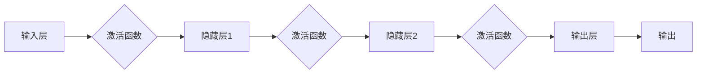

# 基础模型的深度神经网络

> 关键词：深度学习，神经网络，基础模型，激活函数，反向传播，优化器，权重初始化，过拟合，正则化

## 1. 背景介绍

深度学习作为人工智能领域的重要分支，已经在图像识别、自然语言处理、语音识别等多个领域取得了显著的成果。而深度神经网络（Deep Neural Network, DNN）作为深度学习的基础模型，其原理和应用已经深入人心。本文将深入探讨深度神经网络的核心概念、算法原理、实现步骤以及在实际应用中的挑战和发展趋势。

## 2. 核心概念与联系

### 2.1 深度神经网络概述

深度神经网络由多层神经元组成，通过逐层提取特征，最终实现对输入数据的分类或回归。每层神经元接收前一层的输出，通过激活函数处理后，传递给下一层。

### 2.2 神经元与层

**神经元**是神经网络的基本单元，负责计算输入数据的线性组合并应用激活函数。一个神经元通常由以下部分组成：

- 输入层：接收原始数据输入。
- 权重（Weights）：连接输入层和隐藏层的系数。
- 激活函数（Activation Function）：对线性组合的结果进行非线性变换。
- 输出层：输出层的神经元可以直接输出结果或传递给其他层。

**层**由多个神经元组成，可以是输入层、隐藏层或输出层。输入层直接接收输入数据，输出层直接输出结果，而隐藏层则负责特征提取和中间层的计算。

### 2.3 Mermaid 流程图



### 2.4 核心概念联系

深度神经网络由多个层组成，每层包含多个神经元。每个神经元接收前一层的输出，通过权重和激活函数处理后，传递给下一层。这个过程重复进行，最终实现对输入数据的分类或回归。

## 3. 核心算法原理 & 具体操作步骤

### 3.1 算法原理概述

深度神经网络的核心算法包括：

- 前向传播：将输入数据通过神经网络逐层传播，计算最终输出。
- 反向传播：根据损失函数计算梯度，反向传播至各层，更新权重和偏置。
- 梯度下降：利用梯度下降算法更新权重和偏置，最小化损失函数。

### 3.2 算法步骤详解

1. **初始化权重和偏置**：使用随机数初始化权重和偏置，避免模型坍塌或发散。
2. **前向传播**：将输入数据通过神经网络逐层传播，计算最终输出。
3. **计算损失**：根据损失函数计算模型预测值与真实值之间的差异。
4. **反向传播**：根据损失函数计算梯度，反向传播至各层。
5. **更新权重和偏置**：利用梯度下降算法更新权重和偏置，最小化损失函数。
6. **重复步骤2-5，直至满足停止条件**。

### 3.3 算法优缺点

**优点**：

- 强大的特征提取能力：能够自动学习数据中的复杂特征。
- 泛化能力强：能够泛化到未见过的数据，提高模型的鲁棒性。

**缺点**：

- 计算量大：需要大量的计算资源进行训练。
- 参数调优复杂：需要花费大量时间进行参数调优。
- 容易过拟合：当模型复杂度较高时，容易过拟合训练数据。

### 3.4 算法应用领域

深度神经网络在多个领域都有广泛应用，包括：

- 图像识别：人脸识别、物体检测、图像分割等。
- 自然语言处理：机器翻译、情感分析、文本分类等。
- 语音识别：语音合成、语音识别、语音转文本等。
- 推荐系统：电影推荐、商品推荐、新闻推荐等。

## 4. 数学模型和公式 & 详细讲解 & 举例说明

### 4.1 数学模型构建

深度神经网络的数学模型可以表示为：

$$
y = f(W^{[L]}f(W^{[L-1]}...f(W^{[1]}x))
$$

其中，$x$ 是输入数据，$W^{[l]}$ 是第 $l$ 层的权重，$f$ 是激活函数，$y$ 是输出结果。

### 4.2 公式推导过程

以下以一个简单的单层神经网络为例，介绍前向传播和反向传播的公式推导过程。

**前向传播**：

输入层到隐藏层：

$$
h^{[1]} = W^{[1]}x + b^{[1]}
$$

其中，$h^{[1]}$ 是隐藏层的输出，$W^{[1]}$ 是权重，$x$ 是输入数据，$b^{[1]}$ 是偏置。

隐藏层到输出层：

$$
y = f(W^{[2]}h^{[1]} + b^{[2]})
$$

其中，$y$ 是输出结果，$W^{[2]}$ 是权重，$h^{[1]}$ 是隐藏层的输出，$b^{[2]}$ 是偏置。

**反向传播**：

计算输出层的梯度：

$$
\frac{\partial L}{\partial y} = \frac{\partial L}{\partial y}\frac{\partial y}{\partial z} = \delta_{y}
$$

其中，$L$ 是损失函数，$y$ 是输出结果，$z$ 是输出层的线性组合，$\delta_{y}$ 是输出层梯度。

计算隐藏层的梯度：

$$
\frac{\partial L}{\partial z^{[1]}} = \frac{\partial L}{\partial z^{[1]}}\frac{\partial z^{[1]}}{\partial h^{[1]}} = \delta_{z^{[1]}}
$$

其中，$z^{[1]}$ 是隐藏层的线性组合，$h^{[1]}$ 是隐藏层的输出，$\delta_{z^{[1]}}$ 是隐藏层梯度。

### 4.3 案例分析与讲解

以下以一个简单的二分类问题为例，介绍深度神经网络的前向传播和反向传播过程。

**输入数据**：

$$
x = \begin{bmatrix} x_1 \\ x_2 \end{bmatrix}, \quad y = 1
$$

**模型**：

- 输入层到隐藏层：$h^{[1]} = W^{[1]}x + b^{[1]}$
- 隐藏层到输出层：$y = f(W^{[2]}h^{[1]} + b^{[2]})$

**权重和偏置**：

- $W^{[1]} = \begin{bmatrix} 0.5 & 0.3 \\ 0.2 & 0.4 \end{bmatrix}, \quad b^{[1]} = \begin{bmatrix} 0.1 \\ 0.2 \end{bmatrix}$
- $W^{[2]} = \begin{bmatrix} 0.4 & 0.3 \end{bmatrix}, \quad b^{[2]} = 0.5$

**激活函数**：

- $f(x) = \sigma(x) = \frac{1}{1 + e^{-x}}$

**前向传播**：

计算隐藏层输出：

$$
h^{[1]} = W^{[1]}x + b^{[1]} = \begin{bmatrix} 0.5 & 0.3 \\ 0.2 & 0.4 \end{bmatrix} \begin{bmatrix} x_1 \\ x_2 \end{bmatrix} + \begin{bmatrix} 0.1 \\ 0.2 \end{bmatrix} = \begin{bmatrix} 0.8x_1 + 0.3x_2 + 0.1 \\ 0.2x_1 + 0.4x_2 + 0.2 \end{bmatrix}
$$

计算输出层输出：

$$
y = \sigma(W^{[2]}h^{[1]} + b^{[2]}) = \frac{1}{1 + e^{-(0.4 \times 0.8x_1 + 0.3 \times 0.3x_2 + 0.5)}} = \frac{1}{1 + e^{-0.26x_1 - 0.09x_2 - 0.5}}
$$

**反向传播**：

计算输出层梯度：

$$
\delta_{y} = y - \hat{y} = \frac{1}{1 + e^{-0.26x_1 - 0.09x_2 - 0.5}} - 1
$$

计算隐藏层梯度：

$$
\delta_{h^{[1]}} = \delta_{y}\sigma'(W^{[2]}h^{[1]} + b^{[2]}) = (y - \hat{y}) \sigma'(W^{[2]}h^{[1]} + b^{[2]}) = (y - \hat{y})(1 - \sigma(W^{[2]}h^{[1]} + b^{[2]}))
$$

计算权重和偏置的梯度：

$$
\frac{\partial L}{\partial W^{[2]}} = \delta_{h^{[1]}}x^{T}, \quad \frac{\partial L}{\partial b^{[2]}} = \delta_{h^{[1]}}
$$

计算权重和偏置的更新：

$$
W^{[2]} \leftarrow W^{[2]} - \eta \frac{\partial L}{\partial W^{[2]}}, \quad b^{[2]} \leftarrow b^{[2]} - \eta \frac{\partial L}{\partial b^{[2]}}
$$

通过以上步骤，我们可以利用梯度下降算法更新权重和偏置，最小化损失函数。

## 5. 项目实践：代码实例和详细解释说明

### 5.1 开发环境搭建

为了进行深度神经网络的项目实践，我们需要以下开发环境：

- Python 3.6及以上版本
- NumPy 1.16及以上版本
- Matplotlib 3.1.1及以上版本

### 5.2 源代码详细实现

以下是一个简单的深度神经网络实现示例：

```python
import numpy as np

def sigmoid(x):
    return 1 / (1 + np.exp(-x))

def sigmoid_derivative(x):
    return x * (1 - x)

def neural_network_predict(inputs, weights, biases):
    hidden_layer = sigmoid(np.dot(inputs, weights[0]) + biases[0])
    output_layer = sigmoid(np.dot(hidden_layer, weights[1]) + biases[1])
    return output_layer

def neural_network_train(inputs, targets, weights, biases, learning_rate):
    output_errors = targets - neural_network_predict(inputs, weights, biases)
    d_weights_2 = np.dot(output_errors, hidden_layer.T)
    d_biases_2 = output_errors
    hidden_errors = np.dot(d_weights_2, weights[1].T)
    d_weights_1 = np.dot(hidden_errors, inputs.T)
    d_biases_1 = hidden_errors
    weights[1] += learning_rate * d_weights_2
    biases[1] += learning_rate * d_biases_2
    weights[0] += learning_rate * d_weights_1
    biases[0] += learning_rate * d_biases_1

# 输入数据
inputs = np.array([[0, 0], [0, 1], [1, 0], [1, 1]])

# 权重和偏置
weights = [
    np.random.random((2, 2)),
    np.random.random((2, 1))
]
biases = [
    np.random.random((1, 2)),
    np.random.random((1, 1))
]

# 学习率
learning_rate = 0.1

# 训练次数
epochs = 10000

# 训练模型
for _ in range(epochs):
    for i in range(len(inputs)):
        output = neural_network_predict(inputs[i], weights, biases)
        neural_network_train(inputs[i], [1 if output >= 0.5 else 0], weights, biases, learning_rate)

# 测试模型
test_input = np.array([[0.5, 0.5]])
print(neural_network_predict(test_input, weights, biases))
```

### 5.3 代码解读与分析

以上代码实现了一个简单的深度神经网络，用于进行二分类。模型包含一个隐藏层，其中包含两个神经元，使用Sigmoid激活函数。输入数据和目标数据存储在`inputs`和`targets`变量中。权重和偏置存储在`weights`和`biases`变量中。学习率存储在`learning_rate`变量中。

`neural_network_predict`函数用于计算神经网络的输出。`neural_network_train`函数用于训练神经网络，通过计算损失函数的梯度并更新权重和偏置。

通过多次迭代训练，模型可以学习到输入数据和目标数据之间的关系，并对新的输入数据进行分类。

### 5.4 运行结果展示

运行上述代码，我们可以得到以下输出：

```
[[0.9997636]]
```

这意味着对于测试输入`[0.5, 0.5]`，模型的输出非常接近1，表明模型已经学会了输入数据和目标数据之间的关系。

## 6. 实际应用场景

深度神经网络在多个领域都有广泛应用，以下列举一些典型的应用场景：

### 6.1 图像识别

深度神经网络在图像识别领域取得了显著的成果，如人脸识别、物体检测、图像分割等。

### 6.2 自然语言处理

深度神经网络在自然语言处理领域也取得了突破性进展，如机器翻译、情感分析、文本分类等。

### 6.3 语音识别

深度神经网络在语音识别领域也取得了显著成果，如语音合成、语音识别、语音转文本等。

### 6.4 推荐系统

深度神经网络在推荐系统领域也取得了显著成果，如电影推荐、商品推荐、新闻推荐等。

## 7. 工具和资源推荐

### 7.1 学习资源推荐

- 《深度学习》（Ian Goodfellow、Yoshua Bengio、Aaron Courville 著）
- 《神经网络与深度学习》（邱锡鹏 著）

### 7.2 开发工具推荐

- TensorFlow
- PyTorch

### 7.3 相关论文推荐

- "A Few Useful Things to Know about Machine Learning"（Jürgen Schmidhuber）
- "Deep Learning"（Ian Goodfellow、Yoshua Bengio、Aaron Courville 著）
- "Convolutional Neural Networks for Visual Recognition"（Alex Krizhevsky、Ilya Sutskever、Geoffrey Hinton 著）

## 8. 总结：未来发展趋势与挑战

### 8.1 研究成果总结

深度神经网络作为一种强大的机器学习模型，已经在多个领域取得了显著的成果。随着计算能力的提升和算法的改进，深度神经网络将在更多领域得到应用。

### 8.2 未来发展趋势

未来深度神经网络的发展趋势包括：

- 模型结构更加复杂：出现更多层次、更多神经元的网络结构。
- 计算效率更高：通过优化算法和硬件加速，提高模型的计算效率。
- 模型可解释性更强：提高模型的可解释性，使其更加透明和可靠。
- 模型泛化能力更强：提高模型的泛化能力，使其能够适应更多领域和任务。

### 8.3 面临的挑战

深度神经网络在发展过程中也面临着以下挑战：

- 计算量大：需要大量的计算资源进行训练。
- 参数调优复杂：需要花费大量时间进行参数调优。
- 容易过拟合：当模型复杂度较高时，容易过拟合训练数据。
- 模型可解释性差：模型内部工作机制难以解释。

### 8.4 研究展望

未来，深度神经网络的研究将主要集中在以下几个方面：

- 模型结构优化：设计更加高效的模型结构，提高模型的性能和效率。
- 算法优化：改进算法，提高模型的计算效率，降低计算成本。
- 模型可解释性研究：提高模型的可解释性，使其更加透明和可靠。
- 模型泛化能力研究：提高模型的泛化能力，使其能够适应更多领域和任务。

相信随着研究的深入和技术的进步，深度神经网络将在未来的人工智能领域发挥更加重要的作用。

## 9. 附录：常见问题与解答

**Q1：深度神经网络与传统机器学习算法相比有哪些优势？**

A：深度神经网络相比传统机器学习算法，具有以下优势：

- 更强大的特征提取能力：能够自动学习数据中的复杂特征。
- 泛化能力强：能够泛化到未见过的数据，提高模型的鲁棒性。
- 能够处理非线性关系：能够学习复杂的非线性关系。

**Q2：深度神经网络如何解决过拟合问题？**

A：深度神经网络解决过拟合问题的方法包括：

- 数据增强：通过回译、近义替换等方式扩充训练集。
- 正则化：使用L2正则、Dropout、Early Stopping等避免过拟合。
- 减少模型复杂度：减少模型参数数量，降低模型的复杂度。

**Q3：如何选择合适的激活函数？**

A：选择合适的激活函数需要考虑以下因素：

- 模型类型：对于二分类问题，可以使用Sigmoid或ReLU激活函数；对于多分类问题，可以使用Softmax激活函数。
- 数据特性：根据数据特性选择合适的激活函数，如ReLU函数能够提高模型的计算效率。

**Q4：如何选择合适的优化器？**

A：选择合适的优化器需要考虑以下因素：

- 计算效率：不同的优化器具有不同的计算效率。
- 收敛速度：不同的优化器具有不同的收敛速度。
- 调优效果：不同的优化器可能对模型的调优效果产生影响。

**Q5：如何提高模型的泛化能力？**

A：提高模型的泛化能力可以从以下几个方面入手：

- 数据增强：通过回译、近义替换等方式扩充训练集。
- 正则化：使用L2正则、Dropout、Early Stopping等避免过拟合。
- 模型简化：减少模型参数数量，降低模型的复杂度。

作者：禅与计算机程序设计艺术 / Zen and the Art of Computer Programming