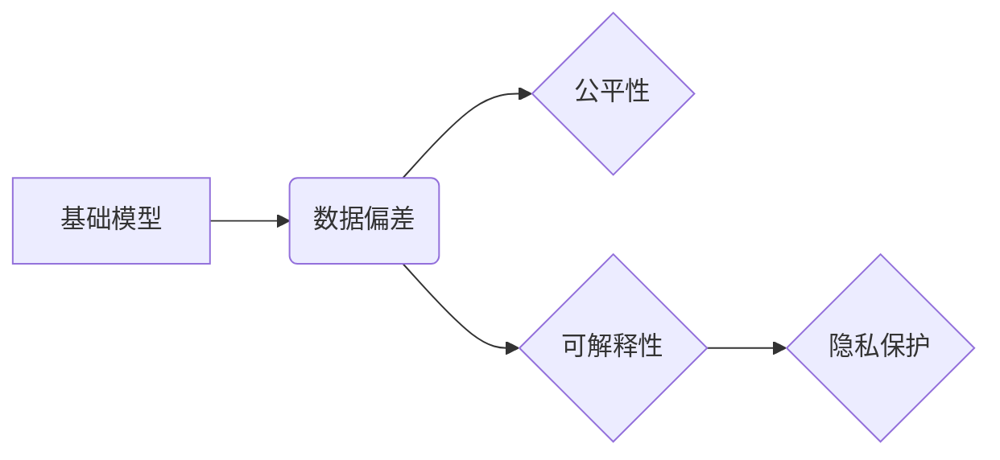

> 人工智能，基础模型，社会不平等，偏见，公平性，伦理，机器学习，深度学习

# 基础模型的社会不平等问题

在人工智能和机器学习的快速发展中，基础模型扮演着至关重要的角色。这些模型通过学习海量数据，为我们提供了从图像识别到自然语言处理等众多领域的强大能力。然而，随着这些模型在各个领域的广泛应用，其潜在的社会不平等问题也日益凸显。本文将深入探讨基础模型的社会不平等问题，分析其根源、影响以及可能的解决方案。

## 1. 背景介绍

### 1.1 问题的由来

随着深度学习技术的突破，基础模型在图像识别、语音识别、自然语言处理等领域取得了令人瞩目的成果。然而，这些模型在应用过程中逐渐暴露出一系列社会不平等问题，例如：

- **偏见**：模型可能会在学习过程中吸收并放大数据中的偏见，导致对某些群体或个体的不公平对待。
- **可解释性**：深度学习模型通常被视为“黑盒”，其决策过程难以解释，这为模型的不公平性提供了掩护。
- **隐私**：基础模型在训练过程中可能涉及个人隐私数据的泄露，损害用户隐私权益。

### 1.2 研究现状

针对基础模型的社会不平等问题，学术界和产业界已经展开了一系列研究。以下是一些主要的研究方向：

- **数据偏差分析**：通过分析训练数据，识别并评估模型中存在的偏见。
- **公平性度量**：提出一系列指标来衡量模型在各个群体中的表现差异。
- **公平性算法**：开发能够减少或消除模型偏见的算法和技巧。
- **可解释性增强**：提高模型的透明度，使其决策过程更加清晰可解释。

### 1.3 研究意义

研究基础模型的社会不平等问题，对于推动人工智能技术的健康发展具有重要意义：

- **促进社会公平**：消除模型偏见，避免对特定群体或个体的歧视。
- **提升模型可信度**：提高模型的可解释性，增强公众对人工智能技术的信任。
- **保障用户隐私**：确保模型在训练和应用过程中尊重和保护用户隐私。

## 2. 核心概念与联系

### 2.1 核心概念原理

以下是对本文涉及的核心概念及其原理的简要介绍：

- **基础模型**：指在大规模数据集上预训练的机器学习模型，如卷积神经网络(CNN)、循环神经网络(RNN)和Transformer等。
- **数据偏差**：指训练数据中存在的系统性差异，可能导致模型在特定群体或个体上的表现不佳。
- **公平性**：指模型在各个群体或个体上的表现差异尽可能小。
- **可解释性**：指模型的决策过程清晰透明，用户可以理解模型的推理过程。
- **隐私保护**：指在模型训练和应用过程中，保护用户隐私数据不被泄露或滥用。

### 2.2 核心概念架构

以下是基于Mermaid流程图表示的核心概念之间的关系：



## 3. 核心算法原理 & 具体操作步骤

### 3.1 算法原理概述

针对基础模型的社会不平等问题，研究者们提出了多种算法和技巧来降低数据偏差、提高模型公平性和可解释性，以及保护用户隐私。以下是一些常见的算法原理：

- **数据重采样**：通过调整数据集中各个群体的样本数量，减少数据偏差。
- **对抗训练**：向模型输入对抗样本，提高模型对噪声和偏差的鲁棒性。
- **公平性度量**：使用公平性指标评估模型在各个群体上的表现差异。
- **可解释性方法**：使用注意力机制、解释性模型等工具解释模型的决策过程。
- **差分隐私**：在模型训练和应用过程中，对敏感数据进行加密或扰动，保护用户隐私。

### 3.2 算法步骤详解

以下是对上述算法步骤的详细解释：

1. **数据重采样**：
    - 分析训练数据，识别存在偏差的群体。
    - 根据需要调整各个群体的样本数量，使得数据集更加均衡。
    - 使用重采样后的数据重新训练模型。

2. **对抗训练**：
    - 使用对抗生成网络(Adversarial Generator)生成对抗样本。
    - 将对抗样本与正常样本混合，作为模型训练数据。
    - 通过对抗训练，提高模型对噪声和偏差的鲁棒性。

3. **公平性度量**：
    - 选择合适的公平性指标，如统计公平性、聚类公平性等。
    - 使用测试集评估模型在各个群体上的表现差异。
    - 分析公平性指标，识别并解决模型中的不公平问题。

4. **可解释性方法**：
    - 使用注意力机制分析模型在各个特征上的权重。
    - 使用解释性模型(如LIME、SHAP等)解释模型的决策过程。
    - 将解释结果可视化，便于用户理解模型的推理过程。

5. **差分隐私**：
    - 对敏感数据进行加密或扰动，保护用户隐私。
    - 在模型训练和应用过程中，确保隐私保护措施得到实施。

### 3.3 算法优缺点

以下是对上述算法的优缺点分析：

- **数据重采样**：
    - 优点：简单易行，能够有效减少数据偏差。
    - 缺点：可能导致模型在部分群体上的性能下降，且无法消除数据本身的偏差。

- **对抗训练**：
    - 优点：提高模型对噪声和偏差的鲁棒性，降低模型的过拟合风险。
    - 缺点：需要额外的计算资源，且对抗样本的生成可能存在困难。

- **公平性度量**：
    - 优点：能够量化模型在各个群体上的表现差异，便于识别和解决不公平问题。
    - 缺点：需要选择合适的公平性指标，且指标的计算可能比较复杂。

- **可解释性方法**：
    - 优点：提高模型的可解释性，便于用户理解模型的推理过程。
    - 缺点：解释性方法可能增加模型复杂度，降低模型性能。

- **差分隐私**：
    - 优点：保护用户隐私，避免敏感数据泄露。
    - 缺点：可能对模型性能产生一定影响，且隐私保护程度需要根据实际需求进行权衡。

### 3.4 算法应用领域

以上算法和技巧在各个领域都有广泛的应用，以下是一些常见的应用场景：

- **金融**：识别信贷风险、欺诈检测、风险评估等。
- **医疗**：疾病诊断、药物研发、健康管理等。
- **招聘**：消除招聘过程中的歧视，实现公平招聘。
- **教育**：个性化推荐、智能辅导、教育评估等。
- **交通**：交通流量预测、自动驾驶、交通违规检测等。

## 4. 数学模型和公式 & 详细讲解 & 举例说明

### 4.1 数学模型构建

以下是一些与基础模型社会不平等问题相关的数学模型：

- **统计公平性**：衡量模型在各个群体上的表现差异，可用以下公式表示：

  $$
\text{统计公平性} = \frac{\text{模型在群体A上的表现} - \text{模型在群体B上的表现}}{\text{模型在群体A上的表现} + \text{模型在群体B上的表现}}
$$

- **聚类公平性**：衡量模型在各个聚类上的表现差异，可用以下公式表示：

  $$
\text{聚类公平性} = \frac{\text{模型在聚类A上的表现} - \text{模型在聚类B上的表现}}{\text{模型在聚类A上的表现} + \text{模型在聚类B上的表现}}
$$

### 4.2 公式推导过程

以上公式的推导过程如下：

- **统计公平性**：首先计算模型在各个群体上的表现，然后计算差异值，并除以总和。

- **聚类公平性**：与统计公平性类似，只是将群体替换为聚类。

### 4.3 案例分析与讲解

以下是一个关于统计公平性的案例分析：

假设我们有一个分类模型，用于判断客户是否具有信贷风险。该模型在训练数据中，男性客户的样本数量远多于女性客户。经过训练，模型在男性客户上的准确率达到90%，在女性客户上的准确率仅为70%。此时，我们可以计算该模型的统计公平性：

$$
\text{统计公平性} = \frac{0.9 - 0.7}{0.9 + 0.7} = 0.1
$$

这表明该模型在女性客户上的表现明显低于男性客户，存在性别偏见。

## 5. 项目实践：代码实例和详细解释说明

### 5.1 开发环境搭建

为了进行基础模型社会不平等问题的实践，我们需要搭建以下开发环境：

1. 安装Python和pip。
2. 安装TensorFlow或PyTorch等深度学习框架。
3. 安装scikit-learn等机器学习库。
4. 安装必要的文本处理库，如NLTK、spaCy等。

### 5.2 源代码详细实现

以下是一个使用TensorFlow和scikit-learn进行数据重采样的代码实例：

```python
from sklearn.model_selection import train_test_split
from sklearn.utils import resample

# 假设data是包含特征和标签的数据集
X, y = data[:, :-1], data[:, -1]

# 按照标签进行重采样
for label in np.unique(y):
    X_resampled, y_resampled = resample(X[y == label], y[y == label], replace=True, n_samples=len(y) / 2)
    X[y == label] = X_resampled
    y[y == label] = y_resampled

# 划分训练集和测试集
X_train, X_test, y_train, y_test = train_test_split(X, y, test_size=0.2, random_state=42)
```

### 5.3 代码解读与分析

上述代码首先导入必要的库，然后对数据集进行标签重采样，使得各个标签的样本数量大致相等。最后，将数据集划分为训练集和测试集。

### 5.4 运行结果展示

运行上述代码后，可以观察到各个标签的样本数量更加均衡。这有助于减少模型在各个标签上的偏差，提高模型的公平性。

## 6. 实际应用场景

基础模型的社会不平等问题在各个领域都有广泛的应用，以下是一些常见的应用场景：

### 6.1 金融

在金融领域，基础模型被广泛应用于信贷风险评估、欺诈检测、投资建议等任务。然而，这些模型容易受到数据偏差的影响，导致对某些群体或个体的不公平对待。例如，如果一个信贷风险评估模型在训练数据中男性客户的样本数量远多于女性客户，那么该模型可能会对女性客户产生性别歧视。

### 6.2 医疗

在医疗领域，基础模型被广泛应用于疾病诊断、药物研发、健康管理等任务。然而，由于医疗数据中存在着种族、性别等方面的偏见，这些模型可能会对某些患者产生不公平的对待。例如，如果一个疾病诊断模型在训练数据中亚洲患者的样本数量远多于欧洲患者，那么该模型可能会对欧洲患者产生种族歧视。

### 6.3 招聘

在招聘领域，基础模型被广泛应用于简历筛选、面试评估等任务。然而，这些模型容易受到招聘歧视的影响，导致对某些群体或个体的不公平对待。例如，如果一个简历筛选模型在训练数据中男性候选人的样本数量远多于女性候选人，那么该模型可能会对女性候选人产生性别歧视。

### 6.4 教育

在教育领域，基础模型被广泛应用于个性化推荐、智能辅导、教育评估等任务。然而，这些模型容易受到教育资源分配不均的影响，导致对某些学生产生不公平的对待。例如，如果一个个性化推荐模型在训练数据中城市学生的样本数量远多于农村学生，那么该模型可能会对农村学生产生地域歧视。

### 6.5 交通

在交通领域，基础模型被广泛应用于交通流量预测、自动驾驶、交通违规检测等任务。然而，这些模型容易受到交通数据偏差的影响，导致对某些群体或个体的不公平对待。例如，如果一个交通违规检测模型在训练数据中私家车的样本数量远多于公共交通工具，那么该模型可能会对公共交通工具的使用者产生歧视。

## 7. 工具和资源推荐

以下是一些用于研究和解决基础模型社会不平等问题的工具和资源：

### 7.1 学习资源推荐

- 《人工智能：一种现代的方法》
- 《机器学习：概率视角》
- 《深度学习》
- 《自然语言处理综论》

### 7.2 开发工具推荐

- TensorFlow
- PyTorch
- Scikit-learn
- NLTK
- spaCy

### 7.3 相关论文推荐

- "Algorithmic Fairness and Societal Impact"
- "Counterfactual Fairness"
- "Understanding Black-Box Decisions of Machine Learning Algorithms"
- "The Cost of Fairness in Machine Learning"

## 8. 总结：未来发展趋势与挑战

### 8.1 研究成果总结

本文深入探讨了基础模型的社会不平等问题，分析了其根源、影响以及可能的解决方案。研究表明，基础模型的社会不平等问题是一个复杂且亟待解决的问题，需要学术界和产业界的共同努力。

### 8.2 未来发展趋势

未来，基础模型的社会不平等问题研究将呈现以下发展趋势：

- **跨学科研究**：将人工智能、社会学、伦理学等领域的研究成果相结合，从多学科视角探讨社会不平等问题。
- **公平性算法**：开发更加有效的公平性算法，降低模型偏见，提高模型公平性。
- **可解释性增强**：提高模型的可解释性，便于用户理解模型的决策过程。
- **隐私保护**：在保护用户隐私的前提下，提高模型性能。

### 8.3 面临的挑战

尽管取得了初步成果，但基础模型的社会不平等问题研究仍面临着以下挑战：

- **数据偏差**：如何从数据源头消除偏见，是一个亟待解决的问题。
- **公平性度量**：如何选择合适的公平性指标，是一个具有挑战性的问题。
- **算法与伦理**：如何在算法设计和伦理之间取得平衡，是一个具有争议性的问题。
- **隐私保护**：如何在保护用户隐私的前提下，提高模型性能，是一个具有技术挑战的问题。

### 8.4 研究展望

未来，基础模型的社会不平等问题研究将朝着以下方向展开：

- **数据偏差消除**：研究如何从数据源头消除偏见，提高数据质量。
- **公平性算法创新**：开发更加有效的公平性算法，降低模型偏见。
- **可解释性增强**：提高模型的可解释性，便于用户理解模型的决策过程。
- **隐私保护技术**：在保护用户隐私的前提下，提高模型性能。

相信通过不断努力，基础模型的社会不平等问题将得到有效解决，为构建一个公平、公正、安全的人工智能社会做出贡献。

## 9. 附录：常见问题与解答

以下是一些关于基础模型社会不平等问题的常见问题及解答：

**Q1：什么是基础模型的社会不平等问题？**

A1：基础模型的社会不平等问题是指基于深度学习技术训练的模型在应用过程中，可能对某些群体或个体产生不公平对待的现象。

**Q2：如何识别和解决基础模型的社会不平等问题？**

A2：识别和解决基础模型的社会不平等问题需要从数据、算法、伦理等多个方面入手。具体措施包括：

- 分析训练数据，识别和消除数据偏差。
- 开发公平性算法，降低模型偏见。
- 增强模型的可解释性，便于用户理解模型的决策过程。
- 保护用户隐私，确保模型在训练和应用过程中不泄露敏感数据。

**Q3：如何选择合适的公平性指标？**

A3：选择合适的公平性指标需要根据具体应用场景和数据特点进行考虑。常见的公平性指标包括统计公平性、聚类公平性、因果公平性等。

**Q4：如何提高模型的可解释性？**

A4：提高模型的可解释性可以通过以下方法实现：

- 使用注意力机制分析模型在各个特征上的权重。
- 使用解释性模型(如LIME、SHAP等)解释模型的决策过程。
- 将解释结果可视化，便于用户理解模型的推理过程。

**Q5：如何保护用户隐私？**

A5：保护用户隐私可以通过以下方法实现：

- 对敏感数据进行加密或扰动。
- 使用差分隐私技术保护用户隐私。
- 在模型训练和应用过程中，确保隐私保护措施得到实施。

作者：禅与计算机程序设计艺术 / Zen and the Art of Computer Programming