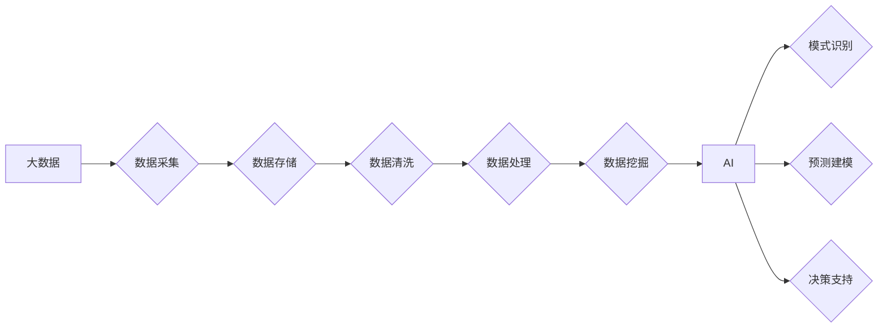

> - 大数据
> - 人工智能
> - 数据驱动
> - 机器学习
> - 深度学习
> - 算法性能
> - 实时处理

# 大数据在AI中的重要性

在当今这个数据驱动的世界，大数据与人工智能（AI）的结合已成为推动技术创新和商业变革的关键动力。大数据提供了AI算法所需的丰富信息，而AI技术则能够从这些数据中提取洞见，从而优化决策、提升效率和创新业务模式。本文将深入探讨大数据在AI中的重要性，分析其核心概念与联系，并探讨大数据如何影响算法原理、应用领域和未来发展趋势。

## 1. 背景介绍

### 1.1 大数据的兴起

随着信息技术的飞速发展，全球数据量呈指数级增长。这些数据来自各种来源，包括社交媒体、物联网设备、传感器、电子商务交易等。大数据的兴起为AI技术的发展提供了肥沃的土壤。

### 1.2 AI技术的进步

AI技术的进步，尤其是机器学习和深度学习，使得计算机能够从海量数据中学习模式、做出预测和决策。然而，这些技术的成功依赖于高质量、高数量的大数据。

### 1.3 本文结构

本文将首先介绍大数据与AI的核心概念和联系，接着探讨大数据如何影响AI算法的原理和操作步骤。随后，我们将分析数学模型和公式，并通过实际项目实践展示大数据在AI中的应用。最后，我们将探讨大数据在AI中的实际应用场景、未来展望以及面临的挑战。

## 2. 核心概念与联系

### 2.1 大数据

大数据是指规模庞大、种类繁多、生成速度快、价值密度低的数据集合。它具有以下四个V特点：

- **Volume（体量）**：数据量巨大，通常达到PB级。
- **Variety（多样性）**：数据类型多样，包括结构化、半结构化和非结构化数据。
- **Velocity（速度）**：数据生成速度快，需要实时处理和分析。
- **Value（价值）**：数据价值密度低，需要通过数据挖掘提取价值。

### 2.2 AI

AI是指通过模拟、延伸和扩展人类智能的技术。它包括多种技术，如机器学习、深度学习、自然语言处理等。

### 2.3 Mermaid 流程图

以下是大数据与AI核心概念之间的Mermaid流程图：



## 3. 核心算法原理 & 具体操作步骤

### 3.1 算法原理概述

AI算法从数据中学习，通过以下步骤：

1. 数据采集：从各种来源收集数据。
2. 数据存储：将数据存储在适合存储和检索的系统中。
3. 数据清洗：处理缺失值、异常值和重复数据。
4. 数据处理：将数据转换为适合算法的格式。
5. 数据挖掘：使用机器学习算法从数据中提取模式。
6. 模式识别、预测建模和决策支持：根据挖掘出的模式做出预测和决策。

### 3.2 算法步骤详解

#### 3.2.1 数据采集

数据采集是AI流程的第一步，它涉及从各种来源获取数据。这些来源可能包括：

- 内部数据库
- 传感器
- 社交媒体
- 第三方服务

#### 3.2.2 数据存储

数据存储需要考虑数据量、访问速度和安全性。常见的存储解决方案包括：

- 关系型数据库
- NoSQL数据库
- 分布式文件系统

#### 3.2.3 数据清洗

数据清洗包括以下步骤：

- 缺失值处理
- 异常值检测和处理
- 重复数据删除

#### 3.2.4 数据处理

数据处理包括以下步骤：

- 数据转换
- 特征提取
- 数据标准化

#### 3.2.5 数据挖掘

数据挖掘使用机器学习算法从数据中提取模式。常见的算法包括：

- 决策树
- 朴素贝叶斯
- 神经网络

#### 3.2.6 模式识别、预测建模和决策支持

基于数据挖掘的结果，AI系统可以做出预测和决策。这些预测和决策可以用于：

- 个性化推荐
- 客户关系管理
- 风险评估

### 3.3 算法优缺点

#### 3.3.1 优点

- **强大的数据处理能力**：AI算法能够处理和分析大量复杂数据。
- **高效的学习速度**：机器学习算法可以从数据中快速学习。
- **高度的可扩展性**：AI系统可以轻松扩展以适应更大的数据集。

#### 3.3.2 缺点

- **数据质量要求高**：AI算法对数据质量有很高的要求。
- **需要大量计算资源**：训练和运行AI模型需要大量的计算资源。
- **可解释性差**：一些AI模型，如深度学习模型，难以解释其决策过程。

### 3.4 算法应用领域

AI算法在多个领域都有广泛的应用，包括：

- **金融**：风险评估、欺诈检测、个性化推荐。
- **医疗**：疾病诊断、药物研发、患者护理。
- **零售**：库存管理、客户关系管理、个性化营销。
- **制造**：预测维护、质量控制、生产优化。

## 4. 数学模型和公式 & 详细讲解 & 举例说明

### 4.1 数学模型构建

AI算法通常基于数学模型。以下是一些常见的数学模型：

- **线性回归**：用于预测连续值。
- **逻辑回归**：用于分类任务。
- **决策树**：用于分类和回归任务。
- **神经网络**：用于复杂的数据建模。

### 4.2 公式推导过程

以下是一些常见数学模型的公式推导：

#### 4.2.1 线性回归

线性回归的目标是最小化预测值与真实值之间的平方误差：

$$
\min_{\theta} \sum_{i=1}^{n} (y_i - \theta^T x_i)^2
$$

其中，$y_i$ 是真实值，$\theta$ 是模型参数，$x_i$ 是特征向量。

#### 4.2.2 逻辑回归

逻辑回归的目标是预测概率：

$$
\hat{y} = \frac{1}{1 + e^{-\theta^T x}}
$$

其中，$\hat{y}$ 是预测概率，$\theta$ 是模型参数，$x$ 是特征向量。

### 4.3 案例分析与讲解

以下是一个使用线性回归进行股票价格预测的案例：

#### 4.3.1 数据集

假设我们有以下股票价格数据：

| 时间 | 价格 |
| --- | --- |
| 2021-01-01 | 100 |
| 2021-01-02 | 102 |
| 2021-01-03 | 105 |
| ... | ... |

#### 4.3.2 模型

我们使用线性回归模型来预测股票价格：

$$
P(t+1) = \theta_0 + \theta_1 \times P(t)
$$

其中，$P(t)$ 是当前股票价格，$P(t+1)$ 是预测的未来股票价格。

#### 4.3.3 训练

我们将数据集分为训练集和测试集，使用训练集来训练模型，使用测试集来评估模型的性能。

#### 4.3.4 预测

使用训练好的模型来预测未来的股票价格。

## 5. 项目实践：代码实例和详细解释说明

### 5.1 开发环境搭建

为了进行AI项目实践，我们需要搭建以下开发环境：

- Python编程语言
- NumPy、Pandas等数据处理库
- Scikit-learn、TensorFlow或PyTorch等机器学习库

### 5.2 源代码详细实现

以下是一个使用Python和Scikit-learn进行线性回归的示例代码：

```python
import numpy as np
import pandas as pd
from sklearn.linear_model import LinearRegression

# 加载数据
data = pd.read_csv('stock_prices.csv')
X = data[['Date']]
y = data['Price']

# 训练模型
model = LinearRegression()
model.fit(X, y)

# 预测
future_date = np.array([[2021-01-04]])
predicted_price = model.predict(future_date)

print(f"预测的股票价格为: {predicted_price[0]}")
```

### 5.3 代码解读与分析

上述代码首先导入了必要的库，然后加载数据，接着创建并训练了线性回归模型，最后使用模型来预测未来的股票价格。

### 5.4 运行结果展示

假设预测的股票价格为106，这意味着根据我们的模型，未来股票价格预计将上涨。

## 6. 实际应用场景

### 6.1 预测分析

预测分析是AI在商业领域中最重要的应用之一。通过分析历史数据，企业可以预测未来的市场趋势、客户行为和业务需求。

### 6.2 客户关系管理

AI技术可以用于优化客户关系管理，包括个性化推荐、客户细分和客户流失预测。

### 6.3 安全监控

AI技术可以用于安全监控，包括异常检测、入侵检测和风险评估。

### 6.4 智能交通

AI技术可以用于智能交通，包括交通流量预测、路线规划和车辆检测。

## 7. 工具和资源推荐

### 7.1 学习资源推荐

- 《Python机器学习》
- 《深度学习》
- 《数据科学入门》

### 7.2 开发工具推荐

- Jupyter Notebook
- Scikit-learn
- TensorFlow
- PyTorch

### 7.3 相关论文推荐

- "The Unreasonable Effectiveness of Deep Learning"
- "Large Scale Visual Recognition Challenge 2012"
- "Convolutional Neural Networks for Visual Recognition"

## 8. 总结：未来发展趋势与挑战

### 8.1 研究成果总结

大数据与AI的结合推动了技术创新和商业变革。AI算法能够从海量数据中提取洞见，从而优化决策、提升效率和创新业务模式。

### 8.2 未来发展趋势

- **更强大的算法**：随着技术的进步，AI算法将变得更加强大和高效。
- **更广泛的应用**：AI技术将应用于更多领域，如医疗、教育、能源等。
- **更易用的平台**：AI平台将变得更加易用，使得更多非专业人士能够使用AI技术。

### 8.3 面临的挑战

- **数据质量**：AI算法对数据质量有很高的要求。
- **隐私保护**：随着数据量的增加，隐私保护成为一个重要问题。
- **伦理问题**：AI技术的应用引发了一系列伦理问题。

### 8.4 研究展望

未来，大数据与AI的结合将推动以下研究方向：

- **可解释AI**：提高AI算法的可解释性，使其决策过程更加透明。
- **隐私增强技术**：开发新的技术来保护用户隐私。
- **跨学科研究**：将AI与其他领域的研究相结合，如心理学、社会学等。

## 9. 附录：常见问题与解答

**Q1：大数据与AI的关系是什么？**

A: 大数据为AI提供了丰富的信息资源，而AI技术能够从这些数据中提取洞见，从而推动技术创新和商业变革。

**Q2：大数据如何影响AI算法的性能？**

A: 大数据提供了更多的样本和特征，使得AI算法能够学习到更复杂的模式，从而提高性能。

**Q3：大数据在哪些行业中应用广泛？**

A: 大数据在金融、医疗、零售、制造、交通等多个行业中都有广泛应用。

**Q4：如何处理大数据中的噪声和异常值？**

A: 可以使用数据清洗技术来处理噪声和异常值，如删除、填充或替换。

**Q5：如何确保AI系统的安全性？**

A: 可以使用安全协议、加密和访问控制等技术来确保AI系统的安全性。

作者：禅与计算机程序设计艺术 / Zen and the Art of Computer Programming