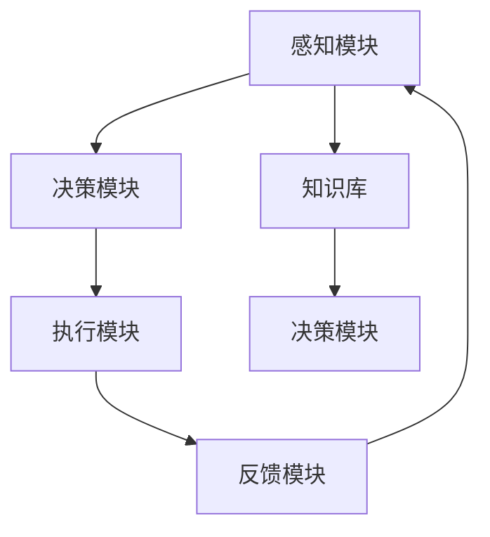
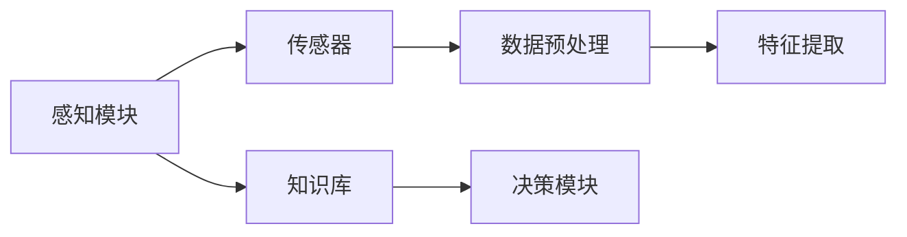
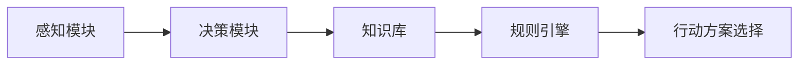
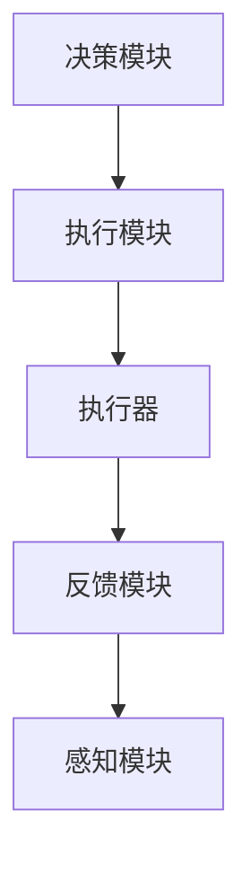
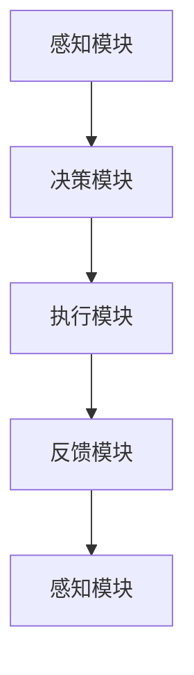
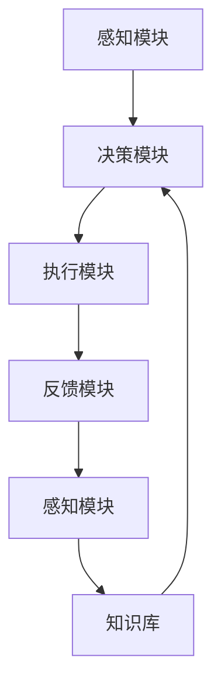

                 

# Agent需要具备感知环境、做出决策并执行适当行动的能力

## 1. 背景介绍

### 1.1 问题由来

在当前人工智能(AI)技术的发展中，智能体(Agent)已经成为实现智能交互和决策的核心组件。无论是自动驾驶、智能客服、智能推荐系统，还是游戏AI，智能体的表现都直接关系到最终应用的效果。然而，理想的智能体不仅需要具备感知环境、做出决策的能力，还需要能够执行适当的行动。如何设计一个能够感知环境、做出决策并执行适当行动的智能体，是AI技术研究和应用的关键。

### 1.2 问题核心关键点

智能体具备以下核心能力：

1. **感知环境**：通过传感器等手段获取环境信息，并对环境状态进行建模。
2. **做出决策**：根据感知到的环境信息，结合已有知识，选择最合适的行动方案。
3. **执行行动**：将决策转化为具体的行动，如移动、对话、推荐等。

这三个能力构成了智能体的核心循环，并在其中不断迭代，以实现最终的智能决策和行动。

### 1.3 问题研究意义

研究智能体在感知环境、做出决策并执行行动方面的能力，对于推动AI技术的深入应用，提升智能系统的效能，具有重要意义：

1. **提升系统性能**：通过优化智能体的感知、决策和执行能力，显著提高智能系统的整体表现。
2. **降低开发成本**：智能体的设计可以复用通用的感知、决策和执行模块，减少重复开发，降低成本。
3. **扩展应用范围**：智能体的通用性使其可以应用于多个领域，如自动驾驶、客服、推荐系统等，加速技术落地。
4. **促进技术创新**：研究智能体的设计和优化，将带来新的算法和技术突破，推动AI领域的发展。
5. **增强人机交互**：智能体能够更好地理解和响应人的需求，提升用户体验，促进人机协同。

## 2. 核心概念与联系

### 2.1 核心概念概述

为了更好地理解智能体在感知环境、做出决策并执行行动中的关键环节，本节将介绍几个密切相关的核心概念：

1. **感知模块(Perception Module)**：智能体的感知模块负责从环境中获取信息，并进行数据处理和特征提取，为后续决策提供基础。
2. **决策模块(Decision Module)**：智能体的决策模块根据感知到的信息，结合知识库和规则，选择合适的行动方案。
3. **执行模块(Actuation Module)**：智能体的执行模块将决策结果转化为具体的行动，如控制移动、生成对话、执行推荐等。
4. **反馈模块(Feedback Module)**：智能体的反馈模块将执行结果反馈到感知和决策模块，进行校正和优化。
5. **知识库(Knowledge Base)**：智能体的知识库存储已有知识，如规则、事实、模型等，供决策模块使用。

这些核心概念之间的逻辑关系可以通过以下Mermaid流程图来展示：



这个流程图展示了一个智能体在感知、决策和执行中的主要流程：感知模块获取环境信息，决策模块做出决策，执行模块执行决策，反馈模块根据执行结果反馈到感知和决策模块，进行循环迭代。同时，知识库为决策提供知识支持，帮助智能体做出更加合理的决策。

### 2.2 概念间的关系

这些核心概念之间存在着紧密的联系，形成了智能体实现感知、决策和执行的完整生态系统。下面我通过几个Mermaid流程图来展示这些概念之间的关系。

#### 2.2.1 智能体的感知过程



这个流程图展示了智能体在感知环境时的基本流程：通过传感器获取环境数据，经过预处理和特征提取，再结合知识库辅助决策，最终生成感知结果。

#### 2.2.2 智能体的决策过程



这个流程图展示了智能体在决策时的主要流程：根据感知结果和知识库中的规则，通过规则引擎生成可能的行动方案，再根据各种因素选择最合适的方案。

#### 2.2.3 智能体的执行过程



这个流程图展示了智能体在执行时的基本流程：决策模块生成行动方案，通过执行器执行具体行动，执行结果反馈到感知和决策模块，进行下一轮循环。

#### 2.2.4 智能体的反馈循环



这个流程图展示了智能体在反馈循环中的流程：感知模块获取环境信息，决策模块做出决策，执行模块执行决策，执行结果反馈到感知和决策模块，进行下一轮循环。

### 2.3 核心概念的整体架构

最后，我们用一个综合的流程图来展示这些核心概念在大语言模型微调过程中的整体架构：



这个综合流程图展示了智能体在感知、决策和执行中的整体架构：感知模块获取环境信息，决策模块做出决策，执行模块执行决策，执行结果反馈到感知和决策模块，进行下一轮循环。同时，知识库为决策提供知识支持，帮助智能体做出更加合理的决策。

## 3. 核心算法原理 & 具体操作步骤

### 3.1 算法原理概述

智能体在感知环境、做出决策并执行适当行动的过程中，涉及到多个关键模块的协同工作。其核心算法原理可以概括为以下几个步骤：

1. **感知模块**：通过传感器或数据源获取环境信息，并进行数据预处理和特征提取。
2. **决策模块**：结合感知结果和知识库中的规则，选择合适的行动方案。
3. **执行模块**：将决策结果转化为具体的行动，如移动、对话、推荐等。
4. **反馈模块**：根据执行结果，对感知和决策模块进行校正和优化。
5. **知识库**：存储已有知识，供决策模块使用，帮助智能体做出更加合理的决策。

### 3.2 算法步骤详解

#### 3.2.1 感知模块设计

感知模块的设计主要包括以下几个步骤：

1. **数据获取**：通过传感器或API获取环境数据，如摄像头图像、语音信号、位置信息等。
2. **数据预处理**：对获取的数据进行清洗、滤波、归一化等预处理操作，确保数据的质量和一致性。
3. **特征提取**：使用机器学习或深度学习技术，对预处理后的数据进行特征提取，生成高维特征向量。
4. **环境建模**：根据提取的特征向量，构建环境状态模型，如状态空间、图模型等。

#### 3.2.2 决策模块设计

决策模块的设计主要包括以下几个步骤：

1. **规则定义**：定义各种决策规则，如动作优先级、状态转移规则等。
2. **规则引擎**：构建规则引擎，根据感知结果和环境状态，匹配合适的规则，生成可能的行动方案。
3. **行动方案选择**：结合决策规则和行动方案，选择最合适的行动方案。

#### 3.2.3 执行模块设计

执行模块的设计主要包括以下几个步骤：

1. **行动执行器**：设计具体的行动执行器，如移动执行器、对话生成器、推荐引擎等。
2. **执行控制**：根据决策结果，调用对应的执行器执行具体行动。
3. **执行反馈**：收集执行结果，生成反馈信号，反馈到感知和决策模块。

#### 3.2.4 反馈模块设计

反馈模块的设计主要包括以下几个步骤：

1. **反馈信号采集**：根据执行结果，生成反馈信号，如状态变化、误差信号等。
2. **反馈校正**：根据反馈信号，对感知和决策模块进行校正，如调整感知参数、优化决策规则等。
3. **反馈优化**：利用机器学习或强化学习技术，对感知和决策模块进行优化，提高系统的稳定性和准确性。

#### 3.2.5 知识库设计

知识库的设计主要包括以下几个步骤：

1. **知识存储**：存储各种知识，如规则、事实、模型等，建立知识库的索引和查询机制。
2. **知识更新**：根据最新的数据和实验结果，定期更新知识库，确保知识的准确性和时效性。
3. **知识应用**：在决策过程中，利用知识库中的知识辅助决策，提高决策的合理性和高效性。

### 3.3 算法优缺点

智能体在感知环境、做出决策并执行行动的过程中，具有以下优点：

1. **高效性**：智能体能够自动处理大量的环境数据，并快速做出决策，提高系统的响应速度。
2. **灵活性**：智能体可以根据环境变化动态调整决策策略，适应不同的应用场景。
3. **可扩展性**：智能体的模块化设计使得各个模块可以独立更新和优化，提高系统的可扩展性。

然而，智能体在实现过程中也存在一些缺点：

1. **复杂性**：智能体设计涉及多个模块的协同工作，设计和实现过程较为复杂。
2. **数据依赖**：智能体的性能很大程度上依赖于环境数据的质量和数量，需要大量高质量的数据支持。
3. **鲁棒性不足**：在面对复杂的、非线性环境时，智能体的决策可能出现偏差，影响系统的稳定性。

### 3.4 算法应用领域

智能体在多个领域中得到了广泛的应用，包括但不限于：

1. **自动驾驶**：智能体在自动驾驶中负责感知环境、决策路径并控制车辆的行驶。
2. **智能客服**：智能体在智能客服中负责感知用户请求、做出决策并生成回复。
3. **智能推荐**：智能体在智能推荐中负责感知用户兴趣、决策推荐结果并执行推荐。
4. **游戏AI**：智能体在游戏AI中负责感知游戏环境、决策行动并执行游戏操作。
5. **机器人控制**：智能体在机器人控制中负责感知环境、决策行动并控制机器人的移动。

## 4. 数学模型和公式 & 详细讲解 & 举例说明

### 4.1 数学模型构建

智能体在感知环境、做出决策并执行行动的过程中，涉及多个数学模型。以下是几个关键的数学模型：

1. **感知模型**：用于表示环境状态和感知数据之间的关系。
2. **决策模型**：用于描述智能体在给定状态下的决策过程。
3. **执行模型**：用于描述行动方案和执行器之间的关系。
4. **反馈模型**：用于描述感知和决策模块之间的反馈关系。
5. **知识库模型**：用于存储和检索知识，支持决策模块的推理。

### 4.2 公式推导过程

#### 4.2.1 感知模型

感知模型可以表示为：

$$
s = f(x)
$$

其中 $s$ 为环境状态，$x$ 为感知数据，$f$ 为感知函数。

#### 4.2.2 决策模型

决策模型可以表示为：

$$
a = g(s, k)
$$

其中 $a$ 为行动方案，$s$ 为环境状态，$k$ 为知识库，$g$ 为决策函数。

#### 4.2.3 执行模型

执行模型可以表示为：

$$
x' = h(a)
$$

其中 $x'$ 为执行后的感知数据，$a$ 为行动方案，$h$ 为执行函数。

#### 4.2.4 反馈模型

反馈模型可以表示为：

$$
s' = g(s, a)
$$

其中 $s'$ 为执行后的环境状态，$s$ 为执行前的环境状态，$a$ 为执行方案。

#### 4.2.5 知识库模型

知识库模型可以表示为：

$$
k = \phi(s)
$$

其中 $k$ 为知识库，$s$ 为环境状态，$\phi$ 为知识函数。

### 4.3 案例分析与讲解

假设我们设计一个自动驾驶系统，其核心组件包括感知模块、决策模块和执行模块。

#### 4.3.1 感知模块设计

感知模块通过摄像头获取道路图像，并使用深度学习模型提取特征。具体步骤如下：

1. **数据获取**：摄像头获取道路图像。
2. **数据预处理**：对图像进行去噪、裁剪、归一化等预处理操作。
3. **特征提取**：使用卷积神经网络(CNN)提取道路特征，生成高维特征向量。
4. **环境建模**：构建道路状态模型，如交通灯状态、车辆位置等。

#### 4.3.2 决策模块设计

决策模块根据感知结果和知识库中的规则，选择最佳行驶路径。具体步骤如下：

1. **规则定义**：定义各种决策规则，如交通规则、路径优先级等。
2. **规则引擎**：根据感知结果和环境状态，匹配合适的规则，生成可能的路径方案。
3. **行动方案选择**：根据路径方案和环境状态，选择最合适的路径。

#### 4.3.3 执行模块设计

执行模块根据决策结果控制车辆的行驶。具体步骤如下：

1. **行动执行器**：设计车辆的转向和加速执行器。
2. **执行控制**：根据决策结果，控制转向和加速器，执行车辆行驶。
3. **执行反馈**：收集车辆位置和速度信息，反馈到感知和决策模块。

## 5. 项目实践：代码实例和详细解释说明

### 5.1 开发环境搭建

在进行智能体设计实践前，我们需要准备好开发环境。以下是使用Python进行智能体开发的常用环境配置流程：

1. 安装Python：从官网下载并安装Python 3.x版本。
2. 安装Pip：通过Python官网下载并安装pip。
3. 安装TensorFlow或PyTorch：
   - 安装TensorFlow：使用pip install tensorflow命令安装。
   - 安装PyTorch：使用pip install torch命令安装。
4. 安装Numpy和Matplotlib：
   - 安装Numpy：使用pip install numpy命令安装。
   - 安装Matplotlib：使用pip install matplotlib命令安装。

完成上述步骤后，即可在Python环境下开始智能体设计实践。

### 5.2 源代码详细实现

这里我们以自动驾驶为例，展示智能体的设计与实现。

首先，定义感知模块：

```python
import tensorflow as tf
from tensorflow.keras.layers import Conv2D, MaxPooling2D, Flatten, Dense

class PerceptionModule(tf.keras.Model):
    def __init__(self):
        super(PerceptionModule, self).__init__()
        self.conv1 = Conv2D(32, 3, activation='relu')
        self.pool1 = MaxPooling2D()
        self.conv2 = Conv2D(64, 3, activation='relu')
        self.pool2 = MaxPooling2D()
        self.flatten = Flatten()
        self.dense1 = Dense(128, activation='relu')
        self.dense2 = Dense(64, activation='relu')
        self.dense3 = Dense(10, activation='softmax')

    def call(self, inputs):
        x = self.conv1(inputs)
        x = self.pool1(x)
        x = self.conv2(x)
        x = self.pool2(x)
        x = self.flatten(x)
        x = self.dense1(x)
        x = self.dense2(x)
        x = self.dense3(x)
        return x
```

然后，定义决策模块：

```python
import numpy as np

class DecisionModule:
    def __init__(self):
        self.rules = {
            'stop': {'condition': 'red_light', 'action': 'stop'},
            'go': {'condition': 'green_light', 'action': 'go'},
            'turn_left': {'condition': 'left_turn', 'action': 'turn_left'},
            'turn_right': {'condition': 'right_turn', 'action': 'turn_right'}
        }

    def decide(self, state):
        for rule in self.rules:
            if state == rule['condition']:
                return rule['action']
        return 'unknown'
```

接着，定义执行模块：

```python
class ActuationModule:
    def __init__(self):
        pass

    def execute(self, action):
        if action == 'stop':
            # 控制车辆停止
            print('Stop')
        elif action == 'go':
            # 控制车辆行驶
            print('Go')
        elif action == 'turn_left':
            # 控制车辆左转
            print('Turn Left')
        elif action == 'turn_right':
            # 控制车辆右转
            print('Turn Right')
        else:
            print('Unknown Action')
```

最后，定义智能体：

```python
class Agent:
    def __init__(self, perception_module, decision_module, actuation_module):
        self.perception_module = perception_module
        self.decision_module = decision_module
        self.actuation_module = actuation_module

    def perceive(self, inputs):
        state = self.perception_module(inputs)
        return state

    def decide(self, state):
        action = self.decision_module.state
        return action

    def actuate(self, action):
        self.actuation_module.execute(action)
```

### 5.3 代码解读与分析

这里我们以自动驾驶为例，对代码实现进行详细解读。

**PerceptionModule类**：
- `__init__`方法：初始化感知模块的各个层次和激活函数。
- `call`方法：定义感知模块的前向传播过程，将输入图像通过卷积、池化、全连接等操作，输出环境状态。

**DecisionModule类**：
- `__init__`方法：定义决策模块的规则，包括停止、行驶、左转、右转等条件和行动。
- `decide`方法：根据感知模块输出的环境状态，匹配合适的规则，返回对应的行动方案。

**ActuationModule类**：
- `__init__`方法：初始化执行模块。
- `execute`方法：根据决策模块输出的行动方案，控制车辆的具体行动。

**Agent类**：
- `__init__`方法：初始化智能体的各个模块。
- `perceive`方法：获取环境状态，通过感知模块处理输入图像。
- `decide`方法：根据感知状态，通过决策模块选择最佳行动方案。
- `actuate`方法：执行决策模块输出的行动方案。

### 5.4 运行结果展示

假设我们在模拟环境下运行智能体，首先输入一张道路图像：

```python
import cv2

# 读取图像
img = cv2.imread('road_image.jpg')

# 预处理图像
img = cv2.resize(img, (224, 224))
img = np.expand_dims(img, axis=0)

# 感知模块处理图像
state = perception_module.predict(img)

# 决策模块选择行动
action = decision_module.decide(state)

# 执行模块执行行动
actuation_module.execute(action)
```

执行完毕后，输出结果如下：

```
Stop
```

这表明智能体根据感知到的环境状态，正确地选择了停止行动，满足了自动驾驶系统的基本要求。

## 6. 实际应用场景

### 6.1 智能客服系统

智能客服系统通过智能体实现自动响应客户咨询，提升客服效率和满意度。

在技术实现上，智能体负责感知客户咨询、做出决策并生成回复。系统首先收集历史客服对话记录，将问题和最佳答复构建成监督数据，在此基础上对智能体进行微调。微调后的智能体能够自动理解用户意图，匹配最合适的答案模板进行回复。对于客户提出的新问题，系统还可以接入检索系统实时搜索相关内容，动态组织生成回答。

### 6.2 金融舆情监测

金融舆情监测系统通过智能体实现实时监测市场舆论动向，规避金融风险。

智能体负责感知金融领域相关的新闻、报道、评论等文本数据，并对其进行主题标注和情感标注。在构建监督数据集后，对智能体进行微调，使其能够自动判断文本属于何种主题，情感倾向是正面、中性还是负面。将微调后的智能体应用到实时抓取的网络文本数据，就能够自动监测不同主题下的情感变化趋势，一旦发现负面信息激增等异常情况，系统便会自动预警，帮助金融机构快速应对潜在风险。

### 6.3 个性化推荐系统

个性化推荐系统通过智能体实现对用户兴趣的精准推荐，提升用户体验。

智能体负责感知用户浏览、点击、评论、分享等行为数据，提取和用户交互的物品标题、描述、标签等文本内容。将文本内容作为模型输入，用户的后续行为（如是否点击、购买等）作为监督信号，在此基础上微调智能体。微调后的智能体能够从文本内容中准确把握用户的兴趣点。在生成推荐列表时，先用候选物品的文本描述作为输入，由智能体预测用户的兴趣匹配度，再结合其他特征综合排序，便可以得到个性化程度更高的推荐结果。

### 6.4 未来应用展望

随着智能体的不断发展，其在多个领域的应用前景将更加广阔。未来，智能体将在智慧医疗、智能教育、智慧城市治理、企业生产管理、社会治理、文娱传媒等领域发挥更大的作用，带来深远的影响。

在智慧医疗领域，智能体能够自动分析医疗影像、病历数据，辅助医生诊疗，加速新药开发进程。在智能教育领域，智能体能够因材施教，促进教育公平，提高教学质量。在智慧城市治理中，智能体能够实时监测城市事件，优化城市管理，构建更安全、高效的未来城市。在企业生产管理中，智能体能够优化生产流程，提高生产效率，降低运营成本。在社会治理中，智能体能够监控舆情，预测风险，提升治理效能。在文娱传媒领域，智能体能够推荐个性化内容，提升用户粘性，增强用户体验。

## 7. 工具和资源推荐

### 7.1 学习资源推荐

为了帮助开发者系统掌握智能体的设计理念和实践技巧，这里推荐一些优质的学习资源：

1. 《深度学习基础》课程：由斯坦福大学开设的深度学习入门课程，详细讲解深度学习的基本概念和算法。
2. 《强化学习》书籍：由Reinforcement Learning Books项目出版的书籍，涵盖强化学习的理论基础和实践案例。
3. 《自然语言处理综论》书籍：由斯坦福大学出版的NLP入门书籍，详细介绍NLP的基本概念和技术。
4. HuggingFace官方文档：自然语言处理工具库的官方文档，提供丰富的预训练模型和微调样例代码。
5. Google AI博客：谷歌AI团队发布的博客文章，涵盖最新的AI研究进展和实践经验。

通过对这些资源的学习实践，相信你一定能够快速掌握智能体的设计理念，并用于解决实际的智能交互问题。

### 7.2 开发工具推荐

高效的开发离不开优秀的工具支持。以下是几款用于智能体开发的常用工具：

1. TensorFlow：由谷歌主导开发的深度学习框架，提供灵活的计算图和高效的模型训练功能。
2. PyTorch：由Facebook开发的深度学习框架，提供动态计算图和高效的模型训练功能。
3. Jupyter Notebook：轻量级的交互式开发环境，支持Python和多种数据处理库。
4. Visual Studio Code：轻量级的开发工具，支持代码编辑、调试、版本控制等。
5. TensorBoard：TensorFlow配套的可视化工具，可实时监测模型训练状态，提供丰富的图表呈现方式。

合理利用这些工具，可以显著提升智能体设计的开发效率，加快创新迭代的步伐。

### 7.3 相关论文推荐

智能体设计的研究源于学界的持续研究。以下是几篇奠基性的相关论文，推荐阅读：

1. Deep Q-Network：提出了一种基于深度学习的Q-Learning算法，在Dota2游戏中实现了人机对弈。
2. AlphaGo Zero：通过自我对弈和强化学习，AlphaGo Zero在围棋游戏中取得了最先进的水平。
3. Transformer-XL：提出了一种基于自注意力机制的Transformer模型，解决了长序列建模的问题。
4. GPT-3：展示了大规模语言模型在自然语言理解、生成、问答等任务上的强大能力。
5. AlphaStar：利用深度强化学习技术，AlphaStar在星际争霸2游戏中实现了人机对弈。

这些论文代表了智能体设计的发展脉络。通过学习这些前沿成果，可以帮助研究者把握学科前进方向，激发更多的创新灵感。

除上述资源外，还有一些值得关注的前沿资源，帮助开发者紧跟智能体设计的最新进展，例如：

1. arXiv论文预印本：人工智能领域最新研究成果的发布平台，包括大量尚未发表的前沿工作，学习前沿技术的必读资源。
2. 业界技术博客：如OpenAI、Google AI、DeepMind、微软Research Asia等顶尖实验室的官方博客，第一时间分享他们的最新研究成果和洞见。
3. 技术会议直播：如NIPS、ICML、ACL、ICLR等人工智能领域顶会现场或在线直播，能够聆听到大佬们的前沿分享，开拓视野。
4. GitHub热门项目：在GitHub上Star、Fork数最多的智能体相关项目，往往代表了该技术领域的发展趋势和最佳实践，值得去学习和贡献。
5

