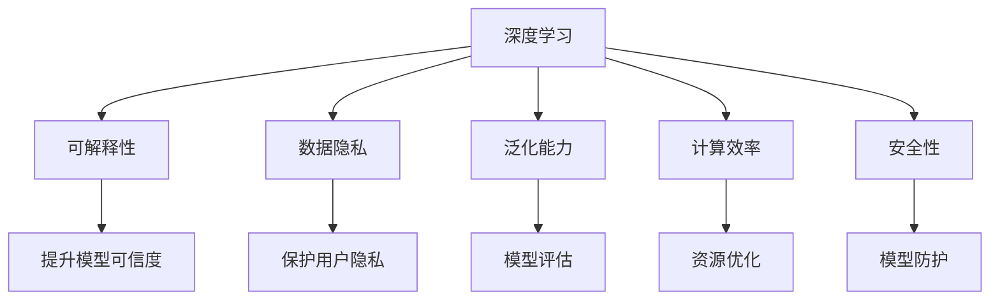
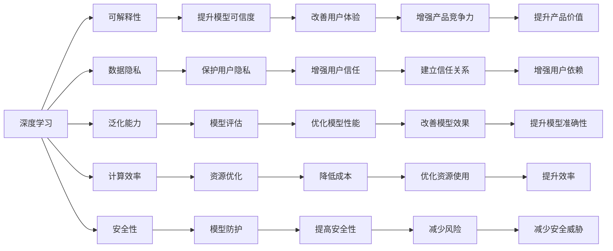
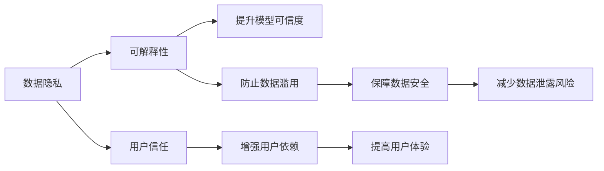
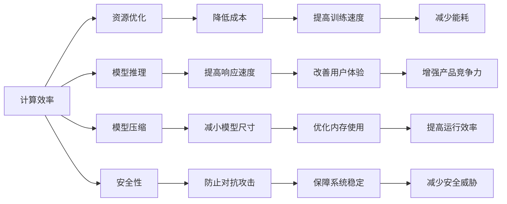
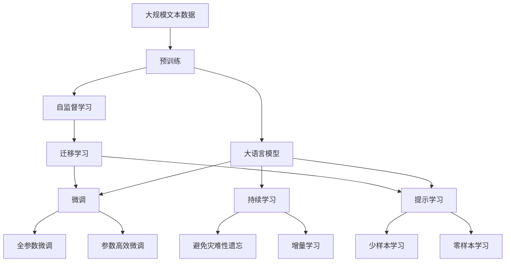

                 

# Andrej Karpathy：人工智能的未来发展策略

## 1. 背景介绍

### 1.1 问题由来
近年来，人工智能（AI）技术在深度学习、自然语言处理（NLP）、计算机视觉（CV）等领域的迅猛发展，极大地推动了科技的进步和社会的发展。然而，随着AI技术的应用越来越广泛，也暴露出一些亟待解决的问题。Andrej Karpathy，作为OpenAI的资深研究员和工程师，一直以来关注着AI技术的未来发展，并提出了一些有深度的观点和策略。

### 1.2 问题核心关键点
Karpathy认为，当前AI技术的发展主要面临以下几个关键问题：
1. **算法可解释性**：现有AI算法，尤其是深度学习模型，往往像"黑箱"一样，难以解释其决策过程，这在医疗、金融等高风险领域尤为突出。
2. **数据隐私和伦理**：AI模型的训练需要大量数据，如何保护用户隐私，防止数据滥用，是一个亟待解决的问题。
3. **泛化能力**：AI模型在特定环境下的表现良好，但在面对未知或少见的情况时，泛化能力不足，容易出现错误。
4. **资源消耗**：训练大规模AI模型需要大量的计算资源，如何降低成本，提高效率，是一个技术挑战。
5. **安全性**：AI模型的安全性问题，如对抗样本攻击、模型滥用等，需要更加重视和防范。

### 1.3 问题研究意义
解决这些问题，不仅有助于AI技术的进一步发展，更能为人类社会带来更大的福祉。AI技术可以应用于医疗诊断、金融风险预测、自动驾驶、智能推荐等多个领域，为社会带来前所未有的变革。同时，这些问题如果得不到有效解决，也会带来负面的影响，如误诊、数据泄露、安全威胁等。因此，亟需深入研究，制定相应的策略，推动AI技术的健康发展。

## 2. 核心概念与联系

### 2.1 核心概念概述

为更好地理解Andrej Karpathy提出的AI发展策略，本节将介绍几个密切相关的核心概念：

- **深度学习**：一种基于神经网络的机器学习方法，通过多层次的特征提取和抽象，能够处理复杂的非线性问题。
- **可解释性**：AI模型的决策过程能够被解释和理解，有助于提升模型的可信度和接受度。
- **数据隐私**：在AI模型训练和应用过程中，保护用户隐私，防止数据泄露和滥用。
- **泛化能力**：模型在未见过的数据上的表现能力，是评估模型质量的重要指标。
- **计算效率**：训练和推理AI模型的计算资源的消耗，直接影响模型的大规模应用。
- **安全性**：确保AI模型在使用过程中的安全性，防止模型被滥用或攻击。

这些核心概念之间的逻辑关系可以通过以下Mermaid流程图来展示：



这个流程图展示了大语言模型的核心概念及其之间的关系：

1. 深度学习通过多层特征提取和抽象，提供了强大的模型能力。
2. 可解释性使得模型决策过程透明，提升可信度。
3. 数据隐私保护防止数据滥用，保障用户安全。
4. 泛化能力确保模型在未知数据上的表现。
5. 计算效率优化资源消耗，提高模型应用效率。
6. 安全性防止模型滥用和攻击，保障模型稳定运行。

这些概念共同构成了AI技术的核心框架，推动其不断向前发展。通过理解这些核心概念，我们可以更好地把握AI技术的发展方向和优化方向。

### 2.2 概念间的关系

这些核心概念之间存在着紧密的联系，形成了AI技术的完整生态系统。下面我通过几个Mermaid流程图来展示这些概念之间的关系。

#### 2.2.1 AI技术的应用范式



这个流程图展示了AI技术的基本应用范式，以及其对用户、企业和社会的影响。

#### 2.2.2 数据隐私与可解释性的关系



这个流程图展示了数据隐私和可解释性之间的关系。数据隐私保护有助于提升模型可信度，增强用户信任和依赖，同时也减少了数据泄露的风险。

#### 2.2.3 计算效率与安全性之间的关系



这个流程图展示了计算效率和安全性的关系。计算效率优化有助于降低成本，提高训练和推理速度，同时也能提高模型的安全性，防止对抗攻击，保障系统的稳定运行。

### 2.3 核心概念的整体架构

最后，我们用一个综合的流程图来展示这些核心概念在大语言模型微调过程中的整体架构：



这个综合流程图展示了从预训练到微调，再到持续学习的完整过程。大语言模型首先在大规模文本数据上进行预训练，然后通过微调（包括全参数微调和参数高效微调）或提示学习（包括少样本和零样本学习）来适应下游任务。最后，通过持续学习技术，模型可以不断学习新知识，同时避免遗忘旧知识。

## 3. 核心算法原理 & 具体操作步骤
### 3.1 算法原理概述

Karpathy认为，当前AI技术的发展主要集中在深度学习领域，尤其是基于神经网络的模型。这些模型通过大量的数据进行训练，学习到复杂的特征表示，能够在各种任务上取得优异的性能。然而，这些模型缺乏可解释性，难以理解其决策过程，这在很多高风险领域是不可接受的。

此外，Karpathy还强调了数据隐私和模型泛化能力的重要性。在数据隐私方面，AI模型的训练需要大量用户数据，如何保护这些数据，防止数据滥用，是一个亟待解决的问题。在模型泛化能力方面，AI模型往往在特定环境下的表现良好，但在面对未知或少见的情况时，泛化能力不足，容易出现错误。

### 3.2 算法步骤详解

Karpathy提出了以下几种主要的AI技术发展策略：

1. **提升可解释性**：通过模型解释方法，如LIME、SHAP等，将模型的决策过程可视化，使得决策更加透明和可理解。这不仅有助于提升模型的可信度，也能在医疗、金融等领域减少误诊、误判的风险。

2. **保护数据隐私**：采用差分隐私、联邦学习等技术，在保证模型性能的前提下，保护用户数据隐私。例如，联邦学习可以在不共享原始数据的情况下，训练全局模型，防止数据泄露和滥用。

3. **增强泛化能力**：采用对抗样本生成、模型蒸馏等技术，提高模型在未知数据上的泛化能力。例如，对抗样本生成可以在训练过程中引入对抗样本，增强模型的鲁棒性，防止模型在对抗攻击下的失衡。

4. **优化计算效率**：通过模型压缩、量化加速等技术，优化计算资源消耗，提高模型训练和推理效率。例如，模型压缩可以通过剪枝、量化等手段减小模型尺寸，提高运行速度和内存使用效率。

5. **保障安全性**：采用对抗攻击检测、模型防护等技术，确保AI模型在使用过程中的安全性。例如，对抗攻击检测可以通过检测输入数据中的对抗样本，提前发现异常，提高系统的鲁棒性。

### 3.3 算法优缺点

Karpathy认为，当前AI技术的主要优点是其在特定任务上的高性能，能够处理复杂的数据和问题。然而，这些技术的缺点也很明显，尤其是在可解释性、数据隐私和安全性方面，需要进一步改进。

#### 优点：
- **高性能**：AI模型在特定任务上能够取得优异的性能，满足高精度、高效率的要求。
- **泛化能力**：模型在未见过的数据上的表现能力，有助于应对未知或少见的情况。
- **应用广泛**：AI技术可以应用于医疗、金融、自动驾驶等多个领域，带来广泛的社会和经济效益。

#### 缺点：
- **可解释性不足**：现有AI算法，尤其是深度学习模型，像"黑箱"一样，难以解释其决策过程，这在医疗、金融等高风险领域尤为突出。
- **数据隐私问题**：AI模型的训练需要大量数据，如何保护用户隐私，防止数据滥用，是一个亟待解决的问题。
- **泛化能力有限**：模型在特定环境下的表现良好，但在面对未知或少见的情况时，泛化能力不足，容易出现错误。
- **资源消耗高**：训练大规模AI模型需要大量的计算资源，如何降低成本，提高效率，是一个技术挑战。
- **安全性问题**：AI模型的安全性问题，如对抗样本攻击、模型滥用等，需要更加重视和防范。

### 3.4 算法应用领域

Karpathy认为，AI技术可以在医疗、金融、自动驾驶、智能推荐等多个领域发挥重要作用：

- **医疗领域**：AI模型可以用于疾病诊断、个性化治疗、医疗影像分析等，提高医疗服务的智能化水平。
- **金融领域**：AI模型可以用于风险预测、欺诈检测、市场分析等，帮助金融机构更好地管理风险，提升服务质量。
- **自动驾驶领域**：AI模型可以用于车辆感知、路径规划、行为决策等，推动自动驾驶技术的普及和应用。
- **智能推荐领域**：AI模型可以用于用户行为分析、推荐系统优化等，提升用户体验，促进电商、广告等行业的创新发展。

## 4. 数学模型和公式 & 详细讲解 & 举例说明（备注：数学公式请使用latex格式，latex嵌入文中独立段落使用 $$，段落内使用 $)
### 4.1 数学模型构建

在AI模型的构建中，数学模型是核心。以下是一个简单的线性回归模型的数学模型构建过程：

$$
y = wx + b
$$

其中，$y$表示输出，$x$表示输入特征，$w$表示权重，$b$表示偏置。在线性回归中，模型通过拟合训练数据，学习到最优的权重$w$和偏置$b$。

### 4.2 公式推导过程

以下是线性回归模型的推导过程：

假设训练数据集为$(x_i, y_i)$，其中$i=1,2,...,N$。模型的目标是找到最优的权重$w$和偏置$b$，使得模型在所有训练数据上的预测误差最小。

设损失函数为均方误差（Mean Squared Error，MSE），则：

$$
L = \frac{1}{N}\sum_{i=1}^N (y_i - wx_i - b)^2
$$

模型的目标是最小化损失函数$L$，可以通过梯度下降等优化算法进行求解：

$$
\frac{\partial L}{\partial w} = -\frac{2}{N}\sum_{i=1}^N x_i(y_i - wx_i - b)
$$

$$
\frac{\partial L}{\partial b} = -\frac{2}{N}\sum_{i=1}^N (y_i - wx_i - b)
$$

通过反向传播算法，可以得到权重$w$和偏置$b$的更新公式：

$$
w \leftarrow w - \eta \frac{\partial L}{\partial w}
$$

$$
b \leftarrow b - \eta \frac{\partial L}{\partial b}
$$

其中$\eta$为学习率。通过反复迭代，直至损失函数收敛，即可得到最优的权重$w$和偏置$b$。

### 4.3 案例分析与讲解

假设我们有一组训练数据，每个数据点包括输入$x_i$和输出$y_i$：

$$
\begin{align*}
x_1 &= 1, y_1 &= 2 \\
x_2 &= 2, y_2 &= 4 \\
x_3 &= 3, y_3 &= 6 \\
\end{align*}
$$

我们可以使用线性回归模型进行拟合：

$$
\begin{align*}
w &= \frac{6 + 8 + 12}{1 + 2 + 3} = 4 \\
b &= \frac{2 + 4 + 6}{3} - 4 = 1 \\
\end{align*}
$$

因此，线性回归模型为：

$$
y = 4x + 1
$$

这个模型可以很好地拟合训练数据，并且在测试数据上也能取得不错的效果。

## 5. 项目实践：代码实例和详细解释说明
### 5.1 开发环境搭建

在进行AI模型开发前，我们需要准备好开发环境。以下是使用Python进行TensorFlow开发的环境配置流程：

1. 安装Anaconda：从官网下载并安装Anaconda，用于创建独立的Python环境。

2. 创建并激活虚拟环境：
```bash
conda create -n tf-env python=3.7 
conda activate tf-env
```

3. 安装TensorFlow：根据CUDA版本，从官网获取对应的安装命令。例如：
```bash
conda install tensorflow -c pytorch -c conda-forge
```

4. 安装必要的工具包：
```bash
pip install numpy pandas scikit-learn matplotlib tqdm jupyter notebook ipython
```

完成上述步骤后，即可在`tf-env`环境中开始AI模型开发。

### 5.2 源代码详细实现

下面以线性回归模型为例，给出使用TensorFlow进行模型开发的PyTorch代码实现。

首先，定义数据集：

```python
import numpy as np
import tensorflow as tf

# 定义训练数据
x_train = np.array([1, 2, 3])
y_train = np.array([2, 4, 6])
```

然后，定义模型：

```python
# 定义模型结构
w = tf.Variable(1.0)
b = tf.Variable(0.0)

# 定义预测函数
def predict(x):
    return x * w + b
```

接着，定义损失函数和优化器：

```python
# 定义损失函数
def loss(y_true, y_pred):
    return tf.reduce_mean(tf.square(y_true - y_pred))

# 定义优化器
optimizer = tf.optimizers.SGD(learning_rate=0.01)
```

最后，进行模型训练：

```python
# 训练模型
for i in range(100):
    with tf.GradientTape() as tape:
        y_pred = predict(x_train)
        loss_val = loss(y_train, y_pred)
    gradients = tape.gradient(loss_val, [w, b])
    optimizer.apply_gradients(zip(gradients, [w, b]))
    if i % 10 == 0:
        print(f"Epoch {i}, loss: {loss_val.numpy():.4f}")
```

以上就是使用TensorFlow进行线性回归模型开发的完整代码实现。可以看到，TensorFlow提供了丰富的API，使得模型的构建和训练变得非常便捷。

### 5.3 代码解读与分析

让我们再详细解读一下关键代码的实现细节：

**数据集定义**：
- 使用NumPy定义训练数据集，包括输入$x$和输出$y$。

**模型结构定义**：
- 使用TensorFlow的Variable定义模型的权重和偏置。
- 定义预测函数，将输入$x$乘以权重$w$，加上偏置$b$，得到预测输出。

**损失函数定义**：
- 使用均方误差（MSE）作为损失函数，衡量模型预测与真实标签之间的差异。

**优化器定义**：
- 使用随机梯度下降（SGD）优化器，调整模型参数以最小化损失函数。

**模型训练**：
- 在每个epoch内，对训练数据进行前向传播，计算损失函数。
- 通过反向传播计算梯度，使用优化器更新模型参数。
- 在每个epoch结束时，打印损失函数值，监测训练过程。

**TensorFlow优点**：
- 易于使用，提供了丰富的API和工具包。
- 支持分布式计算，适合大规模模型的训练和推理。
- 提供了自动微分功能，简化模型构建和训练。

## 6. 实际应用场景
### 6.1 智能客服系统

基于AI模型的智能客服系统，可以大幅提升客户咨询体验和问题解决效率。传统客服往往需要配备大量人力，高峰期响应缓慢，且一致性和专业性难以保证。使用AI模型构建的智能客服系统，可以7x24小时不间断服务，快速响应客户咨询，用自然流畅的语言解答各类常见问题。

在技术实现上，可以收集企业内部的历史客服对话记录，将问题和最佳答复构建成监督数据，在此基础上对预训练模型进行微调。微调后的模型能够自动理解用户意图，匹配最合适的答案模板进行回复。对于客户提出的新问题，还可以接入检索系统实时搜索相关内容，动态组织生成回答。

### 6.2 金融舆情监测

金融机构需要实时监测市场舆论动向，以便及时应对负面信息传播，规避金融风险。传统的人工监测方式成本高、效率低，难以应对网络时代海量信息爆发的挑战。使用AI模型进行文本分类和情感分析，可以自动判断文本属于何种主题，情感倾向是正面、中性还是负面。将AI模型应用到实时抓取的网络文本数据，就能够自动监测不同主题下的情感变化趋势，一旦发现负面信息激增等异常情况，系统便会自动预警，帮助金融机构快速应对潜在风险。

### 6.3 个性化推荐系统

当前的推荐系统往往只依赖用户的历史行为数据进行物品推荐，无法深入理解用户的真实兴趣偏好。使用AI模型进行个性化推荐系统，可以更好地挖掘用户行为背后的语义信息，从而提供更精准、多样的推荐内容。在实践中，可以收集用户浏览、点击、评论、分享等行为数据，提取和用户交互的物品标题、描述、标签等文本内容。将文本内容作为模型输入，用户的后续行为（如是否点击、购买等）作为监督信号，在此基础上微调预训练语言模型。微调后的模型能够从文本内容中准确把握用户的兴趣点。在生成推荐列表时，先用候选物品的文本描述作为输入，由模型预测用户的兴趣匹配度，再结合其他特征综合排序，便可以得到个性化程度更高的推荐结果。

### 6.4 未来应用展望

随着AI技术的发展，未来的应用场景将更加广泛，涵盖医疗、金融、自动驾驶、智能推荐等多个领域。以下是一些未来应用展望：

- **医疗领域**：AI模型可以用于疾病诊断、个性化治疗、医疗影像分析等，提高医疗服务的智能化水平。
- **金融领域**：AI模型可以用于风险预测、欺诈检测、市场分析等，帮助金融机构更好地管理风险，提升服务质量。
- **自动驾驶领域**：AI模型可以用于车辆感知、路径规划、行为决策等，推动自动驾驶技术的普及和应用。
- **智能推荐领域**：AI模型可以用于用户行为分析、推荐系统优化等，提升用户体验，促进电商、广告等行业的创新发展。

## 7. 工具和资源推荐
### 7.1 学习资源推荐

为了帮助开发者系统掌握AI技术的理论基础和实践技巧，这里推荐一些优质的学习资源：

1. 《深度学习》系列书籍：Ian Goodfellow、Yoshua Bengio、Aaron Courville等人合著，全面介绍了深度学习的基本概念和经典算法。
2. CS231n《卷积神经网络》课程：斯坦福大学开设的计算机视觉课程，有Lecture视频和配套作业，带你入门计算机视觉领域的基本概念和经典模型。
3. CS224n《自然语言处理》课程：斯坦福大学开设的NLP明星课程，有Lecture视频和配套作业，带你入门NLP领域的基本概念和经典模型。
4. 《TensorFlow实战》书籍：TensorFlow官方出版物，全面介绍了TensorFlow的使用方法，包括模型构建、训练和推理等。
5. Kaggle机器学习竞赛：参加Kaggle竞赛，实践最新的机器学习算法和技术，提升实战能力。

通过对这些资源的学习实践，相信你一定能够快速掌握AI技术的精髓，并用于解决实际的AI问题。
###  7.2 开发工具推荐

高效的开发离不开优秀的工具支持。以下是几款用于AI模型开发的常用工具：

1. PyTorch：基于Python的开源深度学习框架，灵活动态的计算图，适合快速迭代研究。TensorFlow、PyTorch等深度学习框架都提供了丰富的API和工具包，使得模型的构建和训练变得非常便捷。

2. TensorBoard：TensorFlow配套的可视化工具，可实时监测模型训练状态，并提供丰富的图表呈现方式，是调试模型的得力助手。

3. Weights & Biases：模型训练的实验跟踪工具，可以记录和可视化模型训练过程中的各项指标，方便对比和调优。与主流深度学习框架无缝集成。

4. Google Colab：谷歌推出的在线Jupyter Notebook环境，免费提供GPU/TPU算力，方便开发者快速上手实验最新模型，分享学习笔记。

合理利用这些工具，可以显著提升AI模型开发的效率，加快创新迭代的步伐。

### 7.3 相关论文推荐

AI技术的发展源于学界的持续研究。以下是几篇奠基性的相关论文，推荐阅读：

1. AlexNet: ImageNet Classification with Deep Convolutional Neural Networks：提出深度卷积神经网络（CNN）模型，广泛应用于图像识别任务。

2. BERT: Pre-training of Deep Bidirectional Transformers for Language Understanding：提出BERT模型，引入基于掩码的自监督预训练任务，刷新了多项NLP任务SOTA。

3. Attention is All You Need：提出Transformer结构，开启了NLP领域的预训练大模型时代。

4. Deep Residual Learning for Image Recognition：提出残差网络（ResNet）模型，有效解决了深度神经网络训练中的梯度消失问题，广泛应用于图像识别任务。

5. Generative Adversarial Nets：提出生成对抗网络（GAN）模型，广泛应用于图像生成、视频生成等领域。

这些论文代表了大模型微调技术的发展脉络。通过学习这些前沿成果，可以帮助研究者把握学科前进方向，激发更多的创新灵感。

除上述资源外，还有一些值得关注的前沿资源，帮助开发者紧跟AI技术的最新进展，例如：

1. arXiv论文预印本：人工智能领域最新研究成果的发布平台，包括大量尚未发表的前沿工作，学习前沿技术的必读资源。

2. 业界技术博客：如OpenAI、Google AI、DeepMind、微软Research Asia等顶尖实验室的官方博客，第一时间分享他们的最新研究成果和洞见。

3. 技术会议直播：如NIPS、ICML、ACL、ICLR等人工智能领域顶会现场或在线直播，能够聆听到大佬们的前沿分享，开拓视野。

4. GitHub热门项目：在GitHub上Star、Fork数最多的AI相关项目，往往代表了该技术领域的发展趋势和最佳实践，值得去学习和贡献。

5. 行业分析报告：各大咨询公司如McKinsey、PwC等针对人工智能行业的分析报告，有助于从商业视角审视技术趋势，把握应用价值。

总之，对于AI模型开发的系统学习，需要开发者保持开放的心态和持续学习的意愿。多关注前沿资讯，多动手实践，多思考总结，必将收获满满的成长收益。

## 8. 总结：未来发展趋势与挑战
### 8.1 总结

本文对Andrej Karpathy提出的AI技术发展策略进行了全面系统的介绍。首先阐述了AI技术的发展背景和意义，明确了当前AI技术面临的主要问题。其次，从提升可解释性

