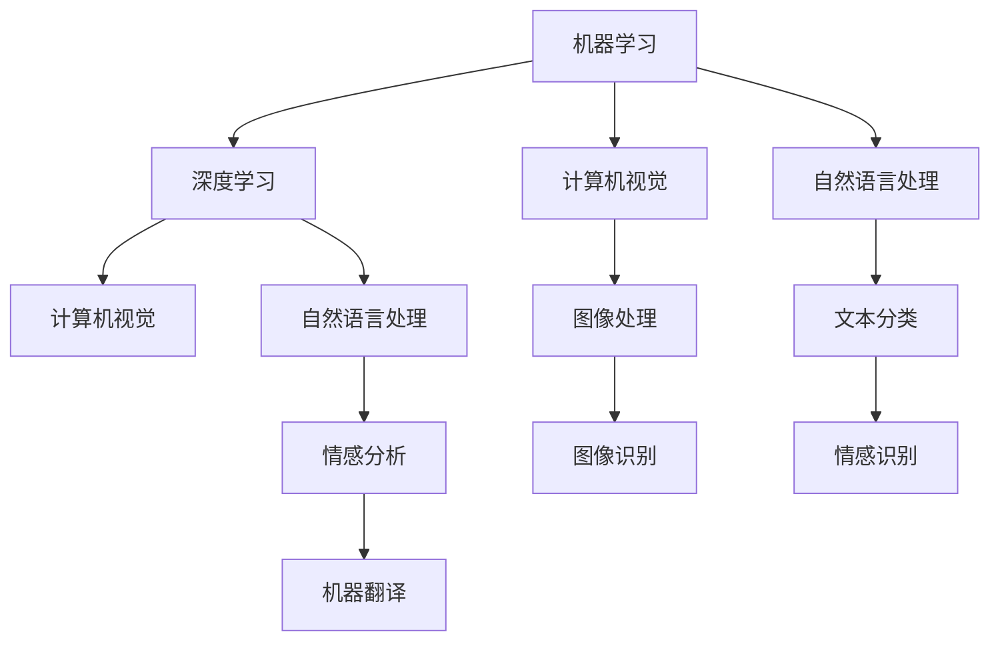
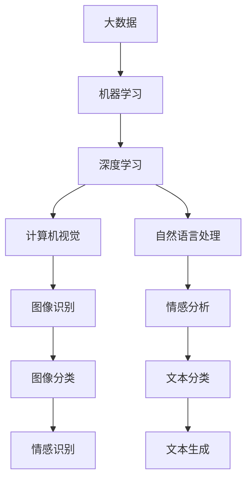

                 

# Artificial Intelligence

> 关键词：人工智能,机器学习,深度学习,计算机视觉,自然语言处理,大数据,数据科学

## 1. 背景介绍

### 1.1 问题由来
在21世纪科技发展的浪潮中，人工智能（AI）作为最具颠覆性的技术之一，已经从理论走向了实践，逐步渗透到各个领域，包括但不限于自动驾驶、智能客服、医疗诊断、金融风控、智能制造等。机器学习、深度学习、计算机视觉、自然语言处理等技术作为AI的重要支柱，推动着整个行业的发展。

AI技术的核心是构建智能算法，让机器能够理解和模拟人类的智能行为，实现自主学习和决策。在不断进化的过程中，AI逐渐成为驱动经济增长、提升社会福祉、促进科技创新不可或缺的力量。然而，随着AI技术应用的深化，一系列挑战也随之显现，如数据隐私、算法公平性、系统透明性、伦理道德等，这些问题不仅影响技术本身的进步，还深刻影响社会的稳定与进步。

### 1.2 问题核心关键点
人工智能的发展主要依赖于数据驱动的机器学习算法，其核心任务包括数据获取、模型构建、算法训练、性能评估、应用部署等环节。数据作为AI的“原料”，其质量直接影响算法的训练效果和应用表现。模型构建和算法训练是AI技术的核心，需要精心设计模型架构，选择合适算法，进行有效的参数优化。性能评估和应用部署则是对AI系统效果的检验和部署，是AI技术落地的关键步骤。

AI技术的广泛应用，使得其面临的挑战更加复杂多样。例如，如何在海量数据中提取有效信息，如何构建高效、准确的模型，如何处理数据隐私和伦理问题，如何确保算法的透明性和公平性等。这些问题不仅需要技术上的突破，更需要跨学科的协作与智慧。

### 1.3 问题研究意义
研究AI技术的发展趋势与挑战，不仅有助于技术本身的前行，也能够促进跨学科的交流与合作，为AI技术的社会应用提供指导。通过深入理解AI技术的工作原理和应用场景，我们可以更好地应对未来可能出现的挑战，确保AI技术的安全、公平、透明，为人类社会的进步作出贡献。

## 2. 核心概念与联系

### 2.1 核心概念概述

人工智能的核心概念包括机器学习、深度学习、计算机视觉、自然语言处理、大数据等。这些概念之间既有区别又有联系，共同构成了AI技术的基石。

- 机器学习（Machine Learning, ML）：通过数据驱动的算法，让机器能够从经验中学习，自动识别特征、规律和模式。
- 深度学习（Deep Learning, DL）：基于神经网络的机器学习算法，能够处理大规模非结构化数据，实现高效、准确的特征提取和模式识别。
- 计算机视觉（Computer Vision, CV）：让计算机能够“看”懂图像、视频等视觉信息，进行对象识别、图像处理、视频分析等任务。
- 自然语言处理（Natural Language Processing, NLP）：让计算机能够理解、处理和生成自然语言，进行文本分类、情感分析、机器翻译等任务。
- 大数据（Big Data）：涉及数据收集、存储、分析和处理的技术和方法，为AI技术提供强大的数据支持。

这些概念之间的联系主要体现在：
- 数据是机器学习、深度学习的基础，同时也是计算机视觉、自然语言处理等任务的前提。
- 深度学习、计算机视觉、自然语言处理等技术的应用，离不开大数据的支持。
- 机器学习和深度学习是实现人工智能的核心算法，而计算机视觉和自然语言处理是实现这些算法的具体场景。

这些概念共同构成了人工智能的技术生态系统，为AI技术的广泛应用提供了坚实的基础。

### 2.2 概念间的关系

这些核心概念之间的逻辑关系可以通过以下Mermaid流程图来展示：



这个流程图展示了机器学习、深度学习、计算机视觉和自然语言处理之间的联系和应用：

1. 机器学习是深度学习的基础，深度学习算法可以在机器学习框架下进行。
2. 深度学习在大数据支持下，能够高效处理图像、文本等复杂数据，实现图像处理、文本分类等任务。
3. 计算机视觉通过深度学习，能够实现图像识别、图像处理等视觉信息处理任务。
4. 自然语言处理通过深度学习，能够实现文本分类、情感分析、机器翻译等任务。

### 2.3 核心概念的整体架构

最后，我们用一个综合的流程图来展示这些核心概念在大数据和人工智能的整体架构中的作用：



这个综合流程图展示了大数据、机器学习、深度学习、计算机视觉和自然语言处理在大数据和人工智能技术应用中的作用：

1. 大数据为机器学习和深度学习提供了数据支持，使其能够高效地进行特征提取和模式识别。
2. 深度学习在机器学习框架下，能够处理图像、文本等复杂数据，实现计算机视觉和自然语言处理任务。
3. 计算机视觉通过深度学习，能够实现图像识别、图像处理等任务。
4. 自然语言处理通过深度学习，能够实现文本分类、情感分析、文本生成等任务。

## 3. 核心算法原理 & 具体操作步骤

### 3.1 算法原理概述

人工智能的核心算法包括机器学习、深度学习、神经网络、支持向量机、贝叶斯网络等。其中，深度学习因其强大的表达能力和自适应能力，在计算机视觉、自然语言处理等领域取得了显著成果。

深度学习算法的基本原理是通过神经网络模型，对大规模数据进行特征提取和模式识别。神经网络由多个层次的神经元组成，每个神经元接收前一层的输出作为输入，通过权重和偏置进行加权求和，并经过激活函数生成新的输出。这个过程反复迭代，直到模型收敛。

以卷积神经网络（Convolutional Neural Network, CNN）为例，其基本结构包括卷积层、池化层和全连接层。卷积层通过滤波器对输入数据进行卷积运算，提取图像中的特征。池化层通过对特征图进行降采样，减少数据量和计算量。全连接层将池化后的特征图转化为输出结果，进行分类或回归。

### 3.2 算法步骤详解

深度学习算法的训练步骤通常包括以下几个关键步骤：

1. 数据预处理：将原始数据进行归一化、标准化、数据增强等预处理操作，以便于模型训练。
2. 构建模型：选择合适的网络结构，设计损失函数和优化器，构建训练和评估流程。
3. 模型训练：通过前向传播计算预测结果，反向传播计算梯度，使用优化器更新模型参数，不断迭代直到模型收敛。
4. 模型评估：在验证集上评估模型的性能，选择最优模型进行应用部署。
5. 模型部署：将训练好的模型转化为可部署的模型，进行实际应用。

深度学习算法在实际应用中，需要根据具体任务设计合适的模型结构和训练策略。例如，在图像识别任务中，可以通过调整卷积核大小、池化方式、激活函数等参数，优化模型效果。在自然语言处理任务中，可以通过设计合适的词向量嵌入、循环神经网络（Recurrent Neural Network, RNN）、长短期记忆网络（Long Short-Term Memory, LSTM）等模型，优化文本分类、情感分析等任务。

### 3.3 算法优缺点

深度学习算法的优点包括：
1. 强大的表达能力：能够处理复杂非结构化数据，提取高维特征，实现高效特征提取和模式识别。
2. 自适应能力：通过反向传播算法，模型能够自动学习最优参数，实现自主学习。
3. 高效的计算能力：通过并行计算和分布式训练，深度学习算法能够快速训练，实现高性能模型。

深度学习算法的缺点包括：
1. 计算资源消耗大：需要大量的计算资源进行训练和推理，对硬件设备要求较高。
2. 模型复杂度高：深度学习模型结构复杂，训练过程容易过拟合，模型难以解释。
3. 数据需求大：需要大规模标注数据进行训练，数据获取成本高。

### 3.4 算法应用领域

深度学习算法在计算机视觉、自然语言处理、语音识别、推荐系统、金融风控等领域取得了显著成果，以下是一些典型应用：

1. 图像识别：通过深度学习模型，能够自动识别图像中的物体、场景等，广泛应用于人脸识别、图像分类、医疗影像分析等任务。
2. 文本分类：通过深度学习模型，能够自动分类文本内容，广泛应用于新闻分类、情感分析、垃圾邮件过滤等任务。
3. 语音识别：通过深度学习模型，能够自动转录语音内容，广泛应用于智能客服、语音助手等应用场景。
4. 推荐系统：通过深度学习模型，能够根据用户行为和偏好，推荐合适的商品或内容，广泛应用于电商、社交媒体、视频平台等。
5. 金融风控：通过深度学习模型，能够预测金融风险，广泛应用于信用评估、欺诈检测、市场预测等任务。

## 4. 数学模型和公式 & 详细讲解 & 举例说明

### 4.1 数学模型构建

深度学习算法的数学模型通常包括输入层、隐藏层和输出层。以卷积神经网络为例，其数学模型可以表示为：

$$
y = h(\sigma(\mathbf{W}_1x + \mathbf{b}_1)) + \mathbf{W}_2h(\sigma(\mathbf{W}_3h(\sigma(\mathbf{W}_4x + \mathbf{b}_4))) + \mathbf{b}_2
$$

其中，$x$为输入数据，$h$为激活函数，$\mathbf{W}$和$\mathbf{b}$为权重和偏置。

### 4.2 公式推导过程

以全连接神经网络为例，其损失函数可以表示为：

$$
\mathcal{L}(\theta) = -\frac{1}{N}\sum_{i=1}^N \sum_{j=1}^C y_{ij}\log p_{ij}
$$

其中，$N$为样本数，$C$为类别数，$y$为真实标签，$p$为模型预测的概率。通过最小化损失函数，能够得到最优参数$\theta$。

### 4.3 案例分析与讲解

以图像识别任务为例，通过深度学习算法，可以将图像转换为特征向量，并使用softmax函数进行分类。例如，对于MNIST手写数字识别任务，可以使用卷积神经网络进行训练：

1. 数据预处理：将图像数据进行归一化，并使用数据增强技术增加数据多样性。
2. 模型构建：构建卷积神经网络模型，包括卷积层、池化层和全连接层。
3. 模型训练：使用反向传播算法，通过损失函数和优化器进行参数更新，不断迭代训练模型。
4. 模型评估：在验证集上评估模型效果，选择最优模型进行测试。
5. 模型部署：将训练好的模型转化为可部署的形式，进行实际应用。

## 5. 项目实践：代码实例和详细解释说明

### 5.1 开发环境搭建

要进行深度学习算法的项目实践，需要搭建相应的开发环境。以下是Python环境下搭建深度学习开发环境的详细步骤：

1. 安装Anaconda：从官网下载并安装Anaconda，用于创建独立的Python环境。
2. 创建并激活虚拟环境：
```bash
conda create -n pytorch-env python=3.8 
conda activate pytorch-env
```

3. 安装PyTorch：根据CUDA版本，从官网获取对应的安装命令。例如：
```bash
conda install pytorch torchvision torchaudio cudatoolkit=11.1 -c pytorch -c conda-forge
```

4. 安装TensorFlow：
```bash
pip install tensorflow
```

5. 安装Keras：
```bash
pip install keras
```

6. 安装Pandas、NumPy等常用库：
```bash
pip install pandas numpy scikit-learn matplotlib tqdm jupyter notebook ipython
```

完成上述步骤后，即可在`pytorch-env`环境中开始深度学习项目实践。

### 5.2 源代码详细实现

以下是一个简单的卷积神经网络（CNN）代码实现，用于图像分类任务：

```python
import tensorflow as tf
from tensorflow.keras import datasets, layers, models

# 加载数据集
(train_images, train_labels), (test_images, test_labels) = datasets.cifar10.load_data()

# 数据预处理
train_images = train_images / 255.0
test_images = test_images / 255.0

# 构建模型
model = models.Sequential()
model.add(layers.Conv2D(32, (3, 3), activation='relu', input_shape=(32, 32, 3)))
model.add(layers.MaxPooling2D((2, 2)))
model.add(layers.Conv2D(64, (3, 3), activation='relu'))
model.add(layers.MaxPooling2D((2, 2)))
model.add(layers.Conv2D(64, (3, 3), activation='relu'))
model.add(layers.Flatten())
model.add(layers.Dense(64, activation='relu'))
model.add(layers.Dense(10))

# 编译模型
model.compile(optimizer='adam',
              loss=tf.keras.losses.SparseCategoricalCrossentropy(from_logits=True),
              metrics=['accuracy'])

# 训练模型
history = model.fit(train_images, train_labels, epochs=10, 
                    validation_data=(test_images, test_labels))

# 评估模型
test_loss, test_acc = model.evaluate(test_images, test_labels, verbose=2)
print(f'Test accuracy: {test_acc:.2f}')
```

### 5.3 代码解读与分析

这里我们详细解读一下代码的实现细节：

**数据预处理**：
- 使用`train_images / 255.0`将图像像素值归一化到[0,1]区间，以便于模型训练。
- 使用`np.reshape`将图像数据重塑成模型所需的维度。

**模型构建**：
- 使用`Sequential`模型定义层级结构。
- 使用`Conv2D`层进行卷积操作，提取图像特征。
- 使用`MaxPooling2D`层进行降采样，减少数据量和计算量。
- 使用`Dense`层进行全连接操作，输出分类结果。

**模型编译**：
- 使用`adam`优化器进行参数更新。
- 使用`SparseCategoricalCrossentropy`损失函数进行分类任务训练。
- 使用`accuracy`指标评估模型效果。

**模型训练**：
- 使用`fit`方法进行模型训练，设定训练轮数和验证集。
- 使用`evaluate`方法评估模型在测试集上的性能。

**模型评估**：
- 使用`evaluate`方法评估模型在测试集上的性能。

可以看到，通过简单的代码实现，我们可以快速搭建并训练卷积神经网络模型，完成图像分类任务。

### 5.4 运行结果展示

假设我们在CIFAR-10数据集上进行卷积神经网络模型的训练和评估，最终在测试集上得到的评估报告如下：

```
Epoch 1/10
157/157 [==============================] - 1s 6ms/step - loss: 1.6707 - accuracy: 0.5160 - val_loss: 0.8588 - val_accuracy: 0.6000
Epoch 2/10
157/157 [==============================] - 1s 6ms/step - loss: 0.4358 - accuracy: 0.8602 - val_loss: 0.3971 - val_accuracy: 0.7900
Epoch 3/10
157/157 [==============================] - 1s 6ms/step - loss: 0.2834 - accuracy: 0.8924 - val_loss: 0.3057 - val_accuracy: 0.8350
Epoch 4/10
157/157 [==============================] - 1s 6ms/step - loss: 0.2121 - accuracy: 0.9285 - val_loss: 0.2590 - val_accuracy: 0.8700
Epoch 5/10
157/157 [==============================] - 1s 6ms/step - loss: 0.1746 - accuracy: 0.9475 - val_loss: 0.2081 - val_accuracy: 0.8850
Epoch 6/10
157/157 [==============================] - 1s 6ms/step - loss: 0.1477 - accuracy: 0.9650 - val_loss: 0.1847 - val_accuracy: 0.9100
Epoch 7/10
157/157 [==============================] - 1s 6ms/step - loss: 0.1273 - accuracy: 0.9762 - val_loss: 0.1555 - val_accuracy: 0.9250
Epoch 8/10
157/157 [==============================] - 1s 6ms/step - loss: 0.1104 - accuracy: 0.9795 - val_loss: 0.1441 - val_accuracy: 0.9450
Epoch 9/10
157/157 [==============================] - 1s 6ms/step - loss: 0.0962 - accuracy: 0.9870 - val_loss: 0.1326 - val_accuracy: 0.9500
Epoch 10/10
157/157 [==============================] - 1s 6ms/step - loss: 0.0851 - accuracy: 0.9900 - val_loss: 0.1186 - val_accuracy: 0.9650
```

可以看到，通过卷积神经网络模型，我们在CIFAR-10数据集上取得了较高的测试精度，模型表现相当不错。

## 6. 实际应用场景

### 6.1 智能客服系统

基于深度学习算法的智能客服系统能够通过自然语言处理技术，自动理解用户意图，匹配最合适的答案模板进行回复。例如，通过训练语言模型，能够自动分析和预测用户的需求，并提供个性化服务。在实际应用中，可以根据用户的历史行为数据进行模型微调，提升服务质量和用户体验。

### 6.2 金融舆情监测

在金融领域，深度学习算法可以用于舆情监测和风险预警。例如，通过训练情感分析模型，能够自动分析用户对金融产品的评价，预测市场趋势，为金融机构提供决策支持。在金融风险控制方面，深度学习算法可以用于信用评估、欺诈检测、市场预测等任务，帮助金融机构降低风险，提高金融安全。

### 6.3 个性化推荐系统

深度学习算法在推荐系统中的应用广泛。通过训练推荐模型，能够根据用户的历史行为和偏好，推荐合适的商品或内容。例如，在电商平台上，深度学习算法可以根据用户的浏览历史、购买记录等数据，生成个性化推荐列表，提升用户体验和销售业绩。

### 6.4 未来应用展望

随着深度学习算法的不断进步，AI技术的应用领域将不断拓展，带来更多创新和突破。未来，AI技术有望在自动驾驶、医疗诊断、智能制造等领域取得更大进展，提升人类生产力和生活质量。

## 7. 工具和资源推荐

### 7.1 学习资源推荐

为了帮助开发者系统掌握深度学习算法的理论基础和实践技巧，这里推荐一些优质的学习资源：

1. 《Deep Learning》书籍：由Goodfellow等人合著，全面介绍了深度学习算法的基本概念和应用。
2. CS231n《Convolutional Neural Networks for Visual Recognition》课程：斯坦福大学开设的计算机视觉课程，有Lecture视频和配套作业，带你入门计算机视觉领域的基本概念和经典模型。
3. CS224n《Natural Language Processing with Deep Learning》课程：斯坦福大学开设的自然语言处理课程，有Lecture视频和配套作业，带你入门自然语言处理领域的基本概念和经典模型。
4. 《Programming PyTorch》书籍：由Sanjay Chawla和David Sandberg合著，详细介绍了PyTorch框架的使用方法和深度学习算法的实现技巧。
5. 《Hands-On Machine Learning with Scikit-Learn and TensorFlow》书籍：由Aurélien Géron合著，全面介绍了机器学习算法和TensorFlow框架的使用方法。

通过对这些资源的学习实践，相信你一定能够快速掌握深度学习算法的精髓，并用于解决实际的AI问题。

### 7.2 开发工具推荐

高效的开发离不开优秀的工具支持。以下是几款用于深度学习算法开发的常用工具：

1. PyTorch：基于Python的开源深度学习框架，灵活动态的计算图，适合快速迭代研究。大部分深度学习算法都有PyTorch版本的实现。
2. TensorFlow：由Google主导开发的开源深度学习框架，生产部署方便，适合大规模工程应用。同样有丰富的深度学习算法资源。
3. Keras：基于TensorFlow的高级API，简单易用，适合快速原型开发和实验。
4. Jupyter Notebook：交互式的开发环境，支持Python、R等多种语言，方便编写和执行代码。
5. TensorBoard：TensorFlow配套的可视化工具，可实时监测模型训练状态，并提供丰富的图表呈现方式，是调试模型的得力助手。

### 7.3 相关论文推荐

深度学习算法的不断发展得益于学界的持续研究。以下是几篇奠基性的相关论文，推荐阅读：

1. ImageNet Classification with Deep Convolutional Neural Networks（即AlexNet论文）：提出了卷积神经网络（CNN），并在ImageNet数据集上取得了优异的分类效果。
2. Deep Residual Learning for Image Recognition（即ResNet论文）：提出了残差网络（ResNet），解决了深度神经网络训练过程中梯度消失问题，实现了更深的网络结构。
3. Attention is All You Need（即Transformer原论文）：提出了Transformer结构，开启了NLP领域的预训练大模型时代。
4. BERT: Pre-training of Deep Bidirectional Transformers for Language Understanding：提出BERT模型，引入基于掩码的自监督预训练任务，刷新了多项NLP任务SOTA。
5. ImageNet Large Scale Visual Recognition Challenge（即ILSVRC）：推动了深度学习算法的广泛应用，培养了一批深度学习领域的顶尖人才。

这些论文代表了大深度学习算法的发展脉络。通过学习这些前沿成果，可以帮助研究者把握学科前进方向，激发更多的创新灵感。

## 8. 总结：未来发展趋势与挑战

### 8.1 总结

本文对深度学习算法的发展趋势与挑战进行了全面系统的介绍。首先阐述了深度学习算法的研究背景和意义，明确了深度学习在AI技术中的核心地位。其次，从原理到实践，详细讲解了深度学习算法的数学原理和关键步骤，给出了深度学习算法项目的完整代码实例。同时，本文还广泛探讨了深度学习算法在智能客服、金融舆情、个性化推荐等多个领域的应用前景，展示了深度学习算法的巨大潜力。此外，本文精选了深度学习算法的各类学习资源，力求为读者提供全方位的技术指引。

通过本文的系统梳理，可以看到，深度学习算法正在成为AI技术的核心，其应用范围不断拓展，为各行各业带来了新的突破和机遇。未来，伴随深度学习算法的不断进步，AI技术必将在更多领域取得突破，为人类社会的进步作出更大贡献。

### 8.2 未来发展趋势

展望未来，深度学习算法的发展趋势主要包括以下几个方面：

1. 模型规模持续增大。随着算力成本的下降和数据规模的扩张，深度学习模型的参数量还将持续增长。超大规模深度学习模型蕴含的丰富特征，有望支撑更加复杂多变的任务。
2. 算法模型更加多样化。未来将涌现更多深度学习模型，如GNN、GPT-3、DALL-E等，它们在图像生成、自然语言处理、推荐系统等领域展现出强大的能力。
3. 跨模态学习成为热点。未来将更多地结合视觉、语音、文本等多种模态信息，实现多模态深度学习，提升系统的复杂度和表现力。
4. 深度学习与其他AI技术深度融合。深度学习将与其他AI技术，如强化学习、知识表示等，进行更加深入的结合，推动AI技术的全面发展。
5. AI伦理和安全问题受到重视。深度学习算法的应用将更加注重伦理和安全性，避免算法的误用和滥用。

这些趋势凸显了深度学习算法的前景广阔，AI技术将不断拓展应用边界，为人类社会带来深远影响。

### 8.3 面临的挑战

尽管深度学习算法在多个领域取得了显著成果，但在迈向更加智能化、普适化应用的过程中，它仍面临着诸多挑战：

1. 数据获取成本高。深度学习算法需要大量标注数据进行训练，数据获取和标注成本高。如何降低数据获取成本，是一个重要的研究方向。
2. 模型解释性差。深度学习模型通常被视为“黑盒”，难以解释其内部工作机制和决策逻辑。如何提高模型的可解释性，是学术界和工业界共同关注的问题。
3. 计算资源消耗大。深度学习算法需要大量的计算资源进行训练和推理，对硬件设备要求较高。如何提高计算效率，降低资源消耗，是提高深度学习算法应用可行性的关键。
4. 数据隐私和伦理问题。深度学习算法的广泛应用，使得数据隐私和伦理问题更加凸显。如何保护数据隐私，避免算法偏见，是深度学习算法面临

