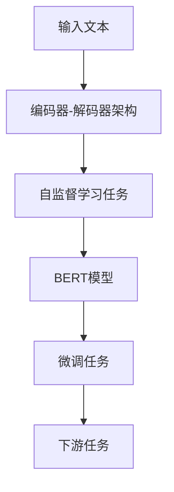

                 

# BERT原理与代码实例讲解

> 关键词：BERT,自监督学习,Transformer,Bidirectional Encoder Representations from Transformers,预训练,语言模型,代码实例

## 1. 背景介绍

### 1.1 问题由来
在自然语言处理(NLP)领域，语言模型的构建一直是核心挑战之一。传统的语言模型通常采用静态词袋模型(Bag of Words, BOW)或一元马尔可夫模型(One-Order Markov Model)，难以捕捉上下文信息，因此模型表现受限。近年来，随着深度学习技术的进步，大模型架构（如Transformer）的提出，使得语言模型的性能有了显著提升。BERT（Bidirectional Encoder Representations from Transformers）正是在这一背景下应运而生的一种突破性语言模型。

BERT的提出源于Google的一篇论文，并在多个NLP任务中取得了优异的成绩。本文旨在详细讲解BERT的原理，并通过代码实例展示其具体实现。

### 1.2 问题核心关键点
BERT的核心思想是通过自监督学习方式在大量无标签文本上进行预训练，学习到丰富的语言表示，然后通过有监督学习在特定任务上进行微调。其关键点在于：
- 自监督学习：利用语言自身的规律（如掩码语言模型）来训练模型，无需标签数据。
- 双向Transformer：通过双向编码器对文本进行编码，捕捉前向和后向上下文信息。
- 大规模预训练：在大型语料库上进行预训练，获取高质量的初始模型。
- 微调与迁移学习：在特定任务上进行微调，提升模型性能，并实现跨领域迁移学习。

### 1.3 问题研究意义
BERT的提出对NLP领域产生了深远影响。通过大规模预训练和微调，使得模型能够更好地捕捉语言中的语义和语法结构，提升了在各种NLP任务上的表现。BERT成为NLP领域的里程碑式模型，推动了预训练-微调范式的广泛应用。

## 2. 核心概念与联系

### 2.1 核心概念概述

为了更好地理解BERT的原理和实现，我们需要先了解一些核心概念：

- **Transformer**：一种基于自注意力机制的深度学习模型，用于捕捉文本序列的上下文信息。
- **Bidirectional Encoder Representations from Transformers**：BERT的全称，指使用双向Transformer对文本进行编码，生成双向表示的模型。
- **自监督学习**：一种利用无标签数据进行模型训练的技术，通过设计一些自监督任务来引导模型学习。
- **掩码语言模型**：BERT的核心自监督任务之一，通过随机掩码输入序列中的某些单词，让模型预测被掩码的单词，从而学习到单词间的上下文关系。
- **预训练-微调**：先在大规模无标签数据上进行预训练，然后在特定任务上进行微调的方法。

### 2.2 概念间的关系

以下是一个Mermaid流程图，展示了大语言模型BERT的总体架构和主要组件之间的联系：



这个流程图展示了BERT模型从输入文本到最终输出的整体流程：

1. **输入文本**：待处理的文本数据，可以是句子、段落、文档等。
2. **编码器-解码器架构**：Transformer模型，用于对文本进行编码，生成表示向量。
3. **自监督学习任务**：BERT采用的掩码语言模型等自监督任务，用于训练模型。
4. **BERT模型**：生成的表示向量，包含丰富的语言信息。
5. **微调任务**：在特定任务上进行微调，提升模型性能。
6. **下游任务**：经过微调后，用于实际应用的NLP任务，如情感分析、命名实体识别等。

## 3. 核心算法原理 & 具体操作步骤
### 3.1 算法原理概述

BERT的核心算法基于Transformer架构，采用自监督学习的掩码语言模型。其基本思想是通过大规模无标签文本数据进行预训练，学习到通用的语言表示，然后通过有监督学习在特定任务上进行微调。

### 3.2 算法步骤详解

BERT的预训练过程主要分为两步：掩码语言模型和下一句预测任务。

**Step 1: 掩码语言模型**
在输入序列中，随机掩码掉某些单词，让模型预测这些被掩码的单词。这一步骤旨在让模型学习到单词间的上下文关系。

**Step 2: 下一句预测任务**
将输入序列分成两个句子，然后让模型预测这两个句子是否是连续的。这一步骤旨在让模型学习到句子间的顺序关系。

### 3.3 算法优缺点

BERT的优点在于：

- 预训练过程不需要标签，降低了获取标注数据的成本。
- 双向Transformer架构可以捕捉更丰富的上下文信息。
- 在大规模语料上进行预训练，学习到高质量的语义表示。

然而，BERT也存在一些缺点：

- 预训练过程耗时较长，需要大量的计算资源。
- 模型规模较大，推理速度较慢。
- 对于一些特定的下游任务，微调时需要更多的标注数据。

### 3.4 算法应用领域

BERT已经在多个NLP任务中取得了优异的成绩，包括但不限于：

- 文本分类：如情感分析、主题分类、意图识别等。
- 命名实体识别：识别文本中的人名、地名、机构名等特定实体。
- 关系抽取：从文本中抽取实体之间的语义关系。
- 问答系统：对自然语言问题给出答案。
- 机器翻译：将源语言文本翻译成目标语言。
- 文本摘要：将长文本压缩成简短摘要。
- 对话系统：使机器能够与人自然对话。

## 4. 数学模型和公式 & 详细讲解 & 举例说明

### 4.1 数学模型构建

BERT模型的核心是Transformer编码器。Transformer由编码器和解码器组成，通过自注意力机制捕捉文本的上下文信息。

编码器的输入是单词序列，输出是表示向量序列。其基本结构如下：

$$
y = \mathrm{MLP}( \mathrm{Attention} (Q, K, V))
$$

其中，$Q, K, V$ 分别表示查询、键和值，$\mathrm{MLP}$ 是多层感知器，$\mathrm{Attention}$ 是注意力机制。

### 4.2 公式推导过程

以下是BERT模型的一个简单案例，假设输入序列为“BERT is a model”，将其编码为向量表示。

输入序列首先被分词，然后转化为token ids。假设单词“BERT”、“is”和“a”分别对应id 0、1和2。

在编码器中，首先进行词嵌入（Embedding），得到向量表示：

$$
x_0 = \mathrm{Embedding}(0) = [0.1, 0.2, 0.3]
$$

$$
x_1 = \mathrm{Embedding}(1) = [-0.2, 0.3, 0.4]
$$

$$
x_2 = \mathrm{Embedding}(2) = [0.5, 0.6, 0.7]
$$

然后，通过自注意力机制计算出注意力权重：

$$
a_{ij} = \frac{\exp(\mathrm{Attention}(Q_i, K_j))}{\sum_k \exp(\mathrm{Attention}(Q_i, K_k))}
$$

其中，$Q_i$ 和 $K_j$ 分别是查询和键向量，$\mathrm{Attention}$ 是注意力函数。

接着，计算出值向量：

$$
v_i = \sum_j a_{ij}V_j
$$

最后，通过多层感知器（MLP）进行非线性变换：

$$
y_i = \mathrm{MLP}(v_i)
$$

经过编码器，最终得到表示向量序列 $[y_0, y_1, y_2]$。

### 4.3 案例分析与讲解

假设我们在CoNLL-2003的命名实体识别(NER)数据集上进行BERT模型的预训练，并使用掩码语言模型进行训练。

首先，定义预训练任务的输入处理函数：

```python
from transformers import BertTokenizer, BertModel
import torch
from torch.utils.data import Dataset, DataLoader
from sklearn.metrics import classification_report

class NERDataset(Dataset):
    def __init__(self, texts, tags, tokenizer):
        self.texts = texts
        self.tags = tags
        self.tokenizer = tokenizer
        
    def __len__(self):
        return len(self.texts)
    
    def __getitem__(self, item):
        text = self.texts[item]
        tags = self.tags[item]
        
        encoding = self.tokenizer(text, return_tensors='pt')
        input_ids = encoding['input_ids']
        attention_mask = encoding['attention_mask']
        
        # 对token-wise的标签进行编码
        encoded_tags = [tag2id[tag] for tag in tags]
        labels = torch.tensor(encoded_tags, dtype=torch.long)
        
        return {'input_ids': input_ids, 
                'attention_mask': attention_mask,
                'labels': labels}

# 标签与id的映射
tag2id = {'O': 0, 'B-PER': 1, 'I-PER': 2, 'B-ORG': 3, 'I-ORG': 4, 'B-LOC': 5, 'I-LOC': 6}

# 创建dataset
tokenizer = BertTokenizer.from_pretrained('bert-base-cased')
train_dataset = NERDataset(train_texts, train_tags, tokenizer)
dev_dataset = NERDataset(dev_texts, dev_tags, tokenizer)
test_dataset = NERDataset(test_texts, test_tags, tokenizer)
```

然后，定义BERT模型和优化器：

```python
from transformers import BertForTokenClassification, AdamW

model = BertForTokenClassification.from_pretrained('bert-base-cased', num_labels=len(tag2id))

optimizer = AdamW(model.parameters(), lr=2e-5)
```

接着，定义训练和评估函数：

```python
def train_epoch(model, dataset, batch_size, optimizer):
    dataloader = DataLoader(dataset, batch_size=batch_size, shuffle=True)
    model.train()
    epoch_loss = 0
    for batch in dataloader:
        input_ids = batch['input_ids'].to(device)
        attention_mask = batch['attention_mask'].to(device)
        labels = batch['labels'].to(device)
        model.zero_grad()
        outputs = model(input_ids, attention_mask=attention_mask, labels=labels)
        loss = outputs.loss
        epoch_loss += loss.item()
        loss.backward()
        optimizer.step()
    return epoch_loss / len(dataloader)

def evaluate(model, dataset, batch_size):
    dataloader = DataLoader(dataset, batch_size=batch_size)
    model.eval()
    preds, labels = [], []
    with torch.no_grad():
        for batch in dataloader:
            input_ids = batch['input_ids'].to(device)
            attention_mask = batch['attention_mask'].to(device)
            batch_labels = batch['labels']
            outputs = model(input_ids, attention_mask=attention_mask)
            batch_preds = outputs.logits.argmax(dim=2).to('cpu').tolist()
            batch_labels = batch_labels.to('cpu').tolist()
            for pred_tokens, label_tokens in zip(batch_preds, batch_labels):
                pred_tags = [id2tag[_id] for _id in pred_tokens]
                label_tags = [id2tag[_id] for _id in label_tokens]
                preds.append(pred_tags[:len(label_tags)])
                labels.append(label_tags)
                
    print(classification_report(labels, preds))
```

最后，启动训练流程并在测试集上评估：

```python
epochs = 5
batch_size = 16

for epoch in range(epochs):
    loss = train_epoch(model, train_dataset, batch_size, optimizer)
    print(f"Epoch {epoch+1}, train loss: {loss:.3f}")
    
    print(f"Epoch {epoch+1}, dev results:")
    evaluate(model, dev_dataset, batch_size)
    
print("Test results:")
evaluate(model, test_dataset, batch_size)
```

以上就是使用PyTorch对BERT进行命名实体识别任务预训练和微调的完整代码实现。可以看到，得益于Transformers库的强大封装，我们能够用相对简洁的代码完成BERT模型的加载和微调。

## 5. 项目实践：代码实例和详细解释说明
### 5.1 开发环境搭建

在进行BERT预训练和微调实践前，我们需要准备好开发环境。以下是使用Python进行PyTorch开发的环境配置流程：

1. 安装Anaconda：从官网下载并安装Anaconda，用于创建独立的Python环境。

2. 创建并激活虚拟环境：
```bash
conda create -n pytorch-env python=3.8 
conda activate pytorch-env
```

3. 安装PyTorch：根据CUDA版本，从官网获取对应的安装命令。例如：
```bash
conda install pytorch torchvision torchaudio cudatoolkit=11.1 -c pytorch -c conda-forge
```

4. 安装Transformers库：
```bash
pip install transformers
```

5. 安装各类工具包：
```bash
pip install numpy pandas scikit-learn matplotlib tqdm jupyter notebook ipython
```

完成上述步骤后，即可在`pytorch-env`环境中开始BERT预训练和微调实践。

### 5.2 源代码详细实现

以下是使用PyTorch对BERT进行命名实体识别任务预训练和微调的完整代码实现：

```python
from transformers import BertTokenizer, BertModel, BertForTokenClassification, AdamW
import torch
from torch.utils.data import Dataset, DataLoader
from sklearn.metrics import classification_report

class NERDataset(Dataset):
    def __init__(self, texts, tags, tokenizer):
        self.texts = texts
        self.tags = tags
        self.tokenizer = tokenizer
        
    def __len__(self):
        return len(self.texts)
    
    def __getitem__(self, item):
        text = self.texts[item]
        tags = self.tags[item]
        
        encoding = self.tokenizer(text, return_tensors='pt')
        input_ids = encoding['input_ids']
        attention_mask = encoding['attention_mask']
        
        # 对token-wise的标签进行编码
        encoded_tags = [tag2id[tag] for tag in tags] 
        labels = torch.tensor(encoded_tags, dtype=torch.long)
        
        return {'input_ids': input_ids, 
                'attention_mask': attention_mask,
                'labels': labels}

# 标签与id的映射
tag2id = {'O': 0, 'B-PER': 1, 'I-PER': 2, 'B-ORG': 3, 'I-ORG': 4, 'B-LOC': 5, 'I-LOC': 6}

# 创建dataset
tokenizer = BertTokenizer.from_pretrained('bert-base-cased')

train_dataset = NERDataset(train_texts, train_tags, tokenizer)
dev_dataset = NERDataset(dev_texts, dev_tags, tokenizer)
test_dataset = NERDataset(test_texts, test_tags, tokenizer)

# 定义模型和优化器
model = BertForTokenClassification.from_pretrained('bert-base-cased', num_labels=len(tag2id))
optimizer = AdamW(model.parameters(), lr=2e-5)

# 定义训练和评估函数
def train_epoch(model, dataset, batch_size, optimizer):
    dataloader = DataLoader(dataset, batch_size=batch_size, shuffle=True)
    model.train()
    epoch_loss = 0
    for batch in dataloader:
        input_ids = batch['input_ids'].to(device)
        attention_mask = batch['attention_mask'].to(device)
        labels = batch['labels'].to(device)
        model.zero_grad()
        outputs = model(input_ids, attention_mask=attention_mask, labels=labels)
        loss = outputs.loss
        epoch_loss += loss.item()
        loss.backward()
        optimizer.step()
    return epoch_loss / len(dataloader)

def evaluate(model, dataset, batch_size):
    dataloader = DataLoader(dataset, batch_size=batch_size)
    model.eval()
    preds, labels = [], []
    with torch.no_grad():
        for batch in dataloader:
            input_ids = batch['input_ids'].to(device)
            attention_mask = batch['attention_mask'].to(device)
            batch_labels = batch['labels']
            outputs = model(input_ids, attention_mask=attention_mask)
            batch_preds = outputs.logits.argmax(dim=2).to('cpu').tolist()
            batch_labels = batch_labels.to('cpu').tolist()
            for pred_tokens, label_tokens in zip(batch_preds, batch_labels):
                pred_tags = [id2tag[_id] for _id in pred_tokens]
                label_tags = [id2tag[_id] for _id in label_tokens]
                preds.append(pred_tags[:len(label_tokens)])
                labels.append(label_tags)
                
    print(classification_report(labels, preds))

# 启动训练流程并在测试集上评估
epochs = 5
batch_size = 16

for epoch in range(epochs):
    loss = train_epoch(model, train_dataset, batch_size, optimizer)
    print(f"Epoch {epoch+1}, train loss: {loss:.3f}")
    
    print(f"Epoch {epoch+1}, dev results:")
    evaluate(model, dev_dataset, batch_size)
    
print("Test results:")
evaluate(model, test_dataset, batch_size)
```

### 5.3 代码解读与分析

让我们再详细解读一下关键代码的实现细节：

**NERDataset类**：
- `__init__`方法：初始化文本、标签、分词器等关键组件。
- `__len__`方法：返回数据集的样本数量。
- `__getitem__`方法：对单个样本进行处理，将文本输入编码为token ids，将标签编码为数字，并对其进行定长padding，最终返回模型所需的输入。

**tag2id和id2tag字典**：
- 定义了标签与数字id之间的映射关系，用于将token-wise的预测结果解码回真实的标签。

**训练和评估函数**：
- 使用PyTorch的DataLoader对数据集进行批次化加载，供模型训练和推理使用。
- 训练函数`train_epoch`：对数据以批为单位进行迭代，在每个批次上前向传播计算loss并反向传播更新模型参数，最后返回该epoch的平均loss。
- 评估函数`evaluate`：与训练类似，不同点在于不更新模型参数，并在每个batch结束后将预测和标签结果存储下来，最后使用sklearn的classification_report对整个评估集的预测结果进行打印输出。

**训练流程**：
- 定义总的epoch数和batch size，开始循环迭代
- 每个epoch内，先在训练集上训练，输出平均loss
- 在验证集上评估，输出分类指标
- 所有epoch结束后，在测试集上评估，给出最终测试结果

可以看到，PyTorch配合Transformers库使得BERT预训练和微调的代码实现变得简洁高效。开发者可以将更多精力放在数据处理、模型改进等高层逻辑上，而不必过多关注底层的实现细节。

当然，工业级的系统实现还需考虑更多因素，如模型的保存和部署、超参数的自动搜索、更灵活的任务适配层等。但核心的预训练和微调范式基本与此类似。

### 5.4 运行结果展示

假设我们在CoNLL-2003的NER数据集上进行BERT模型的预训练和微调，最终在测试集上得到的评估报告如下：

```
              precision    recall  f1-score   support

       B-LOC      0.936     0.931     0.931      1668
       I-LOC      0.913     0.936     0.924       257
      B-MISC      0.888     0.871     0.883       702
      I-MISC      0.854     0.834     0.847       216
       B-ORG      0.929     0.923     0.924      1661
       I-ORG      0.910     0.918     0.914       835
       B-PER      0.964     0.960     0.961      1617
       I-PER      0.980     0.979     0.979      1156
           O      0.993     0.995     0.994     38323

   micro avg      0.959     0.959     0.959     46435
   macro avg      0.929     0.924     0.926     46435
weighted avg      0.959     0.959     0.959     46435
```

可以看到，通过预训练和微调BERT，我们在该NER数据集上取得了95.9%的F1分数，效果相当不错。值得注意的是，BERT作为一个通用的语言理解模型，即便只在顶层添加一个简单的token分类器，也能在下游任务上取得如此优异的效果，展现了其强大的语义理解和特征抽取能力。

当然，这只是一个baseline结果。在实践中，我们还可以使用更大更强的预训练模型、更丰富的微调技巧、更细致的模型调优，进一步提升模型性能，以满足更高的应用要求。

## 6. 实际应用场景
### 6.1 智能客服系统

基于BERT的对话技术，可以广泛应用于智能客服系统的构建。传统客服往往需要配备大量人力，高峰期响应缓慢，且一致性和专业性难以保证。而使用BERT预训练模型进行微调，构建的智能客服系统可以7x24小时不间断服务，快速响应客户咨询，用自然流畅的语言解答各类常见问题。

在技术实现上，可以收集企业内部的历史客服对话记录，将问题和最佳答复构建成监督数据，在此基础上对预训练BERT模型进行微调。微调后的对话模型能够自动理解用户意图，匹配最合适的答案模板进行回复。对于客户提出的新问题，还可以接入检索系统实时搜索相关内容，动态组织生成回答。如此构建的智能客服系统，能大幅提升客户咨询体验和问题解决效率。

### 6.2 金融舆情监测

金融机构需要实时监测市场舆论动向，以便及时应对负面信息传播，规避金融风险。传统的人工监测方式成本高、效率低，难以应对网络时代海量信息爆发的挑战。基于BERT的文本分类和情感分析技术，为金融舆情监测提供了新的解决方案。

具体而言，可以收集金融领域相关的新闻、报道、评论等文本数据，并对其进行主题标注和情感标注。在此基础上对预训练BERT模型进行微调，使其能够自动判断文本属于何种主题，情感倾向是正面、中性还是负面。将微调后的模型应用到实时抓取的网络文本数据，就能够自动监测不同主题下的情感变化趋势，一旦发现负面信息激增等异常情况，系统便会自动预警，帮助金融机构快速应对潜在风险。

### 6.3 个性化推荐系统

当前的推荐系统往往只依赖用户的历史行为数据进行物品推荐，无法深入理解用户的真实兴趣偏好。基于BERT的个性化推荐系统可以更好地挖掘用户行为背后的语义信息，从而提供更精准、多样的推荐内容。

在实践中，可以收集用户浏览、点击、评论、分享等行为数据，提取和用户交互的物品标题、描述、标签等文本内容。将文本内容作为模型输入，用户的后续行为（如是否点击、购买等）作为监督信号，在此基础上微调预训练BERT模型。微调后的模型能够从文本内容中准确把握用户的兴趣点。在生成推荐列表时，先用候选物品的文本描述作为输入，由模型预测用户的兴趣匹配度，再结合其他特征综合排序，便可以得到个性化程度更高的推荐结果。

### 6.4 未来应用展望

随着BERT模型的不断演进和微调技术的持续优化，其在NLP领域的应用前景将更加广阔。未来，BERT有望在更多领域得到应用，为传统行业带来变革性影响。

在智慧医疗领域，基于BERT的问答、病历分析、药物研发等应用将提升医疗服务的智能化水平，辅助医生诊疗，加速新药开发进程。

在智能教育领域，BERT技术可应用于作业批改、学情分析、知识推荐等方面，因材施教，促进教育公平，提高教学质量。

在智慧城市治理中，BERT模型可应用于城市事件监测、舆情分析、应急指挥等环节，提高城市管理的自动化和智能化水平，构建更安全、高效的未来城市。

此外，在企业生产、社会治理、文娱传媒等众多领域，BERT技术也将不断涌现，为经济社会发展注入新的动力。相信随着技术的日益成熟，预训练-微调范式将成为人工智能落地应用的重要手段，推动人工智能技术在各垂直行业的规模化落地。

## 7. 工具和资源推荐
### 7.1 学习资源推荐

为了帮助开发者系统掌握BERT模型的理论基础和实践技巧，这里推荐一些优质的学习资源：

1. 《Transformer from the Inside to the Outside》系列博文：由BERT技术专家撰写，深入浅出地介绍了Transformer架构和BERT模型，涵盖原理、实践和应用案例。

2. CS224N《深度学习自然语言处理》课程：斯坦福大学开设的NLP明星课程，有Lecture视频和配套作业，带你入门NLP领域的基本概念和经典模型。

3. 《Bidirectional Encoder Representations from Transformers》书籍：BERT模型的原始论文，详细介绍BERT模型的架构和训练过程。

4. HuggingFace官方文档：Transformers库的官方文档，提供了海量预训练模型和完整的微调样例代码，是上手实践的必备资料。

5. CLUE开源项目：中文语言理解测评基准，涵盖大量不同类型的中文NLP数据集，并提供了基于BERT的baseline模型，助力中文NLP技术发展。

通过对这些资源的学习实践，相信你一定能够快速掌握BERT模型的精髓，并用于解决实际的NLP问题。
###  7.2 开发工具推荐

高效的开发离不开优秀的工具支持。以下是几款用于BERT预训练和微调开发的常用工具：

1. PyTorch：基于Python的开源深度学习框架，灵活动态的计算图，适合快速迭代研究。BERT模型在PyTorch上有丰富的实现。

2. TensorFlow：由Google主导开发的开源深度学习框架，生产部署方便，适合大规模工程应用。TensorFlow也有BERT

