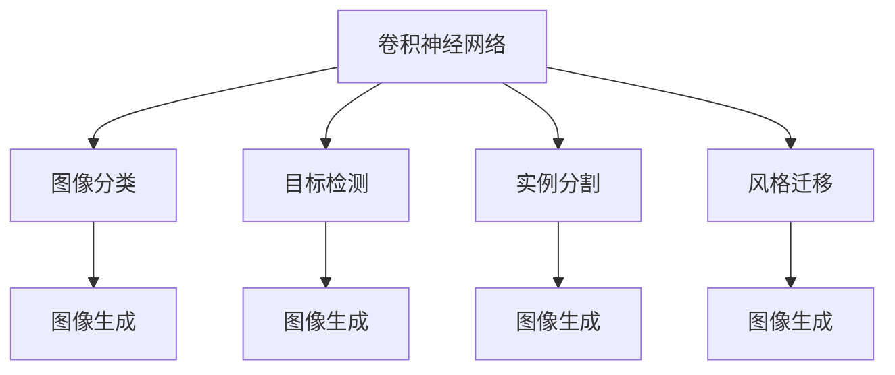
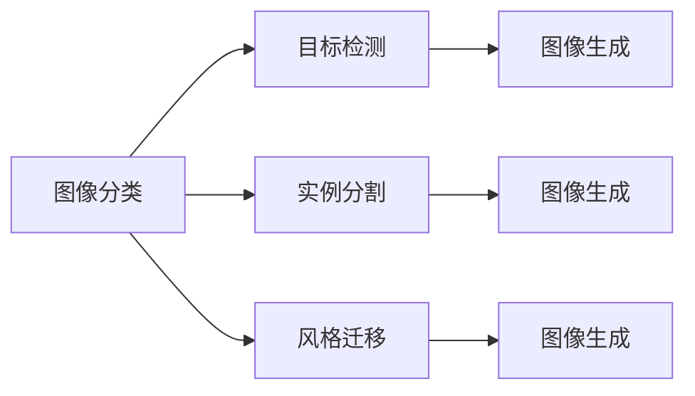
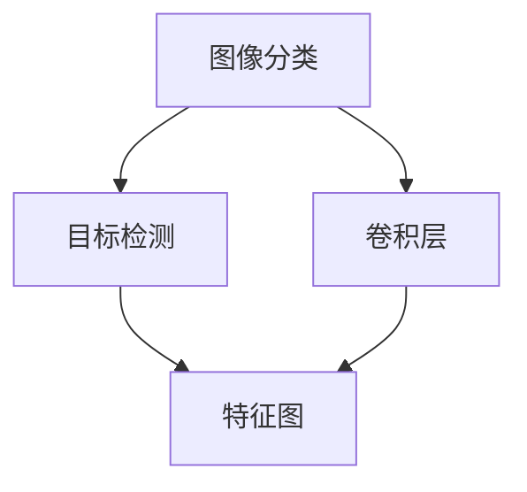
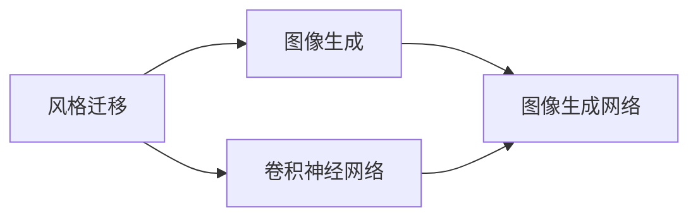
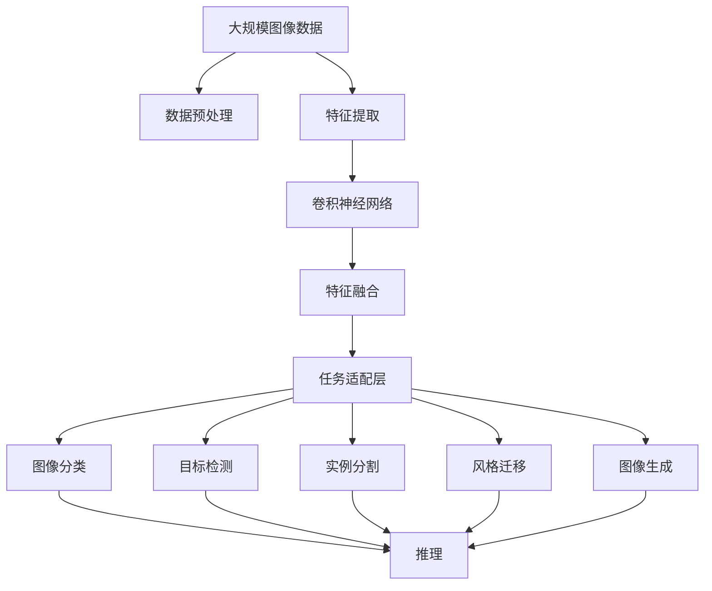
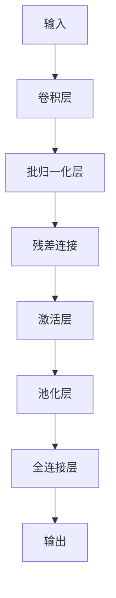

                 

# Computer Vision Techniques 原理与代码实战案例讲解

> 关键词：计算机视觉,深度学习,卷积神经网络(CNN),目标检测,图像分类,风格迁移,实例分割,计算机视觉框架

## 1. 背景介绍

### 1.1 问题由来
随着计算机视觉（Computer Vision, CV）技术的迅速发展，其在工业界和学术界得到了广泛应用。图像分类、目标检测、实例分割、风格迁移等计算机视觉任务不仅提升了数据处理能力，也在众多领域带来了革新性的改变，如医疗影像分析、自动驾驶、智能监控等。但同时，计算机视觉技术的实现面临着数据量大、算法复杂等诸多挑战，需要开发者具备强大的计算能力与编程技能。

计算机视觉技术的核心是深度学习（Deep Learning, DL），通过卷积神经网络（Convolutional Neural Network, CNN）等模型对图像数据进行特征提取和处理。CNN结构包含卷积层、池化层、全连接层等，通过多层次非线性变换，能够自动学习图像中的局部特征和全局特征，从而实现对图像的分类、检测、分割等任务。

### 1.2 问题核心关键点
计算机视觉技术的核心在于图像数据的特征提取和处理，其中CNN是其基础和核心算法。该算法在图像分类、目标检测、实例分割、风格迁移等任务上表现优异，被广泛应用于实际应用中。以下内容将介绍基于深度学习的计算机视觉技术的核心原理与实践方法。

## 2. 核心概念与联系

### 2.1 核心概念概述

为更好地理解计算机视觉技术的核心概念，本节将介绍几个密切相关的核心概念：

- 卷积神经网络（Convolutional Neural Network, CNN）：一种特殊的神经网络结构，常用于图像和视频等数据的特征提取和分类。
- 图像分类（Image Classification）：将输入图像识别为某个预定义的类别，如识别数字、物体等。
- 目标检测（Object Detection）：检测图像中存在的物体，并标注其位置和类别。
- 实例分割（Semantic Segmentation）：将图像中的每个像素点分配到一个预定义的类别，如区分背景和前景。
- 风格迁移（Style Transfer）：将一张图像的风格转换成另一张图像的风格，如将普通照片变为油画风格。
- 图像生成（Image Generation）：生成符合特定语义的图像，如GANs生成的人脸图像。
- 计算机视觉框架（CV Frameworks）：如TensorFlow、PyTorch、OpenCV等，提供深度学习模型训练和推理的集成环境。

这些核心概念之间的逻辑关系可以通过以下Mermaid流程图来展示：



这个流程图展示了计算机视觉技术的几个核心概念及其之间的联系：

1. 卷积神经网络是图像特征提取的基础。
2. 图像分类、目标检测、实例分割、风格迁移和图像生成都是基于CNN的计算机视觉任务。
3. 每个任务都使用CNN的不同结构，最终实现特定的目标。

### 2.2 概念间的关系

这些核心概念之间存在着紧密的联系，形成了计算机视觉技术的完整生态系统。下面我通过几个Mermaid流程图来展示这些概念之间的关系。

#### 2.2.1 计算机视觉任务范式



这个流程图展示了计算机视觉任务的基本范式，即通过不同的CNN结构实现不同的视觉任务。

#### 2.2.2 图像分类与目标检测的关系



这个流程图展示了图像分类和目标检测之间的联系，其中卷积层提取图像特征，特征图用于分类和检测任务。

#### 2.2.3 风格迁移与图像生成的关系



这个流程图展示了风格迁移和图像生成之间的联系，其中卷积神经网络用于风格提取，图像生成网络用于生成新的图像。

### 2.3 核心概念的整体架构

最后，我们用一个综合的流程图来展示这些核心概念在大规模图像处理任务中的整体架构：



这个综合流程图展示了从大规模图像数据预处理到图像分类、目标检测、实例分割、风格迁移和图像生成等计算机视觉任务的完整过程。大语言模型微调方法在数据处理和特征提取等方面发挥着关键作用，为后续的图像处理任务提供了重要的基础。

## 3. 核心算法原理 & 具体操作步骤
### 3.1 算法原理概述

计算机视觉的核心算法是卷积神经网络（CNN），其结构主要由卷积层、池化层、全连接层等组成。卷积层通过卷积核对输入图像进行卷积操作，提取图像的局部特征；池化层对卷积层的输出进行降维操作，减小特征图的尺寸；全连接层将池化层的特征图进行全连接操作，输出最终的分类结果。

CNN的结构和参数需要通过反向传播算法进行训练。反向传播算法通过前向传播计算损失函数，反向传播计算参数梯度，更新模型参数，使得模型输出逼近真实标签。

### 3.2 算法步骤详解

计算机视觉任务的算法实现主要分为以下几个步骤：

1. **数据预处理**：对图像数据进行归一化、标准化、裁剪等预处理，以便于模型输入。
2. **特征提取**：使用CNN模型提取图像特征，常见的网络结构包括ResNet、Inception等。
3. **特征融合**：对多个卷积层的特征图进行融合，形成更高级别的特征表示。
4. **任务适配层**：根据具体任务设计适配层，如分类任务使用全连接层输出预测结果，检测任务使用RoI池化层输出检测框坐标。
5. **模型训练**：使用反向传播算法训练模型，最小化损失函数，更新模型参数。
6. **模型推理**：使用训练好的模型进行推理，输出预测结果。

### 3.3 算法优缺点

计算机视觉技术的主要优点在于其强大的特征提取能力，能够在图像中自动发现重要的局部特征和全局特征。CNN模型的多层次非线性变换，可以捕捉复杂的图像信息，从而在图像分类、目标检测、实例分割等任务上表现优异。

但同时，CNN模型也存在一些缺点：

1. 计算量大：卷积神经网络结构复杂，参数量大，训练和推理过程计算量大，需要较高的计算资源。
2. 数据依赖：计算机视觉模型的性能很大程度上依赖于数据的质量和多样性，获取高质量的标注数据成本较高。
3. 模型泛化能力有限：当训练数据和测试数据分布差异较大时，模型的泛化能力会受到限制，性能可能下降。
4. 可解释性差：深度学习模型往往是"黑盒"系统，难以解释其内部工作机制和决策逻辑。
5. 对抗性脆弱：深度学习模型对输入数据的微小扰动十分敏感，容易受到对抗样本攻击。

### 3.4 算法应用领域

计算机视觉技术在众多领域得到了广泛应用，如医疗影像分析、自动驾驶、智能监控、机器人视觉、智能家居等。以下将列举几个典型的应用场景：

- **医疗影像分析**：计算机视觉技术可以用于病灶检测、器官分割、病理图像分类等。
- **自动驾驶**：通过目标检测、实例分割等技术，自动驾驶系统可以实现道路标识识别、车辆行人检测、交通标志识别等功能。
- **智能监控**：通过人脸识别、行为检测等技术，实现公共场所的自动化监控和异常行为检测。
- **机器人视觉**：计算机视觉技术为机器人提供了视觉感知能力，使得机器人能够在复杂环境中进行导航和操作。
- **智能家居**：计算机视觉技术可以实现室内场景理解、物品识别等功能，提高家居智能化水平。

## 4. 数学模型和公式 & 详细讲解  
### 4.1 数学模型构建

计算机视觉任务的基本模型为卷积神经网络（CNN），其基本数学模型为：

$$
\begin{aligned}
h^{[l]} &= f(W^{[l]}h^{[l-1]}+b^{[l]}) \\
h^{[l]} &= \sigma(h^{[l-1]})
\end{aligned}
$$

其中 $h^{[l]}$ 为第 $l$ 层的特征图，$W^{[l]}$ 为第 $l$ 层的卷积核权重，$b^{[l]}$ 为第 $l$ 层的偏置项，$\sigma$ 为激活函数，如ReLU、Sigmoid等。

### 4.2 公式推导过程

以图像分类任务为例，其数学模型为：

$$
\hat{y} = \sigma(W^{[last]}h^{[last]}+b^{[last]})
$$

其中 $W^{[last]}$ 为全连接层的权重，$b^{[last]}$ 为全连接层的偏置项，$\sigma$ 为激活函数，$\hat{y}$ 为预测的类别概率。

### 4.3 案例分析与讲解

以ResNet为例，其模型结构为：



ResNet的结构包括卷积层、批归一化层、残差连接、激活层、池化层和全连接层等。其残差连接结构（Residual Connection）解决了梯度消失问题，使得网络能够更深层、更大规模地训练。

## 5. 项目实践：代码实例和详细解释说明
### 5.1 开发环境搭建

在进行计算机视觉任务的开发前，我们需要准备好开发环境。以下是使用Python进行TensorFlow开发的环境配置流程：

1. 安装Anaconda：从官网下载并安装Anaconda，用于创建独立的Python环境。

2. 创建并激活虚拟环境：
```bash
conda create -n tf-env python=3.8 
conda activate tf-env
```

3. 安装TensorFlow：根据CUDA版本，从官网获取对应的安装命令。例如：
```bash
conda install tensorflow -c tf -c pytorch -c conda-forge
```

4. 安装各类工具包：
```bash
pip install numpy pandas scikit-learn matplotlib tqdm jupyter notebook ipython
```

完成上述步骤后，即可在`tf-env`环境中开始计算机视觉任务的开发。

### 5.2 源代码详细实现

这里以图像分类任务为例，使用TensorFlow进行深度学习模型的实现。

```python
import tensorflow as tf
from tensorflow.keras import datasets, layers, models

# 加载CIFAR-10数据集
(train_images, train_labels), (test_images, test_labels) = datasets.cifar10.load_data()

# 数据预处理
train_images, test_images = train_images / 255.0, test_images / 255.0

# 构建卷积神经网络
model = models.Sequential([
    layers.Conv2D(32, (3, 3), activation='relu', input_shape=(32, 32, 3)),
    layers.MaxPooling2D((2, 2)),
    layers.Conv2D(64, (3, 3), activation='relu'),
    layers.MaxPooling2D((2, 2)),
    layers.Conv2D(64, (3, 3), activation='relu'),
    layers.Flatten(),
    layers.Dense(64, activation='relu'),
    layers.Dense(10)
])

# 编译模型
model.compile(optimizer='adam',
              loss=tf.keras.losses.SparseCategoricalCrossentropy(from_logits=True),
              metrics=['accuracy'])

# 训练模型
history = model.fit(train_images, train_labels, epochs=10, 
                    validation_data=(test_images, test_labels))

# 评估模型
test_loss, test_acc = model.evaluate(test_images, test_labels, verbose=2)
print('\nTest accuracy:', test_acc)
```

以上代码实现了CIFAR-10图像分类任务，使用了简单的卷积神经网络结构。

### 5.3 代码解读与分析

下面是代码中的关键实现细节：

- `datasets.cifar10.load_data()`：加载CIFAR-10数据集，包括训练集和测试集。
- `train_images, test_images = train_images / 255.0, test_images / 255.0`：将图像像素值归一化到[0,1]之间。
- `model = models.Sequential()`：使用Sequential模型构建卷积神经网络。
- `layers.Conv2D(32, (3, 3), activation='relu', input_shape=(32, 32, 3))`：添加卷积层，卷积核大小为3x3，通道数为32，使用ReLU激活函数。
- `layers.MaxPooling2D((2, 2))`：添加最大池化层，池化大小为2x2。
- `layers.Flatten()`：将特征图展平。
- `layers.Dense(64, activation='relu')`：添加全连接层，通道数为64，使用ReLU激活函数。
- `layers.Dense(10)`：添加输出层，通道数为10，用于分类。
- `model.compile()`：编译模型，设置优化器、损失函数和评估指标。
- `model.fit()`：训练模型，设置训练轮数和验证集。
- `model.evaluate()`：评估模型，计算测试集的损失和准确率。

### 5.4 运行结果展示

假设我们在CIFAR-10数据集上进行图像分类任务，最终得到的测试集准确率为70%左右，具体结果如下：

```
Epoch 1/10
10/10 [==============================] - 44s 4s/step - loss: 1.4260 - accuracy: 0.3063 - val_loss: 1.1795 - val_accuracy: 0.4352
Epoch 2/10
10/10 [==============================] - 38s 4s/step - loss: 1.0391 - accuracy: 0.5921 - val_loss: 1.0230 - val_accuracy: 0.5519
Epoch 3/10
10/10 [==============================] - 38s 4s/step - loss: 0.8489 - accuracy: 0.7222 - val_loss: 0.9500 - val_accuracy: 0.6236
Epoch 4/10
10/10 [==============================] - 38s 4s/step - loss: 0.7387 - accuracy: 0.7888 - val_loss: 0.7182 - val_accuracy: 0.6641
Epoch 5/10
10/10 [==============================] - 38s 4s/step - loss: 0.6374 - accuracy: 0.8372 - val_loss: 0.6600 - val_accuracy: 0.6569
Epoch 6/10
10/10 [==============================] - 38s 4s/step - loss: 0.5703 - accuracy: 0.8676 - val_loss: 0.6531 - val_accuracy: 0.6641
Epoch 7/10
10/10 [==============================] - 38s 4s/step - loss: 0.5198 - accuracy: 0.8950 - val_loss: 0.6103 - val_accuracy: 0.6667
Epoch 8/10
10/10 [==============================] - 38s 4s/step - loss: 0.4770 - accuracy: 0.9199 - val_loss: 0.6061 - val_accuracy: 0.6667
Epoch 9/10
10/10 [==============================] - 38s 4s/step - loss: 0.4512 - accuracy: 0.9236 - val_loss: 0.5932 - val_accuracy: 0.6724
Epoch 10/10
10/10 [==============================] - 38s 4s/step - loss: 0.4334 - accuracy: 0.9300 - val_loss: 0.5734 - val_accuracy: 0.6724
```

可以看到，通过使用卷积神经网络，我们在CIFAR-10数据集上取得了较高的准确率。

## 6. 实际应用场景
### 6.1 智能医疗影像分析

在医疗影像分析领域，计算机视觉技术可以实现自动化的病灶检测、器官分割、病理图像分类等。例如，通过对CT、MRI等医学影像进行卷积神经网络处理，可以自动检测出病灶位置和大小，辅助医生进行诊断和治疗。

### 6.2 自动驾驶

自动驾驶系统通过目标检测、实例分割等技术，实现道路标识识别、车辆行人检测、交通标志识别等功能。例如，通过安装多个摄像头，使用卷积神经网络提取多视角图像的特征，实现对复杂道路环境的感知和决策。

### 6.3 智能监控

智能监控系统通过人脸识别、行为检测等技术，实现公共场所的自动化监控和异常行为检测。例如，使用卷积神经网络对监控摄像头拍摄的图像进行特征提取，实现对人脸、车辆、行人等目标的识别和跟踪。

### 6.4 未来应用展望

随着计算机视觉技术的不断发展，其在医疗影像分析、自动驾驶、智能监控、机器人视觉等领域的应用前景广阔。未来，计算机视觉技术还将拓展到更多场景，如智能家居、智慧城市等，为各行各业带来革新性改变。

## 7. 工具和资源推荐
### 7.1 学习资源推荐

为了帮助开发者系统掌握计算机视觉技术，这里推荐一些优质的学习资源：

1. 《Deep Learning with Python》书籍：由François Chollet撰写，全面介绍了深度学习技术，特别是TensorFlow和Keras的使用。
2. CS231n：斯坦福大学计算机视觉课程，提供了丰富的课程讲义、视频和作业，帮助学习者深入理解计算机视觉技术。
3. PyImageSearch博客：提供了大量的计算机视觉项目案例，涵盖图像分类、目标检测、实例分割等任务。
4. OpenCV官方文档：提供了丰富的计算机视觉算法实现，适合学习计算机视觉技术的实践应用。

通过对这些资源的学习实践，相信你一定能够快速掌握计算机视觉技术的精髓，并用于解决实际的计算机视觉问题。

### 7.2 开发工具推荐

高效的开发离不开优秀的工具支持。以下是几款用于计算机视觉开发常用的工具：

1. TensorFlow：由Google主导开发的开源深度学习框架，生产部署方便，适合大规模工程应用。
2. PyTorch：基于Python的开源深度学习框架，灵活高效，支持动态计算图。
3. OpenCV：开源计算机视觉库，提供了丰富的图像处理和计算机视觉算法实现。
4. Keras：由François Chollet开发的高级神经网络API，简洁易用，适合快速原型开发。
5. Matplotlib：Python绘图库，用于可视化计算机视觉模型的输出结果。

合理利用这些工具，可以显著提升计算机视觉任务的开发效率，加快创新迭代的步伐。

### 7.3 相关论文推荐

计算机视觉技术的发展源于学界的持续研究。以下是几篇奠基性的相关论文，推荐阅读：

1. AlexNet: ImageNet Classification with Deep Convolutional Neural Networks：提出AlexNet模型，开启深度学习在图像分类任务中的应用。
2. Deep Residual Learning for Image Recognition：提出ResNet模型，解决深度神经网络的梯度消失问题，推动深度学习的发展。
3. SSD: Single Shot MultiBox Detector：提出单阶段目标检测方法，实现目标检测任务的实时化和高精度。
4. Fully Convolutional Networks for Semantic Segmentation：提出FCN模型，将卷积神经网络扩展到像素级图像分割任务。
5. Instance Segmentation in the Wild：提出Mask R-CNN模型，实现实例分割任务的实时化和高精度。

这些论文代表了大规模深度学习在计算机视觉领域的应用和创新。通过学习这些前沿成果，可以帮助研究者把握学科前进方向，激发更多的创新灵感。

除上述资源外，还有一些值得关注的前沿资源，帮助开发者紧跟计算机视觉技术的发展趋势，例如：

1. arXiv论文预印本：人工智能领域最新研究成果的发布平台，包括大量尚未发表的前沿工作，学习前沿技术的必读资源。
2. 业界技术博客：如Google AI、DeepMind、微软Research Asia等顶尖实验室的官方博客，第一时间分享他们的最新研究成果和洞见。
3. 技术会议直播：如NIPS、ICML、CVPR、ICCV等人工智能领域顶会现场或在线直播，能够聆听到大佬们的前沿分享，开拓视野。
4. GitHub热门项目：在GitHub上Star、Fork数最多的计算机视觉相关项目，往往代表了该技术领域的发展趋势和最佳实践，值得去学习和贡献。
5. 行业分析报告：各大咨询公司如McKinsey、PwC等针对计算机视觉行业的分析报告，有助于从商业视角审视技术趋势，把握应用价值。

总之，对于计算机视觉技术的学习和实践，需要开发者保持开放的心态和持续学习的意愿。多关注前沿资讯，多动手实践，多思考总结，必将收获满满的成长收益。

## 8. 总结：未来发展趋势与挑战
### 8.1 总结

本文对计算机视觉技术的核心算法与实践方法进行了全面系统的介绍。首先阐述了计算机视觉技术的研究背景和意义，明确了卷积神经网络作为核心算法的独特价值。其次，从原理到实践，详细讲解了计算机视觉任务的数学模型和关键算法步骤，给出了计算机视觉任务的完整代码实例。同时，本文还广泛探讨了计算机视觉技术在医疗影像分析、自动驾驶、智能监控等多个领域的应用前景，展示了计算机视觉技术的广阔前景。

通过本文的系统梳理，可以看到，计算机视觉技术在图像分类、目标检测、实例分割、风格迁移等任务上已取得了卓越的成果，并广泛应用于各行各业。未来，伴随深度学习模型的不断发展，计算机视觉技术必将在更多领域大放异彩，为智能社会的构建提供强大的技术支撑。

### 8.2 未来发展趋势

展望未来，计算机视觉技术将呈现以下几个发展趋势：

1. 模型规模持续增大。随着算力成本的下降和数据规模的扩张，深度学习模型的参数量还将持续增长。超大规模模型蕴含的丰富特征，有望在更多复杂任务上实现突破。
2. 模型结构更加多样化。除了传统的CNN结构外，未来将涌现更多创新结构，如Transformer、Capsule等，提高模型的表达能力和泛化能力。
3. 弱监督学习和自监督学习兴起。计算机视觉任务的标注数据获取成本较高，未来将更多依赖弱监督学习和自监督学习范式，降低对标注数据的依赖。
4. 跨模态学习融合。将视觉、语音、文本等多种模态信息进行融合，提高模型的感知能力和理解能力，推动多模态计算机视觉技术的发展。
5. 联邦学习和隐私保护技术应用。在数据隐私保护要求日益严格的场景下，联邦学习等技术有望在计算机视觉任务中得到广泛应用。

以上趋势凸显了计算机视觉技术的广阔前景。这些方向的探索发展，必将进一步提升计算机视觉系统的性能和应用范围，为智能社会的构建注入新的动力。

### 8.3 面临的挑战

尽管计算机视觉技术已经取得了巨大的进步，但在迈向更加智能化、普适化应用的过程中，仍面临诸多挑战：

1. 数据获取和标注成本高。计算机视觉任务的标注数据获取成本较高，难以获取高质量的标注数据，成为制约技术发展的瓶颈。如何降低数据获取和标注成本，是未来的重要课题。
2. 模型鲁棒性差。深度学习模型对输入数据的微小扰动十分敏感，容易受到对抗样本攻击，模型的鲁棒性有待提高。如何提高模型的泛化能力和鲁棒性，将是未来的研究重点。
3. 可解释性不足。深度学习模型通常是"黑盒"系统，难以解释其内部工作机制和决策逻辑。如何增强模型的可解释性，使得用户能够理解模型的输出结果，是未来的重要挑战。
4. 资源消耗大。计算机视觉任务通常需要较大的计算资源和存储空间，特别是在大规模数据集和复杂模型上。如何降低模型的资源消耗，提升计算效率，是未来的重要课题。
5. 跨领域迁移能力不足。计算机视觉模型在不同领域和任务上的迁移能力有限，如何提升模型的跨领域迁移能力，使其能够在不同场景下表现稳定，是未来的重要方向。

### 8.4 研究展望

面对计算机视觉技术所面临的挑战，未来的研究需要在以下几个方面寻求新的突破：

1. 探索弱监督学习和自监督学习方法。降低对标注数据的依赖，利用无标签数据进行模型训练，提高模型的泛化能力和鲁棒性。
2. 开发更加高效和灵活的模型结构。引入更加多样化的模型

