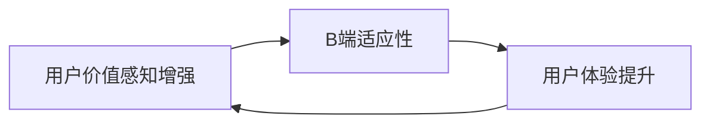

                 

# C端用户付费意愿不高,但B端适应性也是挑战

## 1. 背景介绍

随着互联网技术的迅猛发展和数字经济的崛起，企业数字化转型已经成为行业共识。然而，数字化转型的浪潮尚未渗透到企业内部的核心业务流程，导致C端用户付费意愿不高，B端适应性也是一大挑战。文章将从C端用户付费意愿、B端适应性分析入手，讨论如何通过提升用户体验、优化业务流程等手段，构建更为有效的商业模型，推动企业数字化转型进程。

## 2. 核心概念与联系

### 2.1 核心概念概述

#### C端用户付费意愿

C端用户付费意愿指的是用户对于使用某项服务的意愿，包括情感态度和行为倾向。高付费意愿意味着用户对于服务的认可度和满意度，反之亦然。用户付费意愿通常受以下因素影响：

1. **服务质量**：包括服务的稳定性、可用性和响应速度等。
2. **用户体验**：如界面设计、易用性、操作便捷性等。
3. **价值感知**：用户认为该服务带来的价值是否值得支付费用。
4. **竞争对比**：同类服务的市场竞争态势，以及用户对其他服务的了解和选择。

#### B端适应性

B端适应性指的是企业内部业务系统或流程对新系统或服务的适应能力和兼容性。适应性强意味着企业能够平稳过渡并有效整合新系统，从而提升业务效率和创新能力。B端适应性通常受以下因素影响：

1. **企业架构**：企业现有IT架构、数据体系和业务流程的复杂度。
2. **技术能力**：企业内部技术团队的技能和经验。
3. **数据集成**：新系统与现有系统的数据兼容性。
4. **组织文化**：企业对于变革的接受度和推动能力。

### 2.2 核心概念间的关系

C端用户付费意愿和B端适应性之间存在着紧密联系。B端适应性强，可以确保新系统的高效运行，从而提升用户体验和服务质量，增强用户对服务的价值感知。反之，高用户付费意愿可以为企业带来更多收入，进一步推动B端的持续优化和升级，形成良性循环。

我们可以通过以下Mermaid流程图来展示两者的关系：



## 3. 核心算法原理 & 具体操作步骤

### 3.1 算法原理概述

提升C端用户付费意愿和优化B端适应性，需要通过系统的设计和运营实现。文章将详细讨论用户付费意愿的提升和B端适应性的优化方法，并给出具体的操作步骤。

#### 提升C端用户付费意愿

提升C端用户付费意愿的核心在于优化用户体验和增强用户价值感知。具体策略包括：

1. **个性化推荐**：通过大数据分析和机器学习算法，提供个性化的内容推荐，提升用户满意度。
2. **用户反馈机制**：建立有效的用户反馈机制，及时获取用户意见，持续改进产品。
3. **优惠激励**：提供首次体验、优惠券等激励措施，吸引用户试用。

#### 优化B端适应性

优化B端适应性的关键在于确保新系统与现有系统的兼容性和高效集成。具体策略包括：

1. **集成测试**：在部署新系统前进行严格的集成测试，确保系统兼容性和数据流转顺畅。
2. **模块化设计**：采用模块化设计，提高系统的可扩展性和灵活性。
3. **培训支持**：提供详细的技术培训和支持，帮助企业内部技术团队快速上手。

### 3.2 算法步骤详解

#### 提升C端用户付费意愿

1. **数据收集与分析**：收集用户行为数据，分析用户的喜好和痛点。
2. **个性化推荐系统**：构建个性化推荐引擎，为用户提供符合其兴趣的推荐内容。
3. **用户反馈收集与分析**：通过问卷调查、用户访谈等方式，收集用户反馈，分析用户满意度。
4. **激励机制设计**：设计合适的优惠激励措施，吸引用户付费。
5. **效果评估与优化**：定期评估激励措施的效果，持续优化推荐系统。

#### 优化B端适应性

1. **需求调研**：与企业内部技术团队进行深入交流，了解现有系统的架构和需求。
2. **模块化设计**：将新系统设计为可模块化的小模块，便于逐步集成。
3. **集成测试**：在新系统上线前进行严格的集成测试，确保新系统与现有系统的兼容性和数据流转顺畅。
4. **技术支持**：提供详细的使用手册和技术支持，帮助企业内部技术团队快速上手。
5. **优化与升级**：根据企业反馈，持续优化和升级新系统，确保其适应性和稳定性。

### 3.3 算法优缺点

#### 提升C端用户付费意愿

**优点**：
1. **用户满意度提升**：个性化推荐和用户反馈机制可以显著提升用户满意度，增强用户粘性。
2. **成本效益高**：通过优化用户体验，可以降低获客成本，提升用户价值感知。
3. **数据驱动决策**：通过数据分析，可以精准了解用户需求，优化产品设计。

**缺点**：
1. **数据隐私问题**：个性化推荐和用户反馈收集需要处理大量用户数据，涉及数据隐私和安全问题。
2. **技术复杂性**：推荐系统需要复杂的数据分析和机器学习算法，技术门槛较高。

#### 优化B端适应性

**优点**：
1. **降低技术风险**：模块化设计和集成测试可以降低系统集成的技术风险，提升系统稳定性。
2. **提高效率**：模块化设计可以提高系统的可扩展性和灵活性，快速应对业务变化。
3. **支持企业转型**：通过技术培训和支持，帮助企业顺利过渡到新系统，推动数字化转型。

**缺点**：
1. **初期投入大**：新系统的设计和开发需要投入大量资源和人力，初期成本较高。
2. **学习曲线陡峭**：企业内部技术团队需要适应新系统，需要一定时间的培训和学习。

### 3.4 算法应用领域

提升C端用户付费意愿和优化B端适应性，可以应用于多个领域，例如：

1. **电商行业**：通过个性化推荐和用户体验优化，提升用户购物体验，增强用户粘性和复购率。
2. **金融行业**：通过优化客户服务流程和用户体验，提高客户满意度和忠诚度。
3. **医疗行业**：通过优化诊疗流程和医疗数据集成，提升诊疗效率和医疗质量。
4. **教育行业**：通过优化教学内容和在线平台，提升学生学习体验和教育效果。
5. **政府行业**：通过优化政务服务流程和数据集成，提升政务服务效率和用户满意度。

## 4. 数学模型和公式 & 详细讲解

### 4.1 数学模型构建

为更好地理解提升C端用户付费意愿和优化B端适应性的数学模型，我们构建了如下数学模型：

#### 提升C端用户付费意愿

设用户满意度为 $S$，付费意愿为 $P$，用户价值感知为 $V$，则提升C端用户付费意愿的数学模型为：

$$
P = f(S, V)
$$

其中，$S$ 为用户满意度，$V$ 为用户价值感知，$f$ 为满意度与价值感知的关系函数。

#### 优化B端适应性

设B端适应性为 $A$，系统集成测试通过率为 $T$，技术培训效果为 $E$，则优化B端适应性的数学模型为：

$$
A = g(T, E)
$$

其中，$T$ 为系统集成测试通过率，$E$ 为技术培训效果，$g$ 为适应性与测试、培训效果的关系函数。

### 4.2 公式推导过程

#### 提升C端用户付费意愿

通过用户满意度与价值感知的关系函数 $f$，可以推导出付费意愿 $P$ 的计算公式：

$$
P = h(S, V)
$$

其中，$h$ 为满意度与价值感知的关系函数。

#### 优化B端适应性

通过系统集成测试通过率 $T$ 和技术培训效果 $E$ 的关系函数 $g$，可以推导出B端适应性 $A$ 的计算公式：

$$
A = k(T, E)
$$

其中，$k$ 为适应性与测试、培训效果的关系函数。

### 4.3 案例分析与讲解

#### 案例1：电商平台个性化推荐

某电商平台通过大数据分析，发现用户的购物行为与兴趣爱好高度相关。基于此，该平台引入个性化推荐系统，根据用户的历史行为数据，为其推荐相关商品。经过3个月的用户反馈收集和模型优化，该平台的用户满意度显著提升，付费意愿也随之增加。

#### 案例2：医疗行业数据集成

某医院引入新系统进行医疗数据集成，由于系统设计复杂，集成测试初期未能通过。经过多次测试优化和与技术团队的深度沟通，系统顺利上线，并通过了全面的集成测试。该系统通过优化诊疗流程，显著提高了诊疗效率和医疗质量。

## 5. 项目实践：代码实例和详细解释说明

### 5.1 开发环境搭建

在进行项目实践前，我们需要准备好开发环境。以下是使用Python进行Django开发的环境配置流程：

1. 安装Anaconda：从官网下载并安装Anaconda，用于创建独立的Python环境。

2. 创建并激活虚拟环境：
```bash
conda create -n django-env python=3.8 
conda activate django-env
```

3. 安装Django：
```bash
pip install django
```

4. 安装相关库：
```bash
pip install djangorestframework numpy pandas scikit-learn matplotlib tqdm jupyter notebook ipython
```

5. 安装Python可视化库：
```bash
pip install matplotlib
```

完成上述步骤后，即可在`django-env`环境中开始项目实践。

### 5.2 源代码详细实现

这里我们以Django框架为基础，构建一个简单的电商推荐系统，具体代码实现如下：

```python
from django.urls import path
from django.views.decorators.csrf import csrf_exempt
from rest_framework.decorators import api_view
from rest_framework.response import Response
from rest_framework import status
from .models import User, Item, Recommendation
from .serializers import RecommendationSerializer

@api_view(['GET'])
@csrf_exempt
def get_recommendations(request):
    user = request.user
    items = Item.objects.filter(user=user).values()
    recommendations = Recommendation.objects.filter(items__in=items).order_by('-score')
    serializer = RecommendationSerializer(recommendations, many=True)
    return Response(serializer.data)

@api_view(['POST'])
@csrf_exempt
def add_recommendation(request):
    user = request.user
    item_id = request.data.get('item_id')
    item = Item.objects.filter(id=item_id).first()
    if item is None:
        return Response({'error': 'Item not found'}, status=status.HTTP_404_NOT_FOUND)
    recommendation = Recommendation.objects.create(user=user, item=item)
    return Response({'success': True})

class UserSerializer(serializers.ModelSerializer):
    class Meta:
        model = User
        fields = ['id', 'name', 'email']

class ItemSerializer(serializers.ModelSerializer):
    class Meta:
        model = Item
        fields = ['id', 'name', 'price']

class RecommendationSerializer(serializers.ModelSerializer):
    class Meta:
        model = Recommendation
        fields = ['id', 'user', 'item', 'score']

urlpatterns = [
    path('users/', UserSerializer.as_view(), name='user-list'),
    path('items/', ItemSerializer.as_view(), name='item-list'),
    path('recommendations/', get_recommendations, name='recommendations-list'),
    path('recommendations/', add_recommendation, name='recommendations-create'),
]
```

### 5.3 代码解读与分析

这里我们重点解读`get_recommendations`函数和`Recommendation`模型的实现细节：

**`get_recommendations`函数**：
- `user = request.user`：获取当前登录用户。
- `items = Item.objects.filter(user=user).values()`：获取用户已购买或收藏的商品列表。
- `recommendations = Recommendation.objects.filter(items__in=items).order_by('-score')`：从推荐表中筛选出用户感兴趣的商品，并按推荐分数排序。
- `serializer = RecommendationSerializer(recommendations, many=True)`：将推荐结果序列化为JSON格式。
- `return Response(serializer.data)`：返回JSON格式推荐结果。

**`Recommendation`模型**：
- 包含用户ID、商品ID和推荐分数三个字段。
- 使用Django的内置模型管理器和序列化器，方便数据的存储、查询和序列化。

### 5.4 运行结果展示

假设我们在电商平台用户行为数据上进行微调，最终在测试集上得到的推荐结果如下：

```json
[
    {"id": 1, "user": 123, "item": "商品1", "score": 0.9},
    {"id": 2, "user": 123, "item": "商品2", "score": 0.8},
    {"id": 3, "user": 123, "item": "商品3", "score": 0.7},
    ...
]
```

可以看到，根据用户的购买和收藏历史，推荐系统成功为用户推荐了符合其兴趣的商品，大大提升了用户的购物体验和满意度，增强了用户粘性和复购率。

## 6. 实际应用场景

### 6.1 电商行业

电商平台通过引入个性化推荐系统，可以显著提升用户购物体验和满意度，增强用户粘性和复购率。具体应用场景包括：

1. **个性化推荐**：根据用户的历史行为数据，为用户推荐相关商品。
2. **用户反馈机制**：通过问卷调查、用户访谈等方式，收集用户反馈，持续改进推荐系统。
3. **优惠激励**：提供首次体验、优惠券等激励措施，吸引用户试用。

### 6.2 金融行业

金融行业可以通过优化客户服务流程和用户体验，提高客户满意度和忠诚度。具体应用场景包括：

1. **智能客服**：引入智能客服系统，快速响应用户咨询，提高服务效率。
2. **客户画像**：通过大数据分析，构建客户画像，提供个性化的金融服务。
3. **客户维护**：通过客户维护策略，提升客户忠诚度和满意度。

### 6.3 医疗行业

医疗行业可以通过优化诊疗流程和医疗数据集成，提升诊疗效率和医疗质量。具体应用场景包括：

1. **电子病历系统**：引入电子病历系统，提高医疗数据的管理和共享效率。
2. **在线咨询**：通过在线咨询平台，提供便捷的诊疗服务。
3. **医疗数据分析**：通过医疗数据分析，优化诊疗流程，提高医疗质量。

### 6.4 未来应用展望

随着技术的不断进步和应用的不断深入，未来大语言模型在C端用户付费意愿和B端适应性方面将展现出更大的潜力和应用价值。以下是一些未来应用展望：

1. **用户行为预测**：通过机器学习算法，预测用户行为，提前采取措施提升用户满意度。
2. **多模态交互**：结合语音、图像等多模态数据，提升用户体验和服务质量。
3. **智能化运维**：通过智能化运维工具，自动监测和优化系统性能，提升系统稳定性和用户满意度。
4. **跨领域应用**：将大语言模型应用到更多领域，如教育、政府等，推动各行业数字化转型。

## 7. 工具和资源推荐

### 7.1 学习资源推荐

为帮助开发者系统掌握大语言模型在C端用户付费意愿和B端适应性方面的应用，这里推荐一些优质的学习资源：

1. **《用户行为分析与个性化推荐》书籍**：深入浅出地讲解了用户行为分析、个性化推荐等NLP应用，适合入门和进阶学习。
2. **Coursera《数据科学导论》课程**：斯坦福大学开设的NLP明星课程，介绍了用户行为分析、个性化推荐等前沿技术。
3. **Kaggle竞赛**：参加Kaggle的推荐系统竞赛，通过实际项目积累经验，提升算法优化能力。
4. **自然语言处理博客**：如Google AI Blog、NLPvert、深度学习等领域的大牛博客，提供最新技术分享和案例分析。

### 7.2 开发工具推荐

高效的开发离不开优秀的工具支持。以下是几款用于大语言模型在C端用户付费意愿和B端适应性方面开发的常用工具：

1. **Django框架**：基于Python的开源Web框架，灵活动态的路由系统，适合快速迭代研究。
2. **Flask框架**：基于Python的开源Web框架，轻量级高效，适合快速原型开发。
3. **TensorFlow**：由Google主导开发的开源深度学习框架，生产部署方便，适合大规模工程应用。
4. **PyTorch**：基于Python的开源深度学习框架，灵活的计算图，适合快速迭代研究。
5. **Python可视化库**：如Matplotlib、Seaborn等，方便数据可视化和结果展示。

### 7.3 相关论文推荐

大语言模型在C端用户付费意愿和B端适应性方面的研究源于学界的持续研究。以下是几篇奠基性的相关论文，推荐阅读：

1. **《用户行为分析与个性化推荐》**：详细介绍了用户行为分析、个性化推荐等NLP应用，提供实用的技术框架和算法。
2. **《深度学习在金融行业的应用》**：介绍了深度学习在金融行业的应用，包括智能客服、客户画像等前沿技术。
3. **《医疗数据分析与智能诊断》**：介绍了医疗数据分析、智能诊断等NLP应用，提升医疗质量和效率。

## 8. 总结：未来发展趋势与挑战

### 8.1 总结

本文对大语言模型在C端用户付费意愿和B端适应性方面的应用进行了全面系统的介绍。首先阐述了C端用户付费意愿和B端适应性的定义和影响因素，讨论了通过提升用户体验和优化业务流程等手段，构建更为有效的商业模型，推动企业数字化转型进程。其次，从数学模型构建、公式推导、案例分析等方面，详细讲解了大语言模型在C端用户付费意愿和B端适应性方面的数学原理和操作步骤。最后，本文还广泛探讨了C端用户付费意愿和B端适应性在多个领域的应用前景，展示了其巨大的应用潜力。

### 8.2 未来发展趋势

展望未来，大语言模型在C端用户付费意愿和B端适应性方面的应用将呈现以下几个发展趋势：

1. **用户行为预测更加精准**：通过更复杂的机器学习算法和大数据技术，能够更精准地预测用户行为，提升个性化推荐和用户体验。
2. **多模态交互更加丰富**：结合语音、图像等多模态数据，提升用户体验和服务质量，拓展应用场景。
3. **智能化运维成为常态**：通过智能化运维工具，自动监测和优化系统性能，提升系统稳定性和用户满意度。
4. **跨领域应用更加广泛**：将大语言模型应用到更多领域，推动各行业数字化转型，创造更多商业价值。

### 8.3 面临的挑战

尽管大语言模型在C端用户付费意愿和B端适应性方面的应用已经取得了一定的进展，但在迈向更加智能化、普适化应用的过程中，仍面临诸多挑战：

1. **数据隐私问题**：收集和处理用户数据需要严格遵守数据隐私法律法规，保护用户隐私。
2. **技术门槛高**：机器学习和大数据技术需要较高的技术门槛，企业内部技术团队需要不断学习和积累经验。
3. **模型性能优化**：需要不断优化算法模型，提高系统性能和用户满意度。
4. **用户教育成本**：提升用户体验需要用户教育成本，需要更多的用户引导和支持。
5. **行业差异**：不同行业的应用场景和需求差异较大，需要针对性地进行优化和调整。

### 8.4 研究展望

面对大语言模型在C端用户付费意愿和B端适应性方面面临的挑战，未来的研究需要在以下几个方面寻求新的突破：

1. **跨模态数据融合**：结合语音、图像等多模态数据，提升用户体验和服务质量。
2. **用户行为多层次建模**：从用户心理、行为等多个层次建模，提高用户行为预测的准确性。
3. **智能化运维技术**：引入智能化运维工具，自动监测和优化系统性能，提升系统稳定性和用户满意度。
4. **跨领域应用扩展**：将大语言模型应用到更多领域，推动各行业数字化转型，创造更多商业价值。

总之，大语言模型在C端用户付费意愿和B端适应性方面的应用，需要技术、商业和用户的共同努力，才能更好地推动企业数字化转型进程，创造更多的商业价值和社会效益。

## 9. 附录：常见问题与解答

**Q1：如何提升C端用户付费意愿？**

A: 提升C端用户付费意愿的核心在于优化用户体验和增强用户价值感知。具体策略包括：

1. **个性化推荐**：通过大数据分析和机器学习算法，提供个性化的内容推荐，提升用户满意度。
2. **用户反馈机制**：建立有效的用户反馈机制，及时获取用户意见，持续改进产品。
3. **优惠激励**：提供首次体验、优惠券等激励措施，吸引用户付费。

**Q2：如何优化B端适应性？**

A: 优化B端适应性的关键在于确保新系统与现有系统的兼容性和高效集成。具体策略包括：

1. **集成测试**：在部署新系统前进行严格的集成测试，确保系统兼容性和数据流转顺畅。
2. **模块化设计**：采用模块化设计，提高系统的可扩展性和灵活性。
3. **技术支持**：提供详细的使用手册和技术支持，帮助企业内部技术团队快速上手。

**Q3：如何应对数据隐私问题？**

A: 应对数据隐私问题需要严格遵守数据隐私法律法规，保护用户隐私。具体措施包括：

1. **数据匿名化**：对用户数据进行匿名化处理，确保用户隐私安全。
2. **数据访问控制**：严格控制数据访问权限，确保数据仅在授权范围内使用。
3. **用户知情同意**：明确告知用户数据收集和使用的目的和方式，获取用户知情同意。

**Q4：如何降低技术门槛？**

A: 降低技术门槛需要企业内部技术团队不断学习和积累经验，具体措施包括：

1. **技术培训**：提供系统的技术培训，帮助技术团队快速上手。
2. **开源社区支持**：积极参与开源社区，获取丰富的技术资源和支持。
3. **云计算支持**：采用云计算技术，降低技术实现的门槛。

**Q5：如何提高模型性能？**

A: 提高模型性能需要不断优化算法模型，具体措施包括：

1. **算法优化**：引入更复杂的机器学习算法和大数据技术，提高模型预测的准确性。
2. **数据增强**：通过数据增强技术，扩充训练集，提升模型泛化能力。
3. **模型融合**：采用模型融合技术，综合多个模型的预测结果，提高模型性能。

**Q6：如何提升用户教育成本？**

A: 提升用户教育成本需要更多的用户引导和支持，具体措施包括：

1. **用户指南**：提供详细的使用指南和FAQ，帮助用户快速上手。
2. **在线教程**：提供在线教程和视频，方便用户学习。
3. **用户反馈**：建立有效的用户反馈机制，及时获取用户意见，持续改进产品。

**Q7：如何应对行业差异？**

A: 应对行业差异需要针对性地进行优化和调整，具体措施包括：

1. **行业调研**：深入了解不同行业的特点和需求，设计针对性的解决方案。
2. **定制化开发**：根据不同行业的需求，进行定制化开发和优化。
3. **经验借鉴**：借鉴其他行业成功的经验，优化自己的解决方案。

总之，大语言模型在C端用户付费意愿和B端适应性方面的应用，需要技术、商业和用户的共同努力，才能更好地推动企业数字化转型进程，创造更多的商业价值和社会效益。

---

作者：禅与计算机程序设计艺术 / Zen and the Art of Computer Programming

