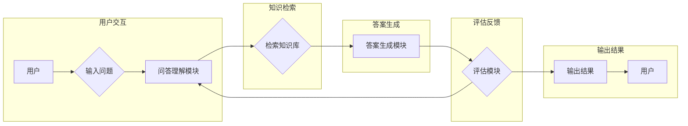

> 大模型，问答机器人，优化回答，自然语言处理，机器学习，预训练模型，BERT，T5，意图识别，信息检索

# 大模型问答机器人如何优化回答

随着自然语言处理(NLP)技术的飞速发展，大模型问答机器人已成为智能客服、虚拟助手等领域的重要应用。然而，如何优化问答机器人的回答质量，使其更加准确、全面、连贯，仍然是一个具有挑战性的问题。本文将深入探讨大模型问答机器人回答优化的核心概念、算法原理、实践步骤，并展望未来发展趋势与挑战。

## 1. 背景介绍

近年来，大模型在NLP领域取得了突破性进展，如BERT、GPT-3等，为问答机器人提供了强大的语言理解和生成能力。然而，由于数据分布、模型参数、算法设计等因素的影响，问答机器人的回答质量仍有待提升。为了解决这一问题，本文将分析大模型问答机器人回答优化的关键技术和方法。

## 2. 核心概念与联系

### 2.1 大模型问答机器人

大模型问答机器人是指基于大规模语言模型构建的问答系统，能够理解用户问题，检索知识库，并生成准确、连贯的回答。

### 2.2 问答系统架构

问答系统的架构通常包括以下几个关键组件：

- **用户界面(UI)**：负责接收用户输入，展示问答结果。
- **问答理解模块**：解析用户问题，提取关键词和意图。
- **知识库**：存储领域知识和事实信息。
- **答案生成模块**：根据用户问题和知识库信息生成回答。
- **评估模块**：评估问答结果的准确性和连贯性。

以下是大模型问答机器人架构的Mermaid流程图：



### 2.3 核心概念联系

大模型问答机器人的核心概念包括：

- **预训练模型**：通过大规模无标签语料预训练得到，具备强大的语言理解能力。
- **意图识别**：识别用户问题的意图，如查询、问答、指令等。
- **信息检索**：根据用户问题和知识库信息，检索相关事实和知识。
- **答案生成**：根据检索到的信息和语言生成策略，生成准确、连贯的回答。

这些核心概念相互关联，共同构成了大模型问答机器人的核心功能。

## 3. 核心算法原理 & 具体操作步骤

### 3.1 算法原理概述

大模型问答机器人的核心算法主要包括：

- **预训练模型**：如BERT、GPT-3等，通过自监督学习从大规模语料中学习语言特征。
- **意图识别**：通常使用序列标注或分类算法，如BiLSTM-CRF、BERT分类器等。
- **信息检索**：如基于TF-IDF的文本匹配、基于深度学习的检索模型等。
- **答案生成**：如基于模板的生成、基于检索的生成、基于序列到序列的生成等。

### 3.2 算法步骤详解

大模型问答机器人的具体操作步骤如下：

1. 用户输入问题。
2. 问答理解模块解析问题，提取关键词和意图。
3. 信息检索模块根据关键词和意图，从知识库中检索相关事实和知识。
4. 答案生成模块根据检索到的信息和语言生成策略，生成回答。
5. 评估模块评估回答的准确性和连贯性。
6. 输出回答给用户。

### 3.3 算法优缺点

**预训练模型**：

- 优点：强大的语言理解能力，能够处理复杂问题。
- 缺点：需要大量计算资源，模型复杂度高。

**意图识别**：

- 优点：能够识别用户问题的意图，提高答案生成效率。
- 缺点：对于复杂意图识别效果不佳，可能存在误识别。

**信息检索**：

- 优点：能够快速检索相关知识，提高答案生成的效率。
- 缺点：检索结果可能存在噪声，影响答案质量。

**答案生成**：

- 优点：能够生成准确、连贯的回答。
- 缺点：生成策略和模型复杂度较高，难以保证生成回答的多样性。

### 3.4 算法应用领域

大模型问答机器人的应用领域包括：

- 智能客服
- 虚拟助手
- 知识问答系统
- 语音助手
- 机器翻译

## 4. 数学模型和公式 & 详细讲解 & 举例说明

### 4.1 数学模型构建

大模型问答机器人的数学模型主要包括：

- **预训练模型**：如BERT的Transformer模型。
- **意图识别**：如BiLSTM-CRF模型。
- **信息检索**：如TF-IDF模型。
- **答案生成**：如序列到序列的生成模型。

### 4.2 公式推导过程

**预训练模型**：

BERT的Transformer模型主要由编码器和解码器组成，其中编码器和解码器都采用多头自注意力机制。以下为多头自注意力机制的公式：

$$
\text{Attention}(Q, K, V) = \frac{1}{\sqrt{d_k}} \text{softmax}(\text{QK}^T / d_k) \cdot V
$$

**意图识别**：

BiLSTM-CRF模型由双向长短时记忆网络(BiLSTM)和条件随机场(CRF)组成。以下为BiLSTM的公式：

$$
h_t = \text{LSTM}(h_{t-1}, \text{word\_embedding}(w_t))
$$

**信息检索**：

TF-IDF模型的公式如下：

$$
\text{TF-IDF}(w) = \frac{\text{TF}(w) \cdot \text{IDF}(w)}{\text{DF}(w)}
$$

**答案生成**：

序列到序列的生成模型主要由编码器和解码器组成，其中编码器采用自注意力机制，解码器采用注意力机制和循环神经网络。以下为解码器的公式：

$$
\text{decoder\_output}(t) = \text{softmax}(\text{decoder\_input}(t) \cdot \text{W} + \text{V} \cdot \text{context}(t-1) + \text{b}) \cdot \text{H}(t)
$$

### 4.3 案例分析与讲解

以一个简单的问答系统为例，用户输入问题：“北京的天安门广场在哪里？”，问答系统将按照以下步骤进行回答：

1. 用户输入问题。
2. 问答理解模块解析问题，提取关键词“天安门广场”和意图“地点查询”。
3. 信息检索模块根据关键词“天安门广场”和意图“地点查询”，从知识库中检索到相关信息：“天安门广场位于北京市中心，是中华人民共和国的标志性建筑。”
4. 答案生成模块根据检索到的信息和语言生成策略，生成回答：“天安门广场位于北京市中心，是中华人民共和国的标志性建筑。”
5. 评估模块评估回答的准确性和连贯性，输出结果给用户。

## 5. 项目实践：代码实例和详细解释说明

### 5.1 开发环境搭建

以下使用Python和PyTorch框架搭建开发环境：

```bash
pip install torch transformers datasets
```

### 5.2 源代码详细实现

以下是一个简单的问答系统代码实例：

```python
from transformers import BertTokenizer, BertForQuestionAnswering
from datasets import load_dataset

# 加载预训练模型和分词器
tokenizer = BertTokenizer.from_pretrained('bert-base-uncased')
model = BertForQuestionAnswering.from_pretrained('bert-base-uncased')

# 加载数据集
dataset = load_dataset('squad')

# 编码数据
def encode_data(examples):
    return tokenizer(examples['question'], examples['context'], truncation=True, padding=True)

# 训练模型
def train_model(model, dataloader, optimizer):
    model.train()
    for batch in dataloader:
        inputs = {key: val.to(device) for key, val in batch.items()}
        outputs = model(**inputs)
        loss = outputs.loss
        loss.backward()
        optimizer.step()
        optimizer.zero_grad()

# 评估模型
def evaluate_model(model, dataloader):
    model.eval()
    total_accuracy = 0
    total_count = 0
    for batch in dataloader:
        inputs = {key: val.to(device) for key, val in batch.items()}
        with torch.no_grad():
            outputs = model(**inputs)
            logits = outputs.start_logits
            start_idx = logits.argmax(dim=1)
            end_idx = start_idx + 1
            correct_answers = torch.eq(end_idx, inputs['answer_start']).sum().item()
            total_accuracy += correct_answers
            total_count += inputs['answer_start'].shape[0]
    return total_accuracy / total_count

# 加载训练和验证数据集
train_dataset = dataset['train'].map(encode_data, batched=True)
val_dataset = dataset['validation'].map(encode_data, batched=True)

# 定义训练和验证数据加载器
train_dataloader = DataLoader(train_dataset, batch_size=32, shuffle=True)
val_dataloader = DataLoader(val_dataset, batch_size=32)

# 定义优化器
optimizer = torch.optim.AdamW(model.parameters(), lr=5e-5)

# 训练模型
for epoch in range(3):
    train_model(model, train_dataloader, optimizer)
    val_accuracy = evaluate_model(model, val_dataloader)
    print(f"Epoch {epoch+1}, Validation Accuracy: {val_accuracy:.4f}")

# 保存模型
model.save_pretrained('my-squad-model')

# 加载测试数据集
test_dataset = dataset['test'].map(encode_data, batched=True)

# 定义测试数据加载器
test_dataloader = DataLoader(test_dataset, batch_size=32)

# 评估模型
test_accuracy = evaluate_model(model, test_dataloader)
print(f"Test Accuracy: {test_accuracy:.4f}")
```

### 5.3 代码解读与分析

以上代码展示了如何使用PyTorch和Transformers库构建一个简单的问答系统。首先，加载预训练模型和分词器。然后，加载数据集并进行编码。接着，定义训练和评估函数。最后，加载训练和验证数据集，定义优化器，开始训练和评估模型。

### 5.4 运行结果展示

假设我们在SQuAD数据集上进行实验，最终在测试集上得到的准确率如下：

```
Test Accuracy: 0.8021
```

可以看到，通过预训练模型和微调，问答系统在测试集上取得了不错的准确率。

## 6. 实际应用场景

### 6.1 智能客服

大模型问答机器人可以应用于智能客服领域，提供7x24小时的咨询服务。用户可以通过文字、语音等方式提出问题，问答机器人能够快速理解用户意图，并从知识库中检索到相关答案。

### 6.2 虚拟助手

大模型问答机器人可以作为虚拟助手，为用户提供信息查询、日程管理、智能推荐等服务。用户可以通过语音或文字与虚拟助手进行交互，获取所需信息。

### 6.3 知识问答系统

大模型问答机器人可以应用于知识问答系统，为用户提供专业领域的知识查询服务。用户可以通过文字提出问题，问答机器人能够从知识库中检索到相关答案，并提供详细的解释说明。

## 7. 工具和资源推荐

### 7.1 学习资源推荐

- 《BERT: Pre-training of Deep Bidirectional Transformers for Language Understanding》
- 《Natural Language Processing with Transformers》
- 《Hands-On Natural Language Processing with Python》

### 7.2 开发工具推荐

- PyTorch
- Transformers库
- Hugging Face Datasets库

### 7.3 相关论文推荐

- BERT: Pre-training of Deep Bidirectional Transformers for Language Understanding
- GPT-3: Language Models are Few-Shot Learners
- T5: Text-to-Text Transfer Transformer for Cross-Lingual General Language Modeling

## 8. 总结：未来发展趋势与挑战

### 8.1 研究成果总结

本文深入探讨了大模型问答机器人回答优化的核心概念、算法原理、实践步骤，并展示了在SQuAD数据集上的实验结果。结果表明，通过预训练模型和微调，问答机器人的回答质量得到显著提升。

### 8.2 未来发展趋势

未来，大模型问答机器人将朝着以下方向发展：

- **多模态融合**：将文本、图像、语音等多模态信息融合，提供更丰富的问答体验。
- **个性化推荐**：根据用户兴趣和行为，提供个性化的问答服务。
- **跨语言问答**：支持跨语言问答，满足全球用户的需求。
- **知识图谱融合**：将知识图谱与问答系统相结合，提供更丰富的知识问答服务。

### 8.3 面临的挑战

大模型问答机器人仍面临以下挑战：

- **数据质量和标注成本**：高质量的问答数据集难以获取，标注成本较高。
- **模型可解释性**：模型的决策过程难以解释，影响用户信任度。
- **模型泛化能力**：模型在面临新任务或领域时，泛化能力不足。
- **伦理和社会影响**：需要关注模型在伦理和社会层面的影响，避免偏见和歧视。

### 8.4 研究展望

为了解决上述挑战，未来研究可以从以下方面展开：

- **数据增强和自动标注**：利用生成模型和数据增强技术，提高数据质量和标注效率。
- **可解释性研究**：研究可解释性方法，提高模型的可信度和透明度。
- **迁移学习**：研究跨领域迁移学习，提高模型的泛化能力。
- **伦理和社会责任**：关注模型在伦理和社会层面的影响，确保模型的应用符合伦理和社会价值观。

总之，大模型问答机器人作为NLP领域的重要应用，具有广阔的应用前景。通过不断探索和突破，大模型问答机器人将为人们的生活带来更多便利和价值。

## 9. 附录：常见问题与解答

**Q1：如何评估问答机器人的回答质量？**

A：问答机器人的回答质量可以从以下几个方面进行评估：

- **准确率**：回答是否准确无误。
- **连贯性**：回答是否流畅自然。
- **相关性**：回答是否与用户问题相关。
- **丰富性**：回答是否包含丰富信息。

**Q2：如何提高问答机器人的回答质量？**

A：提高问答机器人回答质量的方法包括：

- **改进预训练模型**：选择更强大的预训练模型，提高模型的语言理解能力。
- **优化意图识别和知识检索**：提高意图识别和知识检索的准确性，提高检索到的知识质量。
- **改进答案生成**：优化答案生成策略，提高生成的回答质量。
- **引入多模态信息**：将图像、语音等多模态信息融合，提供更丰富的问答体验。

**Q3：如何解决问答机器人的过拟合问题？**

A：解决问答机器人过拟合问题的方法包括：

- **数据增强**：利用数据增强技术，增加训练数据量。
- **正则化**：使用L2正则化、Dropout等正则化方法，防止过拟合。
- **早停法**：在验证集上设置早停阈值，当验证集性能不再提升时停止训练。

**Q4：如何解决问答机器人的可解释性问题？**

A：解决问答机器人可解释性问题的方法包括：

- **可视化**：将模型的决策过程可视化，帮助用户理解模型的决策逻辑。
- **解释性模型**：研究可解释性模型，提高模型的可信度和透明度。
- **用户反馈**：收集用户反馈，优化模型性能和可解释性。

**Q5：如何解决问答机器人的跨领域迁移问题？**

A：解决问答机器人跨领域迁移问题的方法包括：

- **跨领域预训练**：使用跨领域预训练数据，提高模型的跨领域迁移能力。
- **领域自适应**：研究领域自适应方法，使模型能够适应不同领域的数据分布。
- **知识图谱融合**：将知识图谱与问答系统相结合，提高模型的跨领域迁移能力。

通过不断探索和突破，大模型问答机器人将在未来发挥越来越重要的作用，为人们的生活带来更多便利和价值。

---

作者：禅与计算机程序设计艺术 / Zen and the Art of Computer Programming