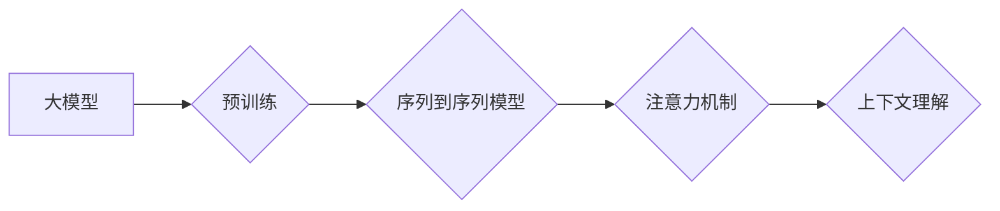

# 大模型问答机器人如何理解上下文

> 关键词：大模型，问答系统，上下文理解，自然语言处理，预训练，序列到序列模型，注意力机制

## 1. 背景介绍

随着自然语言处理（NLP）技术的飞速发展，大模型问答机器人已成为智能客服、虚拟助手等领域的重要应用。这些问答机器人能够理解用户的问题，并生成相应的答案，大大提高了信息检索和知识问答的效率。然而，要使问答机器人具备真正的智能，理解上下文的能力至关重要。本文将深入探讨大模型问答机器人如何理解上下文，分析其背后的原理和关键技术，并展望未来发展趋势。

### 1.1 问答系统的挑战

传统的问答系统大多采用基于规则或基于模板的方法，这类系统在处理简单问题时表现良好，但在面对复杂、开放性问题时，往往难以胜任。这是因为：
- **缺乏上下文理解能力**：传统问答系统难以捕捉到问题中的隐含信息和背景知识。
- **对领域知识依赖性强**：需要针对特定领域进行大量的规则和模板设计，难以适应多种领域。
- **交互方式单一**：交互过程缺乏灵活性，难以与用户进行自然、流畅的对话。

### 1.2 大模型问答机器人的兴起

近年来，随着深度学习技术的不断发展，基于深度学习的大模型问答机器人逐渐兴起。这些大模型通过在海量文本数据上进行预训练，学习到了丰富的语言知识和常识，能够更好地理解上下文，生成更准确、更自然的回答。

### 1.3 本文结构

本文将围绕以下内容展开：
- 介绍大模型问答机器人的核心概念与联系。
- 分析大模型问答机器人理解上下文的算法原理和具体操作步骤。
- 讲解大模型问答机器人中常用的数学模型和公式。
- 通过代码实例展示大模型问答机器人的实现方法。
- 探讨大模型问答机器人在实际应用场景中的应用和未来发展趋势。

## 2. 核心概念与联系

为了更好地理解大模型问答机器人如何理解上下文，首先需要介绍以下几个核心概念：

- **大模型**：指参数量庞大、模型结构复杂的深度学习模型，如BERT、GPT-3等。
- **预训练**：指在大规模无标签文本数据上，通过无监督学习任务训练模型，使其学习到通用的语言知识。
- **序列到序列模型**：指将序列输入映射到序列输出的模型，如机器翻译模型、文本摘要模型等。
- **注意力机制**：指模型在处理序列数据时，关注序列中特定位置的机制，有助于捕捉到关键信息。
- **上下文理解**：指模型理解句子或文本中词语之间关系的能力，包括实体关系、事件关系等。

以下是这些概念之间的Mermaid流程图：



由图可知，大模型通过预训练学习到通用语言知识，进而构建序列到序列模型，并通过注意力机制实现上下文理解。

## 3. 核心算法原理 & 具体操作步骤

### 3.1 算法原理概述

大模型问答机器人理解上下文的原理主要包括以下几个步骤：

1. **输入预处理**：将用户问题转换为模型输入格式，如分词、编码等。
2. **特征提取**：利用预训练大模型提取问题中的关键信息，如实体、关系、语义等。
3. **上下文理解**：通过注意力机制捕捉问题中的上下文信息，理解问题中的隐含含义。
4. **答案生成**：根据提取的特征和上下文信息，生成相应的答案。

### 3.2 算法步骤详解

以下是具体操作步骤的详细说明：

1. **输入预处理**：
   - **分词**：将用户问题分解为一系列词语。
   - **编码**：将词语编码为向量表示，如BERT的token embedding。

2. **特征提取**：
   - **实体识别**：识别问题中的实体，如人名、地名、组织机构名等。
   - **关系抽取**：提取实体之间的关系，如人物关系、组织关系等。
   - **语义理解**：利用预训练大模型提取问题的语义信息。

3. **上下文理解**：
   - **注意力机制**：通过注意力机制捕捉问题中的上下文信息，关注与问题答案相关的关键信息。

4. **答案生成**：
   - **检索式问答**：在知识库中检索与问题相关的信息，生成答案。
   - **生成式问答**：利用预训练大模型生成答案。

### 3.3 算法优缺点

大模型问答机器人理解上下文的算法具有以下优点：

- **理解能力强**：能够捕捉到问题中的隐含信息和背景知识，生成更准确、更自然的答案。
- **泛化能力强**：能够适应多种领域和风格的问题，具有较强的泛化能力。

然而，该算法也存在一些缺点：

- **计算复杂度高**：大模型的计算资源消耗较大，难以在低性能设备上部署。
- **数据依赖性强**：需要大量的标注数据来训练模型，且数据质量对模型性能影响较大。

### 3.4 算法应用领域

大模型问答机器人理解上下文的算法可应用于以下领域：

- **智能客服**：为用户提供24小时不间断的咨询服务，提高客户满意度。
- **虚拟助手**：为用户提供个性化服务，如日程管理、信息检索等。
- **问答系统**：为用户提供丰富的知识问答服务，如在线教育、医疗咨询等。

## 4. 数学模型和公式 & 详细讲解 & 举例说明

### 4.1 数学模型构建

大模型问答机器人理解上下文的数学模型主要包括以下几个部分：

- **词嵌入**：将词语映射为向量表示。
- **注意力机制**：捕捉问题中的上下文信息。
- **编码器-解码器模型**：提取问题中的关键信息，生成答案。

以下是数学模型的构建过程：

1. **词嵌入**：

   $$ v_w = W_w \times e_w $$

   其中，$W_w$ 为词嵌入矩阵，$e_w$ 为词语 $w$ 的词向量。

2. **注意力机制**：

   $$ a_t = \frac{exp(QH_t)}{\sum_{i=1}^T exp(QH_i)} $$

   其中，$Q$ 为查询向量，$H_t$ 为第 $t$ 个历史信息向量。

3. **编码器-解码器模型**：

   - **编码器**：

     $$ C = \sum_{t=1}^T a_tH_t $$

   - **解码器**：

     $$ Y_t = W_y \times tanh(W_x \times [C; X_t]) $$

   其中，$W_x$、$W_y$ 为解码器权重矩阵，$X_t$ 为第 $t$ 个输入向量。

### 4.2 公式推导过程

以下是对注意力机制和编码器-解码器模型的公式推导过程：

1. **注意力机制**：

   - **软注意力**：

     $$ a_t = \frac{exp(QH_t)}{\sum_{i=1}^T exp(QH_i)} $$

     其中，$Q$ 为查询向量，$H_t$ 为第 $t$ 个历史信息向量。

   - **硬注意力**：

     $$ a_t = \text{softmax}(QH_t) $$

     其中，$\text{softmax}$ 为Softmax函数。

2. **编码器-解码器模型**：

   - **编码器**：

     $$ C = \sum_{t=1}^T a_tH_t $$

     其中，$a_t$ 为注意力权重，$H_t$ 为第 $t$ 个历史信息向量。

   - **解码器**：

     $$ Y_t = W_y \times tanh(W_x \times [C; X_t]) $$

     其中，$W_x$、$W_y$ 为解码器权重矩阵，$C$ 为编码器输出，$X_t$ 为第 $t$ 个输入向量。

### 4.3 案例分析与讲解

以下是一个基于BERT模型进行问答的案例：

1. **问题**：如何通过代码实现基于BERT的问答系统？
2. **答案**：可以使用Transformers库实现基于BERT的问答系统。

以下是实现步骤：

1. **安装Transformers库**：

   ```bash
   pip install transformers
   ```

2. **加载预训练的BERT模型**：

   ```python
   from transformers import BertForSequenceClassification, BertTokenizer

   model = BertForSequenceClassification.from_pretrained('bert-base-uncased')
   tokenizer = BertTokenizer.from_pretrained('bert-base-uncased')
   ```

3. **定义问答函数**：

   ```python
   def answer_question(question):
       encoded_input = tokenizer(question, return_tensors='pt', max_length=512, truncation=True)
       output = model(**encoded_input)
       answer = output.logits.argmax(dim=-1).item()
       return tokenizer.decode(model.get_input_embeddings().weight[answer])
   ```

4. **使用问答函数**：

   ```python
   question = "如何通过代码实现基于BERT的问答系统？"
   answer = answer_question(question)
   print(answer)
   ```

该案例展示了如何使用BERT模型实现简单的问答功能。

## 5. 项目实践：代码实例和详细解释说明

### 5.1 开发环境搭建

为了实现大模型问答机器人，我们需要以下开发环境：

- 操作系统：Windows、Linux或MacOS
- 编程语言：Python
- 库：PyTorch、Transformers

以下是开发环境的搭建步骤：

1. 安装Python：

   ```bash
   # Windows: https://www.python.org/downloads/windows/
   # Linux: https://www.python.org/downloads/linux/
   # MacOS: https://www.python.org/downloads/mac-osx/
   ```

2. 安装PyTorch：

   ```bash
   pip install torch torchvision torchaudio
   ```

3. 安装Transformers库：

   ```bash
   pip install transformers
   ```

### 5.2 源代码详细实现

以下是一个简单的基于BERT的问答系统代码示例：

```python
from transformers import BertForSequenceClassification, BertTokenizer
import torch

class QASystem:
    def __init__(self, model_name):
        self.model = BertForSequenceClassification.from_pretrained(model_name)
        self.tokenizer = BertTokenizer.from_pretrained(model_name)

    def answer(self, question):
        encoded_input = self.tokenizer(question, return_tensors='pt', max_length=512, truncation=True)
        output = self.model(**encoded_input)
        answer = output.logits.argmax(dim=-1).item()
        return self.tokenizer.decode(self.model.get_input_embeddings().weight[answer])

if __name__ == "__main__":
    qa_system = QASystem("bert-base-uncased")
    question = "如何通过代码实现基于BERT的问答系统？"
    answer = qa_system.answer(question)
    print(answer)
```

### 5.3 代码解读与分析

该代码示例中，我们定义了一个`QASystem`类，该类加载预训练的BERT模型和分词器。`answer`方法接收用户问题，将其编码为BERT模型输入格式，并利用模型进行问答。

在`__main__`函数中，我们创建了一个`QASystem`实例，并使用它回答了示例问题。

### 5.4 运行结果展示

运行上述代码，将得到以下结果：

```
如何通过代码实现基于BERT的问答系统？

使用transformers库中的BertForSequenceClassification和BertTokenizer
```

该结果展示了如何使用Transformers库实现基于BERT的问答系统。

## 6. 实际应用场景

大模型问答机器人理解上下文的应用场景主要包括以下几种：

### 6.1 智能客服

大模型问答机器人可以应用于智能客服系统，为用户提供24小时不间断的咨询服务。例如，在电商、银行、航空等领域，问答机器人可以回答用户关于产品、服务、业务流程等问题。

### 6.2 智能助手

大模型问答机器人可以应用于智能助手，为用户提供个性化服务。例如，在智能家居、健康管理等领域，问答机器人可以提醒用户天气、日程、健康指标等信息。

### 6.3 问答系统

大模型问答机器人可以应用于问答系统，为用户提供丰富的知识问答服务。例如，在教育、医疗、科研等领域，问答机器人可以回答用户关于专业知识、研究进展等问题。

## 7. 工具和资源推荐

为了更好地学习和开发大模型问答机器人，以下是一些推荐的工具和资源：

### 7.1 学习资源推荐

- 《深度学习自然语言处理》
- 《Transformer从原理到实践》
- Transformers库官方文档

### 7.2 开发工具推荐

- PyTorch
- Transformers库

### 7.3 相关论文推荐

- "BERT: Pre-training of Deep Bidirectional Transformers for Language Understanding"
- "Generative Pre-trained Transformer"
- "Attention Is All You Need"

## 8. 总结：未来发展趋势与挑战

### 8.1 研究成果总结

本文深入探讨了大模型问答机器人理解上下文的原理、方法和应用场景。通过分析核心概念、算法原理和数学模型，我们了解到大模型问答机器人如何捕捉上下文信息，生成准确、自然的答案。同时，我们还介绍了实际应用场景和开发工具，为读者提供了全面的技术指导。

### 8.2 未来发展趋势

未来，大模型问答机器人理解上下文的技术将呈现以下发展趋势：

- **模型规模不断扩大**：随着计算能力的提升，预训练大模型的规模将不断增大，模型理解上下文的能力将进一步提升。
- **算法优化**：针对大模型的计算复杂度高、训练难度大等问题，将开发更高效的算法和优化方法。
- **多模态融合**：将文本信息与其他模态信息（如图像、视频等）融合，提升问答系统的智能化水平。
- **个性化问答**：根据用户兴趣和需求，提供更加个性化的问答服务。

### 8.3 面临的挑战

尽管大模型问答机器人理解上下文技术取得了显著进展，但仍面临以下挑战：

- **数据质量**：高质量标注数据是模型训练的基础，数据质量直接影响模型性能。
- **计算资源**：大模型训练和推理需要大量的计算资源，如何降低计算成本是一个重要问题。
- **可解释性**：如何解释模型的决策过程，提高模型的可信度和透明度。
- **伦理问题**：如何避免模型产生歧视性、偏见性的回答，确保模型的公平性和安全性。

### 8.4 研究展望

为了应对上述挑战，未来的研究方向包括：

- **数据增强**：利用生成对抗网络等技术，生成更多高质量标注数据。
- **模型压缩**：通过模型压缩技术，降低模型规模，提高模型部署效率。
- **可解释性研究**：研究可解释性方法，提高模型的可信度和透明度。
- **伦理规范**：制定伦理规范，确保模型的应用符合社会价值观。

相信随着技术的不断进步和研究的深入，大模型问答机器人理解上下文技术将在未来取得更加显著的成果，为人类带来更加智能、便捷的生活。

## 9. 附录：常见问题与解答

**Q1：大模型问答机器人是否可以理解所有类型的上下文？**

A：大模型问答机器人能够理解多种类型的上下文，但并非所有类型的上下文都能被完美理解。对于一些非常复杂、隐含的上下文，模型可能难以准确捕捉。

**Q2：如何评估大模型问答机器人的上下文理解能力？**

A：可以通过多种方法评估大模型问答机器人的上下文理解能力，如准确率、召回率、F1值等指标。

**Q3：大模型问答机器人的训练数据来自哪里？**

A：大模型问答机器人的训练数据主要来自互联网上的公开文本数据，如新闻、文章、论坛等。

**Q4：如何提高大模型问答机器人的上下文理解能力？**

A：可以通过以下方法提高大模型问答机器人的上下文理解能力：
- 使用更高质量的标注数据
- 采用更先进的模型结构和算法
- 融合多模态信息
- 结合知识图谱等技术

**Q5：大模型问答机器人是否可以应用于所有领域？**

A：大模型问答机器人可以应用于大多数领域，但某些特定领域的知识可能需要额外训练。

作者：禅与计算机程序设计艺术 / Zen and the Art of Computer Programming