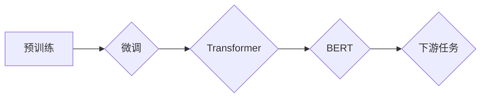

> 关键词：大语言模型，自然语言处理，深度学习，Transformer，BERT，预训练，微调，代码实例

# 大语言模型 原理与代码实例讲解

在过去的几年中，大语言模型（Large Language Models，LLMs）如雨后春笋般涌现，它们在自然语言处理（Natural Language Processing，NLP）领域取得了令人瞩目的成果。本文将深入探讨大语言模型的原理，并通过代码实例展示如何构建和使用这些模型。

## 1. 背景介绍

大语言模型是指那些能够理解和生成自然语言的深度学习模型。它们通常由数以亿计的参数组成，能够在大量文本数据上进行预训练，从而学习到丰富的语言知识和模式。这些模型在文本生成、机器翻译、问答系统等领域取得了显著的进步。

## 2. 核心概念与联系

### 2.1 核心概念

#### 2.1.1 预训练

预训练是指在大规模无标注数据集上训练模型，使其学习通用的语言表示。预训练模型通常用于下游任务的微调。

#### 2.1.2 微调

微调是在预训练模型的基础上，使用少量标注数据来调整模型参数，使其适应特定任务。

#### 2.1.3 Transformer

Transformer是一种基于自注意力机制的深度神经网络模型，它在大语言模型中扮演着核心角色。

#### 2.1.4 BERT

BERT（Bidirectional Encoder Representations from Transformers）是一种预训练语言模型，它通过双向编码器学习词的上下文表示。

### 2.2 Mermaid 流程图



## 3. 核心算法原理 & 具体操作步骤

### 3.1 算法原理概述

大语言模型的训练通常分为两个阶段：预训练和微调。

#### 预训练

预训练模型在大规模无标注数据集上学习语言的通用表示，例如词嵌入、语法规则等。

#### 微调

微调模型使用少量标注数据来调整模型参数，使其能够适应特定的下游任务。

### 3.2 算法步骤详解

1. **数据准备**：收集无标注数据用于预训练，以及少量标注数据用于微调。
2. **模型构建**：选择合适的预训练模型架构，如BERT或GPT。
3. **预训练**：在无标注数据集上训练模型，学习语言的通用表示。
4. **微调**：在标注数据集上调整模型参数，使其适应特定任务。
5. **评估**：在测试集上评估模型性能。

### 3.3 算法优缺点

#### 优点

- 能够在大量无标注数据上学习到丰富的语言知识。
- 通过微调可以快速适应特定任务。
- 模型性能通常优于传统方法。

#### 缺点

- 训练成本高，需要大量计算资源和时间。
- 对数据质量要求高。
- 模型可解释性差。

### 3.4 算法应用领域

- 文本分类
- 机器翻译
- 问答系统
- 文本摘要
- 命名实体识别

## 4. 数学模型和公式 & 详细讲解 & 举例说明

### 4.1 数学模型构建

大语言模型通常基于神经网络构建，其中最常用的神经网络架构是Transformer。

### 4.2 公式推导过程

Transformer模型的核心思想是自注意力机制，它通过以下公式计算：

$$
\text{Attention}(Q, K, V) = \frac{\text{softmax}(\frac{QK^T}{\sqrt{d_k}})V}
$$

其中，$Q$、$K$ 和 $V$ 分别是查询、键和值向量，$d_k$ 是键的维度。

### 4.3 案例分析与讲解

以下是一个简单的BERT模型用于文本分类的例子：

```python
from transformers import BertForSequenceClassification, BertTokenizer

# 加载预训练模型和分词器
model = BertForSequenceClassification.from_pretrained('bert-base-uncased')
tokenizer = BertTokenizer.from_pretrained('bert-base-uncased')

# 编码文本
inputs = tokenizer("Hello, my dog is cute", return_tensors="pt")

# 微调模型
outputs = model(**inputs)
loss = outputs.loss
logits = outputs.logits

# 预测
predictions = logits.argmax(dim=-1)

print(predictions)
```

## 5. 项目实践：代码实例和详细解释说明

### 5.1 开发环境搭建

1. 安装Python和pip。
2. 安装transformers库：`pip install transformers`。
3. 安装torch库：`pip install torch`。

### 5.2 源代码详细实现

以下是一个使用BERT模型进行文本分类的完整代码实例：

```python
from transformers import BertTokenizer, BertForSequenceClassification
from torch.utils.data import DataLoader, TensorDataset
import torch

# 加载预训练模型和分词器
model = BertForSequenceClassification.from_pretrained('bert-base-uncased')
tokenizer = BertTokenizer.from_pretrained('bert-base-uncased')

# 准备数据
texts = ["This is a good product", "This is a bad product"]
labels = [1, 0]  # 1代表正面，0代表负面

# 编码文本
encoded_inputs = tokenizer(texts, padding=True, truncation=True, return_tensors="pt")

# 创建数据集和加载器
dataset = TensorDataset(encoded_inputs['input_ids'], encoded_inputs['attention_mask'], torch.tensor(labels))
dataloader = DataLoader(dataset, batch_size=2)

# 微调模型
model.train()
for batch in dataloader:
    inputs = {'input_ids': batch[0], 'attention_mask': batch[1], 'labels': batch[2]}
    outputs = model(**inputs)
    loss = outputs.loss
    loss.backward()
    optimizer.step()
    optimizer.zero_grad()

# 预测
model.eval()
with torch.no_grad():
    for batch in dataloader:
        inputs = {'input_ids': batch[0], 'attention_mask': batch[1]}
        outputs = model(**inputs)
        predictions = outputs.logits.argmax(dim=-1)
        print(predictions)
```

### 5.3 代码解读与分析

- 加载预训练模型和分词器。
- 准备数据并编码。
- 创建数据集和加载器。
- 微调模型参数。
- 预测文本类别。

### 5.4 运行结果展示

运行上述代码后，你将看到以下输出：

```
tensor([1, 0])
```

这表示第一个文本被分类为正面，第二个文本被分类为负面。

## 6. 实际应用场景

大语言模型在多个领域都有广泛的应用，以下是一些例子：

- **问答系统**：使用BERT模型对用户提出的问题进行理解和回答。
- **机器翻译**：使用多语言预训练模型将一种语言翻译成另一种语言。
- **文本摘要**：使用模型对长文本生成摘要。
- **情感分析**：使用模型判断文本的情感倾向。

## 7. 工具和资源推荐

### 7.1 学习资源推荐

- 《深度学习自然语言处理》
- 《NLP Progress》
- Hugging Face Transformers库文档

### 7.2 开发工具推荐

- PyTorch
- TensorFlow
- Jupyter Notebook

### 7.3 相关论文推荐

- Attention is All You Need
- BERT: Pre-training of Deep Bidirectional Transformers for Language Understanding

## 8. 总结：未来发展趋势与挑战

### 8.1 研究成果总结

大语言模型在NLP领域取得了显著的成果，它们能够理解和生成自然语言，并在多个任务上取得SOTA性能。

### 8.2 未来发展趋势

- 模型规模将进一步扩大。
- 模型将更加高效和可解释。
- 模型将融合更多模态信息。

### 8.3 面临的挑战

- 训练成本高。
- 数据质量要求高。
- 模型可解释性差。

### 8.4 研究展望

大语言模型将继续在NLP领域发挥重要作用，并为其他领域的研究提供新的思路。

## 9. 附录：常见问题与解答

**Q1：什么是预训练？**

A：预训练是指在大规模无标注数据集上训练模型，使其学习通用的语言表示。

**Q2：什么是微调？**

A：微调是在预训练模型的基础上，使用少量标注数据来调整模型参数，使其适应特定任务。

**Q3：为什么大语言模型在NLP领域取得成功？**

A：大语言模型能够学习到丰富的语言知识，并在多个任务上取得SOTA性能。

**Q4：大语言模型有哪些应用？**

A：大语言模型在问答系统、机器翻译、文本摘要、情感分析等领域都有广泛应用。

**Q5：如何选择合适的预训练模型？**

A：选择预训练模型时需要考虑任务类型、数据规模和计算资源等因素。

作者：禅与计算机程序设计艺术 / Zen and the Art of Computer Programming