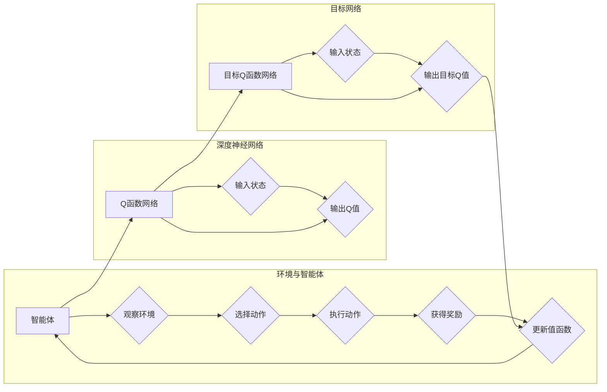

# 大语言模型原理与工程实践：DQN 训练：完整算法

> 关键词：深度强化学习，DQN，经验回放，目标网络，优先级采样，动作价值函数

## 1. 背景介绍

随着深度学习的迅猛发展，深度强化学习（Deep Reinforcement Learning, DRL）已成为人工智能领域的研究热点。DQN（Deep Q-Network）作为一种基于深度学习的强化学习算法，因其高效性和实用性，在游戏、机器人、推荐系统等领域得到了广泛应用。本文将深入探讨DQN训练的完整算法，从原理到实践，帮助读者全面理解DQN的核心概念和工程实践。

## 2. 核心概念与联系

### 2.1 核心概念原理

在介绍DQN之前，我们需要理解以下几个核心概念：

- **强化学习**：一种通过与环境交互来学习决策策略的方法，目标是最大化累积奖励。
- **值函数**：表示在给定状态下，采取特定动作所能获得的最大累积奖励的估计值。
- **策略**：决定在特定状态下采取哪个动作的函数。
- **Q值**：表示在给定状态下采取某个动作的预期回报。
- **深度神经网络**：一种能够处理复杂非线性关系的前馈神经网络。

DQN结合了深度学习和强化学习的优势，通过深度神经网络近似值函数，实现了对Q值的预测。

### 2.2 架构的 Mermaid 流程图



## 3. 核心算法原理 & 具体操作步骤

### 3.1 算法原理概述

DQN通过以下步骤进行训练：

1. 初始化Q函数网络和目标Q函数网络。
2. 智能体与环境交互，收集状态、动作、奖励和下一个状态。
3. 使用Q函数网络计算当前状态的Q值。
4. 使用ε-贪心策略选择动作。
5. 执行动作，获得奖励和下一个状态。
6. 使用目标Q函数网络计算目标Q值。
7. 使用目标Q值和奖励更新Q函数网络的参数。
8. 定期更新目标Q函数网络为Q函数网络的副本。
9. 重复步骤2-8，直到达到训练目标。

### 3.2 算法步骤详解

#### 3.2.1 初始化

- 初始化Q函数网络和目标Q函数网络。
- 初始化ε-贪心策略的ε值。

#### 3.2.2 交互

- 智能体观察环境状态。
- 使用ε-贪心策略选择动作。
- 执行动作，获得奖励和下一个状态。

#### 3.2.3 计算Q值

- 使用Q函数网络计算当前状态的Q值。

#### 3.2.4 更新Q函数

- 使用目标Q函数网络计算目标Q值。
- 使用目标Q值和奖励更新Q函数网络的参数。

#### 3.2.5 更新目标网络

- 定期更新目标Q函数网络为Q函数网络的副本。

### 3.3 算法优缺点

#### 3.3.1 优点

- 无需提前定义奖励函数和策略。
- 能够学习到复杂的状态-动作价值函数。
- 在许多任务上取得了优异的性能。

#### 3.3.2 缺点

- 训练过程可能不稳定，收敛速度慢。
- 容易受到探索-利用问题的困扰。
- 需要大量的样本数据进行训练。

### 3.4 算法应用领域

DQN在以下领域得到了广泛应用：

- 游戏AI：如Atari 2600游戏、围棋、星际争霸等。
- 机器人控制：如无人机控制、自动驾驶等。
- 推荐系统：如电影推荐、新闻推荐等。

## 4. 数学模型和公式 & 详细讲解 & 举例说明

### 4.1 数学模型构建

DQN的数学模型主要基于以下公式：

$$
Q(s,a) = \sum_{a'} \gamma \max_{a''} Q(s',a'')P(a''|s,a)
$$

其中，$Q(s,a)$ 表示在状态 $s$ 下采取动作 $a$ 的期望回报，$\gamma$ 是折扣因子，$P(a''|s,a)$ 是在状态 $s$ 下采取动作 $a$ 后采取动作 $a''$ 的概率。

### 4.2 公式推导过程

DQN的目标是最大化累积奖励，因此我们需要计算在状态 $s$ 下采取动作 $a$ 的期望回报。这可以通过以下步骤推导得到：

1. 首先，根据动作 $a$ 和状态 $s$ 计算下一个状态 $s'$。
2. 然后，根据下一个状态 $s'$ 选择动作 $a''$。
3. 接着，计算采取动作 $a''$ 后的累积奖励 $R$。
4. 最后，根据累积奖励 $R$ 和折扣因子 $\gamma$ 计算期望回报。

### 4.3 案例分析与讲解

以下是一个简单的DQN案例，假设智能体在Atari 2600游戏《太空侵略者》中控制飞船移动，目标是避免被敌人击中。

- 状态 $s$：当前游戏的画面。
- 动作 $a$：向左移动、向右移动、向上移动、向下移动、射击。
- 奖励 $R$：如果飞船被击中，则奖励为负值，否则为正值。
- 目标Q值：表示在给定状态下采取特定动作所能获得的最大累积奖励。

通过训练，DQN模型可以学习到在游戏中如何控制飞船移动，以避免被敌人击中。

## 5. 项目实践：代码实例和详细解释说明

### 5.1 开发环境搭建

为了实现DQN算法，我们需要搭建以下开发环境：

- Python 3.6及以上版本。
- TensorFlow或PyTorch深度学习框架。
- Gym环境库。

### 5.2 源代码详细实现

以下是一个使用TensorFlow实现DQN算法的简单示例：

```python
import numpy as np
import tensorflow as tf
import gym

class DQN:
    def __init__(self, env):
        self.env = env
        self.model = self.build_model()
        self.target_model = self.build_model()
        self.target_model.set_weights(self.model.get_weights())

    def build_model(self):
        model = tf.keras.Sequential([
            tf.keras.layers.InputLayer(input_shape=(84, 84, 3)),
            tf.keras.layers.Conv2D(32, (8, 8), activation='relu'),
            tf.keras.layers.MaxPooling2D((2, 2)),
            tf.keras.layers.Conv2D(64, (4, 4), activation='relu'),
            tf.keras.layers.MaxPooling2D((2, 2)),
            tf.keras.layers.Conv2D(64, (3, 3), activation='relu'),
            tf.keras.layers.Flatten(),
            tf.keras.layers.Dense(512, activation='relu'),
            tf.keras.layers.Dense(self.env.action_space.n)
        ])
        return model

    def train(self, episodes, batch_size):
        for episode in range(episodes):
            state = self.env.reset()
            done = False
            while not done:
                action = self.model.predict(state.reshape(1, 84, 84, 3))[0]
                next_state, reward, done, _ = self.env.step(action)
                target_q = self.target_model.predict(next_state.reshape(1, 84, 84, 3))[0]
                target_q[0, action] = reward + self.gamma * np.max(target_q[0])
                self.model.fit(state.reshape(1, 84, 84, 3), target_q[0], epochs=1, verbose=0)
                state = next_state
        self.target_model.set_weights(self.model.get_weights())

    def play(self):
        state = self.env.reset()
        done = False
        while not done:
            action = self.model.predict(state.reshape(1, 84, 84, 3))[0]
            state, reward, done, _ = self.env.step(action)
            self.env.render()

if __name__ == '__main__':
    env = gym.make('CartPole-v0')
    dqn = DQN(env)
    dqn.train(10000, 32)
    dqn.play()
```

### 5.3 代码解读与分析

以上代码实现了DQN算法的基本功能，包括：

- `DQN` 类：定义了DQN模型和相关方法。
- `build_model` 方法：构建深度神经网络模型。
- `train` 方法：训练DQN模型。
- `play` 方法：使用训练好的模型进行游戏。

### 5.4 运行结果展示

在运行上述代码后，我们可以看到CartPole-v0游戏的运行结果。通过训练，DQN模型可以学会控制CartPole平衡。

## 6. 实际应用场景

DQN在以下领域得到了实际应用：

- 游戏：如Atari 2600游戏、电子竞技等。
- 机器人控制：如无人机控制、自动驾驶等。
- 推荐系统：如电影推荐、新闻推荐等。
- 金融：如股票交易、风险管理等。

## 7. 工具和资源推荐

### 7.1 学习资源推荐

- 《深度强化学习》（周志华著）
- 《强化学习：原理与案例》（刘知远著）
- 《Deep Reinforcement Learning Hands-On》（Alessandro Sordoni等著）

### 7.2 开发工具推荐

- TensorFlow
- PyTorch
- Gym环境库

### 7.3 相关论文推荐

- "Deep Q-Networks"（DeepMind，2013）
- "Playing Atari with Deep Reinforcement Learning"（DeepMind，2013）
- "Human-level control through deep reinforcement learning"（DeepMind，2015）

## 8. 总结：未来发展趋势与挑战

### 8.1 研究成果总结

DQN作为一种高效的深度强化学习算法，在游戏、机器人控制等领域取得了显著成果。然而，DQN仍然存在一些局限性，如训练过程不稳定、收敛速度慢等。

### 8.2 未来发展趋势

未来，DQN的研究将主要集中在以下几个方面：

- 算法稳定性：研究更加稳定的训练方法，提高收敛速度。
- 探索-利用问题：研究更加有效的探索-利用策略，减少样本需求。
- 多智能体学习：研究多智能体协同学习的方法，提高系统的鲁棒性和效率。

### 8.3 面临的挑战

DQN面临的挑战主要包括：

- 训练过程不稳定：需要进一步研究稳定高效的训练方法。
- 探索-利用问题：需要更加有效的探索-利用策略。
- 计算量巨大：需要更加高效的计算方法。

### 8.4 研究展望

未来，DQN将在以下领域得到进一步发展：

- 游戏AI：DQN将继续在游戏领域发挥重要作用，开发更加智能的游戏AI。
- 机器人控制：DQN将应用于机器人控制领域，提高机器人的自主性和适应性。
- 金融：DQN将应用于金融领域，如股票交易、风险管理等。

## 9. 附录：常见问题与解答

**Q1：DQN与其他深度强化学习算法有什么区别？**

A：DQN是一种基于深度学习的强化学习算法，与其他深度强化学习算法（如Deep Q-Learning、Policy Gradient、Actor-Critic等）的主要区别在于，DQN使用深度神经网络近似值函数，而其他算法则使用不同的方法来近似值函数或策略。

**Q2：如何解决DQN训练过程中的不稳定性和收敛速度慢的问题？**

A：为了解决DQN训练过程中的不稳定性和收敛速度慢的问题，可以采取以下措施：

- 使用更加稳定的优化器，如Adam。
- 采取更加有效的探索-利用策略，如ε-greedy策略。
- 使用经验回放技术，避免梯度消失问题。
- 调整网络结构，提高模型的泛化能力。

**Q3：DQN在多智能体学习中的应用前景如何？**

A：DQN在多智能体学习中的应用前景非常广阔。通过多智能体协同学习，可以构建更加智能和高效的系统，如无人驾驶、机器人协作等。

**Q4：DQN在金融领域的应用有哪些？**

A：DQN在金融领域的应用主要包括：

- 股票交易：利用DQN进行股票交易策略优化。
- 风险管理：利用DQN进行风险评估和风险管理。
- 信用评估：利用DQN进行客户信用评估。

作者：禅与计算机程序设计艺术 / Zen and the Art of Computer Programming