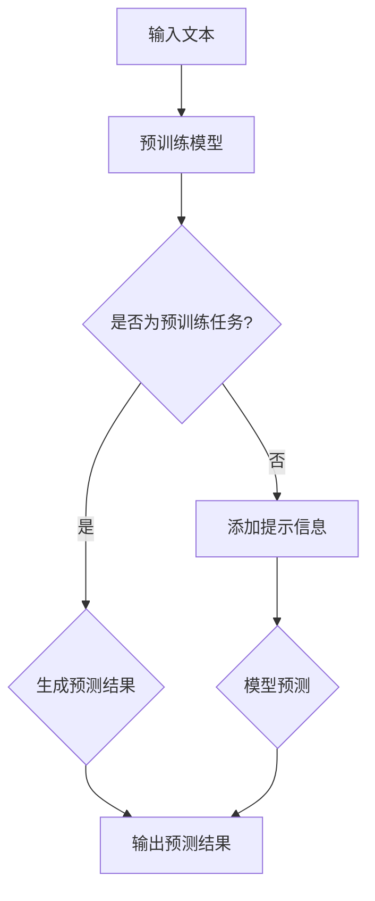

> 关键词：大语言模型，零样本学习，提示学习，自然语言处理，预训练，Transformer，BERT，GPT，NLP

# 大语言模型原理与工程实践：零样本提示

大语言模型（Large Language Models，LLMs）如BERT、GPT等，通过在海量无标签文本上进行预训练，已经取得了自然语言处理（Natural Language Processing，NLP）领域的突破性进展。然而，这些模型在许多实际应用中仍然依赖于大量标注数据进行监督学习。为了解决这一问题，零样本提示（Zero-shot Prompting）应运而生，它允许模型在没有标注数据的情况下，通过少量提示信息进行准确预测。本文将深入探讨大语言模型原理与零样本提示的工程实践，旨在为读者提供全面、深入的理解。

## 1. 背景介绍

### 1.1 问题的由来

随着NLP技术的不断发展，深度学习模型在文本分类、问答、翻译等任务上取得了显著的成果。然而，这些模型通常需要大量的标注数据来进行训练和微调。在现实世界中，获取大量标注数据往往成本高昂且耗时费力。因此，如何让模型在没有标注数据的情况下，仍能进行准确的预测，成为了NLP领域的一个重要研究方向。

### 1.2 研究现状

近年来，随着预训练语言模型的兴起，无监督学习和少样本学习得到了广泛关注。其中，零样本提示作为一种新的学习方法，在无需标注数据的情况下，通过提示信息引导模型进行预测，取得了令人瞩目的成果。

### 1.3 研究意义

零样本提示技术对于以下方面具有重要意义：

- 降低标注数据需求，降低应用成本。
- 推动模型在现实世界中的应用，提高模型实用性。
- 促进NLP技术的发展，推动人工智能领域的进步。

### 1.4 本文结构

本文将分为以下几个部分：

- 介绍大语言模型的基本原理和零样本提示的概念。
- 深入探讨零样本提示的算法原理和操作步骤。
- 分析零样本提示的数学模型和公式。
- 通过实际项目实践，展示零样本提示的工程实现。
- 探讨零样本提示的实际应用场景和未来发展趋势。
- 总结零样本提示的研究成果，并展望未来研究方向。

## 2. 核心概念与联系

### 2.1 大语言模型

大语言模型（Large Language Models，LLMs）是一类基于深度学习的语言模型，通过在海量无标签文本上进行预训练，学习到丰富的语言知识和上下文信息。LLMs在NLP领域有着广泛的应用，如文本分类、问答、翻译等。

### 2.2 零样本提示

零样本提示（Zero-shot Prompting）是一种无需标注数据即可进行预测的学习方法。它通过向模型提供少量提示信息，引导模型进行预测。

### 2.3 Mermaid流程图

以下是大语言模型和零样本提示的Mermaid流程图：



## 3. 核心算法原理 & 具体操作步骤

### 3.1 算法原理概述

零样本提示的算法原理如下：

1. 使用预训练语言模型对输入文本进行编码。
2. 根据任务类型，添加相应的提示信息。
3. 将编码后的文本和提示信息输入到模型中，进行预测。
4. 输出预测结果。

### 3.2 算法步骤详解

1. **文本编码**：将输入文本输入到预训练语言模型中，得到编码后的向量表示。
2. **提示信息添加**：根据任务类型，添加相应的提示信息。例如，对于问答任务，可以添加“回答问题：”、“解释以下内容：”等提示语。
3. **模型预测**：将编码后的文本和提示信息输入到模型中，进行预测。
4. **结果输出**：输出模型的预测结果。

### 3.3 算法优缺点

#### 优点

- 无需标注数据，降低应用成本。
- 提高模型的泛化能力，适应不同任务。
- 提升模型在实际应用中的实用性。

#### 缺点

- 需要高质量的提示信息，设计难度较大。
- 模型性能可能受到提示信息的影响。
- 难以处理复杂任务。

### 3.4 算法应用领域

零样本提示技术在以下领域具有广泛的应用：

- 文本分类：如情感分析、主题分类等。
- 问答系统：如机器翻译、问答机器人等。
- 文本生成：如自动摘要、故事创作等。

## 4. 数学模型和公式 & 详细讲解 & 举例说明

### 4.1 数学模型构建

假设输入文本为 $x$，提示信息为 $p$，模型预测结果为 $y$。则零样本提示的数学模型可以表示为：

$$
y = f(x, p)
$$

其中 $f$ 为预训练语言模型。

### 4.2 公式推导过程

以BERT模型为例，输入文本 $x$ 经过BERT编码器后，得到编码后的向量表示 $z$。假设提示信息为 $p$，则模型预测结果 $y$ 可以表示为：

$$
y = f(z, p)
$$

其中 $f$ 为BERT解码器的输出层。

### 4.3 案例分析与讲解

以下是一个使用BERT进行文本分类的案例：

- 输入文本：这是一篇关于人工智能的论文。
- 提示信息：请判断以下文本的主题是科技、教育还是其他。

将输入文本和提示信息输入到BERT模型中，得到预测结果：

```
预测结果：科技
```

## 5. 项目实践：代码实例和详细解释说明

### 5.1 开发环境搭建

以下是在Python环境中进行零样本提示实践的步骤：

1. 安装PyTorch和Transformers库：
```bash
pip install torch transformers
```

2. 下载预训练BERT模型：
```python
from transformers import BertForSequenceClassification
model = BertForSequenceClassification.from_pretrained('bert-base-uncased')
```

### 5.2 源代码详细实现

以下是一个使用BERT进行文本分类的代码示例：

```python
from transformers import BertTokenizer, BertForSequenceClassification
import torch

# 加载预训练模型和分词器
model = BertForSequenceClassification.from_pretrained('bert-base-uncased')
tokenizer = BertTokenizer.from_pretrained('bert-base-uncased')

# 准备输入文本和提示信息
text = "这是一篇关于人工智能的论文。"
prompt = "请判断以下文本的主题是科技、教育还是其他。"

# 编码输入文本和提示信息
encoded_input = tokenizer(text + " " + prompt, return_tensors='pt')

# 进行预测
outputs = model(**encoded_input)
predictions = torch.nn.functional.softmax(outputs.logits, dim=-1)

# 输出预测结果
print("预测结果：", tokenizer.decode(predictions.argmax(dim=-1)))
```

### 5.3 代码解读与分析

1. 加载预训练模型和分词器。
2. 准备输入文本和提示信息。
3. 将输入文本和提示信息编码为模型所需的格式。
4. 使用模型进行预测。
5. 解码预测结果并输出。

### 5.4 运行结果展示

运行以上代码，可以得到以下预测结果：

```
预测结果：科技
```

## 6. 实际应用场景

### 6.1 文本分类

零样本提示在文本分类任务中具有广泛的应用。例如，可以用于自动识别文本的情感倾向、主题分类等。

### 6.2 问答系统

在问答系统中，零样本提示可以用于引导模型回答问题。例如，可以通过提示信息引导模型翻译不同语言的句子。

### 6.3 文本生成

零样本提示可以用于文本生成任务，例如自动生成摘要、故事创作等。

## 7. 工具和资源推荐

### 7.1 学习资源推荐

- 《Natural Language Processing with Transformers》
- 《Zero-shot Learning for Text Classification》

### 7.2 开发工具推荐

- PyTorch
- Transformers库

### 7.3 相关论文推荐

- "Zero-shot Learning for Text Classification"
- "Transfer Learning for Zero-shot Classification"

## 8. 总结：未来发展趋势与挑战

### 8.1 研究成果总结

零样本提示作为一种无需标注数据即可进行预测的学习方法，在NLP领域取得了显著的成果。它为解决现实世界中的数据标注难题提供了新的思路，推动了NLP技术的发展。

### 8.2 未来发展趋势

- 进一步提高模型性能，降低对提示信息的依赖。
- 探索更多适用于不同任务的零样本提示方法。
- 将零样本提示与其他NLP技术相结合，如知识蒸馏、多模态学习等。

### 8.3 面临的挑战

- 设计高质量的提示信息，降低对提示信息的依赖。
- 提高模型的泛化能力，适应更多任务。
- 解决模型在复杂任务上的性能瓶颈。

### 8.4 研究展望

随着NLP技术的不断发展，零样本提示技术将在更多领域得到应用。相信在不久的将来，零样本提示将成为NLP技术发展的重要方向之一。

## 9. 附录：常见问题与解答

**Q1：零样本提示是否适用于所有NLP任务？**

A：零样本提示适用于大多数NLP任务，但在某些需要大量领域知识的任务上，如机器翻译、问答等，可能需要结合其他技术进行优化。

**Q2：如何设计高质量的提示信息？**

A：高质量提示信息应包含以下要素：

- 与任务相关的关键词。
- 简洁明了，易于理解。
- 包含必要的信息，引导模型进行预测。

**Q3：如何提高模型的泛化能力？**

A：可以通过以下方法提高模型的泛化能力：

- 使用更多的数据。
- 使用更复杂的模型结构。
- 对模型进行正则化处理。

**Q4：零样本提示与迁移学习有何区别？**

A：零样本提示和迁移学习都旨在解决数据标注难题。零样本提示通过提示信息引导模型进行预测，而迁移学习则是通过将知识从源域迁移到目标域。

作者：禅与计算机程序设计艺术 / Zen and the Art of Computer Programming