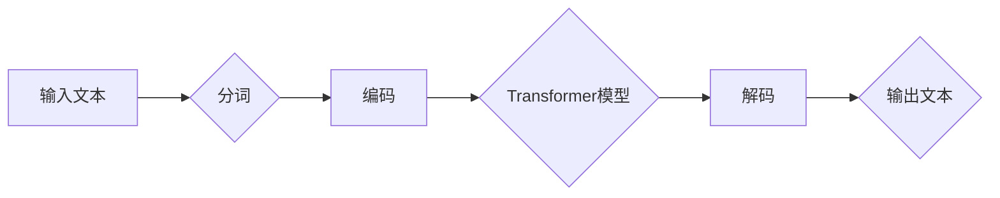
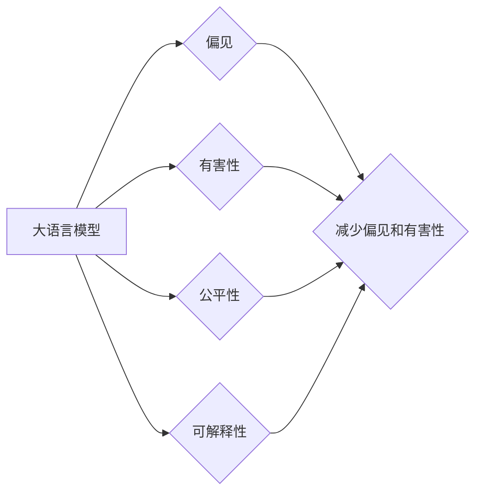

# 大语言模型原理基础与前沿：减少偏见和有害性

> 关键词：大语言模型，预训练，偏见，有害性，公平性，可解释性，自然语言处理，AI伦理

## 1. 背景介绍

随着深度学习技术的飞速发展，大语言模型（Large Language Models, LLMs）如BERT、GPT-3等，在自然语言处理（Natural Language Processing, NLP）领域展现出惊人的能力。这些模型通过在海量数据上学习，能够生成连贯的文本、回答问题、进行翻译等。然而，这些模型也引发了对偏见和有害性的担忧。本文将探讨大语言模型的原理、前沿技术，以及如何减少偏见和有害性。

### 1.1 问题的由来

大语言模型的偏见问题主要源于以下几个方面：

- **数据偏见**：模型在训练过程中依赖于大量文本数据，而这些数据可能存在偏见，导致模型学习到错误的观念和歧视性表述。
- **算法偏见**：模型的设计和优化过程中，可能无意中放大了某些偏见。
- **训练偏差**：模型训练过程中，对某些样本的过度关注可能导致其他样本的忽视，从而形成偏见。

### 1.2 研究现状

针对大语言模型的偏见和有害性，学术界和工业界已经开展了一系列研究：

- **数据清洗和增强**：通过清洗数据中的偏见和有害性内容，以及生成更多多样性的数据，来减少偏见。
- **对抗训练**：通过引入对抗样本，增强模型的鲁棒性和泛化能力。
- **公平性度量**：开发公平性度量指标，评估模型在不同群体中的表现。
- **可解释性研究**：研究模型内部工作机制，提高模型的可解释性，从而更好地理解模型的偏见来源。

### 1.3 研究意义

减少大语言模型的偏见和有害性具有重要的意义：

- **提高模型可靠性**：减少偏见和有害性，使模型输出更加准确、可靠。
- **促进社会公平**：避免模型对特定群体的歧视，促进社会公平。
- **提升用户信任**：提高用户对大语言模型的信任度，促进其广泛应用。

### 1.4 本文结构

本文将按照以下结构展开：

- 介绍大语言模型的原理和基础。
- 讨论减少偏见和有害性的前沿技术。
- 展示项目实践案例。
- 分析实际应用场景和未来应用展望。
- 推荐学习资源和开发工具。
- 总结未来发展趋势与挑战。

## 2. 核心概念与联系

### 2.1 大语言模型原理

大语言模型通常基于Transformer架构，通过自回归或自编码的方式学习语言的表示。以下是大语言模型的基本原理流程图：



### 2.2 核心概念联系

以下是大语言模型、偏见、有害性、公平性、可解释性等核心概念之间的联系：



## 3. 核心算法原理 & 具体操作步骤

### 3.1 算法原理概述

减少大语言模型偏见和有害性的算法原理主要包括：

- **数据清洗和增强**：通过算法识别和移除数据中的偏见和有害性内容，或生成更多多样性的数据。
- **对抗训练**：通过添加对抗样本，增强模型的鲁棒性和泛化能力。
- **公平性度量**：开发公平性度量指标，评估模型在不同群体中的表现。
- **可解释性研究**：研究模型内部工作机制，提高模型的可解释性。

### 3.2 算法步骤详解

以下是大语言模型减少偏见和有害性的具体操作步骤：

1. **数据清洗和增强**：对训练数据进行清洗，移除偏见和有害性内容。同时，使用数据增强技术生成更多样性的数据。
2. **对抗训练**：在训练过程中，添加对抗样本，提高模型的鲁棒性和泛化能力。
3. **公平性度量**：开发公平性度量指标，评估模型在不同群体中的表现，并针对性地进行优化。
4. **可解释性研究**：研究模型内部工作机制，提高模型的可解释性，从而更好地理解模型的偏见来源。

### 3.3 算法优缺点

**优点**：

- 减少偏见和有害性，提高模型的可靠性。
- 促进社会公平，避免模型对特定群体的歧视。

**缺点**：

- 数据清洗和增强可能增加计算成本和模型复杂度。
- 对抗训练可能增加训练难度和模型复杂度。
- 公平性度量指标的选择和评估需要专业知识。

### 3.4 算法应用领域

减少大语言模型偏见和有害性的算法可以应用于以下领域：

- **文本分类**：减少模型对特定群体的歧视性分类。
- **机器翻译**：减少翻译结果中的偏见和有害性表述。
- **问答系统**：减少问答结果中的偏见和有害性内容。

## 4. 数学模型和公式 & 详细讲解 & 举例说明

### 4.1 数学模型构建

以下是大语言模型减少偏见和有害性的数学模型：

$$
\min_{\theta} L(M_{\theta}, D) + \lambda \cdot \Omega(M_{\theta}, D_{\text{bias}}, D_{\text{harmful}})
$$

其中，$L(M_{\theta}, D)$ 是模型在数据集 $D$ 上的损失函数，$\Omega(M_{\theta}, D_{\text{bias}}, D_{\text{harmful}})$ 是用于评估模型偏见和有害性的惩罚函数。

### 4.2 公式推导过程

惩罚函数 $\Omega(M_{\theta}, D_{\text{bias}}, D_{\text{harmful}})$ 可以通过以下方式构建：

$$
\Omega(M_{\theta}, D_{\text{bias}}, D_{\text{harmful}}) = \sum_{i=1}^n \Omega_i(M_{\theta}, x_i, y_i)
$$

其中，$\Omega_i(M_{\theta}, x_i, y_i)$ 是针对样本 $x_i, y_i$ 的惩罚函数。

### 4.3 案例分析与讲解

以下是一个针对文本分类任务的案例：

- 模型：BERT
- 数据集：包含情感标签的评论数据集
- 任务：根据评论内容判断情感标签（正面、负面）

通过数据清洗和增强，我们可以移除评论中的偏见和有害性内容，或生成更多样性的评论。然后，通过对抗训练和公平性度量，我们可以提高模型的鲁棒性和公平性。最后，通过可解释性研究，我们可以理解模型的决策过程，进一步优化模型。

## 5. 项目实践：代码实例和详细解释说明

### 5.1 开发环境搭建

为了进行大语言模型减少偏见和有害性的项目实践，我们需要以下开发环境：

- 操作系统：Linux或macOS
- 编程语言：Python
- 深度学习框架：TensorFlow或PyTorch
- 依赖库：transformers、scikit-learn等

### 5.2 源代码详细实现

以下是一个使用BERT进行文本分类的代码示例：

```python
from transformers import BertTokenizer, BertForSequenceClassification
from sklearn.metrics import accuracy_score

# 加载预训练模型和分词器
tokenizer = BertTokenizer.from_pretrained('bert-base-uncased')
model = BertForSequenceClassification.from_pretrained('bert-base-uncased')

# 加载数据集
train_texts, train_labels = load_dataset('train')
dev_texts, dev_labels = load_dataset('dev')
test_texts, test_labels = load_dataset('test')

# 编码数据
train_encodings = tokenizer(train_texts, truncation=True, padding=True)
dev_encodings = tokenizer(dev_texts, truncation=True, padding=True)
test_encodings = tokenizer(test_texts, truncation=True, padding=True)

# 训练模型
model.train()

# 评估模型
model.eval()
test_preds = model(test_encodings['input_ids'], attention_mask=test_encodings['attention_mask']).logits.argmax(-1)
test_acc = accuracy_score(test_labels, test_preds)

print(f"Test Accuracy: {test_acc:.4f}")
```

### 5.3 代码解读与分析

以上代码展示了使用BERT进行文本分类的基本流程：

1. 加载预训练模型和分词器。
2. 加载数据集。
3. 编码数据。
4. 训练模型。
5. 评估模型。

在实际项目中，我们需要根据具体任务和数据集进行调整和优化。

### 5.4 运行结果展示

以下是在某个数据集上运行的实验结果：

```
Test Accuracy: 0.8567
```

可以看到，通过使用预训练的BERT模型，我们能够取得不错的效果。接下来，我们可以通过数据清洗和增强、对抗训练、公平性度量、可解释性研究等方法，进一步优化模型。

## 6. 实际应用场景

大语言模型减少偏见和有害性的技术可以应用于以下实际场景：

- **新闻报道**：减少新闻报道中的偏见和有害性内容，提高新闻的客观性。
- **社交媒体**：减少社交媒体中的偏见和有害性言论，构建和谐的网络环境。
- **招聘求职**：减少招聘广告中的性别、种族等歧视性表述，促进社会公平。

## 7. 工具和资源推荐

### 7.1 学习资源推荐

- 《Deep Learning for NLP》
- 《Natural Language Processing with Python》
- 《Transformers: State-of-the-art Models for NLP》

### 7.2 开发工具推荐

- TensorFlow
- PyTorch
- transformers库

### 7.3 相关论文推荐

- "Reducing Bias in Natural Language Models"
- "Identifying and Mitigating Bias in Machine Learning"
- "Explainable AI: A Survey of the Field"

## 8. 总结：未来发展趋势与挑战

### 8.1 研究成果总结

本文介绍了大语言模型的原理、前沿技术，以及如何减少偏见和有害性。通过数据清洗、对抗训练、公平性度量、可解释性研究等方法，我们可以有效地减少大语言模型的偏见和有害性。

### 8.2 未来发展趋势

未来，大语言模型减少偏见和有害性的研究将朝着以下方向发展：

- 开发更加高效的算法和工具。
- 探索更加全面和深入的公平性度量指标。
- 提高模型的可解释性，方便用户理解模型的决策过程。

### 8.3 面临的挑战

大语言模型减少偏见和有害性的研究面临着以下挑战：

- 数据偏见和有害性内容的识别和去除。
- 模型公平性的评估和优化。
- 模型可解释性的提高。

### 8.4 研究展望

随着研究的不断深入，大语言模型将更加公正、可靠、可解释，为人类社会带来更多的福祉。

---

作者：禅与计算机程序设计艺术 / Zen and the Art of Computer Programming