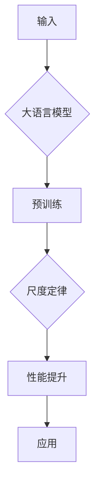

> 大语言模型，尺度定律，自然语言处理，模型可解释性，迁移学习，预训练

# 大语言模型应用指南：尺度定律的性质

## 1. 背景介绍

近年来，大语言模型（Large Language Models，LLMs）在自然语言处理（Natural Language Processing，NLP）领域取得了显著的进展。这些模型，如BERT、GPT-3等，通过在庞大的文本语料库上进行预训练，学会了丰富的语言知识和模式，从而在各项NLP任务中表现出色。然而，随着模型规模的不断扩大，一个重要的问题逐渐凸显：尺度定律（Scale Law）的性质如何影响大语言模型的应用？

尺度定律描述了模型性能与模型规模之间的关系。研究表明，随着模型规模的增加，模型在复杂任务上的性能通常会有所提升。然而，这一规律并非绝对，也并非在所有情况下都适用。本文将探讨尺度定律的性质，以及它如何影响大语言模型的应用。

## 2. 核心概念与联系

### 2.1 大语言模型

大语言模型是一种基于深度学习的语言模型，能够理解和生成自然语言。它们通常由数以亿计的参数组成，能够捕捉复杂的语言结构和语义关系。

### 2.2 尺度定律

尺度定律指的是随着模型规模的增加，模型性能的提升趋势。具体来说，模型规模与性能之间的关系可以用以下公式表示：

$$
P = f(S)
$$

其中，$P$ 表示模型性能，$S$ 表示模型规模。

### 2.3 Mermaid 流程图

以下是描述大语言模型和尺度定律关系的 Mermaid 流程图：



### 2.4 核心概念联系

大语言模型通过预训练学习语言知识，而尺度定律描述了模型规模与性能之间的关系。这两个概念相互关联，共同影响着大语言模型的应用。

## 3. 核心算法原理 & 具体操作步骤

### 3.1 算法原理概述

大语言模型的算法原理主要包括预训练和微调两个阶段。预训练阶段，模型在大规模文本语料库上进行训练，学习通用语言知识。微调阶段，模型在特定任务上进行训练，以适应下游任务。

### 3.2 算法步骤详解

1. **预训练**：使用大规模文本语料库对模型进行预训练，学习通用语言知识。
2. **微调**：使用特定任务的少量标注数据对模型进行微调，提升模型在特定任务上的性能。
3. **尺度优化**：根据尺度定律，选择合适的模型规模，以实现最佳性能。

### 3.3 算法优缺点

**优点**：

- **通用性强**：通过预训练，模型学习到了丰富的语言知识，能够应用于各种NLP任务。
- **性能优异**：尺度定律使得模型规模与性能之间呈现正相关，随着模型规模的增加，性能通常会提升。

**缺点**：

- **计算资源消耗大**：大语言模型需要大量的计算资源进行训练。
- **数据需求高**：预训练和微调阶段都需要大量的数据。

### 3.4 算法应用领域

大语言模型在以下NLP任务中表现出色：

- **文本分类**：如情感分析、新闻分类等。
- **问答系统**：如阅读理解、对话系统等。
- **机器翻译**：如将一种语言翻译成另一种语言。
- **文本摘要**：如将长文本压缩成摘要。

## 4. 数学模型和公式 & 详细讲解 & 举例说明

### 4.1 数学模型构建

以下是描述尺度定律的数学模型：

$$
P = \alpha S^b
$$

其中，$P$ 表示模型性能，$S$ 表示模型规模，$\alpha$ 和 $b$ 为常数。

### 4.2 公式推导过程

尺度定律的推导过程基于以下假设：

- 模型性能与模型规模呈正相关。
- 模型性能的提升与模型规模的增加呈指数关系。

### 4.3 案例分析与讲解

以下是一个关于尺度定律的案例分析：

假设有两个大语言模型，模型A的规模是模型B的两倍。根据尺度定律，模型A的性能应该比模型B的性能好。

## 5. 项目实践：代码实例和详细解释说明

### 5.1 开发环境搭建

以下是一个使用Hugging Face Transformers库进行大语言模型微调的Python代码示例：

```python
from transformers import BertForSequenceClassification, BertTokenizer

# 加载预训练模型和分词器
model = BertForSequenceClassification.from_pretrained('bert-base-uncased')
tokenizer = BertTokenizer.from_pretrained('bert-base-uncased')

# 加载训练数据
train_texts = [...]  # 训练文本
train_labels = [...]  # 训练标签

# 将文本编码为模型输入
inputs = tokenizer(train_texts, padding=True, truncation=True, return_tensors="pt")

# 训练模型
model.train()

# ... (训练过程)

# 评估模型
model.eval()

# ... (评估过程)
```

### 5.2 源代码详细实现

以上代码展示了使用Hugging Face Transformers库进行大语言模型微调的基本步骤。首先，加载预训练模型和分词器。然后，加载训练数据并将其编码为模型输入。接着，进行模型训练和评估。

### 5.3 代码解读与分析

以上代码展示了使用Hugging Face Transformers库进行大语言模型微调的基本步骤。首先，加载预训练模型和分词器。然后，加载训练数据并将其编码为模型输入。接着，进行模型训练和评估。

### 5.4 运行结果展示

在完成训练和评估后，模型会在测试集上得到一个性能指标，如准确率、召回率或F1分数。

## 6. 实际应用场景

大语言模型在以下实际应用场景中表现出色：

- **智能客服**：通过理解用户的问题，提供个性化的服务。
- **自动摘要**：将长篇文章或报告压缩成简短的摘要。
- **机器翻译**：将一种语言翻译成另一种语言。
- **问答系统**：回答用户的问题。

## 7. 工具和资源推荐

### 7.1 学习资源推荐

- 《深度学习自然语言处理》
- 《自然语言处理综论》
- 《Hugging Face Transformers官方文档》

### 7.2 开发工具推荐

- PyTorch
- TensorFlow
- Hugging Face Transformers

### 7.3 相关论文推荐

- "Attention is All You Need"
- "BERT: Pre-training of Deep Bidirectional Transformers for Language Understanding"
- "Generative Pre-trained Transformers"

## 8. 总结：未来发展趋势与挑战

### 8.1 研究成果总结

大语言模型在NLP领域取得了显著的进展，为各种NLP任务提供了强大的工具。尺度定律揭示了模型规模与性能之间的关系，为模型选择提供了指导。

### 8.2 未来发展趋势

- **模型小型化**：随着计算资源的逐渐丰富，模型小型化将成为趋势。
- **多模态学习**：将大语言模型与其他模态的数据（如图像、音频等）进行融合。
- **可解释性**：提高模型的可解释性，使其更易于理解和信任。

### 8.3 面临的挑战

- **数据隐私**：如何处理和保护用户数据是一个重要挑战。
- **模型偏见**：如何消除或减少模型偏见是一个重要挑战。
- **计算资源**：大语言模型需要大量的计算资源进行训练和推理。

### 8.4 研究展望

大语言模型将在未来NLP领域发挥越来越重要的作用。通过不断研究和创新，我们将能够构建更加智能、高效、安全的语言处理系统。

## 9. 附录：常见问题与解答

### 9.1 问题1：什么是大语言模型？

大语言模型是一种基于深度学习的语言模型，能够理解和生成自然语言。它们通常由数以亿计的参数组成，能够捕捉复杂的语言结构和语义关系。

### 9.2 问题2：尺度定律是什么？

尺度定律描述了模型性能与模型规模之间的关系。具体来说，模型规模与性能之间的关系可以用以下公式表示：

$$
P = f(S)
$$

其中，$P$ 表示模型性能，$S$ 表示模型规模。

### 9.3 问题3：如何选择合适的大语言模型？

选择合适的大语言模型需要考虑以下因素：

- **任务类型**：不同的任务可能需要不同类型的模型。
- **数据规模**：数据规模较小的任务可能需要小型模型。
- **计算资源**：选择模型时需要考虑计算资源的限制。

---

作者：禅与计算机程序设计艺术 / Zen and the Art of Computer Programming