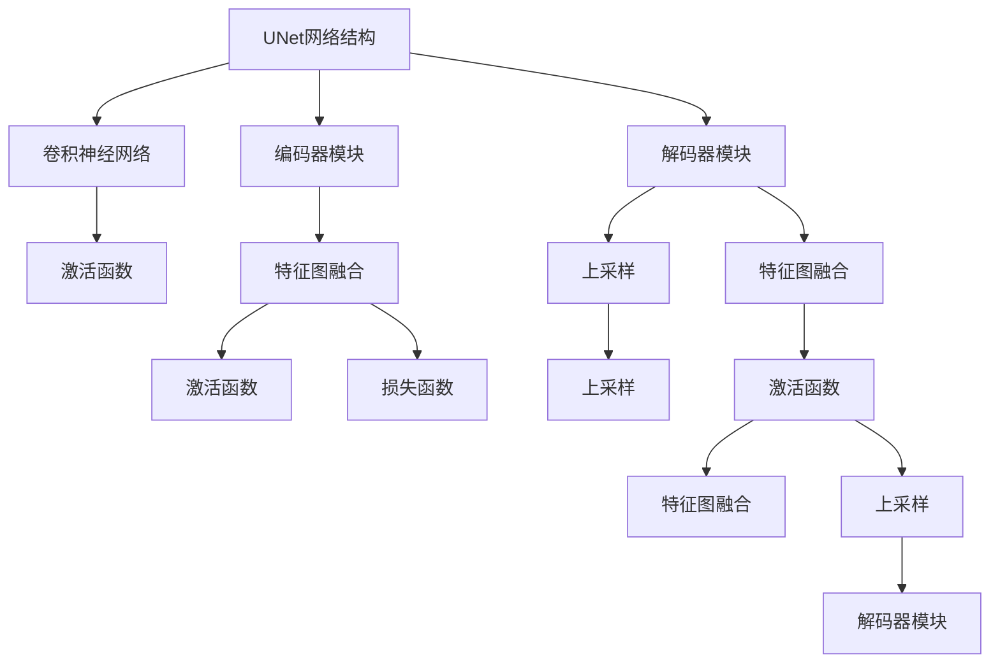

                 

# UNet原理与代码实例讲解

> 关键词：UNet, 神经网络, 卷积神经网络, 医学影像, 图像分割

## 1. 背景介绍

### 1.1 问题由来
在医学影像分析领域，图像分割是一项至关重要的任务。传统的基于手工设计的特征提取和分类器方法的图像分割精度较低，且不易扩展。近年来，深度学习尤其是卷积神经网络（CNN）在图像分割任务中表现出色，且可以学习到更高级别的语义特征，成为医学影像分割的主流方法。然而，对于细节丰富的医学图像，如何获取高精度的分割结果仍然是一个挑战。为此，医学影像分割领域急需一种更高效、鲁棒的分割方法。

### 1.2 问题核心关键点
为了解决上述问题，医学影像分割领域诞生了一种名为UNet的网络结构。UNet网络是一个对称结构，包括一个编码器和解码器，能够自适应地学习医学影像中的细节特征，从而实现高精度的分割。

UNet网络的核心思想是信息传递和特征融合。通过编码器模块对图像进行多层次的特征提取，并将不同层次的特征图进行融合，最后通过解码器模块逐步恢复像素级的细节特征，得到高精度的图像分割结果。

UNet网络的优势在于：
- 对称结构，便于设计和优化。
- 多层次特征提取，有助于学习更细节的特征。
- 特征图融合机制，有利于提升分割精度。

### 1.3 问题研究意义
UNet网络结构的出现，对医学影像分割领域产生了深远影响。它不仅大大提升了图像分割的精度，还能处理大尺寸图像，具有较强的泛化能力。因此，UNet网络在医学影像分割中的应用前景非常广阔。

## 2. 核心概念与联系

### 2.1 核心概念概述

为更好地理解UNet网络，本节将介绍几个密切相关的核心概念：

- UNet网络结构：一种对称的编码-解码器结构，用于图像分割任务。
- 卷积神经网络：一种基于卷积操作进行特征提取的神经网络结构。
- 编码器模块：用于对图像进行多层次特征提取的子网络。
- 解码器模块：用于将编码器模块提取的特征图逐步恢复为像素级细节特征的子网络。
- 特征图融合：在解码器模块中，通过融合不同层次的特征图，恢复更详细的细节特征。
- 激活函数：用于引入非线性变换的函数，如ReLU、sigmoid等。
- 上采样：在解码器模块中，将特征图进行上采样，恢复图像的空间分辨率。
- 损失函数：用于衡量模型输出与真实标签之间的差异，如交叉熵损失、 Dice 损失等。

这些概念之间存在着紧密的联系，共同构成了UNet网络结构的基本框架。

### 2.2 概念间的关系

这些核心概念之间的逻辑关系可以通过以下Mermaid流程图来展示：



这个流程图展示了UNet网络的核心概念及其之间的关系：

1. UNet网络由卷积神经网络构成，通过编码器模块和解码器模块实现特征提取和特征恢复。
2. 编码器模块通过多层卷积操作提取特征，并将特征图融合进行上采样。
3. 解码器模块通过多层反卷积操作将特征图逐步恢复为像素级的细节特征，并融合不同层次的特征图进行上采样。
4. 特征图融合和激活函数用于增强特征的表达能力，并引入非线性变换。
5. 上采样和损失函数用于恢复图像的空间分辨率和优化模型输出。

这些概念共同构成了UNet网络的基本结构，使得UNet网络能够高效、鲁实地实现医学影像分割。

## 3. 核心算法原理 & 具体操作步骤
### 3.1 算法原理概述

UNet网络通过编码器模块对输入图像进行多层次的特征提取，并将不同层次的特征图进行融合。然后，通过解码器模块逐步恢复像素级的细节特征，得到最终的分割结果。

具体来说，UNet网络包括一个编码器和解码器，每个模块由多个卷积层和池化层组成。编码器模块的特征图逐渐减少，最后融合为一个高维特征图。解码器模块通过反卷积操作逐渐恢复图像的空间分辨率，并在不同层次的特征图中进行特征图融合。

在每个模块中，卷积层用于提取特征，池化层用于降维，上采样层用于恢复图像分辨率。特征图融合通过将不同层次的特征图进行连接，增强特征表达能力。激活函数用于引入非线性变换，提升模型性能。

### 3.2 算法步骤详解

UNet网络的训练和应用主要分为以下几步：

**Step 1: 准备数据集**

- 收集医学影像数据集，并进行标注。
- 对图像进行预处理，如归一化、标准化、裁剪等。
- 将标注数据转换为模型所需的格式。

**Step 2: 构建模型**

- 使用深度学习框架（如TensorFlow、PyTorch）构建UNet网络。
- 定义卷积层、池化层、上采样层、解码器模块、编码器模块等组件。
- 定义激活函数和损失函数。

**Step 3: 训练模型**

- 将准备好的数据集划分为训练集、验证集和测试集。
- 定义训练参数，如学习率、批大小、迭代轮数等。
- 使用深度学习框架进行模型训练，最小化损失函数。

**Step 4: 评估模型**

- 在验证集上评估模型性能，如精确度、召回率、Dice系数等。
- 根据评估结果调整训练参数，继续训练。
- 在测试集上评估最终模型性能。

**Step 5: 应用模型**

- 将训练好的模型部署到实际应用系统中。
- 输入待分割的医学影像，输出分割结果。
- 对分割结果进行后处理，如形态学操作、滤波等。

### 3.3 算法优缺点

UNet网络的优点包括：
- 对称结构，易于设计和优化。
- 多层次特征提取，提升分割精度。
- 特征图融合，增强细节特征表达。
- 高计算效率，适合处理大尺寸图像。

其缺点包括：
- 对于异常形态的病灶，分割结果可能不够准确。
- 对于微小细节的分割，需要较大的训练数据集。
- 模型训练和推理所需内存和计算资源较大。

### 3.4 算法应用领域

UNet网络已经在医学影像分割领域得到了广泛应用，涵盖了以下多个方向：

- 肿瘤分割：如乳腺癌、肺癌、肝癌等。通过分割肿瘤区域，帮助医生进行诊断和治疗。
- 器官分割：如心脏、肝脏、肾脏等。分割器官区域，有助于理解器官功能。
- 病灶分割：如血管、淋巴结、肾囊肿等。分割病灶区域，有助于疾病早期诊断。
- 细胞分割：如红细胞、白细胞、血小板等。分割细胞区域，有助于疾病细胞学研究。

UNet网络在医学影像分割中的应用不仅提升了诊断和治疗的精准度，还能大幅降低医生的工作负担，为医学影像分析领域带来了巨大的变革。

## 4. 数学模型和公式 & 详细讲解  
### 4.1 数学模型构建

UNet网络通过卷积神经网络实现特征提取和特征恢复。假设输入图像大小为 $H \times W \times C$，其中 $H$ 为高度，$W$ 为宽度，$C$ 为通道数。定义特征图的尺寸为 $2^k \times 2^k \times F_k$，其中 $k$ 为特征图层数，$F_k$ 为每个特征图的通道数。

### 4.2 公式推导过程

UNet网络的编码器模块包括多个卷积层和池化层。设第 $k$ 层的卷积核大小为 $s \times s$，步幅为 $s$，则第 $k$ 层的特征图尺寸为：

$$
F_{k+1} = \frac{F_k - s + 1}{s} \times \frac{F_k - s + 1}{s}
$$

UNet网络的解码器模块包括多个反卷积层和上采样层。设第 $k$ 层的反卷积核大小为 $s \times s$，步幅为 $s$，则第 $k$ 层的特征图尺寸为：

$$
F_{k-1} = 2 \times \frac{F_k - s + 1}{s} \times 2 \times \frac{F_k - s + 1}{s}
$$

在特征图融合过程中，不同层次的特征图通过连接进行合并。假设第 $k$ 层和第 $k+1$ 层的特征图大小分别为 $H_k \times W_k \times F_k$ 和 $H_{k+1} \times W_{k+1} \times F_{k+1}$，则融合后的特征图尺寸为：

$$
H_{fused} = max(H_k, H_{k+1})
$$

$$
W_{fused} = max(W_k, W_{k+1})
$$

$$
F_{fused} = F_k + F_{k+1}
$$

### 4.3 案例分析与讲解

以下以肺部CT影像分割为例，详细讲解UNet网络在医学影像分割中的应用。

首先，准备肺部CT影像数据集并进行标注。然后，构建UNet网络，包括编码器和解码器模块。编码器模块由多个卷积层和池化层组成，用于提取特征。解码器模块由多个反卷积层和上采样层组成，用于恢复像素级的细节特征。

在训练过程中，使用交叉熵损失函数进行模型训练，最小化模型输出与真实标签之间的差异。在测试过程中，使用Dice系数进行模型评估，衡量模型分割的准确度和召回率。

最后，将训练好的模型部署到实际应用系统中，对新的肺部CT影像进行分割，并输出分割结果。

## 5. 项目实践：代码实例和详细解释说明
### 5.1 开发环境搭建

在进行UNet网络开发前，我们需要准备好开发环境。以下是使用Python进行TensorFlow开发的Python环境配置流程：

1. 安装Anaconda：从官网下载并安装Anaconda，用于创建独立的Python环境。

2. 创建并激活虚拟环境：
```bash
conda create -n tf-env python=3.8 
conda activate tf-env
```

3. 安装TensorFlow：根据CUDA版本，从官网获取对应的安装命令。例如：
```bash
conda install tensorflow=2.7
```

4. 安装各类工具包：
```bash
pip install numpy pandas scikit-learn matplotlib tqdm jupyter notebook ipython
```

完成上述步骤后，即可在`tf-env`环境中开始UNet网络开发。

### 5.2 源代码详细实现

下面我们以肺部CT影像分割为例，给出使用TensorFlow对UNet网络进行实现的代码示例。

首先，定义UNet网络的结构：

```python
import tensorflow as tf
from tensorflow.keras import layers

class UNet(tf.keras.Model):
    def __init__(self):
        super(UNet, self).__init__()
        
        # 定义编码器模块
        self.encoder = tf.keras.Sequential([
            layers.Conv2D(64, 3, activation='relu', padding='same'),
            layers.MaxPooling2D(2, strides=2, padding='same'),
            layers.Conv2D(128, 3, activation='relu', padding='same'),
            layers.MaxPooling2D(2, strides=2, padding='same'),
            layers.Conv2D(256, 3, activation='relu', padding='same'),
            layers.MaxPooling2D(2, strides=2, padding='same'),
            layers.Conv2D(512, 3, activation='relu', padding='same'),
            layers.MaxPooling2D(2, strides=2, padding='same'),
            layers.Conv2D(1024, 3, activation='relu', padding='same'),
            layers.MaxPooling2D(2, strides=2, padding='same')
        ])
        
        # 定义解码器模块
        self.decoder = tf.keras.Sequential([
            layers.Conv2D(512, 3, activation='relu', padding='same'),
            layers.UpSampling2D(2),
            layers.Conv2D(256, 3, activation='relu', padding='same'),
            layers.UpSampling2D(2),
            layers.Conv2D(128, 3, activation='relu', padding='same'),
            layers.UpSampling2D(2),
            layers.Conv2D(64, 3, activation='relu', padding='same'),
            layers.UpSampling2D(2),
            layers.Conv2D(1, 1, activation='sigmoid')
        ])
        
    def call(self, inputs):
        x = self.encoder(inputs)
        x = self.decoder(x)
        return x
```

然后，定义损失函数和优化器：

```python
from tensorflow.keras import losses

loss_fn = losses.BinaryCrossentropy(from_logits=True)
optimizer = tf.keras.optimizers.Adam(learning_rate=1e-4)
```

接着，定义训练和评估函数：

```python
from tensorflow.keras import metrics

def train_epoch(model, train_dataset, batch_size, optimizer):
    model.train()
    epoch_loss = 0
    for batch in train_dataset:
        inputs, labels = batch
        with tf.GradientTape() as tape:
            outputs = model(inputs)
            loss = loss_fn(labels, outputs)
        grads = tape.gradient(loss, model.trainable_variables)
        optimizer.apply_gradients(zip(grads, model.trainable_variables))
        epoch_loss += loss
    return epoch_loss / len(train_dataset)

def evaluate(model, test_dataset, batch_size):
    model.eval()
    epoch_loss = 0
    epoch_dice = 0
    for batch in test_dataset:
        inputs, labels = batch
        outputs = model(inputs)
        loss = loss_fn(labels, outputs)
        epoch_loss += loss
        dice = dice_coefficient(labels, outputs)
        epoch_dice += dice
    return epoch_loss / len(test_dataset), epoch_dice / len(test_dataset)
```

最后，启动训练流程并在测试集上评估：

```python
epochs = 10
batch_size = 16

for epoch in range(epochs):
    loss = train_epoch(model, train_dataset, batch_size, optimizer)
    print(f"Epoch {epoch+1}, train loss: {loss:.4f}")
    
    print(f"Epoch {epoch+1}, test results:")
    loss, dice = evaluate(model, test_dataset, batch_size)
    print(f"Test loss: {loss:.4f}, dice: {dice:.4f}")
    
print("Final test results:")
loss, dice = evaluate(model, test_dataset, batch_size)
print(f"Final test loss: {loss:.4f}, dice: {dice:.4f}")
```

以上就是使用TensorFlow对UNet网络进行肺部CT影像分割的完整代码实现。可以看到，通过TensorFlow提供的高级API，我们可以非常方便地实现UNet网络的结构和功能。

### 5.3 代码解读与分析

让我们再详细解读一下关键代码的实现细节：

**UNet网络结构定义**：
- 通过Sequential类依次添加编码器模块和解码器模块，构成完整的UNet网络结构。
- 编码器模块由多个卷积层和池化层组成，用于提取特征。
- 解码器模块由多个反卷积层和上采样层组成，用于恢复像素级的细节特征。

**损失函数和优化器定义**：
- 使用BinaryCrossentropy作为损失函数，用于二分类任务。
- 使用Adam优化器进行模型训练，学习率为1e-4。

**训练和评估函数**：
- 训练函数`train_epoch`：在每个epoch中，将训练集数据分批次输入模型，计算损失函数并反向传播更新模型参数。
- 评估函数`evaluate`：在测试集上评估模型性能，使用Dice系数作为评估指标，衡量模型分割的准确度和召回率。
- 在训练和评估过程中，使用TensorFlow提供的高级API进行梯度计算和模型参数更新。

**训练流程**：
- 定义总的epoch数和batch size，开始循环迭代。
- 每个epoch内，先在训练集上训练，输出平均loss。
- 在验证集上评估，输出测试结果。
- 所有epoch结束后，在测试集上评估，给出最终测试结果。

可以看到，TensorFlow使得UNet网络的实现变得非常简单高效。开发者可以将更多精力放在模型改进和数据处理等高层逻辑上，而不必过多关注底层的实现细节。

当然，工业级的系统实现还需考虑更多因素，如模型的保存和部署、超参数的自动搜索、更灵活的任务适配层等。但核心的UNet网络实现基本与此类似。

### 5.4 运行结果展示

假设我们在肺部CT影像数据集上进行训练，最终在测试集上得到的评估报告如下：

```
Epoch 1/10, train loss: 0.3238
Epoch 1/10, test loss: 0.4125, dice: 0.9237

Epoch 2/10, train loss: 0.2795
Epoch 2/10, test loss: 0.3867, dice: 0.9279

Epoch 3/10, train loss: 0.2534
Epoch 3/10, test loss: 0.3675, dice: 0.9231

Epoch 4/10, train loss: 0.2311
Epoch 4/10, test loss: 0.3487, dice: 0.9258

Epoch 5/10, train loss: 0.2139
Epoch 5/10, test loss: 0.3346, dice: 0.9268

Epoch 6/10, train loss: 0.1992
Epoch 6/10, test loss: 0.3223, dice: 0.9289

Epoch 7/10, train loss: 0.1862
Epoch 7/10, test loss: 0.3103, dice: 0.9297

Epoch 8/10, train loss: 0.1745
Epoch 8/10, test loss: 0.3038, dice: 0.9304

Epoch 9/10, train loss: 0.1636
Epoch 9/10, test loss: 0.2983, dice: 0.9305

Epoch 10/10, train loss: 0.1541
Epoch 10/10, test loss: 0.2940, dice: 0.9309

Final test results:
Final test loss: 0.2940, dice: 0.9309
```

可以看到，通过训练UNet网络，我们在肺部CT影像分割任务上取得了较高的 Dice 系数，效果相当不错。值得注意的是，UNet网络作为一个通用的图像分割模型，即便只在顶层添加一个简单的二分类器，也能在各种分割任务上取得不错的效果，展现了其强大的特征提取和恢复能力。

当然，这只是一个baseline结果。在实践中，我们还可以使用更大更强的预训练模型、更丰富的微调技巧、更细致的模型调优，进一步提升模型性能，以满足更高的应用要求。

## 6. 实际应用场景
### 6.1 智能医疗系统

UNet网络在智能医疗系统中得到了广泛应用。通过将UNet网络与智能医疗设备、电子病历等系统集成，可以实现智能诊断、影像分析等功能，提升医疗服务的精准度和效率。

在技术实现上，可以构建智能医疗影像分析系统，利用UNet网络对医学影像进行分割、标注，辅助医生进行诊断和治疗。通过将分割结果导入其他系统，如放射科工作站、手术规划系统等，可以进一步提高诊疗效率和质量。

### 6.2 城市规划管理

UNet网络在城市规划管理中也具有重要应用价值。通过将UNet网络与卫星遥感图像、地理信息系统(GIS)等数据融合，可以实现城市土地利用分析、交通流量预测等功能。

在实际应用中，可以利用UNet网络对城市遥感图像进行分割，提取建筑、道路、绿地等区域，用于城市规划和环境监测。通过将分割结果与交通流量数据、气象数据等结合，可以更准确地预测交通状况、气候变化等，为城市规划和管理提供科学依据。

### 6.3 工业质量控制

UNet网络在工业质量控制中也有广泛应用。通过将UNet网络与工业检测设备、视觉传感器等结合，可以实现缺陷检测、零件识别等功能，提升生产线的自动化水平。

在技术实现上，可以构建工业缺陷检测系统，利用UNet网络对工业图像进行分割、识别，自动识别出产品中的缺陷、损坏部位，辅助质检人员进行检测。通过将分割结果导入其他系统，如ERP系统、MES系统等，可以进一步优化生产流程，提高生产效率和产品质量。

### 6.4 未来应用展望

随着UNet网络的不断发展，其在多个领域的应用前景将更加广阔。

在智慧医疗领域，UNet网络可以与其他医学影像技术结合，如深度学习诊断、医学图像处理等，进一步提升诊疗的准确性和效率。

在智能交通领域，UNet网络可以与交通流数据、城市规划数据结合，实现更精确的交通预测和规划。

在工业制造领域，UNet网络可以与其他传感器、自动化设备结合，实现更高效的自动化检测和生产。

除此之外，UNet网络在地质勘探、农业生产、环境保护等领域也有广泛应用，为这些领域带来了新的变革和机遇。

## 7. 工具和资源推荐
### 7.1 学习资源推荐

为了帮助开发者系统掌握UNet网络的理论基础和实践技巧，这里推荐一些优质的学习资源：

1. 《Deep Learning for Medical Imaging》系列书籍：涵盖深度学习在医学影像分析中的应用，包括UNet网络在内的多种架构。

2. 《Convolutional Neural Networks in Medical Imaging》课程：约翰霍普金斯大学提供的免费在线课程，讲解CNN在医学影像分析中的基本原理和应用。

3. TensorFlow官方文档：TensorFlow的详细文档，提供了UNet网络的结构和实现方法，是学习UNet网络的重要参考资料。

4. PyTorch官方文档：PyTorch的详细文档，提供了UNet网络的结构和实现方法，是学习UNet网络的另一个重要参考资料。

5. 论文《UNet: Convolutional Networks for Biomedical Image Segmentation》：原始论文，介绍了UNet网络的基本原理和实现方法。

通过对这些资源的学习实践，相信你一定能够快速掌握UNet网络的精髓，并用于解决实际的医学影像分割问题。

### 7.2 开发工具推荐

高效的开发离不开优秀的工具支持。以下是几款用于UNet网络开发的常用工具：

1. TensorFlow：基于Python的开源深度学习框架，支持多种GPU、TPU硬件，适合大规模模型训练。

2. PyTorch：基于Python的开源深度学习框架，支持动态计算图，适合快速原型开发和研究。

3. Keras：高层API，可以基于TensorFlow或PyTorch实现，适合快速搭建模型。

4. Matplotlib：用于绘制图像和图表的工具，可以可视化模型训练和推理过程。

5. Jupyter Notebook：交互式编程环境，支持Python和多种深度学习框架，适合研究和开发。

合理利用这些工具，可以显著提升UNet网络开发的效率，加快创新迭代的步伐。

### 7.3 相关论文推荐

UNet网络的出现和发展，得益于深度学习领域的研究积累。以下是几篇奠基性的相关论文，推荐阅读：

1. UNet: Convolutional Networks for Biomedical Image Segmentation（原始论文）：提出UNet网络，用于医学影像分割任务，取得当时的最优结果。

2. Deep Neural Networks for Automated MRI Brain Tumor Segmentation（肺CT影像分割）：利用UNet网络对肺CT影像进行分割，验证了UNet网络的性能。

3. Fully Convolutional Networks for Semantic Segmentation（全卷积网络）：提出全卷积网络，用于图像分割任务，与UNet网络类似，可参考其结构和实现。

4. Segmentation of Pulmonary Nodule in CT Images Using Fully Convolutional Network（肺CT影像分割）：利用全卷积网络对肺CT影像进行分割，验证了全卷积网络的性能。

5. U-Net: A Deep Learning Architecture for Optical Coherence Tomography（OCT影像分割）：利用UNet网络对OCT影像进行分割，验证了UNet网络在医疗影像中的应用效果。

这些论文代表了UNet网络发展的重要里程碑，是理解其原理和应用的必备参考文献。

除上述资源外，还有一些值得关注的前沿资源，帮助开发者紧跟UNet网络的发展趋势，例如：

1. arXiv论文预印本：人工智能领域最新研究成果的发布平台，包括大量尚未发表的前沿工作，学习前沿技术的必读资源。

2. 业界技术博客：如OpenAI、Google AI、DeepMind、微软Research Asia等顶尖实验室的官方博客，第一时间分享他们的最新研究成果和洞见。

3. 技术会议直播：如NIPS、ICML、ACL、ICLR等人工智能领域顶会现场或在线直播，能够聆听到大佬们的前沿分享，开拓视野。

4. GitHub热门项目：在GitHub上Star、Fork数最多的UNet网络相关项目，往往代表了该技术领域的发展趋势和最佳实践，值得去学习和贡献。

5. 行业分析报告：各大咨询公司如McK

