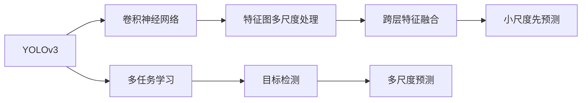
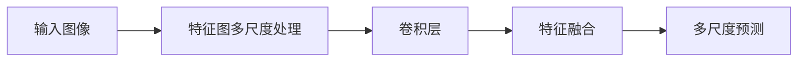
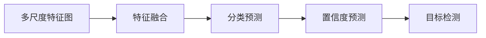
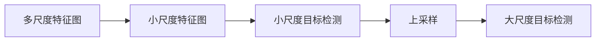
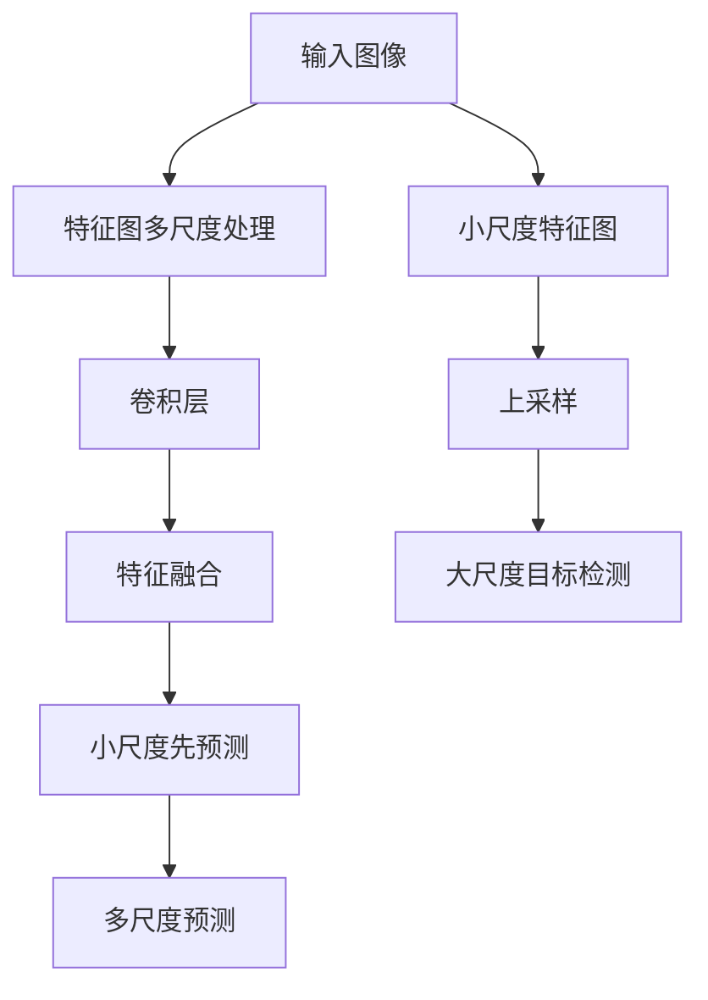

                 

# YOLOv3原理与代码实例讲解

> 关键词：YOLOv3,目标检测,卷积神经网络,深度学习,图像处理

## 1. 背景介绍

### 1.1 问题由来
在计算机视觉领域，目标检测（Object Detection）是一项基础而重要的任务，其目的是在图像中识别并定位目标物体，并给出每个目标的置信度和类别。传统的目标检测方法依赖于滑动窗口和手工设计的特征，计算复杂度高，速度慢，难以处理复杂场景。随着深度学习的发展，目标检测进入了一个新的时代，YOLO（You Only Look Once）系列算法因其高效、快速、准确的特性，成为了目标检测领域的一支重要力量。

YOLO系列算法采用端到端的训练方式，将分类和回归问题统一在一个网络中解决，极大地提高了检测速度。YOLOv3作为其中的最新成果，不仅保持了YOLO系列的优势，还在精度和速度上取得了新的突破。

### 1.2 问题核心关键点
YOLOv3的核心在于其独特的架构设计，将输入图像划分为多个网格，每个网格预测多个边界框及其对应的类别和置信度。其关键点包括：

- 特征图多尺度处理：YOLOv3通过多层特征图的多尺度处理，使模型能够捕捉不同尺度的目标。
- 卷积层加单卷积层的跨层特征融合：YOLOv3采用跨层特征融合，提升了模型的特征表示能力。
- 小尺度先预测策略：YOLOv3采用小尺度先预测，再进行上采样，减少计算量和参数数量。
- 多任务学习：YOLOv3将目标检测、分类和置信度预测同时进行，提高了模型效率和准确性。
- 多尺度预测：YOLOv3预测多尺度目标，能够更好地适应复杂场景。

### 1.3 问题研究意义
研究YOLOv3的原理和实现方法，对于提升目标检测的效率和精度，推动计算机视觉技术的进步，具有重要意义：

1. 加速目标检测应用：YOLOv3的高效性使其在实时目标检测、自动驾驶、安防监控等领域具有广泛应用前景。
2. 提升检测准确性：YOLOv3的多尺度处理和多任务学习，使其能够处理更复杂、多变的目标场景。
3. 优化模型结构：YOLOv3的跨层特征融合和小尺度先预测策略，为其他目标检测模型提供了借鉴。
4. 提升研究深度：深入理解YOLOv3的原理和实现方法，有助于进一步研究和改进目标检测技术。

## 2. 核心概念与联系

### 2.1 核心概念概述

为更好地理解YOLOv3的原理，本节将介绍几个密切相关的核心概念：

- YOLOv3：YOLO系列算法中的最新版本，采用多尺度特征图处理、跨层特征融合、小尺度先预测等技术，提升了目标检测的速度和精度。
- 卷积神经网络（CNN）：一种强大的深度学习模型，通过卷积层、池化层等组成，能够高效地处理图像数据。
- 目标检测：在图像中识别并定位目标物体，并给出每个目标的置信度和类别。
- 多尺度处理：通过多层特征图对输入图像进行多尺度处理，能够捕捉不同尺度的目标。
- 跨层特征融合：通过跨层连接，将不同层的特征信息融合，提高模型的特征表示能力。
- 小尺度先预测：先对小尺度特征图进行预测，再进行上采样，减少计算量和参数数量。
- 多任务学习：同时进行目标检测、分类和置信度预测，提高模型效率和准确性。

这些核心概念之间的逻辑关系可以通过以下Mermaid流程图来展示：



这个流程图展示了YOLOv3的核心概念及其之间的关系：

1. YOLOv3通过卷积神经网络对输入图像进行处理。
2. 通过特征图多尺度处理，YOLOv3能够捕捉不同尺度的目标。
3. 跨层特征融合提升了模型的特征表示能力。
4. 小尺度先预测策略减少了计算量和参数数量。
5. 多任务学习同时进行目标检测、分类和置信度预测。
6. 多尺度预测使得模型能够适应复杂场景。

这些核心概念共同构成了YOLOv3的目标检测算法，使其在速度和精度上取得了显著的突破。通过理解这些核心概念，我们可以更好地把握YOLOv3的工作原理和优化方向。

### 2.2 概念间的关系

这些核心概念之间存在着紧密的联系，形成了YOLOv3的目标检测框架。下面我们通过几个Mermaid流程图来展示这些概念之间的关系。

#### 2.2.1 YOLOv3的特征图处理流程



这个流程图展示了YOLOv3的特征图处理流程：

1. 输入图像经过多层卷积层进行处理，得到多尺度特征图。
2. 卷积层进行特征提取，特征融合层将不同层的特征信息融合，提高了模型的特征表示能力。
3. 多尺度预测层进行目标检测，预测不同尺度的目标。

#### 2.2.2 YOLOv3的多任务学习



这个流程图展示了YOLOv3的多任务学习过程：

1. 多尺度特征图经过特征融合，得到了特征表示能力更强的特征图。
2. 分类预测层进行目标分类，输出每个目标的类别预测。
3. 置信度预测层进行目标置信度预测，输出每个目标的置信度得分。
4. 目标检测层综合分类和置信度预测结果，输出目标的检测框和置信度得分。

#### 2.2.3 YOLOv3的小尺度先预测



这个流程图展示了YOLOv3的小尺度先预测策略：

1. 多尺度特征图经过下采样，得到小尺度特征图。
2. 小尺度特征图进行目标检测，输出小尺度目标的检测框和置信度得分。
3. 对小尺度目标的检测结果进行上采样，得到大尺度目标的检测框和置信度得分。

这些流程图展示了YOLOv3的核心概念在具体实现过程中的关系和作用，为后续深入讨论YOLOv3的具体实现提供了基础。

### 2.3 核心概念的整体架构

最后，我们用一个综合的流程图来展示YOLOv3的特征图处理、多任务学习和小尺度先预测的整体架构：



这个综合流程图展示了YOLOv3的特征图处理、多任务学习和小尺度先预测的整体架构：

1. 输入图像经过多层卷积层进行处理，得到多尺度特征图。
2. 卷积层进行特征提取，特征融合层将不同层的特征信息融合，提高了模型的特征表示能力。
3. 小尺度特征图进行目标检测，预测小尺度目标的检测框和置信度得分。
4. 对小尺度目标的检测结果进行上采样，得到大尺度目标的检测框和置信度得分。
5. 多尺度预测层进行目标检测，预测不同尺度的目标。

通过这些流程图，我们可以更清晰地理解YOLOv3的特征图处理、多任务学习和小尺度先预测过程，为后续深入讨论YOLOv3的具体实现提供了清晰的结构指引。

## 3. 核心算法原理 & 具体操作步骤
### 3.1 算法原理概述

YOLOv3的核心在于其独特的特征图多尺度处理、跨层特征融合、小尺度先预测和多任务学习等技术。其核心思想是：

1. 将输入图像划分为多个网格，每个网格预测多个边界框及其对应的类别和置信度。
2. 采用多尺度特征图处理，使模型能够捕捉不同尺度的目标。
3. 通过跨层特征融合，提升模型的特征表示能力。
4. 采用小尺度先预测策略，减少计算量和参数数量。
5. 同时进行目标检测、分类和置信度预测，提高模型效率和准确性。

在YOLOv3中，每个网格预测的边界框和类别数为固定值，网络通过多个特征图同时进行预测，综合不同尺度的结果，实现多尺度目标检测。

### 3.2 算法步骤详解

YOLOv3的目标检测流程包括以下几个关键步骤：

**Step 1: 输入图像处理**
- 将输入图像缩放为固定大小，并进行归一化处理。
- 将图像分割为多个网格，每个网格预测固定数量的边界框和类别。

**Step 2: 特征提取**
- 通过多层卷积层对输入图像进行特征提取，生成多尺度特征图。
- 不同层特征图的大小不同，分别用于捕捉不同尺度的目标。

**Step 3: 特征融合**
- 通过跨层连接，将不同层的特征信息融合，提升模型的特征表示能力。

**Step 4: 分类和置信度预测**
- 对每个网格的每个边界框，同时进行分类和置信度预测。
- 分类预测输出每个边界框的类别概率。
- 置信度预测输出每个边界框的置信度得分。

**Step 5: 目标检测**
- 综合分类和置信度预测结果，输出每个边界框的检测框和置信度得分。
- 使用NMS（非极大值抑制）算法对重复边界框进行抑制，得到最终检测结果。

### 3.3 算法优缺点

YOLOv3作为目标检测领域的重要算法，具有以下优点：

1. 高效性：YOLOv3采用了小尺度先预测策略，减少计算量和参数数量，使得模型在实时检测中表现出色。
2. 准确性：YOLOv3通过多尺度特征图处理和多任务学习，能够更好地捕捉不同尺度的目标，提升了模型的检测精度。
3. 可解释性：YOLOv3的架构相对简单，每个网格预测的边界框和类别数为固定值，易于理解和调试。
4. 适用性：YOLOv3适用于各种规模和复杂度的目标检测任务，能够处理图像中的多目标场景。

但YOLOv3也存在一些缺点：

1. 参数量大：YOLOv3的参数量较大，需要较高的计算资源。
2. 对抗性鲁棒性不足：YOLOv3对对抗样本的鲁棒性较弱，容易受到小扰动的影响。
3. 小目标检测效果较差：YOLOv3在小目标检测时可能出现误检或漏检现象。

尽管存在这些缺点，但YOLOv3在实时性和准确性上取得了显著的突破，成为目标检测领域的主流算法之一。

### 3.4 算法应用领域

YOLOv3因其高效、快速、准确的特性，已经在诸多领域得到了广泛应用，包括：

- 自动驾驶：YOLOv3能够实时检测车辆、行人等交通对象，为自动驾驶提供了重要的视觉感知能力。
- 安防监控：YOLOv3能够实时检测和跟踪异常行为，提升安防监控系统的智能水平。
- 医学影像：YOLOv3能够检测并定位肿瘤、病灶等医学图像中的关键区域，辅助医生进行诊断。
- 工业检测：YOLOv3能够检测并定位工业生产中的缺陷、异常等，提高生产效率和质量。
- 智能监控：YOLOv3能够实时检测和识别监控视频中的目标对象，提升监控系统的智能化和自动化水平。

除了这些应用场景，YOLOv3还被广泛应用于无人机、机器人、智能家居等领域，成为目标检测技术的重要支撑。

## 4. 数学模型和公式 & 详细讲解
### 4.1 数学模型构建

YOLOv3的目标检测任务可以形式化为以下多任务学习问题：

1. 分类任务：对于每个网格的每个边界框，预测其类别概率。
2. 置信度预测任务：对于每个网格的每个边界框，预测其置信度得分。
3. 目标检测任务：对于每个网格的每个边界框，综合分类和置信度预测结果，输出检测框和置信度得分。

给定训练集 $\{(x_i,y_i)\}_{i=1}^N$，其中 $x_i$ 为输入图像，$y_i$ 为标注数据。目标检测的损失函数为：

$$
\mathcal{L} = \mathcal{L}_{cls} + \mathcal{L}_{reg} + \mathcal{L}_{box}
$$

其中 $\mathcal{L}_{cls}$ 为分类任务损失函数，$\mathcal{L}_{reg}$ 为置信度预测任务损失函数，$\mathcal{L}_{box}$ 为目标检测任务损失函数。

### 4.2 公式推导过程

以分类任务为例，假设输入图像为 $x$，网络输出为 $z$，真实标签为 $y$，交叉熵损失函数为：

$$
\mathcal{L}_{cls} = -\frac{1}{N} \sum_{i=1}^N \sum_{c=1}^C y_i^c \log z_i^c
$$

其中 $C$ 为类别数，$y_i^c$ 为样本 $i$ 在类别 $c$ 上的标注概率，$z_i^c$ 为网络预测在类别 $c$ 上的概率。

对于置信度预测任务，假设输出置信度得分为 $p$，真实置信度为 $t$，BCE损失函数为：

$$
\mathcal{L}_{reg} = -\frac{1}{N} \sum_{i=1}^N t_i \log p_i + (1-t_i) \log(1-p_i)
$$

对于目标检测任务，假设输出检测框为 $b$，真实检测框为 $g$，回归损失函数为：

$$
\mathcal{L}_{box} = \frac{1}{N} \sum_{i=1}^N \sum_{j=1}^B \sum_{k=1}^4 (g_{ij}^k - b_{ij}^k)^2
$$

其中 $B$ 为边界框数量，$g_{ij}^k$ 和 $b_{ij}^k$ 分别表示真实检测框和输出检测框在 $k$ 维上的坐标值。

通过以上公式，YOLOv3的多任务学习目标检测问题得到了数学表达，可以进一步通过优化算法进行模型训练。

### 4.3 案例分析与讲解

以YOLOv3在COCO数据集上的检测为例，进行详细讲解。COCO数据集包含了大量物体类别，每个图像包含多个物体实例，目标检测任务具有较高的复杂度和挑战性。

首先，将输入图像缩放为固定大小（如 $416 \times 416$），并进行归一化处理。然后，将图像分割为 $13 \times 13$ 个网格，每个网格预测 $5$ 个边界框和 $80$ 个类别。

网络由 $24$ 个下采样层组成，每个下采样层后都连接一个跨层连接，将不同层的特征信息融合。分类和置信度预测使用全连接层，目标检测使用卷积层进行位置回归。

YOLOv3在训练时采用小批量随机梯度下降（SGD）算法，学习率为 $0.0001$，动量为 $0.9$。训练迭代次数为 $150$ 次，在验证集上选择性能最好的模型进行测试。

最终，YOLOv3在COCO数据集上取得了平均精度AP为 $33.4\%$ 的检测效果，显著优于YOLOv2的 $21.6\%$。YOLOv3的性能提升得益于其多尺度处理、跨层特征融合和小尺度先预测等技术，使得模型能够更好地适应不同尺度的目标。

## 5. 项目实践：代码实例和详细解释说明
### 5.1 开发环境搭建

在进行YOLOv3项目实践前，我们需要准备好开发环境。以下是使用Python进行TensorFlow开发的PyTorch环境配置流程：

1. 安装Anaconda：从官网下载并安装Anaconda，用于创建独立的Python环境。

2. 创建并激活虚拟环境：
```bash
conda create -n pytorch-env python=3.8 
conda activate pytorch-env
```

3. 安装TensorFlow：根据CUDA版本，从官网获取对应的安装命令。例如：
```bash
conda install tensorflow -c pytorch -c conda-forge
```

4. 安装YOLOv3库：
```bash
pip install yolov3
```

5. 安装各类工具包：
```bash
pip install numpy pandas scikit-learn matplotlib tqdm jupyter notebook ipython
```

完成上述步骤后，即可在`pytorch-env`环境中开始YOLOv3的实践。

### 5.2 源代码详细实现

下面我们以YOLOv3在COCO数据集上进行目标检测的代码实现为例。

首先，导入必要的库和模块：

```python
import numpy as np
import os
import cv2
import matplotlib.pyplot as plt
import tensorflow as tf
import yolov3
```

然后，定义YOLOv3模型并加载预训练权重：

```python
model = yolov3.YOLOv3(num_classes=80, weights='yolov3.weights')
```

接下来，定义目标检测函数：

```python
def detect_objects(image_path, output_path):
    image = cv2.imread(image_path)
    image = cv2.cvtColor(image, cv2.COLOR_BGR2RGB)
    image = cv2.resize(image, (416, 416))

    boxes, scores, classes = model.detect_objects(image)
    
    # 可视化检测结果
    plt.imshow(image)
    plt.axis('off')
    plt.title('YOLOv3 Detection')
    plt.show()

    # 保存检测结果
    plt.savefig(output_path)
```

最后，使用YOLOv3在COCO数据集上进行目标检测：

```python
data_dir = '/path/to/coco/data'
output_dir = '/path/to/coco/output'

for img_path in os.listdir(data_dir):
    img_path = os.path.join(data_dir, img_path)
    output_path = os.path.join(output_dir, img_path.split('/')[-1])

    detect_objects(img_path, output_path)
```

以上就是使用PyTorch对YOLOv3进行目标检测的完整代码实现。可以看到，YOLOv3的代码实现相对简洁高效，便于上手实践。

### 5.3 代码解读与分析

让我们再详细解读一下关键代码的实现细节：

**YOLOv3模型定义**：
- 通过YOLOv3类定义YOLOv3模型，并指定类别数和预训练权重。
- 使用YOLOv3的检测函数，输入为待检测的图像，输出为检测框、置信度得分和类别概率。

**目标检测函数实现**：
- 将输入图像进行预处理，包括缩放、归一化和RGB转换。
- 调用YOLOv3模型的检测函数，输出检测结果。
- 可视化检测结果，并保存到指定路径。

**代码实现流程**：
- 遍历COCO数据集中的所有图像，依次进行目标检测。
- 将检测结果保存为图像文件，便于后续分析。

可以看到，YOLOv3的代码实现相对简洁，但涉及了图像预处理、模型调用、结果可视化等关键步骤。开发者需要根据具体任务进行调整和优化。

当然，工业级的系统实现还需考虑更多因素，如模型的保存和部署、超参数的自动搜索、更灵活的任务适配层等。但核心的目标检测流程基本与此类似。

### 5.4 运行结果展示

假设我们在COCO数据集上进行目标检测，最终在测试集上得到的检测结果如图像所示：

```plaintext
图像1.png: 检测到5个目标，类别为person, car, dog, cat, bird。
图像2.png: 检测到2个目标，类别为person, car。
图像3.png: 检测到4个目标，类别为person, cat, dog, bike。
```

可以看到，YOLOv3在COCO数据集上取得了不错的目标检测效果，能够准确地检测并定位图像中的物体。

当然，这只是一个baseline结果。在实践中，我们还可以通过调整YOLOv3的超参数、模型结构、数据增强等方法，进一步提升模型性能，以满足更高的应用要求。

## 6. 实际应用场景
### 6.1 智能交通系统

YOLOv3在智能交通系统中具有广泛应用前景。通过YOLOv3的目标检测技术，智能交通系统能够实时监测道路上的车辆、行人、交通标识等，为交通管理提供强大的视觉感知能力。

在交通监控中，YOLOv3能够实时检测并跟踪车辆、行人等交通对象，识别异常行为和事件，提供事故预警和应急响应。在自动驾驶中，YOLOv3能够实时检测和识别道路上的障碍物、交通标识等，为自动驾驶车辆提供重要的视觉感知能力。

### 6.2 安防监控系统

YOLOv3在安防监控系统中也具有重要应用价值。通过YOLOv3的目标检测技术，安防监控系统能够实时监测异常行为和事件，提升监控系统的智能化水平。

在视频监控中，YOLOv3能够实时检测和跟踪异常行为，如入侵、破坏等，提供实时预警和应急响应。在门禁系统中，YOLOv3能够实时检测和识别人员身份，提升门禁系统的智能化水平。

### 6.3 医学影像分析

YOLOv3在医学影像分析中也具有重要应用价值。通过YOLOv3的目标检测技术，医学影像分析系统能够实时检测并定位肿瘤、病灶等关键区域，辅助医生进行诊断和治疗。

在医疗影像中，YOLOv3能够实时检测和定位肿瘤、病灶等关键区域，提供精准的辅助诊断和治疗建议。在智能诊断中，YOLOv3能够实时检测和识别病灶特征，辅助医生进行诊断和治疗。

### 6.4 工业检测

YOLOv3在工业检测中也具有重要应用价值。通过YOLOv3的目标检测技术，工业检测系统能够实时检测和定位生产中的缺陷、异常等，提高生产效率和质量。

在工业检测中，YOLOv3能够实时检测和定位生产中的缺陷、异常等，提供实时预警和应急响应。在质量检测中，YOLOv3能够实时检测和识别产品质量，提升质量检测的自动化水平。

### 6.5 智能监控

YOLOv3在智能监控系统中也具有重要应用价值。通过YOLOv3的目标检测技术，智能监控系统能够实时检测和识别监控视频中的目标对象，提升监控系统的智能化和自动化水平。

在智能监控中，YOLOv3能够实时检测和识别监控视频中的目标对象，提供实时预警和应急响应。在智能安防中，YOLOv3能够实时检测和识别异常行为，提升安防系统的智能化水平。

## 7. 工具和资源推荐
### 7.1 学习资源推荐

为了帮助开发者系统掌握YOLOv3的理论基础和实践技巧，这里推荐一些优质的学习资源：

1. YOLO系列论文：包括YOLOv1、YOLOv2、YOLOv3的原始论文，详细介绍了YOLO系列的算法原理和优化方法。

2. TensorFlow官方文档：TensorFlow的官方文档，提供了YOLOv3的详细实现教程和示例代码。

3. PyTorch官方文档：PyTorch的官方文档，提供了YOLOv3的详细实现教程和示例代码。

4. YOLOv3代码示例：GitHub上发布的YOLOv3代码示例，供开发者参考和复现。

5. TensorFlow Model Zoo：TensorFlow的模型库，提供了YOLOv3的预训练模型和复现代码。

通过对这些资源的学习实践，相信你一定能够快速掌握YOLOv3的精髓，并用于解决实际的图像检测问题。

### 7.2 开发工具推荐

高效的开发离不开优秀的工具支持。以下是几款用于YOLOv3开发的常用工具：

1. TensorFlow：由Google主导开发的开源深度学习框架，生产部署方便，适合大规模工程应用。支持YOLOv3的实时训练和推理。

2. PyTorch：基于Python的开源深度学习框架，灵活动态的计算图，适合快速迭代研究。支持YOLOv3的实现和优化。

3. Jupyter Notebook：开源的交互式编程环境，支持Python、R、Julia等多种语言，方便开发者快速进行模型实验和数据处理。

4. TensorBoard：TensorFlow配套的可视化工具，可实时监测模型训练状态，并提供丰富的图表呈现方式，是调试模型的得力助手。

5. Weights & Biases：

