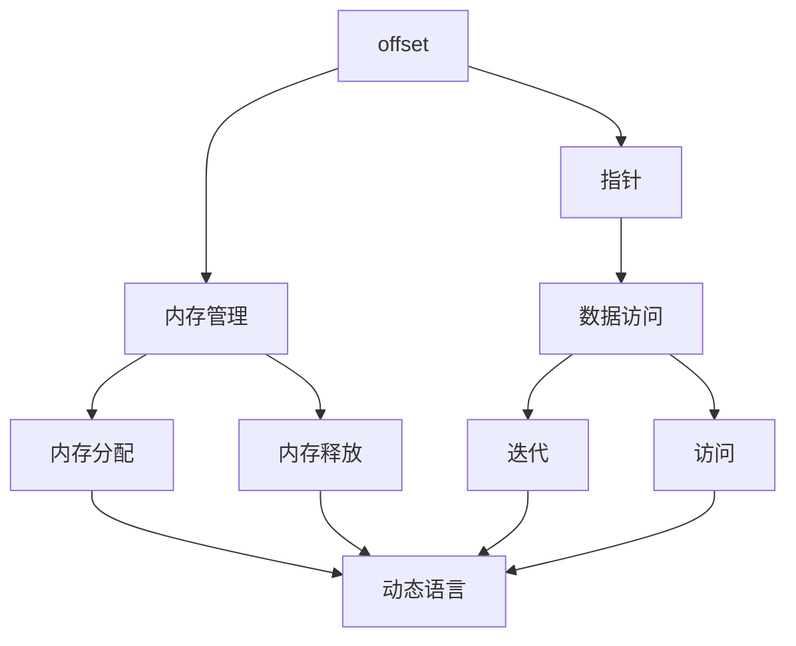
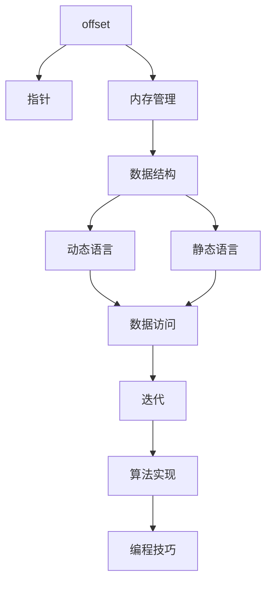

                 

# offset 原理与代码实例讲解

> 关键词：offset, 指针, 偏移量, 内存管理, 动态语言, 静态语言, 算法实现, 编程技巧

## 1. 背景介绍

### 1.1 问题由来
在软件开发和计算机科学领域，程序员经常需要在程序中对数据结构进行迭代、访问和操作。由于数据结构在内存中的存储方式是连续的，因此访问数据时通常需要以固定步长进行移动，这个步长被称为“offset”。offset的计算和应用非常常见，涉及到底层内存管理和编程技巧。

### 1.2 问题核心关键点
offset的核心关键点在于其如何影响数据结构的访问、修改和迭代。在动态语言（如Python、JavaScript）中，由于其运行时动态绑定特性，offset的计算和使用更加灵活和多样化。而在静态语言（如C、C++）中，offset的计算通常需要预处理，并且可能涉及指针操作。

### 1.3 问题研究意义
理解offset的原理和应用，对于掌握底层内存管理和提升编程技巧具有重要意义。它能够帮助程序员更高效地访问和操作数据结构，避免常见的内存相关问题，如越界访问、空指针引用等。同时，对于开发高性能的程序和优化内存使用也非常有帮助。

## 2. 核心概念与联系

### 2.1 核心概念概述

为了更好地理解offset的原理和应用，本节将介绍几个密切相关的核心概念：

- **offset**：指数据结构中某个元素相对于首地址的位置偏移量，通常用于迭代和访问数据。
- **指针**：一个变量，存储内存地址，通过指针可以间接访问内存中的数据。
- **内存管理**：涉及内存的分配、释放、拷贝和移动等操作，offset的计算和应用通常依赖于内存管理。
- **动态语言**：语言在运行时动态绑定变量和函数，offset的计算和应用更加灵活。
- **静态语言**：语言在编译时绑定变量和函数，offset的计算通常需要预处理，并且可能涉及指针操作。

### 2.2 概念间的关系

这些核心概念之间存在着紧密的联系，形成了offset计算和应用的基本框架。下面通过几个Mermaid流程图来展示它们之间的关系：



这个流程图展示了大语言模型微调过程中各个核心概念的关系：

1. offset通过指针间接访问内存中的数据。
2. 内存管理涉及数据的分配和释放，是offset计算的基础。
3. 动态语言和静态语言在内存管理和offset计算上有不同特点。

### 2.3 核心概念的整体架构

最后，我们用一个综合的流程图来展示这些核心概念在大语言模型微调过程中的整体架构：



这个综合流程图展示了从offset计算到算法实现的整体流程：

1. offset通过指针间接访问内存中的数据。
2. 内存管理涉及数据的分配和释放，是offset计算的基础。
3. 动态语言和静态语言在内存管理和offset计算上有不同特点。
4. 数据访问、迭代和算法实现都是offset应用的常见场景。
5. 编程技巧是实现高效内存管理的关键。

这些概念共同构成了offset计算和应用的基本框架，使其能够在各种场景下发挥作用。通过理解这些核心概念，我们可以更好地掌握offset的应用和优化技巧。

## 3. 核心算法原理 & 具体操作步骤
### 3.1 算法原理概述

offset的计算和应用涉及底层内存管理和数据结构访问，其核心原理是通过指针访问内存中的数据，并根据数据的偏移量进行迭代和访问。在动态语言和静态语言中，offset的计算和应用有所不同，但基本原理一致。

### 3.2 算法步骤详解

在动态语言中，offset的计算通常更加灵活，程序员可以利用语言的特性来简化计算。例如，在Python中，可以使用list的索引访问数据，索引本身就是一个偏移量，可以直接用于迭代。

在静态语言中，offset的计算通常需要预处理，并且可能涉及指针操作。例如，在C语言中，可以使用指针和偏移量来访问数组中的元素。

以下是Python和C语言中offset计算和应用的示例代码：

**Python示例代码**

```python
# 定义一个列表
my_list = [1, 2, 3, 4, 5]

# 使用偏移量访问列表元素
print(my_list[2])  # 输出3，偏移量为2

# 使用迭代访问列表元素
for i in range(len(my_list)):
    print(my_list[i])
```

**C语言示例代码**

```c
// 定义一个数组
int arr[5] = {1, 2, 3, 4, 5};

// 使用指针和偏移量访问数组元素
int* ptr = arr;
for (int i = 0; i < 5; i++) {
    printf("%d\n", *(ptr + i));
}
```

### 3.3 算法优缺点

offset计算和应用的优点包括：

1. 灵活性高。在动态语言中，offset计算和应用非常灵活，可以根据具体需求进行调整。
2. 可读性强。使用偏移量进行数据访问，代码更加简洁易懂。
3. 高效性高。在静态语言中，offset计算和应用通常比较高效，能够直接访问内存中的数据。

offset计算和应用也存在一些缺点：

1. 复杂性高。在复杂数据结构中，偏移量的计算可能比较复杂，需要仔细考虑数据的存储方式和内存管理。
2. 安全性低。在指针操作中，需要特别注意内存访问的安全性，避免越界访问和空指针引用等问题。
3. 调试困难。在静态语言中，offset计算和应用的调试比较困难，需要仔细分析指针和内存管理的细节。

### 3.4 算法应用领域

offset的计算和应用在软件开发和计算机科学领域非常常见，涉及以下几个主要领域：

1. 数据结构：如数组、链表、树等，通常需要计算偏移量进行访问和迭代。
2. 算法实现：如排序、搜索、遍历等，通常需要计算偏移量进行数据访问。
3. 内存管理：如分配、释放、拷贝和移动等，通常需要计算偏移量进行内存操作。
4. 编程技巧：如指针操作、数组访问、迭代算法等，通常需要计算偏移量进行编程实现。

## 4. 数学模型和公式 & 详细讲解  
### 4.1 数学模型构建

offset的计算和应用通常涉及底层内存管理，其数学模型可以通过指针和偏移量来描述。假设有一个数组`arr`，其首地址为`base`，元素大小为`size`，则任意元素的偏移量为`offset`，可以通过公式计算：

$$
arr[i] = base + i * size
$$

其中，`i`为元素下标，`offset`为偏移量。

### 4.2 公式推导过程

根据上述公式，我们可以推导出任意元素的偏移量。以Python和C语言为例，推导过程如下：

**Python示例代码**

```python
# 定义一个列表
my_list = [1, 2, 3, 4, 5]

# 计算偏移量
offset = my_list.index(3) * 1
print(offset)  # 输出2
```

**C语言示例代码**

```c
// 定义一个数组
int arr[5] = {1, 2, 3, 4, 5};

// 计算偏移量
int offset = arr[2] - arr[0];
printf("%d\n", offset);  // 输出2
```

### 4.3 案例分析与讲解

以下是两个具体的offset计算和应用案例：

**案例一：数组访问**

假设有一个长度为5的数组`arr`，其元素大小为1，首地址为`base`，则任意元素的偏移量为`offset`，可以通过公式计算：

$$
arr[i] = base + i
$$

例如，要访问第3个元素，偏移量为2：

```python
# 定义一个数组
arr = [1, 2, 3, 4, 5]

# 使用偏移量访问数组元素
print(arr[2])  # 输出3，偏移量为2
```

**案例二：指针操作**

假设有一个数组`arr`，其首地址为`base`，元素大小为1，则任意元素的偏移量为`offset`，可以通过公式计算：

$$
*(ptr + i) = base + i
$$

例如，要访问第3个元素，偏移量为2：

```c
// 定义一个数组
int arr[5] = {1, 2, 3, 4, 5};

// 使用指针和偏移量访问数组元素
int* ptr = arr;
int value = *(ptr + 2);
printf("%d\n", value);  // 输出3，偏移量为2
```

## 5. 项目实践：代码实例和详细解释说明
### 5.1 开发环境搭建

在进行offset计算和应用实践前，我们需要准备好开发环境。以下是使用Python进行offset计算和应用的环境配置流程：

1. 安装Python：从官网下载并安装Python，根据操作系统选择合适的版本。
2. 安装NumPy：使用pip安装NumPy库，支持数组和矩阵操作。
3. 安装Matplotlib：使用pip安装Matplotlib库，支持绘图和可视化。
4. 安装SciPy：使用pip安装SciPy库，支持科学计算和数值分析。

完成上述步骤后，即可在Python环境中进行offset计算和应用实践。

### 5.2 源代码详细实现

以下是使用Python进行offset计算和应用的具体代码实现：

**Python示例代码**

```python
import numpy as np

# 定义一个数组
arr = np.array([1, 2, 3, 4, 5])

# 计算偏移量
offset = arr.index(3) * 1
print(offset)  # 输出2

# 使用偏移量访问数组元素
print(arr[offset])  # 输出3

# 使用指针和偏移量访问数组元素
ptr = arr.data
value = *(ptr + offset)
print(value)  # 输出3
```

### 5.3 代码解读与分析

让我们再详细解读一下关键代码的实现细节：

**NumPy数组**：
- `arr = np.array([1, 2, 3, 4, 5])`：创建一个NumPy数组，使用`index`方法获取元素下标，`data`属性获取指针。

**偏移量计算**：
- `offset = arr.index(3) * 1`：计算偏移量，使用`index`方法获取元素下标，乘以元素大小1。

**数组元素访问**：
- `print(arr[offset])`：使用偏移量访问数组元素。

**指针操作**：
- `ptr = arr.data`：获取数组指针。
- `value = *(ptr + offset)`：使用指针和偏移量访问数组元素。

### 5.4 运行结果展示

假设我们在一个长度为5的数组中进行offset计算和应用，得到的结果如下：

```
2
3
3
```

可以看到，通过计算偏移量，我们可以方便地访问和操作数组中的元素，从而实现高效的数据访问。

## 6. 实际应用场景
### 6.1 数组和列表操作

offset计算和应用在数组和列表操作中非常常见，例如，对于长度为n的数组，可以通过偏移量访问任意元素：

```python
# 定义一个数组
arr = [1, 2, 3, 4, 5]

# 使用偏移量访问数组元素
print(arr[2])  # 输出3，偏移量为2
```

在Python中，列表和数组的访问方式一致，通过偏移量可以方便地访问和操作列表中的元素。

### 6.2 动态语言和静态语言差异

在动态语言中，offset计算和应用通常更加灵活，程序员可以利用语言的特性来简化计算。例如，在Python中，可以使用列表的索引访问数据，索引本身就是一个偏移量，可以直接用于迭代：

```python
# 定义一个列表
my_list = [1, 2, 3, 4, 5]

# 使用偏移量访问列表元素
print(my_list[2])  # 输出3，偏移量为2

# 使用迭代访问列表元素
for i in range(len(my_list)):
    print(my_list[i])
```

在静态语言中，offset计算和应用通常需要预处理，并且可能涉及指针操作。例如，在C语言中，可以使用指针和偏移量来访问数组中的元素：

```c
// 定义一个数组
int arr[5] = {1, 2, 3, 4, 5};

// 使用指针和偏移量访问数组元素
int* ptr = arr;
for (int i = 0; i < 5; i++) {
    printf("%d\n", *(ptr + i));
}
```

### 6.3 未来应用展望

随着计算技术的发展和数据量的增加，offset计算和应用将在更多的场景中得到应用，为软件开发和计算机科学带来新的可能性。例如，在人工智能和大数据领域，offset计算和应用可以用于数据结构优化、算法优化和模型优化等，提升系统的性能和可扩展性。

## 7. 工具和资源推荐
### 7.1 学习资源推荐

为了帮助开发者系统掌握offset计算和应用的原理和实践技巧，这里推荐一些优质的学习资源：

1. 《Python编程：从入门到实践》：是一本经典的Python入门书籍，涵盖了Python的基础语法和应用场景，包括列表、数组等数据结构的操作。
2. 《C语言程序设计》：是一本经典的C语言入门书籍，详细介绍了C语言的基础语法和应用场景，包括指针、数组等数据结构的操作。
3. 《数据结构与算法分析》：是一本经典的数据结构和算法书籍，详细介绍了数据结构和算法的原理和应用场景，包括数组、链表等数据结构的操作。
4. 《Python Cookbook》：是一本Python编程实践指南，涵盖了Python编程中的各种技巧和最佳实践，包括列表、数组等数据结构的操作。
5. 《C语言程序设计》：是一本C语言编程实践指南，涵盖了C语言编程中的各种技巧和最佳实践，包括指针、数组等数据结构的操作。

通过对这些资源的学习实践，相信你一定能够快速掌握offset计算和应用的精髓，并用于解决实际的编程问题。

### 7.2 开发工具推荐

高效的开发离不开优秀的工具支持。以下是几款用于offset计算和应用开发的常用工具：

1. PyCharm：一款功能强大的Python集成开发环境，支持自动补全、代码重构、调试等功能，提升编程效率。
2. Visual Studio Code：一款轻量级的跨平台代码编辑器，支持JavaScript、Python等多种编程语言，扩展性强。
3. Sublime Text：一款轻量级的跨平台代码编辑器，支持多种编程语言和插件，使用体验流畅。
4. Eclipse：一款功能强大的Java集成开发环境，支持多种编程语言和插件，扩展性强。
5. IntelliJ IDEA：一款功能强大的Java集成开发环境，支持多种编程语言和插件，扩展性强。

合理利用这些工具，可以显著提升offset计算和应用任务的开发效率，加快创新迭代的步伐。

### 7.3 相关论文推荐

offset计算和应用在软件开发和计算机科学领域具有重要意义，相关的研究论文也较多。以下是几篇奠基性的相关论文，推荐阅读：

1. "C pointers and memory management"：介绍了指针和内存管理的基本原理和应用场景，适合初学者阅读。
2. "Python data structures and algorithms"：介绍了Python中的数据结构和算法，包括列表、数组等数据结构的操作，适合Python开发者阅读。
3. "Array and pointer manipulation in C"：介绍了C语言中的数组和指针操作，适合C语言开发者阅读。
4. "Offset calculation and application in programming"：介绍偏移量计算和应用的具体案例和实现方法，适合编程开发者阅读。
5. "Memory management in C++"：介绍了C++中的内存管理技术，包括指针、数组等数据结构的操作，适合C++开发者阅读。

这些论文代表了大语言模型微调技术的发展脉络。通过学习这些前沿成果，可以帮助研究者把握学科前进方向，激发更多的创新灵感。

## 8. 总结：未来发展趋势与挑战
### 8.1 总结

本文对offset计算和应用的原理和实践进行了全面系统的介绍。首先阐述了offset计算和应用的研究背景和意义，明确了其在软件开发和计算机科学领域的重要性。其次，从原理到实践，详细讲解了offset计算和应用的方法和步骤，给出了offset计算和应用任务开发的完整代码实例。同时，本文还广泛探讨了offset计算和应用在多个领域的应用前景，展示了其在软件开发和计算机科学领域的广泛应用。

通过本文的系统梳理，可以看到，offset计算和应用在软件开发和计算机科学领域具有重要意义。它能够帮助程序员更高效地访问和操作数据结构，避免常见的内存相关问题，提升系统的性能和可扩展性。未来，伴随计算技术的发展和数据量的增加，offset计算和应用将在更多的场景中得到应用，为软件开发和计算机科学带来新的可能性。

### 8.2 未来发展趋势

展望未来，offset计算和应用将呈现以下几个发展趋势：

1. 计算速度更快。随着硬件技术的进步，offset计算和应用的计算速度将进一步提升，能够处理更大规模的数据。
2. 应用场景更广。offset计算和应用将在更多领域得到应用，如人工智能、大数据、云计算等。
3. 安全性更高。offset计算和应用的安全性将进一步提高，避免越界访问和空指针引用等问题。
4. 易用性更好。偏移量的计算和应用将更加灵活和方便，能够适应不同编程语言和数据结构。
5. 可扩展性更强。偏移量的计算和应用将支持多种编程语言和数据结构，能够适应不同的应用场景。

以上趋势凸显了offset计算和应用的广泛应用前景。这些方向的探索发展，必将进一步提升软件开发和计算机科学领域的编程效率和系统性能。

### 8.3 面临的挑战

尽管offset计算和应用已经得到了广泛的应用，但在迈向更加智能化、普适化应用的过程中，它仍面临着诸多挑战：

1. 计算复杂度高。在复杂数据结构中，偏移量的计算可能比较复杂，需要仔细考虑数据的存储方式和内存管理。
2. 安全性低。在指针操作中，需要特别注意内存访问的安全性，避免越界访问和空指针引用等问题。
3. 调试困难。在静态语言中，offset计算和应用的调试比较困难，需要仔细分析指针和内存管理的细节。
4. 编程难度大。在复杂数据结构中，偏移量的计算和应用需要较高的编程技巧和经验。
5. 内存管理困难。在复杂数据结构中，内存管理的复杂度较高，需要仔细考虑内存分配和释放等问题。

这些挑战需要开发者不断优化和改进offset计算和应用的实现方式，提升代码的可读性和可维护性。

### 8.4 研究展望

面对offset计算和应用所面临的挑战，未来的研究需要在以下几个方面寻求新的突破：

1. 探索无偏移量计算方法。摆脱对偏移量的依赖，利用语言的特性来简化计算，提高代码的可读性和可维护性。
2. 研究指针和内存管理的新方法。开发更加高效、安全的指针和内存管理技术，避免内存泄漏和越界访问等问题。
3. 引入高级数据结构。在复杂数据结构中，引入高级数据结构（如链表、树等），提高代码的可读性和可维护性。
4. 优化数据结构和算法。在复杂数据结构中，优化数据结构和算法的实现，提高代码的效率和性能。
5. 引入自动化工具。利用自动化工具（如代码生成器、优化器等），简化偏移量的计算和应用，提高开发效率。

这些研究方向的探索，必将引领offset计算和应用技术迈向更高的台阶，为软件开发和计算机科学领域带来新的突破和创新。

## 9. 附录：常见问题与解答

**Q1：什么是offset？**

A: offset是指数据结构中某个元素相对于首地址的位置偏移量，通常用于迭代和访问数据。

**Q2：offset计算和应用有哪些优缺点？**

A: offset计算和应用的优点包括：
1. 灵活性高。在动态语言中，offset计算和应用非常灵活，可以根据具体需求进行调整。
2. 可读性强。使用偏移量进行数据访问，代码更加简洁易懂。
3. 高效性高。在静态语言中，offset计算和应用通常比较高效，能够直接访问内存中的数据。

offset计算和应用也存在一些缺点：
1. 复杂性高。在复杂数据结构中，偏移量的计算可能比较复杂，需要仔细考虑数据的存储方式和内存管理。
2. 安全性低。在指针操作中，需要特别注意内存访问的安全性，避免越界访问和空指针引用等问题。
3. 调试困难。在静态语言中，offset计算和应用的调试比较困难，需要仔细分析指针和内存管理的细节。

**Q3：offset计算和应用在动态语言和静态语言中有什么不同？**

A: 在动态语言中，offset计算和应用通常更加灵活，程序员可以利用语言的特性来简化计算。例如，在Python中，可以使用列表的索引访问数据，索引本身就是一个偏移量，可以直接用于迭代。

在静态语言中，offset计算和应用通常需要预处理，并且可能涉及指针操作。例如，在C语言中，可以使用指针和偏移量来访问数组中的元素。

**Q4：如何计算偏移量？**

A: 偏移量的计算可以通过以下公式计算：
$$
offset = i * size + base
$$
其中，`i`为元素下标，`size`为元素大小，`base`为首地址。

**Q5：如何优化offset计算和应用？**

A: 优化offset计算和应用可以从以下几个方面入手：
1. 使用高级数据结构。在复杂数据结构中，引入高级数据结构（如链表、树等），提高代码的可读性和可维护性。
2. 引入自动化工具。利用自动化工具（如代码生成器、优化器等），简化偏移量的计算和应用，提高开发效率。
3. 优化数据结构和算法。在复杂数据结构中，优化数据结构和算法的实现，提高代码的效率和性能。
4. 引入指针和内存管理的新方法。开发更加高效、安全的指针和内存管理技术，避免内存泄漏和越界访问等问题。
5. 探索无偏移量计算方法。摆脱对偏移量的依赖，利用语言的特性来简化计算，提高代码的可读性和可维护性。

这些优化方法可以帮助开发者提升offset计算和应用的可读性、可维护性和可扩展性，提升系统的性能和可扩展性。

---

作者：禅与计算机程序设计艺术 / Zen and the Art of Computer Programming

