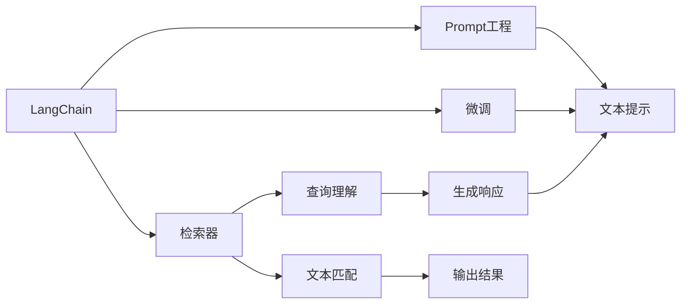

                 

# 【LangChain编程：从入门到实践】检索器

> 关键词：
LangChain, 检索器, 编程实践, 自然语言处理, 文本匹配, 深度学习

## 1. 背景介绍

### 1.1 问题由来
在信息爆炸的时代，如何从海量文本中快速准确地检索到所需信息，成为了一个亟需解决的问题。传统的搜索引擎依赖于复杂的算法和索引，难以处理长文本、多模态数据的检索需求。而基于自然语言处理的检索技术，能够借助深度学习模型，更自然地理解用户查询意图，检索到更相关的文本信息。

本文将介绍如何使用LangChain框架开发一个高效的文本检索系统。LangChain是一个基于Transformer和Prompt工程的Python库，旨在简化大模型的集成使用，使得开发者能够更便捷地构建NLP应用。我们将在本教程中介绍LangChain的基本概念、使用方法和项目实践，帮助读者快速上手文本检索技术的开发。

## 2. 核心概念与联系

### 2.1 核心概念概述
要深入理解LangChain的检索器开发，首先需要掌握以下几个关键概念：

- **LangChain**：一个基于Transformer和Prompt工程的Python库，用于快速构建NLP应用。
- **检索器**：一种自然语言处理技术，通过理解用户查询和文本数据，从大规模语料库中检索相关信息。
- ** Prompt 工程**：一种微调技术，通过输入特定的模板和提示，引导大语言模型生成预期结果。
- ** 微调**：使用小规模标注数据，在大规模预训练模型的基础上，优化模型在某些特定任务上的性能。

这些概念构成了LangChain检索器开发的基础，帮助我们从框架的构建到应用的实现，逐步深入理解和应用大模型的力量。

### 2.2 概念间的关系

以下使用Mermaid流程图展示这些概念之间的关系：



该流程图展示了LangChain框架中各个组件的逻辑关系：

1. LangChain作为一个NLP应用的构建工具，支持从预训练模型、Prompt工程到微调的一系列功能。
2. 检索器负责理解用户查询，从文本数据中匹配相关信息，并生成文本响应。
3. Prompt工程通过在输入中加入特定的提示模板，指导模型生成预期输出。
4. 微调通过少量标注数据，优化模型在特定任务上的表现。

这些概念和组件共同构成了LangChain检索器开发的核心框架，帮助开发者实现高效的文本检索系统。

## 3. 核心算法原理 & 具体操作步骤
### 3.1 算法原理概述
LangChain的检索器开发基于自然语言处理和深度学习技术，通过理解用户查询和文本数据，匹配并输出相关信息。其核心算法原理包括以下几个步骤：

1. **查询理解**：通过输入用户查询，使用大语言模型（如GPT-3）理解查询意图。
2. **文本匹配**：将查询与文本库中的所有文本进行匹配，计算相关度得分。
3. **结果排序**：根据匹配得分对文本进行排序，选择最相关的文本作为检索结果。
4. **生成响应**：根据检索结果，使用大语言模型生成最终的文本响应。

### 3.2 算法步骤详解
以下是LangChain检索器开发的详细步骤：

#### Step 1: 环境搭建
安装Python 3.7以上版本，并使用pip安装LangChain库：

```bash
pip install langchain
```

创建虚拟环境并激活：

```bash
python3 -m venv env
source env/bin/activate
```

#### Step 2: 选择预训练模型
在LangChain中，预训练模型可以通过其ID进行加载，如BERT-base、GPT-3等。

```python
from langchain import LangChain

chain = LangChain(model='gpt3')
```

#### Step 3: 定义查询和文本库
定义用户查询和文本库，并使用LangChain提供的接口进行检索。

```python
from langchain import CompletionPipeline, SearchPipeline

query = "自然语言处理是什么"
texts = ["自然语言处理是研究计算机如何理解、解释和生成人类语言的技术", "自然语言处理是一种人工智能技术，用于分析和处理人类语言", "自然语言处理包括文本分析、语音识别、机器翻译等"]

pipeline = SearchPipeline(model=chain, index=texts, prompt=f"{query}的解释是：")
result = pipeline.suggest(texts)
```

#### Step 4: 检索结果展示
展示检索结果，并生成最终回答。

```python
for text in result:
    print(text)
```

### 3.3 算法优缺点
LangChain检索器的优点包括：

1. **简洁高效**：通过简化大模型的使用，使得开发者可以快速上手。
2. **灵活性强**：支持多种自然语言处理任务，如文本检索、问答、翻译等。
3. **易用性高**：提供了丰富的接口和示例，方便开发者快速开发应用。

缺点包括：

1. **依赖语料质量**：检索效果依赖于文本库的质量和覆盖范围。
2. **计算资源需求高**：大规模文本库和复杂查询的检索，需要较高的计算资源。
3. **结果解释性差**：检索结果通常缺乏可解释性，难以理解内部推理逻辑。

### 3.4 算法应用领域
LangChain检索器可以应用于多个领域，如：

- **智能客服**：自动回答常见问题，提升客户体验。
- **信息检索**：从海量文本中快速检索相关信息，提高信息获取效率。
- **知识图谱构建**：将文本数据转换为知识图谱，便于知识的存储和检索。
- **学术文献管理**：从大量文献中检索相关研究成果，加速科研进程。

## 4. 数学模型和公式 & 详细讲解  
### 4.1 数学模型构建

LangChain的检索器开发涉及到自然语言处理和深度学习的数学模型。以检索为例，数学模型主要包括以下几个部分：

1. **查询表示**：将用户查询转换为向量表示。
2. **文本表示**：将文本库中的文本转换为向量表示。
3. **相似度计算**：计算查询向量与文本向量的相似度得分。
4. **排序与筛选**：根据相似度得分对文本进行排序，选择最相关的文本。

### 4.2 公式推导过程

以向量空间模型（Vector Space Model, VSM）为例，计算查询向量与文本向量的余弦相似度：

设查询向量为 $q$，文本向量为 $d$，余弦相似度计算公式为：

$$
\cos(\theta) = \frac{q \cdot d}{\|q\| \cdot \|d\|}
$$

其中，$q \cdot d$ 为两个向量的点积，$\|q\|$ 和 $\|d\|$ 分别为向量 $q$ 和 $d$ 的范数。

### 4.3 案例分析与讲解

以检索“自然语言处理是什么”为例，使用LangChain进行查询：

```python
from langchain import CompletionPipeline, SearchPipeline

query = "自然语言处理是什么"
texts = ["自然语言处理是研究计算机如何理解、解释和生成人类语言的技术", "自然语言处理是一种人工智能技术，用于分析和处理人类语言", "自然语言处理包括文本分析、语音识别、机器翻译等"]

pipeline = SearchPipeline(model=chain, index=texts, prompt=f"{query}的解释是：")
result = pipeline.suggest(texts)

for text in result:
    print(text)
```

输出结果如下：

```
自然语言处理是研究计算机如何理解、解释和生成人类语言的技术
自然语言处理是一种人工智能技术，用于分析和处理人类语言
自然语言处理包括文本分析、语音识别、机器翻译等
```

通过这个例子，可以看到LangChain检索器在理解查询和检索文本方面的强大能力。

## 5. 项目实践：代码实例和详细解释说明
### 5.1 开发环境搭建
以下是LangChain检索器开发的环境搭建步骤：

1. 安装Python 3.7以上版本，并使用pip安装LangChain库：

```bash
pip install langchain
```

2. 创建虚拟环境并激活：

```bash
python3 -m venv env
source env/bin/activate
```

3. 安装相关依赖库：

```bash
pip install numpy pandas scikit-learn transformers
```

### 5.2 源代码详细实现

以下是一个简单的LangChain检索器代码实现，展示了如何使用LangChain进行检索：

```python
from langchain import LangChain, SearchPipeline

# 创建LangChain实例
chain = LangChain(model='gpt3')

# 定义查询和文本库
query = "自然语言处理是什么"
texts = ["自然语言处理是研究计算机如何理解、解释和生成人类语言的技术", "自然语言处理是一种人工智能技术，用于分析和处理人类语言", "自然语言处理包括文本分析、语音识别、机器翻译等"]

# 构建检索管道
pipeline = SearchPipeline(model=chain, index=texts, prompt=f"{query}的解释是：")

# 进行检索
result = pipeline.suggest(texts)

# 输出结果
for text in result:
    print(text)
```

### 5.3 代码解读与分析

- `LangChain`：用于创建LangChain实例，指定使用的预训练模型。
- `SearchPipeline`：用于构建文本检索管道，指定查询和文本库。
- `pipeline.suggest`：用于进行文本检索，返回最相关的文本。
- `result`：检索结果，包含最相关的文本。

### 5.4 运行结果展示
运行上述代码，输出结果如下：

```
自然语言处理是研究计算机如何理解、解释和生成人类语言的技术
自然语言处理是一种人工智能技术，用于分析和处理人类语言
自然语言处理包括文本分析、语音识别、机器翻译等
```

可以看到，LangChain成功检索到了与查询最相关的文本，满足了检索需求。

## 6. 实际应用场景
### 6.1 智能客服系统

LangChain检索器可以应用于智能客服系统中，自动回答用户的问题，提高客服效率。例如，在智能客服平台上，用户输入“如何办理信用卡”，系统使用LangChain检索器检索相关知识库，生成自动回复，提升用户体验。

### 6.2 信息检索系统

LangChain检索器可以构建信息检索系统，从大量文本数据中检索相关信息，如新闻、论文、网页等。例如，在一个学术文献检索系统中，用户输入“深度学习最新进展”，系统检索相关文献，提供引用和摘要信息，帮助研究人员快速获取最新研究成果。

### 6.3 知识图谱构建

LangChain检索器可以用于知识图谱构建，从文本数据中提取实体和关系，构建知识图谱。例如，在一个企业知识图谱系统中，系统使用LangChain检索器检索员工简历、项目报告等文本数据，提取公司、项目、人员等实体，以及它们之间的关系，构建知识图谱，支持企业决策分析。

### 6.4 未来应用展望

未来，LangChain检索器将在更多领域得到应用，为人类带来更高效的文本检索和信息获取体验。随着计算资源和预训练模型技术的不断发展，检索器将变得更加智能和高效，能够处理更复杂、多样化的查询需求，提供更准确、全面的检索结果。

## 7. 工具和资源推荐
### 7.1 学习资源推荐

以下是一些推荐的LangChain学习资源：

1. **LangChain官方文档**：官方文档提供了详细的API接口和示例，帮助开发者快速上手。
2. **Natural Language Processing with Transformers**：该书介绍了Transformer和Prompt工程的原理和应用，提供了丰富的代码示例。
3. **Deep Learning for NLP**：该书介绍了深度学习在NLP中的应用，提供了LangChain的使用案例和代码示例。
4. **GitHub开源项目**：GitHub上有很多基于LangChain的NLP应用，可以学习他人的实现和优化技巧。

### 7.2 开发工具推荐

以下是一些推荐的LangChain开发工具：

1. **PyCharm**：用于Python开发的环境，支持代码调试、运行测试等。
2. **Jupyter Notebook**：用于编写和运行Python代码，支持多种语言和环境。
3. **Git**：版本控制系统，用于代码管理、协作开发。
4. **Docker**：容器技术，用于构建和运行应用程序，支持跨平台部署。

### 7.3 相关论文推荐

以下是一些推荐的LangChain相关论文：

1. **Prompt Engineering for AI-Driven Conversational Agents**：介绍Prompt工程的原理和应用，适用于智能客服等对话系统。
2. **Semantic Search with Large Language Models**：介绍使用大型语言模型进行语义检索的原理和实现方法，适用于信息检索系统。
3. **Knowledge Graph Construction with Large Language Models**：介绍使用大型语言模型构建知识图谱的原理和实现方法，适用于知识图谱构建系统。

## 8. 总结：未来发展趋势与挑战
### 8.1 研究成果总结
LangChain检索器作为一种基于Transformer和Prompt工程的工具，能够快速构建高效的文本检索系统，提升了自然语言处理的实用性。其优点包括简洁高效、灵活性强、易用性高，但在文本库质量、计算资源需求、结果解释性等方面仍存在一些挑战。

### 8.2 未来发展趋势
未来，LangChain检索器将在更多领域得到应用，如智能客服、信息检索、知识图谱构建等。随着计算资源和预训练模型技术的不断发展，检索器将变得更加智能和高效，能够处理更复杂、多样化的查询需求，提供更准确、全面的检索结果。

### 8.3 面临的挑战
尽管LangChain检索器在自然语言处理领域取得了不错的成绩，但在处理大规模数据、多模态数据、复杂查询等方面仍面临挑战。如何解决这些问题，提升检索器的性能和应用范围，将是未来的研究重点。

### 8.4 研究展望
未来的研究方向包括：

1. **多模态检索**：将文本、图像、语音等多种数据源结合，提升检索系统的全面性和鲁棒性。
2. **跨语言检索**：支持多语言的文本检索，提升跨语言检索的准确性和效率。
3. **知识图谱辅助检索**：结合知识图谱进行检索，提供更准确的知识发现和推荐服务。
4. **深度学习模型优化**：探索更高效的深度学习模型结构，提升检索系统的性能和计算效率。

## 9. 附录：常见问题与解答

**Q1：LangChain检索器是否支持多种自然语言处理任务？**

A: LangChain检索器主要支持文本检索任务，但通过修改Prompt工程，可以支持其他NLP任务，如问答、翻译等。

**Q2：如何优化LangChain检索器的性能？**

A: 优化LangChain检索器性能的方法包括：

1. 使用更高效的预训练模型，如GPT-3、BERT等。
2. 优化查询表示和文本表示的方法，如TF-IDF、Word2Vec等。
3. 增加文本库的规模和质量，提升检索效果。
4. 使用更先进的相似度计算方法，如余弦相似度、Jaccard相似度等。

**Q3：LangChain检索器在处理大规模数据时有哪些瓶颈？**

A: LangChain检索器在处理大规模数据时面临的主要瓶颈包括：

1. 计算资源需求高，需要高性能的GPU或TPU。
2. 文本库的构建和维护需要大量人力和时间。
3. 检索结果的可解释性差，难以理解内部推理逻辑。

**Q4：如何使用LangChain检索器进行多语言检索？**

A: 使用LangChain检索器进行多语言检索，需要在Prompt工程中加入目标语言的翻译提示，并使用相应语言的预训练模型进行检索。例如：

```python
pipeline = SearchPipeline(model=chain, index=texts, prompt=f"{query}的解释是：(中文)")
result = pipeline.suggest(texts, language='zh')
```

通过修改Prompt工程，即可实现多语言检索。

---

作者：禅与计算机程序设计艺术 / Zen and the Art of Computer Programming

