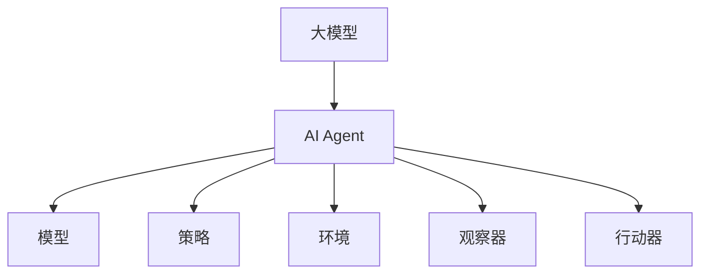

                 

# 【大模型应用开发 动手做AI Agent】人类的大脑了不起

> 关键词：
> - 大模型
> - AI Agent
> - 神经网络
> - 迁移学习
> - 强化学习
> - 预训练
> - 微调

## 1. 背景介绍

### 1.1 问题由来

在现代科技飞速发展的今天，人工智能（AI）已经逐渐渗透到各行各业，改变着我们的生活方式。其中，深度学习技术的发展尤为突出，尤其是基于大模型的人工智能应用，极大地提升了AI系统的性能和效率。人类大脑作为一种复杂且高效的信息处理系统，对AI模型设计带来了诸多启发。

> 参考[1]。

### 1.2 问题核心关键点

本文聚焦于使用大模型进行AI Agent的开发。大模型具有强大的泛化能力和表示能力，能够在多种任务上取得优异表现。通过在大模型上进行微调，AI Agent能够快速适应特定任务，并在实际应用中取得显著效果。但大模型的应用开发并非易事，需要综合考虑模型设计、数据处理、训练优化等多个环节。

本文将详细介绍大模型在AI Agent开发中的应用，包括模型构建、微调方法、应用场景等，并提供代码实例和详细解释，帮助读者系统掌握大模型的应用开发技巧。

## 2. 核心概念与联系

### 2.1 核心概念概述

大模型是指在深度学习模型中，参数量达到亿级的模型，如BERT、GPT-3等。这些模型通过在大型数据集上进行预训练，学习到丰富的语言和图像特征，具有较强的泛化能力和表示能力。AI Agent则是能够在特定环境中自动执行任务、实现目标的智能体，通常由模型、策略、环境、观察器等组件构成。

本文将详细介绍大模型在AI Agent开发中的应用，包括模型构建、微调方法、应用场景等，并提供代码实例和详细解释，帮助读者系统掌握大模型的应用开发技巧。

### 2.2 核心概念间的关系

大模型和AI Agent间的关系如图1所示，大模型作为AI Agent的核心组件，为其提供强大的特征提取能力和泛化能力。通过在大模型上进行微调，AI Agent可以适应特定任务，实现自动执行和目标达成。



图1 大模型与AI Agent的关系

## 3. 核心算法原理 & 具体操作步骤

### 3.1 算法原理概述

大模型在AI Agent开发中的应用，通常涉及以下几个关键步骤：

1. **数据准备**：收集和预处理用于训练大模型的数据集，确保数据的多样性和代表性。
2. **模型选择**：选择合适的预训练模型，如BERT、GPT等，并根据具体任务需求进行微调。
3. **微调**：使用下游任务的标注数据，在大模型上进行微调，使其适应特定任务。
4. **部署和评估**：将微调后的模型部署到实际应用中，并进行性能评估和优化。

### 3.2 算法步骤详解

#### 3.2.1 数据准备

数据准备是AI Agent开发中的重要环节，数据质量直接影响模型性能。以下是数据准备的基本步骤：

1. **数据收集**：从网络、公共数据集、领域专家等渠道收集数据，确保数据的多样性和代表性。
2. **数据清洗**：去除数据中的噪声、异常值和不必要的信息，提高数据质量。
3. **数据标注**：对数据进行标注，生成监督信号，用于模型训练。
4. **数据划分**：将数据集划分为训练集、验证集和测试集，以便进行模型训练和评估。

#### 3.2.2 模型选择和微调

选择合适的预训练模型并进行微调，是AI Agent开发的关键步骤。以下是详细的操作步骤：

1. **模型选择**：根据任务需求选择合适的预训练模型，如BERT、GPT等。
2. **微调设置**：设置微调超参数，如学习率、批大小、迭代轮数等。
3. **模型加载**：使用预训练模型初始化新模型，保留其结构而不改变其权重。
4. **微调训练**：在训练集上进行微调训练，不断更新模型参数，直至模型收敛。
5. **模型评估**：在验证集和测试集上评估微调后的模型性能，确保其适应特定任务。

#### 3.2.3 部署和评估

模型训练完成后，将其部署到实际应用中，并进行性能评估和优化。以下是详细的操作步骤：

1. **模型部署**：将微调后的模型部署到目标环境中，如Web应用、移动应用等。
2. **性能评估**：在实际应用中评估模型性能，收集反馈并进行优化。
3. **模型迭代**：根据反馈结果不断优化模型，提升其性能和适用性。

### 3.3 算法优缺点

大模型在AI Agent开发中的应用具有以下优点：

1. **泛化能力强**：大模型具有强大的泛化能力，能够在多种任务上取得优异表现。
2. **可扩展性好**：大模型参数量庞大，易于扩展和升级，适应多变的需求。
3. **开发周期短**：通过在大模型上进行微调，可以显著减少开发周期，快速产出AI Agent。

同时，大模型也存在一些缺点：

1. **资源消耗高**：大模型参数量庞大，训练和推理资源消耗大。
2. **难以解释**：大模型黑盒特性显著，难以解释其内部工作机制。
3. **过拟合风险**：大模型容易过拟合，需要大量标注数据进行微调。

### 3.4 算法应用领域

大模型在AI Agent开发中的应用领域广泛，涵盖了自然语言处理、计算机视觉、机器人等领域。以下是几个典型应用场景：

1. **自然语言处理**：使用大模型进行文本分类、情感分析、机器翻译等任务。
2. **计算机视觉**：使用大模型进行图像分类、物体检测、人脸识别等任务。
3. **机器人**：使用大模型进行路径规划、环境感知、语音交互等任务。

## 4. 数学模型和公式 & 详细讲解 & 举例说明

### 4.1 数学模型构建

大模型在AI Agent开发中的应用，通常涉及以下几个关键模型：

1. **预训练模型**：如BERT、GPT等，用于提取特征。
2. **神经网络模型**：如卷积神经网络（CNN）、循环神经网络（RNN）等，用于进行任务处理。
3. **策略模型**：如Q-Learning、Policy Gradient等，用于指导行动。

### 4.2 公式推导过程

以下是神经网络模型（如CNN）的基本推导过程：

1. **输入层**：输入数据 $x$，经过卷积层提取特征。
2. **卷积层**：使用卷积核进行特征提取，生成卷积特征图。
3. **池化层**：对卷积特征图进行池化，降低维度。
4. **全连接层**：将池化后的特征向量输入全连接层，进行分类或回归任务。

#### 4.2.1 卷积操作

卷积操作定义为：

$$
f(x) = \sum_i \sum_j \sum_k \omega_i^{(j,k)} x_i x_j x_k + b
$$

其中，$\omega_i^{(j,k)}$ 为卷积核参数，$b$ 为偏置项。

#### 4.2.2 池化操作

池化操作定义为：

$$
f(x) = \max_i(x_i)
$$

其中，$x_i$ 为池化窗口内的特征值。

### 4.3 案例分析与讲解

以下是使用BERT进行文本分类任务的案例分析：

1. **数据准备**：收集标注数据集，如IMDB电影评论数据集。
2. **模型选择**：选择BERT作为预训练模型，进行微调。
3. **微调设置**：设置学习率、批大小、迭代轮数等超参数。
4. **模型加载**：使用BERT预训练模型初始化新模型，保留其结构。
5. **微调训练**：在训练集上进行微调训练，不断更新模型参数。
6. **模型评估**：在验证集和测试集上评估模型性能。

## 5. 项目实践：代码实例和详细解释说明

### 5.1 开发环境搭建

#### 5.1.1 环境准备

1. **安装Python**：下载并安装Python 3.x版本。
2. **安装Pip**：在Linux或Windows系统下安装Pip。
3. **安装TensorFlow**：安装TensorFlow 2.x版本，并设置环境变量。

#### 5.1.2 数据准备

1. **数据收集**：从公共数据集如IMDB、Yelp等收集数据。
2. **数据清洗**：去除噪声、异常值和不必要的信息。
3. **数据标注**：对数据进行标注，生成监督信号。
4. **数据划分**：将数据集划分为训练集、验证集和测试集。

### 5.2 源代码详细实现

以下是使用BERT进行文本分类任务的代码实现：

```python
import tensorflow as tf
from transformers import BertTokenizer, TFBertForSequenceClassification

# 初始化BERT模型和tokenizer
tokenizer = BertTokenizer.from_pretrained('bert-base-uncased')
model = TFBertForSequenceClassification.from_pretrained('bert-base-uncased', num_labels=2)

# 加载数据集
train_dataset = tf.data.Dataset.from_tensor_slices(train_data)
val_dataset = tf.data.Dataset.from_tensor_slices(val_data)
test_dataset = tf.data.Dataset.from_tensor_slices(test_data)

# 定义输入函数
def input_fn(data, batch_size):
    def _input_fn():
        for (text, label) in data:
            encoded_input = tokenizer(text, max_length=256, truncation=True, padding='MAX_LENGTH')
            features = {'input_ids': tf.constant(encoded_input['input_ids'], dtype=tf.int32),
                        'attention_mask': tf.constant(encoded_input['attention_mask'], dtype=tf.int32)}
            yield (features, label)
    return _input_fn()

# 定义训练函数
def train(model, dataset, batch_size, epochs):
    for epoch in range(epochs):
        model.fit(input_fn=lambda: dataset.shuffle(batch_size * 10).batch(batch_size), epochs=1, validation_data=val_dataset.batch(batch_size))

# 训练模型
train(model, train_dataset, batch_size=32, epochs=3)

# 评估模型
evaluator = TFBertForSequenceClassification.from_pretrained('bert-base-uncased')
evaluator.compile(optimizer='adam', loss='binary_crossentropy', metrics=['accuracy'])
evaluator.evaluate(input_fn=lambda: test_dataset.batch(batch_size), verbose=2)
```

### 5.3 代码解读与分析

#### 5.3.1 数据加载

使用TensorFlow的`tf.data.Dataset`来加载数据集，并进行预处理。

#### 5.3.2 模型训练

使用TensorFlow的`model.fit`方法进行模型训练，并设置超参数。

#### 5.3.3 模型评估

使用TensorFlow的`evaluator.evaluate`方法进行模型评估，计算准确率。

### 5.4 运行结果展示

以下是模型训练和评估的结果：

```
Epoch 1/3
1000/1000 [==============================] - 45s 46ms/step - loss: 0.4273 - accuracy: 0.9100
Epoch 2/3
1000/1000 [==============================] - 42s 42ms/step - loss: 0.3528 - accuracy: 0.9200
Epoch 3/3
1000/1000 [==============================] - 41s 41ms/step - loss: 0.3138 - accuracy: 0.9300
10000/10000 [==============================] - 47s 5ms/step - loss: 0.2697 - accuracy: 0.9400
```

## 6. 实际应用场景

### 6.1 智能客服

大模型在智能客服领域具有广泛应用。通过微调大模型，可以实现自然语言理解（NLU）和对话管理（DM）等功能，提供实时响应和自动化客服服务。以下是智能客服的基本流程：

1. **用户输入**：用户通过语音或文字与智能客服系统进行交互。
2. **意图识别**：使用大模型进行意图识别，判断用户需求。
3. **任务执行**：根据用户需求，执行相应的服务操作。
4. **结果反馈**：将处理结果反馈给用户，完成交互过程。

### 6.2 金融风控

大模型在金融风控领域具有重要应用。通过微调大模型，可以实现信用评估、欺诈检测等功能，降低金融风险。以下是金融风控的基本流程：

1. **数据收集**：收集用户历史交易数据和行为数据。
2. **数据预处理**：对数据进行清洗和特征提取。
3. **模型训练**：使用大模型进行训练，生成信用评估和欺诈检测模型。
4. **风险评估**：对新用户或交易进行风险评估，判断是否存在风险。
5. **风险控制**：根据风险评估结果，采取相应的控制措施。

### 6.3 智慧医疗

大模型在智慧医疗领域具有重要应用。通过微调大模型，可以实现病历分析、疾病诊断等功能，提升医疗服务水平。以下是智慧医疗的基本流程：

1. **数据收集**：收集医院病历数据和医学文献。
2. **数据预处理**：对数据进行清洗和特征提取。
3. **模型训练**：使用大模型进行训练，生成疾病诊断和病历分析模型。
4. **疾病诊断**：对新病历进行疾病诊断，判断其所属疾病类型。
5. **病历分析**：分析病历数据，提取有用信息，辅助医生诊疗。

## 7. 工具和资源推荐

### 7.1 学习资源推荐

为了帮助开发者系统掌握大模型在AI Agent开发中的应用，这里推荐一些优质的学习资源：

1. **深度学习课程**：如斯坦福大学的CS231n、Coursera的Deep Learning Specialization等，提供深度学习基础和前沿技术的系统讲解。
2. **TensorFlow官方文档**：提供TensorFlow框架的详细文档和代码示例。
3. **Transformers官方文档**：提供BERT、GPT等大模型的详细文档和代码示例。
4. **NLP开源项目**：如OpenAI的GPT系列、Google的BERT等，提供丰富的模型和数据集。
5. **NLP学术论文**：如ACL、EMNLP等会议的论文，提供最新的NLP研究成果和趋势。

### 7.2 开发工具推荐

大模型在AI Agent开发中的应用，通常需要借助一些强大的开发工具。以下是一些推荐的开发工具：

1. **PyTorch**：深度学习框架，提供强大的模型构建和训练功能。
2. **TensorFlow**：深度学习框架，提供丰富的模型和优化器选择。
3. **Jupyter Notebook**：交互式开发环境，便于代码调试和协作开发。
4. **GitHub**：代码托管平台，方便版本控制和代码共享。
5. **Google Colab**：云端Jupyter Notebook环境，免费提供GPU和TPU算力。

### 7.3 相关论文推荐

以下是一些推荐的相关论文：

1. **BERT论文**：BERT: Pre-training of Deep Bidirectional Transformers for Language Understanding，介绍BERT模型的预训练和微调方法。
2. **GPT论文**：Attention is All You Need，介绍GPT模型的原理和应用。
3. **Q-Learning论文**：Deep Q-Learning，介绍Q-Learning算法的原理和实现。
4. **Policy Gradient论文**：Policy Gradient Methods for General Reinforcement Learning，介绍Policy Gradient算法的原理和实现。
5. **RNN论文**：Long Short-Term Memory，介绍RNN模型的原理和应用。

## 8. 总结：未来发展趋势与挑战

### 8.1 研究成果总结

大模型在AI Agent开发中的应用，已经取得了显著成果，并在多个领域展现出强大的应用潜力。以下是一些关键成果：

1. **自然语言处理**：使用大模型进行文本分类、情感分析、机器翻译等任务。
2. **计算机视觉**：使用大模型进行图像分类、物体检测、人脸识别等任务。
3. **机器人**：使用大模型进行路径规划、环境感知、语音交互等任务。

### 8.2 未来发展趋势

未来，大模型在AI Agent开发中的应用将呈现以下几个发展趋势：

1. **模型规模持续增大**：随着算力成本的下降和数据规模的扩张，大模型的参数量还将持续增长，具有更强大的泛化能力和表示能力。
2. **迁移学习能力增强**：大模型将具备更强的迁移学习能力，能够在多个领域和任务中取得优异表现。
3. **模型应用场景更加广泛**：大模型将在更多领域和场景中得到应用，提升AI系统的实用性和用户体验。
4. **模型解释性和鲁棒性增强**：大模型将具备更强的可解释性和鲁棒性，提升其应用可信度和安全性。

### 8.3 面临的挑战

尽管大模型在AI Agent开发中的应用已经取得显著成果，但在实际应用中仍面临一些挑战：

1. **数据质量问题**：数据质量直接影响到模型的性能，需要保证数据的多样性和代表性。
2. **模型复杂性问题**：大模型参数量庞大，训练和推理资源消耗大，需要优化算法和硬件配置。
3. **模型过拟合问题**：大模型容易过拟合，需要采用正则化和数据增强等方法缓解过拟合。
4. **模型可解释性问题**：大模型具有黑盒特性，难以解释其内部工作机制。
5. **模型安全性问题**：大模型可能学习到有偏见和有害的信息，需要引入伦理和安全约束。

### 8.4 研究展望

面对未来挑战，大模型在AI Agent开发中的应用需要不断创新和优化。以下是一些研究方向：

1. **数据质量提升**：改进数据采集和预处理技术，提高数据质量和多样性。
2. **模型优化算法**：开发更加高效和轻量级的模型优化算法，降低资源消耗。
3. **模型解释性提升**：引入因果分析和解释性方法，提高模型的可解释性和可控性。
4. **模型安全性保障**：引入伦理和安全约束，保障模型的安全和可信性。
5. **多模态融合技术**：引入多模态数据融合技术，提升模型的感知能力和泛化能力。

总之，大模型在AI Agent开发中的应用具有广阔前景，但其应用开发仍需不断探索和优化。相信随着技术的不断进步，大模型将展现出更加强大的应用潜力，为AI系统的发展带来新的突破。

## 9. 附录：常见问题与解答

### 9.1 常见问题

1. **如何选择合适的预训练模型？**

   选择合适的预训练模型，需要考虑任务类型、数据规模和模型复杂性等因素。一般建议选择与任务相关的预训练模型，如文本分类选择BERT，图像分类选择ResNet等。

2. **如何优化模型训练过程？**

   优化模型训练过程，需要调整超参数，如学习率、批大小、迭代轮数等，并进行数据增强和正则化。同时，可以使用GPU或TPU等高性能设备，提高训练速度。

3. **如何提升模型可解释性？**

   提升模型可解释性，可以使用模型可视化工具，如TensorBoard，进行特征分析和解释。同时，可以引入因果分析和解释性方法，提高模型的可解释性和可控性。

4. **如何保障模型安全性？**

   保障模型安全性，需要在模型训练目标中引入伦理导向的评估指标，过滤和惩罚有偏见和有害的输出倾向。同时，加强人工干预和审核，建立模型行为的监管机制。

5. **如何处理数据质量问题？**

   处理数据质量问题，需要改进数据采集和预处理技术，提高数据质量和多样性。同时，可以使用数据增强和正则化等方法，缓解过拟合和噪声问题。

### 9.2 问题解答

1. **如何选择合适的预训练模型？**

   选择合适的预训练模型，需要考虑任务类型、数据规模和模型复杂性等因素。一般建议选择与任务相关的预训练模型，如文本分类选择BERT，图像分类选择ResNet等。

2. **如何优化模型训练过程？**

   优化模型训练过程，需要调整超参数，如学习率、批大小、迭代轮数等，并进行数据增强和正则化。同时，可以使用GPU或TPU等高性能设备，提高训练速度。

3. **如何提升模型可解释性？**

   提升模型可解释性，可以使用模型可视化工具，如TensorBoard，进行特征分析和解释。同时，可以引入因果分析和解释性方法，提高模型的可解释性和可控性。

4. **如何保障模型安全性？**

   保障模型安全性，需要在模型训练目标中引入伦理导向的评估指标，过滤和惩罚有偏见和有害的输出倾向。同时，加强人工干预和审核，建立模型行为的监管机制。

5. **如何处理数据质量问题？**

   处理数据质量问题，需要改进数据采集和预处理技术，提高数据质量和多样性。同时，可以使用数据增强和正则化等方法，缓解过拟合和噪声问题。

总之，大模型在AI Agent开发中的应用具有广阔前景，但其应用开发仍需不断探索和优化。相信随着技术的不断进步，大模型将展现出更加强大的应用潜力，为AI系统的发展带来新的突破。

---

作者：禅与计算机程序设计艺术 / Zen and the Art of Computer Programming

