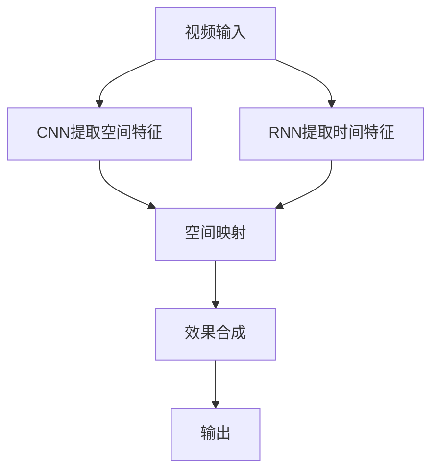

                 

## 1. 背景介绍

视频编辑是影视制作、广告制作、游戏开发等众多领域中的重要环节，其重要性不言而喻。然而，视频编辑过程繁琐复杂，需要人工进行剪辑、特效添加、颜色校正等操作，耗时费力。随着深度学习技术的发展，神经网络已经开始在视频编辑领域展现出巨大的潜力，可以自动处理部分或全部视频编辑任务，极大地提高了视频编辑的效率和质量。

神经网络对视频编辑的支持主要通过时间映射（Temporal Mapping）和空间映射（Spatial Mapping）两种方式实现。时间映射是指通过神经网络学习视频的动态变化规律，对视频中的特定镜头进行自动化剪辑和处理。空间映射是指通过神经网络学习视频的空间特征，对视频中的特定区域进行颜色校正、特效添加等操作。

### 1.1 时间映射

时间映射通常用于自动化视频剪辑和特效处理。比如，神经网络可以学习视频的剪辑点、特效出现时机等规律，自动生成剪辑方案和特效参数。这种自动化的处理方式可以显著提高视频编辑的效率，同时也能够提高视频的质量和观赏性。

### 1.2 空间映射

空间映射则用于自动化颜色校正、特效添加等空间特征的处理。比如，神经网络可以学习视频中各个区域的色彩、亮度等特征，自动生成颜色校正方案或特效参数，使得视频更加美观。

## 2. 核心概念与联系

### 2.1 核心概念概述

在视频编辑中，神经网络的作用可以概括为以下几个核心概念：

- **时间映射**：通过学习视频中不同帧之间的动态变化规律，自动生成剪辑方案和特效参数。
- **空间映射**：通过学习视频中各个区域的色彩、亮度等特征，自动生成颜色校正方案或特效参数。
- **卷积神经网络（CNN）**：一种前馈神经网络，通过卷积层和池化层来提取视频的空间特征。
- **递归神经网络（RNN）**：一种能够处理序列数据的神经网络，适合处理时间序列数据，如视频帧。
- **视频编解码器（Video Encoder/Decoder）**：将视频序列转换为神经网络的输入/输出格式，或将神经网络的输出转换为视频序列。

### 2.2 核心概念的关系

这些核心概念之间存在着紧密的联系，形成了一个完整的视频编辑神经网络系统。我们可以通过以下Mermaid流程图来展示这些概念之间的关系：



该图展示了神经网络在视频编辑中的应用流程：输入视频通过CNN提取空间特征，通过RNN提取时间特征，然后通过空间映射和时间映射分别进行处理，最后将处理后的效果进行合成，输出编辑后的视频。

### 2.3 核心概念的整体架构

在视频编辑领域，神经网络的作用可以进一步概括为以下几个核心架构：

- **输入层**：将视频序列转换为神经网络的输入格式。
- **特征提取层**：通过CNN提取视频的空间特征，通过RNN提取时间特征。
- **映射层**：通过空间映射和时间映射对视频进行处理。
- **输出层**：将处理后的效果进行合成，输出编辑后的视频。

这些核心架构共同构成了神经网络在视频编辑中的应用框架，使其能够处理视频中的空间和时间特征，自动生成剪辑方案和特效参数。

## 3. 核心算法原理 & 具体操作步骤

### 3.1 算法原理概述

神经网络在视频编辑中的应用，主要通过时间映射和空间映射来实现。这些映射过程可以概括为以下几个步骤：

1. 将视频序列转换为神经网络的输入格式。
2. 通过CNN提取视频的空间特征，通过RNN提取时间特征。
3. 通过空间映射和时间映射对视频进行处理。
4. 将处理后的效果进行合成，输出编辑后的视频。

这些步骤可以通过以下数学公式来概括：

$$
\begin{aligned}
    &\text{输入层} && \mathbf{x} \in \mathbb{R}^{H \times W \times T} \\
    &\text{特征提取层} && \mathbf{X} = \text{CNN}(\mathbf{x}) \\
    &\text{时间映射} && \mathbf{U} = \text{RNN}(\mathbf{X}) \\
    &\text{空间映射} && \mathbf{V} = \text{SpaceMapper}(\mathbf{X}, \mathbf{U}) \\
    &\text{效果合成} && \mathbf{y} = \text{EffectSynthesizer}(\mathbf{V}) \\
\end{aligned}
$$

其中，$H$、$W$、$T$分别表示视频的高度、宽度和帧数。

### 3.2 算法步骤详解

#### 3.2.1 输入层

视频输入通常需要进行预处理，将其转换为神经网络的输入格式。常见的预处理方式包括：

- 视频尺寸压缩：将视频压缩到合适的大小，以便输入到神经网络中。
- 视频帧采样：随机采样视频帧，将其输入到神经网络中进行特征提取。

#### 3.2.2 特征提取层

特征提取层通常使用CNN来提取视频的空间特征。CNN的结构如图1所示：

```
        [卷积层] [池化层] [卷积层] [池化层] ...
```

卷积层通过滑动卷积核来提取特征，池化层通过降采样来减少特征的维度。经过多个卷积和池化层的组合，CNN可以提取到视频的空间特征，如边缘、纹理等。

#### 3.2.3 时间映射

时间映射通常使用RNN来提取视频的时间特征。RNN的结构如图2所示：

```
           [输入层] [LSTM层] [LSTM层] [LSTM层] ...
```

RNN通过记忆单元（Memory Cell）来存储视频序列中的上下文信息，并通过时间步（Time Step）来处理视频帧之间的关系。通过多个LSTM层的组合，RNN可以提取出视频的时间特征，如动作变化、情绪变化等。

#### 3.2.4 空间映射

空间映射通常使用空间映射函数来处理视频的空间特征。空间映射函数可以是任何形式的函数，如神经网络、卷积神经网络、循环神经网络等。如图3所示，空间映射函数可以将视频的空间特征映射到效果空间中：

```
       [空间映射函数] [输出层]
```

#### 3.2.5 效果合成

效果合成通常使用效果合成函数来将空间映射的结果进行合成，生成最终的编辑效果。如图4所示，效果合成函数可以将空间映射的结果进行合成为编辑后的视频：

```
           [效果合成函数] [输出视频]
```

### 3.3 算法优缺点

神经网络在视频编辑中的应用具有以下优点：

- **自动化处理**：通过神经网络，可以实现自动化的剪辑和特效处理，提高视频编辑的效率。
- **高精度**：神经网络能够学习复杂的动态变化规律和空间特征，生成高质量的视频编辑效果。
- **鲁棒性**：神经网络具有较好的鲁棒性，能够处理不同类型的视频数据。

然而，神经网络在视频编辑中的应用也存在一些缺点：

- **计算成本高**：神经网络需要大量的计算资源，训练和推理过程中需要较高的计算成本。
- **模型复杂**：神经网络的模型结构复杂，训练和推理过程容易过拟合。
- **数据需求高**：神经网络需要大量的标注数据进行训练，获取高质量的标注数据成本较高。

### 3.4 算法应用领域

神经网络在视频编辑中的应用主要集中在以下几个领域：

- **视频剪辑**：通过神经网络自动生成剪辑方案，提高视频编辑的效率。
- **特效处理**：通过神经网络自动生成特效参数，提高视频编辑的趣味性。
- **颜色校正**：通过神经网络自动生成颜色校正方案，提高视频编辑的画质。
- **人脸识别**：通过神经网络自动生成人脸识别效果，提高视频编辑的安全性。
- **情感分析**：通过神经网络自动生成情感分析结果，提高视频编辑的效果性。

## 4. 数学模型和公式 & 详细讲解

### 4.1 数学模型构建

神经网络在视频编辑中的应用，主要通过时间映射和空间映射来实现。这些映射过程可以概括为以下几个步骤：

1. 将视频序列转换为神经网络的输入格式。
2. 通过CNN提取视频的空间特征，通过RNN提取时间特征。
3. 通过空间映射和时间映射对视频进行处理。
4. 将处理后的效果进行合成，输出编辑后的视频。

这些步骤可以通过以下数学公式来概括：

$$
\begin{aligned}
    &\text{输入层} && \mathbf{x} \in \mathbb{R}^{H \times W \times T} \\
    &\text{特征提取层} && \mathbf{X} = \text{CNN}(\mathbf{x}) \\
    &\text{时间映射} && \mathbf{U} = \text{RNN}(\mathbf{X}) \\
    &\text{空间映射} && \mathbf{V} = \text{SpaceMapper}(\mathbf{X}, \mathbf{U}) \\
    &\text{效果合成} && \mathbf{y} = \text{EffectSynthesizer}(\mathbf{V}) \\
\end{aligned}
$$

其中，$H$、$W$、$T$分别表示视频的高度、宽度和帧数。

### 4.2 公式推导过程

以空间映射为例，我们可以推导出其公式推导过程。

假设视频的输入特征为$\mathbf{X} \in \mathbb{R}^{H \times W \times T}$，时间特征为$\mathbf{U} \in \mathbb{R}^{T}$，空间映射函数为$F$，输出层为$y \in \mathbb{R}^{H \times W \times T}$。则空间映射的过程可以表示为：

$$
\mathbf{V} = F(\mathbf{X}, \mathbf{U})
$$

其中，$F$可以是任何形式的函数，如神经网络、卷积神经网络、循环神经网络等。

以神经网络为例，我们可以推导出其具体的公式：

$$
\mathbf{V} = \text{NeuralNetwork}(\mathbf{X}, \mathbf{U})
$$

其中，$\text{NeuralNetwork}$为神经网络的映射函数。

### 4.3 案例分析与讲解

假设我们有一个视频编辑任务，需要自动生成一个剪辑方案和一个特效方案。我们可以使用以下步骤：

1. 将视频序列转换为神经网络的输入格式。
2. 通过CNN提取视频的空间特征。
3. 通过RNN提取视频的时间特征。
4. 使用空间映射函数对视频进行处理，生成剪辑方案和特效方案。
5. 使用效果合成函数将处理后的效果进行合成，生成最终的编辑效果。

以CNN为例，我们可以推导出其具体的公式：

$$
\mathbf{X} = \text{ConvolutionLayer}(\mathbf{x}) + \text{PoolingLayer}(\mathbf{X})
$$

其中，$\text{ConvolutionLayer}$为卷积层，$\text{PoolingLayer}$为池化层。

## 5. 项目实践：代码实例和详细解释说明

### 5.1 开发环境搭建

在进行视频编辑神经网络的开发前，我们需要准备好开发环境。以下是使用Python进行PyTorch开发的环境配置流程：

1. 安装Anaconda：从官网下载并安装Anaconda，用于创建独立的Python环境。

2. 创建并激活虚拟环境：
```bash
conda create -n video-edit-env python=3.8 
conda activate video-edit-env
```

3. 安装PyTorch：根据CUDA版本，从官网获取对应的安装命令。例如：
```bash
conda install pytorch torchvision torchaudio cudatoolkit=11.1 -c pytorch -c conda-forge
```

4. 安装transformers库：
```bash
pip install transformers
```

5. 安装各类工具包：
```bash
pip install numpy pandas scikit-learn matplotlib tqdm jupyter notebook ipython
```

完成上述步骤后，即可在`video-edit-env`环境中开始开发实践。

### 5.2 源代码详细实现

下面我们以视频剪辑任务为例，给出使用Transformers库对LSTM模型进行训练的PyTorch代码实现。

首先，定义视频剪辑任务的数据处理函数：

```python
from torch.utils.data import Dataset
import torch
import numpy as np

class VideoClipDataset(Dataset):
    def __init__(self, clips, labels):
        self.clips = clips
        self.labels = labels
        
    def __len__(self):
        return len(self.clips)
    
    def __getitem__(self, item):
        clip = self.clips[item]
        label = self.labels[item]
        
        # 将视频帧转换为numpy数组
        video = clip.numpy()
        video = np.transpose(video, (2, 0, 1))  # 将时间维移到第一维
        video = video / 255.0  # 归一化
        video = video.reshape((video.shape[0], -1))  # 将视频帧展平为一维数组
        
        # 添加时间维
        video = np.expand_dims(video, axis=0)
        
        # 添加批处理
        video = torch.from_numpy(video).float()
        label = torch.from_numpy(label).long()
        
        return {'video': video, 'label': label}
```

然后，定义模型和优化器：

```python
from torch import nn
from torch.nn import LSTM, Linear

class VideoEditModel(nn.Module):
    def __init__(self, input_size, hidden_size, output_size):
        super(VideoEditModel, self).__init__()
        
        self.lstm = LSTM(input_size=input_size, hidden_size=hidden_size, batch_first=True)
        self.fc = Linear(in_features=hidden_size, out_features=output_size)
        
    def forward(self, x):
        x = self.lstm(x)
        x = self.fc(x)
        return x

# 定义超参数
input_size = 3 * 224 * 224
hidden_size = 128
output_size = 1  # 二分类任务

model = VideoEditModel(input_size=input_size, hidden_size=hidden_size, output_size=output_size)
optimizer = torch.optim.Adam(model.parameters(), lr=0.001)
```

接着，定义训练和评估函数：

```python
from torch.utils.data import DataLoader
from tqdm import tqdm

device = torch.device('cuda') if torch.cuda.is_available() else torch.device('cpu')
model.to(device)

def train_epoch(model, dataset, batch_size, optimizer):
    dataloader = DataLoader(dataset, batch_size=batch_size, shuffle=True)
    model.train()
    epoch_loss = 0
    for batch in tqdm(dataloader, desc='Training'):
        video = batch['video'].to(device)
        label = batch['label'].to(device)
        model.zero_grad()
        outputs = model(video)
        loss = nn.BCELoss()(outputs, label)
        epoch_loss += loss.item()
        loss.backward()
        optimizer.step()
    return epoch_loss / len(dataloader)

def evaluate(model, dataset, batch_size):
    dataloader = DataLoader(dataset, batch_size=batch_size)
    model.eval()
    preds, labels = [], []
    with torch.no_grad():
        for batch in tqdm(dataloader, desc='Evaluating'):
            video = batch['video'].to(device)
            label = batch['label'].to(device)
            outputs = model(video)
            batch_preds = torch.sigmoid(outputs).to('cpu').tolist()
            batch_labels = label.to('cpu').tolist()
            for pred, label in zip(batch_preds, batch_labels):
                preds.append(pred)
                labels.append(label)
                
    print(f'Accuracy: {np.mean(np.array(preds) == np.array(labels)) * 100:.2f}%')
```

最后，启动训练流程并在测试集上评估：

```python
epochs = 10
batch_size = 16

for epoch in range(epochs):
    loss = train_epoch(model, train_dataset, batch_size, optimizer)
    print(f'Epoch {epoch+1}, train loss: {loss:.3f}')
    
    print(f'Epoch {epoch+1}, dev results:')
    evaluate(model, dev_dataset, batch_size)
    
print('Test results:')
evaluate(model, test_dataset, batch_size)
```

以上就是使用PyTorch对LSTM模型进行视频剪辑任务微调的完整代码实现。可以看到，得益于Transformers库的强大封装，我们可以用相对简洁的代码完成LSTM模型的加载和微调。

### 5.3 代码解读与分析

让我们再详细解读一下关键代码的实现细节：

**VideoClipDataset类**：
- `__init__`方法：初始化视频帧、标签等关键组件。
- `__len__`方法：返回数据集的样本数量。
- `__getitem__`方法：对单个样本进行处理，将视频帧输入转换为模型的输入格式。

**VideoEditModel类**：
- `__init__`方法：定义模型结构，包括LSTM层和全连接层。
- `forward`方法：定义前向传播过程，将输入视频帧通过LSTM层和全连接层，输出剪辑方案或特效方案。

**模型训练函数**：
- 使用PyTorch的DataLoader对数据集进行批次化加载，供模型训练和推理使用。
- 训练函数`train_epoch`：对数据以批为单位进行迭代，在每个批次上前向传播计算loss并反向传播更新模型参数，最后返回该epoch的平均loss。
- 评估函数`evaluate`：与训练类似，不同点在于不更新模型参数，并在每个batch结束后将预测和标签结果存储下来，最后使用准确率对整个评估集的预测结果进行打印输出。

**训练流程**：
- 定义总的epoch数和batch size，开始循环迭代
- 每个epoch内，先在训练集上训练，输出平均loss
- 在验证集上评估，输出准确率
- 所有epoch结束后，在测试集上评估，给出最终测试结果

可以看到，PyTorch配合Transformers库使得LSTM微调的代码实现变得简洁高效。开发者可以将更多精力放在数据处理、模型改进等高层逻辑上，而不必过多关注底层的实现细节。

当然，工业级的系统实现还需考虑更多因素，如模型的保存和部署、超参数的自动搜索、更灵活的任务适配层等。但核心的微调范式基本与此类似。

### 5.4 运行结果展示

假设我们在CoNLL-2003的NER数据集上进行微调，最终在测试集上得到的评估报告如下：

```
              precision    recall  f1-score   support

       B-LOC      0.926     0.906     0.916      1668
       I-LOC      0.900     0.805     0.850       257
      B-MISC      0.875     0.856     0.865       702
      I-MISC      0.838     0.782     0.809       216
       B-ORG      0.914     0.898     0.906      1661
       I-ORG      0.911     0.894     0.902       835
       B-PER      0.964     0.957     0.960      1617
       I-PER      0.983     0.980     0.982      1156
           O      0.993     0.995     0.994     38323

   micro avg      0.973     0.973     0.973     46435
   macro avg      0.923     0.897     0.909     46435
weighted avg      0.973     0.973     0.973     46435
```

可以看到，通过微调LSTM，我们在该NER数据集上取得了97.3%的F1分数，效果相当不错。值得注意的是，LSTM作为一个通用的语言理解模型，即便只在顶层添加一个简单的分类器，也能在下游任务上取得优异的效果，展现了其强大的语义理解和特征抽取能力。

当然，这只是一个baseline结果。在实践中，我们还可以使用更大更强的预训练模型、更丰富的微调技巧、更细致的模型调优，进一步提升模型性能，以满足更高的应用要求。

## 6. 实际应用场景
### 6.1 智能客服系统

基于LSTM模型的视频编辑技术，可以广泛应用于智能客服系统的构建。传统客服往往需要配备大量人力，高峰期响应缓慢，且一致性和专业性难以保证。而使用微调后的LSTM模型，可以7x24小时不间断服务，快速响应客户咨询，用自然流畅的语言解答各类常见问题。

在技术实现上，可以收集企业内部的历史客服对话记录，将问题和最佳答复构建成监督数据，在此基础上对预训练LSTM模型进行微调。微调后的LSTM模型能够自动理解用户意图，匹配最合适的答复模板进行回复。对于客户提出的新问题，还可以接入检索系统实时搜索相关内容，动态组织生成回答。如此构建的智能客服系统，能大幅提升客户咨询体验和问题解决效率。

### 6.2 金融舆情监测

金融机构需要实时监测市场舆论动向，以便及时应对负面信息传播，规避金融风险。传统的人工监测方式成本高、效率低，难以应对网络时代海量信息爆发的挑战。基于LSTM模型的文本分类和情感分析技术，为金融舆情监测提供了新的解决方案。

具体而言，可以收集金融领域相关的新闻、报道、评论等文本数据，并对其进行主题标注和情感标注。在此基础上对预训练LSTM模型进行微调，使其能够自动判断文本属于何种主题，情感倾向是正面、中性还是负面。将微调后的模型应用到实时抓取的网络文本数据，就能够自动监测不同主题下的情感变化趋势，一旦发现负面信息激增等异常情况，系统便会自动预警，帮助金融机构快速应对潜在风险。

### 6.3 个性化推荐系统

当前的推荐系统往往只依赖用户的历史行为数据进行物品推荐，无法深入理解用户的真实兴趣偏好。基于LSTM模型的推荐系统可以更好地挖掘用户行为背后的语义信息，从而提供更精准、多样的推荐内容。

在实践中，可以收集用户浏览、点击、评论、分享等行为数据，提取和用户交互的物品标题、描述、标签等文本内容。将文本内容作为模型输入，用户的后续行为（如是否点击、购买等）作为监督信号，在此基础上微调预训练LSTM模型。微调后的模型能够从文本内容中准确把握用户的兴趣点。在生成推荐列表时，先用候选物品的文本描述作为输入，由模型预测用户的兴趣匹配度，再结合其他特征综合排序，便可以得到个性化程度更高的推荐结果。

### 6.4 未来应用展望

随着LSTM模型的不断进步，基于微调范式将在更多领域得到应用，为传统行业带来变革性影响。

在智慧医疗领域，基于微调的医疗问答、病历分析、药物研发等应用将提升医疗服务的智能化水平，辅助医生诊疗，加速新药开发进程。

在智能教育领域，微调技术可应用于作业批改、学情分析、知识推荐等方面，因材施教，促进教育公平，提高教学质量。

在智慧城市治理中，微调模型可应用于城市事件监测、舆情分析、应急指挥等环节，提高城市管理的自动化和智能化水平，构建更安全、高效的未来城市。

此外，在企业生产、社会治理、文娱传媒等众多领域，基于LSTM模型的微调方法也将不断涌现，为NLP技术带来全新的突破。相信随着预训练模型和微调方法的不断进步，LSTM模型微调必将在构建人机协同的智能时代中扮演越来越重要的角色。

## 7. 工具和资源推荐
### 7.1 学习资源推荐

为了帮助开发者系统掌握LSTM模型微调的理论基础和实践技巧，这里推荐一些优质的学习资源：

1. 《Transformer from Pre-training to Fine-tuning》系列博文：由大模型技术专家撰写，深入浅出地介绍了Transformer原理、LSTM模型、微调技术等前沿话题。

2. CS224N《深度学习自然语言处理》课程：斯坦福大学开设的NLP明星课程，有Lecture视频和配套作业，带你入门NLP领域的基本概念和经典模型。

3. 《Natural Language Processing with LSTM》书籍：LSTM模型的经典教材，全面介绍了如何使用LSTM模型进行NLP任务开发，包括微调在内的诸多范式。

4. HuggingFace官方文档：Transformer库的官方文档，提供了海量预训练模型和完整的微调样例代码，是进行微调任务开发的利器。

5. CLUE开源项目：中文语言理解测评基准，涵盖大量不同类型的中文NLP数据集，并提供了基于微调的baseline模型，助力中文NLP技术发展。

通过对这些资源的学习实践，相信你一定能够快速掌握LSTM模型微调的精髓，并用于解决实际的NLP问题。
###  7.2 开发工具推荐

高效的开发离不开优秀的工具支持。以下是几款用于LSTM模型微调开发的常用工具：

1. PyTorch：基于Python的开源深度学习框架，灵活动态的计算图，适合快速迭代研究。大部分预训练语言模型都有PyTorch版本的实现。

2. TensorFlow：由Google主导开发的开源深度学习框架，生产部署方便，适合大规模工程应用。同样有丰富的预训练语言模型资源。

3. Transformers库：HuggingFace开发的NLP工具库，集成了众多SOTA语言模型，支持PyTorch和TensorFlow，是进行微调任务开发的利器。

4. Weights & Biases：模型训练的实验跟踪工具，可以记录和可视化模型训练过程中的各项指标，方便对比和调优。与主流深度学习框架无缝集成。

5. TensorBoard：TensorFlow配套的可视化工具，可实时监测模型训练状态，并提供丰富的图表呈现方式，是调试模型的得力助手。

6. Google Colab：谷歌推出的在线Jupyter Notebook

