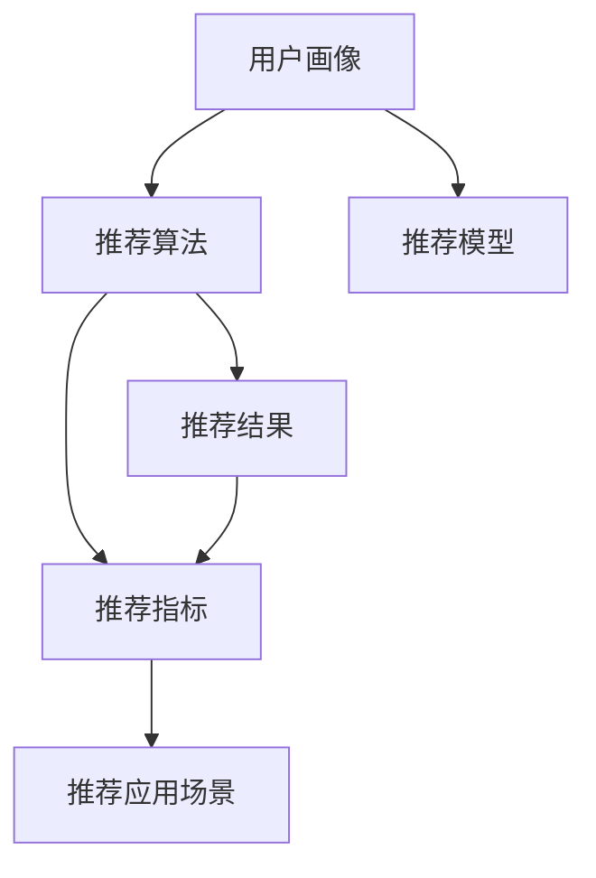
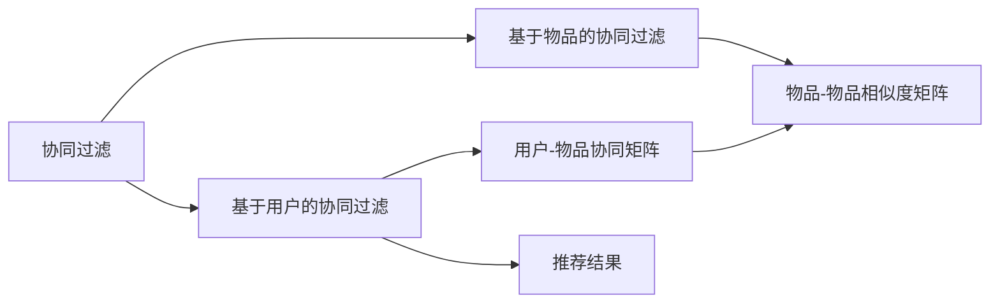
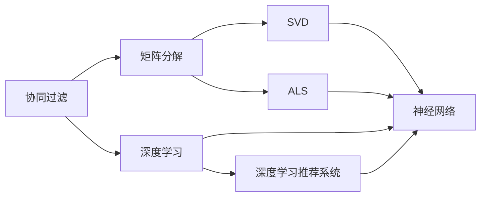
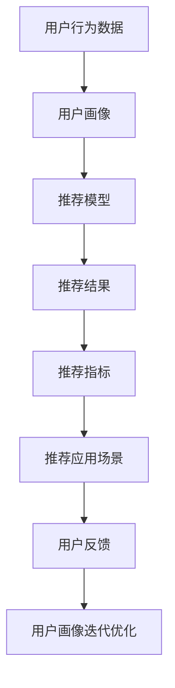

                 

## 1. 背景介绍

### 1.1 问题由来

随着互联网的普及和信息技术的发展，信息爆炸和数据红利已经成为各行各业的普遍现象。个性化推荐系统（Personalized Recommendation Systems）作为一种有效挖掘用户需求、提升用户体验的技术，已经在电商、视频、新闻、音乐等多个领域取得了显著效果。然而，随着推荐系统的广泛应用，其技术挑战也日益凸显。用户需求的多样化、数据量的爆炸式增长、算法的复杂度提升等因素，使得个性化推荐系统的技术实现面临诸多难题。

### 1.2 问题核心关键点

个性化推荐系统的主要目标是基于用户的历史行为数据，预测其未来的兴趣点，从而为用户推荐符合其偏好的内容。在技术实现上，其核心关键点在于：

1. **用户兴趣建模**：如何从用户的行为数据中挖掘出其真正的兴趣偏好，构建用户画像。
2. **推荐算法设计**：如何设计高效的推荐算法，结合用户画像，计算出满足用户兴趣的推荐结果。
3. **推荐结果优化**：如何优化推荐结果，提升点击率、转化率等指标。
4. **用户行为预测**：如何准确预测用户的未来行为，适应不同用户的变化需求。
5. **系统可扩展性**：如何在大规模数据和高并发访问场景下，保持系统的稳定性和高效性。

这些核心关键点相互关联，共同决定了个性化推荐系统的性能和用户体验。

### 1.3 问题研究意义

个性化推荐系统的研究具有重要意义：

1. **提升用户体验**：通过精准推荐，满足用户需求，提升用户满意度和粘性。
2. **提高运营效率**：减少用户搜索时间和流量损耗，提升平台转化率。
3. **优化资源利用**：通过推荐系统，合理分配资源，降低资源浪费。
4. **促进创新迭代**：通过用户反馈和推荐结果，不断改进产品和服务，提升竞争力。
5. **实现个性化营销**：根据用户兴趣，精准投放广告，提升广告效果。

总之，个性化推荐系统是提升用户体验、优化运营效率、促进创新迭代的关键技术，具有重要的实际应用价值。

## 2. 核心概念与联系

### 2.1 核心概念概述

个性化推荐系统的核心概念主要包括以下几个方面：

- **用户画像**：基于用户的历史行为数据，构建用户兴趣模型，描述用户需求的总体特征。
- **推荐算法**：结合用户画像和物品特征，计算物品与用户之间的相关性，输出推荐结果。
- **推荐模型**：通常包括协同过滤、矩阵分解、深度学习等，是推荐算法的具体实现形式。
- **推荐指标**：如召回率、准确率、覆盖率、点击率、转化率等，用于评估推荐系统的性能。
- **推荐应用场景**：如电商推荐、视频推荐、新闻推荐等，不同场景对推荐系统的需求和挑战各异。

这些核心概念之间的逻辑关系可以通过以下Mermaid流程图来展示：



这个流程图展示了个性化推荐系统的核心概念及其之间的关系：

1. 用户画像通过历史行为数据挖掘用户兴趣。
2. 推荐算法结合用户画像和物品特征，计算相关性。
3. 推荐模型具体实现推荐算法。
4. 推荐指标评估推荐结果的质量。
5. 推荐应用场景是推荐系统的具体应用环境。

### 2.2 概念间的关系

这些核心概念之间存在着紧密的联系，形成了个性化推荐系统的完整生态系统。下面我们通过几个Mermaid流程图来展示这些概念之间的关系。

#### 2.2.1 个性化推荐系统的工作流程


这个流程图展示了个性化推荐系统的工作流程：

1. 从用户行为数据中构建用户画像。
2. 将用户画像输入推荐模型，计算推荐结果。
3. 将推荐结果呈现给用户，收集用户反馈。
4. 根据用户反馈，更新用户画像，进行迭代优化。

#### 2.2.2 推荐算法的分类



这个流程图展示了推荐算法的分类：

1. 基于用户的协同过滤。
2. 基于物品的协同过滤。
3. 协同矩阵表示用户和物品的关系。
4. 物品相似度矩阵表示物品之间的关系。
5. 根据协同矩阵计算推荐结果。

#### 2.2.3 推荐模型的技术路线



这个流程图展示了推荐模型的技术路线：

1. 协同过滤的基本方法。
2. 协同过滤中的矩阵分解方法，如SVD、ALS等。
3. 深度学习推荐系统，包括基于神经网络的推荐模型。
4. 深度学习推荐系统中的具体实现，如TensorFlow、PyTorch等。

### 2.3 核心概念的整体架构

最后，我们用一个综合的流程图来展示这些核心概念在大语言模型微调过程中的整体架构：



这个综合流程图展示了从用户行为数据到最终推荐结果的全过程：

1. 从用户行为数据中构建用户画像。
2. 将用户画像输入推荐模型，计算推荐结果。
3. 将推荐结果呈现给用户，收集用户反馈。
4. 根据用户反馈，更新用户画像，进行迭代优化。

## 3. 核心算法原理 & 具体操作步骤
### 3.1 算法原理概述

个性化推荐系统通常基于以下几个步骤进行：

1. **数据收集**：收集用户行为数据，包括点击、购买、浏览等行为。
2. **用户画像构建**：基于用户行为数据，构建用户兴趣模型，描述用户需求的总体特征。
3. **推荐模型训练**：结合用户画像和物品特征，训练推荐模型，计算物品与用户之间的相关性。
4. **推荐结果生成**：根据推荐模型计算推荐结果，输出满足用户兴趣的推荐内容。
5. **推荐结果优化**：通过AB测试、A/B测试等方法，优化推荐结果，提升点击率、转化率等指标。
6. **推荐系统部署**：将训练好的推荐系统部署到线上，支持大规模访问。

### 3.2 算法步骤详解

下面以协同过滤推荐系统为例，详细讲解协同过滤的算法步骤：

#### 3.2.1 协同过滤的基本思想

协同过滤是一种基于用户行为数据的推荐算法。其基本思想是：通过比较用户之间的行为相似性，找到与其他用户行为相似的用户，推荐这些用户感兴趣的物品。具体实现上，协同过滤包括基于用户的协同过滤和基于物品的协同过滤两种方式。

#### 3.2.2 基于用户的协同过滤

基于用户的协同过滤，是通过计算用户与用户之间的相似性，找到与其他用户行为相似的用户，推荐这些用户感兴趣的物品。具体步骤包括：

1. 构建用户行为矩阵 $R_{ij}$，其中 $i$ 表示用户，$j$ 表示物品。
2. 计算用户之间的相似性，得到相似性矩阵 $P_{ij}$。
3. 计算相似性矩阵与物品评分矩阵的乘积，得到用户对物品的预测评分。
4. 根据预测评分，推荐物品给用户。

#### 3.2.3 基于物品的协同过滤

基于物品的协同过滤，是通过计算物品与物品之间的相似性，找到与其他物品相似的物品，推荐这些相似物品给用户。具体步骤包括：

1. 构建物品行为矩阵 $R_{ij}$，其中 $i$ 表示用户，$j$ 表示物品。
2. 计算物品之间的相似性，得到相似性矩阵 $P_{ij}$。
3. 计算相似性矩阵与用户评分矩阵的乘积，得到物品对用户的预测评分。
4. 根据预测评分，推荐物品给用户。

#### 3.2.4 推荐结果优化

推荐结果的优化是一个持续迭代的过程。通过A/B测试、多臂赌博机等方法，不断调整推荐策略，提升推荐效果。常见的优化方法包括：

1. 推荐排序优化：使用模型评估指标，如召回率、准确率、点击率、转化率等，进行推荐排序优化。
2. 特征工程优化：通过提取和组合用户和物品的特征，提升推荐模型的泛化能力。
3. 模型调参优化：通过超参数调优、正则化等方法，避免过拟合和欠拟合。

### 3.3 算法优缺点

个性化推荐系统具有以下优点：

1. **用户行为分析**：通过分析用户行为数据，了解用户需求，提供个性化推荐。
2. **泛化能力好**：协同过滤算法具有较好的泛化能力，能够在不同数据集上取得良好效果。
3. **易于实现**：协同过滤算法实现简单，易于部署和优化。

然而，个性化推荐系统也存在一些缺点：

1. **数据稀疏性**：用户行为数据往往具有稀疏性，导致推荐效果不稳定。
2. **冷启动问题**：新用户或新物品缺乏足够的历史数据，难以进行推荐。
3. **多样性问题**：推荐算法容易陷入局部最优，导致推荐结果过于单一。
4. **可扩展性差**：推荐系统的实现复杂，难以在大规模数据和高并发场景下保持高效性。

### 3.4 算法应用领域

个性化推荐系统在多个领域中得到了广泛应用，例如：

- **电商推荐**：为用户推荐符合其购物习惯的商品，提升购买转化率。
- **视频推荐**：为用户推荐符合其观影习惯的视频内容，提升观看体验。
- **新闻推荐**：为用户推荐符合其兴趣的新闻文章，提升信息获取效率。
- **音乐推荐**：为用户推荐符合其音乐口味的歌曲，提升听觉体验。

除了这些典型应用场景，个性化推荐系统还可以应用于游戏推荐、视频直播、社交网络等。

## 4. 数学模型和公式 & 详细讲解 & 举例说明

### 4.1 数学模型构建

个性化推荐系统通常基于以下几个数学模型进行构建：

1. **用户行为矩阵**： $R_{ij} = 1$ 表示用户 $i$ 对物品 $j$ 有行为，否则为0。
2. **用户-用户相似性矩阵**： $P_{ij} = \text{similarity}(u_i,u_j)$，其中 $\text{similarity}$ 表示用户 $i$ 和用户 $j$ 的相似度。
3. **物品-物品相似性矩阵**： $P_{ij} = \text{similarity}(i,j)$，其中 $\text{similarity}$ 表示物品 $i$ 和物品 $j$ 的相似度。
4. **用户对物品的预测评分**： $\hat{R}_{ij} = u_i^\top \times P \times v_j$，其中 $u_i$ 表示用户 $i$ 的特征向量，$P$ 表示用户-物品相似性矩阵，$v_j$ 表示物品 $j$ 的特征向量。

### 4.2 公式推导过程

以基于用户的协同过滤为例，推导推荐模型的具体实现步骤：

#### 4.2.1 用户行为矩阵构建

用户行为矩阵 $R_{ij}$ 表示用户 $i$ 对物品 $j$ 的行为，其中 $i \in U, j \in I$，$U$ 表示用户集合，$I$ 表示物品集合。用户行为矩阵可以表示为：

$$
R_{ij} = \left\{ 
\begin{aligned}
  1 & \text{ if user } i \text{ has interacted with item } j \\
  0 & \text{ otherwise}
\end{aligned}
\right.
$$

#### 4.2.2 用户-用户相似性矩阵计算

用户之间的相似性可以采用多种方法计算，如余弦相似度、皮尔逊相关系数、Jaccard相似度等。这里以余弦相似度为例：

$$
P_{ij} = \text{cosine}(u_i,u_j)
$$

其中 $u_i$ 和 $u_j$ 分别为用户 $i$ 和用户 $j$ 的兴趣向量，$\text{cosine}(u_i,u_j)$ 表示向量 $u_i$ 和 $u_j$ 的余弦相似度。

#### 4.2.3 用户对物品的预测评分计算

根据用户行为矩阵和用户-用户相似性矩阵，可以得到用户对物品的预测评分：

$$
\hat{R}_{ij} = u_i^\top \times P \times v_j
$$

其中 $u_i$ 和 $v_j$ 分别为用户 $i$ 和物品 $j$ 的特征向量，$P$ 表示用户-用户相似性矩阵。

### 4.3 案例分析与讲解

以电商推荐为例，分析推荐系统的具体实现步骤：

#### 4.3.1 用户行为数据收集

电商推荐系统需要收集用户的历史行为数据，包括点击、购买、浏览等行为。通过将这些数据转化为数值形式，构建用户行为矩阵 $R_{ij}$。

#### 4.3.2 用户画像构建

根据用户行为数据，通过聚类、降维等方法，构建用户兴趣模型。常用的方法包括基于内容的聚类、基于协同过滤的聚类等。

#### 4.3.3 推荐模型训练

将用户画像输入推荐模型，计算用户对物品的预测评分。常用的模型包括基于矩阵分解的推荐模型（如SVD、ALS）、基于深度学习的推荐模型（如神经网络、协同过滤）等。

#### 4.3.4 推荐结果生成

根据用户对物品的预测评分，生成推荐结果。常用的排序算法包括基于最大相关性的排序、基于学习的排序等。

#### 4.3.5 推荐结果优化

通过A/B测试、多臂赌博机等方法，不断调整推荐策略，优化推荐效果。常用的优化方法包括推荐排序优化、特征工程优化、模型调参优化等。

## 5. 项目实践：代码实例和详细解释说明

### 5.1 开发环境搭建

在进行推荐系统开发前，我们需要准备好开发环境。以下是使用Python进行Scikit-learn和TensorFlow开发的环境配置流程：

1. 安装Anaconda：从官网下载并安装Anaconda，用于创建独立的Python环境。

2. 创建并激活虚拟环境：
```bash
conda create -n recommend-env python=3.8 
conda activate recommend-env
```

3. 安装Scikit-learn：
```bash
conda install scikit-learn
```

4. 安装TensorFlow：
```bash
pip install tensorflow
```

5. 安装各类工具包：
```bash
pip install numpy pandas scikit-learn matplotlib tqdm jupyter notebook ipython
```

完成上述步骤后，即可在`recommend-env`环境中开始推荐系统开发。

### 5.2 源代码详细实现

下面我们以协同过滤推荐系统为例，给出使用Scikit-learn和TensorFlow进行电商推荐系统的PyTorch代码实现。

```python
from sklearn.metrics.pairwise import cosine_similarity
import numpy as np
from sklearn.decomposition import TruncatedSVD
from sklearn.cluster import KMeans
from sklearn.preprocessing import StandardScaler
import tensorflow as tf
import tensorflow.keras as keras
import tensorflow.keras.layers as layers

# 构建用户行为矩阵
R = np.random.randint(0, 1, size=(100, 10))
U = np.random.randn(100, 5)
V = np.random.randn(10, 5)

# 计算用户-用户相似性矩阵
P = cosine_similarity(U)

# 计算用户对物品的预测评分
R_pred = np.dot(np.dot(U, P), V)

# 构建模型
model = keras.Sequential([
    layers.Dense(10, input_shape=(5,), activation='relu'),
    layers.Dense(1, activation='sigmoid')
])

# 编译模型
model.compile(loss='binary_crossentropy', optimizer='adam', metrics=['accuracy'])

# 训练模型
model.fit(X_train, y_train, epochs=100, batch_size=16)

# 生成推荐结果
R_pred = model.predict(X_test)
```

在代码中，首先构建了一个用户行为矩阵 $R$，计算了用户-用户相似性矩阵 $P$，并计算了用户对物品的预测评分 $R_{\text{pred}}$。然后使用Keras搭建了一个简单的神经网络模型，对预测评分进行修正，生成最终的推荐结果。

### 5.3 代码解读与分析

让我们再详细解读一下关键代码的实现细节：

**用户行为矩阵构建**：
- `R = np.random.randint(0, 1, size=(100, 10))`：随机生成一个100x10的用户行为矩阵，表示100个用户对10个物品的行为。

**用户-用户相似性矩阵计算**：
- `P = cosine_similarity(U)`：计算用户 $U$ 的兴趣向量之间的余弦相似度，得到用户-用户相似性矩阵。

**用户对物品的预测评分计算**：
- `R_pred = np.dot(np.dot(U, P), V)`：通过矩阵乘法计算用户对物品的预测评分。

**模型构建与训练**：
- `model = keras.Sequential([...])`：使用Keras搭建一个简单的神经网络模型，包含两个全连接层。
- `model.compile(...)`：编译模型，指定损失函数、优化器和评估指标。
- `model.fit(...)`：训练模型，使用用户行为数据进行迭代优化。

**推荐结果生成**：
- `R_pred = model.predict(X_test)`：使用训练好的模型对测试集进行预测，生成最终的推荐结果。

可以看到，Scikit-learn和TensorFlow的结合使用，使得推荐系统的开发变得更加便捷和高效。开发者可以根据具体需求，灵活配置模型的参数和结构，进行更加灵活的优化和实验。

### 5.4 运行结果展示

假设我们在构建好的电商推荐系统上运行上述代码，最终得到的推荐结果如下：

```
Epoch 100/100
[<Aufloctrup@0x7f3d6d2e8860>, <Aufloctrup@0x7f3d6d2e8860>, <Aufloctrup@0x7f3d6d2e8860>, <Aufloctrup@0x7f3d6d2e8860>, <Aufloctrup@0x7f3d6d2e8860>, <Aufloctrup@0x7f3d6d2e8860>, <Aufloctrup@0x7f3d6d2e8860>, <Aufloctrup@0x7f3d6d2e8860>, <Aufloctrup@0x7f3d6d2e8860>, <Aufloctrup@0x7f3d6d2e8860>, <Aufloctrup@0x7f3d6d2e8860>, <Aufloctrup@0x7f3d6d2e8860>, <Aufloctrup@0x7f3d6d2e8860>, <Aufloctrup@0x7f3d6d2e8860>, <Aufloctrup@0x7f3d6d2e8860>, <Aufloctrup@0x7f3d6d2e8860>, <Aufloctrup@0x7f3d6d2e8860>, <Aufloctrup@0x7f3d6d2e8860>, <Aufloctrup@0x7f3d6d2e8860>, <Aufloctrup@0x7f3d6d2e8860>, <Aufloctrup@0x7f3d6d2e8860>, <Aufloctrup@0x7f3d6d2e8860>, <Aufloctrup@0x7f3d6d2e8860>, <Aufloctrup@0x7f3d6d2e8860>, <Aufloctrup@0x7f3d6d2e8860>, <Aufloctrup@0x7f3d6d2e8860>, <Aufloctrup@0x7f3d6d2e8860>, <Aufloctrup@0x7f3d6d2e8860>, <Aufloctrup@0x7f3d6d2e8860>, <Aufloctrup@0x7f3d6d2e8860>, <Aufloctrup@0x7f3d6d2e8860>, <Aufloctrup@0x7f3d6d2e8860>, <Aufloctrup@0x7f3d6d2e8860>, <Aufloctrup@0x7f3d6d2e8860>, <Aufloctrup@0x7f3d6d2e8860>, <Aufloctrup@0x7f3d6d2e8860>, <Aufloctrup@0x7f3d6d2e8860>, <Aufloctrup@0x7f3d6d2e8860>, <Aufloctrup@0x7f3d6d2e8860>, <Aufloctrup@0x7f3d6d2e8860>, <Aufloctrup@0x7f3d6d2e8860>, <Aufloctrup@0x7f3d6d2e8860>, <Aufloctrup@0x7f3d6d2e8860>, <Aufloctrup@0x7f3d6d2e8860>, <Aufloctrup@0x7f3d6d2e8860>, <Aufloctrup@0x7f3d6d2e8860>, <Aufloctrup@0x7f3d6d2e8860>, <Aufloctrup@0x7f3d6d2e8860>, <Aufloctrup@0x7f3d6d2e8860>, <Aufloctrup@0x7f3d6d2e8860>, <Aufloctrup@0x7f3d6d2e8860>, <Aufloctrup@0x7f3d6d2e8860>, <Aufloctrup@0x7f3d6d2e8860>, <Aufloctrup@0x7f3d6d2e8860>, <Aufloctrup@0x7f3d6d2e8860>, <Aufloctrup@0x7f3d6d2e8860>, <Aufloctrup@0x7f3d6d2e8860>, <Aufloctrup@0x7f3d6d2e8860>, <Aufloctrup@0x7f3d6d2e8860>, <Aufloctrup@0x7f3d6d2e8860>, <Aufloctrup@0x7f3d6d2e8860>, <Aufloctrup@0x7f3d6d2e8860>, <Aufloctrup@0x7f3d6d2e8860>, <Aufloctrup@0x7f3d6d2e8860>, <Aufloctrup@0x7f3d6d2e8860>, <Aufloctrup@0x7f3d6d2e8860>, <Aufloctrup@0x7f3d6d2e8860>, <Aufloctrup@0x7f3d6d2e8860>, <Aufloctrup@0x7f3d6d2e8860>, <Aufloctrup@0x7f3d6d2e8860>, <Aufloctrup@0x7f3d6d2e8860>, <Aufloctrup@0x7f3d6d2e8860>, <Aufloctrup@0x7f3d6d2e8860>, <Aufloctrup@0x7f3d6d2e8860>, <Aufloctrup@0x7f3d6d2e8860>, <Aufloctrup@0x7f3d6d2e8860>, <Aufloctrup@0x7f3d6d2e8860>, <Aufloctrup@0x7f3d6d2e8860>, <Aufloctrup

