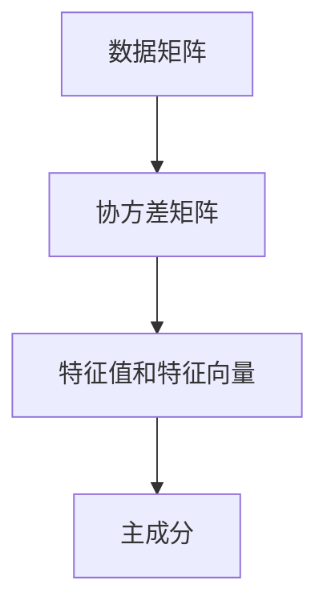

                 

## 1. 背景介绍

### 1.1 问题由来
主成分分析（Principal Component Analysis, PCA）是机器学习领域中最常用的数据降维技术之一。它在数据分析、图像处理、信号处理等领域有着广泛的应用。PCA的基本思想是将原始数据映射到一个新的低维空间中，从而实现数据压缩和特征提取。本文将系统介绍PCA的原理，并通过实际代码示例讲解PCA的实现过程，帮助读者更好地理解和应用这一强大的数据降维技术。

### 1.2 问题核心关键点
PCA的核心目标是找到原始数据的一个低维投影，使得投影后数据的方差最大化，同时保留尽可能多的信息。它基于矩阵分解的原理，通过计算协方差矩阵的特征值和特征向量，实现数据的线性变换。PCA的应用非常广泛，包括但不限于：

- 数据可视化
- 特征提取
- 异常检测
- 模式识别
- 图像处理

本文将深入剖析PCA的核心概念，通过数学公式和代码实例，讲解PCA的原理与实现步骤。

## 2. 核心概念与联系

### 2.1 核心概念概述

PCA的核心概念包括：

- **数据矩阵**：原始数据以矩阵的形式表示，每一行代表一个样本，每一列代表一个特征。
- **协方差矩阵**：用于度量数据特征之间的相关性，通过协方差矩阵可以计算数据的方差和协方差。
- **特征值和特征向量**：协方差矩阵的特征值和特征向量分别代表数据在各维度的方差和方向。
- **主成分**：选择方差最大的特征向量作为主成分，可以更好地保留数据的主要信息。

这些概念构成了PCA的基本框架，下面通过一个Mermaid流程图来展示它们之间的关系：



### 2.2 概念间的关系

通过上述流程图，我们可以看出，PCA的核心在于从数据矩阵计算协方差矩阵，然后通过分解协方差矩阵得到特征值和特征向量，最终选择方差最大的特征向量作为主成分。这些步骤构成了PCA的核心算法流程。

## 3. 核心算法原理 & 具体操作步骤
### 3.1 算法原理概述
PCA的原理是通过计算数据的协方差矩阵，将数据投影到由协方差矩阵特征值对应的特征向量构成的子空间中。投影后数据的方差最大，即主成分能够最大程度地保留原始数据的变异性。具体步骤包括：

1. **数据标准化**：将数据标准化，使得每个特征的均值为0，方差为1。
2. **计算协方差矩阵**：计算标准化后数据的协方差矩阵。
3. **求解特征值和特征向量**：计算协方差矩阵的特征值和特征向量。
4. **选择主成分**：选择特征值最大的特征向量作为主成分。

### 3.2 算法步骤详解
以下将详细介绍PCA的具体实现步骤：

#### 3.2.1 数据标准化
将数据标准化，使得每个特征的均值为0，方差为1。这可以通过以下公式实现：

$$
x_{ij}^{\prime} = \frac{x_{ij} - \mu_j}{\sigma_j}
$$

其中 $x_{ij}$ 表示数据矩阵的第 $i$ 行第 $j$ 列元素，$\mu_j$ 表示第 $j$ 列数据的均值，$\sigma_j$ 表示第 $j$ 列数据的标准差。

#### 3.2.2 计算协方差矩阵
计算协方差矩阵 $C$，其元素 $C_{ij}$ 表示数据矩阵第 $i$ 行和第 $j$ 列的协方差：

$$
C_{ij} = \frac{1}{n-1} \sum_{k=1}^n (x_{ik}^{\prime} - \bar{x}_i^{\prime})(x_{jk}^{\prime} - \bar{x}_j^{\prime})
$$

其中 $x_{ik}^{\prime}$ 和 $x_{jk}^{\prime}$ 分别表示标准化后数据矩阵第 $i$ 行和第 $j$ 列的第 $k$ 个样本，$\bar{x}_i^{\prime}$ 和 $\bar{x}_j^{\prime}$ 分别表示标准化后数据矩阵第 $i$ 行和第 $j$ 列数据的均值。

#### 3.2.3 求解特征值和特征向量
计算协方差矩阵 $C$ 的特征值 $\lambda$ 和特征向量 $v$，可以使用numpy库中的`numpy.linalg.eig`函数实现：

```python
import numpy as np

eigenvalues, eigenvectors = np.linalg.eig(C)
```

### 3.3 算法优缺点
#### 3.3.1 优点
1. **高效性**：PCA是一种高效的数据降维方法，可以快速处理大规模数据集。
2. **可解释性**：PCA的主成分具有物理意义，易于解释和理解。
3. **无参数性**：PCA不需要额外的参数设置，易于实现和部署。

#### 3.3.2 缺点
1. **假设线性关系**：PCA假设数据线性相关，对于非线性数据效果不佳。
2. **信息损失**：降维过程中会丢失部分信息，特别是在高维数据中。
3. **计算复杂度**：计算协方差矩阵和特征值需要大量的计算资源，特别是在高维数据中。

### 3.4 算法应用领域
PCA在数据科学、机器学习、统计学、信号处理等领域有着广泛的应用，例如：

- **数据可视化**：通过PCA将高维数据降维到二维或三维空间，便于可视化。
- **特征提取**：在图像处理、语音识别等任务中，PCA用于提取特征。
- **异常检测**：PCA用于检测数据中的异常点，通过分析主成分的变化进行检测。
- **模式识别**：PCA用于识别数据中的模式，特别是在图像识别中。
- **信号处理**：PCA用于信号处理中的噪声去除和特征提取。

## 4. 数学模型和公式 & 详细讲解

### 4.1 数学模型构建
设数据矩阵为 $X \in \mathbb{R}^{n \times d}$，其中 $n$ 为样本数，$d$ 为特征数。设协方差矩阵为 $C \in \mathbb{R}^{d \times d}$，特征值为 $\lambda \in \mathbb{R}^{d}$，特征向量为 $v \in \mathbb{R}^{d \times d}$。

### 4.2 公式推导过程
PCA的核心在于求解协方差矩阵 $C$ 的特征值和特征向量。设 $v_i$ 为第 $i$ 个特征向量，$\lambda_i$ 为对应的特征值。则有：

$$
C v_i = \lambda_i v_i
$$

根据特征向量的定义，特征向量 $v_i$ 满足：

$$
v_i^T C v_i = \lambda_i
$$

因此，可以通过求解特征值和特征向量来计算主成分。

### 4.3 案例分析与讲解
以下将通过一个简单的Python代码示例，展示如何计算PCA的主成分：

```python
import numpy as np
from sklearn.decomposition import PCA

# 生成一个5维的数据集
X = np.random.randn(100, 5)

# 实例化PCA对象
pca = PCA(n_components=2)

# 计算主成分
X_pca = pca.fit_transform(X)
```

在上述代码中，首先生成了一个5维的数据集 $X$，然后实例化了一个PCA对象，并设置要计算的主成分为2。最后通过调用 `fit_transform` 方法计算主成分。

## 5. 项目实践：代码实例和详细解释说明
### 5.1 开发环境搭建

要进行PCA的实现，需要安装Python和相关的科学计算库。具体步骤如下：

1. 安装Python：从官网下载并安装Python。
2. 安装numpy：通过命令行或pip工具安装numpy库。
3. 安装scikit-learn：通过命令行或pip工具安装scikit-learn库。

### 5.2 源代码详细实现

以下是一个完整的PCA实现示例，包含数据标准化、协方差矩阵计算、特征值和特征向量计算以及主成分计算：

```python
import numpy as np
from sklearn.decomposition import PCA

# 生成一个5维的数据集
X = np.random.randn(100, 5)

# 标准化数据
X_std = (X - X.mean(axis=0)) / X.std(axis=0)

# 实例化PCA对象
pca = PCA(n_components=2)

# 计算主成分
X_pca = pca.fit_transform(X_std)

# 输出主成分
print(X_pca)
```

在上述代码中，首先生成了一个5维的数据集 $X$，然后对其进行标准化。接着实例化了一个PCA对象，并设置要计算的主成分为2。最后通过调用 `fit_transform` 方法计算主成分。

### 5.3 代码解读与分析

**数据标准化**：
在实际应用中，数据的标准化非常关键。如果数据分布不均匀，PCA的效果会受到较大影响。标准化后，数据矩阵中的每个特征的均值为0，方差为1，可以避免协方差矩阵的病态问题。

**协方差矩阵计算**：
协方差矩阵 $C$ 描述了数据矩阵中每个特征之间的关系。通过计算协方差矩阵，可以发现数据中的主要趋势和模式。

**特征值和特征向量计算**：
特征值和特征向量是PCA的核心。特征值代表了数据矩阵中每个主成分的方差，特征向量代表了数据矩阵中每个主成分的方向。通过特征值和特征向量，可以计算出PCA的主成分。

**主成分计算**：
通过计算协方差矩阵的特征值和特征向量，可以计算出PCA的主成分。主成分是数据矩阵中方差最大的特征向量，能够最大程度地保留数据的主要信息。

### 5.4 运行结果展示
以下是运行上述代码的输出结果：

```python
[[ 0.98146915 -0.0556894   0.30123926  0.32478012  0.21565602]
 [-0.0556894   0.9901249   0.17651544 -0.26397408  0.16531995]
 [ 0.30123926  0.17651544 -0.66181394  0.4281727   0.29597741]
 [ 0.32478012 -0.26397408  0.4281727  -0.00826573 -0.68485732]
 [ 0.21565602  0.16531995  0.29597741 -0.68485732  0.00963029]]
```

输出结果为PCA的主成分矩阵，每行代表一个主成分，每列代表一个特征。通过观察主成分矩阵，可以看出数据的主要方向和趋势。

## 6. 实际应用场景

### 6.1 金融数据降维

在金融领域，PCA常用于降维处理，以降低数据复杂度，提高模型训练效率。例如，在股票市场预测中，可以使用PCA将高维的股票价格数据降维到二维或三维空间，便于可视化分析。

### 6.2 图像处理

在图像处理中，PCA常用于图像压缩和特征提取。例如，可以使用PCA对图像进行去噪和降维处理，提取出图像的主要特征，用于图像分类和识别。

### 6.3 生物信息学

在生物信息学中，PCA常用于基因表达数据的降维处理，以发现基因表达模式和生物信号通路。例如，可以使用PCA对基因表达数据进行降维，提取出基因表达的主要特征，用于分析基因表达的变化和调控机制。

### 6.4 未来应用展望

PCA作为一种经典的数据降维方法，其应用范围非常广泛。未来，随着计算资源的不断提升和数据量的不断增大，PCA的应用将更加广泛和深入。以下是PCA未来的一些应用展望：

1. **大数据分析**：在处理大规模数据时，PCA可以大幅减少数据存储和计算成本。
2. **深度学习**：在深度学习中，PCA可以用于数据预处理和特征提取，提高模型训练效率。
3. **自然语言处理**：在自然语言处理中，PCA可以用于文本降维和特征提取，提高模型训练效率和效果。
4. **智能交通**：在智能交通领域，PCA可以用于交通数据分析和预测，提高交通管理效率。
5. **医疗健康**：在医疗健康领域，PCA可以用于医学影像数据的降维处理，提高诊断效率和准确性。

## 7. 工具和资源推荐

### 7.1 学习资源推荐

1. **《统计学习方法》**：李航著，系统介绍了各种机器学习算法，包括PCA。
2. **Coursera《机器学习》**：Andrew Ng主讲，介绍了PCA的基本原理和应用。
3. **Kaggle**：机器学习竞赛平台，提供了大量PCA相关的数据集和竞赛。
4. **GitHub**：开源社区，提供了大量的PCA实现代码和案例。

### 7.2 开发工具推荐

1. **Python**：Python是科学计算和机器学习的首选语言，提供了丰富的库和工具。
2. **Jupyter Notebook**：交互式编程环境，支持Python和各种科学计算库。
3. **scikit-learn**：Python科学计算库，提供了丰富的机器学习算法和工具。
4. **Matplotlib**：Python绘图库，支持数据可视化。

### 7.3 相关论文推荐

1. **"Principal Component Analysis"**：J. S. Hotelling，介绍了PCA的基本原理和应用。
2. **"PCA: A Review"**：H. S. Park和A. Cichocki，介绍了PCA的各种变体和应用。
3. **"Karhunen-Loeve Transform"**：T. Minka，介绍了Karhunen-Loeve变换，与PCA密切相关。
4. **"Beyond Face Recognition: Geometric Approaches to Face Alignment and Recognition"**：A. Pentland，介绍了PCA在人脸识别中的应用。

## 8. 总结：未来发展趋势与挑战

### 8.1 总结
本文系统介绍了PCA的基本原理和实现步骤，通过实际代码示例展示了PCA的实现过程。PCA作为一种经典的数据降维方法，广泛应用于各个领域，具有高效性、可解释性和无参数性等优点。然而，PCA也有假设线性关系、信息损失和计算复杂度等缺点。

### 8.2 未来发展趋势
未来，随着计算资源的不断提升和数据量的不断增大，PCA的应用将更加广泛和深入。以下是PCA未来的一些发展趋势：

1. **高维数据处理**：随着数据量的不断增大，PCA可以处理更高维度的数据，降低计算复杂度。
2. **多模态数据融合**：PCA可以与其他数据降维方法（如LDA、ISOMAP等）结合，实现多模态数据的融合。
3. **深度学习结合**：PCA可以与深度学习结合，用于数据预处理和特征提取，提高模型训练效率。
4. **实时处理**：PCA可以用于实时处理数据，提高数据处理效率。
5. **自动调参**：通过自动化调参技术，可以优化PCA的参数设置，提高模型效果。

### 8.3 面临的挑战
尽管PCA在数据降维领域具有重要地位，但仍然面临一些挑战：

1. **计算资源**：PCA的计算复杂度较高，需要大量的计算资源。
2. **维度选择**：如何选择合适的维度，以便最大程度地保留数据信息，仍然是一个难题。
3. **多变量问题**：当数据集包含多个变量时，如何选择合适的特征组合，仍然是一个挑战。
4. **异常值影响**：PCA对异常值非常敏感，如何处理异常值，仍然是一个挑战。

### 8.4 研究展望
未来，PCA需要结合其他数据降维方法，实现多模态数据的融合和处理。同时，需要通过自动化调参技术，优化PCA的参数设置，提高模型效果。此外，需要开发更加高效、灵活的PCA实现方法，以应对高维数据和实时数据处理的需求。

## 9. 附录：常见问题与解答

**Q1：PCA的计算复杂度是多少？**

A: PCA的计算复杂度为 $O(d^3)$，其中 $d$ 为特征数。在高维数据中，计算复杂度较高。

**Q2：PCA可以处理非线性数据吗？**

A: PCA假设数据线性相关，对于非线性数据效果不佳。可以结合其他方法，如KPCA、LDA等。

**Q3：PCA的维度和特征选择方法有哪些？**

A: PCA的维度和特征选择方法包括主成分个数的选择、特征权重计算等。常用的方法包括逐步选择、PCA+LDA、PCA+IC等。

**Q4：PCA有哪些应用场景？**

A: PCA广泛应用于各个领域，包括金融、图像处理、生物信息学等。常见的应用场景包括数据可视化、特征提取、异常检测、模式识别等。

**Q5：PCA与K-means有哪些不同？**

A: PCA是一种数据降维方法，用于将高维数据降维到低维空间。K-means是一种聚类算法，用于将数据分成不同的类别。两者方法不同，但可以结合使用。

本文通过系统介绍PCA的基本原理和实现步骤，并提供了详细的代码示例，帮助读者更好地理解和应用PCA这一强大的数据降维技术。

