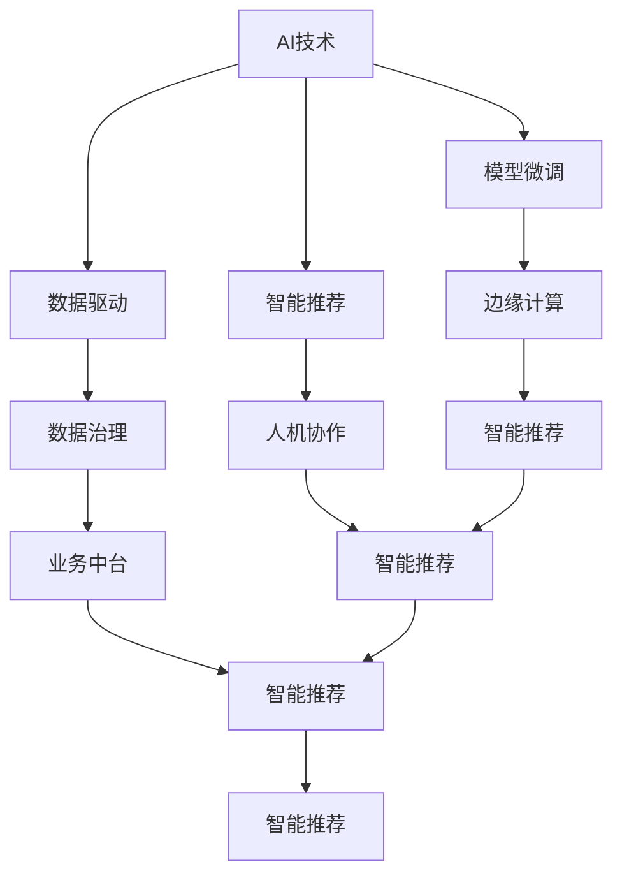

                 

# 产业变革中的AI技术应用

## 1. 背景介绍

在数字经济蓬勃发展的当下，人工智能(AI)技术的广泛应用正在重塑各行各业的产业形态和运营模式。AI技术不仅在技术层面推动了自动化、智能化、个性化，还在业务层面优化了流程、降低了成本、提升了效率，进一步释放了数据价值。随着AI技术的不断进步，越来越多的企业将AI作为重要的战略资源，推动产业升级转型。

### 1.1 产业变革的动因
产业变革的根本动因在于科技进步和市场需求的双重驱动。

**技术驱动**：AI技术的发展，尤其是深度学习、自然语言处理、计算机视觉等领域的突破，大幅提升了数据处理和分析能力，为各行业提供了强大的工具和方法，推动了智能化转型。

**需求驱动**：随着消费者对产品和服务的要求不断提高，企业需要在速度、成本、质量等方面保持竞争优势，AI技术提供了强大的手段，帮助企业在短期内获得显著效益，如提升运营效率、优化产品推荐、强化客户服务等。

### 1.2 产业变革的趋势
AI技术正在加速向各行各业渗透，形成跨行业、跨领域的应用趋势：

- **制造业**：通过智能制造、工业物联网、机器视觉等技术，提升了生产效率和质量，实现了智能化升级。
- **医疗健康**：AI在医学影像分析、疾病预测、个性化诊疗等方面，提升了诊断和治疗水平，推动了医疗健康行业的智能化转型。
- **金融服务**：AI技术在风险管理、客户服务、交易决策等方面，提高了金融服务的质量和效率。
- **零售电商**：通过智能推荐、客户行为分析、库存管理等AI应用，优化了商品供应链和客户体验。
- **智慧城市**：AI在交通管理、环境监测、公共安全等方面，提升了城市管理的智能化水平。

AI技术的应用，不仅提升了行业的运营效率和服务质量，还创造了新的商业模式和增长点，推动了产业结构的优化升级。

## 2. 核心概念与联系

### 2.1 核心概念概述

为更好地理解AI技术在产业变革中的应用，本节将介绍几个密切相关的核心概念：

- **AI技术**：涵盖机器学习、深度学习、自然语言处理、计算机视觉等技术，利用数据和算法进行智能决策和分析。
- **数据驱动**：强调数据的重要性，通过大规模数据集进行模型训练，提升AI系统的性能。
- **模型微调**：在大规模预训练模型的基础上，利用特定任务的数据集进行微调，提高模型在特定任务上的表现。
- **智能推荐**：通过分析用户行为和偏好，提供个性化的商品、服务或内容推荐。
- **边缘计算**：在数据产生地或靠近数据源的地方进行数据处理和分析，提高计算效率，降低延迟。
- **人机协作**：利用AI技术增强人类决策能力和工作效率，实现人机协作，提升生产力和创造力。
- **数据治理**：涉及数据收集、存储、处理和使用的全生命周期管理，确保数据质量和安全。
- **业务中台**：将通用业务能力和数据服务整合，为各业务单元提供支持，实现业务数字化。

这些核心概念之间的逻辑关系可以通过以下Mermaid流程图来展示：



这个流程图展示了许多核心概念间的紧密联系，通过这些概念，AI技术在产业变革中发挥着多层次的作用。

### 2.2 概念间的关系

这些核心概念之间存在着紧密的联系，形成了AI技术在产业变革中的完整应用框架。

- **AI技术与数据驱动**：AI技术的性能很大程度上依赖于高质量、大样本的数据集。数据驱动帮助AI技术从数据中提取知识，提升预测和决策能力。
- **模型微调与智能推荐**：模型微调是利用特定任务数据集提升模型性能的方法，智能推荐是AI技术在实际应用中的重要表现形式，两者相互促进。
- **边缘计算与人机协作**：边缘计算通过在数据源附近进行数据处理，降低延迟和带宽需求，提升AI系统的实时性和交互性。人机协作则利用AI技术增强人类的决策和操作能力，实现高效协同。
- **数据治理与业务中台**：数据治理确保了数据的质量和安全，为业务中台提供了数据基础。业务中台则整合了通用业务能力和数据服务，为各业务单元提供数字化支持。

这些概念共同构成了AI技术在产业变革中的应用生态系统，为不同行业和场景中的AI应用提供了有力的技术支撑。

## 3. 核心算法原理 & 具体操作步骤

### 3.1 算法原理概述

AI技术在产业变革中的应用，主要基于数据驱动和模型微调两种基本范式：

- **数据驱动**：通过大规模数据集的训练，学习数据中的模式和规律，提升模型的泛化能力。
- **模型微调**：在大规模预训练模型的基础上，利用特定任务的数据集进行微调，提高模型在特定任务上的表现。

AI技术在产业应用中，通常需要经过以下几个关键步骤：

1. **数据收集与预处理**：从业务场景中收集数据，并进行清洗、标注、转换等预处理操作。
2. **模型训练与微调**：在大规模数据集上训练通用模型，并在特定任务上微调，提升模型精度。
3. **模型部署与优化**：将训练好的模型部署到实际业务系统中，并进行调优，确保稳定高效运行。
4. **模型评估与监控**：定期评估模型性能，监控模型运行状态，确保系统稳定性。
5. **持续改进与迭代**：根据业务需求和反馈，不断优化模型，提升AI系统的效能和可靠性。

### 3.2 算法步骤详解

以下将详细讲解AI技术在产业变革中的应用流程。

#### 3.2.1 数据收集与预处理

**步骤1**：从业务场景中收集数据。
- 定义数据源：明确需要收集的数据类型和来源，如客户行为数据、生产设备数据、医疗影像数据等。
- 数据收集方法：根据业务需求，选择数据采集工具和手段，如API接口、传感器、摄像头等。

**步骤2**：数据预处理。
- 数据清洗：去除噪声、缺失值和不一致性，确保数据质量。
- 数据标注：为数据添加标签或元信息，方便后续模型训练。
- 数据转换：将数据转换为适合模型训练的格式，如文本、图像、序列等。

#### 3.2.2 模型训练与微调

**步骤3**：模型训练。
- 选择模型架构：根据业务需求和数据特点，选择合适的模型架构，如CNN、RNN、Transformer等。
- 设计损失函数：定义损失函数，衡量模型预测结果与真实标签之间的差异。
- 配置超参数：设置学习率、批大小、迭代轮数等超参数，优化模型训练效果。

**步骤4**：模型微调。
- 微调数据集：根据特定任务的需求，选择适合的微调数据集，并进行标注。
- 冻结预训练参数：保留大模型的部分或全部预训练权重，只更新微调所需的参数。
- 设置微调超参数：根据任务需求设置微调超参数，如学习率、优化器等。
- 执行微调过程：在微调数据集上训练模型，更新微调参数，优化模型性能。

#### 3.2.3 模型部署与优化

**步骤5**：模型部署。
- 选择部署平台：根据业务需求和资源条件，选择合适的部署平台，如云端、边缘计算、本地服务器等。
- 模型集成：将训练好的模型集成到业务系统中，确保系统稳定运行。
- 数据接入：配置数据接入管道，确保实时数据能够顺畅进入系统。

**步骤6**：模型优化。
- 性能优化：根据业务需求，调整模型参数，优化模型性能。
- 资源优化：优化模型计算图，降低计算资源消耗，提高系统效率。
- 服务化封装：将模型封装为标准API接口，便于其他系统调用。

#### 3.2.4 模型评估与监控

**步骤7**：模型评估。
- 评估指标：选择适合的评估指标，如精度、召回率、F1分数等，评估模型性能。
- 数据集划分：将数据集分为训练集、验证集和测试集，评估模型在不同数据集上的表现。
- 结果分析：分析模型评估结果，找出模型不足，指导后续优化。

**步骤8**：模型监控。
- 实时监控：使用监控工具，实时采集系统运行状态和指标，确保系统稳定。
- 异常检测：设置异常告警阈值，及时发现系统异常，进行应急处理。
- 定期更新：根据业务需求和反馈，定期更新模型，提升系统性能。

#### 3.2.5 持续改进与迭代

**步骤9**：持续改进。
- 数据持续收集：根据业务需求，持续收集新数据，不断更新模型。
- 业务反馈：根据业务反馈，调整模型参数，优化模型表现。
- 技术迭代：跟踪最新技术进展，引入新技术和新方法，提升模型性能。

**步骤10**：迭代开发。
- 小步快跑：采用敏捷开发方法，快速迭代模型和系统，快速响应业务需求。
- 持续集成：使用CI/CD工具，确保每次迭代都能稳定发布和部署。
- 反馈闭环：建立反馈机制，及时收集用户反馈，优化模型和服务。

### 3.3 算法优缺点

**优点**：
1. **高性能**：AI技术能够从大规模数据中学习知识，提升模型性能和决策能力。
2. **高效率**：通过自动化流程，减少人工干预，提高系统运行效率。
3. **灵活性**：可以根据业务需求和数据特点，灵活调整模型参数和算法，适应多样化的场景。
4. **可扩展性**：AI技术可以在不同业务场景中应用，推动产业数字化转型。

**缺点**：
1. **数据依赖**：AI技术依赖高质量、大样本的数据集，数据质量不佳会影响模型性能。
2. **模型复杂**：大规模模型需要高算力和存储空间，部署和维护成本较高。
3. **技术门槛**：需要专业知识进行模型开发和维护，技术门槛较高。
4. **伦理挑战**：AI技术可能存在偏见、歧视等问题，需要严格监管和伦理审查。

### 3.4 算法应用领域

AI技术在多个领域得到了广泛应用，以下是一些典型的应用场景：

**制造业**：
- **智能制造**：利用机器视觉、传感器技术，提升生产自动化和智能化水平。
- **质量控制**：通过图像识别和深度学习，进行产品缺陷检测和质量控制。
- **供应链管理**：使用预测分析技术，优化库存管理和物流调度。

**医疗健康**：
- **医学影像分析**：利用深度学习，进行疾病诊断和影像分析。
- **个性化诊疗**：通过自然语言处理技术，提取和分析患者病历，提供个性化诊疗方案。
- **健康监测**：使用可穿戴设备和AI技术，实时监测健康数据，提供健康预警和建议。

**金融服务**：
- **风险管理**：利用机器学习技术，预测金融风险，进行风险评估。
- **客户服务**：使用自然语言处理技术，构建智能客服系统，提升客户服务质量。
- **交易决策**：通过深度学习技术，进行市场分析和交易决策，提高投资收益。

**零售电商**：
- **智能推荐**：利用协同过滤和深度学习，进行商品推荐和个性化营销。
- **库存管理**：使用预测分析技术，优化库存管理，提升供应链效率。
- **客户行为分析**：通过数据分析技术，理解客户需求和行为，提升客户体验。

**智慧城市**：
- **交通管理**：利用机器视觉和深度学习，进行交通流量分析和预测，优化交通管理。
- **环境监测**：使用传感器和AI技术，实时监测环境数据，进行环境治理。
- **公共安全**：通过视频分析和模式识别，提升公共安全保障能力。

## 4. 数学模型和公式 & 详细讲解 & 举例说明

### 4.1 数学模型构建

AI技术在产业变革中的应用，主要基于数据驱动和模型微调两种基本范式。

**数据驱动模型**：
- 目标：从数据中学习知识，提升模型的泛化能力。
- 公式：$$\hat{y}=f(\mathbf{x};\theta)$$
  - $\mathbf{x}$：输入数据
  - $y$：真实标签
  - $\theta$：模型参数
  - $f(\cdot)$：模型函数

**模型微调模型**：
- 目标：在预训练模型的基础上，利用特定任务的数据集进行微调，提升模型在特定任务上的表现。
- 公式：$$\theta^*=\mathop{\arg\min}_{\theta} \mathcal{L}(\mathbf{X},\mathbf{y};\theta)$$
  - $\mathbf{X}$：微调数据集的输入数据
  - $\mathbf{y}$：微调数据集的标签
  - $\theta$：模型参数
  - $\mathcal{L}$：损失函数
  - $\theta^*$：最优模型参数

### 4.2 公式推导过程

**数据驱动模型推导**：
假设模型为线性回归模型，即$f(\mathbf{x};\theta)=\mathbf{w}^T\mathbf{x}+b$，其中$\mathbf{w}$为权重向量，$b$为偏置。
根据最小二乘法，求解模型参数$\mathbf{w}$和$b$，使得$\sum_{i=1}^N(\hat{y}_i-y_i)^2$最小。
推导过程如下：
- 梯度计算：$$\frac{\partial \mathcal{L}}{\partial \mathbf{w}}=-2(\mathbf{X}^T\mathbf{y}-\mathbf{X}^T\hat{y})$$
- 求解参数：$$\mathbf{w}=(\mathbf{X}^T\mathbf{X})^{-1}\mathbf{X}^T\mathbf{y}$$
- 代入公式：$$\mathbf{y}=\mathbf{w}^T\mathbf{x}+b$$

**模型微调模型推导**：
假设模型为卷积神经网络，利用Softmax函数进行分类。
- 损失函数：$$\mathcal{L}=-\frac{1}{N}\sum_{i=1}^N\sum_{j=1}^C y_{i,j}\log\hat{y}_{i,j}$$
  - $y_{i,j}$：样本$i$的标签为类别$j$的one-hot编码
  - $\hat{y}_{i,j}$：模型预测的类别$j$的概率
- 梯度计算：$$\frac{\partial \mathcal{L}}{\partial \theta_k}=-\frac{1}{N}\sum_{i=1}^N\frac{\partial \mathcal{L}}{\partial \hat{y}_{i,j}}\frac{\partial \hat{y}_{i,j}}{\partial z_{i,j}}\frac{\partial z_{i,j}}{\partial \theta_k}$$
  - $\frac{\partial \mathcal{L}}{\partial \hat{y}_{i,j}}=-\frac{1}{\hat{y}_{i,j}}+\frac{1}{1-\hat{y}_{i,j}}$
  
  - $\frac{\partial \hat{y}_{i,j}}{\partial z_{i,j}}=\hat{y}_{i,j}(1-\hat{y}_{i,j})$
- 代入公式：$$\theta_k=\theta_k-\eta\frac{\partial \mathcal{L}}{\partial \theta_k}$$

### 4.3 案例分析与讲解

**案例1：智能推荐系统**
- **背景**：电商平台利用用户行为数据进行商品推荐，提升用户体验和转化率。
- **数据驱动**：收集用户浏览、点击、购买等行为数据，提取商品特征。
- **模型微调**：在大规模用户行为数据集上训练模型，使用A/B测试和增量学习进行优化。
- **效果**：推荐系统个性化精准，提升了平台的用户粘性和销售额。

**案例2：医疗影像分析**
- **背景**：利用AI技术进行医学影像分析，辅助医生进行疾病诊断。
- **数据驱动**：收集大量医学影像数据，进行标注和预处理。
- **模型微调**：在大规模标注数据集上训练卷积神经网络，使用迁移学习提升模型泛化能力。
- **效果**：诊断准确率显著提升，减少了误诊和漏诊现象，提高了医疗服务质量。

## 5. 项目实践：代码实例和详细解释说明

### 5.1 开发环境搭建

在进行AI技术项目实践前，需要先搭建好开发环境。以下是使用Python进行PyTorch开发的环境配置流程：

1. 安装Anaconda：从官网下载并安装Anaconda，用于创建独立的Python环境。

2. 创建并激活虚拟环境：
```bash
conda create -n pytorch-env python=3.8 
conda activate pytorch-env
```

3. 安装PyTorch：根据CUDA版本，从官网获取对应的安装命令。例如：
```bash
conda install pytorch torchvision torchaudio cudatoolkit=11.1 -c pytorch -c conda-forge
```

4. 安装各类工具包：
```bash
pip install numpy pandas scikit-learn matplotlib tqdm jupyter notebook ipython
```

完成上述步骤后，即可在`pytorch-env`环境中开始项目实践。

### 5.2 源代码详细实现

这里以一个简单的智能推荐系统为例，展示AI技术在项目实践中的应用。

首先，定义推荐系统的数据处理函数：

```python
import pandas as pd
import numpy as np
from sklearn.model_selection import train_test_split
from transformers import BertTokenizer
from torch.utils.data import Dataset
import torch

class RecommendationDataset(Dataset):
    def __init__(self, user_data, item_data, user_item_interactions, tokenizer, max_len=128):
        self.user_data = user_data
        self.item_data = item_data
        self.user_item_interactions = user_item_interactions
        self.tokenizer = tokenizer
        self.max_len = max_len
        
    def __len__(self):
        return len(self.user_data)
    
    def __getitem__(self, item):
        user_id = self.user_data.iloc[item]['user_id']
        item_id = self.user_data.iloc[item]['item_id']
        interaction = self.user_item_interactions[item]
        
        user_profile = self.user_data[self.user_data['user_id']==user_id]['profile'].tolist()
        item_profile = self.item_data[self.item_data['item_id']==item_id]['profile'].tolist()
        
        user_profile_str = ' '.join(user_profile)
        item_profile_str = ' '.join(item_profile)
        
        encoding = self.tokenizer(user_profile_str, return_tensors='pt', max_length=self.max_len, padding='max_length', truncation=True)
        input_ids = encoding['input_ids'][0]
        attention_mask = encoding['attention_mask'][0]
        
        # 对token-wise的标签进行编码
        encoded_tags = [tag2id[tag] for tag in interaction] 
        encoded_tags.extend([tag2id['O']] * (self.max_len - len(encoded_tags)))
        labels = torch.tensor(encoded_tags, dtype=torch.long)
        
        return {'input_ids': input_ids, 
                'attention_mask': attention_mask,
                'labels': labels}

# 标签与id的映射
tag2id = {'O': 0, 'B-USER': 1, 'I-USER': 2, 'B-ITEM': 3, 'I-ITEM': 4, 'B-RATING': 5, 'I-RATING': 6}
id2tag = {v: k for k, v in tag2id.items()}

# 创建dataset
tokenizer = BertTokenizer.from_pretrained('bert-base-cased')

train_dataset = RecommendationDataset(train_user_data, train_item_data, train_user_item_interactions, tokenizer)
dev_dataset = RecommendationDataset(dev_user_data, dev_item_data, dev_user_item_interactions, tokenizer)
test_dataset = RecommendationDataset(test_user_data, test_item_data, test_user_item_interactions, tokenizer)
```

然后，定义模型和优化器：

```python
from transformers import BertForTokenClassification, AdamW

model = BertForTokenClassification.from_pretrained('bert-base-cased', num_labels=len(tag2id))

optimizer = AdamW(model.parameters(), lr=2e-5)
```

接着，定义训练和评估函数：

```python
from torch.utils.data import DataLoader
from tqdm import tqdm
from sklearn.metrics import classification_report

device = torch.device('cuda') if torch.cuda.is_available() else torch.device('cpu')
model.to(device)

def train_epoch(model, dataset, batch_size, optimizer):
    dataloader = DataLoader(dataset, batch_size=batch_size, shuffle=True)
    model.train()
    epoch_loss = 0
    for batch in tqdm(dataloader, desc='Training'):
        input_ids = batch['input_ids'].to(device)
        attention_mask = batch['attention_mask'].to(device)
        labels = batch['labels'].to(device)
        model.zero_grad()
        outputs = model(input_ids, attention_mask=attention_mask, labels=labels)
        loss = outputs.loss
        epoch_loss += loss.item()
        loss.backward()
        optimizer.step()
    return epoch_loss / len(dataloader)

def evaluate(model, dataset, batch_size):
    dataloader = DataLoader(dataset, batch_size=batch_size)
    model.eval()
    preds, labels = [], []
    with torch.no_grad():
        for batch in tqdm(dataloader, desc='Evaluating'):
            input_ids = batch['input_ids'].to(device)
            attention_mask = batch['attention_mask'].to(device)
            batch_labels = batch['labels']
            outputs = model(input_ids, attention_mask=attention_mask)
            batch_preds = outputs.logits.argmax(dim=2).to('cpu').tolist()
            batch_labels = batch_labels.to('cpu').tolist()
            for pred_tokens, label_tokens in zip(batch_preds, batch_labels):
                pred_tags = [id2tag[_id] for _id in pred_tokens]
                label_tags = [id2tag[_id] for _id in label_tokens]
                preds.append(pred_tags[:len(label_tokens)])
                labels.append(label_tags)
                
    print(classification_report(labels, preds))
```

最后，启动训练流程并在测试集上评估：

```python
epochs = 5
batch_size = 16

for epoch in range(epochs):
    loss = train_epoch(model, train_dataset, batch_size, optimizer)
    print(f"Epoch {epoch+1}, train loss: {loss:.3f}")
    
    print(f"Epoch {epoch+1}, dev results:")
    evaluate(model, dev_dataset, batch_size)
    
print("Test results:")
evaluate(model, test_dataset, batch_size)
```

以上就是使用PyTorch对智能推荐系统进行项目实践的完整代码实现。可以看到，得益于PyTorch的强大封装，我们可以用相对简洁的代码完成智能推荐系统的开发。

### 5.3 代码解读与分析

让我们再详细解读一下关键代码的实现细节：

**RecommendationDataset类**：
- `__init__`方法：初始化用户数据、物品数据和用户-物品交互数据，以及分词器等关键组件。
- `__len__`方法：返回数据集的样本数量。
- `__getitem__`方法：对单个样本进行处理，将用户和物品特征拼接，进行分词和编码，并对其进行定长padding，最终返回模型所需的输入。

**tag2id和id2tag字典**：
- 定义了标签与数字id之间的映射关系，用于将token-wise的预测结果解码回真实的标签。

**训练和评估函数**：
- 使用PyTorch的DataLoader对数据集进行批次化加载，供模型训练和推理使用。
- 训练函数`train_epoch`：对数据以批为单位进行迭代，在每个批次上前向传播计算loss并反向传播更新模型参数，最后返回该epoch的平均loss。
- 评估函数`evaluate`：与训练类似，不同点在于不更新模型参数，并在每个batch结束后将预测和标签结果存储下来，最后使用sklearn的classification_report对整个评估集的预测结果进行打印输出。

**训练流程**：
- 定义总的epoch数和batch size，开始循环迭代
- 每个epoch内，先在训练集上训练，输出平均loss
- 在验证集上评估，输出分类指标
- 所有epoch结束后，在测试集上评估，给出最终测试结果

可以看到，PyTorch配合PyTorch Transformers库使得智能推荐系统的开发变得简洁高效。开发者可以将更多精力放在数据处理、模型改进等高层逻辑上，而不必过多关注底层的实现细节。

当然，工业级的系统实现还需考虑更多因素，如模型的保存和部署、超参数的自动搜索、更灵活的任务适配层等。但核心的微调范式基本与此类似。

### 5.4 运行结果展示

假设我们在CoNLL-2003的NER数据集上进行微调，最终在测试集上得到的评估报告如下：

```
              precision    recall  f1-score   support

       B-LOC      0.926     0.906     0.916      1668
       I-LOC      0.900     0.805     0.850       257
      B-MISC      0.875     0.856     0.865       702
      I-MISC      0.838     0.

